<properties
    pageTitle="Apache vihar oktatóprogram: első lépések a vihar |} Microsoft Azure"
    description="Első lépések a nagy adatok analytics Apache vihar és a minták vihar Starter használata hdinsight szolgáltatásból lehetőségre. Megtudhatja, hogy miként vihar segítségével folyamat adatainak valós időben."
    keywords="Apache vihar, apache vihar oktatóprogram, nagy adatok analytics, vihar starter"
    services="hdinsight"
    documentationCenter=""
    authors="Blackmist"
    manager="jhubbard"
    editor="cgronlun"
    tags="azure-portal"/>

<tags
   ms.service="hdinsight"
   ms.devlang="java"
   ms.topic="article"
   ms.tgt_pltfrm="na"
   ms.workload="big-data"
   ms.date="09/07/2016"
   ms.author="larryfr"/>

# Apache vihar oktatóprogram: első lépések a vihar Starter minták HDInsight a nagy adatok elemzéséhez

Apache vihar méretezhető, hibafa alternatív, elosztott, valós idejű számítási rendszer feldolgozásához adatok adatfolyam megjelenítését. A Microsoft Azure hdinsight szolgáltatáshoz a vihar felhőalapú vihar fürt valós idejű adatok nagy analytics végrehajtott hozhat létre. 

> [AZURE.NOTE] Az ebben a cikkben leírt lépéseket a Windows-alapú HDInsight fürt létrehozása. Megtudhatja, hogy a hozzon létre egy Linux-alapú vihar HDInsight fürt, [Apache vihar oktatóprogram: első lépések az adatok analytics használata HDInsight vihar Starter minta](hdinsight-apache-storm-tutorial-get-started-linux.md)

## Előfeltételek

[AZURE.INCLUDE [delete-cluster-warning](../../includes/hdinsight-delete-cluster-warning.md)]

Az alábbi módon Apache vihar oktatóprogram fejeződik be kell rendelkeznie:

- **Az Azure-előfizetés**. Lásd: [Ismerkedés az Azure ingyenes próbaverziót](https://azure.microsoft.com/documentation/videos/get-azure-free-trial-for-testing-hadoop-in-hdinsight/).

### Access-ellenőrzési követelmények

[AZURE.INCLUDE [access-control](../../includes/hdinsight-access-control-requirements.md)]

## Vihar fürt létrehozása

A HDInsight vihar Azure Blob-tárolóhoz használ, a naplófájlokat és a fürt elé topológiák tárolásához. Az Azure tárterület-fiók használata a fürt létrehozásához kövesse az alábbi lépéseket:

1. Jelentkezzen be az [Azure portál][preview-portal].

2. Válassza az **Új**, jelölje be az __Adatok Analytics__, és válassza a __hdinsight szolgáltatásból lehetőségre__.

    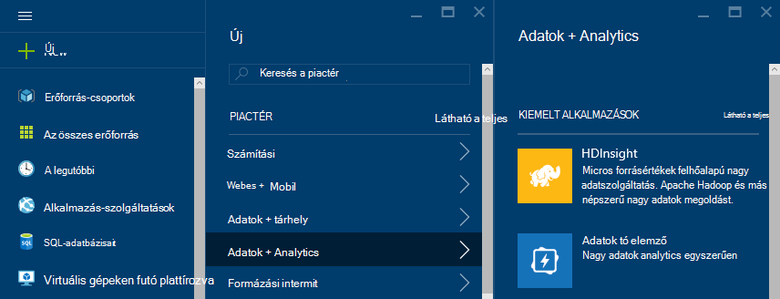

3. Írja be a __csoport nevét__. Egy zöld színű pipa jel __Fürt neve__ mellett jelenik meg, ha a érhető el.

4. Ha egynél több előfizetése van, jelölje ki a __előfizetés__ jelölje ki az Azure előfizetés a fürt használt.

5.  __Jelölje ki fürt típus__ használatával válassza ki a __vihar__ csoportját. Az __operációs rendszer__jelölje ki a Windows. __Réteg fürt__válassza a normál. Végezetül használja a Kijelölés gombra az beállítások mentéséhez.

    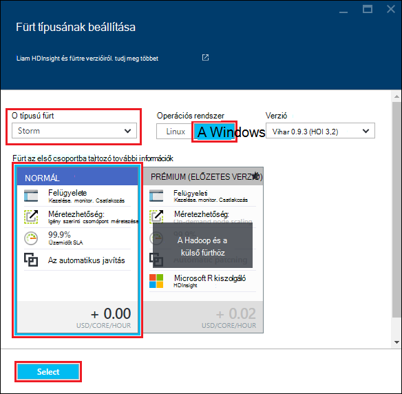

5. __Erőforráscsoport__is velünk a legördülő listára, majd jelölje be azt, hozza létre a meglévő erőforrás csoportok listájának megtekintése. Vagy írja be az új erőforrás-csoport nevét, és válassza az __Új__ . Egy zöld pipa jelzi, ha érhető el az új csoport nevének jelenik meg.

6. Jelölje be a __hitelesítő adatait__, és írja be a __Fürt bejelentkezési felhasználónév__ és a __Fürt Adatbázisjelszó__. Végül __Válassza a__ beállításához használja a hitelesítő adatokat. Távoli asztali nem használható a dokumentumban, akkor hagyja letiltva.

    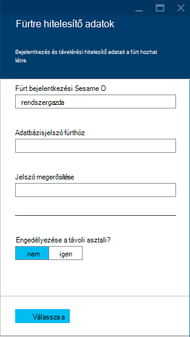

6. __Adatforrás__jelölje ki a bejegyzést, válassza ki a meglévő adatforrásból listában, vagy hozzon létre egy újat.

    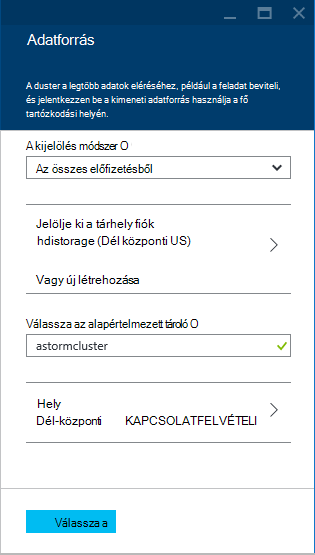

    Egy HDInsight fürt adatforrásként jelenleg is jelöljön ki egy Azure tárterület-fiókot. Használja a következő oldalon az __Adatforrás__ lap megértéséhez.

    - __Kiválasztás módja__: az __összes előfizetésekről__ ahhoz, hogy a tárhely fiókok az előfizetések böngészési ezeket a beállításokat. Ha be szeretné írni a __Tárhely neve__ és a meglévő tároló fiók __Hívóbetű__ állítsa __Hívóbetű__ .

    - __Új létrehozása__: Ezzel a paranccsal új tárterület-fiók létrehozása. Használja a mezőt, amely megjelenik a tárterület-fiókja nevét. Egy zöld színű pipa jel jelenik meg, ha a név érhető el.

    - __Alapértelmezett tároló kiválasztása__: Ezzel a paranccsal adja meg a fürt használandó alapértelmezett tárolóját nevét. Egy tetszőleges nevet itt adhatja meg, amíg használata javasolt, mert ugyanazt a nevet a fürt, hogy könnyen megjegyezhető szolgál, hogy a tároló a adott fürt számára.

    - __Hely__: A földrajzi területhez tartozik, amely a tárterület-fiókot, vagy jön létre.

        > [AZURE.IMPORTANT] Jelölje ki az alapértelmezett adatforrás helyét is a HDInsight fürt helyének állítja be. A fürt és az alapértelmezett adatforrás ugyanabban a régióban kell lennie.

    - __Válassza a__: Ezzel a paranccsal mentheti az adatforrás konfigurációját.

7. Jelölje ki a __Csomópont árak rétegek__ létrejön a fürt csomópontok kapcsolatos információk megjelenítéséhez. Alapértelmezés szerint dolgozó csomópontok számának __4__értéke. Ezeket a beállításokat __1__, hogy ez ebben az oktatóanyagban elegendő és csökkenti a fürt költségét. Ez a lap alján a becsült költsége a fürt jelenik meg.

    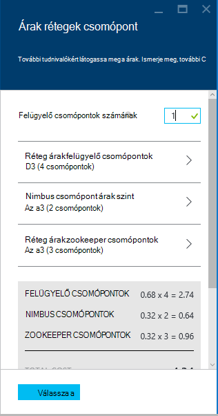

    Használja a __Kijelölés__ __Csomópont árak rétegek__ adatok mentéséhez.

8. Válassza a __nem kötelező beállítást__. Ez a lap segítségével válassza ki a fürt verziót, valamint egyéb választható beállítások, mint, például egy __Virtuális hálózati__csatlakozás.

    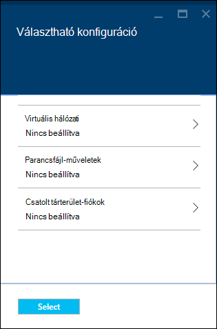

9. Győződjön meg arról, hogy a __PIN-kód Startboard__ választógombot, és válassza a __Létrehozás__. Ez a fürt hoz létre, és felveszi mozaik, az Azure portálja Startboard. Az ikon azt jelzi, hogy a fürt kiépítési van, a egyszer kiépítési HDInsight ikon megjelenítése módosításai befejeződött.

  	| Miközben kiépítése | Teljes kiépítése |
  	| ------------------ | --------------------- |
  	|  | 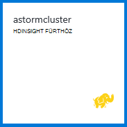 |

    > [AZURE.NOTE] Egy kis időt, a fürt hozható létre, általában körülbelül 15 percet vesz igénybe. Ellenőrizheti a kiépítési folyamat használata a Startboard vagy a a lap bal szélén, az __értesítések__ eleme a csempére.

## Mintaként szolgáló vihar Starter futtathatnak HDInsight

Ebben az oktatóanyagban Apache vihar bemutatja a nagy adatok analytics GitHub vihar Starter minták használatával.

Minden egyes vihar HDInsight fürt megtalálható a vihar irányítópult, amely tölthet fel, és futtassa a fürt vihar topológiák is használható. Minden fürt közvetlenül az vihar irányítópult futtatását is lehetővé teszi, a minta topológiák is megtalálható.

### Csatlakozás az irányítópulton

Az irányítópult a következő helyen található **https://&lt;clustername >.azurehdinsight.net//**, ahol a **clustername** a csoport nevére. Az Irányítópult hivatkozás kiválasztása a fürt a Startboard, és válassza az __Irányítópult__ hivatkozásra a lap tetején is megtalálhatók.

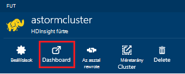

> [AZURE.NOTE] Az irányítópult csatlakozáskor a felhasználónév és jelszó megadását kéri. Ez az a rendszergazda nevét (**rendszergazda**) és a csoport létrehozásakor használt jelszót.

Miután vihar irányítópult betöltött, a **Topológia elküldése** képernyő jelenik meg.

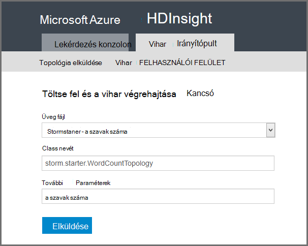

A **Topológia elküldése** űrlap tölthet fel, és a Futtatás vihar topológiák tartalmazó .jar fájlok használható. A fürt által biztosított több egyszerű mintát is tartalmaz.

### A szószám minta futtatása a GitHub vihar Starter projektből

A minták ellátni a fürt hozzáadása egy word-számlálás topológia több változatát. Ezek a minták tartalmaz egy **spout** , amely véletlenszerűen bocsát ki a mondatok, valamint **bolts** minden mondat szétválasztani külön szavakra, majd a minden szó történt, hány alkalommal megszámolása. Ezek a minták van a [vihar Starter minták](https://github.com/apache/storm/tree/master/examples/storm-starter)Apache vihar egy részét képező.

Végezze el a vihar Starter mintát szeretné futtatni, az alábbi lépéseket:

1. Jelölje ki a **Fájl Jar** legördülő **StormStarter - WordCount** . Ez feltölti a **Osztálynév** és **További paramétereket** mezők az alábbi példa a paraméterrel.

    

    * **Osztálynév** - az osztály elküldi a topológia .jar fájlban.
    * **További paramétereket** - követel meg a topológia paramétereket. Ebben a példában a mezővel rövid nevezze el a beküldött topológiában.

2. Kattintson a **Küldés**gombra. Után egy kis időt az **eredmény** mező a projekt, valamint a parancs az eredmények küldése parancs jeleníti meg. A **hiba** mezőben látható a előforduló hibák elküldése a topológia.

    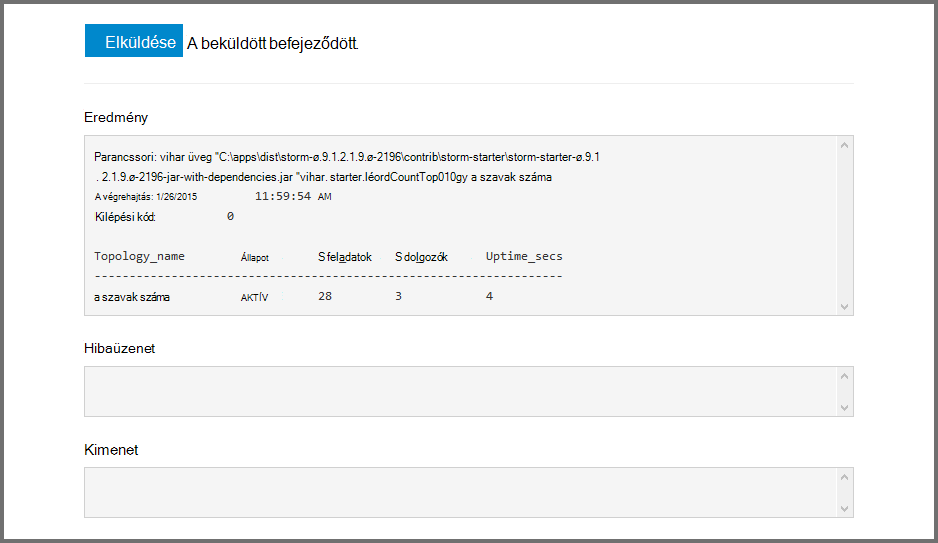

    > [AZURE.NOTE] Az eredmények nem jelzik, hogy a topológia befejeződött – **egy vihar topológia, miután elindult, fut, amíg a következő megakadályozhatja, hogy azt.** A szószám topológia véletlen mondatot hoz létre, és továbbra is, amelyekkel találkozik egyes a word, akkor bezárásáig hány alkalommal számának.

### A topológia monitor

A felhasználói felület vihar a topológia követésére használható.

1. Jelölje ki a **Vihar felhasználói felület** vihar irányítópult tetején. Ekkor megjelenik a fürt és minden futó topológiák az összegzett adatokat.

    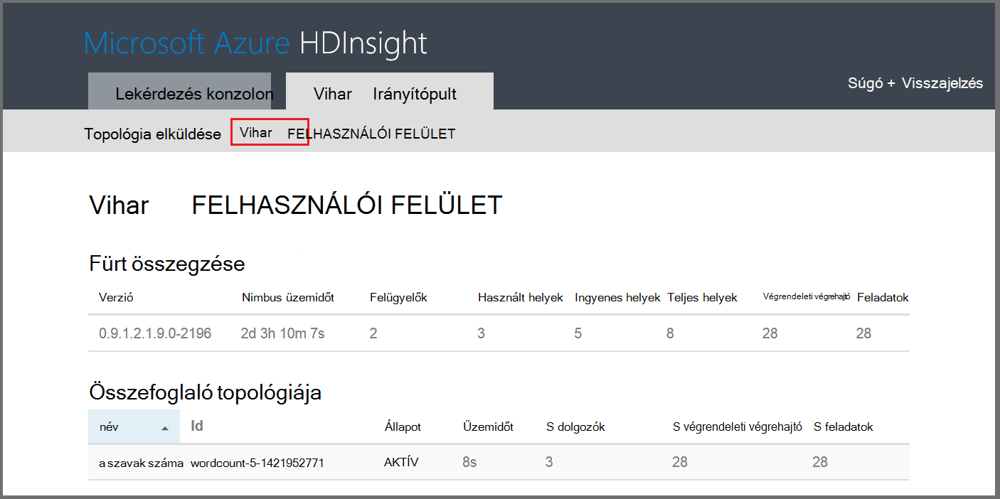

    A fenti lapon megtekintheti az időt, a topológia aktiválása óta, valamint a munkatársaival, végrendeleti végrehajtó és használatban tevékenységek száma.

    > [AZURE.NOTE] A **név** oszlopban a **További paramétereket** mező keresztül korábban megadott rövid nevét tartalmazza.

4. Az **összefoglaló topológia**jelölje ki a **wordcount** a **név** oszlopban. További információt a topológia megjelenik.

    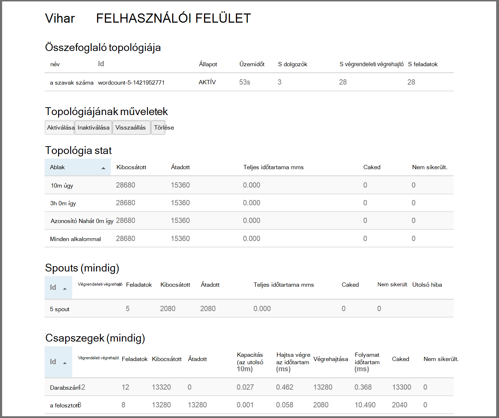

    Ezen az oldalon az alábbi információk találhatók:

    * **Topológia stat** – a topológia teljesítményére alapvető információ idő windows vannak rendezve.

        > [AZURE.NOTE] Egy adott időtartomány kijelölése módosítja a időkeret információt a lap más részén jelennek meg.

    * **Spouts** - spouts, beleértve az utolsó hibát eredményeként kapott valamennyi spout vonatkozó alapadatok.

    * **Bolts** - csapszegek vonatkozó alapadatok.

    * **Topológiájának konfigurálása** – a topológia konfigurációs részletes adatait.

    Ezen az oldalon a műveleteket, amelyeket a topológia meg lehessen hozni is tartalmazza:

    * **Aktiválás** – egy inaktiválva topológia önéletrajzok feldolgozása.

    * **Inaktiválás** - felfüggeszti a futó topológiában.

    * A párhuzamos a topológia **visszaállás** - állítja be. A futó topológiák kell visszaállás, miután módosította a fürt csomópontok számának. A párhuzamos-e a fürt csomópontok növekedett vagy csökkent számának kompenzálja topológiát lehetővé teszi. További információ a [egy vihar topológiájának a párhuzamos ismertetése](http://storm.apache.org/documentation/Understanding-the-parallelism-of-a-Storm-topology.html)című cikk nyújt.

    * Egy vihar topológia **törlése** - megszakítja az megadott idő után.

5. Ezen a lapon jelölje ki egy bejegyzést a **Spouts** vagy **Bolts** szakaszából. Ez a kijelölt összetevő információkat jelenít meg.

    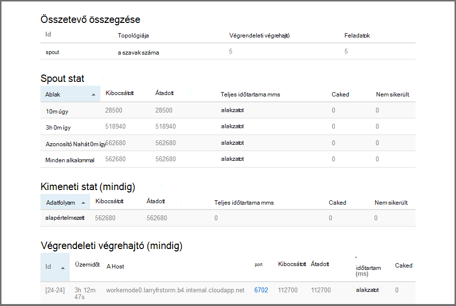

    Ezen a lapon látható az alábbi adatokat:

    * **Spout/rögzített stat** - összetevő teljesítményére alapvető információ idő windows vannak rendezve.

        > [AZURE.NOTE] Egy adott időtartomány kijelölése módosítja a időkeret információt a lap más részén jelennek meg.

    * **Beviteli stat** (csak szög) - összetevők, a rögzített felhasznált adatok okozó olvashat.

    * **Kimeneti stat** - adatok a rögzített által kibocsátott olvashat.

    * **Végrendeleti végrehajtó** - példányok az összetevő olvashat.

    * **Hibák** - összetevő készített hibákat.

5. A részletek spout vagy rögzített megtekintésekor jelölje ki egy bejegyzést a **Port** oszlop az **végrendeleti végrehajtó** szakasz az összetevő példányára részleteinek megtekintése.

        2015-01-27 14:18:02 b.s.d.task [INFO] Emitting: split default ["with"]
        2015-01-27 14:18:02 b.s.d.task [INFO] Emitting: split default ["nature"]
        2015-01-27 14:18:02 b.s.d.executor [INFO] Processing received message source: split:21, stream: default, id: {}, [snow]
        2015-01-27 14:18:02 b.s.d.task [INFO] Emitting: count default [snow, 747293]
        2015-01-27 14:18:02 b.s.d.executor [INFO] Processing received message source: split:21, stream: default, id: {}, [white]
        2015-01-27 14:18:02 b.s.d.task [INFO] Emitting: count default [white, 747293]
        2015-01-27 14:18:02 b.s.d.executor [INFO] Processing received message source: split:21, stream: default, id: {}, [seven]
        2015-01-27 14:18:02 b.s.d.task [INFO] Emitting: count default [seven, 1493957]

    Az adatok alapján láthatja, hogy a word **hét** történt 1,493,957 időpontokat. Ez a topológia kezdete óta történt, hány alkalommal.

### A topológia leállítása

Térjen vissza a a szószám topológia az **összefoglaló topológia** lapjára, és válassza **törlése** a **topológia műveletek** szakaszából. Amikor a rendszer kéri, adja meg a másodperc várakozás után a topológia leállítása 10. A határidő lejárta után a topológia már nem jelenik meg, olvassa el az irányítópult **Vihar felhasználói felület** szakaszt.

##A csoport törlése

[AZURE.INCLUDE [delete-cluster-warning](../../includes/hdinsight-delete-cluster-warning.md)]

## Összefoglalás

Az oktatóprogram Apache vihar használva a vihar Starter megtudhatja, hogy miként hozzon létre egy vihar HDInsight fürt, és használja a vihar irányítópult telepíthető, figyelésére és vihar topológiák kezelése.

## Következő lépések

* **HDInsight Tools for Visual Studio** - HDInsight eszközök lehetővé teszi a Visual Studio segítségével elküldése, figyelésére és az imént említett korábbi vihar irányítópult hasonló vihar topológiák kezelése. HDInsight eszközök is lehetővé teszi a C# vihar topológiák létrehozása és minta topológiák üzembe helyezéséhez, és futtassa a fürt tartalmazza.

    További tudnivalókért lásd: [első lépések eszközeivel HDInsight for Visual Studio](hdinsight-hadoop-visual-studio-tools-get-started.md).

* **Mintafájlok** – a HDInsight vihar fürt több példákat mutat be a **%STORM_HOME%\contrib** címtárban. Minden egyes példa tartalmaznia kell a következő:

    * A forráskód – például vihar-starter – 0.9.1.2.1.5.0-2057-sources.jar

    * Java dokumentumok – például vihar-starter – 0.9.1.2.1.5.0-2057-javadoc.jar

    * A példa – például storm-starter-0.9.1.2.1.5.0-2057-jar-with-dependencies.jar

    Bontsa ki a forráskód vagy Java-dokumentumokat a "üveg" paranccsal. Ha például "üveg - xvf vihar-starter – 0.9.1.2.1.5.0.2057-javadoc.jar".

    > [AZURE.NOTE] Java-dokumentumok weblapokra állnak. Miután kibontása, használjon másik böngészőt **index.html** fájl megtekintésére.

    Ezek a minták eléréséhez engedélyezése a távoli asztali a vihar HDInsight fürt az, és ezután másolja a fájlok **%STORM_HOME%\contrib**.

* A következő dokumentumot további példákat a HDInsight vihar használható listáját tartalmazza:

    * [Példa a HDInsight vihar topológiát](hdinsight-storm-example-topology.md)

[apachestorm]: https://storm.incubator.apache.org
[stormdocs]: http://storm.incubator.apache.org/documentation/Documentation.html
[stormstarter]: https://github.com/apache/storm/tree/master/examples/storm-starter
[stormjavadocs]: https://storm.incubator.apache.org/apidocs/
[azureportal]: https://manage.windowsazure.com/
[hdinsight-provision]: hdinsight-provision-clusters.md
[preview-portal]: https://portal.azure.com/
