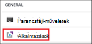
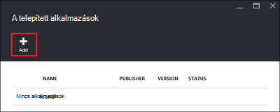
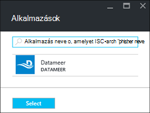
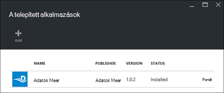

<properties
    pageTitle="A HDInsight Hadoop-alkalmazások telepítése |} Microsoft Azure"
    description="Megtudhatja, hogy miként HDInsight-alkalmazások telepítése a HDInsight-alkalmazásokat."
    services="hdinsight"
    documentationCenter=""
    authors="mumian"
    manager="jhubbard"
    editor="cgronlun"
    tags="azure-portal"/>

<tags
    ms.service="hdinsight"
    ms.devlang="na"
    ms.topic="hero-article"
    ms.tgt_pltfrm="na"
    ms.workload="big-data"
    ms.date="09/14/2016"
    ms.author="jgao"/>

# HDInsight-alkalmazások telepítése

A HDInsight alkalmazás be olyan alkalmazás, amely a Linux-alapú HDInsight fürthöz telepíthetik a felhasználók. Ezeket az alkalmazásokat a Microsoft, független gyártók (külső), illetve saját maga is készüljön. Ebben a cikkben megtanulhatja, hogyan telepítheti a közzétett alkalmazás. A saját alkalmazások telepítése, lásd: [egyéni HDInsight-alkalmazások telepítése](hdinsight-apps-install-custom-applications.md). 

Jelenleg csak egy közzétett alkalmazás:

- **Datameer**: [Datameer](http://www.datameer.com/documentation/display/DAS50/Home?ls=Partners&lsd=Microsoft&c=Partners&cd=Microsoft) kínál elemzők felfedezése, elemezheti és ábrázolása az eredmények adatokon nagy egy interaktív módon. Húzza a további adatforrásokat egyszerűen Fedezze fel új kapcsolatokat, és a megfelelő választ, gyorsan el.

>[AZURE.NOTE] Datameer jelenleg csak az Azure hdinsight szolgáltatáshoz verzió 3,2 fürt támogat.

Ez a cikk utasításait Azure portálon használja. Az erőforrás-kezelő Azure-sablon exportálása a portálon vagy az erőforrás-kezelő sablon másolatának beszerzése szállítóktól, és használatával Azure PowerShell és Azure CLI a sablont.  Lásd: [az erőforrás-kezelő sablonokkal HDInsight fürtök létrehozása Linux-alapú Hadoop](hdinsight-hadoop-create-linux-clusters-arm-templates.md).

## Előfeltételek

Ha szeretne egy meglévő HDInsight fürt HDInsight-alkalmazások telepítése, egy HDInsight fürthöz kell rendelkeznie. Hozhat létre egyet, olvassa el a [fürt létrehozása](hdinsight-hadoop-linux-tutorial-get-started.md#create-cluster)című témakört. Amikor létrehoz egy HDInsight fürthöz HDInsight-alkalmazások is telepítheti.

## Meglévő fürt alkalmazások telepítése

Az alábbi eljárás bemutatja, hogyan telepítheti a meglévő HDInsight fürthöz HDInsight-alkalmazások.

**Az HDInsight-alkalmazások telepítése**

1. Jelentkezzen be az [Azure-portálon](https://portal.azure.com).
2. Kattintson a bal oldali menü **Fürt hdinsight szolgáltatásból lehetőségre** .  Ha nem látható, kattintson a **Tallózás gombra**, és válassza a **HDInsight fürt**.
3. Kattintson egy HDInsight fürtre.  Ha nincs telepítve egyik, létre kell hoznia egy első.  Lásd: [létrehozása fürt](hdinsight-hadoop-linux-tutorial-get-started.md#create-cluster).
4. Kattintson a **Beállítások** lap **alkalmazások** csoportban az **Általános** kategóriát. A **Telepített alkalmazások** lap a telepített alkalmazások listája. 

    

5. A lap menüben kattintson a **Hozzáadás** gombra. 

    

    Kell látni egy meglévő HDInsight-alkalmazások listájából.

    

6. Kattintson az egyik alkalmazásából, fogadja el a jogi szerződést, és kattintson a **Kijelölés**gombra.

Megjelenik a telepítés állapotának portál értesítések (kattintson a csengő ikonra a portálon tetején lévő). Az alkalmazás telepítése után az alkalmazás a telepített alkalmazások lap fog megjelenni.

## Alkalmazások telepítése során fürt létrehozása

Ha a HDInsight-alkalmazások telepítése, ha a fürt létrehozása lehetőséget. A folyamat során a HDInsight-alkalmazások vannak telepítve van, után a fürt hoz létre, és a futó állapotban van. Az alábbi eljárás bemutatja, hogyan HDInsight-alkalmazások telepítése, ha a fürt létrehozása.

**Az HDInsight-alkalmazások telepítése**

1. Jelentkezzen be az [Azure-portálon](https://portal.azure.com).
2. Kattintson az **Új**, **adatok + Analytics**, gombmenü **hdinsight szolgáltatásból lehetőségre**.
3. Írja be a **Csoport neve**: Ez a név globálisan egyedinek kell lennie.
4. Kattintson az **előfizetés** jelölje ki az Azure előfizetés a fürt használt elemre.
5. Kattintson a **Válassza ki a csoportját típusát**, és válassza a:

    - **Fürt típusa**: Ha nem tudja, hogy mi a válassza ki, jelölje be a **Hadoop**. A leggyakrabban használt fürt típus.
    - **Operációs rendszer**: jelölje be a **Linux rendszerhez**.
    - **Verzió**: az alapértelmezett verzióra használja, ha nem tudja, hogy mi a válassza ki. További tudnivalókért olvassa el a [HDInsight fürt verzióival](hdinsight-component-versioning.md)foglalkozó.
    - **Fürt réteg**: Azure hdinsight szolgáltatáshoz a nagy adatok felhőben szeretne rendelni, a két kategóriába biztosít: szabványos réteg és prémium réteg. További tudnivalókért olvassa el a [fürt rétegek](hdinsight-hadoop-provision-linux-clusters.md#cluster-tiers)című témakört.
6. Kattintson az **alkalmazások**elemre, kattintson a közzétett alkalmazások egyikét, és kattintson a **Jelölje ki**.
6. Kattintson a **hitelesítő adatok** , és írja be egy jelszót a felügyeleti felhasználó számára. Meg kell adnia egy **SSH felhasználónév** és a **JELSZAVÁT** vagy **Nyilvános kulcs**, amely SSH csatlakozó felhasználók hitelesítését szolgálnak. Nyilvános kulccsal a javasolt megoldás. A képernyő alján a hitelesítő adatok konfiguráció mentéséhez kattintson a **Kijelölés** gombra.
8. Kattintson az **Adatforrás**, jelölje be a meglévő tárterület-fiókjába, vagy a fürt használható tárterületet alapértelmezett fiókként tároló új ügyfél létrehozása.
9. **Erőforráscsoport** , jelölje be a meglévő erőforráscsoport, vagy kattintson az **Új** hozhat létre új erőforráscsoport

10. Kattintson az **Új HDInsight fürt** lap győződjön meg arról, hogy a **PIN-kód Startboard** választógombot, és kattintson a **Létrehozás**gombra. 

## A telepített HDInsight-alkalmazások és a Tulajdonságok

A portál fürt a telepített HDInsight-alkalmazások listájának, és minden egyes telepített alkalmazás tulajdonságainak jeleníti meg.

**A HDInsight alkalmazása listára, és tulajdonságok megjelenítése**

1. Jelentkezzen be az [Azure-portálon](https://portal.azure.com).
2. Kattintson a bal oldali menü **Fürt hdinsight szolgáltatásból lehetőségre** .  Ha nem látható, kattintson a **Tallózás gombra**, és válassza a **HDInsight fürt**.
3. Kattintson egy HDInsight fürtre.
4. Kattintson a **Beállítások** lap **alkalmazások** csoportban az **Általános** kategóriát. A telepített alkalmazások lap a telepített alkalmazások listája. 

    

5. Kattintson a telepített alkalmazások kattintva jelenítse meg a tulajdonság egyikére. A tulajdonság lap sorolja fel:

    - Alkalmazás neve: az alkalmazás neve.
    - Állapot: alkalmazás állapota. 
    - Weblap: URL-CÍMÉT a webalkalmazás, ha bármelyik telepítette a szegély csomópontot. A hitelesítő adatok megegyezik a fürt konfigurált HTTP felhasználói hitelesítő adatokat.
    - HTTP-végpont: az credential – az ugyanaz, mint a fürt konfigurált HTTP felhasználói hitelesítő adatokat. 
    - SSH végpont: segítségével [SSH](hdinsight-hadoop-linux-use-ssh-unix.md) csatlakoztatása a szegély csomópontot. Hitelesítő adatok SSH ugyanazok, mint a fürt konfigurált SSH felhasználói hitelesítő adatokat.

6. Ha törölni szeretne egy alkalmazást, kattintson a jobb gombbal az alkalmazás, és válassza a **Törlés** a helyi menüből.

## A szegély csomópont csatlakoztatása

A szegély csomópontot a HTTP és SSH csatlakozhat. A végpont adatait a [portálon](#list-installed-hdinsight-apps-and-properties)található. SSH használatával kapcsolatos további tudnivalókért lásd: [Használata SSH a Linux-alapú Hadoop a HDInsight Linux rendszerhez, a Unix, vagy az OS X](hdinsight-hadoop-linux-use-ssh-unix.md). 

A HTTP-végpontot hitelesítő adatok a HTTP felhasználói hitelesítő adatokat a HDInsight fürt; konfigurált hitelesítő adatok SSH végpont SSH hitelesítő adatait a HDInsight fürt konfigurált.

## Kapcsolatos hibák elhárítása

Lásd: [a telepítés hibaelhárítása](hdinsight-apps-install-custom-applications.md#troubleshoot-the-installation).

## Következő lépések

- [Egyéni HDInsight-alkalmazások telepítése](hdinsight-apps-install-custom-applications.md): útmutató hdinsight szolgáltatáshoz nem közzétett HDInsight alkalmazások telepítése.
- [Közzététel HDInsight-alkalmazások](hdinsight-apps-publish-applications.md): megtudhatja, hogy miként teheti közzé a Microsoft Azure piactéren egyéni HDInsight alkalmazások.
- [MSDN: egy HDInsight alkalmazás telepítése](https://msdn.microsoft.com/library/mt706515.aspx): megtudhatja, hogy miként definiálhat HDInsight-alkalmazások.
- [Parancsfájl művelettel testreszabása Linux-alapú HDInsight fürt](hdinsight-hadoop-customize-cluster-linux.md): megtudhatja, hogy miként parancsfájl művelettel további alkalmazások telepítéséhez.
- [Az erőforrás-kezelő sablonok használata HDInsight fürtök létrehozása Linux-alapú Hadoop](hdinsight-hadoop-create-linux-clusters-arm-templates.md): megtudhatja, hogy miként hívja fel az erőforrás-kezelő sablonok HDInsight fürt létrehozásához.
- [Üres él csomópontok HDInsight használata](hdinsight-apps-use-edge-node.md): megtudhatja, hogy miként használni egy üres él csomópont fürt HDInsight elérése, a tesztelés HDInsight-alkalmazások és a szolgáltatója HDInsight-alkalmazásokat.

