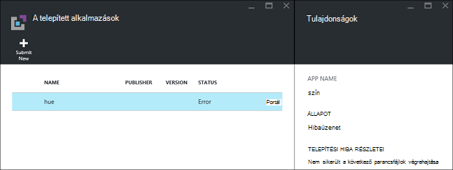
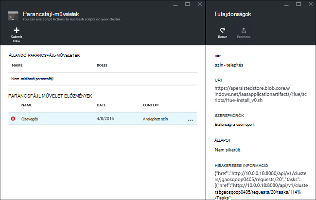

<properties
    pageTitle="A HDInsight Hadoop-alkalmazások telepítése |} Microsoft Azure"
    description="Megtudhatja, hogy miként HDInsight-alkalmazások telepítése a HDInsight-alkalmazásokat."
    services="hdinsight"
    documentationCenter=""
    authors="mumian"
    manager="jhubbard"
    editor="cgronlun"
    tags="azure-portal"/>

<tags
    ms.service="hdinsight"
    ms.devlang="na"
    ms.topic="hero-article"
    ms.tgt_pltfrm="na"
    ms.workload="big-data"
    ms.date="09/14/2016"
    ms.author="jgao"/>

# Egyéni HDInsight-alkalmazások telepítése

A HDInsight alkalmazás be olyan alkalmazás, amely a Linux-alapú HDInsight fürthöz telepíthetik a felhasználók.  Ezeket az alkalmazásokat a Microsoft, független gyártók (külső), illetve saját maga is készüljön. Ebben a cikkben megtanulhatja, hogyan telepítheti az Azure hdinsight szolgáltatáshoz a-portálra nem közzétett HDInsight kérelmet. Az alkalmazás telepíti a [szín](http://gethue.com/). 

Egyéb kapcsolódó cikkek:

- [Alkalmazások telepítése HDInsight](hdinsight-apps-install-applications.md): megtudhatja, hogy miként a fürt HDInsight alkalmazás telepítése.
- [Közzététel HDInsight-alkalmazások](hdinsight-apps-publish-applications.md): megtudhatja, hogy miként teheti közzé a Microsoft Azure piactéren egyéni HDInsight alkalmazások.
- [MSDN: egy HDInsight alkalmazás telepítése](https://msdn.microsoft.com/library/mt706515.aspx): megtudhatja, hogy miként definiálhat HDInsight-alkalmazások.

 
## Előfeltételek

Ha szeretne egy meglévő HDInsight fürt HDInsight-alkalmazások telepítése, egy HDInsight fürthöz kell rendelkeznie. Hozhat létre egyet, olvassa el a [fürt létrehozása](hdinsight-hadoop-linux-tutorial-get-started.md#create-cluster)című témakört. Amikor létrehoz egy HDInsight fürthöz HDInsight-alkalmazások is telepítheti.

## HDInsight-alkalmazások telepítése

HDInsight-alkalmazások telepíthető fürt létrehozásakor és meglévő HDInsight fürthöz. Erőforrás-kezelő Azure sablonok létrehozásával, című [MSDN: egy HDInsight alkalmazás telepítése](https://msdn.microsoft.com/library/mt706515.aspx).

A fájlok (szín) alkalmazás telepítéséhez szükséges:

- [azuredeploy.JSON](https://github.com/hdinsight/Iaas-Applications/blob/master/Hue/azuredeploy.json): az erőforrás-kezelő sablon HDInsight alkalmazás telepítése. Lásd: [MSDN: egy HDInsight alkalmazás telepítése](https://msdn.microsoft.com/library/mt706515.aspx) saját erőforrás-kezelő sablon fejlesztésével.
- [szín – install_v0.sh](https://github.com/hdinsight/Iaas-Applications/blob/master/Hue/scripts/Hue-install_v0.sh): az erőforrás-kezelő sablonban konfigurációs a szegély csomópontot a hívott a Script művelet. 
- [szín – binaries.tgz](https://hdiconfigactions.blob.core.windows.net/linuxhueconfigactionv01/hue-binaries-14-04.tgz): hui-install_v0.sh a hívott szín binárisfájl. 
- [szín – bináris – 14-04.tgz](https://hdiconfigactions.blob.core.windows.net/linuxhueconfigactionv01/hue-binaries-14-04.tgz): hui-install_v0.sh a hívott szín binárisfájl. 
- [webwasb-tomcat.tar.gz](https://hdiconfigactions.blob.core.windows.net/linuxhueconfigactionv01/webwasb-tomcat.tar.gz): hui-install_v0.sh a hívott minta webalkalmazás (Tomcat).

**Szín telepítheti a meglévő HDInsight fürthöz**

1. Kattintson az alábbi képen az Azure bejelentkezés, és nyissa meg az erőforrás-kezelő sablon az Azure-portálon. 

    

    Ez a gomb megnyitja az erőforrás-kezelő sablon az Azure portálon.  Az erőforrás-kezelő sablon [https://github.com/hdinsight/Iaas-Applications/tree/master/Hue](https://github.com/hdinsight/Iaas-Applications/tree/master/Hue)helyezkedik el.  Ezzel a sablonnal erőforrás-kezelő szövegalkotás című témakörben talál [MSDN: egy HDInsight alkalmazás telepítése](https://msdn.microsoft.com/library/mt706515.aspx).
    
2. A **Paraméterek** lap az adja meg az alábbiakat:

    - **Fürtnév**: Adja meg a csoport nevét, amelyre telepíteni szeretné az alkalmazást. A fürt meglévő fürthöz kell lennie.
    
3. Kattintson **az OK** gombra a paraméterek mentéséhez.
4. Az **egyéni telepítési** lap az adja meg az **erőforráscsoport**.  Az erőforráscsoport a fürt, a függő tárterület-fiók és más erőforrások: a csoportosított tároló. Szükség van a fürt az azonos erőforráscsoport használni.
5. Kattintson a **jogi feltételek**gombra, és kattintson a **Létrehozás**gombra.
6. Ellenőrizze a **PIN-kód irányítópult** jelölőnégyzet be van jelölve, és kattintson a **Létrehozás**gombra. Megjelenik a telepítés állapotának a portál irányítópult és a portál értesítést a kiemelt csempét a (kattintson a csengő ikonra a portálon tetején lévő).  10 perc kell tudni az alkalmazás telepítéséhez szükséges időt.

**Szín telepítése során fürt létrehozása**

1. Kattintson az alábbi képen az Azure bejelentkezés, és nyissa meg az erőforrás-kezelő sablon az Azure-portálon. 

    

    Ez a gomb megnyitja az erőforrás-kezelő sablon az Azure portálon.  Az erőforrás-kezelő sablon a [https://hditutorialdata.blob.core.windows.net/hdinsightapps/create-linux-based-hadoop-cluster-in-hdinsight.json](https://hditutorialdata.blob.core.windows.net/hdinsightapps/create-linux-based-hadoop-cluster-in-hdinsight.json)helyezkedik el.  Ezzel a sablonnal erőforrás-kezelő szövegalkotás című témakörben talál [MSDN: egy HDInsight alkalmazás telepítése](https://msdn.microsoft.com/library/mt706515.aspx).

2. Kövesse a utasítás fürt létrehozása, és telepítse a szín. HDInsight fürt létrehozásával kapcsolatos további tudnivalókért lásd: [létrehozása Linux-alapú Hadoop fürt a hdinsight szolgáltatásból lehetőségre](hdinsight-hadoop-provision-linux-clusters.md).

Az Azure portál mellett is használhatja [Azure PowerShell](hdinsight-hadoop-create-linux-clusters-arm-templates.md#deploy-with-powershell) és [Azure CLI](hdinsight-hadoop-create-linux-clusters-arm-templates.md#deploy-with-azure-cli) hívja fel az erőforrás-kezelő sablonokat.

## A telepítés ellenőrzése

Ellenőrizheti, hogy az alkalmazás telepítésének érvényesítéséhez az Azure portál alkalmazás állapotát. Ezeken kívül is ellenőrizheti az összes HTTP végpontok kapott felfelé várakozásoknak, és az weblapon, ha van ilyen:

**A szín portal megnyitásához**

1. Jelentkezzen be az [Azure-portálon](https://portal.azure.com).
2. Kattintson a bal oldali menü **Fürt hdinsight szolgáltatásból lehetőségre** .  Ha nem látható, kattintson a **Tallózás gombra**, és válassza a **HDInsight fürt**.
3. Kattintson a fürtre, amelyen telepítette az alkalmazást.
4. Kattintson a **Beállítások** lap **alkalmazások** csoportban az **Általános** kategóriát. A **Telepített alkalmazások** lap felsorolt **szín** gondoskodik.
5. Kattintson a **szín** a listában, és a Tulajdonságok listában.  
6. A weblap hivatkozásra a webhely; ellenőrzése Nyissa meg a HTTP-végpont ellenőrzése a szín webes felhasználói felület, nyissa meg a SSH végpont [gitt](hdinsight-hadoop-linux-use-ssh-windows.md) vagy más [SSH ügyfelek](hdinsight-hadoop-linux-use-ssh-unix.md)használata a böngészőben.
 
## A telepítés – problémamegoldás

Ellenőrizheti, hogy az alkalmazás telepítési állapotának portál értesítési (kattintson a csengő ikonra a portálon tetején lévő). 

Ha egy alkalmazás telepítése sikertelen, a hibaüzenetek jelennek, és hibakeresési információ 3 helyről:

- HDInsight-alkalmazások: Általános hibák információkat.

    Nyissa meg a fürt a portálról, és kattintson a beállítások lap alkalmazások:

    

- HDInsight parancsfájl művelet: a HDInsight-alkalmazások hibaüzenet azt jelzi, hogy a parancsprogram művelet sikertelen, ha többet szeretne tudni a parancsprogram hibát formában jelennek meg a parancsfájlt műveletek ablaktáblában.

    Kattintson a beállítások lap Script művelet. Parancsfájl művelet előzmények megjelenítése a hibaüzenetek

    
    
- Ambari webes felület: Ha a telepítési parancsfájlt volt a hiba okát, használni Ambari webes felülete a telepítés parancsfájlok teljes naplók.

    További tudnivalókért olvassa el a [Hibaelhárítás](hdinsight-hadoop-customize-cluster-linux.md#troubleshooting)című témakört.

## HDInsight-alkalmazások eltávolítása

Többféle módon HDInsight-alkalmazások törlése.

### Portál használata

**Ha el szeretne távolítani egy alkalmazást a portálon**

1. Jelentkezzen be az [Azure-portálon](https://portal.azure.com).
2. Kattintson a bal oldali menü **Fürt hdinsight szolgáltatásból lehetőségre** .  Ha nem látható, kattintson a **Tallózás gombra**, és válassza a **HDInsight fürt**.
3. Kattintson a fürtre, amelyen telepítette az alkalmazást.
4. Kattintson a **Beállítások** lap **alkalmazások** csoportban az **Általános** kategóriát. A telepített alkalmazások listája gondoskodik. Ebben az oktatóanyagban **szín** a **Telepített alkalmazások** lap szerepel.
5. Kattintson a jobb gombbal az eltávolítani kívánt alkalmazást, és kattintson a **Törlés**gombra.
6. Kattintson az **Igen gombra** kattintva erősítse meg.

A portálon, a csoport törlése vagy törölheti is a erőforráscsoport, amely tartalmazza az alkalmazást.

### Azure PowerShell használata

Azure PowerShell használatával, a csoport törlése vagy az erőforrás csoport törlése. Lásd: [Azure PowerShell használatával fürt törlése](hdinsight-administer-use-powershell.md#delete-clusters).

### Azure CLI használata

Azure CLI használ, a csoport törlése vagy az erőforrás csoport törlése. Lásd: [Azure CLI használatával fürt törlése](hdinsight-administer-use-command-line.md#delete-clusters).

## Következő lépések

- [MSDN: egy HDInsight alkalmazás telepítése](https://msdn.microsoft.com/library/mt706515.aspx): megtudhatja, hogy miként erőforrás-kezelő sablonok üzembe helyezése a HDInsight-alkalmazások fejlesztése.
- [Alkalmazások telepítése HDInsight](hdinsight-apps-install-applications.md): megtudhatja, hogy miként a fürt HDInsight alkalmazás telepítése.
- [Közzététel HDInsight-alkalmazások](hdinsight-apps-publish-applications.md): megtudhatja, hogy miként teheti közzé a Microsoft Azure piactéren egyéni HDInsight alkalmazások.
- [Parancsfájl művelettel testreszabása Linux-alapú HDInsight fürt](hdinsight-hadoop-customize-cluster-linux.md): megtudhatja, hogy miként parancsfájl művelettel további alkalmazások telepítéséhez.
- [Az erőforrás-kezelő sablonok használata HDInsight fürtök létrehozása Linux-alapú Hadoop](hdinsight-hadoop-create-linux-clusters-arm-templates.md): megtudhatja, hogy miként hívja fel az erőforrás-kezelő sablonok HDInsight fürt létrehozásához.
- [Üres él csomópontok HDInsight használata](hdinsight-apps-use-edge-node.md): megtudhatja, hogy miként használni egy üres él csomópont fürt HDInsight elérése, a tesztelés HDInsight-alkalmazások és a szolgáltatója HDInsight-alkalmazásokat.
