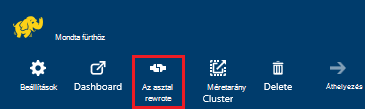
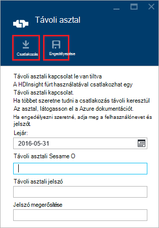
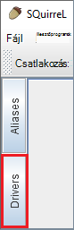
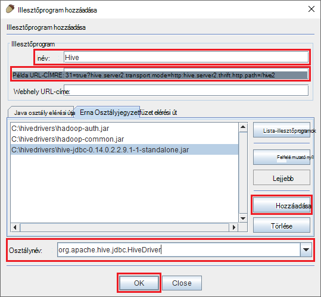
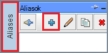
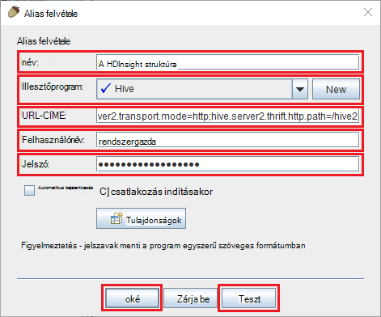
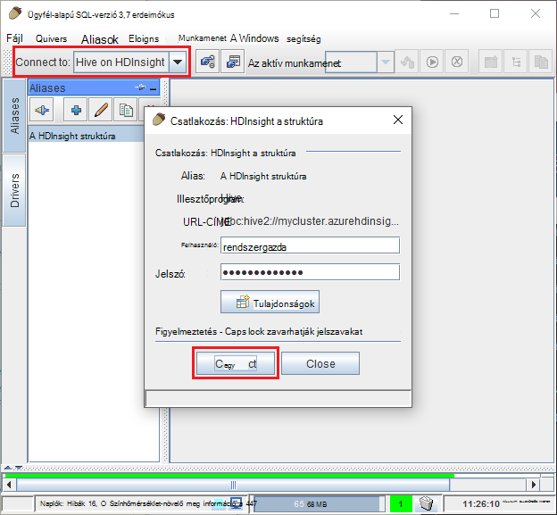
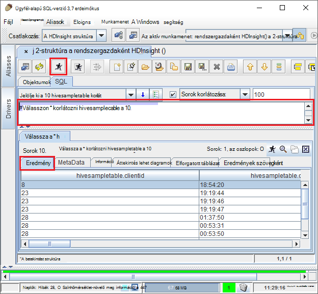

<properties
 pageTitle="Lekérdezés Azure hdinsight szolgáltatáshoz a struktúra JDBC használatával"
 description="Megtudhatja, hogy miként JDBC használatával az Azure hdinsight szolgáltatáshoz a struktúra és távolról lekérdezések futtatása a felhőben tárolt adatokból."
 services="hdinsight"
 documentationCenter=""
 authors="Blackmist"
 manager="jhubbard"
 editor="cgronlun"
    tags="azure-portal"/>

<tags
 ms.service="hdinsight"
 ms.devlang="java"
 ms.topic="article"
 ms.tgt_pltfrm="na"
 ms.workload="big-data"
 ms.date="08/23/2016"
 ms.author="larryfr"/>

#Azure hdinsight szolgáltatáshoz a struktúra JDBC illesztőprogram használata a struktúra csatlakoztatása

[AZURE.INCLUDE [ODBC-JDBC-selector](../../includes/hdinsight-selector-odbc-jdbc.md)]

A dokumentumban megtanulhatja, hogyan segítségével JDBC Java-alkalmazásból távolról a struktúra lekérdezések HDInsight fürthöz elküldése. Megtanulhatja, hogy miként csatlakozzon a erdeimókus SQL ügyfélprogramból, és hogyan csatlakozhat a programozás útján Java.

A struktúra JDBC felület kapcsolatos további tudnivalókért olvassa el a [HiveJDBCInterface](https://cwiki.apache.org/confluence/display/Hive/HiveJDBCInterface)című témakört.

##Előfeltételek

A jelen cikkben ismertetett lépések elvégzéséhez a következőkre lesz szüksége:

* A Hadoop fürt hdinsight szolgáltatásból lehetőségre. Linux vagy Windows-alapú fürt működni fog.

* [SQL erdeimókus](http://squirrel-sql.sourceforge.net/). Erdeimókus JDBC ügyfélalkalmazás.

Létre, és futtassa az Ez a cikk a csatolt példa Java-alkalmazást, a következőkre lesz szüksége.

* A [Java Developer Kit (JDK) 7-es verzió](https://www.oracle.com/technetwork/java/javase/downloads/jdk7-downloads-1880260.html) vagy újabb verziójában.

* [Apache maven tesztelése](https://maven.apache.org). Maven tesztelése a projekt Java-projektekhez társított Ez a cikk a project által használt rendszer generál.

##Kapcsolati karakterlánc

A Azure hdinsight szolgáltatáshoz fürthöz JDBC-kapcsolatok hozhatók létre a 443-nál, és a forgalom védett SSL-Kapcsolatot használ. A nyilvános átjáró, amely a fürt ülnie mögött a forgalom HiveServer2 ténylegesen figyel a port irányítja át. Így tipikus kapcsolati karakterlánc szeretné a következőket:

    jdbc:hive2://CLUSTERNAME.azurehdinsight.net:443/default;ssl=true?hive.server2.transport.mode=http;hive.server2.thrift.http.path=/hive2

__CLUSTERNAME__ cserélje le a HDInsight fürt nevét.

##Hitelesítés

Ha a kapcsolat létrehozása kell használnia a HDInsight fürt rendszergazda nevét és jelszavát fürt átjáróhoz hitelesítést végezni. A JDBC ügyfelek, mint például a erdeimókus SQL csatlakozáskor kell megadnia a rendszergazda nevét és jelszavát az ügyfél beállításai.

Java-alkalmazásból kell használnia a felhasználónév és jelszó-kapcsolat létrehozásakor. Például a következő Java-kód nyit meg egy új kapcsolatot a kapcsolati karakterláncot, a rendszergazda nevét és a jelszót használja:

    DriverManager.getConnection(connectionString,clusterAdmin,clusterPassword);

##Csatlakozás erdeimókus SQL ügyfélhez

SQL erdeimókus használt távolról struktúra-lekérdezések futtatása a HDInsight fürthöz JDBC ügyfél. A következő lépések feltételezik, hogy már telepítette a erdeimókus SQL, és végigvezeti le, és a illesztőprogramok beállítása a struktúra.

1. Másolja a struktúra JDBC illesztőprogramokat a HDInsight fürt.

    * A __HDInsight Linux-alapú__kövesse az alábbi lépéseket a szükséges üveg fájlok letöltését.

        1. Hozzon létre egy új könyvtárat, amely tartalmazni fogja a fájlokat. Ha például `mkdir hivedriver`.

        2. Egy parancssort, Bash, PowerShell vagy más parancssort könyvtárak váltson az új, és használja az alábbi parancsokat a fájlokat a HDInsight fürt másolni szeretné.

                scp USERNAME@CLUSTERNAME:/usr/hdp/current/hive-client/lib/hive-jdbc*standalone.jar .
                scp USERNAME@CLUSTERNAME:/usr/hdp/current/hadoop-client/hadoop-common.jar .
                scp USERNAME@CLUSTERNAME:/usr/hdp/current/hadoop-client/hadoop-auth.jar .

            __USERNAME__ cserélje a SSH felhasználói fiók nevét a fürt. __CLUSTERNAME__ cserélje le a HDInsight fürt nevét.

            > [AZURE.NOTE] A Windows-alapú környezetekben szüksége lesz a PSCP segédprogrammal scp helyett. Letöltheti a [http://www.chiark.greenend.org.uk/~sgtatham/putty/download.html](http://www.chiark.greenend.org.uk/~sgtatham/putty/download.html).

    * A __Windows-alapú HDInsight__kövesse az alábbi lépéseket a üveg fájlok letöltését.

        1. Az Azure portálról válassza ki a HDInsight csoportját, és válassza a __Távoli asztali__ ikonra.

            

        2. A távoli asztali lap a a __Csatlakozás__ gombra segítségével a fürthöz csatlakozni. Ha nincs engedélyezve a távoli asztal, az űrlap segítségével adja meg a felhasználónevet és jelszót, majd válassza ki __engedélyezése__ a távoli asztali ahhoz, hogy a fürt.

            

            Miután kiválasztotta a __Csatlakozás__, .rdp fájl letöltődik. Ez a fájl használatával indítsa el a távoli asztali ügyfél. Amikor a rendszer kéri, használja a felhasználónevet és jelszót távoli asztali access.

        3. Miután létrejött, másolja a következő fájlokat a távoli asztali munkamenetből a helyi számítógépre. Helyezze át őket a helyi nevű könyvtárában található `hivedriver`.

            * C:\apps\dist\hive-0.14.0.2.2.9.1-7\lib\hive-JDBC-0.14.0.2.2.9.1-7-Standalone.JAR
            * C:\apps\dist\hadoop-2.6.0.2.2.9.1-7\share\hadoop\common\hadoop-Common-2.6.0.2.2.9.1-7.JAR
            * C:\apps\dist\hadoop-2.6.0.2.2.9.1-7\share\hadoop\common\lib\hadoop-auth-2.6.0.2.2.9.1-7.JAR

            > [AZURE.NOTE] A verziószáma, az elérési út és a fájl neve szerepel a fürt eltérőek lehetnek.

        4. Amikor befejezte a fájlok másolása a távoli asztali munkamenet bontani.

3. A erdeimókus SQL-alkalmazások indításakor. Jelölje ki az ablak bal __illesztőprogramok__.

    

4. A __illesztőprogramok__ párbeszédpanel tetején az ikonok, jelölje ki a __+__ ikonra kattintva hozzon létre egy újat.

    

5. Az illesztőprogram hozzáadása párbeszédpanelen adja meg az alábbi információkat.

    * __Név__: struktúra
    * __Példa URL-CÍMRE__: jdbc:hive2://localhost:443/default;ssl=true?hive.server2.transport.mode=http;hive.server2.thrift.http.path=/hive2
    * __További osztály elérési útja__: a Hozzáadás gombra kattintva adja hozzá a üveg fájlokat letöltött használata
    * __Osztálynév__: org.apache.hive.jdbc.HiveDriver

    

    Kattintson az __OK gombra__ az beállítások mentéséhez.

6. A erdeimókus SQL-ablak bal oldalán válassza a __Aliases__. Kattintson a __+__ ikonra kattintva hozzon létre egy új kapcsolat alias.

    

7. Az __Alias felvétele__ párbeszédpanel használja az alábbi értékeket.

    * __Név__: a HDInsight struktúra
    * __Illesztőprogram__: válassza ki a __struktúra__ illesztőprogramot a legördülő menü használatával
    * __URL-címe__: jdbc:hive2://CLUSTERNAME.azurehdinsight.net:443/default;ssl=true?hive.server2.transport.mode=http;hive.server2.thrift.http.path=/hive2

        __CLUSTERNAME__ cserélje le a HDInsight fürt nevét.

    * __Felhasználónév__: a HDInsight fürt fürt bejelentkezési fiók nevét. Az alapértelmezett érték `admin`.
    * __Jelszó__: a fürt bejelentkezési fiók jelszava. Ez az a HDInsight fürt létrehozásakor a megadott jelszót.

    

    Ellenőrizze, hogy működik-e a kapcsolatot használja a __próba__ gombot. Ha __csatlakozni: a HDInsight struktúra__ párbeszédpanel jelenik meg, kattintson a __Csatlakozás__ a vizsgálat végrehajtásához. Ha a teszt sikerül, egy __kapcsolatot sikeres__ párbeszédpanel jelenik meg.

    Mentse a kapcsolat alias használatával az __Alias felvétele__ párbeszédpanel alján az __Ok__ gombra.

8. A __Csatlakozás__ legördülő erdeimókus SQL tetején jelölje ki __a struktúra hdinsight szolgáltatásból lehetőségre__. Amikor a rendszer kéri, kattintson a __Csatlakozás__lehetőséget.

    

9. Miután létrejött, az alábbi lekérdezés írja be az SQL-lekérdezés párbeszédpanel, és válassza a __Futtatás__ ikont. Az eredmények területen meg kell jelennie a lekérdezés eredményét.

        select * from hivesampletable limit 10;

    

##Kapcsolódás a példa Java-alkalmazások

Példa ügyfelet használ egy Java Query struktúra HDInsight [https://github.com/Azure-Samples/hdinsight-java-hive-jdbc](https://github.com/Azure-Samples/hdinsight-java-hive-jdbc)címen érhető el. Kövesse a létre, és futtassa a mintában a tárat.

##Hibaelhárítás

### Váratlan hiba lépett fel nyisson meg egy SQL-kapcsolatot.

__A jelenség__: amikor csatlakozik egy HDInsight fürt, amelynek verziója 3.3 vagy 3.4, jelenhet meg a hibát, amely a váratlan hiba történt. Ehhez a hibához a Papírhalom követés kezdődik, a következő sort:

    java.util.concurrent.ExecutionException: java.lang.RuntimeException: java.lang.NoSuchMethodError: org.apache.commons.codec.binary.Base64.<init>(I)V
    at java.util.concurrent.FutureTas...(FutureTask.java:122)
    at java.util.concurrent.FutureTask.get(FutureTask.java:206)

__OK__: ezt a hibát az commons-codec.jar fájl erdeimókus és a struktúra JDBC összetevők töltődnek le a HDInsight fürt által igényelt által használt verzióját eltérés okozza.

__Megoldás__: Ez a hiba elhárításához kövesse az alábbi lépéseket.

1. Töltse le a kodek commons üveg eltávolítása a hdinsight szolgáltatásból lehetőségre.

        scp USERNAME@CLUSTERNAME:/usr/hdp/current/hive-client/lib/commons-codec*.jar ./commons-codec.jar

2. Kilépés a erdeimókus, és kattintson a címtárhoz erdeimókus hova van telepítve a rendszer. A erdeimókus címtárban csoportban a `lib` directory, a csere a egy meglévő commons-codec.jar töltődnek le a HDInsight fürt.

3. Indítsa újra a erdeimókus. A hiba nem történjen a HDInsight struktúra való csatlakozáskor.

##Következő lépések

Most, hogy hogyan JDBC használata struktúra van megtanulta, használja az alábbi hivatkozások feltárása más módszerek a Azure hdinsight szolgáltatáshoz.

* [Töltse fel az adatok hdinsight szolgáltatáshoz](hdinsight-upload-data.md)
* [HDInsight struktúra használata](hdinsight-use-hive.md)
* [Malac használata hdinsight szolgáltatáshoz](hdinsight-use-pig.md)
* [HDInsight MapReduce feladatok használata](hdinsight-use-mapreduce.md)
