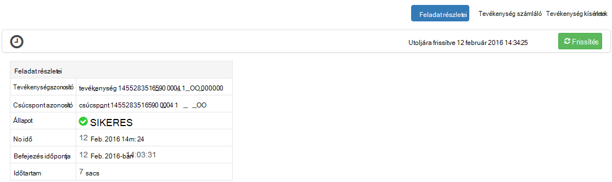

<properties
pageTitle="Ambari Tez nézet használata a HDInsight |} Azure"
description="Megtudhatja, hogy miként szeretné hibakeresése HDInsight Tez feladatok Ambari Tez nézet használata."
services="hdinsight"
documentationCenter=""
authors="Blackmist"
manager="jhubbard"
editor="cgronlun"/>

<tags
ms.service="hdinsight"
ms.devlang="na"
ms.topic="article"
ms.tgt_pltfrm="na"
ms.workload="big-data"
ms.date="10/04/2016"
ms.author="larryfr"/>

# HDInsight Tez feladatok Ambari nézetek használata

A HDInsight Ambari webes felülete, és a végrehajtás motor Tez használt feladatok hibakeresési használható Tez nézet tartalmazza. A Tez nézet egyszerűvé teszi a feladatot, a kapcsolódó elemek diagramját, ábrázolása, mindegyik elemhez feltárás és beolvasásához, statisztika és naplózási adatait.

> [AZURE.NOTE] A dokumentum adatai Linux-alapú HDInsight fürt alkalmazásra. Tez feladatok használata a Windows-alapú HDInsight hibakeresési olvashat ismerje meg [Tez a felhasználói felület szeretné hibakeresése Tez feladatok a Windows-alapú hdinsight szolgáltatásból lehetőségre](hdinsight-debug-tez-ui.md).

## Előfeltételek

* A HDInsight Linux-alapú fürtre. Új fürt létrehozása, című [használatba Linux-alapú hdinsight szolgáltatásból lehetőségre](hdinsight-hadoop-linux-tutorial-get-started.md).

* Modern webböngészőben, amely támogatja a HTML5-ös.

## Tez ismertetése

Tez egy bővíthető keretrendszer Hadoop, amely nagyobb, mint a hagyományos MapReduce feldolgozási sebesség biztosít az adatkezelési. Linux-alapú HDInsight fürt célszerű az alapértelmezett motor struktúra számára.

Munka Tez elé, amikor egy irányított aciklikus Graph (DAG): a feladat szükséges műveletek végrehajtási sorrendje leíró hoz létre. Egyéni műveletek csúcsok úgynevezett, és hajtsa végre a teljes projekt valamilyen. A csúcs leírt munka tényleges végrehajtása egy tevékenység neve, és előfordulhat, hogy a fürt több csomópontok legyen elosztva.

### A Tez nézet ismertetése

A Tez view jelenít meg információt a folyamatok, amely a rendszert futtat, vagy hogy korábban futtatta Tez használatával. Lehetővé teszi a Tez, által generált DAG megtekintése keresztül fürt, elosztott hogyan számlálók, például a memóriahasználat, feladatok és a csúcsok, és a hiba adatait. Azt nyújthat hasznos információt az alábbi esetekben:

* Figyelése hosszabb ideig futó folyamatok, térkép állapotának megtekintése és csökkentse a tevékenységek.

* Korábbi adatok elemzése a sikeres vagy sikertelen folyamatok megtudhatja, hogyan javítható a feldolgozás, és miért nem sikerült.

## Egy DAG készítése

A Tez nézet csak adatok fogja tartalmazni, ha egy feladatot, használja a Tez motor éppen zajló értekezletet, vagy már futtatott múltbeli. Egyszerű struktúra lekérdezések általában hozzárendelhető Tez, szűrés, csoportosítás, rendezés illesztések, stb általában csak Tez lehetőségeket összetettebb azonban lekérdezések használata nélkül.

Kövesse az alábbi lépéseket a struktúra lekérdezést Tez hajtja végre.

1. Egy webböngészőben nyissa meg azt a https://CLUSTERNAME.azurehdinsight.net, hol __CLUSTERNAME__ -e a HDInsight fürt nevét.

2. A lap tetején a menüből a __nézetek__ ikonnal. Ez a következőképpen néz négyzetek sorozata. A megjelenő legördülő menü válassza a __Nézet struktúra__. 

    

3. A struktúra megtekintésekor a terhelések, illessze be a következőt a Lekérdezésszerkesztő be, és kattintson a __végrehajtása__.

        select market, state, country from hivesampletable where deviceplatform='Android' group by market, country, state;
    
    A feladat befejeződése után meg kell jelennie a kimenet jelenik meg a __Lekérdezés folyamat eredményét__ szakaszban. Az eredmény az alábbihoz hasonló kell lennie.
    
        market  state       country
        en-GB   Hessen      Germany
        en-GB   Kingston    Jamaica
        
4. Kattintson a __Log__ fülre. A következőhöz hasonló adatokat jelennek meg:
    
        INFO : Session is already open
        INFO :

        INFO : Status: Running (Executing on YARN cluster with App id application_1454546500517_0063)

    Az __alkalmazás azonosítója__ érték, a rendszer ezt használja a következő szakaszban mentése

## A Tez nézet használata

1. A lap tetején a menüből a __nézetek__ ikonnal. Jelölje ki a megjelenő legördülő menü __Tez nézetet__.

    

2. A Tez nézet betöltődésekor jelenik meg, hogy fut éppen, vagy DAGs listáját a fürt futtatta. Az alapértelmezett nézet a Dag név, azonosító, küldőtől, állapot, kezdési idő, befejezési idő, időtartam, azonosítója és várólista tartalmazza. További oszlopok használata a fogaskerék ikonra a lap jobb oldali adhatók meg.

    

3. Ha csak egy bejegyzés, a lekérdezés, amely az előző szakaszban futtatta lesz. Ha több bejegyzést, kereshet a azonosítója beírja az __Alkalmazás azonosítója__ mezőbe, és nyomja le az enter gombra.

4. Jelölje ki a __Dag nevét__. Ekkor megjelenik a DAG információt, valamint a JSON-fájlokat a DAG információt tartalmazó zip letöltése lehetőséget.

    

5. Feletti __DAG részletei__ vannak több hivatkozások is használható, ha a DAG információt szeretne megjeleníteni.

    * __DAG számláló__ e DAG számláló adatait jeleníti meg.
    
    * __Grafikus nézet__ jeleníti meg ezt a DAG grafikus ábrázolása.
    
    * __Az összes csúcsok__ e DAG a csúcsok listáját jeleníti meg.
    
    * __Minden tevékenység__ az összes csúcsok a feladatok lista a DAG jeleníti meg.
    
    * __Az összes TaskAttempts__ a kísérel meg az e DAG feladatok futtatásához információkat jelenít meg.
    
    > [AZURE.NOTE] Ha az Oszlop megjelenítés csúcsok, feladatok és TaskAttempts görget, figyelje meg, hogy nincsenek-e hivatkozásra kattintva __számláló__ és __megtekintéséhez, vagy töltse le a naplók__ minden egyes sorára.

    A munkához hiba történt, ha a DAG adatait, nem sikerült, a sikertelen feladattal kapcsolatos információkat mutató hivatkozásokat találhat állapotban megjelenik. Diagnosztikai információ DAG részleteinek alatt jelenik meg.
    
    

7. Jelölje ki __a grafikus nézetet__. Megjelenik a DAG grafikus ábrázolása. Az egérrel is elhelyezhet a nézetben megjeleníteni a rá vonatkozó információkat minden csúcsra fölé.

    

8. Egy csúcsra kattintva az adott elem __Csúcsra részletek__ töltse be. Kattintson a __térkép 1__ csúcsra ezt az elemet a részletek megjelenítéséhez.

    

9. Figyelje meg, hogy most már csúcsok és a feladatok kapcsolódó hivatkozások a lap tetején.

    > [AZURE.NOTE] Is is odaér ezen az oldalon vissza __DAG részletei__, __Csúcsra részletek__kijelölése, és kiválasztja a __térkép 1__ csomópontra.

    * __Csúcspont számláló__ a csúcs számláló adatait jeleníti meg.
    
    * __Feladatok__ a csúcs feladatok jeleníti meg.
    
    * __Tevékenység megpróbálja__ információkat jelenít meg a csúcs feladatok futtatásához kísérletek.
    
    * __Adatforrások és mosdók__ adatforrások jeleníti meg, és a szénfelhalmozásra a csúcs.

    > [AZURE.NOTE] Mint az előző menüvel görgetve oszlopban megjelenített, a feladatok, feladat kísérletek, és a források Sinks__ mindegyik elemhez további információkra mutató hivatkozások megjelenítéséhez.

10. Jelölje ki a __tevékenységeket__, és válassza az elem nevű __00_000000__. Ez megjeleníti a __Feladat részletei__ ehhez a feladathoz. A képernyőn __Tevékenység számláló__ és a __Tevékenység kísérletek__megtekintése.

    

## Következő lépések

Most, hogy a Tez nézet használata van megtanulta, tudjon meg többet [A HDInsight struktúra használatával](hdinsight-use-hive.md).

Részletesebb technikai információt a Tez című témakörben talál a [Hortonworks Tez honlapját](http://hortonworks.com/hadoop/tez/).

További tájékoztatást a HDInsight Ambari használja olvassa el a [HDInsight kezelése fürt Ambari webes felületének használata](hdinsight-hadoop-manage-ambari.md) című témakört.
