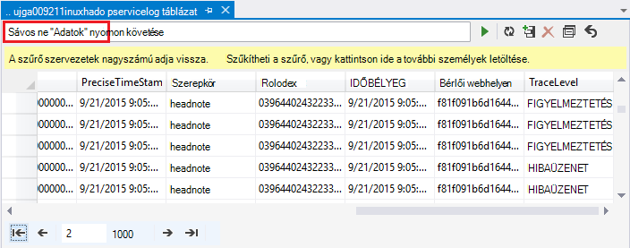

<properties
    pageTitle="A HDInsight Hadoop hibakeresési: naplók megtekintése és értelmezése a hibaüzenetek |} Microsoft Azure"
    description="Tudnivalók a kaphat, ha a PowerShell használatá HDInsight felügyelete hibaüzenetek, és lépéssel sokat tehet visszaállításához."
    services="hdinsight"
    tags="azure-portal"
    editor="cgronlun"
    manager="jhubbard"
    authors="mumian"
    documentationCenter=""/>

<tags
    ms.service="hdinsight"
    ms.workload="big-data"
    ms.tgt_pltfrm="na"
    ms.devlang="na"
    ms.topic="article"
    ms.date="09/02/2016"
    ms.author="jgao"/>

# HDInsight naplók elemzése

Minden Hadoop fürt Azure hdinsight szolgáltatáshoz a használt alapértelmezett fájlrendszer Azure tárterület-fiókkal rendelkezik. A tároló fiók tároló alapértelmezett fiókként nevezik. Fürt az alapértelmezett tárterület-ügyfél az Azure táblatárolóhoz és a Blob-tárolóhoz tárolni a naplók használja.  A csoport alapértelmezett tároló fiókja, olvassa el [a HDInsight kezelése a Hadoop fürt](hdinsight-administer-use-management-portal.md#find-the-default-storage-account). A naplók megőrzi a tárterület-fiók után a fürt törlődik.

##Azure táblák írt naplók

A naplókat Azure táblák írt egy szinttel a Mi történik egy HDInsight fürthöz betekintést nyújt.

Amikor létrehoz egy HDInsight fürthöz, 6 táblák automatikusan létrejön egy Linux-alapú fürt az alapértelmezett táblatárolóban lévő:

- hdinsightagentlog
- Syslog
- daemonlog
- hadoopservicelog
- ambariserverlog
- ambariagentlog

3 tábla létrehozása a Windows-alapú fürtre vonatkozóan:

- Setuplog: események/kivételek észlelt a kiépítési/felállítása HDInsight fürt naplója.
- hadoopinstalllog: naplója események/kivételt feltárása a fürt Hadoop telepítésekor. Az alábbi táblázat hasznosak lehetnek a hibakeresése során létre egyéni paraméterekkel fürt kapcsolatos problémákat.
- hadoopservicelog: minden Hadoop-szolgáltatás által rögzített események/kivételek naplója. Az alábbi táblázat akkor lehet hasznos, a hibakereséshez HDInsight fürt feladat hibák kapcsolatos problémákat.

A táblázat fájlnevek **u<ClusterName>DDMonYYYYatHHMMSSsss<TableName>**.

Az alábbi táblázat tartalmazza a következő mezőket:

- ClusterDnsName
- Most letölthető a KomponensNév
- EventTimestamp
- A Host
- MALoggingHash
- Üzenet
- N
- PreciseTimeStamp
- Szerepkör
- RowIndex
- Bérlői webhelyen
- IDŐBÉLYEG
- TraceLevel

### A naplók eléréséhez szükséges eszközök

Létezik számos eszközt a táblázatokban eléréséhez:

-  Visual Studio
-  Azure tároló Explorer
-  A Power Query az Excel programhoz

#### A Power Query az Excel használata

A Power Query [www.microsoft.com/en-us/download/details.aspx?id=39379]( http://www.microsoft.com/en-us/download/details.aspx?id=39379)a telepíthető. Lásd: a rendszerkövetelmények letöltési lapjára

**Nyissa meg és elemzése a szolgáltatási napló Power Query segítségével**

1. Nyissa meg a **Microsoft Excel**.
2. A **Power Query** menüben kattintson **Az Azure**, és válassza **a Microsoft Azure táblatárolóhoz**.
 
    
3. Írja be a tárterület-fiók nevére. Ez lehet a rövid nevet vagy a teljes Tartománynevét.
4. Írja be a tárhely fiókkulcs. Táblák listájának kell jelenik meg:

    
5. Kattintson a jobb gombbal a hadoopservicelog tábla a **kezelő** ablaktáblában, és válassza a **Szerkesztés**. 4 oszlopból gondoskodik. Tetszés szerint törölje a **Partíciót billentyűt**, a **Sor billentyűt**, és a **időbélyeg** oszlopok kijelöli őket, majd **Oszlopok áthelyezése** a menüszalag lista elemei közül.
6. Kattintson a Content oszlopot választhatja ki a kívánt oszlopokat kell az Excel-számolótábla importálása a kibontó ikonra. Ez a bemutató a kiválasztott TraceLevel, és most letölthető a KomponensNév: azt is megjelenhetnek, olyan alapvető információhoz, amelyen összetevők volna problémák.

    
7. Kattintson **az OK gombra** kattintva importálja az adatokat.
8. Jelölje ki a **TraceLevel**, szerepkörök, és **most letölthető a KomponensNév** oszlopokat, és válassza a menüszalag **Group By** vezérlőt.
9. Kattintson az **OK gombra** a csoportosítási szempont párbeszédpanel
10. Kattintson az** alkalmazás és Bezárás**gombra.
 
A szűrés és rendezés szükség szerint most már használhatja az Excel. Természetesen érdemes, ha meg szeretné jeleníteni a többi oszlop (például üzenet) annak érdekében, hogy részletesen megjelenítsen problémák előfordulási helyük, de a fentebb ismertetett oszlopok kijelölését és csoportosítását biztosít a Mi történik, Hadoop-szolgáltatásokkal decent képe. Az azonos arról a setuplog és hadoopinstalllog táblákra alkalmazható.

#### Használja a Visual Studio

**Visual Studio használata**

1. Nyissa meg a Visual Studio.
2. A **Nézet** menüben kattintson a **Felhőben Explorer**. Vagy egyszerűen csak kattintson **CTRL +\, CTRL + X**.
3. A **Felhő Intéző**jelölje be a **Erőforrástípus**.  A többi elérhető beállítás nem **Erőforráscsoport**.
4. Bontsa ki a **Tárterület-fiókok**, az alapértelmezett tárterület-fiók a fürt, majd a **táblákat**.
5. Kattintson duplán a **hadoopservicelog**.
6. Vegye fel a szűrőt. Példa:
    
        TraceLevel eq 'ERROR'

    

    Szűrők megépítése kapcsolatos további tudnivalókért olvassa el a [Szűrő karakterláncok Egyenletszerkesztővel a tábla Tervező](../vs-azure-tools-table-designer-construct-filter-strings.md)című témakört.
 
##A naplók írt Azure Blob-tárolóhoz

[A naplókat Azure táblák írt](#log-written-to-azure-tables) egy szinttel a Mi történik egy HDInsight fürthöz betekintést nyújt. Az alábbi táblázat azonban nem ad meg tevékenységszintű naplók, akkor lehet hasznos, a kimutatáshierarchiában, amely további során előforduló problémák. Ahhoz, hogy a következő részletességi szintjét, HDInsight fürt vannak beállítva tevékenység naplók írni minden feladat Templeton keresztül küldött Blob-tárolóhoz fiókját. Gyakorlatilag ez azt jelenti, hogy a Microsoft Azure PowerShell-parancsmagok vagy a .NET feladat Beküldési API-k, nem RDP/parancssor-line hozzáférést a fürthöz elküldeni feladatok benyújtott feladatok. 

A naplók megtekintéséhez olvassa el az [Access fonal alkalmazás bejelentkezik HDInsight Linux-alapú](hdinsight-hadoop-access-yarn-app-logs-linux.md).

Alkalmazás naplók kapcsolatos további tudnivalókért lásd: a [Simplifying felhasználói – naplók kezelése és fonal az access](http://hortonworks.com/blog/simplifying-user-logs-management-and-access-in-yarn/).
 
 
## Fürt állapot és feladatok naplók megtekintése

###Az Access Hadoop felhasználói felület

Az Azure portálról válassza a HDInsight fürt a fürt lap megnyitásához. A fürt lap az **Irányítópult**elemre.

Amikor a rendszer kéri, adja meg a csoport-rendszergazdai hitelesítő adatok. A lekérdezés konzolban kattintson a **Hadoop felhasználói felület**.

###A felhasználói felület fonal elérése

Az Azure portálról válassza a HDInsight fürt a fürt lap megnyitásához. A fürt lap az **Irányítópult**elemre. Amikor a rendszer kéri, adja meg a csoport-rendszergazdai hitelesítő adatok. A lekérdezés konzolban kattintson **Fonal felhasználói felület**.

A felhasználói felület fonal segítségével tegye a következőket:

* **Első fürt állapotát**. A bal oldali ablaktábláján bontsa ki a **fürt**, és kattintson a **Névjegy**gombra. A bemutató összes memóriát, magmintákat használt, felosztott az erőforrás-kezelő fürt állapotát például állapotadatok fürt, fürt verzió stb.

    

* Az **első csomópont állapot**. A bal oldali ablaktábláján bontsa ki a **csoportját**, és kattintson a **csomópontok**. Ez az összes a csomópontok listája a fürt, a HTTP-címe minden csomópontra, minden csomópont stb rendelt erőforrások.

* **Monitor feladat állapotát**. A bal oldali ablaktábláján bontsa ki a **csoportját**, és kattintson az **alkalmazások** listáját a fürt összes feladatot. Ha azt szeretné, nézze meg (például az új, a beküldött, futó, stb.) egy adott állapotú feladatokat, az **alkalmazások**csoportban a megfelelő hivatkozásra kattintva. További kattinthat a feladat nevére, megtudhatja, hogy a feladattal kapcsolatos további ilyen, beleértve a kimeneti, naplók stb.

###A felhasználói felület HBase elérése

Az Azure portálról válassza a HDInsight HBase fürt a fürt lap megnyitásához. A fürt lap az **Irányítópult**elemre. Amikor a rendszer kéri, adja meg a csoport-rendszergazdai hitelesítő adatok. A lekérdezés konzolban kattintson **HBase felhasználói felület**.

## HDInsight hibakódok esetén

Az ebben a részben részletezve hibaüzenetek tanácsokkal azokat a lépéseket, amelyek kijavítani a hibát tehetők és a felhasználók megtudhatják, találkoznak Azure PowerShell szolgáltatás felügyeletéhez lehetséges hibák közül az Azure hdinsight szolgáltatáshoz a Hadoop állnak rendelkezésre.

Néhány ezekre a hibaüzenetekre sikerült is látható az Azure-portálon kezelheti HDInsight fürt alkalmazásakor. De más előforduló hibaüzenetek létezik a kevésbé részletes miatt ez környezetben lehetséges műveletek segíthetnek a korlátozó. Más hibaüzenetek jelennek meg a környezetekben, ahol egyértelmű-e a kezelési találhatók. 

### AtleastOneSqlMetastoreMustBeProvided
- **Leírás**: Írjon be legalább egy összetevő Azure SQL adatbázis adatainak egyéni beállítások használatához-struktúra és Oozie metastores.
- **Kezelési**: A felhasználónak kell adnia egy érvényes SQL Azure-metastore, és ismételje meg a kérelmet.  

### AzureRegionNotSupported
- **Leírás**: nem lehetett létrehozni, a régió *nameOfYourRegion*fürt. Egy érvényes HDInsight régió használja, és próbálkozzon újra a kérést.
- **Kezelési**: ügyfél létre kell hoznia a fürt régió, amely jelenleg támogatott: Délkelet-ázsiai, nyugati Europe, Észak-Európa, kelet USA-beli vagy nyugati US.  

### ClusterContainerRecordNotFound
- **Leírás**: A kiszolgáló nem találta meg a kért fürt rekordot.  
- **Kezelési**: ismételje meg a műveletet.

### ClusterDnsNameInvalidReservedWord
- **Leírás**: fürt DNS neve *yourDnsName* argumentum valamelyike érvénytelen. Győződjön meg arról, neve kezdődik és végződik alfanumerikus, és csak tartalmazhat "-" speciális karakter  
- **Kezelési**: Győződjön meg arról, hogy használt érvényes DNS nevet a kezdődik és végződik alfanumerikus, és nincs olyan különleges tartalmazza a fürt karakter más, mint a Szaggatás "-", és próbálja meg a műveletet.

### ClusterNameUnavailable
- **Leírás**: fürt neve *yourClusterName* nem érhető el. Válasszon egy másik nevet.  
- **Kezelési**: A felhasználó kell adjon meg egy egyedi clustername és nem létezik, és próbálkozzon újra. Ha a felhasználó a portálon használja, a felhasználói felület arról értesíti őket, ha egy fürt neve már használatban van a létrehozás lépések során.

### ClusterPasswordInvalid
- **Leírás**: fürt jelszó érvénytelen. Jelszó legalább 10 karakter hosszú lehet és tartalmaznia kell legalább egy szám, a nagybetűt, a kisbetű és a speciális karakterek nem tartalmazhat szóközt, és azt részeként a felhasználónév nem tartalmazhat.  
- **Kezelési**: érvényes fürt jelszó megadását, és ismételje meg a műveletet.

### ClusterUserNameInvalid
- **Leírás**: fürt felhasználónév érvénytelen. Győződjön meg róla, felhasználónév különleges karaktereket vagy szóközöket tartalmaz.  
- **Kezelési**: Adja meg a érvényes fürt felhasználónevét, és ismételje meg a műveletet.

### ClusterUserNameInvalidReservedWord
- **Leírás**: fürt DNS neve *yourDnsClusterName* argumentum valamelyike érvénytelen. Győződjön meg arról, neve kezdődik és végződik alfanumerikus, és csak tartalmazhat "-" speciális karakter  
- **Kezelési**: Adja meg a DNS-fürt érvényes felhasználónevét, és ismételje meg a műveletet.

### ContainerNameMisMatchWithDnsName
- **Leírás**: URI *yourcontainerURI* tároló neve és a DNS neve *yourDnsName* összehívás törzsébe azonosnak kell lennie.  
- **Kezelési**: Győződjön meg arról, hogy a tároló neve és a DNS-név megegyeznek, és ismételje meg a műveletet.

### DataNodeDefinitionNotFound
- **Leírás**: Érvénytelen fürt konfigurálása. Nem található összes adatok csomópont-definíciót a méret csomópontot.  
- **Kezelési**: ismételje meg a műveletet.

### DeploymentDeletionFailure
- **Leírás**: törlése a telepítés nem sikerült, a fürthöz  
- **Kezelési**: próbálja meg a törlési művelet.

### DnsMappingNotFound
- **Leírás**: a szolgáltatás konfigurációs hiba. Szükséges DNS-hozzárendelési adatokat nem található.  
- **Kezelési**: fürt törlése, és hozzon létre egy új fürt.

### DuplicateClusterContainerRequest
- **Leírás**: ismétlődő fürt tároló létrehozási kísérlet. Rekord *nameOfYourContainer* létezik, de nem egyeznek meg Etags.
- **Kezelési**: használjon egyedi nevet a tároló, és ismételje meg a create műveletet.

### DuplicateClusterInHostedService
- **Leírás**: *nameOfYourHostedService* szolgáltatott szolgáltatás már tartalmaz egy fürt. A szolgáltatott szolgáltatás nem tartalmazhat több fürtre  
- **Kezelési**: a fürt egy másik szolgáltatott szolgáltatás üzemelteti.

### FailureToUpdateDeploymentStatus
- **Leírás**: A kiszolgáló nem tudja frissíteni a fürt telepítési állapotának.  
- **Kezelési**: ismételje meg a műveletet. Ha többször ez történik, lépjen kapcsolatba a CSS-fájlok.

### HdiRestoreClusterAltered
- **Leírás**: fürt *yourClusterName* törölt karbantartási részeként. Hozza létre újból a fürt.
- **Kezelési**: hozza létre a fürt.

### HeadNodeConfigNotFound
- **Leírás**: Érvénytelen fürt konfigurálása. Nem található a csomópont méretű fő csomópont konfiguráció szükséges.
- **Kezelési**: ismételje meg a műveletet.

### HostedServiceCreationFailure
- **Leírás**: nem lehet létrehozni a szolgáltatott szolgáltatás *nameOfYourHostedService*. Próbálja meg újra a kérést.  
- **Kezelési**: ismételje meg a kérelmet.

### HostedServiceHasProductionDeployment
- **Leírás**: *nameOfYourHostedService* szolgáltatott szolgáltatás már van egy éles üzemi. A szolgáltatott szolgáltatás nem tartalmazhat több gyártási-telepítés. Ismételje meg a másik fürthöz néven kérelmet.
- **Kezelési**: használjon másik fürthöz nevet, és ismételje meg a kérelmet.

### HostedServiceNotFound
- **Leírás**: szolgáltatás *nameOfYourHostedService* is, az a fürt nem található.  
- **Kezelési**: Ha a fürt hiba állapotban, törölheti, és próbálkozzon újra.

### HostedServiceWithNoDeployment
- **Leírás**: *nameOfYourHostedService* szolgáltatott szolgáltatás még nem társított telepítési.  
- **Kezelési**: Ha a fürt hiba állapotban, törölheti, és próbálkozzon újra.

### InsufficientResourcesCores
- **Leírás**: A SubscriptionId *yourSubscriptionId* nincs magmintákat balra fürt *yourClusterName*létrehozásához. Kötelező: *resourcesRequired*, akkor érhető el: *resourcesAvailable*.  
- **Kezelési**: az előfizetés az erőforrásokat vagy növelheti a rendelkezésre álló az előfizetéshez források, és próbáljon meg ismét létrehozni a fürt.

### InsufficientResourcesHostedServices
- **Leírás**: Előfizetés azonosítója *yourSubscriptionId* nem rendelkezik egy új HostedService fürt *yourClusterName*létrehozása kvótája.  
- **Kezelési**: az előfizetés az erőforrásokat vagy növelheti a rendelkezésre álló az előfizetéshez források, és próbáljon meg ismét létrehozni a fürt.

### InternalErrorRetryRequest
- **Leírás**: A kiszolgáló belső hiba történt. Próbálja meg újra a kérést.  
- **Kezelési**: ismételje meg a kérelmet.

### InvalidAzureStorageLocation
- **Leírás**: Azure tárolási helye *dataRegionName* nem egy érvényes helyet. Ellenőrizze, hogy helyes-e a régió, és próbálkozzon újra a kérést.
- **Kezelési**: válassza ki, amely támogatja a HDInsight tárolási helyét, ellenőrizze, hogy a fürt közös található, és ismételje meg a műveletet.

### InvalidNodeSizeForDataNode
- **Leírás**: az adatok csomópontok érvénytelen virtuális méretét. Csak a "Nagy virtuális" méret csomópontjait adatok esetén támogatott.  
- **Kezelési**: Adja meg az adatok csomóponthoz támogatott csomópont méretét, és ismételje meg a műveletet.

### InvalidNodeSizeForHeadNode
- **Leírás**: fő csomópont érvénytelen virtuális méretét. Csak a "ExtraLarge virtuális" méret támogatott központi csomópontot.  
- **Kezelési**: Adja meg a központi csomópont támogatott csomópont méretét, és ismételje meg a műveletet

### InvalidRightsForDeploymentDeletion
- **Leírás**: Előfizetés azonosítója *yourSubscriptionId* használatban nincs fürt *yourClusterName*a törlési művelet végrehajtása szükséges engedélyekkel.  
- **Kezelési**: Ha a fürt hibás állapotú, engedje el, és próbálkozzon újra.  

### InvalidStorageAccountBlobContainerName
- **Leírás**: külső tároló fiók blob tároló neve *yourContainerName* argumentum valamelyike érvénytelen. Ellenőrizze, hogy a betűvel kezdődő nevét, és csak a kisbetűket, a számokat és a Szaggatás tartalmazza.  
- **Kezelési**: Adjon meg egy érvényes tároló fiók blob tároló nevet, és ismételje meg a műveletet.

### InvalidStorageAccountConfigurationSecretKey
- **Leírás**: külső tároló fiók *yourStorageAccountName* konfiguráció szükséges titkos kulcs részleteket kell állítani.  
- **Kezelési**: Adjon meg egy érvényes titkos kulcs a tárterület-fiók, és ismételje meg a műveletet.

### InvalidVersionHeaderFormat
- **Leírás**: verzió élőfej *yourVersionHeader* nem szerepel az érvényes formátumának nn/éééé-mm-.  
- **Kezelési**: Adja meg a verzió fejléchez érvényes formátumot, és ismételje meg a kérelmet.

### MoreThanOneHeadNode
- **Leírás**: Érvénytelen fürt konfigurálása. Egynél több fő csomópont konfiguráció található.  
- **Kezelési**: a konfiguráció szerkesztése, úgy, hogy onloy egy központi csomópont van megadva.

### OperationTimedOutRetryRequest
- **Leírás**: A művelet nem hajtható végre engedélyezett idő alatt vagy az összes ismétlési megpróbálja lehetséges. Próbálja meg újra a kérést.  
- **Kezelési**: ismételje meg a kérelmet.

### ParameterNullOrEmpty
- **Leírás**: a paraméter *yourParameterName* nem lehet üres vagy üres.  
- **Kezelési**: Adjon meg egy érvényes a paraméter értéke.

### PreClusterCreationValidationFailure
- **Leírás**: a fürt létrehozási kérelem bemenetben közül egy vagy több nem érvényes. Győződjön meg arról, hogy a bemeneti értékek is helyes, és próbálkozzon újra a kérést.  
- **Kezelési**: Ellenőrizze, hogy a bemeneti értékek is helyes, és próbálkozzon újra a kérést.

### RegionCapabilityNotAvailable
- **Leírás**: nem érhető el, a régió *yourRegionName* és előfizetés azonosítója *yourSubscriptionId*régió lehetőséget.  
- **Kezelési**: Adjon meg egy régiót, amely támogatja a HDInsight fürt. A nyilvánosan támogatott régiók: Délkelet-ázsiai, nyugati Europe, Észak-Európa, kelet USA-beli vagy nyugati US.

### StorageAccountNotColocated
- **Leírás**: tároló fiók *yourStorageAccountName* régió *currentRegionName*szerepel. Ugyanaz, mint a fürt régió *yourClusterRegionName*kell lennie.  
- **Kezelési**: Adjon meg egy tároló fiók területen lévő, vagy ha adatai már a tárterület-fiókot, hozzon létre egy új fürt ugyanabban a régióban a meglévő tárterület-fiókként. Ha a portálon használja, a felhasználói felület értesíti őket a probléma előre.

### SubscriptionIdNotActive
- **Leírás**: az adott előfizetés azonosítója *yourSubscriptionId* még nem aktív.  
- **Kezelési**: újra aktiválja az előfizetését, vagy kérjen új érvényes előfizetést.

### SubscriptionIdNotFound
- **Leírás**: nem található előfizetés azonosítója *yourSubscriptionId* .  
- **Kezelési**: Ellenőrizze, hogy az előfizetés azonosítója érvényes, és ismételje meg a műveletet.

### UnableToResolveDNS
- **Leírás**: nem lehet megoldani a DNS- *yourDnsUrl*. Ellenőrizze, hogy a teljes URL-CÍMÉT a blob-végpont megadva.  
- **Kezelési**: Adja meg egy érvényes blob URL-CÍMÉT. Az URL-címet kell teljesen érvényes, beleértve a *http://* kezdési és befejezési *.com*a.

### UnableToVerifyLocationOfResource
- **Leírás**: nem lehet ellenőrizni a erőforrás *yourDnsUrl*helyét. Ellenőrizze, hogy a teljes URL-CÍMÉT a blob-végpont megadva.  
- **Kezelési**: Adja meg egy érvényes blob URL-CÍMÉT. Az URL-címet kell teljesen érvényes, beleértve a *http://* kezdési és befejezési *.com*a.

### VersionCapabilityNotAvailable
- **Leírás**: nem érhető el *specifiedVersion* verziója és az előfizetés azonosítója *yourSubscriptionId*verzió lehetőséget.  
- **Kezelési**: Válasszon egy olyan verziójú elérhető, és ismételje meg a műveletet.

### VersionNotSupported
- **Leírás**: verzió *specifiedVersion* nem támogatott.
- **Kezelési**: Válasszon egy támogatott verziót, és ismételje meg a műveletet.

### VersionNotSupportedInRegion
- **Leírás**: verzió *specifiedVersion* az Azure régió *specifiedRegion*nem érhető el.  
- **Kezelési**: Válasszon egy megadott területet támogatott verziót, és ismételje meg a műveletet.

### WasbAccountConfigNotFound
- **Leírás**: Érvénytelen fürt konfigurálása. Nem található a külső partnerek szükséges WASB fiókbeállítás.  
- **Kezelési**: konfigurációban megadott megfelelően, hogy a fiók létezik, és ellenőrizze, és ismételje meg a műveletet.

## Következő lépések

- [HDInsight Tez feladatok Ambari nézetek használata](hdinsight-debug-ambari-tez-view.md)
- [Halommemória kiírása a Linux-alapú HDInsight Hadoop-szolgáltatások engedélyezése](hdinsight-hadoop-collect-debug-heap-dump-linux.md)
- [HDInsight fürt kezelése Ambari webes a felhasználói felület használatával](hdinsight-hadoop-manage-ambari.md)
