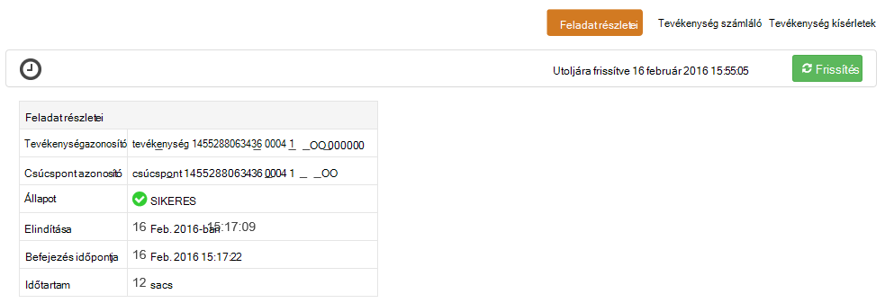

<properties
pageTitle="Tez felhasználói felület használata a Windows-alapú HDInsight |} Azure"
description="Megtudhatja, hogy miként használatát a felhasználói felület Tez Tez feladatok a Windows-alapú HDInsight hdinsight szolgáltatásból lehetőségre."
services="hdinsight"
documentationCenter=""
authors="Blackmist"
manager="jhubbard"
editor="cgronlun"/>

<tags
ms.service="hdinsight"
ms.devlang="na"
ms.topic="article"
ms.tgt_pltfrm="na"
ms.workload="big-data"
ms.date="10/04/2016"
ms.author="larryfr"/>

# A felhasználói felület Tez használatát a Windows-alapú HDInsight Tez feladatok

A felhasználói felület Tez egy weblapot, és a végrehajtás motor a Windows-alapú HDInsight fürt Tez használt feladatok hibakeresési használható. A felhasználói felület Tez lehetővé teszi a feladatot, a kapcsolódó elemek diagramját, ábrázolása, mindegyik elemhez lehatolhatnak és beolvasásához, statisztika és naplózási adatait.

> [AZURE.NOTE] A dokumentum adatai a Windows-alapú HDInsight fürt jellemző. Megtekintése és hibakeresés Tez Linux-alapú HDInsight a további tudnivalókért lásd [Ambari nézetek szeretné hibakeresése Tez feladatok hdinsight szolgáltatásból lehetőségre](hdinsight-debug-ambari-tez-view.md).

## Előfeltételek

* A Windows-alapú HDInsight fürtre. Új fürt létrehozása, című [használatba Windows-alapú hdinsight szolgáltatásból lehetőségre](hdinsight-hadoop-tutorial-get-started-windows.md).

    > [AZURE.IMPORTANT] A felhasználói felület Tez a Windows-alapú HDInsight fürt után 2016 február 8-ban létrehozott csak érhető el.

* A Windows-alapú távoli asztali ügyfél.

## Tez ismertetése

Tez egy bővíthető keretrendszer Hadoop, amely nagyobb, mint a hagyományos MapReduce feldolgozási sebesség biztosít az adatkezelési. A Windows-alapú HDInsight fürt érdemes egy választható motor, amely a struktúra engedélyezheti a struktúra lekérdezés részeként a következő parancs használatával:

    set hive.execution.engine=tez;

Munka Tez elé, amikor egy irányított aciklikus Graph (DAG): a feladat szükséges műveletek végrehajtási sorrendje leíró hoz létre. Egyéni műveletek csúcsok úgynevezett, és hajtsa végre a teljes projekt valamilyen. A csúcs leírt munka tényleges végrehajtása egy tevékenység neve, és előfordulhat, hogy a fürt több csomópontok legyen elosztva.

### A felhasználói felület Tez ismertetése

A felhasználói felület Tez egy weblap tartalmaz információkat a folyamatok futnak vagy korábban futtatta Tez használatával. Lehetővé teszi a Tez, által generált DAG megtekintése keresztül fürt, elosztott hogyan számlálók, például a memóriahasználat, feladatok és a csúcsok, és a hiba adatait. Azt nyújthat hasznos információt az alábbi esetekben:

* Figyelése hosszabb ideig futó folyamatok, térkép állapotának megtekintése és csökkentse a tevékenységek.

* Korábbi adatok elemzése a sikeres vagy sikertelen folyamatok megtudhatja, hogyan javítható a feldolgozás, és miért nem sikerült.

## Egy DAG készítése

A felhasználói felület Tez, ha egy feladatot, használja a Tez motor éppen zajló értekezletet, vagy már futtatott múltbeli csak adatokat fog tartalmazni. Egyszerű struktúra lekérdezések általában hozzárendelhető Tez, szűrés, csoportosítás, rendezés illesztések, stb általában csak Tez lehetőségeket összetettebb azonban lekérdezések használata nélkül.

Kövesse az alábbi lépéseket a struktúra lekérdezést Tez hajtja végre.

1. Egy webböngészőben nyissa meg azt a https://CLUSTERNAME.azurehdinsight.net, hol __CLUSTERNAME__ -e a HDInsight fürt nevét.

2. A menüben kattintson a lap tetején jelölje ki a __Szerkesztő struktúra__. Ekkor megjelenik egy lap a következő példa a lekérdezésre.

        Select * from hivesampletable

    A példa a lekérdezésre törlése és cserélhet le a következő.

        set hive.execution.engine=tez;
        select market, state, country from hivesampletable where deviceplatform='Android' group by market, country, state;

3. Kattintson a __Küldés__ gombra. A __Feladat munkamenet__ szakaszban, a lap alján, a lekérdezés állapotának megjelenik. Miután __befejezte__a állapotra változik, a __Részletek__ hivatkozásra az eredmények megtekintéséhez. A __Feladat kimeneti__ kell lennie az alábbihoz hasonló:
        
        en-GB   Hessen      Germany
        en-GB   Kingston    Jamaica
        en-GB   Nairobi Area    Kenya

## A Tez felhasználói felületének használata

> [AZURE.NOTE] A felhasználói felület Tez érhető el csak az asztalról fürt központi csomópontok, így távoli asztali segítségével a központi csomópontok összekapcsolása.

1. Az [Azure portálon](https://portal.azure.com)válassza ki a HDInsight csoportját. A HDInsight a lap tetején jelölje be a __Távoli asztali__ ikonra. Ekkor megjelenik a távoli asztali lap

    

2. Jelölje ki a távoli asztali lap, __Csatlakozás__ központi csomópont csatlakozhat. Amikor a rendszer kéri, használatával fürt távoli asztali felhasználónevet és jelszót hitelesíteni a kapcsolatot.

    

    > [AZURE.NOTE] Ha nem engedélyezte a távoli asztali kapcsolat, adja meg a felhasználónevét, a jelszó és a lejárati dátum, majd jelölje be a engedélyezése a távoli asztali __engedélyezése__ jelölőnégyzetet. Miután engedélyezte, használja az előző lépéseket történő csatlakoztatásához.

3. Miután létrejött, nyissa meg a távoli asztali Internet Explorer, a böngésző jobb felső sarokban válassza a fogaskerék ikonra, és válassza a __Kompatibilitás nézet beállításai__.

4. __Kompatibilitási nézetbeállítások__aljától __megjelenítési intranetes helyek kompatibilitási nézetben__ , és __használja a Microsoft kompatibilitási listák__törölje a jelet a jelölőnégyzetből, és válassza a __Bezárás gombra__.

5. Az Internet Explorerben http://headnodehost:8188/tezui / # tallózással /. Ekkor megjelenik a felhasználói felület Tez

    

    A felhasználói felület Tez betöltődésekor jelenik meg, hogy fut éppen, vagy DAGs listáját a fürt futtatta. Az alapértelmezett nézet a Dag név, azonosító, küldőtől, állapot, kezdési idő, befejezési idő, időtartam, azonosítója és várólista tartalmazza. További oszlopok használata a fogaskerék ikonra a lap jobb oldali adhatók meg.

    Ha csak egy bejegyzés, a lekérdezés, amely az előző szakaszban futtatta lesz. Ha több tételek, a mezőket a fenti a DAGs keresése keresőfeltételek megadásával kereshet, majd le az __ENTER billentyűt__.

4. Jelölje ki a legutóbbi DAG bejegyzés __Dag nevét__ . Ekkor megjelenik a DAG információt, valamint a JSON-fájlokat a DAG információt tartalmazó zip letöltése lehetőséget.

    

5. Feletti __DAG részletei__ vannak több hivatkozások is használható, ha a DAG információt szeretne megjeleníteni.

    * __DAG számláló__ e DAG számláló adatait jeleníti meg.
    
    * __Grafikus nézet__ jeleníti meg ezt a DAG grafikus ábrázolása.
    
    * __Az összes csúcsok__ e DAG a csúcsok listáját jeleníti meg.
    
    * __Minden tevékenység__ az összes csúcsok a feladatok lista a DAG jeleníti meg.
    
    * __Az összes TaskAttempts__ a kísérel meg az e DAG feladatok futtatásához információkat jelenít meg.
    
    > [AZURE.NOTE] Ha az Oszlop megjelenítés csúcsok, feladatok és TaskAttempts görget, figyelje meg, hogy nincsenek-e hivatkozásra kattintva __számláló__ és __megtekintéséhez, vagy töltse le a naplók__ minden egyes sorára.

    A munkához hiba történt, ha a DAG adatait, nem sikerült, a sikertelen feladattal kapcsolatos információkat mutató hivatkozásokat találhat állapotban megjelenik. Diagnosztikai információ DAG részleteinek alatt jelenik meg.

7. Jelölje ki __a grafikus nézetet__. Megjelenik a DAG grafikus ábrázolása. Az egérrel is elhelyezhet a nézetben megjeleníteni a rá vonatkozó információkat minden csúcsra fölé.

    

8. Egy csúcsra kattintva az adott elem __Csúcsra részletek__ töltse be. Kattintson a __térkép 1__ csúcsra ezt az elemet a részletek megjelenítéséhez. Jelölje ki a __Megerősítés__ kattintva erősítse meg a navigációs sávon.

    

9. Figyelje meg, hogy most már csúcsok és a feladatok kapcsolódó hivatkozások a lap tetején.

    > [AZURE.NOTE] Is is odaér ezen az oldalon vissza __DAG részletei__, __Csúcsra részletek__kijelölése, és kiválasztja a __térkép 1__ csomópontra.

    * __Csúcspont számláló__ a csúcs számláló adatait jeleníti meg.
    
    * __Feladatok__ a csúcs feladatok jeleníti meg.
    
    * __Tevékenység megpróbálja__ információkat jelenít meg a csúcs feladatok futtatásához kísérletek.
    
    * __Adatforrások és mosdók__ adatforrások jeleníti meg, és a szénfelhalmozásra a csúcs.

    > [AZURE.NOTE] Mint az előző menüvel görgetve oszlopban megjelenített, a feladatok, feladat kísérletek, és a források Sinks__ mindegyik elemhez további információkra mutató hivatkozások megjelenítéséhez.

10. Jelölje ki a __tevékenységeket__, és válassza az elem nevű __00_000000__. Ez megjeleníti a __Feladat részletei__ ehhez a feladathoz. A képernyőn __Tevékenység számláló__ és a __Tevékenység kísérletek__megtekintése.

    

## Következő lépések

Most, hogy a Tez nézet használata van megtanulta, tudjon meg többet [A HDInsight struktúra használatával](hdinsight-use-hive.md).

Részletesebb technikai információt a Tez című témakörben talál a [Hortonworks Tez honlapját](http://hortonworks.com/hadoop/tez/).
