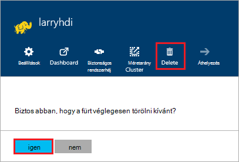

<properties
pageTitle="Egy HDInsight fürthöz törlése |} Azure"
description="Információ arról, hogy a különböző módszereket, hogy egy HDInsight fürthöz törölheti."
services="hdinsight"
documentationCenter=""
authors="Blackmist"
manager="jhubbard"
editor="cgronlun"/>

<tags
ms.service="hdinsight"
ms.devlang="na"
ms.topic="article"
ms.tgt_pltfrm="na"
ms.workload="big-data"
ms.date="10/28/2016"
ms.author="larryfr"/>

#Egy HDInsight fürthöz törlése

HDInsight fürt számlázási elindul, miután létrehozott egy fürt, és leáll, amikor a fürt törlődik, és arányosított percenként, így mindig törölnie kell a fürt Ha már nincs használatban. A jelen dokumentum megtanulhatja az Azure-portálra, Azure PowerShell és az Azure CLI fürt törlése.

> [AZURE.IMPORTANT] Egy HDInsight fürthöz törlése nem törli az Azure tároló fiókok fürthöz társított. Így megőrzése, és újbóli a fürt tárolt adatokat.

##Azure portál

1. Jelentkezzen be az [Azure-portálra](https://portal.azure.com) , és válassza ki a HDInsight csoportját. Ha a HDInsight fürt nem kitűzi az irányítópult, is kereshet, keresés (Nagyító ikon,) mezőben név szerint a navigációs sáv jobb oldalán.

    

2. A lap a fürt nyit meg, miután kattintson a __Törlés__ ikonra. Amikor a rendszer kéri, válassza az __Igen__ a fürt törléséhez.

    

##Azure PowerShell

Egy PowerShell-parancssorában a fürt törléséhez használja a következő parancsot:

    Remove-AzureRmHDInsightCluster -ClusterName CLUSTERNAME

__CLUSTERNAME__ cserélje le a HDInsight fürt nevét.

##Azure CLI

A parancssorból a következő segítségével a fürt törlése:

    azure hdinsight cluster delete CLUSTERNAME
    
__CLUSTERNAME__ cserélje le a HDInsight fürt nevét.
