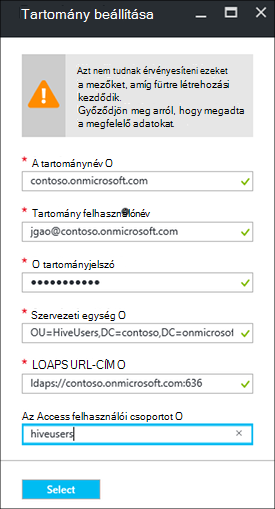

<properties
    pageTitle="Konfigurálja a HDInsight tartományhoz fürt |} Microsoft Azure"
    description="Megtudhatja, hogy miként állíthatja be, és konfigurálja a HDInsight tartományhoz fürt"
    services="hdinsight"
    documentationCenter=""
    authors="saurinsh"
    manager="jhubbard"
    editor="cgronlun"
    tags=""/>

<tags
    ms.service="hdinsight"
    ms.devlang="na"
    ms.topic="article"
    ms.tgt_pltfrm="na"
    ms.workload="big-data"
    ms.date="10/26/2016"
    ms.author="saurinsh"/>

# Konfigurálja a HDInsight tartományhoz fürt (előzetes verzió)

Megtudhatja, hogy miként állíthatja be az Azure hdinsight szolgáltatáshoz fürt és Azure Active Directory (Azure Active Directory) [Apache Pletyka](http://hortonworks.com/apache/ranger/) erős hitelesítés és a multimédiás szerepköralapú hozzáférés-szerepalapú házirendek előnyeit.  A tartományhoz HDInsight csak a Linux-alapú fürt állítható be. További tudnivalókért olvassa el a [bevezetésére tartományhoz HDInsight fürt](hdinsight-domain-joined-introduction.md)című témakört.

Ez a cikk az első oktatóprogram sorozatának a következő:

- Hozzon létre egy HDInsight fürthöz csatlakozik az Azure Active Directory (keresztül az Azure Directory tartományi szolgáltatások lehetősége) Apache Pletyka engedélyezve van.
- Hozzon létre és struktúra házirendek Apache Pletyka keresztül, és engedélyezése a felhasználók (például az adatok tudósok) struktúra ODBC-alapú eszközök, például az Excel stb Tableau használatával csatlakozhat. A Microsoft más munkaterhelésekből, például HBase, külső és vihar, amint a tartományhoz tartozó HDInsight megadásáról működik.

Példa a végleges topológia a következőképpen néz ki:

Mivel az Azure Active Directory jelenleg csak akkor támogatja a klasszikus virtuális hálózatok (VNets), és Linux-alapú HDInsight fürtök csak támogatási Azure erőforrás-kezelő VNets, HDInsight Azure AD-integráció és elő kell készítenie két VNets egy peering közöttük. Összehasonlító információ a két környezetben modelljei közötti [Azure erőforrás-kezelő klasszikus telepítési összehasonlítása: az erőforrások állapotát és üzembe modellek megértéséhez](../resource-manager-deployment-model.md). Az ugyanazon régió az Azure Active Directory tartományi szolgáltatások, a két VNets kell lennie.

Azure szolgáltatásnevek globálisan egyedinek kell lennie. A következő neveket használják, ebben az oktatóanyagban. A Contoso kitalált nevét. Amikor a mesteroldalhoz az oktatóprogram *contoso* kell cserélje egy másik nevet. 
    
**Nevek:**

|A tulajdonság|Érték|
|--------|-----|
| Azure Active Directory VNet|contosoaadvnet|
| Azure Active Directory virtuális gép (virtuális)|contosoaadadmin. A virtuális szervezeti egység konfigurálása és a DNS-zóna fordított szolgál.|
| Azure Active directory|contosoaaddirectory|
| Azure Active Directory tartományi neve|a Contoso (contoso.onmicrosoft.com)|
| HDInsight VNet|contosohdivnet|
| Erőforráscsoport HDInsight VNet|contosohdirg|
| HDInsight fürthöz|contosohdicluster|

Ebben az oktatóanyagban lépései a tartományhoz tartozó HDInsight fürtre lehetőségeit. Minden szakasz más cikkekre mutató hivatkozásokat tartalmaz a további információt.

## Előfeltétel:

- Ismerkedjen meg az [Azure Active Directory tartományi szolgáltatások](https://azure.microsoft.com/services/active-directory-ds/) [árak](https://azure.microsoft.com/pricing/details/active-directory-ds/) felépítésétől.
- Győződjön meg arról, hogy az előfizetés whitelisted ez nyilvános előzetes verzió. E-mailben elküldheti tehetné hdipreview@microsoft.com az előfizetés azonosítójával.
- SSL-tanúsítvány, amely a tartomány egy aláírási hitelesítésszolgáltató alá. A tanúsítvány biztonságos LDAP konfigurálásával van szükség. Önaláírt tanúsítványok nem használhatók.

## Eljárások

1. Az Azure Active Directory-Azure klasszikus VNet hozhat létre.  
2. Hozzon létre és Azure Active Directory és Azure Active Directory tartományi szolgáltatások konfigurálása.
3. A klasszikus VNet hozhat létre szervezeti egység adja hozzá a virtuális. 
4. Hozzon létre egy szervezeti egység az Azure Active Directory tartományi szolgáltatások.
5. Hozzon létre egy HDInsight VNet az Azure erőforrás kezelési módot.
6. Az Azure Active Directory tartományi szolgáltatások fordított DNS-zónák beállítása
6. A két Peer VNets.
7. Hozzon létre egy HDInsight fürthöz.

> [AZURE.NOTE] Ebben az oktatóanyagban feltételezi, hogy nem rendelkezik az Azure AD. Ha egy, a 2 része kihagyhatja.
    
## Hozzon létre egy Azure klasszikus VNet

Ebben a részben hozzon létre egy klasszikus VNet az Azure portálon. A következő szakaszban az Azure Active Directory tartományi Szolgáltatásokban szereplő a klasszikus VNet az Azure AD-engedélyezése. Az alábbi eljárás és más VNet létrehozási módszerekkel kapcsolatos további tudnivalókért lásd: a [Create (klasszikus), az Azure portal segítségével virtuális hálózat](../virtual-network/virtual-networks-create-vnet-classic-portal.md).

**A klasszikus VNet létrehozása**

1. Bejelentkezés az [Azure-portálon](https://portal.azure.com). 
2. Kattintson az **Új** > **hálózati** > **virtuális hálózat**.
3. A **Válasszon ki egy telepítési modellt**jelölje be a **Klasszikus**, és kattintson a **Létrehozás**gombra.
4. Adja meg, vagy válasszon az alábbi értékeket:

    - **Név**: contosoaadvnet
    - **Címterület**: 10.1.0.0/16
    - **Alhálózat neve**: Alhalozat_1
    - **Alhálózat címtartományokat**: 10.1.0.0/24
    - **Előfizetés**: (jelöljön ki egy előfizetést, ez VNet létrehozására használható.)
    - **ResourceGroup**:
    - **Hely**: (válassza a HDInsight fürt terület.)

        > [AZURE.IMPORTANT] Akkor kell választania egy helyet, amely támogatja az Azure Active Directory tartományi szolgáltatások. További tudnivalókért lásd: a [termékek terület áll rendelkezésre](https://azure.microsoft.com/en-us/regions/services/). 
        >
        > Az ugyanazon régió az Azure Active Directory tartományi szolgáltatások, a klasszikus VNet, mind az erőforrás csoport VNet kell lennie.

5. Kattintson a **Create** a VNet létrehozásához.

## Létrehozása és konfigurálása az Azure Active Directory tartományi Szolgáltatásokban az Azure Active Directory számára

Ebben a részben lesz:

1. Hozzon létre egy Azure AD.
2. Hozzon létre az Azure Active Directory-felhasználók. Ezek a felhasználók olyan felhasználók, tartomány. Az első felhasználó esetében a HDInsight fürt konfigurálása az Azure Active Directory használja.  A két mások nem kötelező ebben az oktatóanyagban. Használatuk a [tartományhoz tartozó HDInsight fürt házirendek beállítása struktúra](hdinsight-domain-joined-run-hive.md) Apache Pletyka házirendek beállításakor.
3. A AAD Adatközpont rendszergazdák csoport létrehozása és az Azure Active Directory-felhasználó felvétele a csoportba. A szervezeti egység létrehozása a felhasználó segítségével.
4. Engedélyezze az Azure Active Directory tartományi szolgáltatások (Azure AD DS) az Azure Active Directory számára.
7. Állítsa be az Azure Active Directory LDAPS. Az olvasási és írási Azure Active Directory Lightweight Directory Access Protocol (LDAP) segítségével.

Ha inkább egy meglévő Azure Active Directory használja, kihagyhatja 1 és 2 lépéseket.

**Az Azure Active Directory létrehozása**

1. Az [Azure klasszikus portálon](https://manage.windowsazure.com)kattintson az **Új** > **Alkalmazás szolgáltatások** > **Az Active Directory** > **címtár** > **Egyéni létrehozása**. 
3. Adja meg, vagy válasszon az alábbi értékeket:

    - **Név**: contosoaaddirectory
    - **Tartománynév**: contoso.  Ez a név globálisan egyedinek kell lennie.
    - **Ország vagy régió**: Jelölje ki az adott országban vagy régióban.
4. Kattintson a **kész**gombra.

**Azure AD-felhasználó létrehozása**

1. Az [Azure klasszikus portálon](https://manage.windowsazure.com)kattintson az **Active Directory** -> **contosoaaddirectory**. 
3. A felső menüben kattintson a **felhasználók** elemre.
4. Kattintson a **felhasználó hozzáadása**elemre.
4. Írja be a **Felhasználó nevét**, és kattintson a **Tovább gombra**. 
5. Felhasználói profil; konfigurálása **Szerepkör**a **Globális rendszergazda**; elemre és kattintson a **Tovább gombra**.  A globális rendszergazdai szerep szervezeti egység létrehozására van szükség.
6. Kattintson a **Létrehozás** megszerezni ideiglenes jelszót.
7. Másolat készítése a jelszót, és kattintson a **kész**gombra. Ebben az oktatóanyagban belül, fogja használni a globális rendszergazdai felhasználói szervezeti egység létrehozásához, és fordított DNS konfigurálása a felügyeleti virtuális bejelentkezés.

Kövesse ugyanazt az eljárást két további felhasználók létrehozása és a **felhasználói** szerepkör, hiveuser1 hiveuser2. A következő felhasználók lesz a [tartományhoz tartozó HDInsight fürt házirendek beállítása struktúra](hdinsight-domain-joined-run-hive.md).

**A AAD Adatközpont rendszergazdák csoport létrehozásához, és Azure AD-felhasználó hozzáadása**

1. Az [Azure klasszikus portálon](https://manage.windowsazure.com)kattintson az **Active Directory** > **contosoaaddirectory**. 
3. A felső menüben kattintson a **csoportok** elemre.
4. Kattintson a **csoport hozzáadása** vagy a **csoport hozzáadása**gombra.
5. Adja meg, vagy válasszon az alábbi értékeket:

    - **Név**: AAD Adatközpont rendszergazdák.  Ne módosítsa a csoport nevét.
    - **Csoporttípus**: biztonsági.
6. Kattintson a **kész**gombra.
7. Kattintson a **AAD Adatközpont rendszergazdák** kattintva nyissa meg a csoportot.
8. Kattintson a **Tagok hozzáadása**gombra.
9. Jelölje ki az első felhasználó az előző lépésben létrehozott, és kattintson a **kész**gombra.
10. Ismételje meg ezeket a lépéseket, **HiveUsers**nevű másik csoport létrehozásához, és a két struktúra felhasználók felvétele a csoportba.

További tudnivalókért olvassa el a [Azure Active Directory tartományi szolgáltatások (előzetes verzió) – a "AAD Adatközpont rendszergazdák" csoport létrehozása](../active-directory-domain-services/active-directory-ds-getting-started.md)című témakört.

**Az Azure Active Directory Azure Active Directory tartományi szolgáltatások engedélyezése**

1. Az [Azure klasszikus portálon](https://manage.windowsazure.com)kattintson az **Active Directory** > **contosoaaddirectory**. 
3. A felső menüben kattintson a **Konfigurálás** gombra.
4. Görgessen le a **Tartományi szolgáltatások**, és állítsa be a következő értékeket:

    - **A Directory tartományi szolgáltatások engedélyezése**: Igen.
    - **A tartományi szolgáltatások DNS-neve**: az Azure könyvtár alapértelmezett DNS nevét jeleníti meg. Ha például contoso.onmicrosoft.com.
    - **Csatlakozás tartományi szolgáltatások virtuális hálózathoz**: válassza ki a korábban létrehozott, azaz **contosoaadvnet**klasszikus virtuális hálózat.
    
6. A lap alján a **Mentés** gombra. Ekkor megjelenik **függőben...** mellett **a Directory tartományi szolgáltatások engedélyezése**.  
7. Várnia **függőben...** eltűnik, és **IP-cím** töltve kap. Két IP-címek fog első kitölti. Ezek az IP-címek a tartomány vezérlők tartományi szolgáltatások által kiépítve. Minden IP-cím után kiépített, és készen áll a megfelelő tartományvezérlőnek lesz látható. Jegyezze fel a két IP-címet. Szüksége lesz rájuk később.

További tudnivalókért olvassa el az [Azure Active Directory tartományi szolgáltatások (előzetes verzió) – engedélyezése Azure Active Directory tartományi szolgáltatások](../active-directory-domain-services/active-directory-ds-getting-started-enableaadds.md)című témakört.

**Jelszó szinkronizálása**

Saját tartomány használata, ha meg kell szinkronizálni a jelszót. Lásd: [Azure Active Directory tartományi szolgáltatások, a felhőben Azure-jelszó-szinkronizálás engedélyezése az Active directory](../active-directory-domain-services/active-directory-ds-getting-started-password-sync.md).

**Az Azure Active Directory LDAPS konfigurálása**

1. A tartomány egy aláírási hitelesítésszolgáltató alá SSL-tanúsítvány beszerzése. Önaláírt tanúsítványok nem használhatók. Ha nem tudja SSL-tanúsítvány, kérjük, keresse meg a hdipreview@microsoft.com kivételt.
1. Az [Azure klasszikus portálon](https://manage.windowsazure.com)kattintson az **Active Directory** > **contosoaaddirectory**. 
3. A felső menüben kattintson a **Konfigurálás** gombra.
4. Görgessen le a **szolgáltatáshoz**.
5. Kattintson a **Konfigurálás tanúsítvány**.
6. Kövesse a utasítás biztonságitanúsítvány-fájl, és a jelszó megadását. Ekkor megjelenik **függőben...** mellett **a Directory tartományi szolgáltatások engedélyezése**.  
7. Várnia **függőben...** eltűnik, és a **Biztonságos LDAP tanúsítvány** gépe van feltöltve.  Ez a 10 perc vagy több kitölthetik.
 
>[AZURE.NOTE] Ha éppen futnak néhány háttérben futó feladatokat az Azure Active Directory tartományi szolgáltatások, tanúsítvány feltöltése közben hibát jelenhetnek meg - a <i>van egy folyamatban lévő műveletet a bérlői webhelyen. Próbálja meg később újra</i>.  Abban az esetben, ha ezt a hibát tapasztal, próbálja meg később újra. A tartomány második vezérlő IP órát is igénybe vehet fel 3 való kell építenie.

További tudnivalókért olvassa el a [Konfigurálása biztonságos LDAP (LDAPS) felügyelt Azure Active Directory tartományi szolgáltatások tartomány esetén](../active-directory-domain-services/active-directory-ds-admin-guide-configure-secure-ldap.md)című témakört.

## Szervezeti egység konfigurálása és a DNS megfordítása

Ebben a részben egy virtuális gép hozzáadása az Azure Active Directory VNet és a felügyeleti eszközök telepítése a virtuális, így szervezeti egység konfigurálása és a DNS fordított. Fordított DNS keresés olyan Kerberos-hitelesítés szükséges.

**A virtuális hálózatba virtuális gép létrehozása**

1. Az [Azure klasszikus portálon](https://manage.windowsazure.com)kattintson az **Új** > **kiszámítania** > **virtuális gép** > **A gyűjteményben**.
3. Jelöljön ki egy képet, és kattintson a **Tovább**gombra.  Ha nem tudja, hogy melyiket kívánja használni, jelölje ki az alapértelmezés szerint a **Windows Server 2012 R2 adatközponthoz**.
4. Adja meg, vagy válasszon az alábbi értékeket:

    - **Contosoaadadmin** virtuális számítógép neve:
    - Réteg: **egyszerű**
    - Az új felhasználó neve: (A felhasználónév adja meg)
    - Jelszó: (Írjon be egy jelszót)
    
    Felhívjuk a figyelmét arra a felhasználónevét és jelszavát a rendszer a helyi rendszergazdaként.
    
5. Kattintson a **Tovább** gombra
6. **Régió/virtuális hálózati**jelölje be az új virtuális hálózati létrehozott az utolsó lépésben (contosoaadvnet), és kattintson a **Tovább gombra**.
7. Kattintson a **kész**gombra.

**A virtuális gép RDP való**

1. Az [Azure klasszikus portálon](https://manage.windowsazure.com)kattintson a **virtuális gépeken futó** > **contosoaadadmin**.
3. A felső menüből az **Irányítópult** elemre.
4. Kattintson a **Csatlakozás** az oldal alján.
5. Kövesse az utasításokat és a helyi rendszergazdai felhasználónevével és jelszavával a kapcsolatot.

**Virtuális az Azure Active Directory tartományi való csatlakozáshoz**

1. Az RDP-munkamenet, kattintson a **Start**gombra, és kattintson a **Kiszolgáló elemre**.
2. A bal oldali menüben kattintson a **Helyi kiszolgálóra** .
3. A munkacsoportból kattintson a **munkacsoport**.
4. Kattintson a **Módosítás**gombra.
5. Kattintson a **tartomány**, írja be a **contoso.onmicrosoft.com**, és kattintson **az OK**gombra.
6. Adja meg a tartomány felhasználói hitelesítő adatokat, és kattintson **az OK**gombra.
7. Kattintson az **OK gombra**.
8. Kattintson az **OK** lenyomásával fogadja el a indítsa újra a számítógépet.
9. Kattintson a **Bezárás**gombra.
10. Kattintson az **Újraindítás gombra**.

További tudnivalókért lásd: a [Bekapcsolódás a Windows Server virtuális gép egy felügyelt tartományra](../active-directory-domain-services/active-directory-ds-admin-guide-join-windows-vm.md).

**Active Directory felügyeleti eszközök és a DNS-eszközök telepítése**

1. RDP be **contosoaadadmin** az Azure Active Directory felhasználói fiók használatával.
2. Kattintson a **Start**gombra, és kattintson a **Kiszolgálókezelő**.
3. A bal oldali menüben az **Irányítópult** elemre.
4. Kattintson a **kezelés**elemre, és kattintson a **Hozzáadás szerepkörök és szolgáltatások**.
5. Kattintson a **Tovább**gombra.
6. Jelölje ki a **szerepköralapú vagy a szolgáltatás-alapú telepítés**, és kattintson a **Tovább gombra**.
7. Jelölje ki az aktuális virtuális gép a kiszolgáló készletből, és kattintson a **Tovább**gombra.
8. Kattintson a **Tovább** gombra ugorja át a szerepköröket.
9. Bontsa ki a **Távoli kiszolgáló felügyeleti eszközei**, bontsa ki a **Szerepkör-felügyeleti eszközök**, és jelölje ki az **Active Directory tartományi szolgáltatások és eszközök Directory** és a **DNS-kiszolgálói eszközök**, majd a **Tovább**gombra. 
10. Kattintson a **Tovább** gombra
10. Kattintson a **telepítés**gombra.

További tudnivalókért lásd: [telepítse az Active Directory felügyeleti eszközök a virtuális gépen](../active-directory-domain-services/active-directory-ds-admin-guide-administer-domain.md#task-2---install-active-directory-administration-tools-on-the-virtual-machine).

**Fordított DNS konfigurálása**

1. RDP való contosoaadadmin az Azure Active Directory felhasználói fiók használatával.
2. Kattintson a **Start**gombra, kattintson a **Felügyeleti eszközök**elemre, és kattintson a **DNS**lehetőséget. 
3. **Nem** szeretne ugrani, ContosoAADAdmin hozzáadása gombra.
4. Jelölje be **a következő számítógépen**, adja meg az első, a korábban beállított DNS-kiszolgáló IP-címét, és kattintson **az OK**gombra.  A bal oldali ablaktáblában megjelenik a Adatközpont DNS kell látni.
3. Bontsa ki az Adatközpont/DNS-kiszolgálót, kattintson a jobb gombbal a **Fordított sorrend címkeresési zónák**, és kattintson az **Új zóna**. Ekkor megnyílik az új zóna varázslót.
4. Kattintson a **Tovább**gombra.
5. Jelölje ki az **elsődleges zónában**, és kattintson a **Tovább gombra**.
6. Jelölje ki **az összes DNS-kiszolgálók futó ebben a tartományban**, és kattintson a **Tovább gombra**.
6. Jelölje ki a **IPv4 fordított keresési zónában**, és kattintson a **Tovább gombra**.
7. A **Hálózati azonosítója**a írja be az előtag HDInsight VNET hálózati, és kattintson a **Tovább gombra**. A HDInsight VNet hoz létre, a következő szakaszban.
8. Kattintson a **Tovább**gombra.
9. Kattintson a **Tovább**gombra.
10. Kattintson a **Befejezés gombra**.

A létrehozott szervezeti egység ezután lesz a HDInsight fürt létrehozásakor. A Hadoop rendszer felhasználók és a fiókok a szervezeti egység kerülnek.

**Szervezeti egység (szervezeti egység) létrehozása az Azure Active Directory tartományi szolgáltatások felügyelt tartományban**

1. A tartományi fiók használata **contosoaadadmin** RDP ez **AAD Adatközpont rendszergazdák** csoportjának.
2. Kattintson a **Start**gombra, kattintson a **Felügyeleti eszközök**elemre, és válassza az **Active Directory felügyeleti központ**lehetőséget.
5. Kattintson a bal oldali ablaktáblában a tartomány nevére. Ha például a contoso.
6. **A munkaablak** tartomány neve alatt kattintson az **Új** gombra, és kattintson a **Szervezeti egységre**.
7. Írjon be egy nevet, például **HDInsightOU**, és kattintson **az OK**gombra. 

További információ a [szervezeti egységre (szervezeti egység) az Azure Active Directory tartományi szolgáltatások felügyelt tartományban létrehozása](../active-directory-domain-services/active-directory-ds-admin-guide-create-ou.md)című témakör tartalmaz.

## Hozzon létre egy erőforrás-kezelő VNet HDInsight fürthöz

Ez a szakasz létrehoz egy Azure erőforrás-kezelő VNet a HDInsight fürt használt. Azure VNET más módszerekkel létrehozásával kapcsolatos további tudnivalókért lásd: a [virtuális hálózat létrehozása](../virtual-network/virtual-networks-create-vnet-arm-pportal.md)

Miután létrehozta a VNet, konfigurálja az erőforrás-kezelő VNet ugyanazt a DNS-kiszolgálók, mint az Azure Active Directory VNet használni. Ebben az oktatóanyagban hozhat létre a klasszikus VNet és az Azure Active Directory követte a lépéseket, ha a DNS-kiszolgálók pedig 10.1.0.4 10.1.0.5.

**Egy erőforrás-kezelő VNet létrehozása**

1. Bejelentkezés az [Azure-portálon](https://portal.azure.com).
2. Kattintson az **Új**, **hálózati**, és ezután **virtuális hálózati**. 
3. A **Válasszon ki egy telepítési modellt**jelölje be az **Erőforrás-kezelő**, és kattintson a **Létrehozás**gombra.
4. Írja be vagy válassza ki a következő értékeket:

    - **Név**: contosohdivnet
    - **Címterület**: 10.2.0.0/16. Győződjön meg arról, hogy a cím nem áll átfedésben az IP-címtartományokat, a klasszikus VNet a.
    - **Alhálózat neve**: Alhalozat_1
    - **Alhálózat címtartományokat**: 10.2.0.0/24
    - **Előfizetés**: (az Azure előfizetés kiválasztása)
    - **Erőforráscsoport**: contosohdirg
    - **Hely**: (ugyanazon a helyen válassza az Azure Active Directory VNet, azaz contosoaadvnet másként.)

5. Kattintson a **létrehozása**gombra.

**Az erőforrás-kezelő VNet DNS konfigurálása**

1. Az [Azure-portálon](https://portal.azure.com)kattintson a **További szolgáltatások** -> **virtuális hálózatok**. Győződjön meg róla, a nem **virtuális hálózatok (klasszikus)**gombra.
2. Kattintson a **contosohdivnet**.
4. Kattintson a **DNS-kiszolgálóiról** az új lap bal szélén.
6. Kattintson az **egyéni**elemre, és írja be az alábbi értékeket:

    - 10.1.0.4
    - 10.1.0.5

    A DNS-kiszolgáló IP-címek egyeznie kell az Azure Active Directory VNet (klasszikus VNet) a DNS-kiszolgálóra.
7. Kattintson a **Mentés**gombra.

## Az Azure Active Directory VNet és a HDInsight VNet Peer

**A két VNet peer való**

1. Bejelentkezés az [Azure-portálon](https://portal.azure.com).
2. A bal oldali menüben kattintson a **További szolgáltatások** elemre.
3. Kattintson a **virtuális hálózatok**. Ne kattintson a **virtuális hálózatok (klasszikus)**.
4. Kattintson a **contosohdivnet**.  Ez az a HDInsight VNet.
5. Kattintson a lap bal oldali menüjében kattintson a **Peerings** .
6. A felső menüben kattintson a **Hozzáadás** gombra. A **peering hozzáadása** lap nyílik meg.
7. **Peering hozzáadása** lap meg vagy jelölje ki a következő értékeket:

    - **Név**: ContosoAADHDIVNetPeering
    - **Virtuális hálózati telepítési modell**: klasszikus
    - **Előfizetés**: Jelölje ki az előfizetés nevét, a hagyományos (Azure Active Directory) vnet használható.
    - **Virtuális hálózati**: contosoaadvnet.
    - **Virtuális hálózati hozzáférés engedélyezése**: (ellenőrzés)
    - **Engedélyezése a forgalom átirányítása**: (ellenőrzés). Hagyja bejelölve a másik két jelölőnégyzetét.

8. Kattintson az **OK gombra**.

## HDInsight fürt létrehozása

Ebben a szakaszban a HDInsight az Azure portál vagy az [erőforrás-kezelő Azure-sablon](../resource-group-template-deploy.md)Linux-alapú Hadoop fürt létrehozása. Más fürt létrehozási módszerek és bemutatása a beállításokat, témakörben [létrehozása HDInsight fürt](hdinsight-hadoop-provision-linux-clusters.md). Erőforrás-kezelő sablonnal Hadoop fürt létrehozása az HDInsight kapcsolatos további tudnivalókért olvassa el a [Hadoop létrehozása fürt HDInsight erőforrás-kezelő sablonok használata a](hdinsight-hadoop-create-windows-clusters-arm-templates.md) című témakört.

**Az Azure portálon tartományhoz HDInsight fürt létrehozása**

1. Bejelentkezés az [Azure-portálon](https://portal.azure.com).
2. Kattintson az **Új**, **üzletiintelligencia- + analytics**, és ezután **hdinsight szolgáltatásból lehetőségre**.
3. Írja be vagy jelölje ki az alábbi értékeket az **Új HDInsight fürt** lap:

    - **Csoport neve**: írja be a tartományhoz tartozó HDInsight fürt új csoport nevét.
    - **Előfizetés**: jelölje be az Azure előfizetéssel a fürt létrehozására használható.
    - **Fürt beállítása**:

        - **Fürt típusa**: Hadoop. A tartományhoz HDInsight jelenleg csak támogatják Hadoop fürtök.
        - **Operációs rendszer**: Linux rendszerhez.  A tartományhoz HDInsight Linux-alapú HDInsight fürt csak támogatott.
        - **Verzió**: Hadoop 2.7.3 (HDI 3.5-ös). A tartományhoz HDInsight csak a HDInsight fürt 3.5-ös verzió támogatott.
        - **Fürt típusa**: prémium verzió

        Kattintson a **Jelölje ki** a módosítások mentéséhez.

    - **Hitelesítő adatok**: állítsa be a fürt felhasználó és a SSH felhasználó hitelesítő adatait.
    - **Adatforrás**: hozzon létre egy új tárterület-fiókot vagy egy meglévő tárterület-fiókot használnak az alapértelmezett tárterület-fiók a HDInsight fürt. A hely ugyanaz, mint a két VNets kell lennie.  A helye is az a HDInsight fürt.
    - **Árak**: válassza ki a fürt dolgozó csomópontok számát.
    - A **Speciális beállítások**: 

        - A **tartomány való csatlakozás és a Vnet/alhálózat**: 

            - A **domain settings**: 

                - **Tartománynév**: contoso.onmicrosoft.com
                - **Tartomány felhasználónév**: írja be a felhasználó tartománynév. A tartományhoz a következő jogosultsággal kell rendelkeznie: gépek csatlakozzon a tartományt, és helyezze el őket a korábbi; konfigurált szervezeti egység Hozzon létre szolgáltatás rendszerbiztonsági belül, a korábbi; beállított szervezeti egység Fordított DNS-bejegyzések létrehozása. A tartomány felhasználói válik a rendszergazda a tartományhoz tartozó HDInsight fürt.
                - **Tartomány jelszó**: írja be a tartomány felhasználói jelszót.
                - **Szervezeti egység**: Adja meg a szervezeti egységre munkamegosztást, a korábban beállított megkülönböztető nevét. Példa: OU = HDInsightOU, Adatközpont = contoso, Adatközpont onmicrosoft, Adatközpont = = hu
                - **LDAPS URL-címe**: ldaps://contoso.onmicrosoft.com:636
                - **Az Access felhasználói csoport**: Adja meg, hogy a biztonsági csoport, amelynek kívánja a fürthöz szinkronizálási felhasználók. Ha például HiveUsers.

                Kattintson a **Jelölje ki** a módosítások mentéséhez.

                
            - **Virtuális hálózati**: contosohdivnet
            - **Alhálózat**: Alhalozat_1

            Kattintson a **Jelölje ki** a módosítások mentéséhez.       
        Kattintson a **Jelölje ki** a módosítások mentéséhez.
    - **Erőforráscsoport**: jelölje be az erőforráscsoport használható a HDInsight VNet (contosohdirg).

4. Kattintson a **létrehozása**gombra.  

Egy másik tartományhoz HDInsight fürt hozhat létre, hogy az erőforrás-kezelés Azure sablonnal. Az alábbi eljárás megmutatja, hogyan:

**Erőforrás-kezelés sablon használatával tartományhoz HDInsight fürt létrehozása**

1. Kattintson az alábbi képen egy erőforrás-kezelő sablon megnyitásához az Azure-portálon. Az erőforrás-kezelő sablon nyilvános blob-tárolóban található. 

    

2. A **Paraméterek** lap az adja meg az alábbi értékeket:

    - **Előfizetés**: (az Azure előfizetés kiválasztása).
    - **Erőforráscsoport**: kattintson a **meglévő használja**, és adja meg az azonos erőforráscsoport használta.  Ha például contosohdirg. 
    - **Hely**: Adjon meg egy erőforrás csoport helyet.
    - **Fürt neve**: írja be a létrehozandó Hadoop fürt nevét. Ha például contosohdicluster.
    - **Fürt típusa**: Jelölje ki a csoport típusát.  Az alapértelmezett érték **hadoop**.
    - **Hely**: válassza ki a fürt helyét.  Az alapértelmezett tárterület-fiókot használ, ugyanazon a helyen.
    - **Fürt dolgozó csomópont száma**: válassza ki a megfelelő dolgozó csomópontot.
    - **Fürt felhasználónév és jelszó**: az alapértelmezett bejelentkezési neve **felügyeleti**.
    - **SSH felhasználónév és jelszó**: az alapértelmezett felhasználónév szó **sshuser**.  Nevezze át. 
    - **Virtuális hálózati azonosító**: /subscriptions/&lt;SubscriptionID > /resourceGroups/&lt;ResourceGroupName > /providers/Microsoft.Network/virtualNetworks/&lt;VNetName >
    - **Virtuális alhálózathoz**: /subscriptions/&lt;SubscriptionID > /resourceGroups/&lt;ResourceGroupName > /providers/Microsoft.Network/virtualNetworks/&lt;VNetName >/alhálózat/Alhalozat_1
    - **Tartománynév**: contoso.onmicrosoft.com
    - **Szervezeti egység DN**: OU = HDInsightOU, Adatközpont = contoso, Adatközpont onmicrosoft, Adatközpont = = hu
    - **Fürt felhasználó csoport D Ns**: "\"CN = HiveUsers, OU = AADDC felhasználók, Adatközpont =<DomainName>, Adatközpont onmicrosoft, Adatközpont = = hu\""
    - **LDAPUrls**: ["ldaps://contoso.onmicrosoft.com:636"]
    - **DomainAdminUserName**: (adja meg a tartomány rendszergazdai felhasználónevével)
    - **Értéket**: (adja meg a tartomány rendszergazdai jelszó)
    - **E elfogadja a fenti feltételek mellett**: (ellenőrzés)
    - **PIN-kód irányítópult**: (ellenőrzés)

6. Kattintson a **vásárlás**gombra. **A sablon üzembe helyezése telepítésének**című új csempe jelenik meg. Tart kapcsolatos körülbelül 20 perc fürt létrehozásához. Amikor létrejött a fürt, rákattintva a portálon nyissa meg a csoportját fel.

Miután az oktatóanyagot, érdemes lehet a fürt törléséhez. HDInsight az adatok Azure-tárolóban lévő tárolja, törölheti a fürtre biztonságosan, ha még nem használja. Is az előfizetést terhelő egy HDInsight fürthöz, akkor is, ha még nem használja. Mivel a fürt díjai sokszor több, mint a költségek tárolására, célszerű economic fürt törlése, ha nem használja. A fürt törlése című témakör nyújt tájékoztatást [kezelése a Hadoop fürt a HDInsight az Azure portál használatával](hdinsight-administer-use-management-portal.md#delete-clusters).

## Következő lépések

- Beállítja a struktúra házirendek és a struktúra-lekérdezések futtatása, lásd: a [tartományhoz tartozó HDInsight fürt házirendek beállítása struktúra](hdinsight-domain-joined-run-hive.md).
- Struktúra lekérdezések SSH a tartományhoz tartozó HDInsight fürt fut, című témakör tartalmaz [Használata SSH a Linux-alapú Hadoop a HDInsight Linux rendszerhez, a Unix, vagy az OS X](hdinsight-hadoop-linux-use-ssh-unix.md#connect-to-a-domain-joined-hdinsight-cluster).
