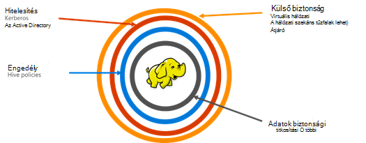

<properties
    pageTitle="Biztonságos HDInsight áttekintése |} Microsoft Azure"
    description="További tudnivalók..."
    services="hdinsight"
    documentationCenter=""
    authors="saurinsh"
    manager="jhubbard"
    editor="cgronlun"
    tags="azure-portal"/>

<tags
    ms.service="hdinsight"
    ms.devlang="na"
    ms.topic="hero-article"
    ms.tgt_pltfrm="na"
    ms.workload="big-data"
    ms.date="10/24/2016"
    ms.author="saurinsh"/>

# Bevezetése a tartományhoz tartozó HDInsight fürt (előzetes verzió)

Mindaddig, amíg az aktuális támogatott csak egy egyetlen felhasználó helyi rendszergazda Azure hdinsight szolgáltatáshoz A nagy kisebb alkalmazás csapatok és részlegek dolgozott. Hadoop függően a vállalati ágazat további Népszerűségi szerzett munkaterhelésekből szükséges a vállalati minőségű funkciók, mint az active directory alapú hitelesítés, több felhasználó támogatási és szerepköralapú hozzáférés-vezérlés az egyre fontosabb vált. Használja a tartományhoz tartozó HDInsight fürt, hozzon létre egy HDInsight fürthöz, az Active Directory-tartományhoz kapcsolódó, beállíthatja, hitelesíthet keresztül Azure Active Directory HDInsight fürthöz bejelentkezni a vállalati alkalmazottak listáját. Jelentkezzen be, vagy a HDInsight fürthöz bárki a vállalaton kívüli nem. A vállalati rendszergazda is beállíthatja a szerepköralapú hozzáférés-vezérlés struktúra biztonsági [Apache Pletyka](http://hortonworks.com/apache/ranger/)segítségével, így hozzáférés korlátozása csak, mint amennyit a szükséges adatokat. Végül a felügyeleti naplózható alkalmazottak által az adatokhoz való hozzáférést, és a hozzáférési szabályok, ezáltal elérje a vállalati erőforrások irányítási magas fokú végzett módosításokat.

[AZURE.NOTE]> Csak a struktúra terhelés Linux-alapú HDInsight fürt új leírt szolgáltatások ebben a villámnézetben érhetők el. A többi-munkaterhelésekből, például HBase, külső, vihar és Kafka, engedélyezi a későbbi kiadásokban. 

## Legfontosabb előny

Vállalati biztonsági négy nagy oszlopok – a külső biztonsági, a hitelesítés, az engedélyezés vagy a titkosítási tartalmazza.

.

### Külső biztonsági

A HDInsight külső biztonsági virtuális hálózatok és az átjáró szolgáltatás érhető el. Vállalati rendszergazda ma, hozzon létre egy HDInsight fürthöz virtuális hálózaton belül, és a hálózati biztonsági csoportok (bejövő és kimenő tűzfalszabályokat) használata a való hozzáférés korlátozása a virtuális hálózat. Csak az IP-címek a bejövő tűzfalszabályokat megfogalmazott tud kommunikálni a HDInsight fürt, így biztosítva külső biztonsági lesz. Egy másik külső biztonsági szint átjáró szolgáltatással érhető el. Az átjáró, a szolgáltatás, amely végpontként védelmet a HDInsight fürt minden bejövő kérelme első sorát. Azt elfogadja a kérést, azt ellenőrzi, és csak ezután lehetővé teszi, hogy az értekezlet-összehívást fürt, így biztosítva külső biztonsági más a csoport nevét és adattípusát csomópontjainak csomópontok átadni.

### Hitelesítés

A nyilvános előzetes verzióban a vállalati rendszergazda a tartományhoz tartozó HDInsight fürtre [virtuális hálózati](https://azure.microsoft.com/services/virtual-network/)is kiépítése. A csomópontok a HDInsight fürt fog kell a tartományhoz a vállalati kezeli. Ez az [Azure Active Directory tartományi szolgáltatások](https://technet.microsoft.com/library/cc770946.aspx)segítségével érhető el. A fürt csomópontjait tartományhoz egy, amely a vállalati kezeli. Ezzel a beállítással a vállalati alkalmazottak is jelentkezzen be a saját tartomány hitelesítő adataival fürt csomópontokat. Tartomány hitelesítő hitelesíteni más jóváhagyott végpontok, például a szín, Ambari nézetek, ODBC, JDBC, PowerShell és a fürt vezérléséhez REST API-khoz is segítségével. A rendszergazda interaktív használata a via ezeket a végpontokat fürt felhasználó számának korlátozása teljes hozzáféréssel rendelkezik.

### Engedély

A legtöbb nagyvállalatoknak követi a legjobb, hogy nem minden alkalmazott összes vállalati erőforrások hozzáféréssel rendelkezik. Az ebben a kiadásban hasonlóan a rendszergazda definiálhatók szerepköralapú hozzáférési szabályok fürt erőforrás. A rendszergazda beállíthatja például, [Apache Pletyka](http://hortonworks.com/apache/ranger/) struktúra access vezérlő házirendek beállítása. Ez a funkció biztosítja, hogy az alkalmazottak csak hozzáférhet minél több adatot, amely szükségük van a saját feladatok sikeres. A fürt SSH elérését korlátozódik is csak a rendszergazda.

### A naplózás

A HDInsight fürt erőforrásainak védelme a nem engedélyezett felhasználó, és az adatok védelme, fürt erőforrások, és az adatok minden hozzáférés naplózásának szükség nyomon követheti ezzel az illetéktelen vagy szándékolatlan access, az erőforrások. Az ebben a villámnézetben a felügyeleti tekintheti meg és az összes access jelentés HDInsight fürt és más adatok. A rendszergazda is megtekintése és minden módosítás jelentést a hozzáférési szabályok támogatott Apache Pletyka végpontok végezhető el. A tartományhoz tartozó HDInsight fürtre naplókat keresése a már jól ismert Apache Pletyka felhasználói felületének használja. Kattintson a háttér-kiszolgálói Pletyka tárolásához és a naplókat keresés [Apache Solr]( http://hortonworks.com/apache/solr/) használja.

### Titkosítás:

Adatok védelme az értekezlet szervezeti szintű biztonsági és megfelelőségi követelmények betartását, és együtt adatokhoz való hozzáférés korlátozása az illetéktelen alkalmazottak, azt is titkosítani kell titkosítással. Mindkét az adatok áruházak HDInsight fürt, Azure Blob-tároló és Azure tó adattárolás támogatja a átlátszó kiszolgálóoldali [adatok titkosításának](../storage/storage-service-encryption.md) a többi. Biztonságos HDInsight fürt zökkenőmentesen együttműködik a kiszolgáló ügyféloldali titkosítást adatok a többi lehetőséget.

## Következő lépések

- Konfigurálja a HDInsight tartományhoz fürt, [állítsa be a tartományhoz HDInsight fürt](hdinsight-domain-joined-configure.md)talál.
- Kezelése a tartományhoz tartozó HDInsight fürt [kezelése a tartományhoz HDInsight fürt](hdinsight-domain-joined-manage.md)témakörben talál.
- Beállítja a struktúra házirendek és a struktúra-lekérdezések futtatása, lásd: a [tartományhoz tartozó HDInsight fürt házirendek beállítása struktúra](hdinsight-domain-joined-run-hive.md).
- Struktúra lekérdezések SSH a tartományhoz tartozó HDInsight fürt fut, című témakör tartalmaz [Használata SSH a Linux-alapú Hadoop a HDInsight Linux rendszerhez, a Unix, vagy az OS X](hdinsight-hadoop-linux-use-ssh-unix.md#connect-to-a-domain-joined-hdinsight-cluster).