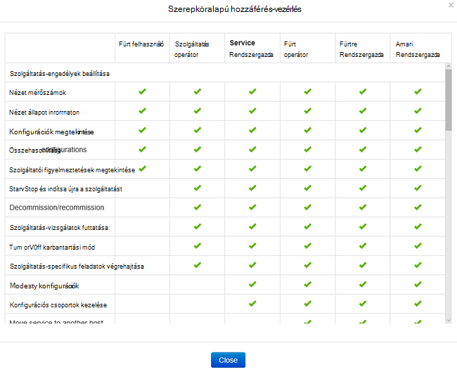
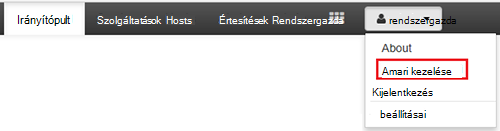
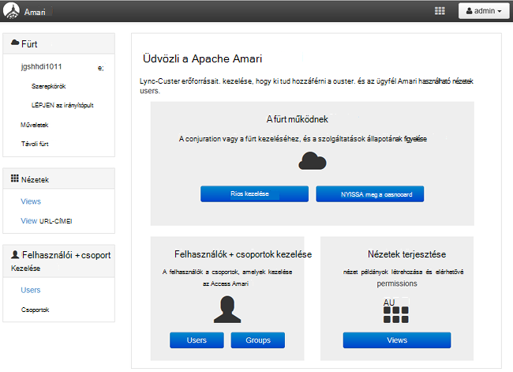
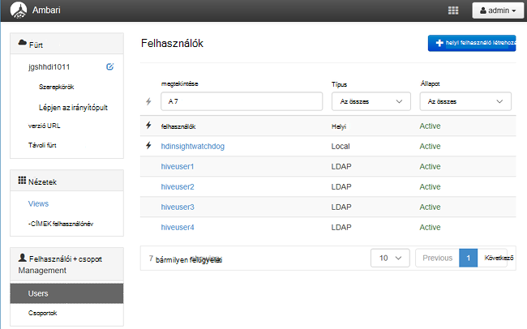
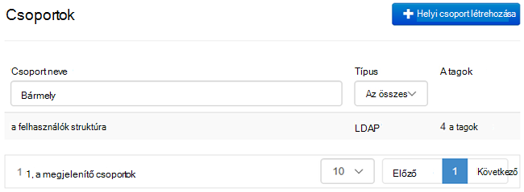
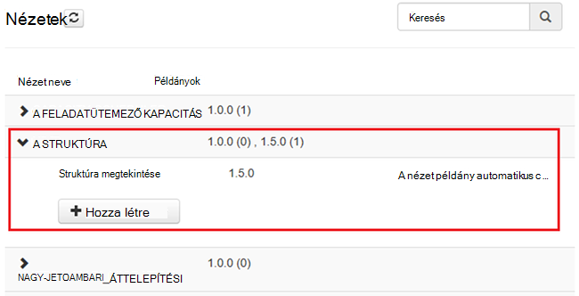
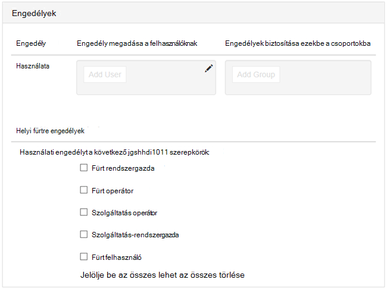

<properties
    pageTitle="Kezelheti a tartományhoz tartozó HDInsight fürt |} Microsoft Azure"
    description="Megtudhatja, hogy miként kezelheti a tartományhoz tartozó HDInsight fürt"
    services="hdinsight"
    documentationCenter=""
    authors="saurinsh"
    manager="jhubbard"
    editor="cgronlun"
    tags=""/>

<tags
    ms.service="hdinsight"
    ms.devlang="na"
    ms.topic="article"
    ms.tgt_pltfrm="na"
    ms.workload="big-data"
    ms.date="10/25/2016"
    ms.author="saurinsh"/>

# Kezelheti a tartományhoz tartozó HDInsight fürt (előzetes verzió)

További tudnivalók a felhasználók és a tartományhoz tartozó HDInsight és a tartományhoz tartozó HDInsight fürt kezelése a szerepköröket.

## A tartományhoz tartozó HDInsight fürt felhasználó

Két, a csoport létrehozása során létrehozott felhasználói fiókok, akkor nem a tartományhoz egy HDInsight fürt foglalja magában:

- **Ambari felügyeleti**: ehhez a fiókhoz is nevezik *Hadoop-felhasználó* vagy a *HTTP-felhasználó*. Ehhez a fiókhoz használható Ambari jelentkezzen be a https://&lt;clustername >. azurehdinsight.net. Is használható lekérdezések futtatása Ambari nézetek, hajtsa végre a külső eszközökkel (azaz PowerShell, Templeton, Visual Studio) keresztül feladatokat és a struktúra ODBC-illesztőprogram és Üzletiintelligencia-eszközeiről (tehát az Excel, PowerBI vagy Tableau) hitelesítést végezni.

- **SSH felhasználói**: ehhez a fiókhoz kínál SSH és sudo parancsok végrehajtása. A Linux VMs legfelső szintű jogosultságokkal rendelkezik.

A tartományhoz tartozó HDInsight fürtre három Ambari felügyeleti mellett új felhasználók és felhasználói SSH tartalmaz.

- **Pletyka felügyeleti**: Ez egy a helyi Apache Pletyka rendszergazdai fiók. Még nem az active directory tartományi felhasználó. Ehhez a fiókhoz használható házirendek beállítása, és más felhasználók és meghatalmazott rendszergazdák (úgy, hogy ezek a felhasználók hogyan kezelhetik házirendek). Alapértelmezés szerint a felhasználónév szó *felügyeleti* és a jelszó ugyanaz, mint a Ambari rendszergazdai jelszavát. A jelszó frissíthető a Pletyka beállítások lapján.

- **Fürt felügyeleti tartomány felhasználó**: ehhez a fiókhoz egy az active directory tartományi felhasználó kijelölt Ambari és Pletyka Hadoop fürt rendszergazdaként. Csoport létrehozása során, meg kell adnia a felhasználó hitelesítő adatait. A felhasználó jogosultságai a következő:

    - Vegye fel a tartományba gépek, és helyezze el őket a csoport létrehozása során megadott szervezeti belül.
    - Hozzon létre szolgáltatás rendszerbiztonsági a csoport létrehozása során megadott szervezeti belül. 
    - Fordított DNS-bejegyzések létrehozása.

    Megjegyzés: az Active Directory-felhasználók is ezek a jogosultságok. 

    Vannak bizonyos végpontjait belül a fürt (például Templeton), amely nem kezelhetők Pletyka, és így nem biztonságos. Ezek a végpontok lefelé zárolva van a felügyeleti tartomány fürt felhasználó kivételével minden felhasználó számára. 

- **Normál**: fürt létrehozása során adhat több az active directory-csoportot. A felhasználók csoportokhoz szinkronizált Pletyka és Ambari. Ezek a felhasználók tartomány felhasználókat, és csak Pletyka felügyelt végpontokat (például Hiveserver2) hozzáférést kap. A RBAC házirendek és ezek a felhasználók alkalmazható naplózási lesz.

## A tartományhoz tartozó HDInsight fürt szerepkörök

A tartományhoz HDInsight rendelkezik az alábbi szerepkörök:

- Fürt rendszergazda
- Fürt operátor
- Szolgáltatás-rendszergazda
- Szolgáltatás operátor
- Fürt felhasználó

**Ezeket a szerepköröket engedélyeinek megtekintéséhez**

1. Nyissa meg a felhasználói felület Ambari kezelését.  Lásd: [Nyissa meg a felhasználói felület Ambari kezelését](#open-the-ambari-management-ui).
2. A bal oldali menüben kattintson a **szerepkörök**elemre.
3. Kattintson a kék kérdőjel ikonra kattintva megtekintheti az engedélyek:

    

## Nyissa meg a felhasználói felület Ambari kezelése

1. Bejelentkezés az [Azure-portálon](https://portal.azure.com).
2. Nyissa meg a HDInsight fürt egy lap. Lásd: a [listában, és a Megjelenítés fürt](hdinsight-administer-use-management-portal.md#list-and-show-clusters).
3. Parancsot a felső Ambari nyissa meg az **Irányítópult** elemre.
4. Jelentkezzen be Ambari fürt rendszergazdai tartomány nevét és jelszóval.
5. Kattintson a **rendszergazda** legördülő menü a jobb felső sarokban, és kattintson a **Ambari kezelése**gombra.

    

    A felhasználói felület néz ki:

    

## A tartomány felhasználóit az Active Directoryból szinkronizálva lista

1. Nyissa meg a felhasználói felület Ambari kezelését.  Lásd: [Nyissa meg a felhasználói felület Ambari kezelését](#open-the-ambari-management-ui).
2. A bal oldali menüben kattintson a **felhasználók**elemre. A HDInsight fürthöz az Active Directoryból szinkronizált összes felhasználót kell látni.

    

## A tartomány csoportokat, az Active Directoryból szinkronizálva

1. Nyissa meg a felhasználói felület Ambari kezelését.  Lásd: [Nyissa meg a felhasználói felület Ambari kezelését](#open-the-ambari-management-ui).
2. A bal oldali menüben kattintson a **csoportok**elemre. A HDInsight fürthöz az Active Directoryból szinkronizált összes csoport kell megjelenítéséhez.

    

## Nézetek struktúra engedélyek konfigurálása

1. Nyissa meg a felhasználói felület Ambari kezelését.  Lásd: [Nyissa meg a felhasználói felület Ambari kezelését](#open-the-ambari-management-ui).
2. A bal oldali menüben kattintson a **nézetek**parancsra.
3. Kattintson a **struktúra** a részletek megjelenítéséhez.

    

4. Kattintson a **Struktúra** nézethivatkozás struktúra nézetek konfigurálása.
5. Görgessen le az **engedélyek** szakaszában.

    

6. Kattintson a **Felhasználó hozzáadása** vagy a **Csoport hozzáadása**gombra, és adja meg a azon felhasználók vagy csoportok struktúra nézetek használatával. 

## A felhasználók a szerepkörökhöz konfigurálása

 Szerepkörök és engedélyeiket talál további [szerepkörök a tartományhoz tartozó HDInsight fürt](#roles-of-domain---joined-hdinsight-clusters).

1. Nyissa meg a felhasználói felület Ambari kezelését.  Lásd: [Nyissa meg a felhasználói felület Ambari kezelését](#open-the-ambari-management-ui).
2. A bal oldali menüben kattintson a **szerepkörök**elemre.
3. Kattintson a felhasználók és csoportok különféle szerepköröket rendelhet a **Felhasználó hozzáadása** vagy a **Csoport hozzáadása** gombra.
 
## Következő lépések

- Konfigurálja a HDInsight tartományhoz fürt, [állítsa be a tartományhoz HDInsight fürt](hdinsight-domain-joined-configure.md)talál.
- Beállítja a struktúra házirendek és a struktúra-lekérdezések futtatása, lásd: a [tartományhoz tartozó HDInsight fürt házirendek beállítása struktúra](hdinsight-domain-joined-run-hive.md).
- Struktúra lekérdezések SSH a tartományhoz tartozó HDInsight fürt fut, című témakör tartalmaz [Használata SSH a Linux-alapú Hadoop a HDInsight Linux rendszerhez, a Unix, vagy az OS X](hdinsight-hadoop-linux-use-ssh-unix.md#connect-to-a-domain-joined-hdinsight-cluster).
