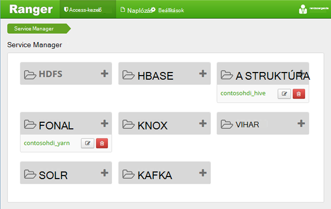
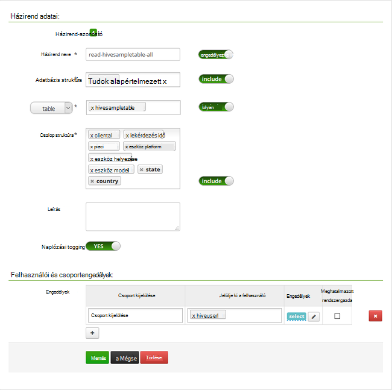

<properties
    pageTitle="A tartományhoz HDInsight struktúra házirendek beállítása |} Microsoft Azure"
    description="További tudnivalók..."
    services="hdinsight"
    documentationCenter=""
    authors="saurinsh"
    manager="jhubbard"
    editor="cgronlun"
    tags="azure-portal"/>

<tags
    ms.service="hdinsight"
    ms.devlang="na"
    ms.topic="hero-article"
    ms.tgt_pltfrm="na"
    ms.workload="big-data"
    ms.date="10/25/2016"
    ms.author="saurinsh"/>

# Struktúra házirendek beállítása a tartományhoz tartozó HDInsight (előzetes verzió)

Megtudhatja, hogy miként Apache Pletyka házirendek beállítása a struktúra. Ebben a cikkben hozzon létre két Pletyka házirendek való hozzáférés korlátozása a hivesampletable. A hivesampletable HDInsight fürt megtalálható. Miután beállította a házirendeket, Excel és az ODBC-illesztőprogram segítségével HDInsight-struktúra táblázataira csatlakozni.

## Előfeltételek

- A tartományhoz tartozó HDInsight fürtre. Lásd: [állítsa be a tartományhoz HDInsight fürt](hdinsight-domain-joined-configure.md).
- Az Office 2016, az Office 2013 Professional Plus, Office 365 Pro Plus, az Excel 2013 önálló verzió vagy Office 2010 Professional Plus munkaállomás.

## Csatlakozás Apache Pletyka rendszergazdai felhasználói felület

**Kapcsolódás a Pletyka rendszergazdai felhasználói felület**

1. Nyissa meg a böngészőjében Pletyka rendszergazdai felhasználói felület csatlakozni. URL-je https://&lt;ClusterName >.azurehdinsight.net/Ranger/. 

    >[AZURE.NOTE] Pletyka Hadoop fürt eltérő hitelesítő adatok használja. Gyorsítótárazott Hadoop hitelesítő adataival böngészők elkerülése érdekében csatlakozhat új inprivate-böngészési ablak Pletyka felügyeleti a felhasználói felület.
4. Jelentkezzen be a csoport rendszergazdája tartomány felhasználónevét és a jelszavát:

    

    Jelenleg Pletyka csak akkor működik, fonal és a struktúra.

## Tartomány felhasználók létrehozása

[Állítsa be a tartományhoz HDInsight fürt](hdinsight-domain-joined-configure.md#create-and-configure-azure-ad-ds-for-your-azure-ad)hiveruser1 és hiveuser2 hozott létre. A két felhasználói fiók használandó ebben az oktatóanyagban.

## Pletyka házirendek létrehozása

Ebben a részben létrehoznia a két Pletyka házirendek hivesampletable eléréséhez. Select engedély megadása a oszlopok más-más szabálykészletet. Mind a felhasználók [beállítása a tartományhoz HDInsight](hdinsight-domain-joined-configure.md#create-and-configure-azure-ad-ds-for-your-azure-ad)fürt lettek létrehozva.  A következő szakaszban tesztelni lesz a két házirendek az Excelben.

**Pletyka házirendek létrehozása**

1. Nyissa meg a Pletyka rendszergazdai felhasználói felület. Lásd: [Apache Pletyka rendszergazdai felhasználói felület csatlakozni](#connect-to-apache-ranager-admin-ui).
2. Kattintson a ** &lt;ClusterName > _hive**, a **struktúra**. A két előre a házirendek beállítása gondoskodik.
3. Kattintson az **Új házirend hozzáadása**parancsra, és írja be az alábbi értékeket:

    - Házirend neve: olvasható-hivesampletable-all
    - Adatbázis struktúra: alapértelmezett
    - táblázat: hivesampletable
    - Oszlop struktúra: *
    - Jelölje ki a felhasználó: hiveuser1
    - Engedélyek: kiválasztása

    .

    >[AZURE.NOTE] Tartomány felhasználó válassza a felhasználó nem tölti fel, ha Várjon néhány pillanatig Pletyka AAD szinkronizáláshoz.

4. Kattintson a **Hozzáadás** a házirend mentéséhez.
5. Ismételje meg az utolsó két hozzon létre egy másik házirendet a következő tulajdonságokat:

    - Házirend neve: olvasható-hivesampletable-devicemake
    - Adatbázis struktúra: alapértelmezett
    - táblázat: hivesampletable
    - Oszlop struktúra: clientid, devicemake
    - Jelölje ki a felhasználó: hiveuser2
    - Engedélyek: válassza a

## A struktúra ODBC-adatforrás létrehozása

A képernyőn megjelenő utasításokat a [létrehozása struktúra ODBC-adatforrás](hdinsight-connect-excel-hive-odbc-driver.md)találhatók.  

    A tulajdonság|Leírás
    ---|---
    Adatforrás neve szerint.|Adjon nevet az adatforrás
    A Host|Adja meg &lt;HDInsightClusterName >. azurehdinsight.net. Ha például myHDICluster.azurehdinsight.net
    Port|<strong>443-as</strong>használja. (Ez a port módosítását követően 563 a 443-as.)
    Adatbázis|Használja az <strong>alapértelmezett</strong>.
    Kiszolgálótípus struktúra|Jelölje be a <strong>kiszolgáló 2 struktúra</strong>
    Mechanizmusa|Jelölje ki az <strong>Azure HDInsight-szolgáltatás</strong>
    HTTP elérési út|Hagyja üresen.
    Felhasználónév|Adja meg hiveuser1@contoso158.onmicrosoft.com. Ha más, frissítse a tartomány nevét.
    Jelszó|Írja be jelszavát hiveuser1.
    </table>

Ellenőrizze, hogy **tesztelés** gombra az adatforrás mentése előtt.

##Adatok importálása az Excel hdinsight

A legutóbbi csoportban két házirendek állította be.  hiveuser1 a select engedéllyel rendelkezik az összes oszlopot, és hiveuser2 a select engedéllyel rendelkezik két oszlop szerint. Ebben a szakaszban a felhasználók adatokat importálhatja az Excelbe két megszemélyesítés.

1. Új vagy meglévő munkafüzet megnyitása az Excel programban.
2. Az **adatok** lapon kattintson **Az egyéb adatok adatforrásból**, és kattintson **Az Adatkapcsolat varázsló** az **Adatkapcsolat varázsló**indításához.

    ! [Nyissa meg az Adatkapcsolat varázsló] [img hdi, simbahiveodbc.excel.dataconnection]

3. Jelölje ki a **ODBC DSN** adatforrásként, és kattintson a **Tovább gombra**.
4. ODBC-adatforrásokból jelölje be az adatforrás neve az előző lépésben létrehozott, és kattintson a **Tovább gombra**.
5. Írja be újra a jelszót a fürt varázsló, és kattintson **az OK**gombra. Várja meg az **adatbázis és tábla kijelölése** párbeszédpanel megnyitásához. Ez a is néhány másodpercet igénybe vehet.
8. Jelölje ki a **hivesampletable**, és kattintson a **Tovább gombra**. 
8. Kattintson a **Befejezés gombra**.
9. Az **Adatimportálás** párbeszédpanelen módosítsa, vagy adja meg a lekérdezést. Ehhez kattintson a **Tulajdonságok**parancsra. Ez a is néhány másodpercet igénybe vehet. 
10. Kattintson a **definíció** fülre. A parancs szövege:

        SELECT * FROM "HIVE"."default"."hivesampletable"

    A megadott Pletyka házirendek hiveuser1 engedéllyel rendelkezik, válassza az összes oszlopot a.  Úgy működik, a lekérdezés hiveuser1-féle hitelesítő adataival, de ez a lekérdezés nem nem működik hiveuser2-féle hitelesítő adataival.

    ! [Kapcsolat tulajdonságai] [img-hdi-simbahiveodbc – az excel-connectionproperties]

11. Kattintson az **OK gombra** a kapcsolat tulajdonságai párbeszédpanel bezárásához.
12. Kattintson **az OK gombra** kattintva zárja be az **Adatimportálás** párbeszédpanelen.  
13. Adja meg újra a jelszót az hiveuser1, és kattintson **az OK**gombra. Adatok importálása az Excel kap előtt néhány másodpercet vesz igénybe. Ha elkészült, 11 oszlopnyi adatot kell látni.

A második szabály (olvasási-hivesampletable-devicemake) utolsó részében létrehozott tesztelése

1. Új lap hozzáadása az Excelben.
2. Az utolsó eljárással importálni az adatokat.  A csak módosításról fog hiveuser2 tartozó hitelesítő adatok használata helyett hiveuser1 meg. Ez sikertelen lesz, mert hiveuser2 csak két oszlop megtekintéséhez engedéllyel. Meg kell a következő hibaüzenet:

        [Microsoft][HiveODBC] (35) Error from Hive: error code: '40000' error message: 'Error while compiling statement: FAILED: HiveAccessControlException Permission denied: user [hiveuser2] does not have [SELECT] privilege on [default/hivesampletable/clientid,country ...]'.

3. Hajtsa végre ugyanezt az eljárást importálni az adatokat. Ebben az esetben hiveuser2 tartozó hitelesítő adatok használata, és a select utasítás a is módosíthatja:

        SELECT * FROM "HIVE"."default"."hivesampletable"

    a:

        SELECT clientid, devicemake FROM "HIVE"."default"."hivesampletable"

    Ha elkészült, az importált adatok két oszlop kell látni.

## Következő lépések

- Konfigurálja a HDInsight tartományhoz fürt, [állítsa be a tartományhoz HDInsight fürt](hdinsight-domain-joined-configure.md)talál.
- Kezelése a tartományhoz tartozó HDInsight fürt [kezelése a tartományhoz HDInsight fürt](hdinsight-domain-joined-manage.md)témakörben talál.
- Struktúra lekérdezések SSH a tartományhoz tartozó HDInsight fürt fut, című témakör tartalmaz [Használata SSH a Linux-alapú Hadoop a HDInsight Linux rendszerhez, a Unix, vagy az OS X](hdinsight-hadoop-linux-use-ssh-unix.md#connect-to-a-domain-joined-hdinsight-cluster).
- Csatlakozás struktúra struktúra JDBC használ olvassa el a [Csatlakozás az Azure hdinsight szolgáltatáshoz a struktúra JDBC illesztőprogram használata a struktúra](hdinsight-connect-hive-jdbc-driver.md)
- Az Excel Hadoop-struktúra ODBC használatával csatlakozik, lásd: az [Excel csatlakoztatása a Microsoft-struktúra ODBC-meghajtó hadoop](hdinsight-connect-excel-hive-odbc-driver.md)
- Az Excel Power Query használatával Hadoop csatlakozik, lásd: [Csatlakoztatása az Excel Power Query használatával hadoop](hdinsight-connect-excel-power-query.md)