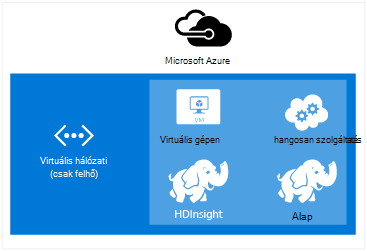

<properties
    pageTitle="Hdinsight szolgáltatásból lehetőségre hálózatán virtuális kiterjesztése |} Microsoft Azure"  
    description="Megtudhatja, hogy miként csatlakozhat Azure virtuális hálózati HDInsight más felhő erőforrások vagy az erőforrások a adatközpontban"
    services="hdinsight"
    documentationCenter=""
    authors="Blackmist"
    manager="jhubbard"
    editor="cgronlun"/>

<tags
   ms.service="hdinsight"
   ms.devlang="na"
   ms.topic="article"
   ms.tgt_pltfrm="na"
   ms.workload="big-data"
   ms.date="10/21/2016"
   ms.author="larryfr"/>


#<a name="extend-hdinsight-capabilities-by-using-azure-virtual-network"></a>Kijelölés méretének növelése a HDInsight funkciók Azure virtuális hálózaton keresztül

Azure virtuális hálózati lehetővé teszi a Hadoop-megoldások a helyszíni erőforrások, például SQL Server beépítése, HDInsight fürt többféle kombinálása, illetve létrehozása a felhőben erőforrások közötti biztonságos magánhálózat bővítése.

[AZURE.INCLUDE [upgrade-powershell](../../includes/hdinsight-use-latest-powershell-and-cli.md)]


##<a id="whatis"></a>Mi az Azure virtuális hálózatot?

[Azure virtuális hálózati](https://azure.microsoft.com/documentation/services/virtual-network/) lehetővé teszi, hogy a megoldás az erőforrásokhoz tartalmazó biztonságos, állandó hálózat létrehozása. Virtuális hálózat lehetővé teszi:

* Csatlakozás felhő erőforrásainak közös magánhálózat (csak felhőalapú).

    

    Hivatkozás: Azure HDInsight-szolgáltatások Azure virtuális hálózati használatával lehetővé teszi, hogy az alábbi esetekben:

    * **Meghívása HDInsight-szolgáltatásokat vagy a feladatok** az Azure webhelyek vagy a szolgáltatások Azure virtuális gépeken futó operációs rendszert futtató.

    * **Közvetlenül az adatok átvitele** HDInsight és Azure SQL-adatbázissal, SQL Server vagy egy másik adatokat tároló megoldást virtuális gépen futó között.

    * **Több HDInsight-kiszolgálók kombinálásával** egységes megoldássá. HDInsight fürt fájltípusok, amelyek megfelelnek a terhelést vagy technológiát alkalmaz, amely a fürt van beállítva a különböző származnak. Nincs semmilyen módszerrel nem támogatott többféle, például vihar és egy fürt HBase kombináló fürt létrehozásához. Virtuális hálózat használatával lehetővé teszi, hogy közvetlenül a többi kommunikáció több fürtre.

* Virtuális magánhálózat (VPN) csatlakozzon a felhő erőforrásokat a helyi adatközponthoz hálózathoz (webhely vagy webhely-pont).

    Webhely konfigurációs csatlakoztassa több erőforrások az adatközpont és az Azure virtuális hálózati VPN hardver vagy a Útválasztás és távoli szolgáltatás használatával teszi lehetővé.

    

    Pont-webhely konfigurálása lehetővé teszi, hogy egy adott erőforrás csatlakozzon az Azure virtuális hálózati VPN szoftver használatával.

    

    A felhőben, és a adatközponthoz csatolni virtuális hálózaton keresztül lehetővé teszi, hogy a hasonló helyzetben a felhőben konfiguráción. De ahelyett, hogy kizárólag a felhőben erőforrások használata, is dolgozhat erőforrások az az Adatközpont.

    * **Közvetlenül az adatok átvitele** HDInsight és a adatközponthoz között. Példa az SQL Server vagy a vállalati verzió (üzleti) alkalmazás által generált adatok beolvasása az adatok átvitele Sqoop használ.

    * **Meghívása HDInsight-szolgáltatásokat vagy a feladatok** az üzleti alkalmazásokból. Példa tárolására és adatok beolvasása egy HDInsight HBase fürthöz HBase Java API-khoz használ.

További tájékoztatást a virtuális hálózati szolgáltatások, juttatások és lehetőségeket a az [Azure virtuális hálózati – áttekintés](../virtual-network/virtual-networks-overview.md)című témakörben találhat.

> [AZURE.NOTE] Az Azure virtuális hálózati létre kell hoznia egy HDInsight fürthöz kiépítése előtt. További tudnivalókért lásd: a [virtuális hálózati konfigurációs feladatokat](https://azure.microsoft.com/documentation/services/virtual-network/).

## <a name="virtual-network-requirements"></a>Virtuális hálózati vonatkozó követelmények

> [AZURE.IMPORTANT] Egy HDInsight fürthöz egy virtuális hálózaton létrehozásához ebben a szakaszban ismertetett adott virtuális hálózati beállítások.

###<a name="location-based-virtual-networks"></a>Helyfüggő virtuális hálózatok

Azure hdinsight szolgáltatáshoz csak helyfüggő virtuális hálózatok támogatja, és jelenleg nem működik a virtuális hálózatok affinitás csoport alapján.

###<a name="classic-or-v2-virtual-network"></a>Klasszikus vagy v2 virtuális hálózati

Windows-alapú fürt klasszikus virtuális hálózatot, szükség, míg Linux-alapú fürt szükségesek az Azure virtuális erőforrás-kezelő-hálózaton. Ha nem rendelkezik a megfelelő típusú hálózati, nem lesz használható a fürt létrehozásakor.

Erőforrások, amely nem használható a tervezi létrehozása fürt virtuális hálózaton van, hozzon létre egy új virtuális hálózatot, amely a fürt használható, és csatlakoztassa a kompatibilis virtuális hálózat. A hálózati verzió igényel, majd a fürt hozhat létre, és azt fogja tudni a másik hálózatban lévő access-források, mivel a két adatbázis. Hagyományos és új virtuális hálózatok csatlakozással kapcsolatban további tudnivalókért olvassa el a [Csatlakozás klasszikus VNets az új VNets](../vpn-gateway/vpn-gateway-connect-different-deployment-models-portal.md)című témakört.

###<a name="custom-dns"></a>Egyéni DNS

Virtuális hálózat létrehozásakor Azure biztosít alapértelmezett névfeloldás szolgáltatásokért Azure HDInsight például, hogy telepítve vannak a hálózaton. Azonban előfordulhat esetek, amikor például hálózati tartomány névfeloldás tartományok a saját tartomány (DNS) használata. Például ha szolgáltatások közötti kommunikáció található két csatlakozott virtuális hálózatok. HDInsight támogat, mind az alapértelmezett Azure névfeloldás, valamint egyéni DNS Azure virtuális hálózati együtt használva.

További információt a saját DNS-kiszolgálót használ az Azure virtuális hálózati című __névfeloldás saját DNS-kiszolgálót használ__ a [Névfeloldás VMs és szerepkör-példányok](../virtual-network/virtual-networks-name-resolution-for-vms-and-role-instances.md#name-resolution-using-your-own-dns-server) dokumentum.

###<a name="secured-virtual-networks"></a>Védett virtuális hálózatok

A HDInsight szolgáltatás egy felügyelt szolgáltatás, és internetkapcsolatra során kiépítési és futtatása közben. Ez a helyzet, hogy az Azure figyelheti a fürt állapotának feladatátvevő fürt erőforrások kezdeményez, a fürt méretezési műveletek révén és más teendőkről található csomópontok számának módosítása.

Ha kell telepíteni HDInsight védett virtuális hálózatba, engedélyeznie kell befelé az alábbi IP-címek, amelyek lehetővé teszik a HDInsight fürt kezeléséhez Azure 443-as port fölé.

* 168.61.49.99
* 23.99.5.239
* 168.61.48.131
* 138.91.141.162

Az alábbi címek a 443-as port bejövő hozzáférést teszi lehetővé telepíthető védett virtuális hálózatba hdinsight szolgáltatásból lehetőségre.

> [AZURE.IMPORTANT] HDInsight nem támogatja a kimenő forgalmának, csak a bejövő forgalom korlátozása. A HDInsight tartalmazó alhálózat hálózati biztonsági csoport szabályok meghatározásakor csak a bejövő szabályok használja.

Az alábbi példák bemutatják, hogyan hozhat létre egy új hálózati biztonsági csoportot, amely lehetővé teszi, hogy a szükséges címeket, és alkalmazza a biztonsági csoport alhálózat a virtuális hálózaton belül. Ezek a lépések feltételezik, hogy már létrehozott egy virtuális hálózati és alhálózat HDInsight történő telepítéséhez, amelyet.

__Azure PowerShell használatával__

    $vnetName = "Replace with your virtual network name"
    $resourceGroupName = "Replace with the resource group the virtual network is in"
    $subnetName = "Replace with the name of the subnet that HDInsight will be installed into"
    # Get the Virtual Network object
    $vnet = Get-AzureRmVirtualNetwork `
        -Name $vnetName `
        -ResourceGroupName $resourceGroupName
    # Get the region the Virtual network is in.
    $location = $vnet.Location
    # Get the subnet object
    $subnet = $vnet.Subnets | Where-Object Name -eq $subnetName
    # Create a new Network Security Group.
    # And add exemptions for the HDInsight health and management services.
    $nsg = New-AzureRmNetworkSecurityGroup `
        -Name "hdisecure" `
        -ResourceGroupName $resourceGroupName `
        -Location $location `
        | Add-AzureRmNetworkSecurityRuleConfig `
            -name "hdirule1" `
            -Description "HDI health and management address 168.61.49.99" `
            -Protocol "*" `
            -SourcePortRange "*" `
            -DestinationPortRange "443" `
            -SourceAddressPrefix "168.61.49.99" `
            -DestinationAddressPrefix "VirtualNetwork" `
            -Access Allow `
            -Priority 300 `
            -Direction Inbound `
        | Add-AzureRmNetworkSecurityRuleConfig `
            -Name "hdirule2" `
            -Description "HDI health and management 23.99.5.239" `
            -Protocol "*" `
            -SourcePortRange "*" `
            -DestinationPortRange "443" `
            -SourceAddressPrefix "23.99.5.239" `
            -DestinationAddressPrefix "VirtualNetwork" `
            -Access Allow `
            -Priority 301 `
            -Direction Inbound `
        | Add-AzureRmNetworkSecurityRuleConfig `
            -Name "hdirule3" `
            -Description "HDI health and management 168.61.48.131" `
            -Protocol "*" `
            -SourcePortRange "*" `
            -DestinationPortRange "443" `
            -SourceAddressPrefix "168.61.48.131" `
            -DestinationAddressPrefix "VirtualNetwork" `
            -Access Allow `
            -Priority 302 `
            -Direction Inbound `
        | Add-AzureRmNetworkSecurityRuleConfig `
            -Name "hdirule4" `
            -Description "HDI health and management 138.91.141.162" `
            -Protocol "*" `
            -SourcePortRange "*" `
            -DestinationPortRange "443" `
            -SourceAddressPrefix "138.91.141.162" `
            -DestinationAddressPrefix "VirtualNetwork" `
            -Access Allow `
            -Priority 303 `
            -Direction Inbound
    # Set the changes to the security group
    Set-AzureRmNetworkSecurityGroup -NetworkSecurityGroup $nsg
    # Apply the NSG to the subnet
    Set-AzureRmVirtualNetworkSubnetConfig `
        -VirtualNetwork $vnet `
        -Name $subnetName `
        -AddressPrefix $subnet.AddressPrefix `
        -NetworkSecurityGroupId $nsg

__Az Azure CLI használatával__

1. A következő parancs segítségével nevű új hálózati biztonsági csoport létrehozása `hdisecure`. Cserélje ki az erőforráscsoport, amely tartalmazza az Azure virtuális hálózati és a helyet (terület), a csoport létrehozott __RESOURCEGROUPNAME__ és __HELYÉT__ .

        azure network nsg create RESOURCEGROUPNAME hdisecure LOCATION
    
    A csoport létrehozása után az új csoport tájékoztatást kap. Keresse meg a vonal, az alábbihoz hasonló, és mentse a `/subscriptions/GUID/resourceGroups/RESOURCEGROUPNAME/providers/Microsoft.Network/networkSecurityGroups/hdisecure` információkat. A leendő lesz.
    
        data:    Id                              : /subscriptions/GUID/resourceGroups/RESOURCEGROUPNAME/providers/Microsoft.Network/networkSecurityGroups/hdisecure

2. A következő segítségével szabályokat adni az új hálózati biztonsági csoport, amelyek lehetővé teszik a 443-as port az Azure hdinsight szolgáltatáshoz állapot és a kezelés szolgáltatásból adatforgalmat. Cserélje ki a csoport nevét, az erőforrás, amely tartalmazza az Azure virtuális hálózati __RESOURCEGROUPNAME__ .

        azure network nsg rule create RESOURCEGROUPNAME hdisecure hdirule1 -p "*" -o "*" -u "443" -f "168.61.49.99" -e "VirtualNetwork" -c "Allow" -y 300 -r "Inbound"
        azure network nsg rule create RESOURCEGROUPNAME hdisecure hdirule2 -p "*" -o "*" -u "443" -f "23.99.5.239" -e "VirtualNetwork" -c "Allow" -y 301 -r "Inbound"
        azure network nsg rule create RESOURCEGROUPNAME hdisecure hdirule3 -p "*" -o "*" -u "443" -f "168.61.48.131" -e "VirtualNetwork" -c "Allow" -y 302 -r "Inbound"
        azure network nsg rule create RESOURCEGROUPNAME hdisecure hdirule4 -p "*" -o "*" -u "443" -f "138.91.141.162" -e "VirtualNetwork" -c "Allow" -y 303 -r "Inbound"

3. A szabályok létrehozása után az új hálózati biztonsági csoport alkalmazása egy alhálózathoz a következő használatával. Cserélje ki a csoport nevét, az erőforrás, amely tartalmazza az Azure virtuális hálózati __RESOURCEGROUPNAME__ . Cserélje ki a nevét az Azure virtuális hálózati és a használni kívánt HDInsight telepítésekor alhálózat __VNETNAME__ és __SUBNETNAME__ .

        azure network vnet subnet set RESOURCEGROUPNAME VNETNAME SUBNETNAME -w "/subscriptions/GUID/resourceGroups/RESOURCEGROUPNAME/providers/Microsoft.Network/networkSecurityGroups/hdisecure"
    
    Ha ez a parancs befejeződött, a alhálózat használja ezeket a lépéseket a védett virtuális hálózatba sikeresen telepítheti a hdinsight szolgáltatásból lehetőségre.

> [AZURE.IMPORTANT] Használja a fenti lépéseket csak nyissa meg az szolgáltatáshoz való hozzáférés HDInsight állapot és kezelése a Azure felhő. Így való telepítéséről sikeresen egy HDInsight fürthöz az alhálózat azonban alapértelmezés szerint a hozzáférést a virtuális hálózatán kívülről a HDInsight-fürthöz zárolva van. Be kell szabályokhoz hálózati biztonsági csoport hozzáadása, ha másnak szeretné engedélyezni a hozzáférést a virtuális hálózatán kívülről.
>
> Ha például SSH hozzáférés engedélyezése az internetről, szüksége lesz az alábbihoz hasonló szabály hozzáadásához: 
>
> * Azure PowerShell-```Add-AzureRmNetworkSecurityRuleConfig -Name "SSSH" -Description "SSH" -Protocol "*" -SourcePortRange "*" -DestinationPortRange "22" -SourceAddressPrefix "*" -DestinationAddressPrefix "VirtualNetwork" -Access Allow -Priority 304 -Direction Inbound```
> * Azure CLI-```azure network nsg rule create RESOURCEGROUPNAME hdisecure hdirule4 -p "*" -o "*" -u "22" -f "*" -e "VirtualNetwork" -c "Allow" -y 304 -r "Inbound"```

További információt a hálózat biztonsági csoportokat olvassa el a [hálózati biztonsági csoportok – áttekintés](../virtual-network/virtual-networks-nsg.md)című témakört. Az Azure virtuális hálózat Útválasztás szabályozása a további tudnivalókért lásd [felhasználó által definiált útvonalak és IP-továbbítás](../virtual-network/virtual-networks-udr-overview.md).

##<a id="tasks"></a>Tevékenységet és információt

Ez a témakör a gyakori feladatok információkat és adatokat az HDInsight használata egy virtuális hálózati esetén szüksége lehet.

###<a name="determine-the-fqdn"></a>A teljesen minősített tartománynév meghatározása

A HDInsight fürt egy adott teljes tartománynevét (FQDN) a virtuális hálózati kapcsolat fog kiosztani. Ez az a cím, akkor használja, ha a fürt kapcsolódás virtuális hálózat más forrásokból. Használható annak meghatározásához, a teljesen minősített tartománynév lekérdezése a Ambari alkalmazáskezelési szolgáltatás URL-címe a következőképpen:

    https://<clustername>.azurehdinsight.net/ambari/api/v1/clusters/<clustername>.azurehdinsight.net/services/<servicename>/components/<componentname>

> [AZURE.NOTE] HDInsight való Ambari használatáról további tudnivalókért lásd: [a Ambari API HDInsight a Monitor Hadoop fürt](hdinsight-monitor-use-ambari-api.md).

Meg kell adnia a csoport nevét és a szolgáltatás és a a fürthöz, például az erőforrás-kezelő fonal összetevő.

> [AZURE.NOTE] A visszaadott adatok JavaScript objektum jelölés (JSON) dokumentum, amely tartalmazza az összetevő információt sok. Csak a teljesen minősített tartománynév kibontásához célszerű használni a JSON-elemzővel beolvasni a `host_components[0].HostRoles.host_name` értéket.

Például a teljesen minősített tartománynév vissza egy HDInsight Hadoop fürthöz, használhatja a következő lehetőségek közül választhat az adatok beolvasásához a fonal erőforrás-kezelő:

* [Azure PowerShell](../powershell-install-configure.md)

        $ClusterDnsName = <clustername>
        $Username = <cluster admin username>
        $Password = <cluster admin password>
        $DnsSuffix = ".azurehdinsight.net"
        $ClusterFQDN = $ClusterDnsName + $DnsSuffix

        $webclient = new-object System.Net.WebClient
        $webclient.Credentials = new-object System.Net.NetworkCredential($Username, $Password)

        $Url = "https://" + $ClusterFQDN + "/ambari/api/v1/clusters/" + $ClusterFQDN + "/services/yarn/     components/resourcemanager"
        $Response = $webclient.DownloadString($Url)
        $JsonObject = $Response | ConvertFrom-Json
        $FQDN = $JsonObject.host_components[0].HostRoles.host_name
        Write-host $FQDN

* [cURL](http://curl.haxx.se/) és [jq](http://stedolan.github.io/jq/)

        curl -G -u <username>:<password> https://<clustername>.azurehdinsight.net/ambari/api/v1/clusters/<clustername>.azurehdinsight.net/services/yarn/components/resourcemanager | jq .host_components[0].HostRoles.host_name

###<a name="connecting-to-hbase"></a>Csatlakozás HBase

Kapcsolódni HBase távolról a Java API, a ZooKeeper kvórum címek a HBase fürt határozza meg, és adja meg, ez az alkalmazás.

Úgy juthat az ZooKeeper kvórum címet, használatával az alábbi módszerek egyikét lekérdezheti a Ambari alkalmazáskezelési szolgáltatás:

* [Azure PowerShell](../powershell-install-configure.md)

        $ClusterDnsName = <clustername>
        $Username = <cluster admin username>
        $Password = <cluster admin password>
        $DnsSuffix = ".azurehdinsight.net"
        $ClusterFQDN = $ClusterDnsName + $DnsSuffix

        $webclient = new-object System.Net.WebClient
        $webclient.Credentials = new-object System.Net.NetworkCredential($Username, $Password)

        $Url = "https://" + $ClusterFQDN + "/ambari/api/v1/clusters/" + $ClusterFQDN + "/configurations?type=hbase-site&tag=default&fields=items/properties/hbase.zookeeper.quorum"
        $Response = $webclient.DownloadString($Url)
        $JsonObject = $Response | ConvertFrom-Json
        Write-host $JsonObject.items[0].properties.'hbase.zookeeper.quorum'

* [cURL](http://curl.haxx.se/) és [jq](http://stedolan.github.io/jq/)

        curl -G -u <username>:<password> "https://<clustername>.azurehdinsight.net/ambari/api/v1/clusters/<clustername>.azurehdinsight.net/configurations?type=hbase-site&tag=default&fields=items/properties/hbase.zookeeper.quorum" | jq .items[0].properties[]

> [AZURE.NOTE] HDInsight való Ambari használatáról további tudnivalókért lásd: [a Ambari API HDInsight a Monitor Hadoop fürt](hdinsight-monitor-use-ambari-api.md).

Ha befejezte a kvórum információkat, használja a ügyfélalkalmazás.

Például a HBase API-t használó Java-alkalmazást, az azt, akinek **hbase-site.xml** fájl hozzáadása a project és a fájlt a kvórum-információk megadása az alábbi képlettel történik:

```
<configuration>
  <property>
    <name>hbase.cluster.distributed</name>
    <value>true</value>
  </property>
  <property>
    <name>hbase.zookeeper.quorum</name>
    <value>zookeeper0.address,zookeeper1.address,zookeeper2.address</value>
  </property>
  <property>
    <name>hbase.zookeeper.property.clientPort</name>
    <value>2181</value>
  </property>
</configuration>
```

###<a name="verify-network-connectivity"></a>Ellenőrizze a hálózati kapcsolat

Bizonyos szolgáltatások, például SQL Server, a bejövő hálózati kapcsolatok korlátozhatja. Ez megakadályozza, hogy HDInsight sikeresen használata az alábbi szolgáltatások.

Ha problémát hdinsight elérése a szolgáltatás, dokumentációjában annak érdekében, hogy a hálózati hozzáférés engedélyezve van a szolgáltatás. Hálózati hozzáférés ellenőrzése: hozzon létre egy Azure virtuális gép ugyanazon a virtuális hálózaton, és ellenőrizze, hogy a virtuális gép csatlakozhat a szolgáltatást a virtuális hálózaton keresztül ügyfél segédprogramok használatával is.

##<a id="nextsteps"></a>Következő lépések

Az alábbi példák bemutatják, hogyan használhatja a HDInsight az Azure virtuális hálózati:

* [Elemzés szenzoradatokat vihar és HBase a HDInsight](hdinsight-storm-sensor-data-analysis.md) - bemutatja, hogyan vihar és HBase fürt konfigurálása a virtuális hálózatot, valamint hogyan távolról HBase adatok vihar írják.

* [A HDInsight rendelkezés Hadoop fürt](hdinsight-hadoop-provision-linux-clusters.md) - tájékoztatást nyújt a kiépítési Hadoop fürt, például az Azure virtuális hálózati használatáról.

* [A Hadoop a HDInsight használata Sqoop](hdinsight-use-sqoop-mac-linux.md) - Sqoop használatáról virtuális hálózaton keresztül SQL Server-adatok átvitele adatait találja.

Azure virtuális hálózatok kapcsolatos további információért olvassa el a az [Azure virtuális hálózati – áttekintés](../virtual-network/virtual-networks-overview.md)című témakört.
