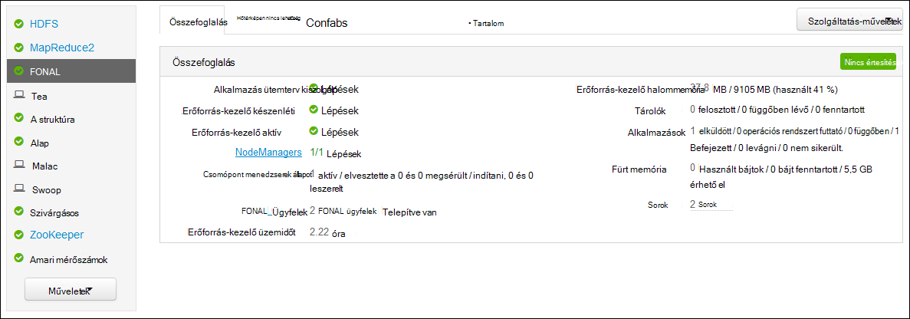
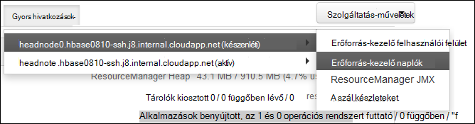

<properties
    pageTitle="Access Hadoop fonal alkalmazás bejelentkezik Linux-alapú HDInsight |} Microsoft Azure"
    description="Megtudhatja, hogy miként fonal alkalmazás naplók a parancssori és a webböngészőben Linux-alapú HDInsight (Hadoop) fürtre eléréséhez."
    services="hdinsight"
    documentationCenter=""
    tags="azure-portal"
    authors="Blackmist" 
    manager="jhubbard"
    editor="cgronlun"/>

<tags
    ms.service="hdinsight"
    ms.workload="big-data"
    ms.tgt_pltfrm="na"
    ms.devlang="na"
    ms.topic="article"
    ms.date="10/21/2016"
    ms.author="larryfr"/>

# Access fonal alkalmazás bejelentkezik Linux-alapú hdinsight szolgáltatáshoz 

A dokumentum eléréséhez a naplókat, amely a Azure hdinsight szolgáltatáshoz a Hadoop fürthöz befejezése után fonal (még egy másik erőforrás-egyeztető) alkalmazások ismerteti.

> [AZURE.NOTE] A dokumentum adatai Linux-alapú HDInsight fürt alkalmazásra. A Windows-alapú fürt további tudnivalókért lásd [fonal Access-alkalmazás bejelentkezik a Windows-alapú hdinsight szolgáltatáshoz](hdinsight-hadoop-access-yarn-app-logs.md)

## Előfeltételek

* A HDInsight Linux-alapú fürtre.

* [Hozzon létre egy SSH alagutas](hdinsight-linux-ambari-ssh-tunnel.md) előtt kell az erőforrás-kezelő naplók webes felület érheti el.

## FONAL ütemterv kiszolgáló

A [Fonal ütemterv kiszolgáló](http://hadoop.apache.org/docs/r2.4.0/hadoop-yarn/hadoop-yarn-site/TimelineServer.html) általános információt nyújt kitöltött kérelmeket, valamint a keretrendszer-specifikus alkalmazás adatokat, két különböző felületeken keresztül. Kifejezetten:

* Tárterület és a HDInsight fürt általános alkalmazás információt a lekérés lett engedélyezett 3.1.1.374 verzióval vagy újabb verziójában.
* Az ütemterv kiszolgáló keretrendszer-specifikus alkalmazás adatra jelenleg nem áll rendelkezésre a HDInsight fürt.

Alkalmazások általános információkat tartalmazza a következő adatok rendezése:

* Az azonosítója, az alkalmazások egyedi azonosítója
* A felhasználó, aki elindította az alkalmazás
* Az alkalmazás befejezéséhez kísérletek információk
* Az adott alkalmazás kísérel meg által használt tárolók

## FONAL alkalmazások és a naplók

FONAL több programozási modellek (MapReduce alatt az egyiket) támogatja az erőforrás-kezelés az alkalmazások figyelése/ütemezési szétválasztás. Ez történik át egy általános *erőforrás-kezelő* (erőforrás-kezelő), a használati dolgozó-csomópont- *NodeManagers* (NMs), és a alkalmazásonként *ApplicationMasters* (AMs). Az alkalmazás AM egyezteti erőforrások (Processzor, memóriát, szabad, hálózati) az alkalmazás futtatásához a RM. együtt Az erőforrás-kezelő működik-e adni, ezek az erőforrások, mint *tárolók*megadó NMs. A AM a felelős a a tárolók kiosztotta a RM. végrehajtásának nyomon követése Az alkalmazások számos tárolók attól függően, hogy az alkalmazás jellegét lehet szükség.

Ezenkívül minden alkalmazás állhat, több *alkalmazás megpróbál* jelenlétében összeomlik, vagy egy óra közötti kommunikáció elvesztése miatt befejezéséhez és egy RM. Tárolók emiatt a adott próbálkozásra egy alkalmazás kell megadni. Értelemben tároló biztosít az alapegység fonal alkalmazás által elvégzett munka környezetben, és a tároló környezetén belül végzett munkáját történik a egyetlen dolgozó csomópontot, amelyen a tároló van kiosztva. Lásd: [Fonal fogalmak] [ YARN-concepts] további hivatkozások.

Alkalmazás naplók (és a kapcsolódó tároló naplók) kritikus, a hibakereséshez hibás Hadoop-alkalmazásokat. FONAL gyűjteni, összesítése és tárolja a [Napló összesítést] az alkalmazás naplók szép keretet biztosít[ log-aggregation] szolgáltatás. A napló összesítési szolgáltatásokkal teszi elérésekor alkalmazás naplók további mérvadó, naplók összesítésének át az összes tárolók dolgozó csomóponton és egy összesített naplófájlt / dolgozó csomópontot a alapértelmezett fájlrendszerben tárolja őket az alkalmazás befejezése után. Az alkalmazás előfordulhat, hogy a száz vagy tárolók ezer használni, de fog egy fájlba, így egy naplófájlban / dolgozó csomópontot, az alkalmazás által használt mindig összesíti egyetlen dolgozó csomóponton futtassa az összes tárolók naplók. HDInsight fürt alapértelmezés szerint engedélyezve van a napló összesítési (3.0-s verziója és a fenti), és összesített naplók az alapértelmezett tárolóban a fürt a következő helyen található:

    wasbs:///app-logs/<user>/logs/<applicationId>

Ebben a helyet, *felhasználói* a felhasználó, aki elindította az alkalmazás nevére, akinek *applicationId* egyedi azonosítója kiosztotta a fonal RM. kérelmet.

Az összesített naplók nincsenek közvetlenül olvasható, mivel az egy [TFile]írták őket[T-file], [binárissá] [ binary-format] tároló által indexelt. Az erőforrás-kezelő fonal naplók vagy CLI eszközök ezek a naplók megtekintéséhez az alkalmazások vagy az érdeklődésre számot tartó tárolók egyszerű szövegként kell használnia. 

##FONAL CLI eszközök

Annak érdekében, hogy a fonal CLI eszközök használatához először csatolnia kell a HDInsight fürthöz SSH használatával. Felhasználhatja a következő dokumentumok egyikét a HDInsight SSH használja:

- [A HDInsight Linux, Unix vagy OS X Linux-alapú Hadoop SSH használata](hdinsight-hadoop-linux-use-ssh-unix.md)

- [A Windows HDInsight Linux-alapú Hadoop SSH használata](hdinsight-hadoop-linux-use-ssh-windows.md)
    
Ezek a naplók egyszerű szövegként tekintheti meg a következő parancs futtatásával:

    yarn logs -applicationId <applicationId> -appOwner <user-who-started-the-application>
    yarn logs -applicationId <applicationId> -appOwner <user-who-started-the-application> -containerId <containerId> -nodeAddress <worker-node-address>
    
Meg kell adnia a &lt;applicationId >, &lt;felhasználói – aki – lépések-a-alkalmazás >, &lt;Tároló_azonosítója >, és & ltworker-csomópont cím > információ, ezek a parancsok futtatásakor.

##FONAL erőforrás-kezelő felhasználói felület

FONAL erőforrás-kezelő a felhasználói felület a fürt headnode fut, és a Ambari webes felhasználói felület; keresztül érhető el azonban első kell [Hozzon létre egy SSH alagutas](hdinsight-linux-ambari-ssh-tunnel.md) az erőforrás-kezelő felhasználói felület eléréséhez.

Miután létrehozott egy SSH alagutas, kövesse az alábbi lépéseket a fonal naplók megtekintéséhez:

1. A böngészőben nyissa meg azt a https://CLUSTERNAME.azurehdinsight.net. CLUSTERNAME cserélje le a HDInsight fürt nevét.

2. A szolgáltatások, a bal oldali listában jelölje ki a __fonal__.

    

3. A __Tartalom__ legördülő listából válasszon egy központi fürt csomópontok, és válassza a __Erőforrás-kezelő naplót__.

    
    
    Választhat a fonal naplók mutató hivatkozások listája.

[YARN-timeline-server]:http://hadoop.apache.org/docs/r2.4.0/hadoop-yarn/hadoop-yarn-site/TimelineServer.html
[log-aggregation]:http://hortonworks.com/blog/simplifying-user-logs-management-and-access-in-yarn/
[T-file]:https://issues.apache.org/jira/secure/attachment/12396286/TFile%20Specification%2020081217.pdf
[binary-format]:https://issues.apache.org/jira/browse/HADOOP-3315
[YARN-concepts]:http://hortonworks.com/blog/apache-hadoop-yarn-concepts-and-applications/
