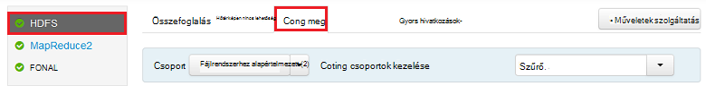
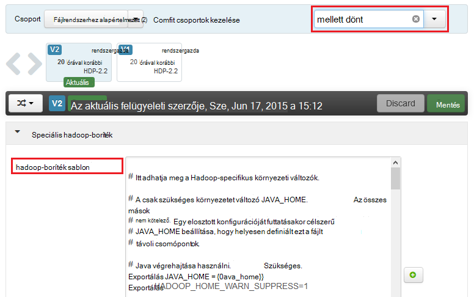
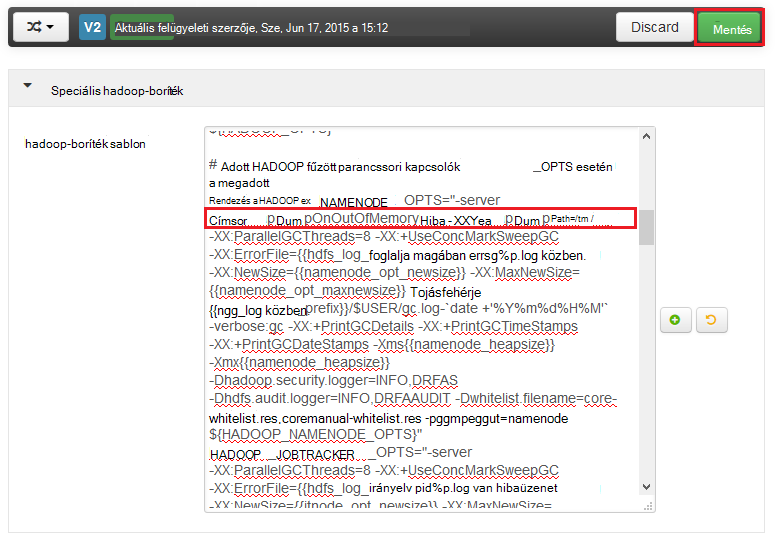
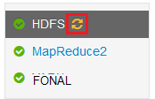
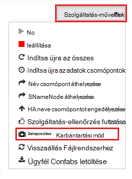
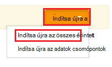

<properties
    pageTitle="Halommemória kiírása a HDInsight Hadoop-szolgáltatások engedélyezése |} Microsoft Azure"
    description="Engedélyezze a halommemória kiírása a Hadoop szolgáltatásai Linux-alapú HDInsight fürt hibakeresési és elemzéshez."
    services="hdinsight"
    documentationCenter=""
    authors="Blackmist"
    manager="jhubbard"
    editor="cgronlun"
    tags="azure-portal"/>

<tags
    ms.service="hdinsight"
    ms.workload="big-data"
    ms.tgt_pltfrm="na"
    ms.devlang="na"
    ms.topic="article"
    ms.date="09/27/2016"
    ms.author="larryfr"/>

#Halommemória kiírása Linux-alapú HDInsight (előzetes verzió) a Hadoop-szolgáltatások engedélyezése

[AZURE.INCLUDE [heapdump-selector](../../includes/hdinsight-selector-heap-dump.md)]

Halommemória kiírása tartalmazza az alkalmazás memóriát, így a változót értékeket a kiírása létrehozásakor pillanatképét. Így nagyon hasznos, ha diagnosztizálása futásidőben előforduló problémák.

> [AZURE.NOTE] A cikkben szereplő információk csak Linux-alapú HDInsight vonatkozik. A Windows-alapú HDInsight további tudnivalókért lásd [halommemória kiírása a Windows-alapú HDInsight Hadoop-szolgáltatások engedélyezése](hdinsight-hadoop-collect-debug-heap-dumps.md)

## Szolgáltatások

Az alábbi szolgáltatások halommemória kiírása engedélyezheti:

*  **hcatalog** - tempelton
*  **struktúra** - hiveserver2, metastore, derbyserver
*  **mapreduce** - jobhistoryserver
*  **fonal** - erőforrás-kezelő, nodemanager, timelineserver
*  **fájlrendszerhez** - datanode, secondarynamenode, namenode

Is halommemória kiírása a térkép engedélyezése és csökkentése folyamatok futtatta által hdinsight szolgáltatásból lehetőségre.

## Ismertetése halommemória kiírás konfigurálása

Beállítások megkerülhetők engedélyezett halommemória kiírása (mellett dönt, időnként néven vagy paramétereket) a JVM, ha a szolgáltatás nem működik a. A legtöbb Hadoop-szolgáltatásokhoz Ez lehet megvalósítani módosítása a parancsprogram elindítani a szolgáltatást használják.

Az egyes parancsfájl, az Exportálás van ** \* \_OPTS**, amely tartalmazza a beállításokat a JVM továbbítja. Ha például a **hadoop-env.sh** parancsfájl, a sor kezdődő `export HADOOP_NAMENODE_OPTS=` a beállításokat a NameNode szolgáltatás tartalmazza.

Megfeleltetése és csökkentése folyamatokhoz kissé eltérő, mivel ezek a MapReduce szolgáltatás egy Gyermekszint folyamat. Minden egyes feleltesse meg vagy csökkentse folyamat gyermek tároló fut, illetve hogy ezek JVM beállításait tartalmazó két bejegyzést. **Mapred-site.xml**is tartalmazza:

* **mapreduce.Admin.Map.child.Java.opts**
* **mapreduce.Admin.reduce.child.Java.opts**

> [AZURE.NOTE] Azt javasoljuk, hogy Ambari Ambari fogja kezelni a fürt csomópontokat át egyenként módosítania kell a parancsprogramokat és a mapred-site.xml a beállítások segítségével. Az adott lépéseket [Használatával Ambari](#using-ambari) szakaszban olvashat.

###Halommemória kiírása engedélyezése

A következő beállítás lehetővé teszi, hogy halommemória kiírása egy OutOfMemoryError esetén:

    -XX:+HeapDumpOnOutOfMemoryError

A **+** azt jelzi, hogy engedélyezve van-e a ezt a beállítást. Az alapértelmezett le van tiltva.

> [AZURE.WARNING] Halommemória kiírása vannak a HDInsight Hadoop-szolgáltatások alapértelmezés szerint nincs engedélyezve, lehet, hogy nagy kiírása fájlokat. Ha engedélyezi őket a hibaelhárításhoz, ne felejtse el le őket, ha a probléma reprodukálható, és a kiírása fájlokat gyűjtött.

###Kiírása helye

A fájlt alapértelmezett helye az aktuális munkakönyvtár. Megadhatja, hogy ha a fájlt tárolja a következő beállítás használatával:

    -XX:HeapDumpPath=/path

Ha például használja `-XX:HeapDumpPath=/tmp` okoz a kiírása a /tmp címtárban tárolja.

###Parancsfájlok

Egy parancsprogramot is válthat, egy **OutOfMemoryError** bekövetkezésekor. Ha például el az értesítést, így megtudhatja, hogy a hiba történt. Ez a következő beállítás segítségével kezelhető:

    -XX:OnOutOfMemoryError=/path/to/script

> [AZURE.NOTE] Mivel a Hadoop elosztott rendszert, bármely használt parancsfájl, amely a szolgáltatás fut a fürt minden csomóponton kell mutatnia.
>
> A parancsprogram kell is lehet a szolgáltatás fut, és meg kell adniuk a fiók által elérhető helyen végrehajtási engedélyeket. Előfordulhat, hogy például parancsfájlok tárolni kívánt `/usr/local/bin` , és `chmod go+rx /usr/local/bin/filename.sh` kiadását olvasható, és hajtsa végre az engedélyeket.

##Ambari használata

Ha módosítani szeretné az adatokat a szolgáltatás, kövesse az alábbi lépéseket:

1. Nyissa meg a fürt felhasználói felület Ambari webhelyet. Az URL-cím https://YOURCLUSTERNAME.azurehdinsight.net lesz.

    Amikor a rendszer kéri, azt a webhelyet a HTTP-fiók nevének hitelesítést végezni (alapértelmezett: rendszergazda,) és jelszavát a fürt.

    > [AZURE.NOTE] Kérheti másodszori Ambari által a felhasználónév és jelszó. Ha igen, egyszerűen írja be újra a ugyanazt a fiók nevét és jelszavát

2. Listájának használja a bal oldalon, jelölje ki a módosítani kívánt szolgáltatási terület. Ha például **Fájlrendszerhez**. A középső területen jelölje ki a **konfigurációk** fülre.

    

3. A **Szűrés...** bejegyzés **mellett dönt**adja meg. Csak azokat a szöveget tartalmazó konfigurációs elemek listájának szűrése lesz, és egy gyors megtalálásához a parancsprogram vagy **sablont** , amely használható a beállítások megadása.

    

4. Keresse meg a ** \* \_OPTS** szolgáltatás bejegyzése szeretne halommemória kiírása a engedélyezése, és az engedélyezni kívánt lehetőségek. Az alábbi képen-tárterülethez `-XX:+HeapDumpOnOutOfMemoryError -XX:HeapDumpPath=/tmp/` szeretne a **HADOOP\_NAMENODE\_OPTS** bejegyzés:

    

    > [AZURE.NOTE] Amikor engedélyezése halommemória kiírása a térkép vagy csökkentése alárendelt folyamat, helyette néznének mezők saját **mapreduce.admin.map.child.java.opts** és **mapreduce.admin.reduce.child.java.opts**.

    Használja a **Mentés** gombra a módosítások mentéséhez. Írjon be egy rövid megjegyzést a változásokat ismertető lesz használható.

5. Miután a változtatások alkalmazott, az **újraindítása szükséges** ikon egy vagy több szolgáltatás mellett jelenik meg.

    

6. Jelölje be az egyes szolgáltatásokhoz szükséges újra kell indítani, és **Kapcsolja be a karbantartási mód**a **Szolgáltatás műveletek** gombra. Ez a riasztások megakadályozza ezt a szolgáltatást a létrehozás alatt, amikor újra kell indítania.

    

7. Miután engedélyezte a karbantartási mód hajtsa végre az **Újraindítás** gombra **az összes** kézbesítést indítsa újra a szolgáltatás

    

    > [AZURE.NOTE] lehet, hogy az **Újraindítás** gombra bejegyzéseit más és más szolgáltatásokhoz.

8. A szolgáltatások újraindítása után használja a **Szolgáltatás műveletek** **Kapcsolja ki a karbantartási mód**gombra. Ez a szolgáltatás értesítések figyelése folytatni szeretné Ambari.
