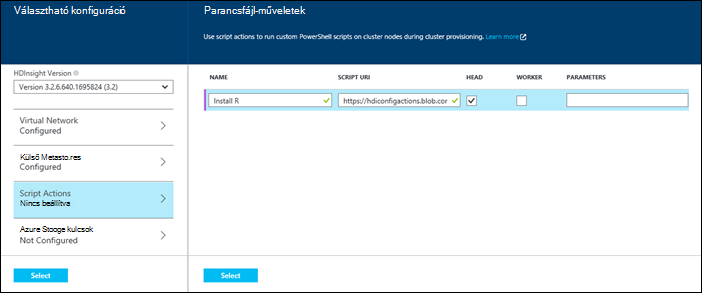
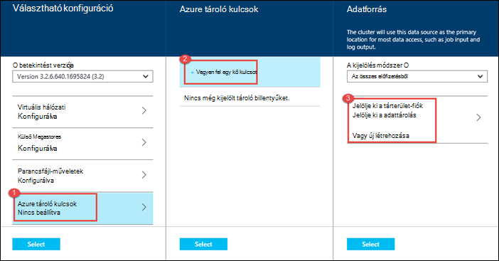

<properties
   pageTitle="Hozzon létre Hadoop fürt HDInsight |} Microsoft Azure"
    description="Megtudhatja, hogy miként fürt létrehozása az Azure hdinsight szolgáltatáshoz a Azure portál használatával."
   services="hdinsight"
   documentationCenter=""
   tags="azure-portal"
   authors="mumian"
   manager="jhubbard"
   editor="cgronlun"/>

<tags
   ms.service="hdinsight"
   ms.devlang="na"
   ms.topic="article"
   ms.tgt_pltfrm="na"
   ms.workload="big-data"
   ms.date="09/02/2016"
   ms.author="jgao"/>

# Windows-alapú Hadoop fürt létrehozása az Azure-portálon hdinsight szolgáltatáshoz

[AZURE.INCLUDE [selector](../../includes/hdinsight-selector-create-clusters.md)]

Megtudhatja, hogyan hozhat létre egy Hadoop fürthöz portálon Azure hdinsight szolgáltatáshoz. A Microsoft [Azure portál](../azure-portal-overview.md) egy központi helyet, ahol kiépítése és kezelése az Azure erőforrások. Azure portál egyike, a HDInsight Linux vagy Windows-alapú Hadoop fürt létrehozására használható eszközöket. Más fürt létrehozása eszközök és szolgáltatások lapon kattintson a lap tetején lévő vagy [fürt létrehozási módszerek](hdinsight-provision-clusters.md#cluster-creation-methods)látható.

##Előfeltételek:

[AZURE.INCLUDE [delete-cluster-warning](../../includes/hdinsight-delete-cluster-warning.md)]

Ez a cikk utasításait megkezdése előtt a következőket kell rendelkeznie:

- Egy Azure-előfizetést. Lásd: [Ismerkedés az Azure ingyenes próbaverziót](https://azure.microsoft.com/documentation/videos/get-azure-free-trial-for-testing-hadoop-in-hdinsight/).

### Access-ellenőrzési követelmények

[AZURE.INCLUDE [access-control](../../includes/hdinsight-access-control-requirements.md)]

## Fürt létrehozása

**Egy HDInsight fürthöz létrehozása**

1. Jelentkezzen be az [Azure-portálon](https://portal.azure.com).
2. Kattintson az **Új**gombra, válassza az **Adatok analitika**, és válassza a **hdinsight szolgáltatásból lehetőségre**.

    ![Az Azure-portálon új fürt létrehozása] (./media/hdinsight-provision-clusters/HDI.CreateCluster.1.png "Az Azure-portálon új fürt létrehozása")

3. Írja be vagy válassza ki a következő értékeket:

    * **Csoport neve**: írja be a csoport nevét. Egy zöld színű pipa jel fürt neve melletti fog megjelenni, ha elérhető a nevét.

    * **Fürt típusa**: jelölje be a **Hadoop**. Egyéb beállítások inclue **HBase** **vihar**és **a külső**.

        > [AZURE.IMPORTANT] HDInsight fürt fájltípusok, amelyek megfelelnek a terhelést vagy technológiát alkalmaz, amely a fürt van beállítva a különböző származnak. Nincs semmilyen módszerrel nem támogatott többféle, például vihar és egy fürt HBase kombináló fürt létrehozásához.

    * **Operációs rendszer**: jelölje be a **Windows**. Linux alapul fürt létrehozásához jelölje be a **Linux rendszerhez**.
    * **Verzió**: lásd: [HDInsight-verziók](hdinsight-component-versioning.md).
    * **Előfizetés**: Jelölje ki azt az Azure-előfizetést, a fürt létrehozásához használt.
    * **Erőforráscsoport**: Válasszon egy meglévő, vagy hozzon létre egy új erőforráscsoport. Ez a bejegyzés fog alapértelmezés szerint egy meglévő erőforrás csoportot, ha ilyen.
    * **Hitelesítő adatok**: állítsa be a felhasználónevét és jelszavát a Hadoop-felhasználó (HTTP a felhasználó). Ha engedélyezi a fürt távoli asztali, szüksége lesz a távoli asztali felhasználói felhasználónév és a jelszó és a lejárati dátum fiók konfigurálása. A képernyő alján a módosítások mentéséhez kattintson a **Kijelölés** gombra.

        ![Adjon fürt hitelesítő adatok] (./media/hdinsight-provision-clusters/HDI.CreateCluster.3.png "Adjon fürt hitelesítő adatok")

    * **Adatforrás**: hozzon létre egy új, vagy jelöljön ki egy meglévő Azure tárterület-fiókot a fürt használandó alapértelmezett fájlrendszer.

        ![Adatforrás-lap] (./media/hdinsight-provision-clusters/HDI.CreateCluster.4.png "Megadása az adatforrás konfigurálása")

        * **Kiválasztás módja**: az **összes előfizetésekről** ahhoz, hogy a előfizetésekről tároló fiókok böngészési ezeket a beállításokat. Állítsa a **Hívóbetű** , ha be szeretné írni a **Tárhely neve** és a **Hívóbetű** egy meglévő tárterület-fiókot.
        * **Jelölje ki azt a fiókot tároló / létrehozhat új**: kattintson a **Jelölje ki azt a fiókot tároló** tallózással keresse meg és jelöljön ki egy meglévő tárterület-fiókot, a fürt társítani szeretné. Vagy kattintson az **Új létrehozása** tároló új fiók létrehozása parancsra. Használja a mezőt, amely megjelenik a tárterület-fiókja nevét. Egy zöld színű pipa jel érhető el a név jelenik meg
        * **Alapértelmezett tároló kiválasztása**: Ezzel a paranccsal adja meg a fürt használandó alapértelmezett tárolóját nevét. Egy tetszőleges nevet itt adhatja meg, amíg használata javasolt, mert ugyanazt a nevet a fürt, hogy könnyen megjegyezhető szolgál, hogy a tároló a adott fürt számára.
        * **Hely**: A földrajzi területhez tartozik, amelyek a tárterület-fiókot, vagy jön létre. Meghatározza, hogy az ezen a helyen fürt helyét.  A fürt és annak alapértelmezett tárterület-fiókot kell közös keresse meg az azonos Azure adatközpont.
    
    * **Csomópont árak rétegek**: van szüksége a fürt dolgozó csomópontok számának megadása. A becsült költsége a fürt belül a lap jelenik meg.
  

        ![A csomópont árak rétegek lap] (./media/hdinsight-provision-clusters/HDI.CreateCluster.5.png "Fürt csomópontok számának megadása")

    * Jelölje ki a fürt verziót, valamint egyéb választható beállítások, mint, például kapcsolódok be egy **Virtuális hálózati**egy **Külső Metastore** beállítása a struktúra és Oozie, tartsa lenyomva az ujját adatok **Választható beállítási** parancsfájl-műveletek testreszabása egyéni összetevők telepítése fürt, vagy az további tárterületet fiókok a fürthöz.

    * **HDInsight-verziója**: Jelölje ki a a fürt használni kívánt verziót. További tudnivalókért olvassa el a [HDInsight fürt verzióival](hdinsight-component-versioning.md)foglalkozó.
    * **Virtuális hálózati**: jelölje be az Azure virtuális hálózati és az alhálózathoz, ha el szeretné helyezni a fürt egy virtuális hálózatba.  

        ![Virtuális hálózati lap] (./media/hdinsight-provision-clusters/HDI.CreateCluster.6.png "Adja meg a hálózati virtuális részletei")

        HDInsight használatáról virtuális a hálózat, beleértve a virtuális hálózat adott konfigurációs követelményei című témakörből a [kiterjesztése HDInsight capbilities az Azure virtuális hálózaton keresztül](hdinsight-extend-hadoop-virtual-network.md).
  

        
    * **Külső Metastores**: Adjon meg egy fürthöz társított struktúra és Oozie metaadatokat tárolhatnak az Azure SQL-adatbázishoz.
 
        > [AZURE.NOTE] Metastore konfigurációs HBase fürt típusnál nem érhető el.

    ![Egyéni metastores lap] (./media/hdinsight-provision-clusters/HDI.CreateCluster.7.png "Adja meg a külső metastores")

    Metaadat **-struktúra meglévő SQL DB használata** kattintson az **Igen**gombra, jelölje be az SQL-adatbázishoz, és majd adja meg az adatbázis felhasználónevével és jelszavával. Ismételje meg ezeket a lépéseket, ha szeretne **egy meglévő SQL DB Oozie metaadatok használata**. Kattintson a **Kijelölés** gombra, amíg biztos nem lehet jelentkezzen be a **Választható beállítási** lap.

    >[AZURE.NOTE] Az Azure SQL-adatbázis a metastore használt engedélyeznie kell a kapcsolatot más Azure szolgáltatást, többek között a Azure hdinsight szolgáltatáshoz. Kattintson a jobb oldalon az Azure SQL adatbázis irányítópult a kiszolgáló nevét. Az SQL-adatbázis példány kiszolgálón. Egyszer a kiszolgáló nézetben, kattintson a **Konfigurálás**gombra, és kattintson az **Azure-szolgáltatások**, kattintson az **Igen**gombra, és kattintson a **Mentés**gombra.

            &nbsp;

            > [AZURE.IMPORTANT] Egy metastore létrehozásakor ne használjon az adatbázis nevét, amely tartalmazza a szaggatott vonal vagy kötőjeleket, mint ez leállíthatja a fürt létrehozása sikertelen lesz.
        
        * **Script Actions** if you want to use a custom script to customize a cluster, as the cluster is being created. For more information about script actions, see [Customize HDInsight clusters using Script Action](hdinsight-hadoop-customize-cluster.md). On the Script Actions blade provide the details as shown in the screen capture.
    

            

        * **Azure Storage Keys**: Specify additional storage accounts to associate with the cluster. In the **Azure Storage Keys** blade, click **Add a storage key**, and then select an existing storage account or create a new account.
    

            

4. Kattintson a **létrehozása**gombra. **PIN-kód Startboard** kijelölése ad hozzá egy fürt csempéjére a Startboard portálja. Az ikon jelzi, hogy a fürt készül, és a HDInsight ikont jeleníti meg, létrehozási befejeződése után.
    
    Egy kis időt, a fürt hozható létre, általában körülbelül 15 percet fog tartani. Ellenőrizheti a kiépítési folyamat használata a Startboard vagy a lap bal szélén lévő **értesítések** tétel a csempére.
    

5. Ha befejeződött a létrehozását, kattintson a Startboard a fürt lap elindítani a fürt csempéje. A fürt lap a fürt, például a nevét, az erőforrás-csoporthoz tartozik, a helyet, az operációs rendszer URL-CÍMÉT a fürt irányítópult stb alapvető információt tartalmaz.

    ![Fürt lap] (./media/hdinsight-provision-clusters/HDI.Cluster.Blade.png "Fürt tulajdonságai")

    Ez a lap, valamint a **Alapverzió** szakasz felső részén található ikonokra megértéséhez használja a a következő:

    * **Az összes**és **Beállítások** : jeleníti meg a **Beállítások** lap a fürt, amely lehetővé teszi a fürt részletes konfigurációs adatok eléréséhez.
    * **Irányítópult** **Fürt irányítópult**és **URL-címe**: ezek a fürt irányítópult, amely a webes portál feladat futtatható a fürt elérésének összes módjai.
    * **Távoli asztali**: lehetővé teszi a fürt csomópontok távoli asztali engedélyezése vagy letiltása.
    * **Méretezés fürt**: lehetővé teszi, hogy a fürt dolgozó csomópontok számának módosítása.
    * **Törlése**: törli a HDInsight fürt.
    * **Quickstart útmutató** (): jelenít meg információt, amely segít a HDInsight használatának megkezdéséhez.
    * **Felhasználók** (): lehetővé teszi, hogy az engedélyeket az _adatkezelési portál_ a fürt más felhasználók számára az Azure-előfizetésben.
    

        > [AZURE.IMPORTANT] Ez _csak_ hatással van a portálon a fürt szükséges engedélyek és hozzáférés, és ki csatlakozhat, vagy a HDInsight fürt feladatok kezdeményezése nem befolyásolja.
        
    * **Címkék** (): címkék csoportban adhatja meg egy egyéni besorolás a felhőalapú szolgáltatások meghatározása kulcs/érték párokká. Például, előfordulhat, hogy hozzon létre egy __Projekt__nevű kulcsot, és kattintson egy adott projekttel kapcsolatos szolgáltatások használata a közös értéket.

##Fürt testreszabása

- Lásd: [testreszabása HDInsight fürt betöltő használatával](hdinsight-hadoop-customize-cluster-bootstrap.md).
- Lásd: [testre szabhatja a Windows-alapú HDInsight fürt parancsfájl művelettel](hdinsight-hadoop-customize-cluster.md).

##Következő lépések
Ebben a cikkben többféle módon is létre HDInsight fürt megtanulta azt van. További tudnivalókért lásd: az alábbi cikkekben:

* [Azure hdinsight szolgáltatáshoz – első lépések](hdinsight-hadoop-linux-tutorial-get-started.md) – megtudhatja, hogy miként kezdheti el a munkát a HDInsight fürthöz
* [Elküldése Hadoop feladatok programozás útján](hdinsight-submit-hadoop-jobs-programmatically.md) – megtudhatja, hogy miként programozás útján elküldése HDInsight-feladatok
* [A HDInsight Hadoop fürt kezelése az Azure portál használatával](hdinsight-administer-use-management-portal.md)

