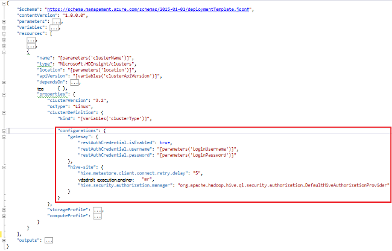

<properties
    pageTitle="Testre szabhatja a betöltés használatával HDInsight fürt |} Microsoft Azure"
    description="Megtudhatja, hogy miként testreszabása HDInsight fürt betöltő használatával."
    services="hdinsight"
    documentationCenter=""
    authors="mumian"
    manager="jhubbard"
    editor="cgronlun"
    tags="azure-portal"/>

<tags
    ms.service="hdinsight"
    ms.workload="big-data"
    ms.tgt_pltfrm="na"
    ms.devlang="na"
    ms.topic="article"
    ms.date="09/02/2016"
    ms.author="jgao"/>

# Testre szabhatja a HDInsight fürt betöltő használatával

Egyes esetekben be szeretné állítani a konfigurációs fájlokat, amelyek lehetnek:

- clusterIdentity.xml
- alapvető-site.xml
- Gateway.XML
- hbase-env.xml
- hbase-site.xml
- fájlrendszerhez-site.xml
- struktúra-env.xml
- struktúra-site.xml
- mapred-webhely
- oozie-site.xml
- oozie-env.xml
- vihar-site.xml
- tez-site.xml
- webhcat-site.xml
- fonal-site.xml

A fürt újra imaging miatt a módosításokat nem tudja megtartani. Újra imaging a további tudnivalókért lásd: [Szerepkör példány újraindul esedékes operációs rendszer frissítése](http://blogs.msdn.com/b/kwill/archive/2012/09/19/role-instance-restarts-due-to-os-upgrades.aspx). Ahhoz, hogy a módosításokat a fürt élettartam keresztül, a létrehozási folyamat során HDInsight-fürt testreszabási is használhatja. Ez a fürt beállítások módosítása, és továbbra is fennáll, az Azure reimage újraindítása újraindítása események végig az ajánlott módszereket. A módosításokat, a szolgáltatások needn't újra kell indítani szolgáltatás indítása, mielőtt veszi. 

3 módon betöltő használata:

- Azure PowerShell használata

    [AZURE.INCLUDE [upgrade-powershell](../../includes/hdinsight-use-latest-powershell.md)]
    
- .NET SDK használata
- Erőforrás-kezelő Azure-sablon használata

További összetevők telepítése a HDInsight fürthöz létrehozásának ideje alatt a további tudnivalókért lásd:

- [Parancsfájl művelettel (Linux) HDInsight fürt testreszabása](hdinsight-hadoop-customize-cluster-linux.md)
- [Testre szabhatja a HDInsight fürt parancsfájl művelettel (Windows)](hdinsight-hadoop-customize-cluster.md)

## Azure PowerShell használata

Az alábbi PowerShell-kódot a struktúra konfiguráció testreszabása:

    # hive-site.xml configuration
    $hiveConfigValues = @{ "hive.metastore.client.socket.timeout"="90" }
    
    $config = New-AzureRmHDInsightClusterConfig `
        | Set-AzureRmHDInsightDefaultStorage `
            -StorageAccountName "$defaultStorageAccountName.blob.core.windows.net" `
            -StorageAccountKey $defaultStorageAccountKey `
        | Add-AzureRmHDInsightConfigValues `
            -HiveSite $hiveConfigValues 
    
    New-AzureRmHDInsightCluster `
        -ResourceGroupName $existingResourceGroupName `
        -ClusterName $clusterName `
        -Location $location `
        -ClusterSizeInNodes $clusterSizeInNodes `
        -ClusterType Hadoop `
        -OSType Windows `
        -Version "3.2" `
        -HttpCredential $httpCredential `
        -Config $config 

Egy teljes munkaidő PowerShell-parancsprogramot megtalálható a [Függelék-A](#hdinsight-hadoop-customize-cluster-bootstrap.md/appx-a:-powershell-sample).

**A változás ellenőrzése:**

1. Bejelentkezés az [Azure-portálon](https://portal.azure.com).
2. A bal oldali ablaktáblában kattintson a **Tallózás gombra**, és kattintson a **HDInsight fürt**gombra.
3. Az imént létrehozott használata a PowerShell-parancsprogramot fürt gombra.
4. Kattintson az **Irányítópult** a lap tetején az Ambari felhasználói felületének megnyitásához.
5. A bal oldali menüben kattintson a **struktúra** .
6. Kattintson a **HiveServer2** az **összegzése**.
7. Kattintson a **konfigurációk** fülre.
8. A bal oldali menüben kattintson a **struktúra** .
9. Kattintson a **Speciális** fülre.
10. Görgessen le, és bontsa ki a **Speciális struktúra webhelyen**.
11. Keresse meg a **hive.metastore.client.socket.timeout** szakaszában.

Néhány további minták testreszabásához egyéb konfigurációs fájlok:

    # hdfs-site.xml configuration
    $HdfsConfigValues = @{ "dfs.blocksize"="64m" } #default is 128MB in HDI 3.0 and 256MB in HDI 2.1

    # core-site.xml configuration
    $CoreConfigValues = @{ "ipc.client.connect.max.retries"="60" } #default 50

    # mapred-site.xml configuration
    $MapRedConfigValues = @{ "mapreduce.task.timeout"="1200000" } #default 600000

    # oozie-site.xml configuration
    $OozieConfigValues = @{ "oozie.service.coord.normal.default.timeout"="150" }  # default 120

További információért tekintse meg Azim Uddin [testreszabása HDInsight fürt létrehozása](http://blogs.msdn.com/b/bigdatasupport/archive/2014/04/15/customizing-hdinsight-cluster-provisioning-via-powershell-and-net-sdk.aspx)című.

## .NET SDK használata

Lásd: [létrehozása Linux-alapú fürt a HDInsight a .NET SDK használatával](hdinsight-hadoop-create-linux-clusters-dotnet-sdk.md#use-bootstrap).

## Erőforrás-kezelő használata sablon

Erőforrás-kezelő sablonban betöltő használható:

    "configurations": {
        …
        "hive-site": {
            "hive.metastore.client.connect.retry.delay": "5",
            "hive.execution.engine": "mr",
            "hive.security.authorization.manager": "org.apache.hadoop.hive.ql.security.authorization.DefaultHiveAuthorizationProvider"
        }
    }

## Lásd még:

- [Hozzon létre Hadoop fürt HDInsight] [ hdinsight-provision-cluster] nyújt útmutatást, hogy miként hozhat létre egy HDInsight fürthöz más egyéni beállításokkal.
- [Fejleszthet olyan parancsfájl műveletet parancsfájlok hdinsight szolgáltatáshoz][hdinsight-write-script]
- [Telepítése és a külső HDInsight fürt használata][hdinsight-install-spark]
- [Telepítése és R HDInsight fürt használata][hdinsight-install-r]
- [Telepítési és használati Solr a HDInsight fürtök](hdinsight-hadoop-solr-install.md).
- [Telepítése és használata az fürtök Giraph a hdinsight szolgáltatásból lehetőségre](hdinsight-hadoop-giraph-install.md).

[hdinsight-install-spark]: hdinsight-hadoop-spark-install.md
[hdinsight-install-r]: hdinsight-hadoop-r-scripts.md
[hdinsight-write-script]: hdinsight-hadoop-script-actions.md
[hdinsight-provision-cluster]: hdinsight-provision-clusters.md
[powershell-install-configure]: powershell-install-configure.md

[img-hdi-cluster-states]: ./media/hdinsight-hadoop-customize-cluster/HDI-Cluster-state.png "Szakaszok fürt létrehozása során."

## AlkX-A: PowerShell-minta

A PowerShell-parancsprogramot létrehoz egy HDInsight fürthöz, és a struktúra beállítások testreszabása:

    ####################################
    # Set these variables
    ####################################
    #region - used for creating Azure service names
    $nameToken = "<ENTER AN ALIAS>" 
    #endregion

    #region - cluster user accounts
    $httpUserName = "admin"  #HDInsight cluster username
    $httpPassword = "<ENTER A PASSWORD>" #"<Enter a Password>"

    $sshUserName = "sshuser" #HDInsight ssh user name
    $sshPassword = "<ENTER A PASSWORD>" #"<Enter a Password>"
    #endregion

    ####################################
    # Service names and varialbes
    ####################################
    #region - service names
    $namePrefix = $nameToken.ToLower() + (Get-Date -Format "MMdd")

    $resourceGroupName = $namePrefix + "rg"
    $hdinsightClusterName = $namePrefix + "hdi"
    $defaultStorageAccountName = $namePrefix + "store"
    $defaultBlobContainerName = $hdinsightClusterName

    $location = "East US 2"
    #endregion

    # Treat all errors as terminating
    $ErrorActionPreference = "Stop"

    ####################################
    # Connect to Azure
    ####################################
    #region - Connect to Azure subscription
    Write-Host "`nConnecting to your Azure subscription ..." -ForegroundColor Green
    try{Get-AzureRmContext}
    catch{Login-AzureRmAccount}
    #endregion

    #region - Create an HDInsight cluster
    ####################################
    # Create dependent components
    ####################################
    Write-Host "Creating a resource group ..." -ForegroundColor Green
    New-AzureRmResourceGroup `
        -Name  $resourceGroupName `
        -Location $location

    Write-Host "Creating the default storage account and default blob container ..."  -ForegroundColor Green
    New-AzureRmStorageAccount `
        -ResourceGroupName $resourceGroupName `
        -Name $defaultStorageAccountName `
        -Location $location `
        -Type Standard_GRS

    $defaultStorageAccountKey = (Get-AzureRmStorageAccountKey `
                                    -ResourceGroupName $resourceGroupName `
                                    -Name $defaultStorageAccountName)[0].Value
    $defaultStorageContext = New-AzureStorageContext `
                                    -StorageAccountName $defaultStorageAccountName `
                                    -StorageAccountKey $defaultStorageAccountKey
    New-AzureStorageContainer `
        -Name $defaultBlobContainerName `
        -Context $defaultStorageContext #use the cluster name as the container name

    ####################################
    # Create a configuration object
    ####################################
    $hiveConfigValues = @{ "hive.metastore.client.socket.timeout"="90" }
        
    $config = New-AzureRmHDInsightClusterConfig `
        | Set-AzureRmHDInsightDefaultStorage `
            -StorageAccountName "$defaultStorageAccountName.blob.core.windows.net" `
            -StorageAccountKey $defaultStorageAccountKey `
        | Add-AzureRmHDInsightConfigValues `
            -HiveSite $hiveConfigValues 

    ####################################
    # Create an HDInsight cluster
    ####################################
    $httpPW = ConvertTo-SecureString -String $httpPassword -AsPlainText -Force
    $httpCredential = New-Object System.Management.Automation.PSCredential($httpUserName,$httpPW)

    $sshPW = ConvertTo-SecureString -String $sshPassword -AsPlainText -Force
    $sshCredential = New-Object System.Management.Automation.PSCredential($sshUserName,$sshPW)

    New-AzureRmHDInsightCluster `
        -ResourceGroupName $resourceGroupName `
        -ClusterName $hdinsightClusterName `
        -Location $location `
        -ClusterSizeInNodes 1 `
        -ClusterType Hadoop `
        -OSType Linux `
        -Version "3.2" `
        -HttpCredential $httpCredential `
        -SshCredential $sshCredential `
        -Config $config

    ####################################
    # Verify the cluster
    ####################################
    Get-AzureRmHDInsightCluster -ClusterName $hdinsightClusterName

    #endregion
