<properties
    pageTitle="Parancsfájl-műveletek használata HDInsight fürt testreszabása |} Microsoft Azure"
    description="Megtudhatja, hogy miként adja hozzá egyéni összetevőket Linux-alapú HDInsight fürt parancsfájl-műveletek használatával. Parancsfájl-műveletek: Bash parancsfájlok, amely a fürt csomóponton és használható a fürt konfigurálása testreszabása, és további szolgáltatásokat és a szín, Solr és j segédprogramok hozzáadása"
    services="hdinsight"
    documentationCenter=""
    authors="Blackmist"
    manager="jhubbard"
    editor="cgronlun"
    tags="azure-portal"/>

<tags
    ms.service="hdinsight"
    ms.workload="big-data"
    ms.tgt_pltfrm="na"
    ms.devlang="na"
    ms.topic="article"
    ms.date="09/06/2016"
    ms.author="larryfr"/>

# Parancsfájl művelettel Linux-alapú HDInsight fürt testreszabása

HDInsight tartalmaz egy beállítás nevű **Parancsfájl műveletet** , amely elindítja a fürt testreszabása egyéni parancsfájlokat. A parancsfájlok fürt létrehozása során, vagy egy már futó fürt használható, és további összetevők telepítése, és módosítsa a beállításokat.

> [AZURE.NOTE] Parancsfájl-műveletek használata egy már futó fürt Linux-alapú HDInsight fürt esetében csak érhető el. A Windows-alapú fürt parancsfájl-műveletek használja a további tudnivalókért lásd [testreszabása HDInsight fürt parancsfájl művelettel (Windows)](hdinsight-hadoop-customize-cluster.md).

Parancsfájl-műveletek is tehető közzé a Microsoft Azure piactéren HDInsight-alkalmazásként. A dokumentumban a példák néhány megjelenítése, hogyan telepítheti az HDInsight alkalmazás művelet parancsaihoz PowerShell és a .NET SDK csomagjában talál. HDInsight-alkalmazásokat a további tudnivalókért lásd: [az Azure piactéren elérhető alkalmazások közzététele hdinsight szolgáltatásból lehetőségre](hdinsight-apps-publish-applications.md). 

## Parancsfájl-műveletek ismertetése

A parancsprogram művelet egyszerűen egy parancsfájl, hogy Ön megadja, hogy egy URL-CÍMÉT, és a paraméterek, és ezután adódott a HDInsight fürt csomóponton Bash. Az alábbi táblázat tulajdonságokat és a parancsfájl-műveletek lehetőségeit.

* A HDInsight fürt az elérhető URI kell tárolni. A lehetséges tárolási helye a következők:

    * Egy blob-tároló fiókhoz, vagy az elsődleges, illetve további tárterület figyelembe venni a HDInsight fürt. HDInsight hozzáférést kap a tárterület-fiókokat az ilyen típusú fürt létrehozása során, mivel ezek kínál egy nem nyilvános parancsfájl művelettel.
    
    * Nyilvánosan olvasható URI, például egy Azure Blob, GitHub, a OneDrive, Dropbox stb.
    
    A parancsfájlok (nyilvánosan olvasható) blob-tárolóban URI szemléltető példák [például parancsfájl művelet parancsfájlok](#example-script-action-scripts) című.

* Korlátozhatja __csak bizonyos csomópont típusú futtatni__, például központi csomópontok vagy dolgozó csomópontot.

    > [AZURE.NOTE] HDInsight prémium verzió használata esetén megadhatja, hogy a parancsprogram kell használni a szegély csomópontra.

* Lehetnek __állandó__ vagy __alkalmi__.

    Parancsfájlok __Persisted__ parancsfájlokat csomópontok dolgozó alkalmazva vannak, és automatikusan fürt méretezésekor létrehozott új csomópontok futtatta.

    Állandó parancsfájl előfordulhat, hogy is módosításainak alkalmazása egy másik csomópont típusát, például egy központi csomópontot, de a használható funkciók körét szemszögéből csak egy parancsprogramot is oka az, így fürt ki méretezésekor létrehozott új dolgozó csomópontok vonatkozik.

    > [AZURE.IMPORTANT] Állandó parancsfájl-műveletek rendelkeznie kell egy egyedi nevet.

    __Alkalmi__ parancsfájlok nem csoportosítások megmaradnak; azonban is később előléptetése egy állandó parancsfájl alkalmi parancsfájl, vagy egy alkalmi parancsfájl állandó parancsfájl lefokozás.

    > [AZURE.IMPORTANT] Parancsfájl-műveletek fürt létrehozása során automatikusan vannak állandó.
    >
    > Parancsfájlok, amelyek nem fail: állandó, még akkor is, ha akkor kifejezetten ezzel azt jelzi, hogy legyen.

* Elfogadhatja a végrehajtás során a parancsfájl által használt __paramétereket__ .

* A fürt csomóponton van a __legfelső szintű jogosultságokkal__ futtatta.

* Használható az __Azure portál__, __Azure PowerShell__, __Azure CLI__vagy __HDInsight.NET SDK__ keresztül

    [AZURE.INCLUDE [upgrade-powershell](../../includes/hdinsight-use-latest-powershell-cli-and-dotnet-sdk.md)]

Segítse a megértéséhez, hogy milyen parancsfájlok alkalmazott fürtre, és az előléptetés vagy lefokozás, a fürt parancsfájlok azonosítója továbbra is, amelyeket az összes parancsfájl előzményeit meghatározásában futtatta.

> [AZURE.IMPORTANT] Nincs automatikus módszer a egy parancsprogramot művelet által végzett módosítások nem. Ha fordított parancsfájl hatásai kell kell megértéséhez, hogy milyen módosításokat végzett és manuálisan fordított őket (vagy adja meg a parancsprogram művelet, amelyet a megfordítja őket.)

### Parancsfájl műveletet a fürt létrehozásának folyamata

Parancsfájl-műveletek fürt létrehozása során kissé eltérnek műveletek futtatta egy meglévő fürt parancsfájl:

* A parancsprogram __automatikusan állandó__.

* __Sikertelen__ a parancsfájl leállíthatja a fürt létrehozása sikertelen lesz.

A következő diagramon azt mutatja be, amikor parancsfájl művelet végrehajtása a létrehozási folyamat során:

![HDInsight fürt testreszabás és a szakaszok fürt létrehozása során.][img-hdi-cluster-states]

A parancsprogram során a rendszer épp konfigurálja a HDInsight van futtatta. Ebben a szakaszban a parancsfájl a megadott csomópontok a fürt párhuzamos futtatásakor, és a csomópontok a legfelső szintű jogosultságokkal rendelkező van futtatta.

> [AZURE.NOTE] Mivel a parancsfájl fürt csomópontok a legfelső szintű jogosultsággal rendelkező van futtatta, például a szolgáltatást, többek között a Hadoop kapcsolatos szolgáltatások indítása és leállítása műveleteket végezheti el. Ha leállítja a szolgáltatásokat, győződjön meg róla, hogy a Ambari szolgáltatás és más Hadoop kapcsolatos szolgáltatások is lépéseket, mielőtt a parancsfájl futásának. Az alábbi szolgáltatások sikeresen határozza meg az állapot és a fürt állapotának azt létrehozása közben van szüksége.

Csoport létrehozása során meghívott több parancsfájl-műveletek abban a sorrendben, amelyben adta is megadhat.

> [AZURE.IMPORTANT] Parancsfájl-műveletek végre kell hajtania 60 percen belül, illetve azok fog időtúllépés. Során fürt kiépítési, a parancsfájl párhuzamosan más beállítás és konfiguráció folyamatok van futtatta. Versenyhelyzetből erőforrások, például a Processzor-és időértékek hálózati sávszélesség jelenhet meg a parancsfájlt, mint a fejlesztői környezet fejeződik.
>
> A parancsfájl futtatásához szükséges időt minimalizálásához elkerülése érdekében a feladatokat, például le, és a forrásból származó alkalmazások összeállítása. Ehelyett előre fordítsa le az alkalmazást, és tárolhatja a bináris Azure Blob-tárolóhoz, hogy gyorsan letölthető a fürthöz.

###A futó fürthöz parancsfájl művelet

Parancsfájlok hiba fürt létrehozása során használt műveletek futtatta egy már futó fürt parancsfájl eltérően nem automatikusan okozhat a fürt sikertelen állapotának módosítása. Ha befejeződött a parancsfájl, térjen vissza a fürt "operációs rendszert futtató" állapot.

> [AZURE.IMPORTANT] Ezt jelenti, hogy a futó fürt hagyja parancsprogramok hibás dolgot kell tennie. Parancsfájl sikerült például törölni a fájlokat a fürthöz, módosítás konfiguráció szükséges, hogy a szolgáltatások nem stb.
>
> Parancsfájlok műveletek futtatása legfelső szintű jogosultságokkal, ezért gondoskodnia kell arról, hogy megismeri parancsfájl leírása a fürthöz alkalmazása előtt.

Parancsfájl fürtre alkalmazásakor a fürt állapotát __operációs rendszert futtató__ __elfogadott__, majd a __HDInsight konfigurációs__váltson, és végül biztonsági __futtatásához__ a sikeres parancsfájlokat. Parancsfájl állapotát a parancsprogram művelet előzmények be van jelentkezve, és használhatja a megállapíthatja, hogy a parancsprogram sikeres vagy sikertelen volt. Ha például a `Get-AzureRmHDInsightScriptActionHistory` PowerShell-parancsmag egy parancsprogramot állapotának megtekintése használható. Adatokat ad vissza az alábbihoz hasonló:

    ScriptExecutionId : 635918532516474303
    StartTime         : 2/23/2016 7:40:55 PM
    EndTime           : 2/23/2016 7:41:05 PM
    Status            : Succeeded

> [AZURE.NOTE] Ha megváltoztatta a fürt felhasználó (rendszergazda) jelszavát a fürt létrehozása után, a műveletek futtatta szemben a fürt meghiúsító parancsfájl jelenhet meg. Ha bármely állandó parancsfájl-műveletek a cél dolgozó csomópontok, ezek meghiúsulhat, ha a csomópontok a fürthöz keresztül méretezze át a tevékenységek felvétele.

## Példa parancsfájl műveletet parancsfájlok

Parancsfájl művelet parancsfájlok az Azure portál Azure PowerShell, Azure CLI vagy a HDInsight .NET SDK használható. HDInsight az alábbi összetevők telepítése HDInsight fürt parancsfájlok nyújtja:

név | Parancsfájl
----- | -----
**Azure tárterület-fiók felvétele** | https://hdiconfigactions.BLOB.Core.Windows.NET/linuxaddstorageaccountv01/Add-Storage-Account-v01.SH. Lásd az [alkalmazása egy futó fürt parancsfájl műveletet](#apply-a-script-action-to-a-running-cluster).
**Szín telepítése** | https://hdiconfigactions.BLOB.Core.Windows.NET/linuxhueconfigactionv02/Install-hue-uber-v02.SH. Lásd: [telepítése és használata a HDInsight szín fürtök](hdinsight-hadoop-hue-linux.md).
**R telepítése** | https://hdiconfigactions.BLOB.Core.Windows.NET/linuxrconfigactionv01/r-Installer-v01.SH. Lásd: a [telepítés és a HDInsight fürt R használata](hdinsight-hadoop-r-scripts-linux.md).
**Solr telepítése** | https://hdiconfigactions.BLOB.Core.Windows.NET/linuxsolrconfigactionv01/solr-Installer-v01.SH. Lásd: [telepítése és használata a HDInsight Solr fürtök](hdinsight-hadoop-solr-install-linux.md).
**Giraph telepítése** | https://hdiconfigactions.BLOB.Core.Windows.NET/linuxgiraphconfigactionv01/giraph-Installer-v01.SH. Lásd: [telepítése és használata a HDInsight Giraph fürtök](hdinsight-hadoop-giraph-install-linux.md).
| **Előre a struktúra tárak betöltése** | https://hdiconfigactions.BLOB.Core.Windows.NET/linuxsetupcustomhivelibsv01/Setup-customhivelibs-v01.SH. Lásd: [a HDInsight fürt hozzáadása struktúra tárak](hdinsight-hadoop-add-hive-libraries.md) |

## Parancsfájl művelettel fürt létrehozása során.

Ebben a szakaszban a különböző felhasználási módjai parancsfájl-műveletek létrehozása egy HDInsight fürt – az Azure portálról, erőforrás-kezelő Azure-sablon segítségével, PowerShell-parancsmagok használata és a .NET SDK használatával a példákat.

### Parancsfájl művelettel fürt létrehozása az Azure portálról során.

1. Indítsa el a fürt létrehozása [a HDInsight létrehozása Hadoop fürt](hdinsight-provision-clusters.md#portal)leírtak.

2. A __Választható beállítási__a **Parancsfájl-műveletek** lap kattintva **parancsfájl művelet hozzáadása** a parancsfájl műveletet részleteinek megadására alább látható módon:

    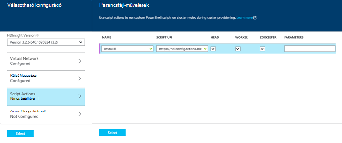

  	| A tulajdonság | Érték |
  	| -------- | ----- |
  	| név | Adja meg a parancsfájlt beavatkozásra. |
  	| Parancsfájl URI | Adja meg a parancsfájlt, ha testre szeretné szabni a fürt hív meg a URI. |
  	| Címsor/dolgozó | A testreszabási parancsfájl futtatásához adja meg a csomópontok (**vezetője**, **dolgozó**vagy **ZooKeeper**). |
  	| Paraméterek | Szükség szerint a parancsfájlt, adja meg a paraméterek. |

    Nyomja le az ENTER billentyűt a fürt több összetevők telepítése egynél több parancsfájl művelet hozzáadása.

3. Kattintson a **Jelölje ki** a konfigurációs menti, a fürt létrehozása gombra.

### Erőforrás-kezelő Azure sablonok parancsfájl művelettel

Ebben a részben a Microsoft Azure erőforrás-kezelő sablonok használatával hozzon létre egy HDInsight fürthöz és használatával is egy parancsfájl műveletet (ebben a példában R) egyéni összetevők telepítése a fürt. Ez a témakör a minta sablon parancsfájl művelettel fürt létrehozásához.

> [AZURE.NOTE] Ez a szakasz lépései bemutatják, hogy a parancsprogram művelettel fürt létrehozása. Példa fürt létrehozása sablonból HDInsight alkalmazás segítségével olvassa el az [egyéni HDInsight-alkalmazások telepítése](hdinsight-apps-install-custom-applications.md)című témakört.

#### Első lépések

* HDInsight Powershell-parancsmagok futtatásához munkaállomás beállításával kapcsolatos további tudnivalókért lásd [Telepítse és állítsa be a Azure PowerShell](../powershell-install-configure.md).
* Sablonok létrehozásával kapcsolatos útmutatásért lásd: [Azure erőforrás-kezelő szerzői sablonok](../resource-group-authoring-templates.md).
* Ha a, még nem használt Azure PowerShell az erőforrás-kezelő, olvassa el az [Azure PowerShell használatá Azure erőforrás-kezelővel](../powershell-azure-resource-manager.md).

#### Parancsfájl művelettel fürt létrehozása

1. Másolja a következő sablon egy helyet a számítógépen. Ezzel a sablonnal Giraph telepíti a headnodes és a fürt dolgozó csomópontot. Ha a JSON-sablon esetében érvényes is ellenőrizheti. Illessze be a sablon tartalom [JSONLint](http://jsonlint.com/), egy online JSON érvényességi eszközt.

            {
            "$schema": "http://schema.management.azure.com/schemas/2015-01-01/deploymentTemplate.json#",
            "contentVersion": "1.0.0.0",
            "parameters": {
                "clusterLocation": {
                    "type": "string",
                    "defaultValue": "West US",
                    "allowedValues": [ "West US" ]
                },
                "clusterName": {
                    "type": "string"
                },
                "clusterUserName": {
                    "type": "string",
                    "defaultValue": "admin"
                },
                "clusterUserPassword": {
                    "type": "securestring"
                },
                "sshUserName": {
                    "type": "string",
                    "defaultValue": "username"
                },
                "sshPassword": {
                    "type": "securestring"
                },
                "clusterStorageAccountName": {
                    "type": "string"
                },
                "clusterStorageAccountResourceGroup": {
                    "type": "string"
                },
                "clusterStorageType": {
                    "type": "string",
                    "defaultValue": "Standard_LRS",
                    "allowedValues": [
                        "Standard_LRS",
                        "Standard_GRS",
                        "Standard_ZRS"
                    ]
                },
                "clusterStorageAccountContainer": {
                    "type": "string"
                },
                "clusterHeadNodeCount": {
                    "type": "int",
                    "defaultValue": 1
                },
                "clusterWorkerNodeCount": {
                    "type": "int",
                    "defaultValue": 2
                }
            },
            "variables": {
            },
            "resources": [
                {
                    "name": "[parameters('clusterStorageAccountName')]",
                    "type": "Microsoft.Storage/storageAccounts",
                    "location": "[parameters('clusterLocation')]",
                    "apiVersion": "2015-05-01-preview",
                    "dependsOn": [ ],
                    "tags": { },
                    "properties": {
                        "accountType": "[parameters('clusterStorageType')]"
                    }
                },
                {
                    "name": "[parameters('clusterName')]",
                    "type": "Microsoft.HDInsight/clusters",
                    "location": "[parameters('clusterLocation')]",
                    "apiVersion": "2015-03-01-preview",
                    "dependsOn": [
                        "[concat('Microsoft.Storage/storageAccounts/', parameters('clusterStorageAccountName'))]"
                    ],
                    "tags": { },
                    "properties": {
                        "clusterVersion": "3.2",
                        "osType": "Linux",
                        "clusterDefinition": {
                            "kind": "hadoop",
                            "configurations": {
                                "gateway": {
                                    "restAuthCredential.isEnabled": true,
                                    "restAuthCredential.username": "[parameters('clusterUserName')]",
                                    "restAuthCredential.password": "[parameters('clusterUserPassword')]"
                                }
                            }
                        },
                        "storageProfile": {
                            "storageaccounts": [
                                {
                                    "name": "[concat(parameters('clusterStorageAccountName'),'.blob.core.windows.net')]",
                                    "isDefault": true,
                                    "container": "[parameters('clusterStorageAccountContainer')]",
                                    "key": "[listKeys(resourceId('Microsoft.Storage/storageAccounts', parameters('clusterStorageAccountName')), '2015-05-01-preview').key1]"
                                }
                            ]
                        },
                        "computeProfile": {
                            "roles": [
                                {
                                    "name": "headnode",
                                    "targetInstanceCount": "[parameters('clusterHeadNodeCount')]",
                                    "hardwareProfile": {
                                        "vmSize": "Large"
                                    },
                                    "osProfile": {
                                        "linuxOperatingSystemProfile": {
                                            "username": "[parameters('sshUserName')]",
                                            "password": "[parameters('sshPassword')]"
                                        }
                                    },
                                    "scriptActions": [
                                        {
                                            "name": "installGiraph",
                                            "uri": "https://hdiconfigactions.blob.core.windows.net/linuxgiraphconfigactionv01/giraph-installer-v01.sh",
                                            "parameters": ""
                                        }
                                    ]
                                },
                                {
                                    "name": "workernode",
                                    "targetInstanceCount": "[parameters('clusterWorkerNodeCount')]",
                                    "hardwareProfile": {
                                        "vmSize": "Large"
                                    },
                                    "osProfile": {
                                        "linuxOperatingSystemProfile": {
                                            "username": "[parameters('sshUserName')]",
                                            "password": "[parameters('sshPassword')]"
                                        }
                                    },
                                    "scriptActions": [
                                        {
                                            "name": "installR",
                                            "uri": "https://hdiconfigactions.blob.core.windows.net/linuxrconfigactionv01/r-installer-v01.sh",
                                            "parameters": ""
                                        }
                                    ]
                                }
                            ]
                        }
                    }
                }
            ],
            "outputs": {
                "cluster":{
                    "type" : "object",
                    "value" : "[reference(resourceId('Microsoft.HDInsight/clusters',parameters('clusterName')))]"
                }
            }
        }

2. Indítsa el a Azure PowerShell és bejelentkezés az Azure-fiókjába. Adja meg a hitelesítő adatokat, miután a parancsot a fiókkal kapcsolatos információk adja eredményül.

        Add-AzureRmAccount

        Id                             Type       ...
        --                             ----
        someone@example.com            User       ...

3. Ha több előfizetéssel rendelkezik, adja meg a telepítéshez használni kívánt előfizetés azonosítója.

        Select-AzureRmSubscription -SubscriptionID <YourSubscriptionId>

    > [AZURE.NOTE] Használható `Get-AzureRmSubscription` egy listát, amely tartalmazza az előfizetési azonosító mindegyik a fiókkal társított előfizetések.

5. Ha nem egy meglévő erőforráscsoport, hozzon létre egy új erőforráscsoport. Adja meg a nevét az erőforráscsoport és helyre van szüksége a megoldás. Az új erőforráscsoport összefoglalását adja vissza.

        New-AzureRmResourceGroup -Name myresourcegroup -Location "West US"

        ResourceGroupName : myresourcegroup
        Location          : westus
        ProvisioningState : Succeeded
        Tags              :
        Permissions       :
                            Actions  NotActions
                            =======  ==========
                            *
        ResourceId        : /subscriptions/######/resourceGroups/ExampleResourceGroup

6. Hozzon létre egy új telepítésének a erőforráscsoport, futtassa a **New-AzureRmResourceGroupDeployment** parancsot, és adja meg a szükséges paramétereket. A paraméterek tartalmazni fogja a telepítéshez, a névre az erőforráscsoport és elérési útját vagy URL-CÍMÉT az létrehozott sablonra nevét. Ha a sablon paramétereket igényel, ezeket a paramétereket át kell adnia. Ebben az esetben a parancsfájl műveletet R telepítése a fürt paramétereket nincs szükség.

        New-AzureRmResourceGroupDeployment -Name mydeployment -ResourceGroupName myresourcegroup -TemplateFile <PathOrLinkToTemplate>

    A rendszer kéri a sablonban paramétert a szükséges értékeket.

7. Lett telepítve az erőforráscsoport, ha látni fogja a telepítési összefoglalását.

          DeploymentName    : mydeployment
          ResourceGroupName : myresourcegroup
          ProvisioningState : Succeeded
          Timestamp         : 8/17/2015 7:00:27 PM
          Mode              : Incremental
          ...

8. Ha a telepítés meghiúsul, a következő parancsmagok információk a hibákról is használhatja.

        Get-AzureRmResourceGroupDeployment -ResourceGroupName myresourcegroup -ProvisioningState Failed

### Parancsfájl művelettel fürt létrehozása az Azure PowerShell során.

Ebben a részben a [Hozzáadás-AzureRmHDInsightScriptAction](https://msdn.microsoft.com/library/mt603527.aspx) parancsmag parancsfájlok meghívásához műveletével parancsfájl fürt testreszabása használjuk. A folytatás előtt győződjön meg arról, hogy telepítette és beállította az Azure PowerShell. HDInsight PowerShell-parancsmagok futtatásához munkaállomás beállításával kapcsolatos további tudnivalókért lásd [Telepítse és állítsa be a Azure PowerShell](../powershell-install-configure.md).

Hajtsa végre az alábbi lépéseket:

1. Nyissa meg az Azure PowerShell konzolt, az alábbi módon jelentkezzen be az Azure előfizetés használ, és néhány PowerShell változók deklarálhatnak:

        # LOGIN TO ZURE
        Login-AzureRmAccount

        # PROVIDE VALUES FOR THESE VARIABLES
        $subscriptionId = "<SubscriptionId>"        # ID of the Azure subscription
        $clusterName = "<HDInsightClusterName>"         # HDInsight cluster name
        $storageAccountName = "<StorageAccountName>"    # Azure storage account that hosts the default container
        $storageAccountKey = "<StorageAccountKey>"      # Key for the storage account
        $containerName = $clusterName
        $location = "<MicrosoftDataCenter>"             # Location of the HDInsight cluster. It must be in the same data center as the storage account.
        $clusterNodes = <ClusterSizeInNumbers>          # The number of nodes in the HDInsight cluster.
        $resourceGroupName = "<ResourceGroupName>"      # The resource group that the HDInsight cluster will be created in

2. Adja meg a konfigurációs értékek (például a fürt csomópontjai) és a használandó alapértelmezett tárolására.

        # SPECIFY THE CONFIGURATION OPTIONS
        Select-AzureRmSubscription -SubscriptionId $subscriptionId
        $config = New-AzureRmHDInsightClusterConfig
        $config.DefaultStorageAccountName="$storageAccountName.blob.core.windows.net"
        $config.DefaultStorageAccountKey=$storageAccountKey

3. **Hozzáadás-AzureRmHDInsightScriptAction** parancsmag használatával a parancsfájl meghívásához. Az alábbi példában egy parancsfájlt, amely a fürt Giraph telepítése:

        # INVOKE THE SCRIPT USING THE SCRIPT ACTION FOR HEADNODE AND WORKERNODE
        $config = Add-AzureRmHDInsightScriptAction -Config $config -Name "Install Giraph"  -NodeType HeadNode -Uri https://hdiconfigactions.blob.core.windows.net/linuxgiraphconfigactionv01/giraph-installer-v01.sh
        $config = Add-AzureRmHDInsightScriptAction -Config $config -Name "Install Giraph"  -NodeType WorkerNode -Uri https://hdiconfigactions.blob.core.windows.net/linuxgiraphconfigactionv01/giraph-installer-v01.sh

    A **Hozzáadás-AzureRmHDInsightScriptAction** parancsmag hajtja végre a következő paraméterek:

  	| Paraméter | Meghatározása |
  	| --------- | ---------- |
  	| Beállítások | Melyik parancsfájl művelet információk bekerülnek a konfigurációs objektum. |
  	| név | A parancsprogram művelet nevét. |
  	| NodeType | Itt adhatja meg az a Testreszabás parancsfájl futtatható csomópontot. Az érvényes értékek **HeadNode** (való telepítéséhez a fő csomópont) **WorkerNode** (való telepítéséhez az adatok csomópontjait), vagy **ZookeeperNode** (való telepítéséhez az zookeeper csomópont). |
  	| Paraméterek | A paraméterek követel meg a parancsfájlt. |
  	| URI | Adja meg a URI végrehajtott parancsfájlt szeretne. |

4. Adja meg a rendszergazda/HTTPS-felhasználó, a fürt:

        $httpCreds = get-credential

    Amikor a rendszer kéri, adja meg a "felügyeleti" a neve, és adja meg a jelszót.

5. A SSH hitelesítő adatainak beállítása:

        $sshCreds = get-credential

    Amikor a rendszer kéri, adja meg a SSH felhasználónevet és jelszót. Ha szeretne a SSH fiók egy tanúsítvánnyal helyett egy jelszót secure, üres jelszóval, és állítsa `$sshPublicKey` a használni kívánt tanúsítványt nyilvános kulcs tartalmát. Példa:

        $sshPublicKey = Get-Content .\path\to\public.key -Raw

4. Végezetül hozza létre:

        New-AzureRmHDInsightCluster -config $config -clustername $clusterName -DefaultStorageContainer $containerName -Location $location -ResourceGroupName $resourceGroupName -ClusterSizeInNodes $clusterNodes -HttpCredential $httpCreds -SshCredential $sshCreds -OSType Linux

    Ha egy nyilvános kulcs SSH fiókja biztonságos rendszer használata esetén is meg kell adnia `-SshPublicKey $sshPublicKey` paraméterként.

Eltarthat néhány percig, amíg a fürt létrehozása előtt.

### A HDInsight .NET SDK a csoport létrehozása során parancsfájl művelettel

A HDInsight .NET SDK csomagjában talál, amely megkönnyíti a .NET-alkalmazásból HDInsight használata ügyfél-tárak ismertetése Kód minta témakörben [létrehozása Linux-alapú fürt a HDInsight a .NET SDK használatával](hdinsight-hadoop-create-linux-clusters-dotnet-sdk.md#use-script-action).

## A futó fürtre egy parancsprogramot művelet alkalmazása

Ez a szakasz példákat mutat be a parancsfájl-műveletek alkalmazhat futó HDInsight fürt; a különböző módokon az Azure portál használata PowerShell-parancsmagok az Azure-platformok CLI használ, és a .NET SDK használja. Az ebben a részben használt állandó parancsfájl művelet hozzáadása futó fürt egy meglévő Azure tárterület-fiókot. [Példa parancsfájl művelet parancsfájlok](#example-script-action-scripts)lásd: más parancsfájl műveleteket is használhatja.

### A futó fürtre az Azure portálról egy parancsprogramot művelet alkalmazása

1. Az [Azure portálon](https://portal.azure.com)válassza ki a HDInsight csoportját.

2. A HDInsight fürt lap válassza a __Parancsfájl-műveletek__ csempére.

    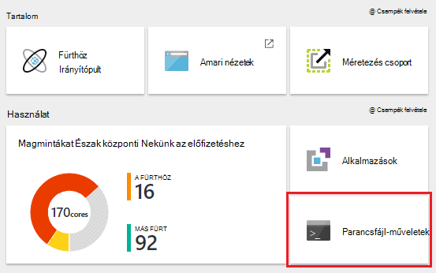

    > [AZURE.NOTE] Is kiválaszthatja az __összes beállítást__ , és válassza a beállítások lap __Script műveletek__ .

4. A parancsfájl-műveletek a lap tetején kattintson a __Küldés új__.

    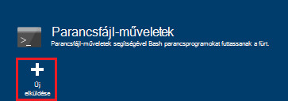

5. A parancsprogram művelet hozzáadása lap az adja meg az alábbi információkat.

    * __Név__: A rövid nevet a művelet parancsfájl. Ebben a példában `Add Storage account`.
    * __Parancsfájl URI__: A URI, hogy a parancsprogram. Ebben a példában`https://hdiconfigactions.blob.core.windows.net/linuxaddstorageaccountv01/add-storage-account-v01.sh`
    * __Címsor__ __dolgozó__és __Zookeeper__: jelölje be a csomópontok, hogy a parancsprogram vonatkoznak. Ebben a példában a címsor, dolgozó és Zookeeper van jelölve.
    * __Paraméterek__: Ha a parancsfájl elfogadja a paramétereket, őket az itt megadott. Írja be a tárterület-fiók nevét, és a tárhely fiókkulcs ebben a példában:

        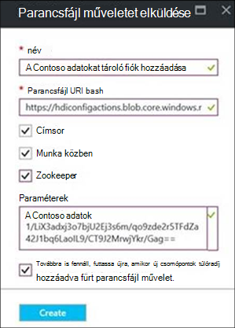

        Kattintson a képernyőképet `contosodata` egy létező Azure tárterület-fiókot, a második sorban a tárhely fiókkulcs.
    * __PERSISTED__: Ha a parancsfájl továbbra is fennáll, így azt fog vonatkozni új dolgozó csomópontok akkor a csoportját fel szeretné, jelölje be ezt a bejegyzést.

6. Végül a __Létrehozás__ gomb segítségével a parancsfájl alkalmazása a fürt.

### Azure PowerShell alkalmazása egy parancsprogramot művelet futó fürthöz

A folytatás előtt győződjön meg arról, hogy telepítette és beállította az Azure PowerShell. HDInsight PowerShell-parancsmagok futtatásához munkaállomás beállításával kapcsolatos további tudnivalókért lásd [Telepítse és állítsa be a Azure PowerShell](../powershell-install-configure.md).

1. Nyissa meg az Azure PowerShell konzolt, az alábbi módon jelentkezzen be az Azure előfizetés használ, és néhány PowerShell változók deklarálhatnak:

        # LOGIN TO ZURE
        Login-AzureRmAccount

        # PROVIDE VALUES FOR THESE VARIABLES
        $clusterName = "<HDInsightClusterName>"         # HDInsight cluster name
        $saName = "<ScriptActionName>"                  # Name of the script action
        $saURI = "<URI to the script>"                  # The URI where the script is located
        $nodeTypes = "headnode", "workernode"
        
    > [AZURE.NOTE] Egy HDInsight prémium fürthöz használata esetén is használhatja az egy nodetype `"edgenode"` futtatása a szegély csomópontra.

2. A következő parancsot használja a parancsfájl alkalmazni a fürt:

        Submit-AzureRmHDInsightScriptAction -ClusterName $clusterName -Name $saName -Uri $saURI -NodeTypes $nodeTypes -PersistOnSuccess

    Ha a feladat befejeződött, a következőhöz hasonló adatokat kell megjelennie:

        OperationState  : Succeeded
        ErrorMessage    :
        Name            : Giraph
        Uri             : https://hdiconfigactions.blob.core.windows.net/linuxgiraphconfigactionv01/giraph-installer-v01.sh
        Parameters      :
        NodeTypes       : {HeadNode, WorkerNode}

### Az Azure CLI alkalmazása egy parancsprogramot művelet futó fürthöz

A folytatás előtt győződjön meg arról, hogy telepítette és beállította az Azure CLI. További tudnivalókért lásd: [telepítse az Azure CLI](../xplat-cli-install.md).

    [AZURE.INCLUDE [use-latest-version](../../includes/hdinsight-use-latest-cli.md)] 

1. Nyissa meg a rendszerhéj munkamenet, terminált, a parancssor parancsot vagy egyéb parancssori a rendszer, és Azure erőforrás-kezelő módba vált, a következő parancs segítségével.

        azure config mode arm

2. Használja a következő Azure-előfizetéséhez hitelesítést végezni.

        azure login

3. A következő parancsot használja egy parancsprogramot művelet alkalmazása futó fürthöz

        azure hdinsight script-action create <clustername> -g <resourcegroupname> -n <scriptname> -u <scriptURI> -t <nodetypes>

    Ha ez a parancs paramétereinek nincs megadva, a rendszer kéri, az őket. Ha a parancsfájl adja meg a `-u` fogadja el a paramétereket, ezek megadhatók használata a `-p` paraméter.

    Érvényes __nodetypes__ __headnode__ __workernode__és __zookeeper__. Ha a parancsfájl többféle csomópont vonatkoznak, adja meg a elválasztva fájltípusok egy ";". Ha például `-n headnode;workernode`.

    Továbbra is fennáll a parancsfájlt, vegye fel a `--persistOnSuccess`. Akkor is is marad meg a parancsfájlt későbbi időpontban használatával `azure hdinsight script-action persisted set`.
    
    Ha befejeződött a feladatot, az alábbihoz hasonló kimeneti kap.
    
        info:    Executing command hdinsight script-action create
        + Executing Script Action on HDInsight cluster
        data:    Operation Info
        data:    ---------------
        data:    Operation status:
        data:    Operation ID:  b707b10e-e633-45c0-baa9-8aed3d348c13
        info:    hdinsight script-action create command OK

### Egy parancsprogramot művelet alkalmazása egy futó fürt REST API segítségével

Lásd: a [Parancsfájl-műveletek futtatása a futó fürthöz](https://msdn.microsoft.com/library/azure/mt668441.aspx).
### A HDInsight .NET SDK alkalmazása egy parancsprogramot művelet futó fürthöz

Példa a .NET SDK használatával fürt parancsfájlok alkalmazni olvassa el a [https://github.com/Azure-Samples/hdinsight-dotnet-script-action](https://github.com/Azure-Samples/hdinsight-dotnet-script-action)című témakört.

## Előzményeinek megtekintése, előléptetése és lefokozás parancsfájl-műveletek

### Az Azure portál használatával

1. Az [Azure portálon](https://portal.azure.com)válassza ki a HDInsight csoportját.

2. A HDInsight fürt lap kattintson a __Beállítások__.

    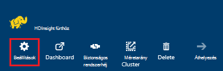

3. Jelölje ki a beállítások lap __Script műveletek__.

    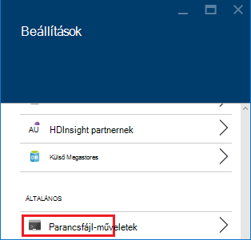

4. Az állandó parancsprogramok alapján elkészítheti, valamint a fürt, alkalmazott parancsfájlok előzményeit listája megjelenik a parancsfájl-műveletek lap. Az alábbi képernyőképen látható, hogy a parancsprogram lett Solr a fürt, de a futtatásakor, hogy a parancsprogram-műveletek nem állandó van már.

    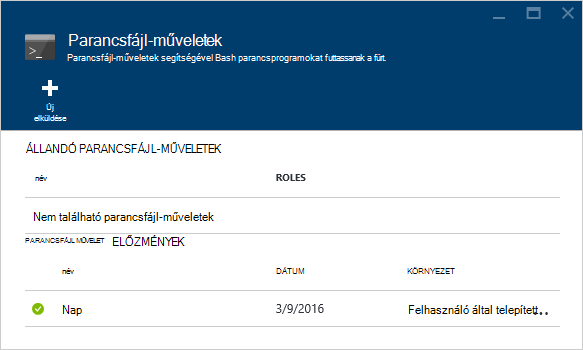

5. Az előzményeket egy parancsprogramot kiválasztása a Tulajdonságok lap a parancsfájl jeleníti meg. A lap tetején futtassa újra a parancsfájlt, vagy előléptetheti.

    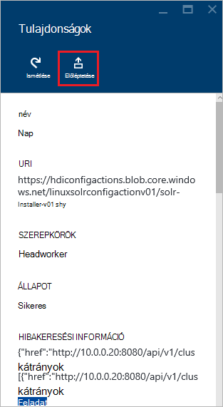

6. Is használhatja a __…__ műveleteket, például futtassa újra a parancsfájl-műveletek lap tételek jobbra továbbra is fennáll, illetve törlése (az állandó a műveletek).

    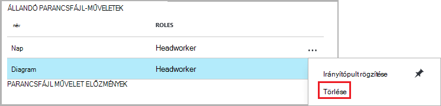

### Azure PowerShell használatával

| Használja az alábbi... | A... |
| ----- | ----- |
| Get-AzureRmHDInsightPersistedScriptAction | Lekérdezi adatait a állandó parancsfájl-műveletek |
| Get-AzureRmHDInsightScriptActionHistory | Parancsfájl-műveletek fürt, vagy egy adott parancsfájlt részleteinek érvényes előzményeit beolvasása |
| Set-AzureRmHDInsightPersistedScriptAction | Előléptethet állandó parancsfájl műveletével alkalmi parancsfájl művelet |
| Eltávolítás-AzureRmHDInsightPersistedScriptAction | Egy állandó parancsprogram-műveletet alkalmi művelet visszaléptetése |

> [AZURE.IMPORTANT] Használatával `Remove-AzureRmHDInsightPersistedScriptAction` nem nem parancsfájl által végzett műveletek visszavonása, kizárólag távolítja el az állandó jelző, hogy a parancsprogram nem lehet a fürthöz hozzáadott új dolgozó csomóponton futtatta.

Az alábbi példa parancsfájl bemutatja, hogyan reklámozása, majd a lefokozás parancsfájl-parancsmagok használata.

    # Get a history of scripts
    Get-AzureRmHDInsightScriptActionHistory -ClusterName mycluster

    # From the list, we want to get information on a specific script
    Get-AzureRmHDInsightScriptActionHistory -ClusterName mycluster -ScriptExecutionId 635920937765978529

    # Promote this to a persisted script
    # Note: the script must have a unique name to be promoted
    # if the name is not unique, you will receive an error
    Set-AzureRmHDInsightPersistedScriptAction -ClusterName mycluster -ScriptExecutionId 635920937765978529

    # Demote the script back to ad hoc
    # Note that demotion uses the unique script name instead of
    # execution ID.
    Remove-AzureRmHDInsightPersistedScriptAction -ClusterName mycluster -Name "Install Giraph"

### Az Azure CLI használatával

| Használja az alábbi... | A... |
| ----- | ----- |
| `azure hdinsight script-action persisted list <clustername>` | Állandó parancsfájl-műveletek listáját |
| `azure hdinsight script-action persisted show <clustername> <scriptname>` | Lekérdezi egy adott állandó parancsfájl művelettel adatait |
| `azure hdinsight script-action history list <clustername>` | Parancsfájl-műveletek a fürt alkalmazott előzményeit beolvasása |
| `azure hdinsight script-action history show <clustername> <scriptname>` | Lekérdezi egy adott parancsfájl művelettel adatait |
| `azure hdinsight script action persisted set <clustername> <scriptexecutionid>` | Előléptethet állandó parancsfájl műveletével alkalmi parancsfájl művelet |
| `azure hdinsight script-action persisted delete <clustername> <scriptname>` | Egy állandó parancsprogram-műveletet alkalmi művelet visszaléptetése |

> [AZURE.IMPORTANT] Használatával `azure hdinsight script-action persisted delete` nem nem parancsfájl által végzett műveletek visszavonása, kizárólag távolítja el az állandó jelző, hogy a parancsprogram nem lehet a fürthöz hozzáadott új dolgozó csomóponton futtatta.

### A HDInsight .NET SDK használatával

Példa a .NET SDK használatával parancsfájl előzmények lekérése fürt előléptetése vagy Lefokozás parancsfájlok című témakör [https://github.com/Azure-Samples/hdinsight-dotnet-script-action](https://github.com/Azure-Samples/hdinsight-dotnet-script-action).

> [AZURE.NOTE] Ebben a példában is bemutatja, hogyan lehet a .NET SDK HDInsight alkalmazás telepítéséhez.

## Hibaelhárítás

Parancsfájl-műveletek naplózott adatok megtekintéséhez Ambari webes felület is használhatja. A parancsprogram használatakor során fürt létrehozását, és fürt létrehozása a parancsfájl hiba miatt sikertelen volt, a naplókat is megtalálhatók az alapértelmezett tároló fiók fürthöz társított. Ez a témakör adatok beolvasásához a naplókat, mindkét ezek a beállítások használatával hogyan.

### A Ambari Web felhasználói felület használata

1. A böngészőben nyissa meg azt a https://CLUSTERNAME.azurehdinsight.net. CLUSTERNAME cserélje le a HDInsight fürt nevét.

    Amikor a rendszer kéri, írja be a rendszergazdai fiók nevét (rendszergazda) és a jelszavát a fürt. Írja be újra a rendszergazdai hitelesítő adatait a webes űrlap is.

2. A lap tetején lévő sávon a jelölje ki a __ops__ . Ez az aktuális és az előző művelet végrehajtását, a fürt Ambari keresztül listáját jelennek meg.

    

3. Keresse meg a rendelkező bejegyzéseket __futtatása\_customscriptaction__ a __művelet__ oszlopban. Ezek a parancsfájl-műveletek futtatásakor készült.

    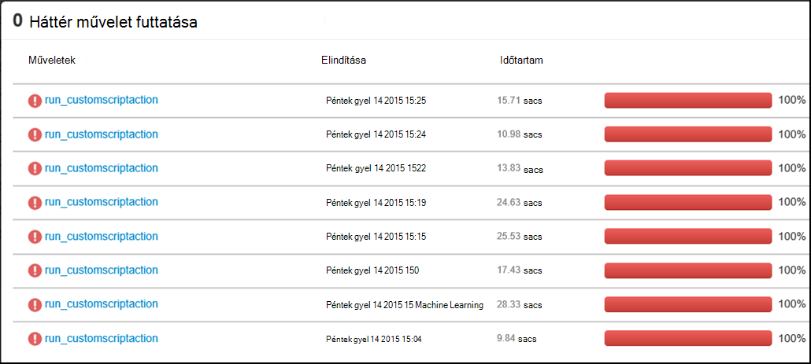

    Jelölje ki a bejegyzést, és a hivatkozásokra kattintva megtekintheti a jön létre, amikor a parancsfájlok futtatásának STDOUT és STDERR kimenet keresztül Lehatolás a fürt futtatta.

### Az alapértelmezett tároló fiókból Access naplók

A fürt létrehozása parancsfájl működésben hiba miatt sikertelen, ha a parancsprogram művelet naplók továbbra is webböngészőn keresztül elérhetők közvetlenül az alapértelmezett tároló fiók fürthöz társított.

* A tároló naplók érhetők el a `\STORAGE_ACOCUNT_NAME\DEFAULT_CONTAINER_NAME\custom-scriptaction-logs\CLUSTER_NAME\DATE`.

    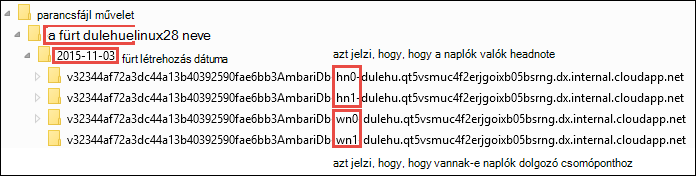

    Csoportban, a naplókat vannak rendezve külön-külön headnode, workernode és zookeeper csomópontot. Néhány példa a következők:
    * **Headnode** - `<uniqueidentifier>AmbariDb-hn0-<generated_value>.cloudapp.net`
    * **Dolgozó csomópontot.** - `<uniqueidentifier>AmbariDb-wn0-<generated_value>.cloudapp.net`
    * **Zookeeper csomópontot.** - `<uniqueidentifier>AmbariDb-zk0-<generated_value>.cloudapp.net`

* Az összes stdout és a megfelelő fogadó stderr feltöltése a tárterület-fiókjába. Több **kimeneti -\*.txt** és **hibák -\*.txt** egyes parancsfájl műveletekhez. A kimenet-*.txt fájlt is foglalkozik a URI használ az állomáson futó parancsfájl. Ha például

        'Start downloading script locally: ', u'https://hdiconfigactions.blob.core.windows.net/linuxrconfigactionv01/r-installer-v01.sh'

* Többször létrehozott parancsfájl művelet fürt azonos nevű lehetőség. Ebben az esetben különböztethetjük meg a megfelelő naplók a dátum mappa neve alapján. Ha például a mappastruktúra készült különböző időpontokban fürt (en_furtom nevű fürt) a következő lesz:
    * `\STORAGE_ACOCUNT_NAME\DEFAULT_CONTAINER_NAME\custom-scriptaction-logs\mycluster\2015-10-04`
    * `\STORAGE_ACOCUNT_NAME\DEFAULT_CONTAINER_NAME\custom-scriptaction-logs\mycluster\2015-10-05`

* Ha parancsfájl művelet fürt hoz létre azonos nevű aznap, az egyedi előtag segítségével azonosítani a megfelelő naplófájlok.

* A nap végén fürt hoz létre, érdemes lehetséges, hogy a naplófájlok között két nap időtartamát. Ebben az esetben látni fogja a azonos fürt két különböző dátum mappát.

* Fájlok feltöltése a alapértelmezett tároló legfeljebb 5 perc, különösen a nagy fürt is tarthat. Igen ha szeretne hozzáférni a naplókat, nem azonnal törölnie kell a fürt egy parancsprogramot művelet sikertelen, ha.

## Megnyitás-forrás szoftver HDInsight fürt használt támogatása

A Microsoft Azure HDInsight szolgáltatása, amely lehetővé teszi, hogy a felhőben nagy adatok alkalmazások készíthet Megnyitás-forrás technológiák formázott körül Hadoop-ökológiai használatával rugalmas platformot. Microsoft Azure támogatási általános szintű nyújt a Megnyitás-forrás technológiák, tárgyalt [Azure támogatja a gyakori kérdések a webhely](https://azure.microsoft.com/support/faq/) **Támogatja a hatóköre** csoportban. A HDInsight szolgáltatás támogatása egyes összetevői, egy további szintet tartalmaz, az alábbiaknak.

A HDInsight szolgáltatásban elérhető összetevők Megnyitás-forrás két típusa van:

- **Beépített összetevők** – ezek az összetevők HDInsight fürt előre telepítve van, és a fürt alapvető funkcionalitást nyújt. Például fonal erőforrás-kezelő, a struktúra lekérdezésnyelv (HiveQL) és a Mahout tárat a kategóriához tartoznak. Egy teljes listát az fürt összetevők érhető el [HDInsight által biztosított Hadoop fürt verziók újdonságai?](hdinsight-component-versioning.md).

- **Egyéni összetevő** -, az a fürt felhasználó telepítheti, vagy használja a terhelést a Közösség érhetők el, és Ön által létrehozott minden összetevő.

> [AZURE.WARNING] A HDInsight fürt összetevői teljesen támogatott, és Microsoft Support segítséget nyújt azonosíthatók, és az alábbi összetevőket kapcsolatos problémák megoldásához.
>
> Egyéni összetevők kap, akár kereskedelmi célra is lehetővé teszi ügyfélszolgálatunkat, további elhárítani a problémát. Ez a probléma megoldása vagy kéri, hogy a hol található az adott technológia mély szakértelmét Megnyitás technológiák elérhető csatornák folytasson vezethet. Például vannak sok közösségi webhelyek használható, például: [HDInsight-fórum az MSDN webhelyen](https://social.msdn.microsoft.com/Forums/azure/en-US/home?forum=hdinsight), [http://stackoverflow.com](http://stackoverflow.com). Apache projekteket is projektwebhelyek a [http://apache.org](http://apache.org), például: [Hadoop](http://hadoop.apache.org/).

A HDInsight szolgáltatás többféleképpen is használhatja az egyéni összetevők. Hogyan összetevő használt vagy a fürt telepítve, függetlenül ugyanakkora terméktámogatási vonatkozik. Az alábbi képen a leggyakoribb módon, hogy használható-e egyéni összetevőinek a HDInsight fürt listája:

1. Feladat elküldése - Hadoop vagy más típusú feladatokat, amelyeket végrehajtása vagy egyéni összetevőket is elhelyez elküldhetők a fürthöz.

2. Fürt testreszabási - fürt létrehozása során megadható további beállításokat, és egyéni összetevőinek a fürt csomópontokat telepített.

3. Minta - népszerű egyéni összetevők, a Microsoft és másokkal, ezek az összetevők hogyan használható a HDInsight fürt a minták rendelkezhetnek. Ezek a minták nem támogató állnak rendelkezésre.

##Hibaelhárítás

###Előzmények nem jelenik a parancsfájlok fürt létrehozása során

Ha a fürt előtt március 15, 2016-ban készült valamelyik bejegyzésével parancsfájl műveletet előzmények bármely parancsfájlok fürt létrehozása során nem jelenhet meg. Azonban a fürt átméretezése után március 15, 2016-ban, ha fürt létrehozása során a parancsfájlok megjelenik az előzmények között, a program alkalmazza őket a fürt új csomópontok az átméretezés során.

Két kivételek vannak:

* Ha a fürt előtt 2015 szeptember 1 jött létre. Ez akkor, ha parancsfájl-műveletek vezetett be, hogy bármely a dátum előtt létrehozott fürt, sikerült nem használja parancsfájl-műveletek fürt elrejtésével.

* Ha több parancsfájl művelet használt fürt létrehozása során, és több parancsfájlok több parancsfájlok, ugyanazt a nevet vagy a ugyanazt a nevet, azonos URI, de más paraméterekkel használható. Ezekben az esetekben az alábbi hibaüzenetet kap.

    Új parancsfájl műveletek nem futtatható a fürt miatt nem ütközik-e parancsfájl neveket meglévő parancsfájlok. Fürt a megadott parancsfájl nevek létrehozása kell minden egyedi lehet. Meglévő parancsfájlok továbbra is a méretező hajtható végre.

## Következő lépések

Az alábbi információkkal és példákkal parancsfájlok létrehozásával és használatával szabhatja testre a fürtre látható:

- [Fejleszthet olyan parancsfájl műveletet parancsfájlok hdinsight szolgáltatáshoz](hdinsight-hadoop-script-actions-linux.md)
- [Telepítése és HDInsight fürt Solr használata](hdinsight-hadoop-solr-install-linux.md)
- [Telepítése és HDInsight fürt Giraph használata](hdinsight-hadoop-giraph-install-linux.md)

[img-hdi-cluster-states]: ./media/hdinsight-hadoop-customize-cluster-linux/HDI-Cluster-state.png "Szakaszok fürt létrehozása során."
