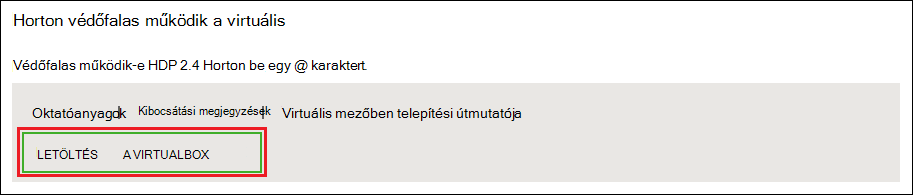
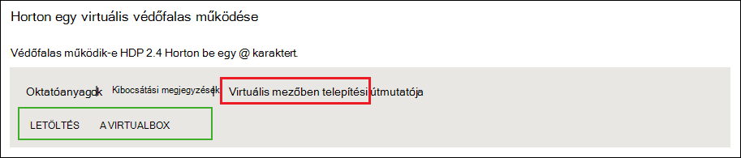
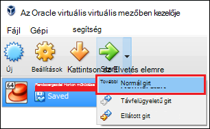

<properties
    pageTitle="A Hadoop védőfalas segítségével megismerheti a Hadoop |} Microsoft Azure"
    description="Tanulási Hadoop ökológiai használatáról kezdéséhez állíthat be egy Hadoop védőfalas Hortonworks az Azure virtuális-gépen. "
    keywords="hadoop irányító, hadoop védőfalas"
    editor="cgronlun"
    manager="jhubbard"
    services="hdinsight"
    authors="nitinme"
    documentationCenter=""
    tags="azure-portal"/>

<tags
    ms.service="hdinsight"
    ms.workload="big-data"
    ms.tgt_pltfrm="na"
    ms.devlang="na"
    ms.topic="article"
    ms.date="08/24/2016"
    ms.author="nitinme"/>

# A Hadoop ökológiai egy Hadoop védőfalas virtuális gépen az első lépések

Megtudhatja, hogy miként Hortonworks a Hadoop védőfalas telepítése egy virtuális gép, ha többet szeretne tudni a Hadoop ökológiai. A védőfalas tartalmaz egy helyi fejlesztői környezet, ha többet szeretne tudni a feladat elküldése, Hadoop és Hadoop elosztott fájl rendszer (hdfs) lehetőségre.

## Előfeltételek

* [Az Oracle VirtualBox](https://www.virtualbox.org/)

Ha ismeri a Hadoop, akkor használatba vehetik Hadoop a Azure: hozzon létre egy HDInsight fürthöz. További információt a kezdőlépéseket kell megtennie olvassa el a [Hadoop a HDInsight – első lépések](hdinsight-hadoop-linux-tutorial-get-started.md)című témakört.

## Töltse le és telepítse a virtuális gépen

1. A [http://hortonworks.com/downloads/#sandbox](http://hortonworks.com/downloads/#sandbox), __Letöltése VIRTUALBOX__ elemének kijelölése a Hortonworks védőfalas HDP 2.4 az A rendszer kéri Hortonworks regisztrálhatja a letöltés megkezdése előtt.

    

2. Ugyanazon a weblapon kattintson a __VirtualBox telepítése útmutató__ a HDP 2.4 Hortonworks védőfalas a. A virtuális gép telepítési utasításokat tartalmazó PDF letöltése.

    

## Indítsa el a virtuális gépen

1. VirtualBox, jelölje be a Hortonworks védőfalas, jelölje be __és majd __Normál megkezdése____.

    

2. Amikor a virtuális gép betöltési folyamat befejeződik, azt a képernyőn megjelenő utasításokat a jelenik meg. Nyisson meg egy webböngészőt, és nyissa meg azt az URL-cím jelenik meg (általában http://127.0.0.1:8888).

## Jelszó beállítása

1. Válassza az __első lépések__ lépése a Hortonworks védőfalas lap, a __Speciális nézetbeállítások__. Ezen az oldalon történő bejelentkezéshez a védőfalas SSH segítségével adatokat használja. Használja a megadott felhasználónévvel és jelszóval.

    > [AZURE.NOTE] Ha nincs telepítve van egy SSH-ügyfél, használhatja a nyújtotta a virtuális gép a webes SSH __http://localhost:4200 /__.

    Az első alkalommal csatlakozhat SSH, a rendszer kéri, a legfelső szintű fiók jelszavának módosítása. Írja be az új jelszót, ha a jövőben használatával SSH bejelentkezés használt.

2. Miután bejelentkezett, írja be a következő parancsot:

        ambari-admin-password-reset
    
    Amikor a rendszer kéri, a jelszó szükséges a Ambari rendszergazdai fiókjával. Ez a Ambari webes felület elérésekor lesz.

## A struktúra paranccsal

1. A védőfalas SSH-alapú alkalmazás a következő parancsot a struktúra rendszerhéj indítsa el:

        hive

2. Miután elindult a rendszerhéj, használja az alábbi a táblázatok a védőfalas által biztosított megjelenítése:

        show tables;

3. A következő segítségével a 10 sorok a `sample_07` tábla:

        select * from sample_07 limit 10;

## Következő lépések

* [Megtudhatja, hogy miként Visual Studio használata a Hortonworks védőfalas](hdinsight-hadoop-emulator-visual-studio.md)
* [A köteleknek, a Hortonworks védőfalas tanulási](http://hortonworks.com/hadoop-tutorial/learning-the-ropes-of-the-hortonworks-sandbox/)
* [Hadoop oktatóanyag – első lépések – HDP](http://hortonworks.com/hadoop-tutorial/hello-world-an-introduction-to-hadoop-hcatalog-hive-and-pig/)