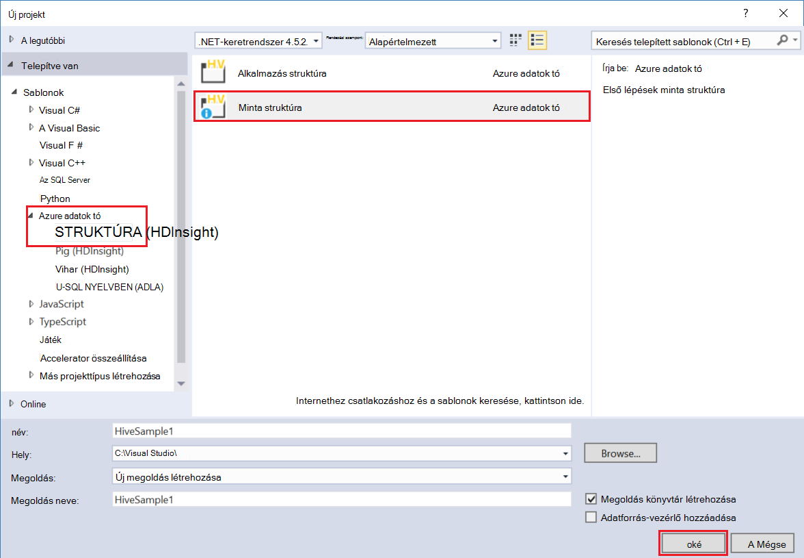

<properties
pageTitle="A Microsoft Azure adatok tó eszközeivel for Visual Studio és a Hortonworks védőfalas |} Microsoft Azure"
description="Megtudhatja, hogy miként az Azure tó Adateszközök for VIsual Studio használata a Hortonworks védőfalas (egy helyi virtuális futtató.) Ezeket az eszközöket létrehozhat és struktúra és malac feladat futtatható a védőfalas és nézet feladat kimeneti és előzmények."
services="hdinsight"
documentationCenter=""
authors="Blackmist"
manager="paulettm"
editor="cgronlun"/>

<tags
ms.service="hdinsight"
ms.devlang="na"
ms.topic="article"
ms.tgt_pltfrm="na"
ms.workload="big-data"
ms.date="08/26/2016"
ms.author="larryfr"/>

# Visual Studio környezetben az Hortonworks védőfalas az Azure tó Adateszközök használata

A Azure adatok tó tools for Visual Studio általános Hadoop fürt, eszközök az Azure adatok tó és HDInsight használata mellett a eszközöket tartalmaz. A dokumentum tartalmaz egy helyi virtuális gépen futó a Hortonworks védőfalas az Azure adatok tó eszközök használatához szükséges lépéseket.

A Hortonworks védőfalas használatával lehetővé teszi a használata Hadoop helyileg a fejlesztői környezet. Miután alakultak megoldást, és üzembe a méretezés szeretne, majd áthelyezheti egy HDInsight fürthöz.

## Előfeltételek

* A virtuális gépen futó a fejlesztői környezet Hortonworks védőfalas. A dokumentum írt, az Oracle VirtualBox, amely konfigurálásáról a [Hadoop ökológiai az első lépések](hdinsight-hadoop-emulator-get-started.md) dokumentumban lévő információk alapján futó védőfalas vizsgálni volt.

* Visual Studio 2013 vagy a Skype 2015 bármely edition.

* [A .NET rendszerhez Azure SDK](https://azure.microsoft.com/downloads/) 2.7.1 vagy újabb

* [Azure adatok tó Tools for Visual Studio](https://www.microsoft.com/download/details.aspx?id=49504)

## A védőfalas jelszavának konfigurálása

Győződjön meg arról, hogy fut-e a Hortonworks védőfalas, majd kövesse a [Hadoop ökológiai az első lépések](hdinsight-hadoop-emulator-get-started.md#set-passwords) a jelszó beállítása a SSH `root` fiók és a Ambari `admin` fiókot. A Visual Studio a védőfalas való csatlakozáskor, ezek a jelszavak lesz.

## Az eszközök csatlakoztatása a védőfalas

1. Nyissa meg a Visual Studio, és válassza a __Nézet__, majd a __Kiszolgáló Explorer__.

2. A __Kiszolgáló Intézőben__kattintson a jobb gombbal a __HDInsight__ -bejegyzést, és válassza a __Csatlakozás HDInsight irányító__.

    

3. A __Csatlakozás HDInsight irányító__ párbeszédpanel adja meg a jelszót, Ambari konfigurált.

    

    Válassza a __Tovább gombra__ a folytatáshoz.

4. Használja a __jelszó__ mezőbe írja be a jelszót, hogy be van állítva a `root` fiókot. Kilépés a többi mezőt az alapértelmezett értéket.

    

    Válassza a __Tovább gombra__ a folytatáshoz.

5. Várja meg a szolgáltatások befejezéséhez érvényességi. Egyes esetekben az érvényességi sikertelen, és kérdezze meg a beállítások frissítése. Amikor ez történik, kattintson a __frissítés__ gombra, és várja meg a konfigurációs és ellenőrzés elvégzéséhez a szolgáltatás.

    

    > [AZURE.NOTE] A frissítési folyamat Ambari segítségével módosíthatja, hogy mi várható az Azure adatok tó eszközökkel for Visual Studio Hortonworks védőfalas konfigurációját.

    Adatérvényesítési befejeződése után válassza a __Befejezés__ konfigurálás befejezéséhez.

    

    > [AZURE.NOTE] Attól függően, hogy a fejlesztői környezet és a virtuális gép rendelt memória sebességének beállítása, és ellenőrizze a szolgáltatások néhány percig is tarthat.

Leírt lépések végrehajtását követően ezeket a lépéseket, ekkor egy "HDInsight helyi fürthöz" bejegyzést a kiszolgáló Intézőben HDInsight csoportjában.

## Írja be a struktúra lekérdezés

Struktúra biztosít, hogy egy SQL-szerű lekérdezési nyelv (HiveQL,) használata a strukturált adatok. Megtudhatja, hogy miként szemben a helyi fürtre alkalmi lekérdezések futtatásához kövesse az alábbi lépéseket.

1. A __Kiszolgáló Explorer__kattintson a jobb gombbal a korábban már felvett helyi fürt belépéskor, és válassza a __struktúra lekérdezés írás__gombra.

    

    Ekkor megnyílik egy új lekérdezés ablak, amely lehetővé teszi, hogy gyorsan írja be, és küldje el a helyi fürthöz a lekérdezést.

2. Az új lekérdezés ablakban adja meg az alábbiakat:

        select count(*) from sample_08;
    
    A lekérdezés ablak tetején győződjön meg arról, hogy a konfigurációs esetében a helyi fürtre ki van jelölve, és válassza a __Küldés gombra__. Hagyja meg az alapértelmezett értékeket a többi érték (__köteget__ , és a kiszolgáló neve).

    

    Figyelje meg, hogy is használhatja az elem melletti legördülő listára __Küldés__ válassza a __Speciális__. Ekkor megnyílik egy párbeszédpanel, amelyen a feladat elküldése további lehetőségeket biztosít.

    

3. Miután a lekérdezés elküldése, a feladat állapota jelenik meg. Ez információt nyújt a feladatot, akkor Hadoop dolgozza fel. A __Feladat állapota__ bejegyzés biztosít a feladat aktuális állapotát. Az állapot rendszeresen frissül, vagy a frissítés ikon használatával kézi frissítés állapotát.

    

    A __Feladat állapota__ __Befejezett__állapotra változik, amikor egy irányított aciklikus Graph (DAG) jelenik meg. Ez a témakör a végrehajtás elérési határozták meg Tez (az alapértelmezett végrehajtás motor-struktúra a helyi fürt.) 
    
    > [AZURE.NOTE] Tez is az alapértelmezett érték Linux-alapú HDInsight fürt használata esetén. Még nem az alapértelmezett a Windows-alapú HDInsight; használatához nincs, fel kell vennie a sor `set hive.execution.engine = tez;` a struktúra lekérdezés elejére. 

    Használja a __Feladat kimeneti__ hivatkozásra a kimenet megtekintéséhez. Ebben az esetben célszerű __823__; a sample_08 táblában lévő sorok számát. Diagnosztikai információ a feladat megtekintheti a __Feladat naplókban__ és a __Letöltési fonal Log__ hivatkozások használatával.

4. Struktúra feladatok interaktív futtatását a __Köteg__ mező __interaktív__módosításával, és válassza a __végrehajtás__is. 

    

    Ez a adatfolyamként továbbítja a kimeneti napló a __HiveServer2 kimeneti__ ablakban feldolgozás során létre.
    
    > [AZURE.NOTE] Ez a rendelkezésre álló __Feladat napló__ hivatkozást a feladat befejezése után ugyanezeket az adatokat.

    

## Struktúra projekt létrehozása

Is létrehozhat, amely tartalmazza a több struktúra parancsfájlok projekt. Ez akkor hasznos, ha egymáshoz kapcsolódó kell maradjon, vagy olyan verziójú automatikai rendszerek használatával karbantartása parancsprogramok.

1. A Visual Studióban jelölje ki a __fájlt__, az __Új__, majd a then__Project__.

2. A projektek listában bontsa ki a __sablonok__és az __Azure adatok tó__ , és válassza a __struktúra (HDInsight)__. A sablonok listából válassza ki a __Minta struktúra__. Írja be a nevét és helyét, majd kattintson __az OK gombra__.

    

A __Minta struktúra__ projektben két parancsfájl, __WebLogAnalysis.hql__ és __SensorDataAnalysis.hql__. Ezek a használata ugyanabban a __Küldés__ gomb az ablak tetején beküldheti.

## Malac projekt létrehozása

Struktúra nyújt, hogy a hasonló SQL nyelv használata a strukturált adatok, miközben a malac nyelvet (malac latin betűs), amely lehetővé teszi az adatok alkalmazott átalakítások egy folyamat hozzanak biztosít. A helyi fürtre malac használatához kövesse az alábbi lépéseket.

1. Nyissa meg a Visual Studióban, és válassza a __fájl__, __Új__, majd __a Project__. A projektek listában bontsa ki a __sablonok__és az __Azure adatok tó__, és válassza a __malac (HDInsight)__. A sablonok listából válassza ki a __Malac alkalmazást__. Írjon be egy nevet, a helyet, és kattintson __az OK__gombra.

    

2. Írja be a következő az ehhez a projekthez létrehozott __script.pig__ fájl tartalmát.

        a = LOAD '/demo/data/Website/Website-Logs' AS (
            log_id:int, 
            ip_address:chararray, 
            date:chararray, 
            time:chararray, 
            landing_page:chararray, 
            source:chararray);
        b = FILTER a BY (log_id > 100);
        c = GROUP b BY ip_address;
        DUMP c;

    Malac más nyelven használ, mint a struktúra, a feladatok futásának is egységes között mindkét nyelvek között a __Küldés__ gombra. Malac egy speciális küldési párbeszédpanelen jelölje ki a legördülő lefelé __Küldés__ mellett jeleníti meg.

    
    
3. A feladat állapotát és a kimeneti egyben struktúra lekérdezés ugyanúgy jelennek meg.

    

## Feladatok megtekintése

Azure tó Adateszközök is lehetővé teszi, hogy könnyen kapcsolatos információk megtekintése feladatok, amelyeket a Hadoop futtatta. A feladatok, amelyeket a helyi fürt futtatta megtekintéséhez kövesse az alábbi lépéseket.

1. A __Kiszolgáló Explorer__a helyi fürtre kattintson a jobb gombbal, és válassza a __Feladatok megtekintése__. Ez megjeleníti a benyújtott feladatok listáját a fürthöz.

    

2. A feladatok listában jelölje ki a projekt részletes adatainak megjelenítéséhez.

    

    A megjelenített adatok struktúrát vagy malac lekérdezés, a kimeneti megtekintése és információk naplózása mutató hivatkozásokat tartalmazó futtatása után megjelenő hasonlít.

3. Módosíthatja, és küldje el újra a további lehetőségek a feladatot.

## Struktúra adatbázisok megtekintése

1. A __Kiszolgáló Explorer__bontsa ki a __helyi fürtre HDInsight__ -bejegyzést, és bontsa ki a __Struktúra adatbázisok__. Ez az __alapértelmezett__ és __xademo__ adatbázisok a helyi fürt az mutatni fogja azokat. Az adatbázis tábláiból adatbázis kibontása megjelennek.

    

2. Egy táblázat kibontása jeleníti meg, hogy a táblázat oszlopainak. Kattintson a jobb gombbal a táblázat, és válassza a __Nézet legfelső 100 sor__ tekintheti meg gyorsan az adatokat.

    

### Adatbázis és tábla tulajdonságai

Láthatta, hogy egy adatbázis vagy a táblázat __tulajdonságainak__ megtekintése kijelölhet. Ez lesz részletek megjelenítése a kijelölt elem a Tulajdonságok ablak.

### Táblázat létrehozása

Hozzon létre egy új táblát, kattintson a jobb gombbal egy adatbázist, és válassza a __Create Table__.

Kattintson a tábla, űrlap használatával hozhat létre. Ez a lap alján a táblázat létrehozásához használt a nyers HiveQL tekintheti meg.

## Következő lépések

* [A köteleknek, a Hortonworks védőfalas tanulási](http://hortonworks.com/hadoop-tutorial/learning-the-ropes-of-the-hortonworks-sandbox/)
* [Hadoop oktatóanyag – első lépések – HDP](http://hortonworks.com/hadoop-tutorial/hello-world-an-introduction-to-hadoop-hcatalog-hive-and-pig/)