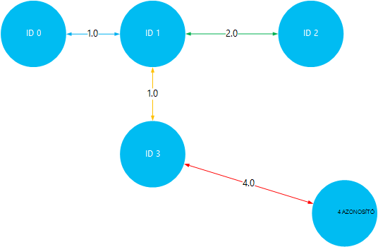

<properties
    pageTitle="Telepítése és használata Giraph Linux-alapú HDInsight (Hadoop) |} Microsoft Azure"
    description="Megtudhatja, hogy miként Giraph telepítése Linux-alapú HDInsight fürt parancsfájl-műveletek használatával. Parancsfájl-műveletek testre szabhatja a fürt létrehozása során fürt konfigurálása és a szolgáltatások és segédeszközök teszi lehetővé."
    services="hdinsight"
    documentationCenter=""
    authors="Blackmist"
    manager="jhubbard"
    editor="cgronlun"
    tags="azure-portal"/>

<tags
    ms.service="hdinsight"
    ms.workload="big-data"
    ms.tgt_pltfrm="na"
    ms.devlang="na"
    ms.topic="article"
    ms.date="10/17/2016"
    ms.author="larryfr"/>

# Giraph telepítése HDInsight Hadoop fürt és Giraph használatával nagyméretű diagramok feldolgozása

Bármilyen típusú Azure hdinsight szolgáltatáshoz a Hadoop-fürt Giraph telepíthető műveletével **Parancsfájl** fürt testreszabásához.

Ez a témakör megtanulhatja, hogyan telepítheti az Giraph parancsfájl műveletével. Miután telepítette a Giraph, fog is megtudhatja, hogy miként használjon Giraph leggyakoribb alkalmazások, amely a nagyméretű diagramok feldolgozása.

> [AZURE.NOTE] Az információk ebben a cikkben az Linux-alapú HDInsight fürt. Windows-alapú fürt használata a további tudnivalókért lásd [Giraph telepítése a HDInsight Hadoop fürt (Windows)](hdinsight-hadoop-giraph-install.md)

## Mi az Giraph?

[Apache Giraph](http://giraph.apache.org/) lehetővé teszi, hogy Hadoop használatával feldolgozása graph végezheti el, és Azure hdinsight szolgáltatáshoz kínál. Grafikonok modell objektumok, például egy nagy hálózaton, például az Internet útválasztó vagy közösségi csevegőhálózatok (néven is ismert közösségi grafikonhoz) közötti kapcsolatok közötti kapcsolatok közötti kapcsolatokat. Diagram feldolgozás lehetővé teszi, hogy a a kapcsolatok, a grafikus objektumok közötti oka például:

- Az aktuális kapcsolatok alapján azonosító potenciális ismerőseinek.
- A hálózatban két számítógépek közötti legrövidebb útvonal azonosító.
- Weblapok lap rangját kiszámításakor.

> [AZURE.WARNING] A HDInsight fürt összetevői teljesen támogatott, és Microsoft Support segítséget nyújt azonosíthatók, és az alábbi összetevőket kapcsolatos problémák megoldásához.
>
> Egyéni összetevők, például Giraph, akár kereskedelmi célra is lehetővé teszi ügyfélszolgálatunkat, hogy további elhárításában kap. Ez a probléma megoldása vagy kéri, hogy a hol található az adott technológia mély szakértelmét Megnyitás technológiák elérhető csatornák folytasson vezethet. Például vannak sok közösségi webhelyek használható, például: [HDInsight-fórum az MSDN webhelyen](https://social.msdn.microsoft.com/Forums/azure/en-US/home?forum=hdinsight), [http://stackoverflow.com](http://stackoverflow.com). Apache projekteket is projektwebhelyek a [http://apache.org](http://apache.org), például: [Hadoop](http://hadoop.apache.org/).

##Mit jelent a parancsprogram

A parancsfájl hajtja végre a következő műveleteket:

* A Giraph telepítések`/usr/hdp/current/giraph`
* Másolatot a `giraph-examples.jar` a fürt alapértelmezett tárolóhoz (WASB) fájl:`/example/jars/giraph-examples.jar`

## Telepítse a Giraph parancsfájl-műveletek használata

Giraph telepítése egy HDInsight fürthöz mintaparancsfájl érhető el a következő helyen.

    https://hdiconfigactions.blob.core.windows.net/linuxgiraphconfigactionv01/giraph-installer-v01.sh

Ez a szakasz útmutatás a mintaparancsfájl használata közben a fürt létrehozása az Azure portál használatával. 

> [AZURE.NOTE] Azure PowerShell, az Azure CLI, a HDInsight .NET SDK vagy Azure erőforrás-kezelő sablonokat is használható parancsfájl műveletet. Parancsfájl-műveletek már fut fürt is alkalmazhat. További tudnivalókért lásd: a [parancsprogram-műveleteinek testreszabása HDInsight fürt](hdinsight-hadoop-customize-cluster-linux.md).

1. Start fürt létrehozása az lépésekkel [létrehozása Linux-alapú HDInsight](hdinsight-hadoop-create-linux-clusters-portal.md)fürt, de ne hajtsa végre a létrehozási.

2. Kattintson a **Választható beállítási** lap jelölje be a **Parancsfájl-műveletek**, és az alábbi adatokat:

    * __Név__: Adjon meg egy rövid nevet, a parancsprogram művelet.
    * __Parancsfájl URI__: https://hdiconfigactions.blob.core.windows.net/linuxgiraphconfigactionv01/giraph-installer-v01.sh
    * __Címsor__: ezt a jelölőnégyzetet
    * __Dolgozó__: hagyja üresen ezt a bejelölve
    * __ZOOKEEPER__: hagyja üresen ezt a bejelölve
    * __Paraméterek__: hagyja üresen a mezőt

3. A képernyő alján a **Parancsfájl-műveletek**használja a **Kijelölés** gombot a konfiguráció mentéséhez. Végezetül használhatja a **Kijelölés** gombot a **Választható beállítási** a lap alján a választható konfigurációs adatok mentéséhez.

4. Továbbra is a fürt létrehozása [létrehozása Linux-alapú HDInsight fürt](hdinsight-hadoop-create-linux-clusters-portal.md)leírt módon.

## Hogyan használhatom Giraph a HDInsight?

Amikor a fürt befejeződik, létrehozása, kövesse az alábbi lépéseket a Giraph részét képező SimpleShortestPathsComputation példa futtatásához. Ez végrehajtja a <a href = "http://people.apache.org/~edwardyoon/documents/pregel.pdf">Pregel</a> megvalósítási legrövidebb elérési között a grafikus objektumok kereséséhez.

1. A HDInsight fürt SSH használatával csatlakozhat:

        ssh USERNAME@CLUSTERNAME-ssh.azurehdinsight.net

    A HDInsight SSH használja a további tudnivalókért lásd: az alábbi:

    * [A HDInsight Linux, Unix vagy OS X Linux-alapú Hadoop SSH használata](hdinsight-hadoop-linux-use-ssh-unix.md)

    * [A Windows HDInsight Linux-alapú Hadoop SSH használata](hdinsight-hadoop-linux-use-ssh-windows.md)

1. A következő segítségével __tiny_graph.txt__nevű új fájl létrehozása:

        nano tiny_graph.txt

    Ez a fájl tartalmát a következő használható:

        [0,0,[[1,1],[3,3]]]
        [1,0,[[0,1],[2,2],[3,1]]]
        [2,0,[[1,2],[4,4]]]
        [3,0,[[0,3],[1,1],[4,4]]]
        [4,0,[[3,4],[2,4]]]

    Ezeket az adatokat az irányított diagramját, a formátummal objektumok közötti kapcsolat ismerteti [forrás\_azonosítója, a forrás\_érték, [[cél\_azonosító], [él\_érték];...]]. Minden sor közötti kapcsolatot jelöl egy **forrás\_azonosító** objektum és egy vagy több **cél\_azonosító** objektumok. A **él\_érték** (vagy súly) tekinthető a erőssége vagy a kapcsolat **source_id** közötti távolság és **cél\_azonosító**.

    Rajzolt, és az objektumok közötti távolságot a érték (vagy a vastagság) használ, a fenti adatok előfordulhat, hogy néz ki:

    

2. Szeretné menteni a fájlt, használja a __Ctrl + X billentyűkombinációt__, majd a __Y__, végül __Enter__ fogadja el a fájl nevét.

3. A következő segítségével tárolja az adatokat a HDInsight fürt elsődleges tárolóba:

        hdfs dfs -put tiny_graph.txt /example/data/tiny_graph.txt

4. Futtassa a SimpleShortestPathsComputation példa a következő parancsot.

         yarn jar /usr/hdp/current/giraph/giraph-examples.jar org.apache.giraph.GiraphRunner org.apache.giraph.examples.SimpleShortestPathsComputation -ca mapred.job.tracker=headnodehost:9010 -vif org.apache.giraph.io.formats.JsonLongDoubleFloatDoubleVertexInputFormat -vip /example/data/tiny_graph.txt -vof org.apache.giraph.io.formats.IdWithValueTextOutputFormat -op /example/output/shortestpaths -w 2

    Ezzel a paranccsal a paramétereket az alábbi táblázatban ismertetett.

  	| Paraméter | Rendeltetés |
  	| --------- | ------------ |
  	| `jar /usr/hdp/current/giraph/giraph-examples.jar` | A példákat tartalmazó üveg fájlt. |
  	| `org.apache.giraph.GiraphRunner` | Indítsa el a példákban használt osztály. |
  	| `org.apache.giraph.examples.SimpleShortestPathsCoputation` | A példa futtatott lesz. Ebben az esetben azt fogja számítja ki a legrövidebb elérési ID 1 és a diagramon, minden más azonosítók között. |
  	| `-ca mapred.job.tracker=headnodehost:9010` | A headnode a fürt. |
  	| `-vif org.apache.giraph.io.formats.JsonLongDoubleFloatDoubleVertexInputFromat` | A bemeneti formátumot, a bemeneti adatok használható. |
  	| `-vip /example/data/tiny_graph.txt` | A bemeneti adatok fájlt. |
  	| `-vof org.apache.giraph.io.formats.IdWithValueTextOutputFormat` | A kimeneti formátum. Ebben az esetben azonosító, és az az érték egyszerű szövegként. |
  	| `-op /example/output/shortestpaths` | A kimenet helyét. |
  	| `-w 2` | A használandó dolgozók száma. Ebben az esetben 2. |

    További információt a fenti és további paramétereket Giraph minták használni a [Giraph quickstart útmutató](http://giraph.apache.org/quick_start.html)megtekintése

5. Amikor a feladat befejeződik, az eredmény a kíván tárolni a __wasbs: / / / Példa/kimenő/shotestpaths__ címtár. A létrehozott fájlok karakterekkel kezdődik __rész-m -__ és a Befejezés az első, második, stb fájl megjelölve szám. A következő segítségével a kimenet megtekintése:

        hdfs dfs -text /example/output/shortestpaths/*

    A kimenet jelenjen meg az alábbihoz hasonló:

        0   1.0
        4   5.0
        2   2.0
        1   0.0
        3   1.0

    A példa nehéz induljon kódolt SimpleShortestPathComputation azonosító 1 objektum, és keresse meg a más objektumok legrövidebb elérési útvonalát. A kimenet kell értelmezni, `destination_id distance`, ahol a távolságot a szegélyek objektum ID 1 és a célalkalmazás azonosítója. közötti távolság érték (vagy súly)

    A megjelenítése, ellenőrizheti az eredmények legrövidebb elérési út közben a ID 1 és minden más objektumok között. Ne feledje, hogy ID 1 és 4 azonosító közötti legrövidebb útvonal 5. Ez a teljes és közötti távolságot azonosító 1 és 3, majd azonosító 3 és 4.

    

## Következő lépések

- [Telepítése és használata az fürtök szín a hdinsight szolgáltatásból lehetőségre](hdinsight-hadoop-hue-linux.md). Szín egy webhely felhasználói Felületét, amely egyszerűen hozhat létre, futtatni és mentés malac és a struktúra feladatok, és keresse meg az alapértelmezett tárhely a HDInsight fürt.

- [A HDInsight fürt telepítése R](hdinsight-hadoop-r-scripts-linux.md): használatára vonatkozó útmutatást fürt telepítése és használata R HDInsight Hadoop fürt testreszabás. R-Megnyitás Forrásnyelv és környezet statisztikai számítások. Több száz beépített statisztikai függvények és a saját programnyelv funkcionális és objektumorientált programozáshoz tulajdonságát kombináló biztosít. Teljes körű grafikus funkciókat is tartalmaz.

- [A HDInsight fürt telepítése Solr](hdinsight-hadoop-solr-install-linux.md). Fürt testreszabási segítségével HDInsight Hadoop fürt Solr telepítése. Solr tárolt adatok hatékony keresés műveletek hajthatók végre teszi lehetővé.
