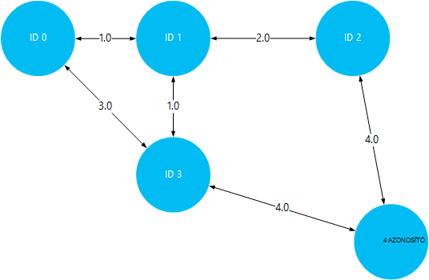
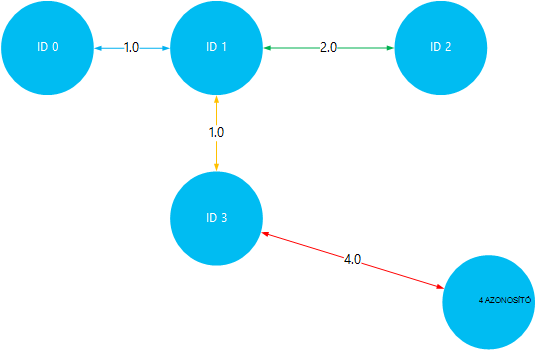

<properties
    pageTitle="Telepítése és használata a HDInsight Hadoop fürt Giraph |} Microsoft Azure"
    description="Ismerje meg Giraph HDInsight fürtre testreszabása és Giraph használatáról."
    services="hdinsight"
    documentationCenter=""
    authors="nitinme"
    manager="jhubbard"
    editor="cgronlun"
    tags="azure-portal"/>

<tags
    ms.service="hdinsight"
    ms.workload="big-data"
    ms.tgt_pltfrm="na"
    ms.devlang="na"
    ms.topic="article"
    ms.date="02/05/2016"
    ms.author="nitinme"/>

# Telepítésével és használatával Giraph a hdinsight szolgáltatáshoz

Megtudhatja, miként szabhatja testre a Windows-alapú HDInsight fürt Giraph parancsfájl művelettel együtt, és hogyan Giraph használatával nagyméretű diagramok feldolgozása. Linux-alapú fürt való Giraph használatáról további tudnivalókért lásd [Giraph telepítése a HDInsight Hadoop fürt (Linux)](hdinsight-hadoop-giraph-install-linux.md).
 
Azure hdinsight szolgáltatáshoz Giraph fürt (Hadoop, vihar, HBase, külső) bármilyen típusú telepíthető *Művelet parancsfájl*használatával. A csak olvasható Azure tároló blob [https://hdiconfigactions.blob.core.windows.net/giraphconfigactionv01/giraph-installer-v01.ps1](https://hdiconfigactions.blob.core.windows.net/giraphconfigactionv01/giraph-installer-v01.ps1)a Giraph telepítése egy HDInsight fürthöz mintaparancsfájl érhető el. A mintaparancsfájl csak 3.1-es HDInsight fürt működik. HDInsight fürt verzióján további tudnivalókért olvassa el a [HDInsight fürt verzióival](hdinsight-component-versioning.md)foglalkozó.

**Kapcsolódó cikkek**

- [Giraph telepítése HDInsight Hadoop fürt (Linux)](hdinsight-hadoop-giraph-install-linux.md)
- [A HDInsight létrehozása Hadoop fürt](hdinsight-provision-clusters.md): HDInsight fürt általános információkat.
- [Parancsfájl művelettel HDInsight fürt testreszabása][hdinsight-cluster-customize]: általános tudnivalók a parancsprogram művelettel HDInsight fürt testreszabása.
- [Parancsfájl művelet kidolgozása parancsfájlok hdinsight szolgáltatásból lehetőségre](hdinsight-hadoop-script-actions.md).

## Mi az Giraph?

<a href="http://giraph.apache.org/" target="_blank">Apache Giraph</a> lehetővé teszi, hogy Hadoop használatával feldolgozása graph végezheti el, és Azure hdinsight szolgáltatáshoz kínál. Grafikonok modell objektumok, például egy nagy hálózaton, például az Internet útválasztó vagy közösségi csevegőhálózatok (néven is ismert közösségi grafikonhoz) közötti kapcsolatok közötti kapcsolatok közötti kapcsolatokat. Diagram feldolgozás lehetővé teszi, hogy a a kapcsolatok, a grafikus objektumok közötti oka például:

- Az aktuális kapcsolatok alapján azonosító potenciális ismerőseinek.
- A hálózatban két számítógépek közötti legrövidebb útvonal azonosító.
- Weblapok lap rangját kiszámításakor.

## Telepítse a Giraph portál használatával

1. Indítsa el a fürt létrehozása **Egyéni létrehozása** beállítás használatával, [a HDInsight létrehozása Hadoop fürt](hdinsight-provision-clusters.md#portal)leírtak.
2. A varázsló **Parancsfájl-műveletek** lapon kattintson a **parancsprogram művelet hozzáadása** a parancsfájl műveletet részleteinek megadására, alább látható módon:

    ![Parancsfájl műveletek fürt testreszabása] (./media/hdinsight-hadoop-giraph-install/hdi-script-action-giraph.png "Parancsfájl műveletek fürt testreszabása")

    <table border='1'>
        <tr><th>A tulajdonság</th><th>Érték</th></tr>
        <tr><td>név</td>
            <td>Adja meg a parancsfájlt beavatkozásra. Ha például <b>Giraph telepítése</b>.</td></tr>
        <tr><td>Parancsfájl URI</td>
            <td>Adja meg a parancsfájlt, ha testre szeretné szabni a fürt hív meg egységes erőforrás azonosító (URI). Ha például <i>https://hdiconfigactions.blob.core.windows.net/giraphconfigactionv01/giraph-installer-v01.ps1</i></td></tr>
        <tr><td>Csomópont típusa</td>
            <td>Adja meg a csomópontok a testreszabási parancsfájl futtatható. Megadhatja, hogy <b>csomópontjait</b>, <b>csak a központi csomópontok</b>vagy <b>csak a dolgozó csomópontok</b>.
        <tr><td>Paraméterek</td>
            <td>Szükség szerint a parancsfájlt, adja meg a paraméterek. A parancsfájl Giraph telepítéséhez nincs szükség a paramétereket, így üresen is hagyhat ki.</td></tr>
    </table>

    A fürt több összetevők telepítése egynél több parancsfájl műveletet is hozzáadhat. Miután hozzáadta a parancsfájlok, kattintson a csoport létrehozásához a bejelölést.

## Giraph használata

A SimpleShortestPathsComputation példa keresztül mutatjuk a megkeresésére, a grafikus objektumok közötti legrövidebb elérési <a href = "http://people.apache.org/~edwardyoon/documents/pregel.pdf">Pregel</a> megvalósítási használjuk. Kövesse az alábbi lépéseket a mintaadatokat, és a minta üveg feltöltése, a feladat futtatása a SimpleShortestPathsComputation példa használatával, és tekintse meg az eredményeket.

1. Azure Blob-tárolóhoz minta adatok fájl feltöltése. A helyi számítógépen **tiny_graph.txt**nevű új fájl létrehozása. A következő parancsokat tartalmazhatja:

        [0,0,[[1,1],[3,3]]]
        [1,0,[[0,1],[2,2],[3,1]]]
        [2,0,[[1,2],[4,4]]]
        [3,0,[[0,3],[1,1],[4,4]]]
        [4,0,[[3,4],[2,4]]]

    Töltse fel a tiny_graph.txt fájlt a HDInsight fürt elsődleges tárolt adatait. Töltse fel az adatok, akkor olvassa el az [adatok HDInsight Hadoop feladatok feltöltése](hdinsight-upload-data.md)utasításokat.

    Ezeket az adatokat az irányított diagramját, a formátummal objektumok közötti kapcsolat ismerteti [forrás\_azonosítója, a forrás\_érték, [[cél\_azonosító], [él\_érték];...]]. Minden sor közötti kapcsolatot jelöl egy **forrás\_azonosító** objektum és egy vagy több **cél\_azonosító** objektumok. A **él\_érték** (vagy súly) tekinthető a erőssége vagy a kapcsolat **source_id** közötti távolság és **cél\_azonosító**.

    Rajzolt, és az objektumok közötti távolságot a érték (vagy a vastagság) használ, a fenti adatok előfordulhat, hogy néz ki:

    

4. Futtassa a SimpleShortestPathsComputation példát. A következő Azure PowerShell-parancsmagok használata a példa futtatásához bemeneteként tiny_graph.txt fájl segítségével. 

    [AZURE.INCLUDE [upgrade-powershell](../../includes/hdinsight-use-latest-powershell.md)]

        $clusterName = "clustername"
        # Giraph examples jar
        $jarFile = "wasbs:///example/jars/giraph-examples.jar"
        # Arguments for this job
        $jobArguments = "org.apache.giraph.examples.SimpleShortestPathsComputation",
                        "-ca", "mapred.job.tracker=headnodehost:9010",
                        "-vif", "org.apache.giraph.io.formats.JsonLongDoubleFloatDoubleVertexInputFormat",
                        "-vip", "wasbs:///example/data/tiny_graph.txt",
                        "-vof", "org.apache.giraph.io.formats.IdWithValueTextOutputFormat",
                        "-op",  "wasbs:///example/output/shortestpaths",
                        "-w", "2"
        # Create the definition
        $jobDefinition = New-AzureHDInsightMapReduceJobDefinition
          -JarFile $jarFile
          -ClassName "org.apache.giraph.GiraphRunner"
          -Arguments $jobArguments

        # Run the job, write output to the Azure PowerShell window
        $job = Start-AzureHDInsightJob -Cluster $clusterName -JobDefinition $jobDefinition
        Write-Host "Wait for the job to complete ..." -ForegroundColor Green
        Wait-AzureHDInsightJob -Job $job
        Write-Host "STDERR"
        Get-AzureHDInsightJobOutput -Cluster $clusterName -JobId $job.JobId -StandardError
        Write-Host "Display the standard output ..." -ForegroundColor Green
        Get-AzureHDInsightJobOutput -Cluster $clusterName -JobId $job.JobId -StandardOutput

    A fenti példában **clustername** cserélje a HDInsight fürt, amelyen telepítve Giraph nevét.

5. Az eredmények megtekintéséhez. Amikor a feladat befejeződik, az eredmények szeretne tárolni a két kimeneti fájl a __wasbs: / / / Példa/kimenő/shotestpaths__ mappában. A fájlok __rész-m-00001__ és __rész-m-00002__nevezik. A következő lépésekkel töltheti le, és a kimeneti megtekintése:

        $subscriptionName = "<SubscriptionName>"       # Azure subscription name
        $storageAccountName = "<StorageAccountName>"   # Azure Storage account name
        $containerName = "<ContainerName>"             # Blob storage container name

        # Select the current subscription
        Select-AzureSubscription $subscriptionName

        # Create the Storage account context object
        $storageAccountKey = Get-AzureStorageKey $storageAccountName | %{ $_.Primary }
        $storageContext = New-AzureStorageContext -StorageAccountName $storageAccountName -StorageAccountKey $storageAccountKey

        # Download the job output to the workstation
        Get-AzureStorageBlobContent -Container $containerName -Blob example/output/shortestpaths/part-m-00001 -Context $storageContext -Force
        Get-AzureStorageBlobContent -Container $containerName -Blob example/output/shortestpaths/part-m-00002 -Context $storageContext -Force

    Ezzel a __Példa/kimeneti/shortestpaths__ directory struktúrájának létrehozása az aktuális mappában a számítógépen, és a két kimeneti fájlokat letöltheti a kívánt helyre.

    Fájl tartalmának megjelenítése a __macskát__ parancsmag használatával:

        Cat example/output/shortestpaths/part*

    A kimenet jelenjen meg az alábbihoz hasonló:

        0   1.0
        4   5.0
        2   2.0
        1   0.0
        3   1.0

    A példa nehéz induljon kódolt SimpleShortestPathComputation azonosító 1 objektum, és keresse meg a más objektumok legrövidebb elérési útvonalát. A kimenet kell értelmezni, `destination_id distance`, ahol a távolságot a szegélyek objektum ID 1 és a célalkalmazás azonosítója. közötti távolság érték (vagy súly)

    A megjelenítése, ellenőrizheti az eredmények legrövidebb elérési út közben a ID 1 és minden más objektumok között. Ne feledje, hogy ID 1 és 4 azonosító közötti legrövidebb útvonal 5. Ez a teljes és közötti távolságot azonosító 1 és 3, majd azonosító 3 és 4.

    

## Telepítse a Giraph Aure PowerShell használatával

Lásd: [testreszabása HDInsight fürt parancsfájl művelettel](hdinsight-hadoop-customize-cluster.md#call_scripts_using_powershell).  A minta szemlélteti, hogyan telepítheti az Azure PowerShell használatával külső. Ha testre szeretné szabni a parancsfájlt [https://hdiconfigactions.blob.core.windows.net/giraphconfigactionv01/giraph-installer-v01.ps1](https://hdiconfigactions.blob.core.windows.net/giraphconfigactionv01/giraph-installer-v01.ps1)szüksége.

## .NET SDK használatával Giraph telepítése

Lásd: [testreszabása HDInsight fürt parancsfájl művelettel](hdinsight-hadoop-customize-cluster.md#call_scripts_using_azure_powershell). A minta szemlélteti, hogyan telepítheti a .NET SDK használatával külső. Ha testre szeretné szabni a parancsfájlt [https://hdiconfigactions.blob.core.windows.net/giraphconfigactionv01/giraph-installer-v01.ps1](https://hdiconfigactions.blob.core.windows.net/giraphconfigactionv01/giraph-installer-v01.ps1)szüksége.

## Lásd még:

- [Giraph telepítése HDInsight Hadoop fürt (Linux)](hdinsight-hadoop-giraph-install-linux.md)
- [A HDInsight létrehozása Hadoop fürt](hdinsight-provision-clusters.md): HDInsight fürt általános információkat.
- [Parancsfájl művelettel HDInsight fürt testreszabása][hdinsight-cluster-customize]: általános tudnivalók a parancsprogram művelettel HDInsight fürt testreszabása.
- [Parancsfájl művelet kidolgozása parancsfájlok hdinsight szolgáltatásból lehetőségre](hdinsight-hadoop-script-actions.md).
- [Telepítése és használata a külső HDInsight fürt][hdinsight-install-spark]: külső telepítéséről parancsfájl műveletet minta.
- [R telepítése HDInsight fürt][hdinsight-install-r]: j telepítéséről parancsfájl műveletet minta
- [A HDInsight fürt telepítése Solr](hdinsight-hadoop-solr-install.md): parancsfájl műveletet minta Solr telepítéséről.

[tools]: https://github.com/Blackmist/hdinsight-tools
[aps]: http://azure.microsoft.com/documentation/articles/install-configure-powershell/

[powershell-install]: ../powershell-install-configure.md
[hdinsight-provision]: hdinsight-provision-clusters.md
[hdinsight-install-r]: hdinsight-hadoop-r-scripts.md
[hdinsight-install-spark]: hdinsight-hadoop-spark-install.md
[hdinsight-cluster-customize]: hdinsight-hadoop-customize-cluster.md
