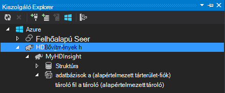

<properties
    pageTitle="C# struktúra és használhatja a Hadoop a HDInsight malac |} Microsoft Azure"
    description="Megtudhatja, hogy miként C# felhasználó által definiált függvényeket (UDF) használata a struktúra, és Azure hdinsight szolgáltatáshoz a folyamatos átvitelű malac."
    services="hdinsight"
    documentationCenter=""
    authors="Blackmist"
    manager="jhubbard"
    editor="cgronlun"
    tags="azure-portal"/>

<tags
    ms.service="hdinsight"
    ms.workload="big-data"
    ms.tgt_pltfrm="na"
    ms.devlang="dotnet"
    ms.topic="article"
    ms.date="10/28/2016"
    ms.author="larryfr"/>

#C# felhasználó által definiált függvények használata a struktúra, és a Hadoop HDInsight a folyamatos átvitelű malac

Struktúra és malac kiválóan alkalmasak adatkezelés az Azure hdinsight szolgáltatáshoz, de előfordul, hogy szüksége van egy további általános célú nyelvet. Struktúra, és a malac lehetővé teszi, hogy hívja fel a felhasználó által definiált függvények (UDF) vagy a folyamatos átvitelű keresztül külső kódot.

A dokumentumban megtudhatja, hogy miként használhat C# struktúra és malac.

##Előfeltételek

* Windows 7-es vagy újabb.

* A következő verziójú Visual Studio:

    * A [4-es frissítése](http://www.microsoft.com/download/details.aspx?id=39305) Visual Studio 2012 Professional/prémium/Ultimate

    * Visual Studio 2013 közösségi/Professional/prémium/Ultimate a [4-es frissítése](https://www.microsoft.com/download/details.aspx?id=44921)

    * Visual Studio 2015

* A HDInsight fürthöz - Hadoop lásd: [rendelkezést egy HDInsight fürthöz](hdinsight-provision-clusters.md) lépéseket fürt létrehozása

* Hadoop Tools for Visual Studio. Az [első lépések](hdinsight-hadoop-visual-studio-tools-get-started.md) című HDInsight Hadoop Tools for Visual Studio segítségével való telepítéséről és konfigurálásáról az eszközök lépéseit.

##A HDInsight .NET

A .NET közös nyelvi futtatókörnyezet (CLR) és keretek alapértelmezés szerint a Windows-alapú HDInsight fürt telepítve van. Ez lehetővé teszi, hogy a C#-alkalmazások használata a struktúra, és a folyamatos átvitelű malac (adatok átadott struktúra/malac és C# alkalmazás közötti stdout/stdin keresztül).

> [AZURE.NOTE] Jelenleg nem támogatja a .NET-keretrendszer UDF futó Linux-alapú HDInsight fürt. 

##.NET- és a folyamatos átvitelű

A folyamatos átvitelű magában foglalja a struktúra, és malac adatok átadása külső az alkalmazás stdout fölé, és az eredmények fogadásának stdin fölé. C# alkalmazások, a rendszer legegyszerűbben elvégezni keresztül `Console.ReadLine()` és `Console.WriteLine()`.

Mivel a struktúra, és malac kell futásidőben az alkalmazás indítása, a C# projektekhez a **New** -sablon kell használni.

##& -Struktúra és C# 35;

###A C# projekt létrehozása

1. Nyissa meg a Visual Studióban, és hozzon létre egy új megoldás. A projekt típusa **Konzol alkalmazás**kijelölése, és nevezze el az új projekt **HiveCSharp**.

2. **Program.cs** tartalmának lecserélése a következőre:

        using System;
        using System.Security.Cryptography;
        using System.Text;
        using System.Threading.Tasks;

        namespace HiveCSharp
        {
            class Program
            {
                static void Main(string[] args)
                {
                    string line;
                    // Read stdin in a loop
                    while ((line = Console.ReadLine()) != null)
                    {
                        // Parse the string, trimming line feeds
                        // and splitting fields at tabs
                        line = line.TrimEnd('\n');
                        string[] field = line.Split('\t');
                        string phoneLabel = field[1] + ' ' + field[2];
                        // Emit new data to stdout, delimited by tabs
                        Console.WriteLine("{0}\t{1}\t{2}", field[0], phoneLabel, GetMD5Hash(phoneLabel));
                    }
                }
                /// 

                /// Returns an MD5 hash for the given string
                /// 

                /// <param name="input">string value</param>
                /// <returns>an MD5 hash</returns>
                static string GetMD5Hash(string input)
                {
                    // Step 1, calculate MD5 hash from input
                    MD5 md5 = System.Security.Cryptography.MD5.Create();
                    byte[] inputBytes = System.Text.Encoding.ASCII.GetBytes(input);
                    byte[] hash = md5.ComputeHash(inputBytes);

                    // Step 2, convert byte array to hex string
                    StringBuilder sb = new StringBuilder();
                    for (int i = 0; i < hash.Length; i++)
                    {
                        sb.Append(hash[i].ToString("x2"));
                    }
                    return sb.ToString();
                }
            }
        }

3. Hozza létre a projekt.

###Töltse fel a tárhely

1. A Visual Studióban nyissa meg a **Kiszolgáló Intézőt**.

3. Bontsa ki az **Azure**, és bontsa ki a **hdinsight szolgáltatásból lehetőségre**.

4. Ha a rendszer kéri, írja be az Azure előfizetés hitelesítő adatait, és kattintson a **Bejelentkezés**gombra.

5. Bontsa ki a használni kívánt alkalmazás telepítése HDInsight fürt, és bontsa ki a **Alapértelmezett tárterület-fiókkal**.

    

6. Kattintson duplán az **Alapértelmezett tároló** a fürt. Ekkor megnyílik egy új ablak, amely megjeleníti az alapértelmezett tároló tartalmát.

7. Kattintson a Feltöltés ikonra, és tallózással keresse meg a **HiveCSharp** projekt **bin\debug** mappába. Végül jelölje ki a **HiveCSharp.exe** fájlt, és kattintson az **OK gombra**.

    

8. Miután a feltöltés befejeződött, lesz struktúra lekérdezés alkalmazással.

###Lekérdezés struktúra

1. A Visual Studióban nyissa meg a **Kiszolgáló Intézőt**.

2. Bontsa ki az **Azure**, és bontsa ki a **hdinsight szolgáltatásból lehetőségre**.

5. Kattintson a jobb gombbal a fürt telepített **HiveCSharp** alkalmazását, és válassza a **struktúra lekérdezés írni**.

6. Használja a struktúra lekérdezést a következő:

        add file wasbs:///HiveCSharp.exe;

        SELECT TRANSFORM (clientid, devicemake, devicemodel)
        USING 'HiveCSharp.exe' AS
        (clientid string, phoneLabel string, phoneHash string)
        FROM hivesampletable
        ORDER BY clientid LIMIT 50;

    Ezzel kijelöli a `clientid`, `devicemake`, és `devicemodel` mezőket `hivesampletable`, és átadja a mezőket az HiveCSharp.exe alkalmazás. A lekérdezés vár való visszatéréshez három mezők, amelyeket tárolni, mint az alkalmazás `clientid`, `phoneLabel`, és `phoneHash`. A lekérdezés is várhatóan HiveCSharp.exe keresse meg a alapértelmezett tároló tároló legfelső szintű (`add file wasbs:///HiveCSharp.exe`).

5. Kattintson a **Küldés gombra** a feladatot a HDInsight fürthöz küldhetik. A **Projekt-összefoglaló struktúra** ablakban nyílik meg.

6. Az összefoglaló frissíteni, amíg át nem változik **A feladatállapot** **befejeződött**a **frissítés** gombra. A feladat kimenet megtekintéséhez kattintson a **Feladat kimeneti**.

##Malac és a C és a #35;

###A C# projekt létrehozása

1. Nyissa meg a Visual Studióban, és hozzon létre egy új megoldás. A projekt típusa **Konzol alkalmazás**kijelölése, és nevezze el az új projekt **PigUDF**.

2. Cserélje ki a **Program.cs** fájl tartalmát a következő:

        using System;

        namespace PigUDF
        {
            class Program
            {
                static void Main(string[] args)
                {
                    string line;
                    // Read stdin in a loop
                    while ((line = Console.ReadLine()) != null)
                    {
                        // Fix formatting on lines that begin with an exception
                        if(line.StartsWith("java.lang.Exception"))
                        {
                            // Trim the error info off the beginning and add a note to the end of the line
                            line = line.Remove(0, 21) + " - java.lang.Exception";
                        }
                        // Split the fields apart at tab characters
                        string[] field = line.Split('\t');
                        // Put fields back together for writing
                        Console.WriteLine(String.Join("\t",field));
                    }
                }
            }
        }

    Ez az alkalmazás fog elemezhető malac és kezdődő sorokat formázhatja küldünk a sorok `java.lang.Exception`.

3. Mentse a **Program.cs**, és ezután létrehozhatja a projektet.

###Az alkalmazás feltöltése

1. A folyamatos átvitelű malac vár, az alkalmazás a fürt fájlrendszerben helyi. A HDInsight fürt engedélyezése a távoli asztali, és csatlakoztassa azt a [Csatlakozás RDP segítségével HDInsight fürt](hdinsight-administer-use-management-portal.md#rdp)utasításait követve.

2. Miután létrejött, a **bin és hibakeresési** könyvtár a PigUDF projekt, a helyi számítógépre másolja **PigUDF.exe** , és illessze be a fürt **PIG_HOME %** mappájába.

###Malac Latin az alkalmazás használata

1. A távoli asztali munkamenetből indítsa el a Hadoop parancssorból a **Hadoop parancssor** ikonra az asztalon.

2. A következő használatával indítsa el a malac parancssort:

        cd %PIG_HOME%
        bin\pig

    A bemutatni egy `grunt>` kérdés.

3. Írja be az alábbi módon egy egyszerű malac feladat futtatása a .NET-keretrendszer alkalmazás segítségével:

        DEFINE streamer `pigudf.exe` SHIP('pigudf.exe');
        LOGS = LOAD 'wasbs:///example/data/sample.log' as (LINE:chararray);
        LOG = FILTER LOGS by LINE is not null;
        DETAILS = STREAM LOG through streamer as (col1, col2, col3, col4, col5);
        DUMP DETAILS;

    A `DEFINE` utasítás létrehozza az alias `streamer` pigudf.exe alkalmazások és `SHIP` elosztja ezt a fürt csomópontok. Később `streamer` való használatáról a `STREAM` operátor naplóban egyetlen sornál folyamat, és adja vissza az adatok oszlopok sorozata.

> [AZURE.NOTE] Az alkalmazás neve folyamatos átvitelű használt táblanevet kell a \` (backtick) karaktert, amikor aliassal, és ' (aposztróf) együtt használva `SHIP`.

3. Miután beírta az utolsó sorban, a feladat kezdetének. Végül ad vissza eredménye az alábbihoz hasonló:

        (2012-02-03 20:11:56 SampleClass5 [WARN] problem finding id 1358451042 - java.lang.Exception)
        (2012-02-03 20:11:56 SampleClass5 [DEBUG] detail for id 1976092771)
        (2012-02-03 20:11:56 SampleClass5 [TRACE] verbose detail for id 1317358561)
        (2012-02-03 20:11:56 SampleClass5 [TRACE] verbose detail for id 1737534798)
        (2012-02-03 20:11:56 SampleClass7 [DEBUG] detail for id 1475865947)

##Összefoglalás

A dokumentumban történő használatáról a .NET-keretrendszer alkalmazások struktúra és malac HDInsight rendelkezik megtanulta. Ha kívánt Python használata a struktúra és malac, olvassa el a [Python használja a struktúra, és a HDInsight malac](hdinsight-python.md).

Más módokon malac és a struktúra, és ismereteket szerezhet a MapReduce, a következő témakörben olvashat:

* [HDInsight struktúra használata](hdinsight-use-hive.md)

* [Malac használata hdinsight szolgáltatáshoz](hdinsight-use-pig.md)

* [HDInsight MapReduce használata](hdinsight-use-mapreduce.md)
