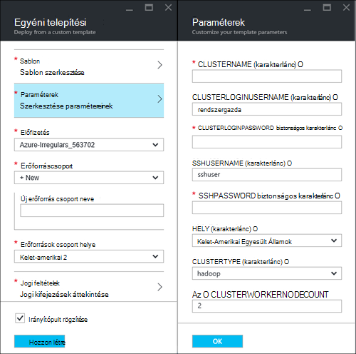
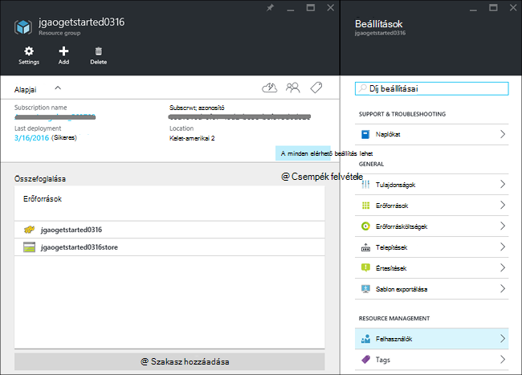
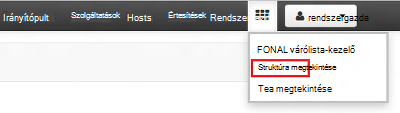

<properties
    pageTitle="Linux oktatóprogram: első lépések a Hadoop és struktúra |} Microsoft Azure"
    description="Kövesse a Linux oktatóanyag első lépésiről Hadoop a hdinsight szolgáltatásból lehetőségre. Megtudhatja, hogy miként Linux fürt kiépítése, majd a lekérdezés struktúra adataival."
    services="hdinsight"
    documentationCenter=""
    authors="mumian"
    manager="jhubbard"
    editor="cgronlun"
    tags="azure-portal"/>

<tags
    ms.service="hdinsight"
    ms.devlang="na"
    ms.topic="hero-article"
    ms.tgt_pltfrm="na"
    ms.workload="big-data"
    ms.date="09/14/2016"
    ms.author="jgao"/>

# Hadoop oktatóprogram: Linux-alapú Hadoop használata a HDInsight első lépések

> [AZURE.SELECTOR]
- [Linux-alapú](hdinsight-hadoop-linux-tutorial-get-started.md)
- [Windows-alapú](hdinsight-hadoop-tutorial-get-started-windows.md)

Útmutató: HDInsight Linux-alapú [Hadoop](http://hadoop.apache.org/) fürt létrehozása, és struktúra feladatok futhat hdinsight szolgáltatásból lehetőségre. A leggyakrabban használt összetevő Hadoop ökológiai [Apache struktúra](https://hive.apache.org/) . Jelenleg HDInsight megtalálható 4 másik fürthöz típusa: [Hadoop](hdinsight-hadoop-introduction.md), [külső](hdinsight-apache-spark-overview.md), [HBase](hdinsight-hbase-overview.md) és [vihar](hdinsight-storm-overview.md).  Minden egyes fürt típusú összetevők más-más szabálykészletet támogatja. 4 fürt diagramtípusokat támogatja a struktúra. Támogatott HDInsight-összetevők listájáért lásd: [a HDInsight által biztosított Hadoop fürt verzió újdonságai?](hdinsight-component-versioning.md)  

[AZURE.INCLUDE [delete-cluster-warning](../../includes/hdinsight-delete-cluster-warning.md)]

## Előfeltételek

Ebben az oktatóanyagban megkezdése előtt kell rendelkeznie:

- **Azure előfizetés**: hónap ingyenes próbaverzió fiók létrehozásához keresse meg a [azure.microsoft.com/free](https://azure.microsoft.com/free).

### Access-ellenőrzési követelmények

[AZURE.INCLUDE [access-control](../../includes/hdinsight-access-control-requirements.md)]

## Csoport létrehozása

Hadoop feladatok többsége köteg feladatokat. Hozzon létre egy fürt, bizonyos feladatok futtatása, és törölje a fürt. Ebben a részben létrehoz egy Linux-alapú Hadoop fürt sablonnal az [Erőforrás-kezelő Azure](../resource-group-template-deploy.md)hdinsight szolgáltatáshoz. Erőforrás-kezelő sablon teljesen testre szabható; egyszerűen létrehozása az Azure erőforrások, mint a hdinsight szolgáltatásból lehetőségre. Erőforrás-kezelő sablon élmény nincs szükség ebben az oktatóanyagban számított. Más fürt létrehozási módjai és ebben az oktatóanyagban használt tulajdonságok ismertetése című témakörben talál [fürt létrehozása hdinsight szolgáltatásból lehetőségre](hdinsight-hadoop-provision-linux-clusters.md). Az erőforrás-kezelő sablon ebben az oktatóanyagban használt nyilvános blob tároló, [https://hditutorialdata.blob.core.windows.net/armtemplates/create-linux-based-hadoop-cluster-in-hdinsight.json](https://hditutorialdata.blob.core.windows.net/armtemplates/create-linux-based-hadoop-cluster-in-hdinsight.json)található. 

1. Kattintson az alábbi képen az Azure bejelentkezés, és nyissa meg az erőforrás-kezelő sablon az Azure-portálon. 

    

2. A **Paraméterek** lap az adja meg az alábbiakat:

    .

    - **Fürtnév**: Adja meg a létrehozandó Hadoop fürt nevét.
    - **Fürt felhasználónév és jelszó**: az alapértelmezett bejelentkezési neve **felügyeleti**.
    - **SSH felhasználónév és jelszó**: az alapértelmezett felhasználónév **sshuser**.  Nevezze át. 
    
    További paramétereket nem kötelező, ebben az oktatóanyagban számított számára. Akkor hagyja őket, hogy azok. 
    
    Minden csoport egy Azure Blob-tároló fiók függőség tartalmaz. Az alapértelmezett tárterület-fiókként általában hivatkozik. HDInsight fürt és annak alapértelmezett tárterület-fiókot kell közös elhelyezni, ugyanabban a Azure régióban. Fürt törlésével nem törli a tárterület-fiókot. A sablont az alapértelmezett tároló fióknév definíciója a fürt neve "store" hozzáfűzi a. 
    
3. **Az OK gombra** a paraméterek mentése gombra.
4. Az **egyéni telepítési** lap az **Új erőforrásnevet csoportot** hozhat létre új erőforráscsoport megadása  Az erőforráscsoport, amely a fürt, a függő tárterület-fiók és más s csoportosítja tároló. Az erőforrás csoport helyét a fürt helyről eltérő lehet.
5. Kattintson a **jogi feltételek**gombra, és kattintson a **Létrehozás**gombra.
6. Ellenőrizze a **PIN-kód irányítópult** jelölőnégyzet be van jelölve, és kattintson a **Létrehozás**gombra. **A sablon üzembe helyezése telepítésének**című új csempe jelenik meg. Vesz igénybe kapcsolatos körülbelül 20 perc fürt létrehozásához. 
7.  Amikor a fürt létrejött, a felirat, a mozaik az erőforrás-csoport nevét, a megadott változik. És a portálon két pengéit automatikusan megnyitja a fürt és a fürt beállításait. 

    .

    Vannak két erőforrások szerepel a listában, a fürt és az alapértelmezett tárterület-fiókot.

##Struktúra lekérdezések futtatása

A leggyakrabban használt összetevő HDInsight használt [Apache struktúra](hdinsight-use-hive.md) . Számos módon struktúra feladatok futtatja a hdinsight szolgáltatásból lehetőségre. Ebben az oktatóanyagban használandó egyes struktúra feladatok futtatásához a Ambari struktúra megtekintése a portálon. Más módszerek a struktúra feladatok küldéséhez [A HDInsight struktúra használata](hdinsight-use-hive.md)című témakör tartalmaz.

1. Tallózással keresse meg **https://&lt;ClusterName >. azurehdinsight.net**, ahol &lt;ClusterName > a fürt Ambari megnyitásához az előző részben létrehozott.
2. Adja meg a Hadoop felhasználónév és az előző szakaszban megadott jelszót. Az alapértelmezett felhasználónév **felügyeleti**.
3. Nyissa meg **a struktúra megtekintése** , az alábbi képernyőképen látható módon:

    .
4. A __Lekérdezésszerkesztő__ csoport a lapon illessze be a következő HiveQL utasításokat a munkalapra:

        SHOW TABLES;

    >[AZURE.NOTE] Pontosvessző struktúra szüksége van.       
        
5. Kattintson a __végrehajtása__. __Lekérdezés folyamat eredményét__ szakasz kell a Lekérdezésszerkesztő alatt jelenik meg, és a feladattal kapcsolatos információkat jeleníthet meg. 

    Amikor a lekérdezés befejeződik, a __Lekérdezés folyamat eredményét__ szakaszban, a művelet eredménye megjelenik. Egy táblába **hivesampletable**gondoskodik. A mintatáblázat struktúra minden HDInsight fürt megtalálható.

    .

6. Ismételje meg a 4-es és 5 futtassa a következő lekérdezést lépést:

        SELECT * FROM hivesampletable;

    > [AZURE.TIP] Megjegyzés: a bal felső sarkában a __Lekérdezés folyamat eredményét__ szakasz; __eredmények mentése__ legördülő menü használhatja ezt az eredmények letöltése, vagy HDInsight tároló CSV-fájlként mentheti őket.

7. Kattintson az **Előzmények** a feladatok listájának gombra.

A struktúra feladat befejezése után [az eredmények Azure SQL-adatbázis vagy SQL Server-adatbázis](hdinsight-use-sqoop-mac-linux.md)exportálhatja, érdemes is [jelenítse meg az eredményeket, az Excel használatával](hdinsight-connect-excel-power-query.md). HDInsight struktúra használatával kapcsolatos további tudnivalókért lásd: [használata-struktúra és a HDInsight Apache log4j mintafájl elemzése a Hadoop HiveQL](hdinsight-use-hive.md).

##Az oktatóprogram karbantartása

Miután az oktatóanyagot, érdemes a fürt törléséhez. HDInsight az adatok Azure-tárolóban lévő tárolja, törölheti a fürtre biztonságosan, ha még nem használja. Is az előfizetést terhelő egy HDInsight fürthöz, akkor is, ha még nem használja. Mivel a fürt díjai sokszor több, mint a költségek tárolására, célszerű economic fürt törlése, ha nem használja. 

>[AZURE.NOTE] [Azure Data Factory](hdinsight-hadoop-create-linux-clusters-adf.md)használ, HDInsight fürt létrehozása igény, és a fürt automatikusan törli az élettartam beállítása. 

**A fürt és/vagy az alapértelmezett tároló fiók törlése**

1. Jelentkezzen be az [Azure-portálon](https://portal.azure.com).
2. A portál irányítópult kattintson a mozaik az erőforrás-csoport nevét, a csoport létrehozásakor használt.
3. Kattintson a **Törlés** parancsra az erőforrás lap törlése a erőforráscsoport, amely tartalmazza a fürt és az alapértelmezett tároló fiók; vagy kattintson a csoport nevére az **erőforrások** hivatkozásra, és ezután kattintson a **Törlés** parancsra a fürt lap. Megjegyzés törlése a erőforráscsoport fog törölje a tárterület-fiókot. Ha meg szeretné tartani a tárterület-fiókot, válassza a csak a fürt törléséhez.

## Következő lépések

Ebben az oktatóanyagban van megtanulta, hogyan hozhat létre az erőforrás-kezelő sablon használatával Linux-alapú HDInsight fürt, és hogyan egyszerű struktúra lekérdezésére.

Többet szeretne tudni a HDInsight adatok elemzése, olvassa el az alábbiakat:

- Többet szeretne tudni a HDInsight használja a struktúra, például hogy miként struktúra lekérdezésére a Visual Studióban, lásd: [A HDInsight struktúra használata][hdinsight-use-hive].

- Malac kapcsolatos további tudnivalókért adatokat, használt nyelvek [Használata malac HDInsight]lásd:[hdinsight-use-pig].

- Című témakör MapReduce, írja be, amelyek adatfeldolgozás Hadoop, a program lehetőséget ismerteti [A HDInsight használata MapReduce][hdinsight-use-mapreduce].

- Az adatok HDInsight elemzése a HDInsight Tools for Visual Studio használatával kapcsolatos további tudnivalókért olvassa el a [Visual Studio Hadoop-eszközök HDInsight az első lépések](hdinsight-hadoop-visual-studio-tools-get-started.md)című témakört.

Ha készen áll a további tudnivalók HDInsight hogyan tárolja az adatokat, vagy hogyan adatok beolvasása az HDInsight és megkezdheti a munkát a saját adatain, olvassa el a a következőket:

- Hogyan alkalmazza a HDInsight az Azure blob-tárolóhoz a további tudnivalókért lásd [Azure blobtárolóhoz használata a hdinsight szolgáltatásból lehetőségre](hdinsight-hadoop-use-blob-storage.md).

- Feltöltése az adatok hdinsight szolgáltatáshoz a további tudnivalókért lásd [Töltse fel az adatok HDInsight][hdinsight-upload-data].

Ha azt szeretné, ha többet szeretne tudni létrehozása és kezelése egy HDInsight fürthöz, az alábbi talál:

- A HDInsight Linux-alapú fürt kezelése című témakörben talál [kezelése HDInsight fürt Ambari használatával](hdinsight-hadoop-manage-ambari.md).

- További információ a lehetőségekről kijelölhet egy HDInsight fürthöz létrehozásakor, olvassa el a [HDInsight létrehozása egyéni beállításokkal Linux](hdinsight-hadoop-provision-linux-clusters.md)című témakört.

- Ha ismeri a Linux és Hadoop, de a HDInsight a Hadoop kapcsolatos adatai információra van szüksége, olvassa el a [HDInsight Linux használata](hdinsight-hadoop-linux-information.md)című témakört. Például ez tartalmaz tájékoztatást:

    * URL-címeit is a fürt, például Ambari és WebHCat szolgáltatások
    * Hol található a Hadoop-fájlt, és a helyi fájlrendszerben példák
    * Az alapértelmezett adatokat használatát az Azure tároló (WASB) Fájlrendszerhez helyett tárolása

[1]: ../HDInsight/hdinsight-hadoop-visual-studio-tools-get-started.md

[hdinsight-provision]: hdinsight-provision-clusters.md
[hdinsight-admin-powershell]: hdinsight-administer-use-powershell.md
[hdinsight-upload-data]: hdinsight-upload-data.md
[hdinsight-use-mapreduce]: hdinsight-use-mapreduce.md
[hdinsight-use-hive]: hdinsight-use-hive.md
[hdinsight-use-pig]: hdinsight-use-pig.md

[powershell-download]: http://go.microsoft.com/fwlink/p/?linkid=320376&clcid=0x409
[powershell-install-configure]: powershell-install-configure.md
[powershell-open]: powershell-install-configure.md#Install

[img-hdi-dashboard]: ./media/hdinsight-hadoop-tutorial-get-started-windows/HDI.dashboard.png
[img-hdi-dashboard-query-select]: ./media/hdinsight-hadoop-tutorial-get-started-windows/HDI.dashboard.query.select.png
[img-hdi-dashboard-query-select-result]: ./media/hdinsight-hadoop-tutorial-get-started-windows/HDI.dashboard.query.select.result.png
[img-hdi-dashboard-query-select-result-output]: ./media/hdinsight-hadoop-tutorial-get-started-windows/HDI.dashboard.query.select.result.output.png
[img-hdi-dashboard-query-browse-output]: ./media/hdinsight-hadoop-tutorial-get-started-windows/HDI.dashboard.query.browse.output.png
[image-hdi-clusterstatus]: ./media/hdinsight-hadoop-tutorial-get-started-windows/HDI.ClusterStatus.png
[image-hdi-gettingstarted-powerquery-importdata]: ./media/hdinsight-hadoop-tutorial-get-started-windows/HDI.GettingStarted.PowerQuery.ImportData.png
[image-hdi-gettingstarted-powerquery-importdata2]: ./media/hdinsight-hadoop-tutorial-get-started-windows/HDI.GettingStarted.PowerQuery.ImportData2.png
