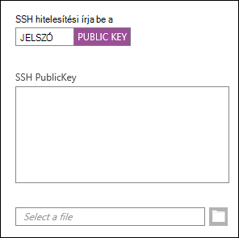
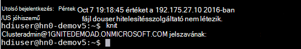
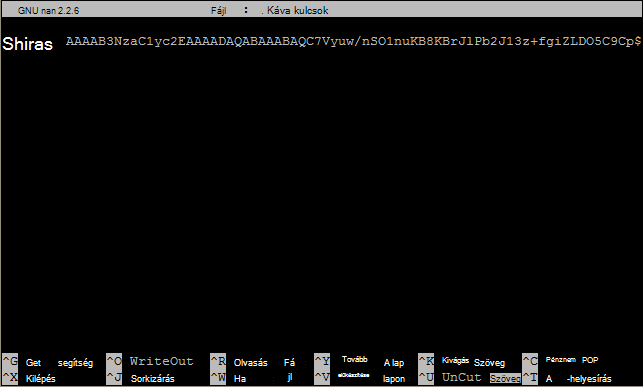

<properties
   pageTitle="SSH kulcsok használata Hadoop Linux-alapú, Linux, Unix vagy OS X |}] A Microsoft Azure"
   description=" Linux-alapú HDInsight a Secure Shell (SSH) használatával érheti el. Ez a dokumentum SSH segítségével HDInsight a Linux, Unix vagy OS X ügyfélről információt nyújt."
   services="hdinsight"
   documentationCenter=""
   authors="Blackmist"
   manager="jhubbard"
   editor="cgronlun"
    tags="azure-portal"/>

<tags
   ms.service="hdinsight"
   ms.devlang="na"
   ms.topic="get-started-article"
   ms.tgt_pltfrm="na"
   ms.workload="big-data"
   ms.date="09/13/2016"
   ms.author="larryfr"/>

#<a name="use-ssh-with-linux-based-hadoop-on-hdinsight-from-linux-unix-or-os-x"></a>A HDInsight a Linux, Unix vagy OS X, Linux-alapú Hadoop SSH használata

> [AZURE.SELECTOR]
- [A Windows](hdinsight-hadoop-linux-use-ssh-windows.md)
- [Linux, Unix, OS X](hdinsight-hadoop-linux-use-ssh-unix.md)

[Secure Shell (SSH)](https://en.wikipedia.org/wiki/Secure_Shell) segítségével távolról műveleteket végeznek a Linux-alapú HDInsight fürtök parancssorból futtathatják. Ez a dokumentum SSH segítségével HDInsight a Linux, Unix vagy OS X ügyfélről információt nyújt.

> [AZURE.NOTE] A cikkben leírt lépésekkel feltételezik, hogy a Linux, Unix vagy OS X ügyfelet használ. Ezeket a lépéseket is végrehajthatók a Windows-alapú ügyfél, ha telepítette a csomag, amely biztosítja `ssh` és `ssh-keygen`, például [a Windows Ubuntu Bash](https://msdn.microsoft.com/commandline/wsl/about).
>
> Ha nincs telepítve a Windows-alapú ügyfél SSH, leírtakat a [Használata SSH a Linux-alapú HDInsight (Hadoop) a Windows](hdinsight-hadoop-linux-use-ssh-windows.md) telepítéséről és használatáról a gitt olvashat.

##<a name="prerequisites"></a>Előfeltételek

* **ssh-keygen** és **ssh** az OS X, Linux és Unix ügyfelek számára. Ez a segédprogram általában áll rendelkezésre, az operációs rendszer vagy a csomag-irányító rendszeren keresztül elérhető.

* Modern böngésző, amely támogatja a HTML5.

VAGY

* [Borzas CLI](../xplat-cli-install.md).

    [AZURE.INCLUDE [use-latest-version](../../includes/hdinsight-use-latest-cli.md)] 

##<a name="what-is-ssh"></a>Mi az SSH?

SSH segédprogram, amely környezetbe való bejelentkezéssel, és távolról, parancsok végrehajtása egy távoli kiszolgálón. Linux-alapú HDInsight SSH egy titkosított kapcsolatot a fürt headnode, és írja be a parancsokat használó parancssort jelenít meg. Parancsok végrehajtása majd közvetlenül a kiszolgálón.

###<a name="ssh-user-name"></a>SSH felhasználó neve

Az SSH felhasználónév segítségével hitelesítik magukat a HDInsight a fürt nevét jelöli. Fürtök létrehozása során egy SSH felhasználó nevét adja meg, amikor a felhasználó a fürt minden csomópontján jön létre. A fürt létrehozása után ez a felhasználónév segítségével csatlakoztassa a HDInsight a fürt headnodes. Az a headnodes majd csatlakozhat a munkavállaló csomópontok.

###<a name="ssh-password-or-public-key"></a>SSH jelszó vagy a nyilvános kulcs

Az SSH-felhasználó a jelszó vagy a nyilvános kulcsot használhatja hitelesítésre. A jelszó csak szöveget, míg egy nyilvános kulcs egyedi azonosításához generált kriptográfiai kulcspár része egy karakterlánc.

Egy kulcs, annál biztonságosabb a jelszó, azonban a kulcs létrehozása további lépéseket igényel, és meg kell tartania a biztonságos helyen a kulcsot tartalmazó fájlokat. Ha bárki hozzáfér a fontos fájlokat, azok hozzáférni a fiókhoz. Vagy Ha elveszítjük a fontos fájlokat, nem fogja tudni bejelentkezni a fiókba.

Kulcspár áll (amely a HDInsight-kiszolgálónak küldött) nyilvános kulcsot és egy személyes kulcsot (tartott az ügyfélgépre.) SSH HDInsight kiszolgálóval történő csatlakozáskor az SSH ügyfél használja a személyes kulcsot a számítógépen a kiszolgáló hitelesítésére.

##<a name="create-an-ssh-key"></a>SSH kulcs létrehozása

A következő információt akkor használja, ha a fürthöz SSH kulcsok használatát tervezi. Ha jelszó használatát tervezi, kihagyhatja az ebben a szakaszban.

1. Nyissa meg a terminál-munkamenetbe, és van-e bármilyen meglévő SSH kulcsokat a következő paranccsal:

        ls -al ~/.ssh

    Keresse meg a következő fájlokat a címlistában. Ezek a nyilvános SSH kulcsok általános megnevezéseit.

    * ID\_dsa.pub
    * ID\_ecdsa.pub
    * ID\_ed25519.pub
    * ID\_rsa.pub

2. Ha nem szeretné használni a meglévő fájl, vagy nem létező SSH kulcsot tartalmaz, egy új fájl létrehozásához használt a következő:

        ssh-keygen -t rsa

    A következő információkat kell megadnia:

    * A fájl - helyét az alapértelmezett hely ~/.ssh/id\_az rsa.
    * A jelszó - újra beírni ezt kéri.

        > [AZURE.NOTE] Azt ajánljuk, hogy a kulcs használata biztonságos jelszó. Ha elfelejti a jelszót, van azonban nem tudja helyreállítani azt.

    A parancs befejezése után a két új fájlokat, a személyes kulcs lesz (például **id\_rsa**) és a nyilvános kulcs (például **id\_rsa.pub**).

##<a name="create-a-linux-based-hdinsight-cluster"></a>HDInsight Linux-alapú fürt létrehozása

HDInsight Linux-alapú fürt létrehozásakor meg kell adnia a korábban létrehozott nyilvános kulcsot. Linux, Unix vagy OS X-ügyfelek két módja van a HDInsight fürt létrehozásához:

* **Azure Portal** - webes portál segítségével hozza létre az-fürtöt.

* **Mac, Linux és Windows azure CLI** - parancssori parancsok segítségével hozza létre az-fürtöt.

A fenti módszerek jelszót vagy egy nyilvános kulcs van szükség. HDInsight Linux-alapú fürt létrehozása a részletekkel kapcsolatban lásd: [rendelkezés Linux-alapú HDInsight fürtök](hdinsight-hadoop-provision-linux-clusters.md).

###<a name="azure-portal"></a>Borzas portál

Az [Azure portál] használata során[ preview-portal] HDInsight Linux-alapú fürt létrehozásához kell **SSH FELHASZNÁLÓNEVET**ad meg, és jelölje ki a **SSH nyilvános kulcsot**vagy **JELSZÓT** megadnia.

Ha **SSH nyilvános kulcs**, a nyilvános kulcs ( **.pub** kiterjesztésű fájlban található) illessze be az __SSH PublicKey__ mezőben, vagy válassza __ki egy fájlt,__ keresse meg és jelölje ki a nyilvános kulcs fájlt.



> [AZURE.NOTE] A kulcs fájl egyszerű szövegfájl. A tartalom meg kell jelennie az alábbihoz hasonló:
> ```
ssh-rsa AAAAB3NzaC1yc2EAAAADAQABAAABAQCelfkjrpYHYiks4TM+r1LVsTYQ4jAXXGeOAF9Vv/KGz90pgMk3VRJk4PEUSELfXKxP3NtsVwLVPN1l09utI/tKHQ6WL3qy89WVVVLiwzL7tfJ2B08Gmcw8mC/YoieT/YG+4I4oAgPEmim+6/F9S0lU2I2CuFBX9JzauX8n1Y9kWzTARST+ERx2hysyA5ObLv97Xe4C2CQvGE01LGAXkw2ffP9vI+emUM+VeYrf0q3w/b1o/COKbFVZ2IpEcJ8G2SLlNsHWXofWhOKQRi64TMxT7LLoohD61q2aWNKdaE4oQdiuo8TGnt4zWLEPjzjIYIEIZGk00HiQD+KCB5pxoVtp user@system
> ```

Ez az adott felhasználó bejelentkezési jelszó vagy a megadott nyilvános kulcs segítségével hoz létre.

###<a name="azure-command-line-interface-for-mac-linux-and-windows"></a>A Mac, Linux és a Windows Azure parancssori felület

A [Mac, Linux és Windows Azure CLI](../xplat-cli-install.md) segítségével hozzon létre egy új fürt segítségével a `azure hdinsight cluster create` parancsot.

Ezzel a paranccsal kapcsolatos további tudnivalókért lásd: [rendelkezés Hadoop Linux fürtök az egyéni beállításokkal HDInsight](hdinsight-hadoop-provision-linux-clusters.md).

##<a name="connect-to-a-linux-based-hdinsight-cluster"></a>Csatlakozás fürthöz a Linux-alapú HDInsight

Terminálszolgáltatások munkamenetből csatlakozhat az SSH parancsot a fürt headnode azáltal, hogy a cím és a felhasználói nevét:

* **SSH cím** - SSH használ a fürthöz való kapcsolódás használható két cím:

    * **Csatlakozás a headnode**: A fürtnév követ **-ssh.azurehdinsight.net**. Például **en_furtom nevű fürt-ssh.azurehdinsight.net**.
    
    * **Csatlakozás a sarokcsomópontot**: HDInsight R-kiszolgáló a fürt esetén a fürt is tartalmaz egy sarokcsomópontot, **RServer.CLUSTERNAME.ssh.azurehdinsight.net**, ahol a __FÜRTNÉV__ a fürt neve segítségével érhetők el.

* **Felhasználónév** - az SSH felhasználó nevét a fürt létrehozásakor megadott.

A következő példában a felhasználó **me** **en_furtom nevű fürt** az elsődleges headnode fog kapcsolódni:

    ssh me@mycluster-ssh.azurehdinsight.net

A felhasználói fiókhoz tartozó jelszó használata esetén a jelszó megadását kéri.

Az aktivációs kód egy biztonságos SSH kulcs használata esetén a jelszó megadását kéri. Ellenkező esetben SSH megpróbálja automatikusan az ügyfél egy helyi személyes kulcsok használatával hitelesíteni.

> [AZURE.NOTE] Ha SSH a nem hitelesíti automatikusan a megfelelő személyes kulccsal, a **-i** paraméterrel, és a személyes kulcs elérési útjának megadásához. A következő példa tölti be a személyes kulcs a `~/.ssh/id_rsa`:
>
> `ssh -i ~/.ssh/id_rsa me@mycluster-ssh.azurehdinsight.net`

Ha arra a címet a headnode keresztül csatlakozik, és nincs megadva port, SSH fog kapcsolódni a HDInsight fürt elsődleges headnode 22, port alapértelmezés szerint. 23-as port használata esetén a másodlagos fog kapcsolódni. A headnodes bővebben lásd: [elérhetőségének és megbízhatóságának Hadoop fürtjei HDInsight](hdinsight-high-availability-linux.md).

###<a name="connect-to-worker-nodes"></a>Dolgozó csomópontok csatlakozni

A dolgozó csomópontok nem érhetők el közvetlenül a kívül az Azure datacenter, de a fürt headnode keresztül SSH a érhetők el.

Az SSH kulcs használatával hitelesítik a felhasználói fiókhoz, ha az ügyfélen hajtsa végre az alábbi lépéseket:

1. Nyissa meg egy szövegszerkesztővel, `~/.ssh/config`. Ha a fájl nem létezik, akkor létrehozható megadásával `touch ~/.ssh/config` az a terminál.

2. Adja hozzá a fájlt a következő. *FÜRTNÉV* cserélje le a HDInsight fürt neve.

        Host CLUSTERNAME-ssh.azurehdinsight.net
          ForwardAgent yes

    Ezzel a HDInsight fürt továbbítása SSH ügynök.

3. Továbbítás az alábbi parancsot a terminál SSH agent tesztelése:

        echo "$SSH_AUTH_SOCK"

    Ez vissza információt az alábbihoz hasonló:

        /tmp/ssh-rfSUL1ldCldQ/agent.1792

    Semmi sem ad vissza, ha ez azt jelzi, hogy **ssh-ügynök** nem fut. Telepítése és konfigurálása az **ssh-agent**konkrét lépései az operációs rendszer dokumentációjában, vagy kérdezze meg [segítségével ssh-agent, ssh](http://mah.everybody.org/docs/ssh).

4. Miután ellenőrizte, hogy **ssh-ügynök** fut, adja hozzá a SSH személyes kulcsot az ügynök a következő segítségével:

        ssh-add ~/.ssh/id_rsa

    Ha a titkos kulcsot egy másik fájlban van tárolva, cserélje ki a `~/.ssh/id_rsa` , a fájl elérési útját.

Az alábbi lépések segítségével a munkavállaló csomópontok a fürthöz csatlakozni.

> [AZURE.IMPORTANT] Ha a fiók hitelesítésére használható SSH kulcs, el kell végeznie az előző lépést a továbbító ügynök működésének ellenőrzéséhez.

1. A HDInsight fürt csatlakozni a korábban leírt SSH használatával.

2. Miután csatlakozott, lekérdezni a fürt azon csomópontjainak listája a következő segítségével. *ADMINPASSWORD* cserélje le a fürt rendszergazdai fiókjához tartozó jelszót. *FÜRTNÉV* a fürt neve cserélni.

        curl --user admin:ADMINPASSWORD https://CLUSTERNAME.azurehdinsight.net/api/v1/hosts

    Ezzel visszaállítja a fürtben a csomópontok JSON formátumban információ beleértve a `host_name`, minden csomópont teljesen minősített tartománynevét (FQDN), amely tartalmazza. A következő példa egy `host_name` a **curl** parancs által visszaadott tétel:

        "host_name" : "workernode0.workernode-0-e2f35e63355b4f15a31c460b6d4e1230.j1.internal.cloudapp.net"

3. Ha a csatlakozni kívánt dolgozó csomópontok listáját, a kiszolgáló a következő parancsot az SSH munkamenet segítségével kapcsolatot létesíteni egy dolgozó csomópont:

        ssh USERNAME@FQDN

    *A FELHASZNÁLÓNEVET* helyettesítsük a SSH felhasználói nevet és a munkavállaló csomópontnak a teljesen minősített tartománynév a *teljesen minősített Tartománynevét* . Például `workernode0.workernode-0-e2f35e63355b4f15a31c460b6d4e1230.j1.internal.cloudapp.net`.

    > [AZURE.NOTE] Ha a jelszó-hitelesítés használata az SSH munkamenet kérni fogja a jelszó. Ha egy SSH kulcsot használ, a kapcsolat nélkül kell befejezni.

4. A munkamenet létrejötte után a terminál parancssorában változik-e a `username@hn#-clustername` , `username@wk#-clustername` jelzi, hogy a munkavállaló csomópont csatlakozik. Minden parancs futtatása ezen a ponton a munkavállaló csomópont fog futni.

4. Miután befejezte a munkavállaló csomópont hajtja végre a műveleteket, a a `exit` a munkavállaló csomópontra a munkamenet bezárása parancsot. Ez ad vissza, hogy a `username@hn#-clustername` kérdés.

## <a name="connect-to-a-domain-joined-hdinsight-cluster"></a>Csatlakozás fürthöz a tartományhoz HDInsight

[Tartományhoz tartozó HDInsight](hdinsight-domain-joined-introduction.md) HDInsight a Hadoop integrálódik a Kerberos. Mivel a SSH felhasználó nem az Active Directory tartományi felhasználó, a felhasználói fiók parancsok nem futtathatók Hadoop SSH rendszerhéj tartományhoz tartozó fürt közvetlenül. *Kinit* először futtatnia kell. 

**Struktúra futtatásához SSH a tartományhoz HDInsight fürtök lekérdezése**

1. Csatlakozás fürthöz a SSH segítségével HDInsight a tartományhoz.  Instrocutions lásd a [Csatlakozás fürthöz a Linux-alapú HDInsight](#connect-to-a-linux-based-hdinsight-cluster).
2. Futtassa a kinit. A tartományi felhasználónév és a tartomány felhasználó jelszó azt fogja kérni. További információt a tartományi felhasználók a tartományhoz HDInsight fürtök konfigurálása, lásd: [fürtök konfigurálása tartományhoz tartozó HDInisight](hdinsight-domain-joined-configure.md).

    
3. Nyissa meg a struktúra adja a konzolhoz:

        hive

    Majd struktúra parancsok futtathatók.

##<a name="add-more-accounts"></a>Több fiók hozzáadása

1. Egy új nyilvános és személyes kulcs az új felhasználói fiók létrehozása, az [egy SSH kulcs létrehozása](#create-an-ssh-key-optional) című részben leírtak szerint.

    > [AZURE.NOTE] A személyes kulcsot, amely a felhasználó segítségével kapcsolódjon a fürthöz, vagy biztonságosan átadni egy ilyen ügyfél létrehozása után ügyfélre vagy hozható létre.

1. Az SSH munkamenetből a fürthöz adja hozzá az új felhasználó a következő paranccsal:

        sudo adduser --disabled-password <username>

    Ez egy új felhasználói fiókot hoz létre, de letiltja a jelszó-hitelesítés.

2. Hozza létre a könyvtár és a fájlok tárolására a kulcs a következő parancsokkal:

        sudo mkdir -p /home/<username>/.ssh
        sudo touch /home/<username>/.ssh/authorized_keys
        sudo nano /home/<username>/.ssh/authorized_keys

3. A nano-szerkesztő megnyitása után másolja és illessze be a nyilvános kulcs az új felhasználói fiók tartalmát. Végül használja a **Ctrl-X** mentse a fájlt, és lépjen ki a szerkesztőből.

    

4. Az .ssh mappát és tartalmát tulajdonosának módosítása az új felhasználói fiók számára a következő parancsot használja:

        sudo chown -hR <username>:<username> /home/<username>/.ssh

5. Most kell tudnia jelentkezni az új felhasználói fiók és a személyes kulcs a kiszolgáló.

##<a id="tunnel"></a>SSH-alagút

SSH alagút helyi kérések, például a webes kérelmek a HDInsight fürthöz használható. A kérés majd átirányítja a kért erőforrás mintha volna a HDInsight a fürt headnode származna.

> [AZURE.IMPORTANT] Az SSH alagút is működik a webes felület egyes Hadoop szolgáltatások eléréséhez. Például a feladat előzményeinek felhasználói felület vagy a felhasználói felület kezelő csak segítségével érhetők el az SSH-alagút.

Kapcsolatban további információk létrehozásával és használatával egy SSH tunnel, [Használja SSH alagút Ambari webes felület, erőforrás-kezelő, JobHistory, NameNode, Oozie, és egyéb webes felület a eléréséhez](hdinsight-linux-ambari-ssh-tunnel.md).

##<a name="next-steps"></a>A következő lépések

Most, hogy már tudja, hogyan kell az SSH kulcs használatával hitelesítik, útmutató MapReduce használata Hadoop a HDInsight.

* [HDInsight struktúra használata](hdinsight-use-hive.md)

* [Sertés használata HDInsight](hdinsight-use-pig.md)

* [MapReduce feladatok használata HDInsight](hdinsight-use-mapreduce.md)

[preview-portal]: https://portal.azure.com/
