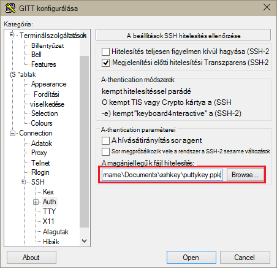

<properties
   pageTitle="SSH billentyűk használata a Hadoop Linux-alapú fürt a Windows rendszerű |} Microsoft Azure"
   description="Megtudhatja, hogy miként hozhat létre és Linux-alapú HDInsight fürt hitelesíteni a SSH billentyűk segítségével. Windows-alapú ügyfélszámítógépekről fürt összekötése a gitt SSH ügyfélprogramban."
   services="hdinsight"
   documentationCenter=""
   authors="Blackmist"
   manager="jhubbard"
   editor="cgronlun"
    tags="azure-portal"/>

<tags
   ms.service="hdinsight"
   ms.devlang="na"
   ms.topic="get-started-article"
   ms.tgt_pltfrm="na"
   ms.workload="big-data"
   ms.date="08/30/2016"
   ms.author="larryfr"/>

#A Windows HDInsight Linux-alapú Hadoop SSH használata

> [AZURE.SELECTOR]
- [A Windows](hdinsight-hadoop-linux-use-ssh-windows.md)
- [Linux, Unix OS X](hdinsight-hadoop-linux-use-ssh-unix.md)

[Biztonságos rendszerhéj (SSH)](https://en.wikipedia.org/wiki/Secure_Shell) lehetővé teszi, hogy távolról a használatával a parancssor Linux-alapú HDInsight fürt műveletek hajthatók végre. A dokumentum információkat tartalmaz az gitt SSH ügyfél használatával a Windows-alapú ügyfélszámítógépekről HDInsight való csatlakozással kapcsolatban.

> [AZURE.NOTE] A jelen cikkben ismertetett lépések feltételezik, hogy a Windows-alapú ügyfelet használ. Ha Linux, Unix vagy OS X ügyfél használja, olvassa el a [Használati SSH a Linux-alapú Hadoop a HDInsight Linux rendszerhez, a Unix, vagy az OS X](hdinsight-hadoop-linux-use-ssh-unix.md).
>
> Ha Windows 10-es és [a Windows Ubuntu Bash](https://msdn.microsoft.com/commandline/wsl/about)használ, majd is használhatja a lépéseket a [Használata SSH Linux-alapú Hadoop a HDInsight Linux rendszerhez, a Unix, vagy az OS X a](hdinsight-hadoop-linux-use-ssh-unix.md) dokumentumban.

##Előfeltételek

* **Gitt** és **PuTTYGen** Windows-alapú ügyfelek számára. Ezek a segédprogramok [http://www.chiark.greenend.org.uk/~sgtatham/putty/download.html](http://www.chiark.greenend.org.uk/~sgtatham/putty/download.html)rendelkezésre állnak.

* Modern webböngészőben, amely támogatja a HTML5-ös.

VAGY

* [Azure CLI](../xplat-cli-install.md).

    [AZURE.INCLUDE [use-latest-version](../../includes/hdinsight-use-latest-cli.md)] 

##Mi az SSH?

SSH a bejelentkezés a és a távoli kiszolgáló parancsok, távolról végrehajtása egy segédprogramot. A HDInsight Linux-alapú SSH egy központi csomópont titkosított kapcsolatot létesít, és írja be a parancsok használt parancssort jelenít meg. Parancsok majd végrehajtása közvetlenül a kiszolgálón.

###SSH felhasználónév

Egy SSH hitelesítést végezni a HDInsight fürthöz használt felhasználóneve. Csoport létrehozása során egy SSH felhasználónév megadása esetén a felhasználó a fürt csomópontjait jön létre. Amikor létrejött a fürt, a felhasználó nevét a HDInsight fürt központi csomópontok összekapcsolása is használhatja. A központi csomópontok majd csatlakozhat az egyes dolgozó csomópontot.

###SSH jelszó vagy a nyilvános kulcs

Egy SSH felhasználó használhatja a jelszó vagy a nyilvános kulcshoz hitelesítéshez. Jelszót csak akkor alkotó, miközben egy nyilvános kulcs egyedileg azonosító során létre a titkosítási kulcs két része szöveges karakterlánc.

Egy kulcsa biztonságosabb, mint a jelszót, azonban a kulcs létrehozása további lépésekre van szükség, akkor és kell tartania, akkor a fájlokat, ahol az a billentyűt biztonságos helyen. Ha bárki hozzáfér a kulcsfontosságú fájlok, azok hozzáférni a fiókjához. Vagy ha megszakad a fontos fájlok, nem tud bejelentkezni a fiókjába.

Két fő áll egy nyilvános (amely a rendszer elküldi a HDInsight-kiszolgáló), és a személyes kulcs (Ez legyen az ügyfélgépen.) SSH HDInsight kiszolgálóval csatlakozáskor a SSH ügyfél fogja használni a titkos kulcs a számítógépen a kiszolgáló hitelesítést végezni.

##Hozzon létre egy SSH kulcs

Ha a fürthöz SSH kulcsokkal, használja az alábbi információkat. Ha a jelszó használatával, kihagyhatja ebben a szakaszban.

1. Nyissa meg a PuTTYGen.

2. **Kulcs generálása típusú**jelölje be a **SSH-2 RSA**, és ezután kattintson a **Létrehozás**gombra.

    

3. Vigye az egérmutatót az állapotsáv alatt mindaddig, amíg a eszköztáron beírja. Az egér mozgatása hoz létre a véletlenszerű a kulcs létrehozásához használt adatokról.

    

    Miután a kulcs hozott létre, a nyilvános kulcs jelennek meg.

4. A nagyobb biztonság érdekében írja be egy jelszót a **kulcsot a jelszó** mezőbe, és a **jelszó megerősítése** mezőbe írja be az azonos értékkel.

    

    > [AZURE.NOTE] Kifejezetten ajánljuk, hogy a biztonságos jelszó-et a billentyűt. Ha elfelejtette a jelszavát, van azonban nem tudja helyreállítani.

5. A kulcs **.ppk** fájl mentése a **titkos kulcs mentése** gombra. A kulcs lesz a Linux-alapú HDInsight fürthöz hitelesítést végezni.

    > [AZURE.NOTE] Tárolja a kulcs biztonságos helyen, mint a HDInsight Linux-alapú fürt eléréséhez használható.

6. **Nyilvános kulcs mentése** fájlként való mentéséhez a kulcs egy **.txt** gombra. Ez a nyilvános kulcs további Linux-alapú HDInsight fürt létrehozásakor a későbbiekben újra felhasználhatja. teszi lehetővé.

    > [AZURE.NOTE] A nyilvános kulcs is PuTTYGen tetején jelenik meg. Kattintson a jobb gombbal a mező, másolja a vágólapra az értéket, és illessze be azokat egy űrlap létrehozása az Azure-portálon fürt.

##Linux-alapú HDInsight fürt létrehozása

A HDInsight Linux-alapú fürtre létrehozásakor meg kell adnia a korábban létrehozott nyilvános kulcs. Windows-alapú ügyfélszámítógépekről kétféleképpen Linux-alapú HDInsight fürt létrehozása:

* **Azure portál** - hozza létre a webes portál használja.

* **Mac, a Linux és a Windows azure CLI** - parancssori parancsokat a fürt létrehozásához használja.

A fenti módszerek a nyilvános kulcs van szükség. A HDInsight Linux-alapú fürt létrehozása, témakörben talál [rendelkezést Linux-alapú HDInsight fürt](hdinsight-hadoop-provision-linux-clusters.md).

###Azure portál

Ha az [Azure-portálon] [ preview-portal] Linux-alapú HDInsight fürt létrehozása, kell írjon be egy **SSH felhasználónév**, majd jelölje be a **jelszó** vagy a **SSH nyilvános kulcs**megadásához.

Ha **SSH nyilvános kulcs**lehetőséget választja, beillesztheti a nyilvános kulcs vagy (jelenik meg a __beillesztése az engedélyezett OpenSSH nyilvános kulcs\_kulcsok fájl__ PuttyGen, mezőjében) __SSH PublicKey__ mezőben, vagy válassza __Jelöljön ki egy fájlt__ tallózással keresse meg és jelölje ki a fájlt, amely tartalmazza a nyilvános kulcshoz.

Az adott felhasználó bejelentkezési hoz létre, és lehetővé teszi, hogy a jelszó-hitelesítést vagy a SSH kulcsú hitelesítést.

###A Mac-, Linux, és a Windows Azure parancssor

Egy új csoport létrehozása a [Mac, a Linux és a Windows Azure CLI](../xplat-cli-install.md) is használhatja a `azure hdinsight cluster create` parancsot.

Ez a parancs használatával kapcsolatos további tudnivalókért lásd: [az egyéni beállításokkal HDInsight rendelkezést Hadoop Linux fürt](hdinsight-hadoop-provision-linux-clusters.md).

##Csatlakozás Linux-alapú HDInsight fürthöz

1. Nyissa meg a gitt.

    

2. Ha egy SSH kulcsot a felhasználói fiók létrehozásakor, jelölje be a titkos kulcs használatához a fürthöz hitelesítés során a következő lépés kell végrehajtania:

    **Kategória**bontsa ki a **kapcsolat**, bontsa ki a **SSH**, és válassza a **hitelesítés**parancsra. Végül kattintson a **Tallózás gombra** , majd jelölje ki a .ppk fájlt, amely tartalmazza a titkos kulcs.

    

3. **Kategória**jelölje ki a **munkamenetet**. Az **alapvető beállítások az gitt munkamenetben** képernyő a **Host name (vagy IP-cím)** mezőbe írja be a SSH HDInsight kiszolgáló címét. Van két SSH címeknek fürtre csatlakozáskor használhatja:

    * __Címsor csomópont címe__: a központi csomópontot a fürt szeretne csatlakozni, használja a fürt nevét, majd **-ssh.azurehdinsight.net**. Ha például **en_furtom nevű fürt-ssh.azurehdinsight.net**.
    
    * __Él csomópont címe__: Ha-R-kiszolgálóhoz, a HDInsight fürthöz csatlakozik, a R kiszolgáló él csomópontot __RServer.CLUSTERNAME.ssh.azurehdinsight.net__, hol CLUSTERNAME-e a fürt neve cím használatával csatlakozhat. Ha például __RServer.mycluster.ssh.azurehdinsight.net__.

    

4. Mentése későbbi használatra a kapcsolat adatait, írjon be egy nevet a kapcsolat a **Munkamenetek mentett**, és kattintson a **Mentés**gombra. A kapcsolat hozzáadódik mentett munkamenetek listáját.

5. Kattintson a **Megnyitás** a fürthöz csatlakozni.

    > [AZURE.NOTE] Ha az első alkalommal a fürt kapcsolt, a biztonsági figyelmeztetés fog kapni. Ez a normál. Válassza az **Igen gombra** a kiszolgáló RSA2 kulcs továbbra is a gyorsítótárban.

6. Amikor a rendszer kéri, adja meg a felhasználót, hogy a csoport létrehozásakor a beírt. Ha megadott egy jelszót a felhasználó számára, a rendszer kéri, adja meg is.

> [AZURE.NOTE] A fenti lépések feltételezik, hogy az elsődleges headnode a HDInsight fürt fog csatlakozni 22 portot használja. Ha 23 portot használja, a másodlagos fog csatlakozni. A központi csomópontok a további tudnivalókért lásd: [elérhetőségéről és az HDInsight Hadoop fürt megbízhatóságát](hdinsight-high-availability-linux.md).

###Dolgozó csomópontok összekapcsolása

A dolgozó csomópontok nem közvetlenül elérhető az Azure adatközponthoz kívül, de azok webböngészőn keresztül elérhetők központi csomópont SSH keresztül.

Ha egy SSH kulcsot a felhasználói fiók létrehozásakor, a titkos kulcs melyikkel a fürthöz hitelesítése, ha azt szeretné, a dolgozók csomópontok csatlakozhat az alábbi lépéseket kell elvégeznie.

1. Telepítse parádé [http://www.chiark.greenend.org.uk/~sgtatham/putty/download.html](http://www.chiark.greenend.org.uk/~sgtatham/putty/download.html). Ez a segédprogram SSH kulcsok gyorsítótárba gitt szolgál.

2. Futtassa a parádé. Az állapot tálca ikont fog lekicsinyítheti. Kattintson a jobb gombbal az ikonra, és válassza a **Kulcs hozzáadása**.

    

3. Amikor megjelenik a Tallózás párbeszédpanelen, jelölje ki a kulcsot tartalmazó .ppk fájlt, és kattintson a **Megnyitás**. Ekkor megjelenik a kulcs parádé, amivel azt gitt való csatlakozáskor a fürthöz.

    > [AZURE.IMPORTANT] Egy SSH kulcs használt biztonságos fiókjához, ha előtt dolgozó csomópontok összekapcsolása az előző lépéseket kell elvégeznie.

4. Nyissa meg a gitt.

5. Ha egy SSH billentyűvel hitelesítést végezni a **kategória** csoportban akkor bontsa ki a **kapcsolatot**, bontsa ki a **SSH**, és válassza a **Auth**.

    **Hitelesítési paramétereket** csoportban engedélyezése **a hívásátirányítás engedélyezése ügynök**. Ezzel automatikusan át kívánja a tanúsítvány hitelesítés a kapcsolaton keresztül központi csomópont dolgozó csomópontok való csatlakozáskor gitt.

    

6. Csatlakozás a fürt korábbi leírtak szerint. Egy SSH billentyűvel hitelesítéshez, ha nem kell jelölje ki a kulcsot, – a hozzáadott parádé SSH kulcs szolgálnak a fürthöz hitelesítést végezni.

7. Miután a kapcsolat létrejött, a következő segítségével a fürt csomópontjai listáját. *ADMINPASSWORD* cserélje le a fürt rendszergazdai fiók jelszava. *CLUSTERNAME* cserélje le a csoport nevére.

        curl --user admin:ADMINPASSWORD https://CLUSTERNAME.azurehdinsight.net/api/v1/hosts

    Ez adatokat ad vissza JSON formátumban a csomópontok a fürt, beleértve a `host_name`, amely tartalmazza a teljes tartománynevét (FQDN) csomópontok. Az alábbi képen egy `host_name` a **curl** parancs által visszaadott bejegyzés:

        "host_name" : "workernode0.workernode-0-e2f35e63355b4f15a31c460b6d4e1230.j1.internal.cloudapp.net"

8. Ha befejezte a dolgozó csomópontok, amelyhez csatlakozni szeretne listáját, a következő parancsot a gitt munkamenetből segítségével kapcsolatot létesíteni dolgozó csomópont:

        ssh USERNAME@FQDN

    *USERNAME* cserélje le a SSH felhasználónevét és a *FQDN* együtt dolgozó csomópont a teljesen minősített tartománynév. Ha például `workernode0.workernode-0-e2f35e63355b4f15a31c460b6d4e1230.j1.internal.cloudapp.net`.

    > [AZURE.NOTE] Ha hitelesítési jelszót használja a SSH munkamenet kérni fogja írja be újra a jelszót. Ha egy SSH billentyűt használja, a kapcsolat nélkül kell befejezési.

9. Miután a munkamenet létrejött a Rákérdezés a használni a gitt munkamenet változik `username@hn#-clustername` való `username@wn#-clustername` jelzi, hogy csatlakozva van az dolgozó csomópontot. Ezen a ponton futtatása parancsok a dolgozó csomópontra fog futni.

10. Miután végzett műveletek elvégzésére a dolgozó csomópontra, a `exit` dolgozó csomópontot a munkamenet bezárása parancsot. Ez ad vissza, hogy a `username@hn#-clustername` kérdés.

##További fiókok hozzáadása

Ha több fiókot is a fürt van szüksége, hajtsa végre az alábbi lépéseket:

1. Hoz létre egy új nyilvános és titkos kulcs az új felhasználói fiók korábban leírt módon.

2. Egy SSH munkamenetből a fürthöz az alábbi paranccsal az új felhasználó hozzáadása:

        sudo adduser --disabled-password <username>

    Ezzel létrehoz egy új felhasználói fiók, de letiltja a jelszó-hitelesítést.

3. A könyvtár és tartsa nyomva az az alábbi parancsok használatával a fájlok létrehozása:

        sudo mkdir -p /home/<username>/.ssh
        sudo touch /home/<username>/.ssh/authorized_keys
        sudo nano /home/<username>/.ssh/authorized_keys

4. Amikor megnyílik a nano szerkesztő, másolja a vágólapra, és illessze be a nyilvános kulcs az új felhasználói fiók tartalmát. Végezetül segítségével **Ctrl-X** mentse a fájlt, és lépjen ki a szerkesztő.

    

5. A következő parancsot használja a .ssh mappát és tartalmát tulajdonjogát az új felhasználói fiók módosítása:

        sudo chown -hR <username>:<username> /home/<username>/.ssh

6. Most már tudni hitelesítést végezni az új felhasználói fiók és a titkos kulcs a kiszolgálóra.

##SSH tunneling

Helyi kérések, például a webes kérelmek a HDInsight fürthöz átjáró SSH használható. A kérés majd átirányítja az erőforrás, mintha az csomóponton HDInsight központi volna származik.

> [AZURE.IMPORTANT] Egy SSH alagutas be a webes felhasználói felület bizonyos Hadoop-szolgáltatásokhoz tartozó követelmény. Ha például a feladat előzmények felhasználói felület vagy az erőforrás-kezelő felhasználói felület csak azok webböngészőn egy SSH alagutas.

Létrehozásával és használatával egy SSH alagutas további tudnivalókért olvassa el a [Használata SSH Tunneling Ambari webes felület, erőforrás-kezelő, JobHistory, NameNode, Oozie, és más webes Felhasználóifelület-féle eléréséhez](hdinsight-linux-ambari-ssh-tunnel.md)című témakört.

##Következő lépések

Most, hogy megismeri hogyan egy SSH kulcs használatával hitelesítse, megtudhatja, hogy miként MapReduce használata Hadoop a hdinsight szolgáltatásból lehetőségre.

* [HDInsight struktúra használata](hdinsight-use-hive.md)

* [Malac használata hdinsight szolgáltatáshoz](hdinsight-use-pig.md)

* [HDInsight MapReduce feladatok használata](hdinsight-use-mapreduce.md)

[preview-portal]: https://portal.azure.com/
