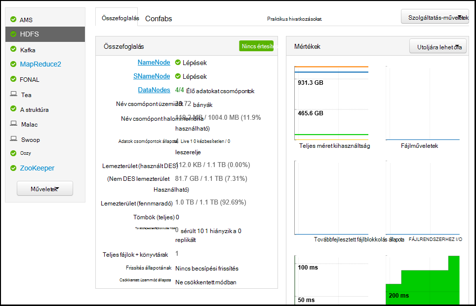
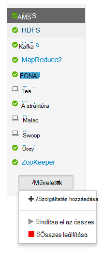

<properties
   pageTitle="Figyelheti és kezelheti a Apache Ambari webes felhasználói felületének használata HDInsight fürt |} Microsoft Azure"
   description="Megtudhatja, hogy miként figyelheti és kezelheti a HDInsight Linux-alapú fürt Ambari használatával. A jelen dokumentum megtanulhatja HDInsight fürt részét képező Ambari webes felületének használata."
   services="hdinsight"
   documentationCenter=""
   authors="Blackmist"
   manager="jhubbard"
   editor="cgronlun"
    tags="azure-portal"/>

<tags
   ms.service="hdinsight"
   ms.devlang="na"
   ms.topic="article"
   ms.tgt_pltfrm="na"
   ms.workload="big-data"
   ms.date="09/27/2016"
   ms.author="larryfr"/>

#HDInsight fürt kezelése Ambari webes a felhasználói felület használatával

[AZURE.INCLUDE [ambari-selector](../../includes/hdinsight-ambari-selector.md)]

Apache Ambari egyszerűbbé teszi a kezelése és figyelése a Hadoop fürtre, mert a webhely felhasználói felület és a REST API-t egy könnyen. Ambari Linux-alapú HDInsight fürt szerepel, és a fürt figyelésére és konfigurációs változtatások szolgál.

A jelen dokumentum megtanulhatja a Ambari webes felhasználói felületének használata egy HDInsight fürthöz.

##Mi az Ambari?

<a href="http://ambari.apache.org" target="_blank">Apache Ambari</a> teszi kezelése a Hadoop egyszerűbb, mert egy könnyen használható webes felhasználói felület kiépítése, kezelése és figyelése Hadoop fürt használható. A fejlesztők integrálhatja e ezekre a lehetőségekre a alkalmazásokba a <a href="https://github.com/apache/ambari/blob/trunk/ambari-server/docs/api/v1/index.md" target="_blank">Ambari REST API -khoz</a>használatával.

A Ambari webes felület Linux-alapú HDInsight fürt alapértelmezés szerint megadva. 

##Kapcsolat

A HDInsight fürthöz HTTPS://CLUSTERNAME.azurehdidnsight.net, hol __CLUSTERNAME__ -e a fürt neve Ambari webes a felhasználói felület érhető el. 

> [AZURE.IMPORTANT] A HDInsight Ambari kapcsolódás szükséges HTTPS. Is hitelesíteni a rendszergazdai fiók nevére (az alapértelmezett érték __felügyeleti__), és a csoport létrehozásakor a megadott jelszóval Ambari.

##SSH proxy

> [AZURE.NOTE] Ugyan a fürt Ambari elérhető közvetlenül az interneten keresztül, a Ambari webes felülete (például a JobTracker,) az egyes hivatkozások nem láthatóak az interneten. Így "a kiszolgáló nem található" hibákat fog kapni, ezek a funkciók eléréséhez, kivéve, ha egy biztonságos rendszerhéj (SSH) alagutas központi csomópont proxy web-alapú forgalmat a használata közben.

Egy SSH alagutas Ambari végezhető létrehozásával kapcsolatos további tudnivalókért lásd [Használata SSH Tunneling Ambari webes felület, erőforrás-kezelő, JobHistory, NameNode, Oozie, és más webes Felhasználóifelület-féle eléréséhez](hdinsight-linux-ambari-ssh-tunnel.md).

##Ambari webes felhasználói felület

A Ambari webes felület való csatlakozáskor a rendszer kéri, azt a lapot hitelesítést végezni. A fürt rendszergazdai felhasználói (alapértelmezett felügyeleti), és a csoport létrehozása során használt jelszót használja.

Amikor megnyílik a lapra, jegyezze fel a felső sávon. Az alábbi információk és vezérlők tartalmazza:

* **Ambari embléma** - megnyílik az irányítópulton a fürt követésére használható.

* **Csoport neve # ops** - folyamatban lévő Ambari műveletek számát jeleníti meg. A csoport nevét vagy a **# ops** kijelölése háttér műveletek listáját jeleníti meg.

* **# riasztások** - figyelmeztetések vagy kritikus riasztások, ha van ilyen a fürt. Ha bejelöli ezt az értesítések listáját jeleníti meg.

* **Irányítópult** - megjelenítése az irányítópulton.

* **Szolgáltatás** - információkat és a konfigurációs beállítások a fürt a szolgáltatásokra.

* **Hosts** - információkat és a konfigurációs beállítások a csomópontok a fürt.

* **Értesítések** - adatok, figyelmeztetések és kritikus értesítések naplója.

* **Rendszergazdai** - szoftver Papírhalom/telepített szolgáltatások fürt, szolgáltatási fiók adatait, és Kerberos biztonsági.

* **Gomb rendszergazdai** – Ambari kezelése, a felhasználói beállításainak és a kijelentkezés.

##Figyelése

###Értesítések

Ambari tartalmaz számos riasztások, lesz állapotát a következők valamelyikét:

* **oké**

* **Figyelmeztetés**

* **KRITIKUS**

* **ISMERETLEN**

Értesítések kívül **az OK gombra** az értesítések számát jeleníti meg a lap tetején a **# riasztások** bejegyzés eredményezi. Ez a bejegyzés kijelölése az értesítések és állapotuk jeleníti meg.

Értesítések vannak tagolva több alapértelmezett csoportok, amelyek a **riasztások** lapon megtekintheti.

A **Műveletek** menü használatával, és válassza a **Riasztási csoportok kezelése**kezelheti a csoportokat. Lehetővé teszi, hogy módosítsa a meglévő csoportokhoz, vagy létrehozhat új csoportokat.

A **Műveletek** menüjének értesítéseket is létrehozhat. Ez lehetővé teszi, hogy létrehozása indítók **SNMP** , illetve **E-mail** értesítések küldésére, adott értesítés/súlyosságát kombinációk végrehajtásakor. Ha például elküldheti **kritikus**jelzést, amikor bármelyik **Fonal alapértelmezett** csoportjában az értesítések beállítása.

###Fürthöz

A **Mértékek** lapon az irányítópult tartalmazza, amelyek megkönnyítik a Lync-állapotának áttekintése a fürt vezérlőkhöz sorozata. Több vezérlők, például **Processzorhasználata**, adja meg a további információkat, amikor rákattintanak.

A **Heatmaps** lap mértékek színes heatmaps zöld Ugrás piros színnel jeleníti meg.

További információ a fürt belül csomóponton jelölje be a **Hosts**, és válassza ki az adott csomópont érdeklik.

###Szolgáltatások

A **szolgáltatások** oldalsáv az irányítópulton a a fürthöz a szolgáltatások állapotát rövid betekintést biztosít. Különböző ikonok szolgálnak, hogy az állapot és a műveleteket, amelyeket kell tenni, például egy sárga Lomtár szimbólumot, ha a szolgáltatás kell lennie a rendszer.

A szolgáltatás kiválasztása megjelenik a szolgáltatás részletes tudnivalókat.

####Tartalom

Egyes szolgáltatások **Gyors hivatkozások** hivatkozást a lap tetején jeleníti meg. Ez a szolgáltatásspecifikus webes előkészíthetik, eléréséhez használható:

* **Korábbi** - MapReduce korábbi.

* **Erőforrás-kezelő** - fonal erőforrás-kezelő felhasználói felület.

* **NameNode** - Hadoop elosztott fájl rendszer (Fájlrendszerhez) NameNode felhasználói felület.

* **Felhasználói felület Oozie Web** - Oozie felhasználói felület.

Jelölje ki az alábbi hivatkozásokra, megnyílik a böngészőben, amely a kijelölt lap jelenik meg egy új lapon.

> [AZURE.NOTE] A **Tartalom** hivatkozásra kattint valamelyik szolgáltatás azt eredményezi, hogy egy "a kiszolgáló nem található" hiba kivéve, ha egy Secure Sockets Layer (SSL) alagutas proxy internetes forgalmat a fürthöz szeretne használni. Ennek oka az, a webalkalmazások segítségével információk jeleníthetők meg nem láthatóak az interneten.
>
> A HDInsight-SSL alagutas használja a további tudnivalókért lásd [Használata SSH Tunneling Ambari webes felület, erőforrás-kezelő, JobHistory, NameNode, Oozie, és más webes Felhasználóifelület-féle eléréséhez](hdinsight-linux-ambari-ssh-tunnel.md)

##Kezelése

###Ambari felhasználók, csoportok és engedélyek

Felhasználók, csoportok és engedélyek kezelése nem használható a HDInsight fürt.

###Hosts

A **Hosts** lap összes hosts a fürt sorolja fel. Hosts kezelése, kövesse az alábbi lépéseket.

> [AZURE.NOTE] Hozzá, leszerelje vagy recommissioning a szolgáltató nem használható a HDInsight fürt.

1. Jelölje ki a használni kívánt állomásokkal.

2. A **Műveletek** menü segítségével válassza ki a végrehajtani kívánt műveletet:

    * **Indítsa el a minden összetevő** - minden összetevő indítása az állomáson.

    * **Állítsa le a minden összetevő** - minden összetevő leállítása az állomáson.

    * **Indítsa újra a minden összetevő** - leállítása parancsra, és indítsa el a minden összetevő az állomáson.

    * **Karbantartási mód bekapcsolása** - értesítések letiltja az állomás. Ezt akkor célszerű engedélyezni hoz létre az értesítéseket például támaszkodó rendszeren futó services szolgáltatás újraindítását műveleteket hajt végre.

    * A host normál riasztási **karbantartási mód kikapcsolása** - adja eredményül.

    * **Leállítása** - végpontok DataNode vagy NodeManagers az állomáson.

    * **Kezdés** - DataNode indítása vagy a gazdawebhelyének NodeManagers.

    * **Indítsa újra** - végpontok és DataNode vagy NodeManagers elindítja az állomáson.

    * **Decommission** - állomás eltávolítja a fürt.

        > [AZURE.NOTE] Ez a művelet nem használja fürt hdinsight szolgáltatásból lehetőségre.

    * **Recommission** - összeadja a fürthöz egy korábban leszerelt host.

        > [AZURE.NOTE] Ez a művelet nem használja fürt hdinsight szolgáltatásból lehetőségre.

###Szolgáltatások

Az **Irányítópult** vagy **szolgáltatások** lapján használja a **Műveletek** gombra szolgáltatások listájának alján összes szolgáltatás elindítása és leállítása.

> [AZURE.WARNING] __Szolgáltatás hozzáadása__ szerepel ebben a menüben, amíg meg nem használható szolgáltatások hozzáadása a HDInsight fürthöz. Új szolgáltatások parancsfájl művelettel során fürt kiépítési adhatók hozzá. Parancsfájl-műveletek használatával kapcsolatos további tudnivalókért olvassa el a [HDInsight testreszabása fürt parancsfájl-műveletek használata](hdinsight-hadoop-customize-cluster-linux.md)című témakört.

A **Műveletek** gombra is indítsa újra az összes szolgáltatás, miközben gyakran érdemes indítása, leállítása vagy újraindítása egy adott szolgáltatás. Az egyes szolgáltatásokhoz műveletek elvégzéséhez kövesse az alábbi lépéseket:

1. Az **Irányítópult** vagy **szolgáltatások** lapján jelölje be a szolgáltatás.

2. Az **Összegzés** lap tetején a **Szolgáltatás műveletek** gombra, és válassza ki a végrehajtandó műveletet. Ez lesz indítsa újra az összes csomópontokat szolgáltatást.

    

    > [AZURE.NOTE] Indítsa újra az egyes szolgáltatások, a fürt futása közben készítése a riasztások. Ennek elkerülése érdekében a **Szolgáltatás műveletek** gomb segítségével **karbantartási mód** engedélyezése a szolgáltatást az újraindítás végrehajtása előtt.

3. Művelet kijelölése után kattintson a lap tetején a **# m** bejegyzés növelik, kattintva jelenítse meg, hogy mi a háttérben művelet. Ha konfigurálva megjelenítéséhez, a háttérben műveletek listájából jelenik meg.

    > [AZURE.NOTE] Ha engedélyezte a szolgáltatás **karbantartási mód** , ne felejtse el tiltsa le a **Szolgáltatás műveletek** gomb használatával, amikor a művelet befejeződik.

Szolgáltatás beállításához kövesse az alábbi lépéseket:

1. Az **Irányítópult** vagy **szolgáltatások** lapján jelölje be a szolgáltatás.

2. Jelölje ki a **konfigurációk** fülre. A jelenlegi beállításokkal jelennek meg. A lista előző konfigurációk is megjelenik.

    

3. Konfigurációjának módosítása megjelenített mezők használata, és válassza a **Mentés**gombra. Vagy válassza ki az előző konfigurációt, és válassza a **Ellenőrizze az aktuális** visszatér az előző beállításokat.

##Ambari nézetek

Ambari a nézet lap a fejlesztők számára a felhasználói felület elemei csatlakoztassa a Ambari webes felület [Ambari nézetek keretrendszer](https://cwiki.apache.org/confluence/display/AMBARI/Views)használatával. HDInsight biztosít a következő nézetekben Hadoop fürt típusú:

* Fonal várólista-kezelő: A várólista-kezelő biztosít egy egyszerű felhasználói felületének megtekintése és módosítása a fonal sorban várakozó.
* Struktúra nézet: A struktúra nézet egyszerűvé teszi struktúra lekérdezések futtatása közvetlenül a böngészőből. Mentse a lekérdezést, eredményeinek megtekintése, az eredmények mentése fürt tárolására vagy töltse le a helyi rendszer eredmények. Nézetek struktúra használatával kapcsolatos további tudnivalókért lásd: a [Struktúra nézetek használata hdinsight szolgáltatásból lehetőségre](hdinsight-hadoop-use-hive-ambari-view.md).
* Tez nézet: A Tez nézet lehetővé teszi, hogy jobban megismerni, és hogyan Tez feladatok végrehajtása és a projekt által használt erőforrásoktól információk megtekintése a feladatok igazításával.
