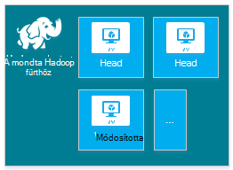
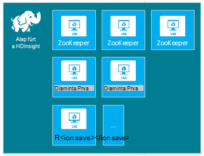
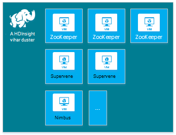
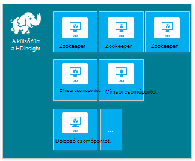
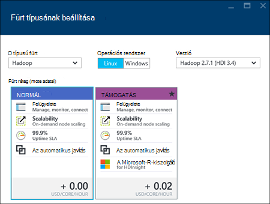
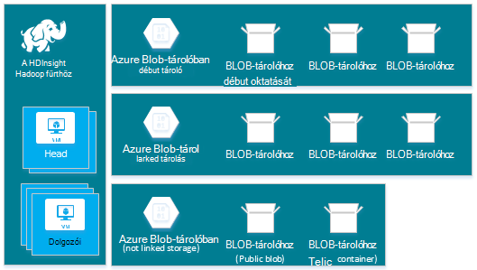
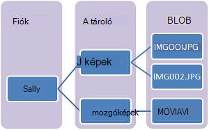
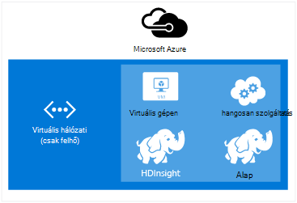
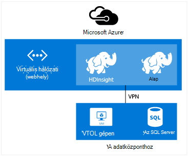

<properties
    pageTitle="A HDInsight Linux Hadoop, HBase, vihar vagy külső fürt létrehozása |} Microsoft Azure"
    description="Megtudhatja, hogy miként hozhat létre, Hadoop, HBase, vihar vagy Linux fürt dokumentuma, HDInsight használata a böngészőben az Azure CLI, az Azure PowerShell, a többi, vagy egy SDK keresztül."
    services="hdinsight"
    documentationCenter=""
    authors="mumian"
    manager="jhubbard"
    editor="cgronlun"
    tags="azure-portal"/>

<tags
    ms.service="hdinsight"
    ms.devlang="na"
    ms.topic="article"
    ms.tgt_pltfrm="na"
    ms.workload="big-data"
    ms.date="10/18/2016"
    ms.author="jgao"/>

# Hozzon létre Linux-alapú Hadoop fürt hdinsight szolgáltatáshoz

[AZURE.INCLUDE [selector](../../includes/hdinsight-selector-create-clusters.md)]

A Hadoop fürtre több virtuális gépeken futó (csomópontok) használható parancsmagokról a a fürt feladatok elosztott feldolgozás áll. Azure abstracts telepítési végrehajtása részleteit, illetve egyes csomópontok beállításait, így csak meg kell adnia az általános beállításokat. Ebben a cikkben megismerheti a konfigurációs beállítások kapcsolatban.

## Access-ellenőrzési követelmények

[AZURE.INCLUDE [access-control](../../includes/hdinsight-access-control-requirements.md)]

## Fürt típusai

Jelenleg az Azure hdinsight szolgáltatáshoz fürt nyolc-összetevők, bizonyos funkciók megadására öt különböző típusú biztosít.

| Fürt típusa | Funkciók |
| ------------ | ----------------------------- |
| Hadoop       | Lekérdezés- és analysis (köteg feladatok)     |
| HBase        | NoSQL adattárolás            |
| Vihar        | Valós idejű esemény feldolgozása |
| A külső        | A memóriában feldolgozás, interaktív lekérdezések, micro-köteg adatfolyam feldolgozása |
| [Interaktív struktúra (előzetes verzió)](hdinsight-hadoop-use-interactive-hive.md) | A memóriában interaktív és gyorsabban struktúra lekérdezések gyorsítótárazása|
| R kiszolgálón külső (előzetes verzió) | Különféle adatok nagy statisztika, prediktív modellezési és gépi tanulási funkciók |

Minden fürt típusra a fürt található csomópontok, a fürt található csomópontok a terminológiá és alapértelmezett virtuális mérete az egyes csomópont: a saját számot tartalmaz. Az alábbi táblázat az egyes csomópont: csomópontok számának zárójelek között szerepel.

| Típus| Csomópontok | Diagram|
|-----|------|--------|
|Hadoop| Címsor csomópont (2), az adatok csomópont (1 +)||
|HBase|Címsor kiszolgáló (2), régió (1 +), főadat/Zookeeper csomópont (3)||
|Vihar|Nimbus csomópont (2), felügyelő server (1 +), Zookeeper csomópont (3)||
|A külső|Címsor csomópont (2), dolgozó csomópont (1 +), Zookeeper csomópont (3) (az A1 Zookeepers virtuális mérete ingyenes)||

Az alábbi táblázat az alapértelmezett virtuális méretek HDInsight:

- Az összes támogatott terület Brazil déli és a japán nyugati kivételével:

  	|Fürt típusa                     | Hadoop               | HBase                | Vihar                | A külső                                                                 | R-kiszolgáló |
  	|---------------------------------|----------------------|----------------------|----------------------|-----------------------------------------------------------------------|-----------------------------------------------------------------------|
  	|Címsor – alapértelmezett virtuális mérete           | D3 v2                | D3 v2                | AZ A3                   | D12 v2                                                                | D12 v2                                                                |
  	|Címsor – virtuális méretű ajánlott      | D3 v2, D4 v2, D12 v2 | D3 v2, D4 v2, D12 v2 | AZ A3, A4, A5           | D12 v2, D13 v2, D14 v2                                                | D12 v2, D13 v2, D14 v2                                                |
  	|Dolgozó – alapértelmezett virtuális mérete         | D3 v2                | D3 v2                | D3 v2                | Windows: D12 v2; Linux: D4 v2                                         | Windows: D12 v2; Linux: D4 v2                                         |
  	|Dolgozó – virtuális méretű ajánlott    | D3 v2, D4 v2, D12 v2 | D3 v2, D4 v2, D12 v2 | D3 v2, D4 v2, D12 v2 | Windows: D12 v2 D13 v2, D14 v2; Linux: D4 v2 D12 v2, D13 v2, D14 v2 | Windows: D12 v2 D13 v2, D14 v2; Linux: D4 v2 D12 v2, D13 v2, D14 v2 |
  	|Zookeeper – alapértelmezett virtuális mérete      |                      | AZ A3                   | AZ A2                   |                                                                       |
  	|Zookeeper – virtuális méretű ajánlott |                      | AZ A3, A4, A5           | AZ A2, A3, A4 CSOMAG           |                                                                       |
  	|Él - alapértelmezett virtuális mérete           |                      |                      |                      |                                                                       | Windows: D12 v2; Linux: D4 v2                                         |
  	|Szegély - ajánlott virtuális méret       |                      |                      |                      |                                                                       | Windows: D12 v2 D13 v2, D14 v2; Linux: D4 v2 D12 v2, D13 v2, D14 v2 |

- Brazília déli és csak japán nyugati (nincs v2 méretű itt):

  	|Fürt típusa                     | Hadoop      | HBase       | Vihar      | A külső                                          |R-kiszolgáló|
  	|---------------------------------|-------------|-------------|------------|------------------------------------------------|--------|
  	|Címsor – alapértelmezett virtuális mérete           | D3          | D3          | AZ A3         | D12                                            | D12|
  	|Címsor – virtuális méretű ajánlott      | D3, D4 D12 | D3, D4 D12 | AZ A3, A4, A5 | D12, D13, D14                                  | D12, D13, D14|
  	|Dolgozó – alapértelmezett virtuális mérete         | D3          | D3          | D3         | Windows: D12; Linux: D4                        | Windows: D12; Linux: D4|
  	|Dolgozó – virtuális méretű ajánlott    | D3, D4 D12 | D3, D4 D12 | D3, D4 D12| Windows: D12, D13, D14; Linux: D4 D12, D13, D14| Windows: D12, D13, D14; Linux: D4 D12, D13, D14|
  	|Zookeeper – alapértelmezett virtuális mérete      |             | AZ A2          | AZ A2         |                                                | |
  	|Zookeeper – virtuális méretű ajánlott |             | AZ A2, A3, A4 CSOMAG  | AZ A2, A3, A4 CSOMAG |                                                | |
  	|Él – alapértelmezett virtuális méretek          |             |             |            |                                                | Windows: D12; Linux: D4 |
  	|Szélére virtuális méretű ajánlott      |             |             |            |                                                | Windows: D12, D13, D14; Linux: D4 D12, D13, D14 |

Figyelje meg, hogy vezetője nevezik *Nimbus* vihar fürt típusra. Dolgozó ismert *régió* HBase fürt típusa és *felügyelő* vihar fürt típusra.

> [AZURE.IMPORTANT] Ha fürt hoz létre, vagy a fürt méretezéssel létrehozását követően, amely több mint 32 dolgozó csomópontok, majd válasszon egy központi csomópont méretének és legalább 8 magmintákat 14 GB RAM.

Más összetevő, például a szín vagy az R [Parancsfájl-műveletek](#customize-clusters-using-script-action)használatával felveheti alábbi egyszerű típusát.

> [AZURE.IMPORTANT] HDInsight fürt fájltípusok, amelyek megfelelnek a terhelést vagy technológiát alkalmaz, amely a fürt van beállítva a különböző származnak. Nincs semmilyen módszerrel nem támogatott többféle, például vihar és egy fürt HBase kombináló fürt létrehozásához. 

Ha a megoldás, hogy vannak-e végig HDInsight fürt többféle elosztva technológiákat igényel, hozzon létre egy Azure virtuális hálózatot, és hozzon létre a szükséges fürt típusú a virtuális hálózaton belül. Ez lehetővé teszi a fürt és kódrészleteket beállítaná őket, hogy közvetlenül egymással.

A HDInsight-Azure virtuális hálózati használja a további tudnivalókért lásd: [Azure virtuális hálózatokkal való bővítése HDInsight](hdinsight-extend-hadoop-virtual-network.md).

Példa a két fürt típusú Azure virtuális hálózatból olvassa el a [elemzés szenzoradatokat vihar és HBase](hdinsight-storm-sensor-data-analysis.md)című témakört.

## Fürt rétegek

Azure hdinsight szolgáltatáshoz a nagy adatok felhőben szeretne rendelni, a két kategóriába biztosít: szabványos és [Premium](hdinsight-component-versioning.md#hdinsight-standard-and-hdinsight-premium). HDInsight prémium R és a többi további összetevőit tartalmazza. HDInsight prémium csak olyan verziójú 3.4 HDInsight támogatott.

Az alábbi táblázat a HDInsight fürt típusát, és a HDInsight prémium támogatás mátrix.

| Fürt típusa | Normál | Támogatás  |
|--------------|---------------|--------------|
| Hadoop       | igen           | igen          |
| A külső        | igen           | igen          |
| HBase        | igen           | nem           |
| Vihar        | igen           | nem           |
| A külső kiszolgáló R | nem | igen |

Az alábbi táblázat frissülnek, további fürt típusok HDInsight prémium szerepelnek. Az alábbi képernyőképen látható fürt kiválasztása Azure portál adatait.

## Alapvető beállítási lehetőségek

Az alábbiakban az alapvető beállítások egy HDInsight fürthöz létrehozásához használt.

### Csoport neve ###

Fürt neve fürt azonosítására szolgál. Fürt neve globálisan egyedinek kell lennie, és be kell tartania elnevezési az alábbiakra:

- A mező olyan karakterlánc, amely tartalmazza a 3 és 63 karakter közé kell lennie.
- A mező csak betűket, számokat és kötőjelet is tartalmazhat.

### Fürt típusa###

Lásd: [fürt típusok](#cluster-types) és [fürt rétegek](#cluster-tiers).

### Operációs rendszer ###

Az alábbi két operációs rendszerek egyik HDInsight fürt hozhat létre:

- Linux hdinsight szolgáltatásból lehetőségre.  Az Azure Linux fürt konfigurálása lehetőséget nyújt a hdinsight szolgáltatásból lehetőségre. Linux fürt konfigurálása, ha már jól ismert Linux vagy Unix, áttérés a meglévő Hadoop Linux-alapú megoldást, vagy Linux épített Hadoop ökológiai összetevők egyszerű integráció szeretne. További tudnivalókért olvassa el a [Hadoop Linux HDInsight az első lépések](hdinsight-hadoop-linux-tutorial-get-started.md)című témakört.
- A Windows rendszeren (Windows Server 2012 R2 adatközponthoz) hdinsight szolgáltatásból lehetőségre.

### HDInsight-verzió###

A fürt szükséges HDInsight verziójának szolgál. További tudnivalókért olvassa el a [Hadoop fürt verziókat és a HDInsight-összetevők](https://go.microsoft.com/fwLink/?LinkID=320896&clcid=0x409)című témakört.

### Előfizetés neve###

Minden HDInsight fürt egy Azure előfizetés területhez tartozik.

### Erőforráscsoport neve ###

[Erőforrás-kezelő Azure](../azure-resource-manager/resource-group-overview.md) segítséget nyújt az erőforrások csoportként, az alkalmazás használatakor néven az Azure erőforráscsoport. Telepítése, frissítése, figyelésére vagy egy összehangolt lépésben az alkalmazás törlése az összes erőforrás.

### Hitelesítő adatok###

A HDInsight fürt fürt létrehozása során két felhasználói fiókok állíthatja be:

- HTTP-felhasználó. Az alapértelmezett *rendszergazdai* az Azure portálon egyszerű konfigurációval felhasználóneve. Más néven "Fürt felhasználó."
- SSH felhasználó (Linux fürt). Csatlakozzon a fürthöz SSH használatával szolgál. További SSH felhasználói fiókokat hozhat létre, a fürt [Használata SSH Linux-alapú Hadoop a HDInsight Linux rendszerhez, a Unix, vagy az OS X a](hdinsight-hadoop-linux-use-ssh-unix.md) vagy [Használata SSH Linux-alapú Hadoop meg a Windows HDInsight a](hdinsight-hadoop-linux-use-ssh-unix.md)lépéseket követve létrehozását követően.

    >[AZURE.NOTE] Windows-alapú fürtre vonatkozóan a fürt RDP használatával csatlakozhat egy RDP-felhasználó hozhat létre.

### Adatforrás###

Az eredeti Hadoop elosztott fájlrendszer (Fájlrendszerhez) sok helyi lemezt a fürt használja. Adattárolás Azure Blob-tárolóhoz HDInsight használja. Azure Blob-tárolóhoz zökkenőmentesen együttműködik HDInsight robusztus, általános célú tároló megoldás. Egy Fájlrendszerhez felületen a skype_for_businesshoz HDInsight-összetevők közvetlenül a strukturált és strukturálatlan adatokat Blob-tárolóban lévő is működnek. Adattárolás Blob-tárolóban lévő segít nyugodtan törölheti őket a HDInsight fürt felhasználó adatvesztés nélkül kiszámítása használható.

Konfigurálása során kell megadnia Azure tárterület-fiók és egy Azure Blob-tároló tároló az Azure tároló ügyfél. Néhány létrehozási folyamat kell a tároló Azure-fiók és a Blob-tároló tároló, létre kell. A Blob-tároló tároló alapértelmezett tárolási helye a fürt lesz. Tetszés szerint megadhatja a további tárterület Azure fiók (csatolt tároló) lesz elérhető a fürt. A fürt bármely Blob-tároló teljes körű nyilvános olvasásra vagy BLOB csak a nyilvános olvasási hozzáférést konfigurált is elérheti.  További tudnivalókért lásd: [Azure tárolási erőforrások kezelése elérését](../storage/storage-manage-access-to-resources.md).

>[AZURE.NOTE] Blob-tároló tároló BLOB halmazának csoportja tartalmaz, az alábbi képen látható módon.

A alapértelmezett Blob-tároló tároló használata az üzleti adatok tárolására szolgáló nem ajánlott. A alapértelmezett Blob-tároló tároló törlésekor a után minden használat tároló költség csökkentése érdekében tanácsos célközönségszabályt szerkeszteni. Megjegyzés: az alapértelmezett tároló tartalmazza az alkalmazás- és naplók. Ellenőrizze, hogy a naplókat beolvasni a tároló törlése előtt.

>[AZURE.WARNING] A megosztás több fürtre egy Blob tároló tároló nem támogatott.

Másodlagos Blob-tárolóhoz használatával kapcsolatos további tudnivalókért lásd: [Segítségével Azure Blob-tárolóhoz a hdinsight szolgáltatásból lehetőségre](hdinsight-hadoop-use-blob-storage.md).

Azure Blob-tárolóhoz, mellett is használhatja [Azure tó adattár](../data-lake-store/data-lake-store-overview.md) HBase fürt HDInsight az alapértelmezett tároló fiókként, valamint minden HDInsight fürt négyféle csatolt tárhelyet. További tudnivalókért olvassa el a [egy HDInsight fürthöz tó áruházzal létrehozása az Azure portál használatával](../data-lake-store/data-lake-store-hdinsight-hadoop-use-portal.md)című témakört.

### Hely (régió) ###

A HDInsight fürt és annak alapértelmezett tárterület-fiókot kell elhelyezni Azure ugyanott.

Támogatott régiók listáját kattintson a **régió** legördülő lista [árak hdinsight szolgáltatásból lehetőségre](https://go.microsoft.com/fwLink/?LinkID=282635&clcid=0x409).

### Réteg árak csomópont###

Ügyfelek a használatra, ezeket a csomópontok a fürt leírási_idő időtartama számlát kapni a rendszer. Számlázási indul el, ha egy fürt jön létre, és leállítja a fürt törlésekor. Fürt nem vonja kiosztva, és nem várakoztathatja.

Másik fürthöz típusok dokumentumtípusokat különböző csomópontot, az csomópontok és a méret csomópontot. A Hadoop fürt típusú például két _központi csomópontok_ és a négy _adatok csomópontok_, míg a vihar fürt típus két _nimbus csomópontok_, három _zookeeper csomópontok_alapértelmezett, és a négy _felügyelő csomópontok_alapértelmezett tartalmaz. A HDInsight fürt költségét csomópontok és a virtuális gépeken futó méretű a csomópontok számának határozza meg. Például ha tudja, hogy Ön fog kell művelet végrehajtása, amely sok memória kell, érdemes több memóriát számítási erőforrás kiválasztásához. Tanulási a célból, az egyik adatok csomópontra használata ajánlott. Árak HDInsight kapcsolatos további tudnivalókért olvassa el a [HDInsight árak](https://go.microsoft.com/fwLink/?LinkID=282635&clcid=0x409)című témakört.

>[AZURE.NOTE] A csoport által változó Azure előfizetések között. Számlázási ügyfélszolgálat növelheti a korlátot.

>Mivel a virtuális gép képeket a csomópontok használható egy végrehajtása részletesen a HDInsight szolgáltatás nem számít a fürt által használt csomópontok virtuális gépeken futó. A csomópontok által használt számítási magmintákat számítanak bele a számítási magmintákat-előfizetése rendelkezésre álló száma. Megjelenik az elérhető magmintákat és a magmintákat egy HDInsight fürthöz létrehozásakor a csomópont árak rétegek lap összefoglaló szakaszában a fürt által használt számát.

Az Azure-portálra a fürt konfigurálása használatakor csomópont mérete a __Csomópont árak réteg__ lap keresztül érhető el. A költség a különböző csomópont méretét társítva is láthatja. Az alábbi képernyőképen látható Linux alapul Hadoop fürt lehetőségeit.

Az alábbi táblázatokban HDInsight fürt és a kapacitás biztosítanak által támogatott méretű megjelenítése.

#### Szabványos réteg: A-sorozat####

A klasszikus telepítési modell néhány virtuális méretű is némileg eltér a PowerShell és CLI.
* Standard_A3 nagy
* Standard_A4 ExtraLarge

|Mérete |Processzormagok|A memória|NIC (Max)|Max. lemez mérete|Max. adatok lemez (1023 GB minden)|Max. IOPS (500 / lemez)|
|---|---|---|---|---|---|---|
|Standard_A3\Large|4|7 GB|2|Ideiglenes = 285 GB |8|8 x 500|
|Standard_A4\ExtraLarge|8|14 GB|4|Ideiglenes = 605 GB |16|16 x 500|
|Standard_A6|4|28 GB|2|Ideiglenes = 285 GB |8|8 x 500|
|Standard_A7|8|56 GB|4|Ideiglenes = 605 GB |16|16 x 500|

#### Szabványos réteg: D-sorozat####

|Mérete |Processzormagok|A memória|NIC (Max)|Max. lemez mérete|Max. adatok lemez (1023 GB minden)|Max. IOPS (500 / lemez)|
|---|---|---|---|---|---|---|
|Standard_D3 |4|14 GB|4|Az ideiglenes (SSD) = 200 GB |8|8 x 500|
|Standard_D4 |8|28 GB|8|Az ideiglenes (SSD) = 400 GB |16|16 x 500|
|Standard_D12 |4|28 GB|4|Az ideiglenes (SSD) = 200 GB |8|8 x 500|
|Standard_D13 |8|56 GB|8|Az ideiglenes (SSD) = 400 GB |16|16 x 500|
|Standard_D14 |16|112 GB|8|Az ideiglenes (SSD) = 800 GB |32|32 x 500|

#### Szabványos réteg: Dv2-sorozat####

|Mérete |Processzormagok|A memória|NIC (Max)|Max. lemez mérete|Max. adatok lemez (1023 GB minden)|Max. IOPS (500 / lemez)|
|---|---|---|---|---|---|---|
|Standard_D3_v2 |4|14 GB|4|Az ideiglenes (SSD) = 200 GB |8|8 x 500|
|Standard_D4_v2 |8|28 GB|8|Az ideiglenes (SSD) = 400 GB |16|16 x 500|
|Standard_D12_v2 |4|28 GB|4|Az ideiglenes (SSD) = 200 GB |8|8 x 500|
|Standard_D13_v2 |8|56 GB|8|Az ideiglenes (SSD) = 400 GB |16|16 x 500|
|Standard_D14_v2 |16|112 GB|8|Az ideiglenes (SSD) = 800 GB |32|32 x 500|    

Telepítéssel kapcsolatos szempontok tartsa szem előtt az alábbi forrásokban tervez esetén a [virtuális gépeken futó méretben](../virtual-machines/virtual-machines-windows-sizes.md)című témakör tartalmaz. A különféle méretű árak tudni olvassa el a [HDInsight árak](https://azure.microsoft.com/pricing/details/hdinsight)című témakört.   

> [AZURE.IMPORTANT] Ha fürt hoz létre, vagy a fürt méretezéssel létrehozását követően, amely több mint 32 dolgozó csomópontok, majd válasszon egy központi csomópont méretének és legalább 8 magmintákat 14 GB RAM.

Számlázási indul el, ha egy fürt jön létre, és leállítja a fürt törlésekor. Árak kapcsolatos további tudnivalókért olvassa el a [HDInsight árak részletei](https://azure.microsoft.com/pricing/details/hdinsight/)című témakört.

## További tárterület használata

Egyes esetekben előfordulhat, hogy kívánt további tárterület hozzáadása a fürthöz. Például lehet, hogy több Azure tároló fiókok különböző földrajzi régiók vagy más szolgáltatásokat, de meg szeretné tudni őket mindezt hdinsight szolgáltatásból lehetőségre.

Tárterület-fiókokat is hozzáadhat, egy HDInsight fürthöz létrehozásakor vagy a csoport létrehozását követően.  Lásd: [testreszabása Linux-alapú HDInsight fürt parancsfájl művelettel](hdinsight-hadoop-customize-cluster-linux.md).

Másodlagos Blob-tárolóhoz kapcsolatos további tudnivalókért olvassa el a [használatával Azure blobtárolóhoz a HDInsight](hdinsight-hadoop-use-blob-storage.md)című témakört. Másodlagos adattárolás tó kapcsolatos további tudnivalókért olvassa el a [HDInsight létrehozása fürt Azure portálon adatok tó áruházzal](../data-lake-store/data-lake-store-hdinsight-hadoop-use-portal.md)című témakört.

## Struktúra/Oozie metastore használata

Kifejezetten ajánljuk, hogy egy egyéni metastore használja, ha meg szeretné őrizni a struktúra táblázatok, a HDInsight fürt törlése után. Adott metastore csatolni egy másik HDInsight fürt tudja.

> [AZURE.IMPORTANT] HDInsight metastore létrehozott HDInsight fürt-verzióhoz tartozó, nem lehet megosztani, különböző HDInsight fürt verziója között. HDInsight-verzió, című témakör [verzióiban támogatott hdinsight szolgáltatásból lehetőségre](hdinsight-component-versioning.md#supported-hdinsight-versions).

A metastore struktúra és Oozie metaadatokat, például a struktúra táblázatok, partíciók, sémák és oszlopokat tartalmazza. A metastore segít a struktúra, és Oozie metaadatainak megőrzése, így Önnek nem kell hozza létre a struktúra táblák vagy Oozie feladatok új fürt létrehozásakor. Alapértelmezés szerint a struktúra használja ezeket az adatokat tároló beágyazott Azure SQL-adatbázishoz. A beágyazott adatbázist nem megőrzése a metaadatok a fürt törlődik. Készítésekor struktúratáblával HDInsight fürt a struktúra metastore konfigurálva a táblákat megmarad, amikor a fürt az azonos struktúra metastore használatával hozza létre újból.

Metastore konfigurációs HBase fürt típusnál nem érhető el.

> [AZURE.IMPORTANT] Ha létrehoz egy egyéni metastore, ne használja az adatbázis nevét, vagy szaggatott vonalat, illetve kötőjeleket tartalmazó. Meghiúsító fürt létrehozásának folyamata során léphetnek fel.

## Azure virtuális hálózatok használata

[Azure virtuális hálózati](https://azure.microsoft.com/documentation/services/virtual-network/)létrehozhat egy biztonságos, állandó hálózaton van szüksége a megoldás erőforrásokat tartalmazó. A virtuális hálózatokhoz a következőkre van lehetősége:

* Csatlakozás felhő erőforrásainak közös magánhálózat (csak felhőalapú).

    

* Virtuális magánhálózat (VPN) csatlakozzon a felhő erőforrásokat a helyi adatközponthoz hálózathoz (webhely vagy webhely-pont).

| Webhely-webhely konfigurálása | Pont-webhely konfigurálása |
| -------------------------- | --------------------------- |
| Webhely beállításokkal lehet csatlakozni több erőforrások az az Adatközpont Azure virtuális hálózati VPN hardver vagy a Útválasztás és a távoli szolgáltatás használatával.  | Webhely-pont beállításokkal csatlakozhat egy adott erőforrás az Azure virtuális hálózati szoftverrel VPN.  |

Windows-alapú fürt csak egy v1 (klasszikus) virtuális hálózati, míg Linux-alapú fürt v2 (Azure erőforrás-kezelő) virtuális hálózat szükségesek. Ha nem rendelkezik a megfelelő típusú hálózati, nem lesz használható a fürt létrehozásakor.

Egy virtuális hálózati, beleértve a virtuális hálózat adott konfigurációs követelményei HDInsight használatáról további információt a [kiterjesztése HDInsight funkciók egy Azure virtuális hálózat segítségével](hdinsight-extend-hadoop-virtual-network.md)című cikkben talál.

## Testre szabhatja a fürt HDInsight fürt testreszabási (betöltő) használata

Egyes esetekben be szeretné állítani az alábbi konfigurációs fájlokat:

- clusterIdentity.xml
- alapvető-site.xml
- Gateway.XML
- hbase-env.xml
- hbase-site.xml
- fájlrendszerhez-site.xml
- struktúra-env.xml
- struktúra-site.xml
- mapred-webhely
- oozie-site.xml
- oozie-env.xml
- vihar-site.xml
- tez-site.xml
- webhcat-site.xml
- fonal-site.xml

Ahhoz, hogy a módosításokat a élettartam fürt keresztül, használhatja a HDInsight fürt testreszabása a létrehozási folyamat során, vagy Linux-alapú fürt Ambari is használhatja. További tudnivalókért lásd: [testreszabása HDInsight fürt betöltő használatával](hdinsight-hadoop-customize-cluster-bootstrap.md).

>[AZURE.NOTE] A Windows-alapú fürt nem megőrzése a változások miatt újra kép. További tudnivalókért lásd: [Szerepkör példány újraindul esedékes operációs rendszer frissítése](http://blogs.msdn.com/b/kwill/archive/2012/09/19/role-instance-restarts-due-to-os-upgrades.aspx).  Ahhoz, hogy a módosításokat a fürt élettartam keresztül, a létrehozási folyamat során HDInsight-fürt testreszabási kell használnia.

## Parancsfájl művelettel fürt testreszabása

További összetevők, vagy fürt konfigurálása testreszabása parancsfájlok segítségével létrehozása során. Az ilyen parancsfájlok vételét keresztül **Parancsfájl műveletet**, amely az Azure-portálra, HDInsight Windows PowerShell-parancsmagok vagy a HDInsight .NET SDK használható konfiguráció lehetőséget. További tudnivalókért lásd: [testreszabása HDInsight fürt parancsfájl művelettel](hdinsight-hadoop-customize-cluster-linux.md).

Egyes natív Java-összetevők Mahout és kaszkádolás, például Java archív (üveg) fájlként a fürt a futtathatók. Ezek a fájlok üveg Azure Blob-tárolóhoz terjeszthető és HDInsight fürt terjeszteni Hadoop feladat Beküldési mechanizmusok segítségével. További tudnivalókért olvassa el a [Hadoop elküldése feladatok programozás útján](hdinsight-submit-hadoop-jobs-programmatically.md)című témakört.

>[AZURE.NOTE] Ha problémák üveg fájlok bevezetéshez HDInsight fürt vagy hívása HDInsight fürt üveg fájlokat, lépjen kapcsolatba a [Microsoft-támogatást](https://azure.microsoft.com/support/options/).

> Kaszkádolt nem támogatott a hdinsight szolgáltatásból lehetőségre, és nem jogosult a Microsoft Support. Lásd: támogatott összetevők álló listákban [HDInsight által biztosított fürt verziók újdonságai?](hdinsight-component-versioning.md)

## Biztonsági a csomópont használata

 Egy üres él csomópont ügyfél eszközökkel telepítette és beállította a headnodes ahogy Linux virtuális készülék. A szegély csomópontot a fürt eléréséhez, tesztelje a ügyfélalkalmazások és a ügyfélalkalmazásokban szolgáltatója is használhatja. További tudnivalókért lásd: [használata üres él csomópontok hdinsight szolgáltatásból lehetőségre](hdinsight-apps-use-edge-node.md).
 
## Fürt létrehozásának módszerei

Ebben a cikkben alapvető adatainak Linux-alapú HDInsight fürt létrehozása megtanulta azt van. Az alábbi táblázat segítségével hogyan hozhat létre, amely az igényeknek leginkább megfelelő módszerrel fürt adott információ.

| A létrehozott fürt | Webböngésző | Parancssori | REST API-VAL | SDK | Linux rendszerhez, a Mac OS X vagy a Unix | A Windows |
| ------------------------------- |:----------------------:|:--------------------:|:------------------:|:------------:|:-----------------------------:|:------------:|
| [Az Azure-portálra](hdinsight-hadoop-create-linux-clusters-portal.md) | ✔     | &nbsp; | &nbsp; | &nbsp; | ✔      | ✔ |
| [Azure Data Factory](hdinsight-hadoop-create-linux-clusters-adf.md) | ✔     | ✔  | ✔  |✔  | ✔      | ✔ |
| [Azure CLI](hdinsight-hadoop-create-linux-clusters-azure-cli.md)         | &nbsp; | ✔     | &nbsp; | &nbsp; | ✔      | ✔ |
| [Azure PowerShell](hdinsight-hadoop-create-linux-clusters-azure-powershell.md) | &nbsp; | ✔     | &nbsp; | &nbsp; | ✔ | ✔ |
| [cURL](hdinsight-hadoop-create-linux-clusters-curl-rest.md) | &nbsp; | ✔     | ✔ | &nbsp; | ✔      | ✔ |
| [.NET SDK](hdinsight-hadoop-create-linux-clusters-dotnet-sdk.md) | &nbsp; | &nbsp; | &nbsp; | ✔ | ✔      | ✔ |
| [Azure erőforrás-kezelő sablonok](hdinsight-hadoop-create-linux-clusters-arm-templates.md) | &nbsp; | ✔     | &nbsp; | &nbsp; | ✔      | ✔ |
