<properties
   pageTitle="Első lépések az R Server (előzetes verzió) HDInsight |} Azure"
   description="Megtudhatja, hogy miként hozhat létre egy Apache külső HDInsight (Hadoop) fürt, amely tartalmazza az R Server (előzetes verzió), és küldje-R parancsfájl a fürt."
   services="HDInsight"
   documentationCenter=""
   authors="jeffstokes72"
   manager="jhubbard"
   editor="cgronlun"
/>

<tags
   ms.service="HDInsight"
   ms.devlang="R"
   ms.topic="article"
   ms.tgt_pltfrm="na"
   ms.workload="data-services"
   ms.date="08/19/2016"
   ms.author="jeffstok"
/>

# Első lépések az R-kiszolgáló használata esetén a HDInsight (előzetes verzió)

A HDInsight-kínáló prémium réteg R Server (előzetes verzió) HDInsight fürt részeként tartalmazza. Ebben a csoportban adhatja MapReduce és a külső használható elosztott számítások futtatásához R parancsfájlokat. A jelen dokumentum megtanulhatja, hogyan hozzon létre egy új R-kiszolgálót a hdinsight szolgáltatásból lehetőségre, majd R parancsfájlt, mely szemlélteti, hogy a külső használatának elosztott R számítások futtathat.

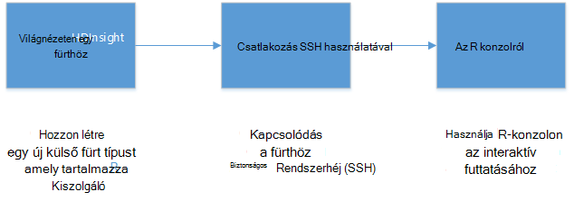

## Előfeltételek

* __Az Azure-előfizetés__: Ebben az oktatóanyagban megkezdése előtt az Azure előfizetéssel kell rendelkeznie. Lásd: [Ismerkedés az Azure ingyenes próbaverziót](https://azure.microsoft.com/documentation/videos/get-azure-free-trial-for-testing-hadoop-in-hdinsight/) további információt.

* __A biztonságos rendszerhéj (SSH) ügyfél__: egy SSH ügyfél használatos távolról a HDInsight fürthöz csatlakozni, és közvetlenül a a fürthöz parancsai futtathatók. Linux, Unix és OS X rendszerben egy SSH ügyfél – adja meg a `ssh` parancsot. A Windows rendszerhez [gitt](http://www.chiark.greenend.org.uk/~sgtatham/putty/download.html)javasoljuk.

    * __(Nem kötelező) SSH kulcsok__: csatlakozzon a jelszó vagy a nyilvános kulcs használatával fürthöz SSH fiók biztonságát. Jelszó használatával könnyebben, és lehetővé teszi, hogy az első lépések a nyilvános és titkos kulcs két; létrehozása nélkül egy billentyűje segítségével azonban még biztonságosabbá.
    
        A dokumentum ismertetett lépések feltételezik, hogy a jelszót használja-e. Hogyan hozhat létre és SSH billentyűk használata HDInsight a további tudnivalókért lásd a következő dokumentumokat:
        
        * [HDInsight Linux, Unix vagy OS X ügyfelektől érkező SSH használata](hdinsight-hadoop-linux-use-ssh-unix.md)
        
        * [Windows-ügyfelek HDInsight SSH használata](hdinsight-hadoop-linux-use-ssh-windows.md)

### Access-ellenőrzési követelmények

[AZURE.INCLUDE [access-control](../../includes/hdinsight-access-control-requirements.md)]

## A csoport létrehozása

> [AZURE.NOTE] A lépéseket a jelen dokumentum létrehozása egyszerű konfigurációs információk alapján HDInsight-R-kiszolgáló. Egyéb fürt beállításait (például további tárterület-fiókok felvétele, az Azure virtuális hálózaton keresztül, vagy egy metastore létrehozása a struktúra) olvassa el a [HDInsight létrehozása Linux-alapú fürt](hdinsight-hadoop-provision-linux-clusters.md)című témakört.

1. Jelentkezzen be az [Azure-portálon](https://portal.azure.com).

2. Jelölje be az __Új__, __adatok + Analytics__, majd __hdinsight szolgáltatásból lehetőségre__.

    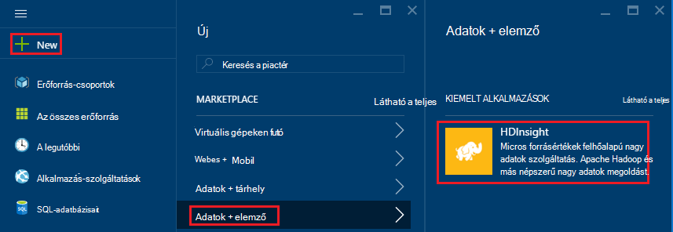

3. Írja be a csoport nevét a __Fürt neve__ mezőbe. Ha több Azure előfizetéssel rendelkezik, az __előfizetés__ bejegyzés használata jelölje ki a használni kívánt.

    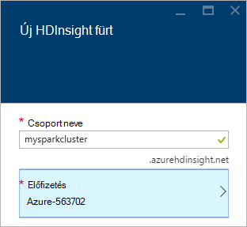

4. Jelölje ki a __fürt adja__. A __Fürt írja be__ a lap válassza ki a következő beállításokat:

    * __Fürt típus__: a külső kiszolgáló R
    
    * __Réteg fürt__: prémium verzió

    A többi beállítást hagyja meg az alapértelmezett értékeket, majd a __Kijelölés__ gombra kattintva fürt típusa mentése.
    
    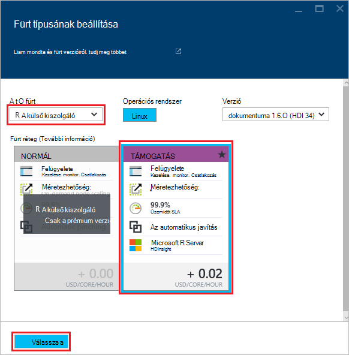
    
    > [AZURE.NOTE] Is hozzáadhat a R-kiszolgáló más HDInsight fürt típusú (például Hadoop vagy HBase,), az fürt kiválasztása, és válassza a __prémium__.

5. Válassza ki a meglévő erőforrás csoportok listáját, és válassza a az esetet hozza létre az **Erőforráscsoport** . Vagy válassza ki az **Új létrehozása** , és írja be az új erőforráscsoport a nevét. Egy zöld pipa jelzi, hogy az új csoport nevének elérhető fog megjelenni.

    > [AZURE.NOTE] Ez a bejegyzés fog alapértelmezés szerint egy meglévő erőforrás csoportot, ha ilyen.
    
    Mentse az erőforráscsoport használatával a __Kijelölés__ gombra.

6. Jelölje be a **hitelesítő adatait**, majd adja meg a **Fürt bejelentkezési felhasználónév** és **Fürt bejelentkezési jelszavát**.

    Adjon meg egy __SSH felhasználónév__.  A __Biztonságos rendszerhéj (SSH)__ ügyfélprogram fürt távolról csatlakozhat SSH használják. A SSH felhasználó vagy adja meg, ezt a párbeszédpanelt, vagy a fürt létrehozása (a beállítás lapon a fürt) után. R-kiszolgáló számíthat, egy "remoteuser" __SSH felhasználónév__ van beállítva.  Ha egy másik felhasználónév használja, be kell egy további lépés végrehajtása, a csoport létrehozását követően.
    
    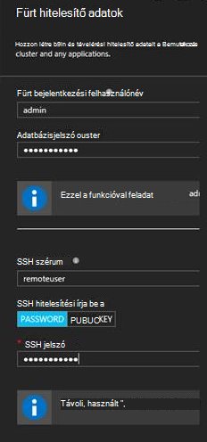

    __SSH hitelesítés típusa__: jelölje be a __JELSZÓT__ a hitelesítés típusa kivéve, ha inkább egy nyilvános kulcs használatát.  Nyilvános és titkos kulcs két szüksége lesz, ha szeretné, hogy a távoli ügyfélprogram, például RTVS, RStudio vagy más asztali IDE keresztül fürt R-kiszolgáló elérésére.   

    A nyilvános és titkos kulcs pár jelölje be a "Nyilvános kulcs", és folytassa az alábbi képlettel történik használatával hozhat létre.  Ezeket az utasításokat feltételezik, hogy Cygwin ssh-keygen vagy azzal egyenértékű telepítve.

    -    Nyilvános és titkos kulcs két készítése a parancssorból a laptopján:
      
            ssh-keygen - t rsa -b 2048 – f < titkos kulcs, fájlnév >
      
    -    Ez a művelet létrehoz egy privát kulcs fájlt és egy nyilvános kulcs csoportjában a név < titkos kulcs, fájlnév > .pub pl.  davec és davec.pub.  Adja meg a nyilvános kulcs fájlt (* .pub) HDI fürt hitelesítő adatok hozzárendelése során:
      
        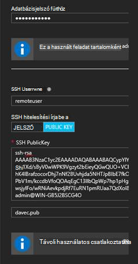  
      
    -    A magánjellegű keyfile a laptopján engedélyeinek módosítása
      
            600 < titkos kulcs, fájlnév > chmod
      
    -    Használata a titkos kulcs fájl SSH távoli bejelentkezés, például
      
            ssh – i < titkos kulcs, fájlnév >remoteuser@<hostname public ip>
      
      vagy rész meghatározása a külső Hadoop számítási környezetben R Server az ügyfélszámítógépen (lásd: Microsoft R Server használatával egy Hadoop-ügyfél [RevoScaleR Hadoop külső használatába bevezető útmutató](https://msdn.microsoft.com/microsoft-r/scaler-spark-getting-started)online [létrehozása egy külső kiszámítania környezetben](https://msdn.microsoft.com/microsoft-r/scaler-spark-getting-started#creating-a-compute-context-for-spark) szakaszában.)

7. Jelölje be az **Adatforrás** -jelöljön ki egy adatforrást a fürt. Jelöljön ki egy meglévő tárterület-fiókot __Jelölje ki a tárterület-fiókot__ , majd gomb kiválasztásával a fiókot vagy hozzon létre egy új fiókot __Új__ hivatkozás szakaszában __Jelölje be a tárterület-fiók__ használatával.

    Válassza az __Új__, ha egy nevet az új tárterület-fiókot kell megadnia. Egy zöld színű pipa jel fog megjelenni, ha elfogadja a nevét.

    Az __Alapértelmezett tároló__ alapértelmezés szerint a csoport nevére. Hagyja üresen a értékként.
    
    Válassza ki a __helyet__ a régió, a tárterület-fiók létrehozásához jelölje ki.
    
    > [AZURE.IMPORTANT] Az alapértelmezett adatforrás helyének kiválasztása a HDInsight fürt helyét is beállíthat. A fürt és az alapértelmezett adatforrás ugyanabban a régióban kell lennie.

    A **Kijelölés** gombra az adatforrás konfigurációját mentse használatával.
    
    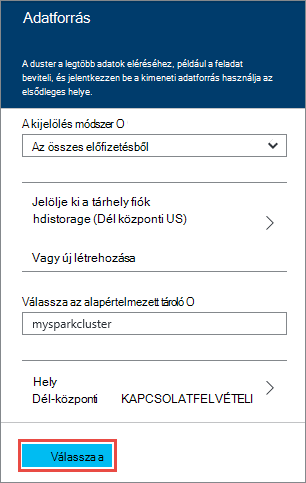

8. Jelölje ki a **Csomópont árak rétegek** létrejön a fürt csomópontok kapcsolatos információk megjelenítéséhez. Ha tudja, hogy szüksége van egy nagyobb fürt, hagyja dolgozó csomópontok számának az alapértelmezett `4`. A becsült költsége a fürt belül a lap jelenik meg.

    > [AZURE.NOTE] Ha szükséges, a fürt a portálon keresztül később újra méretét (fürt-beállítások > -> skála fürt) növeléséhez vagy csökkentéséhez dolgozó csomópontok számának.  Ez a fürt használaton lefelé üresjárati, illetve kapacitása ahhoz, hogy az igényeknek megfelelően a nagyobb tevékenységek hozzáadása hasznos lehet.

    Néhány szem előtt kell tartani a fürt, az adatok csomópontok és a szegély csomópont osztályozás tényezők az alábbiak:  
   
    - A külső elosztott R kiszolgáló elemzések teljesítményének adata nagy esetén dolgozó csomópontok számának arányos.  
    - R-kiszolgáló elemzések teljesítményének lineáris elemezni adatok mérete. Példa:  
        - Kicsi, mérsékelt adatok esetén teljesítmény legjobban, ha a szegély csomópontra helyi számítási környezetben elemzett lesz.  További információt az esetek, amelyek szerint a helyi és a külső számítási környezetek működnek a legjobban a HDInsight számítási helyi beállítások R Server című cikkben olvashat. 
        - Ha jelentkezzen be a szegély csomópontot, és futtassa az R parancsfájl van, akkor az összes, de a ScaleR rx függvények az él csomóponton <strong>helyileg</strong> végrehajtása úgy a memória és a biztonsági a csomópont magmintákat a célszerű lehet méretű ennek megfelelően. Ugyanez érvényes, ha R kiszolgálót használ a HDI távoli számítási környezetben, a hordozható számítógépről.
    
    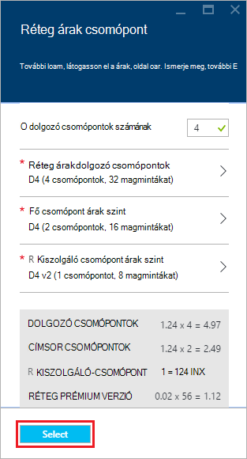

    Mentse a konfigurációs árak csomópont használatával a **Kijelölés** gombra.
    
9. Az **Új HDInsight fürt** lap győződjön meg arról, hogy be van jelölve **Startboard PIN-kód** , és válassza a **Create**. Ezzel a fürt létrehozása és hozzáadása a mozaik, az Azure portálja Startboard. Az ikon jelzi, hogy a fürt hoz létre, és a HDInsight ikont jeleníti meg, létrehozási befejeződése után.

  	| Létrehozásakor | Teljes létrehozása |
  	| ------------------ | --------------------- |
  	|  |  |

    > [AZURE.NOTE] Egy kis időt, a fürt hozható létre, általában körülbelül 15 percet fog tartani. Ellenőrizheti a létrehozási folyamat használata a Startboard vagy a lap bal szélén lévő **értesítések** tétel a csempére.

## A kiszolgáló R él csomópont csatlakoztatása

R-kiszolgáló él csomópontot a HDInsight fürt SSH használatával csatlakozhat:

    ssh USERNAME@r-server.CLUSTERNAME-ssh.azurehdinsight.net
    
> [AZURE.NOTE] Megtalálhatja a `R-Server.CLUSTERNAME-ssh.azurehdinsight.net` cím az Azure-portálon a fürt, majd a __Minden elérhető beállítás__, az __alkalmazások__és a __RServer__kiválasztásával. Ekkor megjelenik a biztonsági csomópontot SSH végpont adatait.
>
> 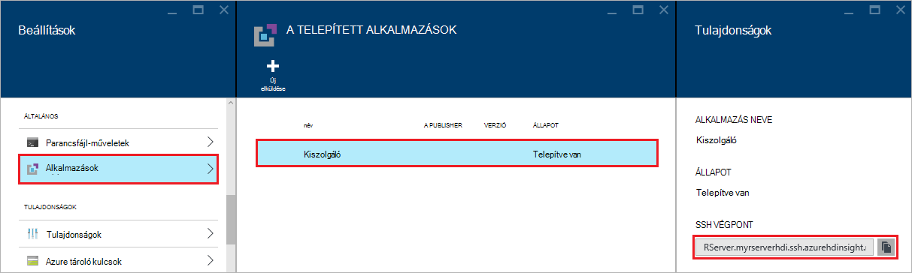
    
Ha a használt jelszót secure SSH fiókját, a rendszer kéri, adja meg. Nyilvános kulccsal használatakor előfordulhat, hogy akkor alkalmazza a `-i` paraméterrel adja meg a megfelelő titkos kulcs. Ha például `ssh -i ~/.ssh/id_rsa USERNAME@R-Server.CLUSTERNAME-ssh.azurehdinsight.net`.
    
További tájékoztatást a Linux-alapú HDInsight SSH használja az alábbi cikkekben talál:

* [A HDInsight Linux, Unix vagy OS X Linux-alapú Hadoop SSH használata](hdinsight-hadoop-linux-use-ssh-unix.md)

* [A Windows HDInsight Linux-alapú Hadoop SSH használata](hdinsight-hadoop-linux-use-ssh-windows.md)

Miután létrejött, akkor az alábbihoz hasonló parancssorba érkezik.

    username@ed00-myrser:~$

## Az R konzolról

1. A SSH munkamenetből a következő parancs használatával indítsa el a R konzolt.

        R
    
    Ekkor megjelenik az alábbihoz hasonló eredményt ad.
    
        R version 3.2.2 (2015-08-14) -- "Fire Safety"
        Copyright (C) 2015 The R Foundation for Statistical Computing
        Platform: x86_64-pc-linux-gnu (64-bit)

        R is free software and comes with ABSOLUTELY NO WARRANTY.
        You are welcome to redistribute it under certain conditions.
        Type 'license()' or 'licence()' for distribution details.

        Natural language support but running in an English locale

        R is a collaborative project with many contributors.
        Type 'contributors()' for more information and
        'citation()' on how to cite R or R packages in publications.

        Type 'demo()' for some demos, 'help()' for on-line help, or
        'help.start()' for an HTML browser interface to help.
        Type 'q()' to quit R.

        Microsoft R Server version 8.0: an enhanced distribution of R
        Microsoft packages Copyright (C) 2016 Microsoft Corporation

        Type 'readme()' for release notes.

        >

2. Az a `>` kérdés, R kódot adhat meg. R-kiszolgáló csomagokat, amelyek lehetővé teszik egyszerűen Hadoop másokkal, és futtassa a elosztott számítások tartalmazza. Például a következő paranccsal az alapértelmezett fájlrendszer a HDInsight fürt legfelső szintű megtekintéséhez.

        rxHadoopListFiles("/")
    
    A WASB stílus megcímezheti is használhatja.
    
        rxHadoopListFiles("wasbs:///")

## A Microsoft R kiszolgáló vagy Microsoft R ügyfél távoli példányából HDI R-kiszolgáló használata

A csoport fölött nyilvános és titkos kulcs párban a fürt eléréséhez az vonatkozó használati ajánlatos beállítási elérésének az HDI Hadoop külső számítási környezetben Microsoft R Server vagy a Microsoft R ügyfél asztali számítógépen vagy laptopon futtató távoli példányából (lásd: Microsoft R Server használatával [RevoScaleR Hadoop külső használatába bevezető útmutató](https://msdn.microsoft.com/microsoft-r/scaler-spark-getting-started)online [létrehozása egy külső kiszámítania környezetben](https://msdn.microsoft.com/microsoft-r/scaler-spark-getting-started#creating-a-compute-context-for-spark) részében Hadoop ügyfélszámítógépeken).  Adja meg, az alábbi lehetőségek a RxSpark megadásakor számítja ki a laptopján környezetben kell ehhez: hdfsShareDir, shareDir, sshUsername, sshHostname, sshSwitches, és sshProfileScript. Példa:

    
    myNameNode <- "default"
    myPort <- 0 
 
    mySshHostname  <- 'rkrrehdi1-ssh.azurehdinsight.net'  # HDI secure shell hostname
    mySshUsername  <- 'remoteuser'# HDI SSH username
    mySshSwitches  <- '-i /cygdrive/c/Data/R/davec'   # HDI SSH private key
 
    myhdfsShareDir <- paste("/user/RevoShare", mySshUsername, sep="/")
    myShareDir <- paste("/var/RevoShare" , mySshUsername, sep="/")
 
    mySparkCluster <- RxSpark(
      hdfsShareDir = myhdfsShareDir,
      shareDir     = myShareDir,
      sshUsername  = mySshUsername,
      sshHostname  = mySshHostname,
      sshSwitches  = mySshSwitches,
      sshProfileScript = '/etc/profile',
      nameNode     = myNameNode,
      port         = myPort,
      consoleOutput= TRUE
    )

    
 
## A számítási környezet használata

Számítási környezetben lehetővé teszi, hogy e kiszámítása fog történni helyileg a szegély csomópontra, illetve e azt fogja legyen elosztva a HDInsight fürt csomópontok szabályozható.
        
1. A R konzolról a következő használatával az alapértelmezett tároló HDInsight-Példaadatok betöltése.

        # Set the HDFS (WASB) location of example data
        bigDataDirRoot <- "/example/data"
        # create a local folder for storaging data temporarily
        source <- "/tmp/AirOnTimeCSV2012"
        dir.create(source)
        # Download data to the tmp folder
        remoteDir <- "http://packages.revolutionanalytics.com/datasets/AirOnTimeCSV2012"
        download.file(file.path(remoteDir, "airOT201201.csv"), file.path(source, "airOT201201.csv"))
        download.file(file.path(remoteDir, "airOT201202.csv"), file.path(source, "airOT201202.csv"))
        download.file(file.path(remoteDir, "airOT201203.csv"), file.path(source, "airOT201203.csv"))
        download.file(file.path(remoteDir, "airOT201204.csv"), file.path(source, "airOT201204.csv"))
        download.file(file.path(remoteDir, "airOT201205.csv"), file.path(source, "airOT201205.csv"))
        download.file(file.path(remoteDir, "airOT201206.csv"), file.path(source, "airOT201206.csv"))
        download.file(file.path(remoteDir, "airOT201207.csv"), file.path(source, "airOT201207.csv"))
        download.file(file.path(remoteDir, "airOT201208.csv"), file.path(source, "airOT201208.csv"))
        download.file(file.path(remoteDir, "airOT201209.csv"), file.path(source, "airOT201209.csv"))
        download.file(file.path(remoteDir, "airOT201210.csv"), file.path(source, "airOT201210.csv"))
        download.file(file.path(remoteDir, "airOT201211.csv"), file.path(source, "airOT201211.csv"))
        download.file(file.path(remoteDir, "airOT201212.csv"), file.path(source, "airOT201212.csv"))
        # Set directory in bigDataDirRoot to load the data into
        inputDir <- file.path(bigDataDirRoot,"AirOnTimeCSV2012") 
        # Make the directory
        rxHadoopMakeDir(inputDir)
        # Copy the data from source to input
        rxHadoopCopyFromLocal(source, bigDataDirRoot)

2. Ezután nézzük bizonyos adatok információ létrehozása, valamint definiálhatók a két adatforrásokhoz, így akkor is dolgozhat az adatokkal.

        # Define the HDFS (WASB) file system
        hdfsFS <- RxHdfsFileSystem()
        # Create info list for the airline data
        airlineColInfo <- list(
            DAY_OF_WEEK = list(type = "factor"),
            ORIGIN = list(type = "factor"),
            DEST = list(type = "factor"),
            DEP_TIME = list(type = "integer"),
            ARR_DEL15 = list(type = "logical"))

        # get all the column names
        varNames <- names(airlineColInfo)

        # Define the text data source in hdfs
        airOnTimeData <- RxTextData(inputDir, colInfo = airlineColInfo, varsToKeep = varNames, fileSystem = hdfsFS)
        # Define the text data source in local system
        airOnTimeDataLocal <- RxTextData(source, colInfo = airlineColInfo, varsToKeep = varNames)

        # formula to use
        formula = "ARR_DEL15 ~ ORIGIN + DAY_OF_WEEK + DEP_TIME + DEST"

3. Vegyük futtassa a használata a helyi adatok felett egy logisztikus regresszió helyi számítja ki.

        # Set a local compute context
        rxSetComputeContext("local")
        # Run a logistic regression
        system.time(
            modelLocal <- rxLogit(formula, data = airOnTimeDataLocal)
        )
        # Display a summary 
        summary(modelLocal)

    Ekkor megjelennek a kimeneti végződő vonal, az alábbihoz hasonló.

        Data: airOnTimeDataLocal (RxTextData Data Source)
        File name: /tmp/AirOnTimeCSV2012
        Dependent variable(s): ARR_DEL15
        Total independent variables: 634 (Including number dropped: 3)
        Number of valid observations: 6005381
        Number of missing observations: 91381
        -2*LogLikelihood: 5143814.1504 (Residual deviance on 6004750 degrees of freedom)

        Coefficients:
                        Estimate Std. Error z value Pr(>|z|)
        (Intercept)   -3.370e+00  1.051e+00  -3.208  0.00134 **
        ORIGIN=JFK     4.549e-01  7.915e-01   0.575  0.56548
        ORIGIN=LAX     5.265e-01  7.915e-01   0.665  0.50590
        ......
        DEST=SHD       5.975e-01  9.371e-01   0.638  0.52377
        DEST=TTN       4.563e-01  9.520e-01   0.479  0.63172
        DEST=LAR      -1.270e+00  7.575e-01  -1.676  0.09364 .
        DEST=BPT         Dropped    Dropped Dropped  Dropped
        ---
        Signif. codes:  0 ‘***’ 0.001 ‘**’ 0.01 ‘*’ 0.05 ‘.’ 0.1 ‘ ’ 1

        Condition number of final variance-covariance matrix: 11904202
        Number of iterations: 7

4. Vegyük futtassa a külső környezet használatával ugyanazon logisztikus regresszió Tovább gombra. A külső helyi fog terjesztése feldolgozása a HDInsight fürt dolgozó csomópontok fölé.

        # Define the Spark compute context 
        mySparkCluster <- RxSpark()
        # Set the compute context 
        rxSetComputeContext(mySparkCluster)
        # Run a logistic regression 
        system.time(  
            modelSpark <- rxLogit(formula, data = airOnTimeData)
        )
        # Display a summary
        summary(modelSpark)

    > [AZURE.NOTE] MapReduce segítségével elosztása számítási fürt csomópontot. További információt a számítási környezetben olvassa el a [számítja ki a környezet beállításainak HDInsight prémium R-kiszolgálón](hdinsight-hadoop-r-server-compute-contexts.md)című témakört.

## R-kódot több csomópontok az terjesztése

R-kiszolgálóval egyszerűen készíthet a meglévő R kódot és futtatása a fürt több csomópontok keresztül használatával `rxExec`. Ez akkor hasznos, ha a paraméter takarítás vagy szimulációk módon. Az alábbi képen használata `rxExec`.

    rxExec( function() {Sys.info()["nodename"]}, timesToRun = 4 )
    
A külső vagy MapReduce környezet továbbra is használja, ha ez ad eredményül a dolgozó csomópontok csomópontnév érték, amely a kód (`Sys.info()["nodename"]`) program futtatta. Például a négy csomópont fürthöz, jelenhet meg az alábbihoz hasonló eredményt ad.

    $rxElem1
        nodename
    "wn3-myrser"

    $rxElem2
        nodename
    "wn0-myrser"

    $rxElem3
        nodename
    "wn3-myrser"

    $rxElem4
        nodename
    "wn3-myrser"

## R-csomagok telepítése

Ha szeretné, hogy további R csomagok telepítése a szegély csomópontot, `install.packages()` közvetlenül az R belül konzol, ha a szegély csomópont SSH keresztül csatlakozik. Ha k csomagok telepítése a fürt dolgozó csomópontok kell egy parancsfájl műveletet kell használnia.

Parancsfájl-műveletek a HDInsight fürthöz beállításainak módosítása, illetve külön szoftver telepítése használt Bash parancsfájlok. Ebben az esetben további R telepítéséhez csomagok. A parancsprogram művelettel további csomagokat telepítéséhez kövesse az alábbi lépéseket.

> [AZURE.IMPORTANT] További R csomagok telepítése a parancsfájl-műveletek segítségével csak akkor használható a csoport létrehozását követően. Meg kell nem használható fürt létrehozása során a parancsfájl támaszkodik R kiszolgáló éppen teljesen telepítette és beállította.

1. Az [Azure portál](https://portal.azure.com)jelölje ki a HDInsight fürt R-kiszolgálón.

2. Válassza a fürt lap __Összes beállítások ikonra__, majd a __Parancsfájl-műveletek__. A __Parancsfájl-műveletek__ lap __Új elküldése__ új parancsfájl művelet küldhetik jelölje ki.

    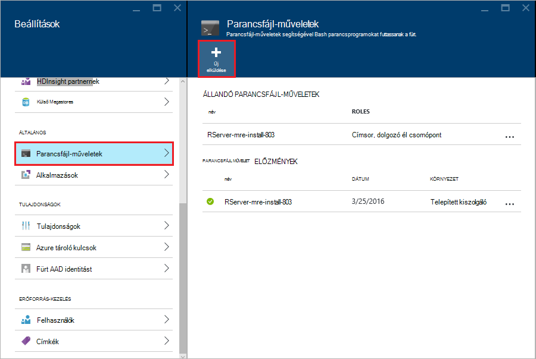

3. A __Küldés parancsfájl műveletet__ a lap adjon meg az alábbi információkat.

  - __Név__: egy rövid nevet, a parancsfájl azonosítása
  - __Parancsfájl URI bash__:`http://mrsactionscripts.blob.core.windows.net/rpackages-v01/InstallRPackages.sh`
  - __Címsor__: Ez legyen __bejelölve__
  - __Dolgozó__: Ez legyen __bejelölve__
  - __Zookeeper__: Ez legyen __bejelölve__
  - __Paraméterek__: az R csomagokat kell telepíteni. Ha például`bitops stringr arules`
  - __Kódegyeztetés-megőrzési a parancsfájlt …__: Ez legyen __bejelölve__  

    > [AZURE.NOTE] 1. a alapértelmezés szerint minden R csomagon projektjeibe, és a Microsoft MRAN tárházba követik verziójának R, hogy telepítve van a telepítve van.  Ha szeretné telepíteni csomagok újabb változatát, majd kompatibilitási néhány kockázata, azonban ez akkor lehetséges megadásával `useCRAN` , például a az első elemet a csomag listája  `useCRAN bitops, stringr, arules`.  
    > 2. Néhány R csomag esetén kell további Linux rendszerben tárak. Kényelmesebbé hogy előre telepítette a függőségeket, szükség szerint a legfelső 100 legnépszerűbb R csomagok. Jó helyen jár Ha a K-csomagok telepítése túl az ezek tárak kér, ezután kell töltse le az alap parancsfájl, használja az alábbi, és adja hozzá a lépések követésével telepítse a rendszer tárak. Meg kell töltse fel a módosított parancsprogramot nyilvános blob-tárolóhoz Azure-tárolóban lévő, majd a csomagok telepítése a módosított parancsfájl használatával.
    > Parancsfájl-műveletek fejlesztésével további tudnivalókért lásd: [fejlesztési parancsfájl műveletet](hdinsight-hadoop-script-actions-linux.md).  

    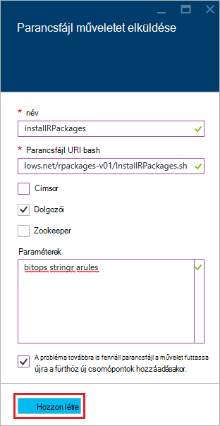

4. Válassza a __Create__ futtatása. Ha befejeződött a parancsfájlt, R csomagok érhetők el minden dolgozó csomóponton.
    
## Következő lépések

Most, hogy megismeri hogyan hozhat létre egy új HDInsight fürt, amely tartalmazza az R-kiszolgáló és a R konzolon egy SSH munkamenetből alapjait, használja az alábbi felderítésére, más módokon R HDInsight-kiszolgálón való használatáról.

- [Adja hozzá a RStudio kiszolgálót HDInsight-támogatás](hdinsight-hadoop-r-server-install-r-studio.md)

- [R-kiszolgáló beállításai helyi HDInsight prémium kiszámítása](hdinsight-hadoop-r-server-compute-contexts.md)

- [HDInsight prémium R Server Azure tárhely beállításai](hdinsight-hadoop-r-server-storage.md)

### Azure erőforrás-kezelő sablonok

Ha érdekli a R sablonokkal az erőforrás-kezelő Azure HDInsight-kiszolgálón létrehozásának automatizálása, lásd: az alábbi példa sablonok.

* [Hozzon létre egy R-kiszolgáló HDInsight fürt egy SSH nyilvános kulccsal](http://go.microsoft.com/fwlink/p/?LinkID=780809)
* [Hozzon létre egy R-kiszolgáló HDInsight fürt egy SSH jelszót használja a](http://go.microsoft.com/fwlink/p/?LinkID=780810)

Mindkét sablonok hozzon létre egy új HDInsight fürt és a kapcsolódó tárterület-fiókot, és az Azure CLI, Azure PowerShell vagy az Azure-portálon is használható.

Azure erőforrás-kezelő sablonok használatával kapcsolatos általános tudnivalókért olvassa el a [Hadoop létrehozása Linux-alapú fürtök sablonokkal az erőforrás-kezelő Azure hdinsight szolgáltatáshoz a](hdinsight-hadoop-create-linux-clusters-arm-templates.md)című témakört.
