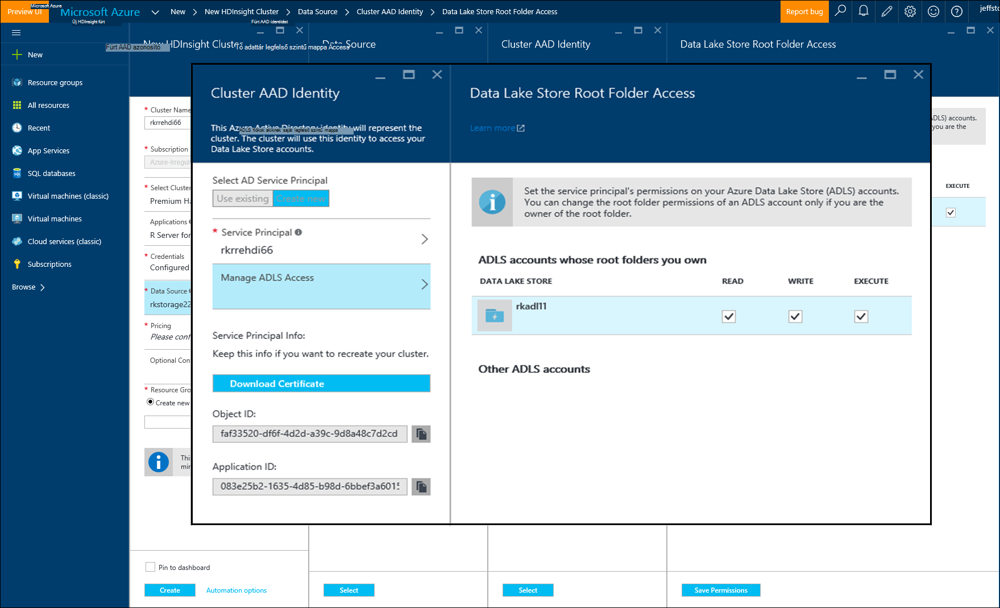

<properties
   pageTitle="Azure adattárolásra vonatkozó beállításain R Server (előzetes verzió) HDInsight a |} Microsoft Azure"
   description="További tudnivalók a HDInsight (előzetes verzió) felhasználója, R-kiszolgálóval különböző tároló beállítások:"
   services="HDInsight"
   documentationCenter=""
   authors="jeffstokes72"
   manager="jhubbard"
   editor="cgronlun"
/>

<tags
   ms.service="HDInsight"
   ms.devlang="R"
   ms.topic="article"
   ms.tgt_pltfrm="na"
   ms.workload="data-services"
   ms.date="09/01/2016"
   ms.author="jeffstok"
/>

# <a name="azure-storage-options-for-r-server-on-hdinsight-preview"></a>Azure adattárolásra vonatkozó beállításain R kiszolgáló a HDInsight (előzetes verzió)

A Microsoft R Server (előzetes verzió) HDInsight fér hozzá mindkét Azure Blob és [Azure tó adattárolás](https://azure.microsoft.com/services/data-lake-store/)adatait, kódot, eszközként objektumok elemzés eredménye, és így tovább.

A Hadoop fürtre létrehozásakor a HDInsight Azure tároló fiók adja meg. Az adott fiókból adott Blob tároló tároló a fürt (például a Hadoop Distributed File System) hoz létre a fájlrendszer tárolja. A HDInsight fürt teljesítmény célokra megadott elsődleges tároló fiókként az azonos adatközpont jön létre. További információ a [Azure blobtárolóhoz használata a HDInsight](hdinsight-hadoop-use-blob-storage.md "Azure blobtárolóhoz használata a HDInsight")című témakör.   


## <a name="use-multiple-azure-blob-storage-accounts"></a>Több Azure Blob-tároló fiókok használata

Ha szükséges, több Azure tároló ügyfelek vagy tárolók elérheti a HDI fürthöz. Ha igen, meg kell adni a további tárterület-fiókok felhasználói felület hozza létre, és kövesse ezeket a lépéseket a j használhatja őket  

1.  Hozzon létre egy HDInsight fürthöz **storage1** és **container1**nevű alapértelmezett tároló tároló fiók nevét.
2. Adjon meg egy **storage2**nevű további tárterületet fiókot.  
3. A mycsv.csv a /share könyvtár másolhatja, és hajtsa végre az elemzés a fájlhoz.  

    ````
    hadoop fs –mkdir /share
    hadoop fs –copyFromLocal myscsv.scv /share  
    ````

3.  R kódban állítsuk be a név csomópontot **alapértelmezés szerint** , és adja meg a könyvtár és a fájl feldolgozása.  

    ````
    myNameNode <- "default"
    myPort <- 0
    ````

  Az adatok helyét:  

    bigDataDirRoot <-"/ share"  

  A külső számítási környezet meghatározása:

    mySparkCluster <-RxSpark(consoleOutput=TRUE)

  Számítási környezet beállítása:

    rxSetComputeContext(mySparkCluster)

  A Hadoop elosztott fájl rendszer (hdfs) lehetőségre fájlrendszer meghatározása:

    hdfsFS <-RxHdfsFileSystem (hostname (állomásnév) = myNameNode, port = myPort)

  Adja meg a bemeneti fájl Fájlrendszerhez elemzéséhez:

    bemeneti_fájl <-file.path(bigDataDirRoot,"mycsv.csv")

Az összes a könyvtár és a fájl hivatkozást mutasson a tárterület-fiók wasbs://container1@storage1.blob.core.windows.net. Ez az **alapértelmezett tárterület-fiókot** , amely a HDInsight fürt van társítva.

Most tegyük fel, hogy a /private szereplő mySpecial.csv nevű fájl feldolgozása a **container2** **storage2**a címtár.

R kódban mutasson a név csomópont hivatkozás **storage2** tárterület-fiókba.

    myNameNode <- "wasbs://container2@storage2.blob.core.windows.net"
    myPort <- 0

  Az adatok helyét:

    bigDataDirRoot <- "/private"

  A külső számítási környezet meghatározása:

    mySparkCluster <- RxSpark(consoleOutput=TRUE, nameNode=myNameNode, port=myPort)

  Számítási környezet beállítása:

    rxSetComputeContext(mySparkCluster)

  Adja meg a fájlrendszerben Fájlrendszerhez:

    hdfsFS <- RxHdfsFileSystem(hostName=myNameNode, port=myPort)

  Adja meg a bemeneti fájl Fájlrendszerhez elemzéséhez:

    inputFile <-file.path(bigDataDirRoot,"mySpecial.csv")

Az összes a könyvtár és a fájl hivatkozást most mutasson a tárterület-fiók wasbs://container2@storage2.blob.core.windows.net. Ez a megadott **Név csomópontot** .

Jegyzet, hogy be kell konfigurálni/User/RevoShare/<SSH username> könyvtár a **storage2** az alábbiak szerint:

    hadoop fs -mkdir wasbs://container2@storage2.blob.core.windows.net/user
    hadoop fs -mkdir wasbs://container2@storage2.blob.core.windows.net/user/RevoShare
    hadoop fs -mkdir wasbs://container2@storage2.blob.core.windows.net/user/RevoShare/<RDP username>

## <a name="use-an-azure-data-lake-store"></a>Az Azure adatok tó tár használata

A HDInsight-fiók adatok tó áruház használatához kell a fürtkörnyezetben hozzáférési engedély minden, amely a használni kívánt Azure adatok tó áruházból. A tár a használhatja az R parancsfájl sokkal, mint a másodlagos tárterület-fiók használata (leírtak szerint az előző eljárás).

## <a name="add-cluster-access-to-your-azure-data-lake-stores"></a>Az Azure adatok tó tárolja fürtkörnyezetben hozzáférési hozzáadása

Adatok tó üzlet az Azure Active Directory (Azure Active Directory) szolgáltatás egyszerű, amely a HDInsight fürt van társítva használatával érheti el.

### <a name="to-add-a-service-principal"></a>A szolgáltatás rendszerbiztonsági tag hozzáadása
1. A HDInsight fürt létrehozásakor **Fürt AAD identitás** az **Adatforrás** lapon válassza ki.
2. A **Fürt AAD identitás** párbeszédpanelen csoportban **Jelölje be az Active Directory szolgáltatás egyszerű**válassza az **Új létrehozása**.

Hozzon létre jelszót, és nevezze el a szolgáltatás egyszerű, után egy új lap megnyitása hol társíthat a szolgáltatás egyszerű az adatok tó tárolja

Megjegyzés:, hogy is felveheti az access egy tó adatokat tároló később az adatok tó tároló megnyitásával az Azure-portálon, és nyissa meg az **Adatok Explorer** > **Access**.  Következő képen párbeszédpanel, mely szemlélteti, hogyan hozhat létre egy egyszerű, és társíthatja az "rkadl11" adatok tó áruházból.




## <a name="use-the-data-lake-store-with-r-server"></a>Az adatok tó tárolót kell használnia, R-kiszolgálóval
Az access egy adatok tó áruház által ad, felhasználhatja a tároló R Server HDInsight egy másodlagos Azure tároló fiók ugyanúgy. Az egyetlen különbség van, amely az előtag **wasb: / /** módosításaira **adl: / /** az alábbi képlettel történik:

````
# Point to the ADL store (e.g. ADLtest)
myNameNode <- "adl://rkadl1.azuredatalakestore.net"
myPort <- 0

# Location of the data (assumes a /share directory on the ADL account)
bigDataDirRoot <- "/share"  

# Define Spark compute context
mySparkCluster <- RxSpark(consoleOutput=TRUE, nameNode=myNameNode, port=myPort)

# Set compute context
rxSetComputeContext(mySparkCluster)

# Define HDFS file system
hdfsFS <- RxHdfsFileSystem(hostName=myNameNode, port=myPort)

# Specify the input file in HDFS to analyze
inputFile <-file.path(bigDataDirRoot,"AirlineDemoSmall.csv")

# Create factors for days of the week
colInfo <- list(DayOfWeek = list(type = "factor",
               levels = c("Monday", "Tuesday", "Wednesday", "Thursday",
                          "Friday", "Saturday", "Sunday")))

# Define the data source
airDS <- RxTextData(file = inputFile, missingValueString = "M",
                    colInfo  = colInfo, fileSystem = hdfsFS)

# Run a linear regression
model <- rxLinMod(ArrDelay~CRSDepTime+DayOfWeek, data = airDS)
````

Az alábbiakban a parancsok az adatok tó tárterület-fiók beállítása a RevoShare directory címtárral és a minta csv-fájlban vehet fel az előző példában használt:

````
hadoop fs -mkdir adl://rkadl1.azuredatalakestore.net/user
hadoop fs -mkdir adl://rkadl1.azuredatalakestore.net/user/RevoShare
hadoop fs -mkdir adl://rkadl1.azuredatalakestore.net/user/RevoShare/<user>

hadoop fs -mkdir adl://rkadl1.azuredatalakestore.net/share

hadoop fs -copyFromLocal /usr/lib64/R Server-7.4.1/library/RevoScaleR/SampleData/AirlineDemoSmall.csv adl://rkadl1.azuredatalakestore.net/share

hadoop fs –ls adl://rkadl1.azuredatalakestore.net/share
````

## <a name="use-azure-files-on-the-edge-node"></a>A szegély csomópontra Azure-fájlok használata

A kényelmes adatok tárolási lehetőség, használatra a néven [Azure fájlok](../storage/storage-how-to-use-files-linux.md "Azure fájlok")él csomópontra is van. Lehetővé teszi az Azure tároló fájlmegosztás a Linux fájlrendszerben csatlakoztatásához. Az adatfájlok, R parancsfájlok és, ha van ilyesmire lehetőség a natív fájlrendszer használatáról a szegély csomópontot, hanem Fájlrendszerhez később lehet szükség eredmény objektumok tárolása hasznos lehet.

A fő Azure fájlok előnye, hogy az fájlmegosztások csatlakoztatott és bármely rendszer, amely tartalmaz egy, például a Windows vagy Linux rendszerhez támogatott operációs rendszer által használt. Ha például használható más HDInsight fürt, amelynek Ön vagy valaki csapata, az Azure virtuális, vagy akár egy helyszíni rendszer szerint.


## <a name="next-steps"></a>Következő lépések

Most, hogy megismeri egy SSH munkamenetből az R konzolról, és hogyan hozhat létre egy új HDInsight fürt R kiszolgáló tartalmazó alapjait, használja az alábbi hivatkozások felderítésére, más módokon R HDInsight-kiszolgálón való használatáról.

- [A HDInsight R Server – áttekintés](hdinsight-hadoop-r-server-overview.md)
- [Első lépések az R Hadoop-kiszolgálón](hdinsight-hadoop-r-server-get-started.md)
- [Adja hozzá a RStudio kiszolgálót HDInsight-támogatás](hdinsight-hadoop-r-server-install-r-studio.md)
- [R-kiszolgáló beállításai helyi HDInsight kiszámítása](hdinsight-hadoop-r-server-compute-contexts.md)
