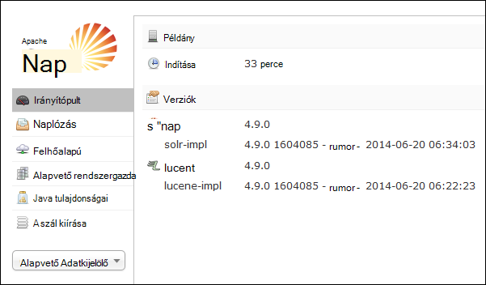
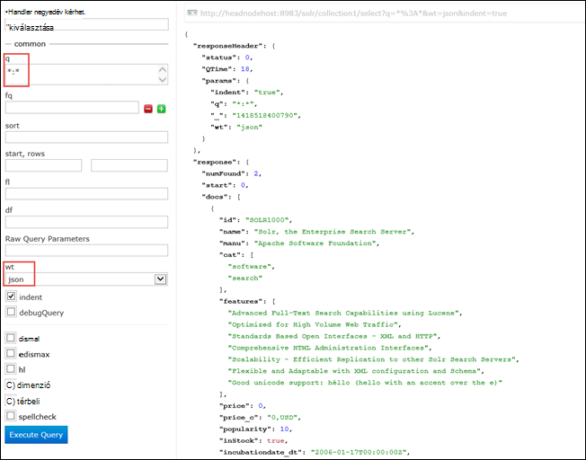

<properties
    pageTitle="Parancsfájl művelettel Solr telepítése Linux-alapú HDInsight |} Microsoft Azure"
    description="Megtudhatja, hogy miként Solr telepítése Linux-alapú HDInsight Hadoop fürt parancsfájl-műveletek használatával."
    services="hdinsight"
    documentationCenter=""
    authors="Blackmist"
    manager="jhubbard"
    editor="cgronlun"
    tags="azure-portal"/>

<tags
    ms.service="hdinsight"
    ms.workload="big-data"
    ms.tgt_pltfrm="na"
    ms.devlang="na"
    ms.topic="article"
    ms.date="10/03/2016"
    ms.author="larryfr"/>

# Telepítése és HDInsight Hadoop fürt Solr használata

Ez a témakör megtanulhatja, hogyan telepítheti az Solr Azure hdinsight szolgáltatáshoz a parancsprogram-műveletével. Egy hatékony keresés platform és a vállalati szintű keresési lehetőségeket biztosít a Hadoop által kezelt adatok Solr. Solr HDInsight fürt telepítése után fogja is megismerheti, hogyan kereshet adatokat Solr használatával.

> [AZURE.NOTE] A dokumentum lépések Linux-alapú HDInsight fürt. A Windows-alapú fürt Solr használja a további tudnivalókért lásd [telepítése és használata Solr a HDinsight Hadoop fürt (Windows)](hdinsight-hadoop-solr-install.md)

Az ebben a témakörben használt mintaparancsfájl Solr fürt létrehoz egy adott konfigurációt. Ha szeretne a Solr fürt állítson be más webhelycsoportok shards, sémák, kópiák, stb, módosítania kell a parancsfájlt és Solr bináris lehetőséget.

## Mi az Solr?

[Apache Solr](http://lucene.apache.org/solr/features.html) egy vállalati keresési platform, amely lehetővé teszi az adatok hatékony teljes szöveges keresés. Hadoop lehetővé teszi, hogy tárolása és kezelése a nagy mennyiségű adatot, miközben a Apache Solr biztosít az adatok gyors beolvasásához a keresési lehetőségeket. Ez a témakör nyújt útmutatást testreszabásával egy HDInsight fürthöz Solr telepítéséhez.

> [AZURE.WARNING] A HDInsight fürt összetevői teljesen támogatott, és Microsoft Support segítséget nyújt azonosíthatók, és az alábbi összetevőket kapcsolatos problémák megoldásához.
>
> Egyéni összetevők, például Solr, akár kereskedelmi célra is lehetővé teszi ügyfélszolgálatunkat, hogy további elhárításában kap. Ez a probléma megoldása vagy kéri, hogy a hol található az adott technológia mély szakértelmét Megnyitás technológiák elérhető csatornák folytasson vezethet. Például vannak sok közösségi webhelyek használható, például: [HDInsight-fórum az MSDN webhelyen](https://social.msdn.microsoft.com/Forums/azure/en-US/home?forum=hdinsight), [http://stackoverflow.com](http://stackoverflow.com). Apache projekteket is projektwebhelyek a [http://apache.org](http://apache.org), például: [Hadoop](http://hadoop.apache.org/).

## Mit jelent a parancsprogram

Ez a parancsfájl módosítja a következő a HDInsight fürthöz:

* Az Solr telepítések`/usr/hdp/current/solr`
* Új felhasználót hoz létre, __solrusr__, amely a Solr szolgáltatás futtatásához használt
* Beállítja a __solruser__ tulajdonosaként`/usr/hdp/current/solr`
* Egy [Upstart](http://upstart.ubuntu.com/) konfiguráció Solr indítja el, ha csomópont újraindul hozzáadása. Solr is automatikusan elindul az fürt csomóponton telepítése után

## Telepítse a Solr parancsfájl-műveletek használata

Solr telepítése egy HDInsight fürthöz mintaparancsfájl érhető el a következő helyen.

    https://hdiconfigactions.blob.core.windows.net/linuxsolrconfigactionv01/solr-installer-v01.sh

Ez a szakasz nyújt útmutatást a mintaparancsfájl használatát, amikor egy új csoport létrehozása az Azure portál használatával. 

> [AZURE.NOTE] Azure PowerShell, az Azure CLI, a HDInsight .NET SDK vagy Azure erőforrás-kezelő sablonokat is használható parancsfájl műveletet. Parancsfájl-műveletek már fut fürt is alkalmazhat. További tudnivalókért lásd: a [parancsprogram-műveleteinek testreszabása HDInsight fürt](hdinsight-hadoop-customize-cluster-linux.md).

1. Indítsa el a kiépítési fürt [rendelkezést Linux-alapú HDInsight fürt](hdinsight-hadoop-create-linux-clusters-portal.md)az lépésekkel, de ne hajtsa végre a kiépítési.

2. Kattintson a **Választható beállítási** lap jelölje be a **Parancsfájl-műveletek**, és az alábbi adatokat:

    * __Név__: Adjon meg egy rövid nevet, a parancsprogram művelet.
    * __Parancsfájl URI__: https://hdiconfigactions.blob.core.windows.net/linuxsolrconfigactionv01/solr-installer-v01.sh
    * __Címsor__: ezt a jelölőnégyzetet
    * __Dolgozó__: ezt a jelölőnégyzetet
    * __ZOOKEEPER__: ezt a jelölőnégyzetet a Zookeeper csomópont telepítése
    * __Paraméterek__: hagyja üresen a mezőt

3. A képernyő alján a **Parancsfájl-műveletek**használja a **Kijelölés** gombot a konfiguráció mentéséhez. Végezetül használhatja a **Kijelölés** gombot a **Választható beállítási** a lap alján a választható konfigurációs adatok mentéséhez.

4. Továbbra is a fürt kiépítési, [rendelkezést Linux-alapú HDInsight fürt](hdinsight-hadoop-create-linux-clusters-portal.md)leírt módon.

## Hogyan használhatom Solr a HDInsight?

### Az indexelési adatok

Kell kezdődnie Solr indexelés az egyes adatfájlok használatával. Az indexelt adatok keresési lekérdezések futtatásához Solr használhatja. Kövesse az alábbi lépéseket néhány példa adatok felvétele Solr, és kattintson a lekérdezés:

1. A HDInsight fürt SSH használatával csatlakozhat:

        ssh USERNAME@CLUSTERNAME-ssh.azurehdinsight.net

    A HDInsight SSH használja a további tudnivalókért lásd: az alábbi:

    * [A HDInsight Linux, Unix vagy OS X Linux-alapú Hadoop SSH használata](hdinsight-hadoop-linux-use-ssh-unix.md)

    * [A Windows HDInsight Linux-alapú Hadoop SSH használata](hdinsight-hadoop-linux-use-ssh-windows.md)

    > [AZURE.IMPORTANT] Lépéseket később a dokumentum helyezése használatára, egy SSL alagutas Solr webes felhasználói felület. Annak érdekében, hogy használja ezeket a lépéseket, egy SSL alagutas létesítsen és beállította a böngésző használatához.
    >
    > További tudnivalókért lásd: a [Használatának SSH Tunneling Ambari webes felület, erőforrás-kezelő, JobHistory, NameNode, Oozie, és más webes Felhasználóifelület-féle eléréséhez](hdinsight-linux-ambari-ssh-tunnel.md)

2. Az alábbi parancsokkal Solr index mintaadatok van:

        cd /usr/hdp/current/solr/example/exampledocs
        java -jar post.jar solr.xml monitor.xml

    A következő kimenet a konzol jelenik meg:

        POSTing file solr.xml
        POSTing file monitor.xml
        2 files indexed.
        COMMITting Solr index changes to http://localhost:8983/solr/update..
        Time spent: 0:00:01.624

    A post.jar segédprogram Solr indexek a két minta dokumentumokat, **solr.xml** és **monitor.xml**. Ezek a __collection1__ belül Solr kerül.

3. A következő használatával lekérdezheti a Solr által elérhetővé tett REST API-val:

        curl "http://localhost:8983/solr/collection1/select?q=*%3A*&wt=json&indent=true"

    A problémák elleni __collection1__ egyező dokumentumokhoz lekérdezés __ \*:\* __ (kódolva \*% 3A\* a lekérdezési karakterláncban), és a válasz, a JSON vissza kell. A válasz jelenjen meg az alábbihoz hasonló:

            "response": {
                "numFound": 2,
                "start": 0,
                "maxScore": 1,
                "docs": [
                  {
                    "id": "SOLR1000",
                    "name": "Solr, the Enterprise Search Server",
                    "manu": "Apache Software Foundation",
                    "cat": [
                      "software",
                      "search"
                    ],
                    "features": [
                      "Advanced Full-Text Search Capabilities using Lucene",
                      "Optimized for High Volume Web Traffic",
                      "Standards Based Open Interfaces - XML and HTTP",
                      "Comprehensive HTML Administration Interfaces",
                      "Scalability - Efficient Replication to other Solr Search Servers",
                      "Flexible and Adaptable with XML configuration and Schema",
                      "Good unicode support: héllo (hello with an accent over the e)"
                    ],
                    "price": 0,
                    "price_c": "0,USD",
                    "popularity": 10,
                    "inStock": true,
                    "incubationdate_dt": "2006-01-17T00:00:00Z",
                    "_version_": 1486960636996878300
                  },
                  {
                    "id": "3007WFP",
                    "name": "Dell Widescreen UltraSharp 3007WFP",
                    "manu": "Dell, Inc.",
                    "manu_id_s": "dell",
                    "cat": [
                      "electronics and computer1"
                    ],
                    "features": [
                      "30\" TFT active matrix LCD, 2560 x 1600, .25mm dot pitch, 700:1 contrast"
                    ],
                    "includes": "USB cable",
                    "weight": 401.6,
                    "price": 2199,
                    "price_c": "2199,USD",
                    "popularity": 6,
                    "inStock": true,
                    "store": "43.17614,-90.57341",
                    "_version_": 1486960637584081000
                  }
                ]
              }

### Solr irányítópultról

A Solr irányítópult egy webhely felhasználói Felületét, amely lehetővé teszi, hogy a webböngészőn keresztül Solr használata. A Solr irányítópult nem közvetlenül az interneten a HDInsight fürt megjelenő, de egy SSH alagutas használatával is elérhető. Egy SSH alagutas használatával kapcsolatos további tudnivalókért lásd: a [Használatának SSH Tunneling Ambari webes felület, erőforrás-kezelő, JobHistory, NameNode, Oozie, és más webes Felhasználóifelület-féle eléréséhez](hdinsight-linux-ambari-ssh-tunnel.md)

Miután egy SSH alagutas hozott létre, kövesse az alábbi lépéseket a Solr irányítópult használata:

1. Az elsődleges headnode a állomásneve meghatározása:

    1. A port 22 fürthöz kapcsolatfelvétel SSH használatával. Ha például `ssh USERNAME@CLUSTERNAME-ssh.azurehdinsight.net` ahol __felhasználónév__ SSH felhasználónevét, __CLUSTERNAME__ pedig a csoport nevére.

        SSH használatával kapcsolatos további tudnivalókért lásd: a következő dokumentumokat:

        * [Linux-alapú HDInsight Linux rendszerhez, a Unix vagy a Mac OS X ügyfélprogramból SSH használata](hdinsight-hadoop-linux-use-ssh-unix.md)

        * [A Windows ügyfélről Linux-alapú HDInsight SSH használata](hdinsight-hadoop-linux-use-ssh-windows.md)
    
    3. A következő paranccsal beszerzése a teljesen minősített hostname (állomásnév):

            hostname -f

        Ez ad vissza egy nevet a következőhöz hasonló:

            hn0-myhdi-nfebtpfdv1nubcidphpap2eq2b.ex.internal.cloudapp.net
    
        A hostname (állomásnév), az alábbi lépéseket kell használni az.
    
1. Csatlakozás a böngészőben __http://HOSTNAME:8983/solr / #/__, ahol __Hostname (állomásnév)__ határozza meg, ha az előző lépésekben nevét. 

    A kérés céltárként jelölik a HDInsight fürt számára a központi csomópontra a SSH alagutas keresztül. Meg kell jelennie egy lapot, az alábbihoz hasonló:

    

2. A bal oldali ablaktábláján használja a **Core Adatkijelölő** legördülő listában jelölje ki a **collection1**. Több tételt kell őket alatt látható __collection1__.

3. A bejegyzések alatt __collection1__kattintson a __lekérdezés__. A Keresés lap kitöltéséhez a következő értékeket használja:

    * A **kérdések** mezőbe írja be a ** \*:**\*. Ez a dokumentumok indexelt szerepelniük Solr. Ha szeretne keresni egy adott karakterlánc belül a dokumentumok, karakterlánc Itt adhatja meg.

    * A **wt** szöveg párbeszédpanelen válassza a kimeneti formátum. **Json**az alapértelmezett érték.

    Végül jelölje be a **Lekérdezés végrehajtása** gombra a keresés pate alján.

    

    A kimenet Solr indexelés használt két dokumentumok adja eredményül. A kimenet az alábbihoz hasonló:

            "response": {
                "numFound": 2,
                "start": 0,
                "maxScore": 1,
                "docs": [
                  {
                    "id": "SOLR1000",
                    "name": "Solr, the Enterprise Search Server",
                    "manu": "Apache Software Foundation",
                    "cat": [
                      "software",
                      "search"
                    ],
                    "features": [
                      "Advanced Full-Text Search Capabilities using Lucene",
                      "Optimized for High Volume Web Traffic",
                      "Standards Based Open Interfaces - XML and HTTP",
                      "Comprehensive HTML Administration Interfaces",
                      "Scalability - Efficient Replication to other Solr Search Servers",
                      "Flexible and Adaptable with XML configuration and Schema",
                      "Good unicode support: héllo (hello with an accent over the e)"
                    ],
                    "price": 0,
                    "price_c": "0,USD",
                    "popularity": 10,
                    "inStock": true,
                    "incubationdate_dt": "2006-01-17T00:00:00Z",
                    "_version_": 1486960636996878300
                  },
                  {
                    "id": "3007WFP",
                    "name": "Dell Widescreen UltraSharp 3007WFP",
                    "manu": "Dell, Inc.",
                    "manu_id_s": "dell",
                    "cat": [
                      "electronics and computer1"
                    ],
                    "features": [
                      "30\" TFT active matrix LCD, 2560 x 1600, .25mm dot pitch, 700:1 contrast"
                    ],
                    "includes": "USB cable",
                    "weight": 401.6,
                    "price": 2199,
                    "price_c": "2199,USD",
                    "popularity": 6,
                    "inStock": true,
                    "store": "43.17614,-90.57341",
                    "_version_": 1486960637584081000
                  }
                ]
              }

### Indítása és leállítása Solr

Ha manuális indítása vagy leállítása Solar van szükség, használja az alábbi parancsokat:

    sudo stop solr

    sudo start solr

## Indexelt adatok biztonsági másolatának

Jó módszer készítsen biztonsági másolatot az indexelt adatokat a Solr fürt csomópontjának Azure Blob-tárolóhoz alakzatot. Végezze el ezt az alábbi lépéseket:

1. Csatlakozzon a fürthöz SSH használatával, majd a központi csomópont host nevének a következő parancsot használja:

        hostname -f
        
2. A következő segítségével az indexelt adatai pillanatképét. __Hostname (állomásnév)__ cserélje ki a nevét, az előző parancs – által eredményül adott:

        curl http://HOSTNAME:8983/solr/replication?command=backup

    Meg kell jelennie egy válasz jelennek meg:

        <?xml version="1.0" encoding="UTF-8"?>
        <response>
          <lst name="responseHeader">
            <int name="status">0</int>
            <int name="QTime">9</int>
          </lst>
          <str name="status">OK</str>
        </response>

2. Ezután módosítsa könyvtárak __/usr/hdp/current/solr/example/solr__. Minden egyes webhelycsoport itt alkönyvtárat lesz. Mindegyik webhelycsoport könyvtár tartalmazza, amely az adott webhelycsoport pillanatképet esetén __adatok__ könyvtárában található.

    Például ha használta a lépések korábbi indexelni a minta dokumentumokat, a __/usr/hdp/current/solr/example/solr/collection1/data__ könyvtár már neveket is tartalmazó nevű könyvtárában __pillanatkép. ##__ a # a esetén a dátum és idő a pillanatkép.

3. Hozzon létre egy tömörített a pillanatkép mappát, az alábbihoz hasonló paranccsal:

        tar -zcf snapshot.20150806185338855.tgz snapshot.20150806185338855

    Ez hoz létre egy új archívum nevű __snapshot.20150806185338855.tgz__, amely tartalmazza a __snapshot.20150806185338855__ könyvtár tartalmát.

3. Ezután tárolhat az archiválás a fürt elsődleges tárolóhoz a következő parancsot:

    hadoop fs - copyFromLocal snapshot.20150806185338855.tgz/példa/adatok

    > [AZURE.NOTE] Hozzon létre egy dedikált könyvtárat Solr pillanatképek tárolására szolgáló érdemes. Ha például `hadoop fs -mkdir /solrbackup`.

Solr biztonsági mentése és visszaállítása használata a további tudnivalókért olvassa el a [készítése és visszaállítása biztonsági másolatait SolrCores](https://cwiki.apache.org/confluence/display/solr/Making+and+Restoring+Backups+of+SolrCores)című témakört.

## Lásd még:

- [Telepítése és használata az fürtök szín a hdinsight szolgáltatásból lehetőségre](hdinsight-hadoop-hue-linux.md). Szín egy webhely felhasználói Felületét, amely egyszerűen hozhat létre, futtatni és mentés malac és a struktúra feladatok, és keresse meg az alapértelmezett tárhely a HDInsight fürt.

- [R telepítése HDInsight fürt][hdinsight-install-r]. Fürt testreszabási segítségével HDInsight Hadoop fürt R telepítése. R-Megnyitás Forrásnyelv és környezet statisztikai számítások. Több száz beépített statisztikai függvények és a saját programnyelv funkcionális és objektumorientált programozáshoz tulajdonságát kombináló biztosít. Teljes körű grafikus funkciókat is tartalmaz.

- [A HDInsight fürt telepítése Giraph](hdinsight-hadoop-giraph-install-linux.md). Fürt testreszabási segítségével HDInsight Hadoop fürt Giraph telepítése. Giraph lehetővé teszi, hogy Hadoop használatával feldolgozása graph végezheti el, és Azure hdinsight szolgáltatáshoz kínál.

- [Szín telepítése HDInsight fürt a](hdinsight-hadoop-hue-linux.md). Fürt testreszabási segítségével HDInsight Hadoop fürt szín telepítése. Szín webalkalmazások kezelése a Hadoop fürtre használt áll.

[hdinsight-install-r]: hdinsight-hadoop-r-scripts-linux.md
[hdinsight-cluster-customize]: hdinsight-hadoop-customize-cluster-linux.md
