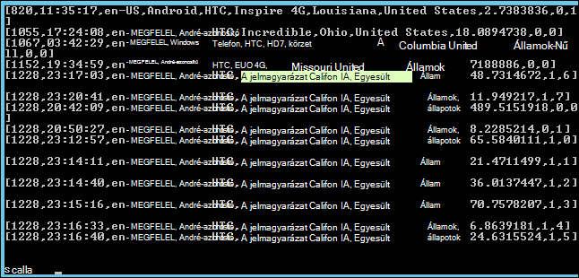

<properties
    pageTitle="A külső telepítése Hadoop fürt parancsfájl művelettel |} Microsoft Azure"
    description="Megtudhatja, hogy miként szabhatja testre a egy HDInsight fürthöz külső parancsfájl művelettel együtt."
    services="hdinsight"
    documentationCenter=""
    authors="nitinme"
    manager="jhubbard"
    editor="cgronlun"/>

<tags
    ms.service="hdinsight"
    ms.workload="big-data"
    ms.tgt_pltfrm="na"
    ms.devlang="na"
    ms.topic="article"
    ms.date="02/05/2016"
    ms.author="nitinme"/>

# Telepítése és használata a külső HDInsight Hadoop fürt parancsfájl művelettel

> [AZURE.IMPORTANT] Ez a cikk most elavult. HDInsight most nyújt a külső osztályú fürt típus Windows-alapú fürt, ami azt jelenti most már közvetlenül létrehozhat egy külső fürt parancsfájl művelettel Hadoop fürt módosítása nélkül. A külső fürt szövegbevitel, igénybe vehet egy HDInsight-3,2 verzió fürt külső 1.3.1 verziója.  A külső különböző verziói telepítéséhez művelettel parancsfájl. HDInsight parancsfájl műveletet mintaparancsfájl biztosít.

További tudnivalók a külső telepítése a Windows-alapú HDInsight parancsfájl műveletével, és hogyan kell a HDInsight-lekérdezések futtatása a külső fürtök.

**Kapcsolódó cikkek**

- [A HDInsight létrehozása Hadoop fürt](hdinsight-provision-clusters.md): HDInsight fürt általános információkat.

- [A HDInsight Apache külső – első lépések](hdinsight-apache-spark-jupyter-spark-sql.md): hozzon létre egy külső HDInsight fürthöz.

- [Parancsfájl művelettel HDInsight fürt testreszabása][hdinsight-cluster-customize]: általános tudnivalók a parancsprogram művelettel HDInsight fürt testreszabása.

- [Parancsfájl művelet kidolgozása parancsfájlok hdinsight szolgáltatásból lehetőségre](hdinsight-hadoop-script-actions.md).

## Mi az a külső?

<a href="http://spark.apache.org/docs/latest/index.html" target="_blank">Apache külső</a> egy megnyitott-forrás párhuzamos, amely támogatja a memóriában feldolgozás a teljesítmény nagy adatok analitikus alkalmazások keretrendszer feldolgozása. A külső meg a memóriában kiszámítása funkciók tehető közelítéses algoritmusok kinek ajánljuk gépi tanulási és graph számítások.

A külső is használható végezze el a hagyományos merevlemez-alapú adatfeldolgozás. A külső elkerülése érdekében a köztes szakaszban lemezre írása javítja a hagyományos MapReduce keretében. A külső is a Hadoop elosztott fájl rendszer (hdfs) lehetőségre, és Azure Blob-tároló kompatibilis, a meglévő adatok egyszerűen feldolgozhatók külső keresztül.

Ez a témakör a külső telepíteni egy HDInsight fürthöz testreszabásával nyújt útmutatást.

## Telepítse az Azure-portálon külső

A csak olvasható Azure tároló blob [https://hdiconfigactions.blob.core.windows.net/sparkconfigactionv03/spark-installer-v03.ps1](https://hdiconfigactions.blob.core.windows.net/sparkconfigactionv03/spark-installer-v03.ps1)a külső telepítése egy HDInsight fürthöz mintaparancsfájl érhető el. Ez a parancsfájl külső 1.2.0 vagy a külső 1.0.2-es verziójú a HDInsight fürt hoz létre az függően telepítheti.

- Ha a parancsprogram- **HDInsight-3,2** fürt létrehozásakor használ, telepíti a **külső 1.2.0**.
- Ha a parancsprogram- **HDInsight 3.1** fürt létrehozásakor használ, telepíti a **külső 1.0.2-es verziójú**.

Módosítsa a parancsfájlt, vagy hozzon létre saját parancsfájlt telepíteni külső más változatát.

> [AZURE.NOTE] A mintaparancsfájl csak HDInsight 3.1-es és a 3,2 fürt működik. HDInsight fürt verzióján további tudnivalókért olvassa el a [HDInsight fürt verzióival](hdinsight-component-versioning.md)foglalkozó.

1. Indítsa el a fürt létrehozása **Egyéni létrehozása** beállítás használatával, [a HDInsight létrehozása Hadoop fürt](hdinsight-provision-clusters.md#portal)leírtak. Válassza ki a fürt verzió attól függően, hogy a következőket:

    - Ha **külső 1.2.0**telepíteni szeretné, hozzon létre egy HDInsight-3,2 fürthöz.
    - Ha **külső 1.0.2-es verziójú**telepíteni szeretné, hozzon létre egy HDInsight 3.1 fürthöz.

2. A varázsló **Parancsfájl-műveletek** lapon kattintson a **parancsprogram művelet hozzáadása** a parancsfájl műveletet részleteinek megadására, alább látható módon:

    ![Parancsfájl műveletek fürt testreszabása] (./media/hdinsight-hadoop-spark-install/HDI.CustomProvision.Page6.png "Parancsfájl műveletek fürt testreszabása")

    <table border='1'>
        <tr><th>A tulajdonság</th><th>Érték</th></tr>
        <tr><td>név</td>
            <td>Adja meg a parancsfájlt beavatkozásra. Ha például <b>A külső telepítése</b>.</td></tr>
        <tr><td>Parancsfájl URI</td>
            <td>Adja meg a parancsfájlt, ha testre szeretné szabni a fürt meghívott egységes erőforrás azonosító (URI). Ha például <i>https://hdiconfigactions.blob.core.windows.net/sparkconfigactionv03/spark-installer-v03.ps1</i></td></tr>
        <tr><td>Csomópont típusa</td>
            <td>Adja meg a csomópontok a testreszabási parancsfájl futtatható. Megadhatja, hogy <b>csomópontjait</b>, <b>csak a központi csomópontok</b>vagy <b>csak a dolgozó csomópontok</b>.
        <tr><td>Paraméterek</td>
            <td>Szükség szerint a parancsfájlt, adja meg a paraméterek. A parancsprogram külső telepítéséhez nincs szükség a paramétereket így üresen is hagyhat ki.</td></tr>
    </table>

    A fürt több összetevők telepítése egynél több parancsfájl műveletet is hozzáadhat. Miután hozzáadta a parancsfájlok, kattintson a csoport létrehozásához a bejelölést.

A parancsfájl használatával külső telepítése HDInsight Azure PowerShell vagy a HDInsight .NET SDK használatával. Ezeket a műveleteket az utasításokat a témakör későbbi.

## A külső HDInsight használata
A külső API-khoz Scala, Python és Java biztosít. A külső interaktív rendszerhéj segítségével külső lekérdezések futtatása. Ez a szakasz ismertető különböző az alábbi módszerek segítségével külső használata:

- [A külső rendszerhéj segítségével interaktív lekérdezések futtatása](#sparkshell)
- [A külső rendszerhéj segítségével külső SQL-lekérdezések futtatása](#sparksql)
- [Különálló Scala alkalmazások használata](#standalone)

###A külső rendszerhéj segítségével interaktív lekérdezések futtatása
A következő lépésekkel egy interaktív külső rendszerhéj-lekérdezések futtatása a külső. Ebben a részben azt külső lekérdezést futtat egy adatfájl – minta (/ example/data/gutenberg/davinci.txt), amely alapértelmezés szerint HDInsight fürt megtalálható.

1. Az Azure portálról engedélyezése a távoli asztali a létrehozott külső telepítve van, és majd remote be a fürt fürt. Útmutatásért lásd: [Csatlakozás HDInsight fürt RDP segítségével](hdinsight-administer-use-management-portal.md#rdp).

2. Az asztal Protocol (RDP) munkamenet az asztalról nyissa meg a Hadoop parancssori (az asztali parancsikon), és nyissa meg azt a helyet, ahol a külső telepítette; Ha például **C:\apps\dist\spark-1.2.0**.

3. A következő parancsot a külső rendszerhéj indítása:

         .\bin\spark-shell --master yarn

    A parancs befejezésekor szerezheti be a Scala kérdés:

         scala>

5. Scala kérdésnél írja be a külső lekérdezés alább látható módon. A lekérdezés az egyes érhető el a/példa/adatok/gutenberg/helyén az Azure Blob-tárolóhoz fürthöz társított davinci.txt fájlban a word előfordulását megszámolja.

        val file = sc.textFile("/example/data/gutenberg/davinci.txt")
        val counts = file.flatMap(line => line.split(" ")).map(word => (word, 1)).reduceByKey(_ + _)
        counts.toArray().foreach(println)

6. A kimenet kell a következőhöz hasonló:

    

7. Írja be: q való kilépéshez a Scala kérdésre.

        :q

###A külső rendszerhéj segítségével külső SQL-lekérdezések futtatása

A külső SQL Structured Query Language (SQL), HiveQL vagy Scala kifejezett relációs lekérdezések futtatása a külső használatával teszi lehetővé. Ebben a részben megnézi a struktúra lekérdezést futtat egy minta struktúratáblával külső használatával. Az ebben a részben (más néven **hivesampletable**) használt struktúratáblával fürt létrehozása esetén érhető el, alapértelmezés szerint.

>[AZURE.NOTE] Az alábbi példa **dokumentuma 1.2.0**, amelyen telepítve van, ha a parancsfájl műveletet HDInsight-3,2 fürt létrehozásakor ellen hozták létre.

1. Az Azure portálról engedélyezése a távoli asztali a létrehozott külső telepítve van, és majd remote be a fürt fürt. Útmutatásért lásd: [Csatlakozás HDInsight fürt RDP segítségével](hdinsight-administer-use-management-portal.md#rdp).

2. Az RDP-munkamenet az asztalról nyissa meg a Hadoop parancssori (az asztali parancsikon), és nyissa meg azt a helyet, ahol a külső telepítette; Ha például **C:\apps\dist\spark-1.2.0**.

3. A következő parancsot a külső rendszerhéj indítása:

         .\bin\spark-shell --master yarn

    A parancs befejezésekor szerezheti be a Scala kérdés:

         scala>

4. Állítsa be a struktúra helyi Scala kérdésnél. Ez a szükséges struktúra lekérdezések kezelése külső használatával.

        val hiveContext = new org.apache.spark.sql.hive.HiveContext(sc)

    Megjegyzés: a **sc** alapértelmezett külső környezet, és állítsa be a külső rendszerhéj indításakor.

5. Struktúra lekérdezések futtatása a struktúra környezet használatával, és a nyomat a konzolba. A lekérdezés beolvassa az adatokat egy adott ellenőrizze az eszközön, és az 20 beolvasott rekordokat a korlátozza.

        hiveContext.sql("""SELECT * FROM hivesampletable WHERE devicemake LIKE "HTC%" LIMIT 20""").collect().foreach(println)

6. Meg kell jelennie a kibocsátás, az alábbihoz hasonló:

    

7. Írja be: q való kilépéshez a Scala kérdésre.

        :q

### Különálló Scala alkalmazások használata

Ebben a részben egy Scala alkalmazása a betűk tartalmazó sorok számát megadó azt írja be "a" és "b", az adatok mintafájl (/ example/data/gutenberg/davinci.txt), amely alapértelmezés szerint HDInsight fürt megtalálható. Írja be, és egy különálló Scala program használata egy testre szabott külső telepítés fürt, hajtsa végre az alábbi lépéseket:

- Írja be egy Scala program
- A program a Scala a .jar fájl első összeállítása
- A feladat futtatása a fürt

#### Írja be egy Scala program
Ebben a részben összeszámolja azokat a sorokat tartalmazó Scala programot írása "a" és az adatfájl – minta "b".

1. Nyisson meg egy szövegszerkesztőt, és illessze be a következő kódot:

        /* SimpleApp.scala */
        import org.apache.spark.SparkContext
        import org.apache.spark.SparkContext._
        import org.apache.spark.SparkConf

        object SimpleApp {
          def main(args: Array[String]) {
            val logFile = "/example/data/gutenberg/davinci.txt"         //Location of the sample data file on Azure Blob storage
            val conf = new SparkConf().setAppName("SimpleApplication")
            val sc = new SparkContext(conf)
            val logData = sc.textFile(logFile, 2).cache()
            val numAs = logData.filter(line => line.contains("a")).count()
            val numBs = logData.filter(line => line.contains("b")).count()
            println("Lines with a: %s, Lines with b: %s".format(numAs, numBs))
          }
        }

2. Mentse a fájlt a **SimpleApp.scala**nevét.

#### A Scala program összeállítása
Ebben a részben használatával <a href="http://www.scala-sbt.org/0.13/docs/index.html" target="_blank">Egyszerű összeállítása eszköz</a> (vagy sbt) a Scala program összeállítása. SBT Java 1,6 vagy újabb verzió szükséges, ezért ügyeljen a megfelelő Java ebben a szakaszban a továbblépés előtt telepítve van.

1. Telepítse sbt http://www.scala-sbt.org/0.13/tutorial/Installing-sbt-on-Windows.html.
2. Hozzon létre egy **SimpleScalaApp**nevű mappát, és ebben a mappában lévő hozzon létre egy **simple.sbt**nevű fájlt. Ez a konfigurációs fájl, amely tartalmaz információt a Scala verziója, függőségek tár stb. Illessze be a következőt a simple.sbt fájlba, és mentse:

        name := "SimpleApp"

        version := "1.0"

        scalaVersion := "2.10.4"

        libraryDependencies += "org.apache.spark" %% "spark-core" % "1.2.0"

    >[AZURE.NOTE] Győződjön meg arról, hogy megőrzi az üres sort a fájlban.

3. A **SimpleScalaApp** mappán hozzon létre egy címtár-struktúra **\src\main\scala** , és illessze be a korábban létrehozott a \src\main\scala mappán Scala program (**SimpleApp.scala**).
4. Nyisson meg egy parancssort, nyissa meg azt a SimpleScalaApp könyvtár, és írja be a következő parancsot:

        sbt package

    Amikor az alkalmazás összeállítása után, látni fogja a legfelső szintű SimpleScalaApp mappában tárolt **\target\scala-2.10** könyvtárában létrehozott **simpleapp_2.10-1.0.jar** fájl.

#### A feladat futtatása a fürt
Ebben a részben azt be a külső tartalmazó fürt távoli telepítve és másolja a SimpleScalaApp projekt célmappát. Majd a **külső elküldése** parancs segítségével a feladatot a fürt nyújt.

1. Távoli a fürt, amelyen telepítve van a külső be. A számítógépen, ahol írt, és a SimpleApp.scala program beépített másolja a **SimpleScalaApp\target** mappát, és illessze be a fürt meg azt a helyet.
2. Az RDP-munkamenet az asztalról nyissa meg a Hadoop parancsot, és nyissa meg azt a helyet, ahol beillesztett **célmappát** .
3. Írja be a SimpleApp.scala program futtatásához a következő parancsot:

        C:\apps\dist\spark-1.2.0\bin\spark-submit --class "SimpleApp" --master local target/scala-2.10/simpleapp_2.10-1.0.jar

4. A program befejeződésekor a kimenet jelenik meg a konzolon.

        Lines with a: 21374, Lines with b: 11430

## Telepítse a külső Azure PowerShell használatával

Ebben a részben a **<a href = "http://msdn.microsoft.com/library/dn858088.aspx" target="_blank">Hozzáadás-AzureHDInsightScriptAction</a>** parancsmag parancsfájlok meghívásához műveletével parancsfájl fürt testreszabása használjuk. A folytatás előtt győződjön meg arról, hogy telepítette és beállította az Azure PowerShell. Azure PowerShell-parancsmagok HDInsight futtatandó munkaállomás konfigurálásával kapcsolatos további tudnivalókért lásd [Telepítse és állítsa be a Azure PowerShell](../powershell-install-configure.md).

Hajtsa végre az alábbi lépéseket:

1. Az Azure PowerShell ablak megnyitásához, majd a következő változók deklarálhatnak:

        # Provide values for these variables
        $subscriptionName = "<SubscriptionName>"        # Name of the Azure subscription
        $clusterName = "<HDInsightClusterName>"         # HDInsight cluster name
        $storageAccountName = "<StorageAccountName>"    # Azure Storage account that hosts the default container
        $storageAccountKey = "<StorageAccountKey>"      # Key for the Storage account
        $containerName = $clusterName
        $location = "<MicrosoftDataCenter>"             # Location of the HDInsight cluster. It must be in the same data center as the Storage account.
        $clusterNodes = <ClusterSizeInNumbers>          # Number of nodes in the HDInsight cluster
        $version = "<HDInsightClusterVersion>"          # For example, "3.2"

2. Adja meg a konfigurációs értékek, például a csomópontok a fürt és a használandó alapértelmezett tárolására.

        # Specify the configuration options
        Select-AzureSubscription $subscriptionName
        $config = New-AzureHDInsightClusterConfig -ClusterSizeInNodes $clusterNodes
        $config.DefaultStorageAccount.StorageAccountName="$storageAccountName.blob.core.windows.net"
        $config.DefaultStorageAccount.StorageAccountKey=$storageAccountKey
        $config.DefaultStorageAccount.StorageContainerName=$containerName

3. A **Hozzáadás-AzureHDInsightScriptAction** parancsmag használatával parancsfájl művelet hozzáadása fürt konfiguráción. Később a fürt létrehozásakor a parancsfájl műveletet hajtsa végre.

        # Add a script action to the cluster configuration
        $config = Add-AzureHDInsightScriptAction -Config $config -Name "Install Spark" -ClusterRoleCollection HeadNode -Uri https://hdiconfigactions.blob.core.windows.net/sparkconfigactionv03/spark-installer-v03.ps1

    **Hozzáadás-AzureHDInsightScriptAction** parancsmag hajtja végre a következő paraméterek:

    <table style="border-color: #c6c6c6; border-width: 2px; border-style: solid; border-collapse: collapse;">
    <tr>
    <th style="border-color: #c6c6c6; border-width: 2px; border-style: solid; border-collapse: collapse; width:90px; padding-left:5px; padding-right:5px;">Paraméter</th>
    <th style="border-color: #c6c6c6; border-width: 2px; border-style: solid; border-collapse: collapse; width:550px; padding-left:5px; padding-right:5px;">Meghatározása</th></tr>
    <tr>
    <td style="border-color: #c6c6c6; border-width: 2px; border-style: solid; border-collapse: collapse; padding-left:5px;">Beállítások</td>
    <td style="border-color: #c6c6c6; border-width: 2px; border-style: solid; border-collapse: collapse; padding-left:5px; padding-right:5px;">A konfiguráció objektum mely parancsfájl művelet információk hozzá.</td></tr>
    <tr>
    <td style="border-color: #c6c6c6; border-width: 2px; border-style: solid; border-collapse: collapse; padding-left:5px;">név</td>
    <td style="border-color: #c6c6c6; border-width: 2px; border-style: solid; border-collapse: collapse; padding-left:5px;">A parancsprogram művelet nevét.</td></tr>
    <tr>
    <td style="border-color: #c6c6c6; border-width: 2px; border-style: solid; border-collapse: collapse; padding-left:5px;">ClusterRoleCollection</td>
    <td style="border-color: #c6c6c6; border-width: 2px; border-style: solid; border-collapse: collapse; padding-left:5px;">Adja meg a csomópontok a testreszabási parancsfájl futtatható. Az érvényes értékek HeadNode (való telepítéséhez a fő csomópont) vagy DataNode (az összes adat csomópontok telepítése) is. Egyik vagy mindkét értékek is használhatja.</td></tr>
    <tr>
    <td style="border-color: #c6c6c6; border-width: 2px; border-style: solid; border-collapse: collapse; padding-left:5px;">URI</td>
    <td style="border-color: #c6c6c6; border-width: 2px; border-style: solid; border-collapse: collapse; padding-left:5px;">Adja meg a URI végrehajtott parancsfájlt szeretne.</td></tr>
    <tr>
    <td style="border-color: #c6c6c6; border-width: 2px; border-style: solid; border-collapse: collapse; padding-left:5px;">Paraméterek</td>
    <td style="border-color: #c6c6c6; border-width: 2px; border-style: solid; border-collapse: collapse; padding-left:5px;">A paraméterek követel meg a parancsfájlt. Az ebben a témakörben használt mintaparancsfájl nem kell megadni a paramétereket, és így nem látható a fenti kódtöredékének a paraméter.
    </td></tr>
    </table>

4. Végezetül indítása testre szabott fürt létrehozása, amelynek a külső telepítve.  

        # Start creating a cluster with Spark installed
        New-AzureHDInsightCluster -Config $config -Name $clusterName -Location $location -Version $version

Amikor a rendszer kéri, írja be a hitelesítő adatokat a fürt. Eltarthat néhány percig, amíg a fürt létrehozása előtt.

## Telepítse a külső PowerShell használatával

Lásd: [testreszabása HDInsight fürt parancsfájl művelettel](hdinsight-hadoop-customize-cluster.md#call_scripts_using_powershell).

## A külső .NET SDK használatával telepítése

Lásd: [testreszabása HDInsight fürt parancsfájl művelettel](hdinsight-hadoop-customize-cluster.md#call_scripts_using_azure_powershell).

## Lásd még:

- [A HDInsight létrehozása Hadoop fürt](hdinsight-provision-clusters.md): HDInsight fürt létrehozása.
- [A HDInsight Apache külső – első lépések](hdinsight-apache-spark-jupyter-spark-sql.md): első lépések a HDInsight külső.
- [Parancsfájl művelettel HDInsight fürt testreszabása][hdinsight-cluster-customize]: parancsfájl művelettel HDInsight fürt testreszabása.
- [Parancsfájl művelet kidolgozása parancsfájlok HDInsight](hdinsight-hadoop-script-actions.md): készíthetnek parancsfájl műveletet parancsfájlokat.
- [R telepítése HDInsight fürt] [ hdinsight-install-r] ismertető telepítése és használata R HDInsight Hadoop fürt fürt testreszabási használatával. R-Megnyitás Forrásnyelv és környezet statisztikai számítások. Több száz beépített statisztikai függvények és a saját programnyelv funkcionális és objektumorientált programozáshoz tulajdonságát kombináló biztosít. Teljes körű grafikus funkciókat is tartalmaz.
- [A HDInsight fürt telepítése Giraph](hdinsight-hadoop-giraph-install.md). Fürt testreszabási segítségével HDInsight Hadoop fürt Giraph telepítése. Giraph lehetővé teszi, hogy Hadoop használatával feldolgozása graph végezheti el, és Azure hdinsight szolgáltatáshoz kínál.
- [A HDInsight fürt telepítése Solr](hdinsight-hadoop-solr-install.md). Fürt testreszabási segítségével HDInsight Hadoop fürt Solr telepítése. Solr tárolt adatok hatékony keresés műveletek hajthatók végre teszi lehetővé.

[hdinsight-provision]: hdinsight-provision-clusters.md
[hdinsight-install-r]: hdinsight-hadoop-r-scripts.md
[hdinsight-cluster-customize]: hdinsight-hadoop-customize-cluster.md
[powershell-install-configure]: powershell-install-configure.md
