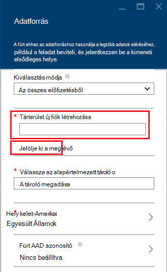

<properties
    pageTitle="A lekérdezés Fájlrendszerhez-kompatibilis Blob-tárolóhoz adatainak |} Microsoft Azure"
    description="HDInsight felhasználási Azure Blob-tárolóhoz a nagy adatokat tároló Fájlrendszerhez számára. Megtudhatja, hogy miként Blob-tárolóhoz adatainak lekérdezése és tárolni közvetítheti elemzésének eredményeit."
    keywords="BLOB-tároló, a fájlrendszerhez, a strukturált adatok, a strukturálatlan adatokat"
    services="hdinsight,storage"
    documentationCenter=""
    tags="azure-portal"
    authors="mumian"
    manager="jhubbard"
    editor="cgronlun"/>

<tags
    ms.service="hdinsight"
    ms.workload="big-data"
    ms.tgt_pltfrm="na"
    ms.devlang="na"
    ms.topic="get-started-article"
    ms.date="09/06/2016"
    ms.author="jgao"/>

# A HDInsight Hadoop Fájlrendszerhez-kompatibilis Azure Blob-tárolóhoz használata

Megtudhatja, hogy miként alacsony költség Azure Blob-tárolóhoz használata HDInsight létrehozása az Azure tárterület-fiók és Blob-tároló tároló és majd belüli adatok az a cím.

Azure Blob-tárolóhoz zökkenőmentesen együttműködik HDInsight robusztus, általános célú tároló megoldás. A Hadoop elosztott fájlrendszer system (Fájlrendszerhez) kapcsolaton keresztül a skype_for_businesshoz HDInsight-összetevők közvetlenül a strukturált és strukturálatlan adatokat Blob-tárolóban lévő is működnek.

Adattárolás Blob-tárolóban lévő lehetővé teszi, hogy biztonságosan törlése a HDInsight fürt felhasználó adatvesztés nélkül kiszámítása használható.

> [AZURE.IMPORTANT] HDInsight csak a továbbfejlesztett fájlblokkolás BLOB támogatja. Támogatja a lapot, vagy nem BLOB Hozzáfűzés.

Egy HDInsight fürthöz létrehozásával kapcsolatos további tudnivalókért lásd: [Első lépések a HDInsight] [ hdinsight-get-started] , vagy [Hozzon létre HDInsight fürt][hdinsight-creation].

## HDInsight tárterület-architektúra
Az alábbi ábra a HDInsight tároló architektúra absztrakt nézetének nyújtja:

![Hadoop fürt a Fájlrendszerhez API használja és tárolja a strukturált és strukturálatlan adatokat Blob-tárolóban lévő.] (./media/hdinsight-hadoop-use-blob-storage/HDI.WASB.Arch.png "Tárterület HDInsight-architektúra")

HDInsight az elosztott fájlrendszer helyileg csatolva van a számítási csomópontok hozzáférést biztosít. Ezt a fájlrendszert az teljesen minősített URI, például segítségével is elérhető:

    hdfs://<namenodehost>/<path>

Ezeken kívül HDInsight teszi lehetővé az Azure Blob-tárolóhoz tárolt access-adatok. Szintaxisa a következő:

    wasb[s]://<containername>@<accountname>.blob.core.windows.net/<path>

> [AZURE.NOTE] HDInsight 3.0-nél korábbi verzióiban `asv://` helyett használt `wasb://`. `asv://`nem használható a HDInsight fürt 3.0-s vagy újabb verziójával, mint hibát eredményez.

Hadoop támogatja az alapértelmezett fájlrendszer egy állomástól. Az alapértelmezett fájlrendszer azt jelenti, egy alapértelmezett séma és a hitelesítésszolgáltató. Is használható relatív elérési utak feloldásához. A HDInsight létrehozási folyamatot, Azure tárterület-fiók és egy adott Azure Blob-tárolóhoz során az adott fiókból tároló alapértelmezett fájlrendszer van kijelölve.

A tároló fiók mellett fiókot további tárterületet, de a ugyanabban az Azure-előfizetésben, illetve különböző Azure előfizetések a létrehozási folyamat során, vagy a csoport létrehozását követően. Tanulmányozza [létrehozása HDInsight fürt], további tárterület-fiókok felvétele[hdinsight-creation].

- **Tárolók az tároló fürtre csatlakoztatott fiókok:** A fiók nevét, és a kulcs kapcsolódnak a csoport létrehozása során, mert az adott tárolókban BLOB teljes hozzáférés van.

- **Nyilvános tárolók vagy az, hogy nem csatlakozik a fürtre tárterület-fiókok nyilvános BLOB:** A BLOB a tárolók az írásvédett engedéllyel van.

    > [AZURE.NOTE]
        > Nyilvános tárolók lehetővé teszi, hogy érhetők el a tároló és a tároló metaadatok valamennyi BLOB listájának. Nyilvános BLOB teszi lehetővé a BLOB eléréséhez, csak akkor, ha tudja, hogy a pontos URL-CÍMÉT. További tudnivalókért olvassa el a <a href="http://msdn.microsoft.com/library/windowsazure/dd179354.aspx">tárolók és BLOB hozzáférés korlátozása</a>című témakört.

- **Magánjellegű tárolók az, hogy nem csatlakozik a fürtre tárterület-fiókok:** A tárolókban a BLOB nem érhetők el, kivéve, ha a tárterület-fiók definiálása a WebHCat feladatok elküldésekor. Ez a cikk későbbi részében magyarázza.

A tároló fiókok a létrehozási folyamat és igényelhetnek definiált %HADOOP_HOME%/conf/core-site.xml fürt csomóponton tárolja. Az alapértelmezett HDInsight működése az alapvető-site.xml fájlban definiált a tárterület-fiókokat használ. Nem ajánlott a fő-site.xml fájl szerkesztéshez, mert a fürt központi node(master) reimaged vagy áttelepített bármikor, és azokat a fájlokat módosításait el fog veszni.

Több WebHCat feladatok, beleértve a struktúra, MapReduce, a folyamatos átvitelű Hadoop és malac, végezheti tároló fiókok és a velük metaadatok leírását. (Ez jelenleg használható tárterületet fiókok malac, de nem a metaadat-alapú.) Ez a cikk [Azure PowerShell használata az Access BLOB](#powershell) szakaszában van egy mintája szerepel a szolgáltatás. További tudnivalókért lásd: [egy HDInsight fürthöz alternatív tárterület-fiókok és Metastores használatával](http://social.technet.microsoft.com/wiki/contents/articles/23256.using-an-hdinsight-cluster-with-alternate-storage-accounts-and-metastores.aspx).

Strukturált és strukturálatlan adatokat BLOB-tárolóhoz használhatók. BLOB-tároló tárolja az adatokat, kulcs/érték párokká, és nincs címtár hierarchiája. Azonban a perjel (/) használható belül a kulcs neve lehetőségtől, mintha egy fájlt a címtár-szerkezet tárolja. Egy blob-kulcs lehet, például *input/log1.txt*. Nincs tényleges *beviteli* könyvtár létezik, de a perjel a fő nevében jelenléte miatt az alábbi módokon, az elérési útra rendelkezik.

###Blob-tárolóhoz előnyei
Nem közös megkeresése hallgatólagos teljesítmény költségét kiszámítania fürt, és szünteti meg a tároló erőforrásokat módja a számítási fürt közelébe az Azure terület, ahol a hálózat minden futtatáskor nagyon hatékony Azure Blob-tárolóhoz belüli adatok eléréséhez a számítási csomópontok belül tároló fiók erőforrások jönnek létre.

Vannak társított az Azure blobtárolóhoz Fájlrendszerhez helyett az adatok tárolásának több előnye:

* **Adatok újbóli felhasználása és a megosztás:** Az adatok Fájlrendszerhez belül a számítási fürthöz található. Csak a a számítási fürtre hozzáféréssel rendelkező alkalmazások használja a Fájlrendszerhez API-khoz használatával. Az Azure Blob-tárolóban lévő adatok a Fájlrendszerhez API-hoz vagy a [Blob-tároló REST API]keresztül is elérhető[blob-storage-restAPI]. A korábbiakhoz képest (beleértve a más HDInsight fürt) alkalmazások és eszközök így konzerv, és az adatok felhasználása használható.
* **Adatok archiválása:** Azure Blob-tárolóban lévő adatokat tároljon lehetővé teszi, hogy a HDInsight fürt biztonságosan törlődik a felhasználói adatok megtartásával használja.
* **Adatokat tároló költség:** Az adatok tárolása Azure Blob-tárolóhoz, mivel a számítási fürthöz költségét nagyobb, mint a költség-Azure Blob-tároló tároló-nél több költséges Elosztott adattárolás a hosszú távú. Ezeken kívül az adatok nem kell minden számítási fürt létrehozásánál kell tölteni, mert is menti adatok betöltése költségeket.
* **Skála rugalmas meg:** Bár a Fájlrendszerhez nyújt méretezett meg a fájlrendszer, a méretarány a fürt létrehozott csomópontok számának határozza meg. A skála módosítása előfordulhat, hogy a méretezés, amely automatikusan Azure Blob-tárolóban lévő el funkciók elasztikus használna, mint egy összetettebb folyamat.
* **Geo-replikáció:** Az Azure Blob-tároló lehet geo replikált. Bár ez lehetővé teszi földrajzi helyreállítási és adatok redundancia, egy geo replikált helyét áttérni szigorúan hatással van a teljesítményt, és további költségeket vonhatnak azt. Tehát azt ajánljuk a geo replikáció bölcs kiválasztása, és csak ha az érték az adatok a további költség értékű.

A csomagok és bizonyos feladatok MapReduce köztes eredmények, amelyek nem igazán tárolni szeretné az Azure Blob-tárolóhoz hozhat létre. Ebben az esetben megválaszthatja, hogy tárolja az adatokat, kattintson a helyi Fájlrendszerhez. Valójában HDInsight Elosztott több ezek köztes az eredmények a struktúra feladatokat és egyéb folyamatok használja.

> [AZURE.NOTE] A legtöbb Fájlrendszerhez parancsok (például <b>ls</b>, <b>copyFromLocal</b> és <b>mkdir</b>) továbbra is a várt módon működnek. Csak a natív Fájlrendszerhez végrehajtása (amely nevezik Elosztott), például <b>fschk</b> és <b>dfsadmin</b>, jellemző parancsokat Azure Blob-tárolóhoz jelennek meg a másik viselkedését.

## Tárolók Blob létrehozása

BLOB használatához először létrehozása az [Azure tároló fiók][azure-storage-create]. Részeként adjon meg egy Azure régiót, amely az objektumokat, amelyet Ön hozott létre ehhez a fiókhoz tárolni fogja. A fürt és a tárterület-fiókot kell tárolni ugyanabban a régióban. A struktúra metastore SQL Server-adatbázis és Oozie metastore SQL Server-adatbázishoz is ugyanabban a régióban kell elhelyezni.

Él, ahol minden blob-hoz létre a Azure tárterület-fiókjában tároló tartozik. Ez a tároló lehet egy meglévő blob HDInsight-Ön kívüli létrehozott, vagy lehet, hogy egy HDInsight fürt létrehozott tároló.

Az alapértelmezett Blob-tárolóhoz fürt meghatározott adatokat, köztük a korábbi és a naplókat tárolja. Több HDInsight fürtre nem alapértelmezett Blob-tároló megosztása. Ez lehet, hogy a korábbi sérült, és a fürt misbehave lesz. Különböző tároló minden fürthöz és megosztott adatok elhelyezése egy csatolt tárterület-fiókkal az alapértelmezett tároló fiók helyett minden releváns fürt környezetben a megadott ajánlott. Csatolt tároló fiókok konfigurálása a további tudnivalókért lásd: [Hozzon létre HDInsight fürt][hdinsight-creation]. Jó helyen jár, így újból felhasználhatja alapértelmezett tároló tároló az eredeti HDInsight fürt törlése után. HBase fürt ténylegesen továbbra is a HBase táblázat séma és adatok használata egy HBase fürthöz, hogy törölve lett által használt blob tároló tároló új HBase fürt létrehozása.

### Az Azure portál használatával

Egy HDInsight fürthöz a portálról létrehozásakor egy meglévő tárterület-fiókot vagy hozzon létre egy új tárterület-fiókot a lehetőség áll rendelkezésére:

###Azure CLI használatával

[AZURE.INCLUDE [use-latest-version](../../includes/hdinsight-use-latest-cli.md)]

Ha [telepítette és beállította az Azure CLI](../xplat-cli-install.md)van, a következő parancsot a tárhely és a tároló használható.

    azure storage account create <storageaccountname> --type LRS

> [AZURE.NOTE] A `--type` paraméter azt jelzi, hogy hogyan fog kell a tároló fiók replikált. További tudnivalókért lásd: az [Azure tároló replikáció](../storage/storage-redundancy.md). ZRS ne használjon, mint ZRS nem támogatja, oldal blob, fájl, táblázat vagy várólista.

Adja meg a földrajzi területhez tartozik, amelyek a tárterület-fiók található kéri. Régióban tervezi a HDInsight fürt létrehozása a tárterület-fiókot kell létrehozni.

Amikor létrejött a tárterület-fiókot, a következő paranccsal tároló fiók kulcsok:

    azure storage account keys list <storageaccountname>

A tároló létrehozásához használja az alábbi parancsot:

    azure storage container create <containername> --account-name <storageaccountname> --account-key <storageaccountkey>

### Azure PowerShell használatával

Ha Ön [telepítette és beállította az Azure PowerShell][powershell-install], a következő parancsot a Azure PowerShell-parancssorában hozhat létre, a tárhely és a tároló:

[AZURE.INCLUDE [upgrade-powershell](../../includes/hdinsight-use-latest-powershell.md)]

    $SubscriptionID = "<Your Azure Subscription ID>"
    $ResourceGroupName = "<New Azure Resource Group Name>"
    $Location = "EAST US 2"
    
    $StorageAccountName = "<New Azure Storage Account Name>"
    $containerName = "<New Azure Blob Container Name>"
    
    Add-AzureRmAccount
    Select-AzureRmSubscription -SubscriptionId $SubscriptionID
    
    # Create resource group
    New-AzureRmResourceGroup -name $ResourceGroupName -Location $Location
    
    # Create default storage account
    New-AzureRmStorageAccount -ResourceGroupName $ResourceGroupName -Name $StorageAccountName -Location $Location -Type Standard_LRS 
    
    # Create default blob containers
    $storageAccountKey = (Get-AzureRmStorageAccountKey -ResourceGroupName $resourceGroupName -StorageAccountName $StorageAccountName)[0].Value
    $destContext = New-AzureStorageContext -StorageAccountName $storageAccountName -StorageAccountKey $storageAccountKey  
    New-AzureStorageContainer -Name $containerName -Context $destContext

## Cím fájlok Blob-tárolóhoz

A URI-séma Blob-tárolóban lévő fájlok eléréséhez hdinsight van:

    wasb[s]://<BlobStorageContainerName>@<StorageAccountName>.blob.core.windows.net/<path>

A URI-séma titkosítatlan hozzáférést biztosít (a a *wasb:* előtag) és az SSL titkosított access (a *wasbs*). Azt javasoljuk, hogy segítségével *wasbs* lehetőség, akkor is, ha az Azure-ban ugyanazon régió belül videókra eléréséhez.

A &lt;BlobStorageContainerName&gt; azonosítja a tároló Azure Blob-tárolóhoz nevét.
A &lt;StorageAccountName&gt; azonosítja az Azure tároló fiók nevére. Egy teljes tartománynevét (FQDN) szükség.

Ha egyik sincs beállítva &lt;BlobStorageContainerName&gt; sem &lt;StorageAccountName&gt; lett megadva, az alapértelmezett fájlrendszer használják. Az alapértelmezett fájlrendszer fájloknál relatív és abszolút elérési út is használhatja. Ha például a HDInsight fürt épített *hadoop-mapreduce-examples.jar* fájl lehet hivatkozni rájuk a következő módszerek valamelyikével:

    wasbs://mycontainer@myaccount.blob.core.windows.net/example/jars/hadoop-mapreduce-examples.jar
    wasbs:///example/jars/hadoop-mapreduce-examples.jar
    /example/jars/hadoop-mapreduce-examples.jar

> [AZURE.NOTE] A fájl neve <i>hadoop-examples.jar</i> HDInsight 2.1-es és 1,6 verziók fürt.

A &lt;elérési út&gt; a fájl vagy könyvtár Fájlrendszerhez elérési út. Mivel a tárolók Azure Blob-tárolóban lévő egyszerűen kulcs érték tárolja, nincs igaz hierarchikus fájlrendszer. Perjel (/) belül egy blob-kulcs címtár elválasztó értelmezett. Ha például a *hadoop-mapreduce-examples.jar* blob nevét az:

    example/jars/hadoop-mapreduce-examples.jar

> [AZURE.NOTE] HDInsight-Ön kívüli okkal használatakor a legtöbb segédprogramok nem ismeri fel a WASB formátumot, és helyette számíthat, például egy egyszerű elérési út formátum `example/jars/hadoop-mapreduce-examples.jar`.

## Az Access BLOB Azure CLI használatával

A következő paranccsal blob kapcsolatos parancsok listáját:

    azure storage blob

**Példa: Azure CLI használatával fájl feltöltése**

    azure storage blob upload <sourcefilename> <containername> <blobname> --account-name <storageaccountname> --account-key <storageaccountkey>

**Példa egy fájl letöltésére Azure CLI használatával**

    azure storage blob download <containername> <blobname> <destinationfilename> --account-name <storageaccountname> --account-key <storageaccountkey>

**Példa: Azure CLI törölhetők a fájlok használata**

    azure storage blob delete <containername> <blobname> --account-name <storageaccountname> --account-key <storageaccountkey>

**Példa: Azure CLI lista fájlok használata**

    azure storage blob list <containername> <blobname|prefix> --account-name <storageaccountname> --account-key <storageaccountkey>

## Az Access BLOB Azure PowerShell használatával

> [AZURE.NOTE] A parancsok ebben a szakaszban adja meg egy egyszerű példa a PowerShell használatá BLOB tárolt access-adatok. Például egy több teljes szolgáltatáskészletet nyújtó, a HDInsight testre szabott [HDInsight eszközök](https://github.com/Blackmist/hdinsight-tools)megtekintéséhez.

A következő parancs használatával kapcsolatos blob listázzák:

    Get-Command *blob*

![Blob kapcsolatos PowerShell-parancsmagok listája.][img-hdi-powershell-blobcommands]

###Fájlok feltöltése

Lásd: az [adatok HDInsight feltöltése][hdinsight-upload-data].

###Fájlok letöltése

A következő törmelék blokk blob letölti az aktuális mappa. A parancsprogram futtatása előtt módosítása egy mappát, ahová írási engedélyekkel kell rendelkeznie a címtárhoz.

    $resourceGroupName = "<AzureResourceGroupName>"
    $storageAccountName = "<AzureStorageAccountName>"   # The storage account used for the default file system specified at creation.
    $containerName = "<BlobStorageContainerName>"  # The default file system container has the same name as the cluster.
    $blob = "example/data/sample.log" # The name of the blob to be downloaded.
    
    # Use Add-AzureAccount if you haven't connected to your Azure subscription
    Login-AzureRmAccount 
    Select-AzureRmSubscription -SubscriptionID "<Your Azure Subscription ID>"
    
    Write-Host "Create a context object ... " -ForegroundColor Green
    $storageAccountKey = (Get-AzureRmStorageAccountKey -ResourceGroupName $resourceGroupName -Name $storageAccountName)[0].Value
    $storageContext = New-AzureStorageContext -StorageAccountName $storageAccountName -StorageAccountKey $storageAccountKey  
    
    Write-Host "Download the blob ..." -ForegroundColor Green
    Get-AzureStorageBlobContent -Container $ContainerName -Blob $blob -Context $storageContext -Force
    
    Write-Host "List the downloaded file ..." -ForegroundColor Green
    cat "./$blob"

Kezeléséről az erőforrás-csoport nevét és a csoport nevét, használhatja a következő kódot:

    $resourceGroupName = "<AzureResourceGroupName>"
    $clusterName = "<HDInsightClusterName>"
    $blob = "example/data/sample.log" # The name of the blob to be downloaded.
    
    $cluster = Get-AzureRmHDInsightCluster -ResourceGroupName $resourceGroupName -ClusterName $clusterName
    $defaultStorageAccount = $cluster.DefaultStorageAccount -replace '.blob.core.windows.net'
    $defaultStorageAccountKey = (Get-AzureRmStorageAccountKey -ResourceGroupName $resourceGroupName -Name $defaultStorageAccount)[0].Value
    $defaultStorageContainer = $cluster.DefaultStorageContainer
    $storageContext = New-AzureStorageContext -StorageAccountName $defaultStorageAccount -StorageAccountKey $defaultStorageAccountKey 
    
    Write-Host "Download the blob ..." -ForegroundColor Green
    Get-AzureStorageBlobContent -Container $defaultStorageContainer -Blob $blob -Context $storageContext -Force

###Fájlok törlése

    Remove-AzureStorageBlob -Container $containerName -Context $storageContext -blob $blob

###Lista-fájlok

    Get-AzureStorageBlob -Container $containerName -Context $storageContext -prefix "example/data/"

###Nem meghatározott tárterület-fiókkal struktúra lekérdezések futtatása

Ez a példa bemutatja, hogyan lista nem tartalmazza a létrehozásának folyamata során tárterület-fiókból egy mappát.
$clusterName = "<HDInsightClusterName>"

    $undefinedStorageAccount = "<UnboundedStorageAccountUnderTheSameSubscription>"
    $undefinedContainer = "<UnboundedBlobContainerAssociatedWithTheStorageAccount>"

    $undefinedStorageKey = Get-AzureStorageKey $undefinedStorageAccount | %{ $_.Primary }

    Use-AzureRmHDInsightCluster $clusterName

    $defines = @{}
    $defines.Add("fs.azure.account.key.$undefinedStorageAccount.blob.core.windows.net", $undefinedStorageKey)

    Invoke-AzureRmHDInsightHiveJob -Defines $defines -Query "dfs -ls wasbs://$undefinedContainer@$undefinedStorageAccount.blob.core.windows.net/;"

## Következő lépések

Ebben a cikkben Fájlrendszerhez-kompatibilis Azure Blob-tárolóhoz használata HDInsight megtanulta, és megtanulta, hogy Azure Blob-tárolóhoz része alapvető hdinsight szolgáltatásból lehetőségre. Lehetővé teszi, hogy méretezhető, hosszú távú, archiválás adatok WIA megoldások az Azure Blob-tárolóhoz, és az adatokat a gyorsítótárban tárolt strukturált és strukturálatlan adatokat belül feloldásához HDInsight használja.

További tudnivalókért lásd:

* [Első lépések az Azure hdinsight szolgáltatáshoz][hdinsight-get-started]
* [Töltse fel az adatok hdinsight szolgáltatáshoz][hdinsight-upload-data]
* [HDInsight struktúra használata][hdinsight-use-hive]
* [Malac használata hdinsight szolgáltatáshoz][hdinsight-use-pig]
* [Azure tároló megosztott Access aláírások segítségével HDInsight az adatokhoz való hozzáférés korlátozása][hdinsight-use-sas]

[hdinsight-use-sas]: hdinsight-storage-sharedaccesssignature-permissions.md
[powershell-install]: ../powershell-install-configure.md
[hdinsight-creation]: hdinsight-provision-clusters.md
[hdinsight-get-started]: hdinsight-hadoop-tutorial-get-started-windows.md
[hdinsight-upload-data]: hdinsight-upload-data.md
[hdinsight-use-hive]: hdinsight-use-hive.md
[hdinsight-use-pig]: hdinsight-use-pig.md

[blob-storage-restAPI]: http://msdn.microsoft.com/library/windowsazure/dd135733.aspx
[azure-storage-create]: ../storage/storage-create-storage-account.md

[img-hdi-powershell-blobcommands]: ./media/hdinsight-hadoop-use-blob-storage/HDI.PowerShell.BlobCommands.png
[img-hdi-quick-create]: ./media/hdinsight-hadoop-use-blob-storage/HDI.QuickCreateCluster.png
[img-hdi-custom-create-storage-account]: ./media/hdinsight-hadoop-use-blob-storage/HDI.CustomCreateStorageAccount.png  
