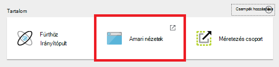
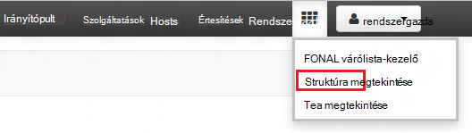
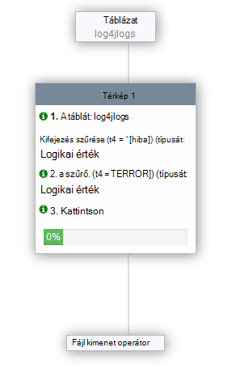

<properties
   pageTitle="Ambari nézetek használata HDInsight (Hadoop) a struktúra |} Microsoft Azure"
   description="Megtudhatja, hogy miként struktúra lekérdezések küldhetnek a webböngészőből struktúra nézet használatával. A struktúra nézet ellátni a HDInsight Linux-alapú fürt Ambari webes felületének része."
   services="hdinsight"
   documentationCenter=""
   authors="Blackmist"
   manager="jhubbard"
   editor="cgronlun"
    tags="azure-portal"/>

<tags
   ms.service="hdinsight"
   ms.devlang="na"
   ms.topic="article"
   ms.tgt_pltfrm="na"
   ms.workload="big-data"
   ms.date="10/28/2016"
   ms.author="larryfr"/>

#A HDInsight Hadoop a struktúra nézet használata

[AZURE.INCLUDE [hive-selector](../../includes/hdinsight-selector-use-hive.md)]

Ambari pedig egy management Linux-alapú HDInsight fürt mellékelt felügyeleti segédprogramot. Szolgáltatáson keresztül Ambari funkciói egyik struktúra lekérdezések futtatásához használt webes felhasználói Felületet. Ez az a __Struktúra nézet__ellátni a HDInsight fürt Ambari nézetek részét.

> [AZURE.NOTE] Ambari túl sok a dokumentum nem ismertetett funkciók. További tudnivalókért olvassa el a [kezelése HDInsight fürt Ambari webes a felhasználói felület használatával](hdinsight-hadoop-manage-ambari.md)című témakört.

##Előfeltételek

- A HDInsight Linux-alapú fürtre. Új fürt létrehozásával kapcsolatos további tudnivalókért olvassa el a [Linux-alapú HDInsight – első lépések](hdinsight-hadoop-linux-tutorial-get-started.md)című témakört.

##Nyissa meg a struktúra nézet

Az Azure portálról Ambari nézetek is Válassza ki a HDInsight csoportját, és válassza a __Ambari nézeteket__ a __Tartalom__ szakaszából.

Közvetlenül az Ambari méretéről https://CLUSTERNAME.azurehdinsight.net webböngészőben (ahol __CLUSTERNAME__ annak a nevét a HDInsight fürt) is navigálhat, és majd jelölje ki a négyzetösszeg (mellett a __rendszergazda__ hivatkozás és gomb a lap, a bal oldalon) lap menüből érhető el a nézetek listában. Jelölje be a __Nézet struktúra__.

.

> [AZURE.NOTE] Amikor Ambari, a rendszer kéri, azt a webhelyet, hitelesítést végezni. Adja meg a rendszergazda (alapértelmezett `admin`,) nevét és jelszavát, a csoport létrehozásakor használt fiók.

Meg kell jelennie egy lapot, az alábbihoz hasonló:

##Táblázatok megjelenítése

Az oldal __Adatbázis Explorer__ csoportjában jelölje be __az adatbázisok__ lapon az __alapértelmezett__ bejegyzést. Ez megjeleníti a táblák listájának az alapértelmezett adatbázisban. Csak egy táblázatot egy új HDInsight fürt léteznie kell; __hivesampletable__.

A jelen dokumentum lépéseit hozzáadott új táblát, mint az adatbázis Explorer jobb felső sarokban a frissítés ikon is használhatja a frissítse a listát a rendelkezésre álló táblák.

##A Lekérdezésszerkesztő

Az alábbi lépéseket a struktúra nézetből segítségével adatokat a fürt részét képező struktúra lekérdezésével.

1. A __Lekérdezésszerkesztő__ csoport a lapon illessze be a következő HiveQL utasításokat a munkalapra:

        DROP TABLE log4jLogs;
        CREATE EXTERNAL TABLE log4jLogs(t1 string, t2 string, t3 string, t4 string, t5 string, t6 string, t7 string)
        ROW FORMAT DELIMITED FIELDS TERMINATED BY ' '
        STORED AS TEXTFILE LOCATION 'wasbs:///example/data/';
        SELECT t4 AS sev, COUNT(*) AS cnt FROM log4jLogs WHERE t4 = '[ERROR]' GROUP BY t4;

    Ezek a kimutatások hajtsa végre az alábbi műveleteket:

    - **Táblázat LEVÁLASZTÁSA** – a táblázat és az adatfájl törlése abban az esetben, ha a táblázat már létezik.
    - **Külső tábla létrehozása** - táblát hoz létre egy új "külső" struktúra. Külső tábla csak a táblázat definíció tárolását struktúra; az adatok az eredeti helyén marad.
    - **Sor formátum** - struktúra alapján, az adatok formázását. Ebben az esetben a mezőket az egyes naplók vannak elválasztva szóközt.
    - **AS TEXTFILE helyen tárolt** - struktúra alapján, az adatokat tárolja (a példában/adatkönyvtárának), és hogy szövegként tárolt.
    - Egy adott oszlop t4 [hiba] értéket tartalmazza sorok összes számát, **VÁLASSZA a** - kijelöli.

    >[AZURE.NOTE] Külső tábla kell használni, amikor külső forrásból, például egy automatizált adatok feltöltése folyamatban, vagy egy másik MapReduce művelet, amelyet frissíteni kell a mögöttes adatok várt, de mindig szükség struktúra lekérdezések használata a legfrissebb adatokat. Tartalmaz külső tábla húzással *nem* törlése az adatokat, csak a tábla definícióját.

2. A képernyő alján a Lekérdezésszerkesztő a __végrehajtás__ gomb segítségével indítsa el a lekérdezést. Meg kell kapcsolni a narancssárga, és a szöveg megváltoztatják a __végrehajtás__leállítása. __Lekérdezés folyamat eredményét__ szakasz kell a Lekérdezésszerkesztő alatt jelenik meg, és a feladattal kapcsolatos információkat jeleníthet meg.

    > [AZURE.IMPORTANT] Egyes böngészőkben nem előfordulhat, hogy helyesen frissíti a napló vagy a találatok információkat. Ha a feladat futtatása, és úgy tűnik, hogy örökkévalóság a napló frissítése nélkül, vagy az ad eredményt, próbálja meg a Mozilla FireFox vagy a Google Chrome az használja.

3. Amikor a lekérdezés befejeződik, a __Lekérdezés folyamat eredményét__ szakaszban a művelet eredményét jeleníti meg. A __Végrehajtás leállítása__ gombra is megváltozik a zöld __végrehajtás__ gombra. Az __eredmények__ fülre kell tartalmaznia az alábbi adatokat:

        sev       cnt
        [ERROR]   3

    A __Naplók__ lapon a naplózás adatok a feladat által létrehozott használható. Hibaelhárítási lekérdezéssel problémák esetén használható.

    > [AZURE.TIP] Megjegyzés: az __eredmények mentése__ legördülő párbeszédpanel bal felső sarkában a __Lekérdezés folyamat eredményét__ szakasz; használhatja ezt az eredmények letöltése, vagy HDInsight tároló CSV-fájlként mentheti őket.

3. Jelölje ki az első négy sorokat a lekérdezés, majd válassza ki a __végrehajtás__. Figyelje meg, hogy nincsenek nem tartalmaz a feladat befejezése után. Ennek oka az, a __végrehajtás__ gomb használatával, a lekérdezés része ki van jelölve a kijelölt kimutatások csak futtathatók. A kijelölés ebben az esetben nem tartalmazza a végleges kimutatást, a sorok táblából. Ha jelölje be a csak az adott sor, és használja a __végrehajtás__, meg kell jelennie a várt eredményeket.

3. A __Lekérdezésszerkesztő__ alján az __Új munkalap__ gomb segítségével hozzon létre egy új munkalapot. Az új munkalapon írja be a következő HiveQL utasításokat:

        CREATE TABLE IF NOT EXISTS errorLogs (t1 string, t2 string, t3 string, t4 string, t5 string, t6 string, t7 string) STORED AS ORC;
        INSERT OVERWRITE TABLE errorLogs SELECT t1, t2, t3, t4, t5, t6, t7 FROM log4jLogs WHERE t4 = '[ERROR]';

    Ezek a kimutatások hajtsa végre az alábbi műveleteket:

    - **Hozzon létre táblázat IF NOT EXISTS** - táblát hoz létre, ha még nem létezik. A **külső** kulcsszó nem használatos, mivel az egy belső tábla, amely a struktúra adatraktár tárolja, és a struktúra teljesen kezeli. Külső táblázatok, eltérően egy belső táblázat leválasztása törli a mögöttes adatok.
    - **TÁROLVA mint ORC** - optimalizált sor oszlopos (ORC) formátumban adatait tárolja. Ez a struktúra adatok tárolására szolgáló erősen optimalizált és hatékony formátumot.
    - Beszúrás **FELÜLÍRÁSA... VÁLASSZA a** - és sorok kijelöli az **log4jLogs** értékeket tartalmazó [hiba], majd szúrja be az adatokat a **errorLogs** táblázatba.

    A __végrehajtás__ gomb segítségével futtassa a lekérdezést. Az __eredmények__ lapon, mint a lekérdezés által visszaadott sorok, de az állapot __sikerült__szerint meg kell jelennie nem tartalmaz információkat.

###Struktúra beállításai

Kattintson a __Beállítások__ ikonra jobb szélén a Szerkesztői.

Beállítások MapReduce különböző struktúra beállítások módosításához, például az adatvégrehajtás motor Tez (az alapértelmezett), a struktúra számára használható.

###Visual ismertetik.

Kattintson a jobb szélén a Szerkesztői __Vizuális ismertetik__ ikonra.

A lekérdezés, amely az adatáramlást az összetett lekérdezéseket megértéséhez hasznos lehet a __Vizuális ismertetik__ nézet: az. Ez a nézet egy szöveges megfelelője megtekintheti a __Magyarázat__ gombra a Lekérdezésszerkesztő segítségével.

###Tez

Jelölje ki a __Tez__ ikonra jobb szélén a Szerkesztői.

Ekkor megjelenik az irányított aciklikus Graph (DAG) Tez használja ezt a lekérdezést, ha ilyen. Ha meg szeretné tekinteni a lekérdezések DAG már futtatta a múltbeli vagy hibakeresési a Tez folyamat használja a [Tez nézet](hdinsight-debug-ambari-tez-view.md) helyette.

###Értesítések

Jelölje ki az __értesítések__ ikonjára jobb szélén a Szerkesztői.

Értesítések olyan üzenetek generált lekérdezések futtatásakor. Ha például egy értesítést kap lekérdezés elküldésekor, vagy ha hiba történik.

##Mentett lekérdezések

1. A Lekérdezésszerkesztőből, hozzon létre egy új munkalapot, és írja be az alábbi lekérdezés:

        SELECT * from errorLogs;

    Ellenőrizze, hogy működik a lekérdezés végrehajtása. Az eredmény a következő lesz:

        errorlogs.t1    errorlogs.t2    errorlogs.t3    errorlogs.t4    errorlogs.t5    errorlogs.t6    errorlogs.t7
        2012-02-03  18:35:34    SampleClass0    [ERROR]     incorrect   id  
        2012-02-03  18:55:54    SampleClass1    [ERROR]     incorrect   id  
        2012-02-03  19:25:27    SampleClass4    [ERROR]     incorrect   id

2. Használja a __Mentés másként__ gombot a szerkesztő alján. A lekérdezés __Errorlogs__ nevet, és kattintson __az OK gombra__. Figyelje meg, hogy a munkalap neve __Errorlogs__változik.

3. Kattintson a nézet struktúra lap tetején a __Mentett lekérdezések__ fülre. Figyelje meg, hogy __Errorlogs__ mentett lekérdezés most már szerepel. Amíg távolítsa el azt a listában szereplő marad. Válassza ki a nevét fog nyissa meg a lekérdezést a Lekérdezésszerkesztőben.

##Lekérdezés előzmények

Az __Előzmények__ gombra a struktúra nézet tetején lehetővé teszi, hogy rendelkezik nézet lekérdezések futtatása a korábban. Akkor most, és válassza ki a korábban a lekérdezések van néhány futtatta. Amikor kijelöl egy lekérdezés, nyílik meg a Lekérdezésszerkesztő ablakában.

##Felhasználó által definiált függvények (UDF)

**Felhasználó által definiált függvényeket (UDF)**keresztül is bővíthető struktúra. Egy UDF funkciók, vagy egyszerűen nem modellezni logikájának megvalósítása a HiveQL teszi lehetővé.

Hozzáadhat egy UDF a HiveQL kimutatások részeként a lekérdezés, miközben a UDF lap tetején látható a struktúra nézet teszi deklarálhatnak, és mentse egy sor olyan függvényekben használható együtt a __Lekérdezésszerkesztő__.

Ha a struktúra nézethez hozzáadott egy UDF, egy __udf beszúrása__ gomb a __Lekérdezésszerkesztő__alján jelenik meg. Ha bejelöli ezt a UDF a struktúra nézetben megadott legördülő listáját jeleníti meg. Jelölje ki a UDF HiveQL kimutatások hozzáadja az UDF ahhoz, hogy a lekérdezés.

Ha például a következő tulajdonságok UDF definiált:

* Erőforrás neve: myudfs
* Erőforrás elérési útja: wasbs:///myudfs.jar
* UDF neve: myawesomeudf
* UDF osztálynév: com.myudfs.Awesome

A __udf beszúrása__ gomb segítségével __myudfs__az egyes Verzióiban az adott erőforrás által definiált egy másik legördülő nevű elem jeleníti meg. Ebben az esetben __myawesomeudf__. Ez a bejegyzés kijelölése hozzáadja a lekérdezés elejére a következő:

    add jar wasbs:///myudfs.jar;

    create temporary function myawesomeudf as 'com.myudfs.Awesome';

Kattintson a is használhatja az UDF a lekérdezés. Ha például `SELECT myawesomeudf(name) FROM people;`.

UDF használata a HDInsight struktúra további tájékoztatást talál a következő:

* [Struktúra, és a HDInsight malac Python használata](hdinsight-python.md)

* [Egyéni struktúra UDF hozzáadása hdinsight szolgáltatáshoz](http://blogs.msdn.com/b/bigdatasupport/archive/2014/01/14/how-to-add-custom-hive-udfs-to-hdinsight.aspx)

##Következő lépések

Ha általános információkra HDInsight struktúra:

* [A HDInsight Hadoop struktúra használata](hdinsight-use-hive.md)

Az egyéb lehetőségeiről dolgozhat a HDInsight Hadoop:

* [A HDInsight Hadoop malac használata](hdinsight-use-pig.md)

* [A HDInsight Hadoop MapReduce használata](hdinsight-use-mapreduce.md)
