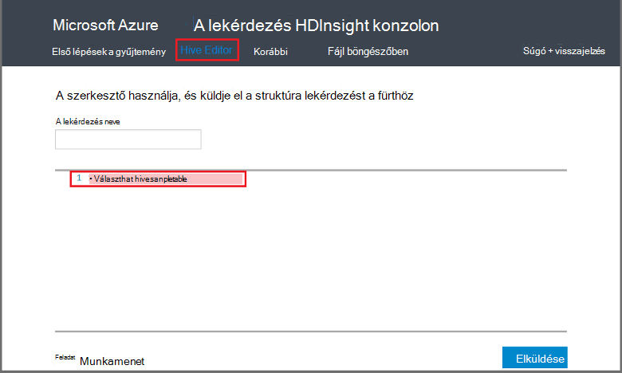

<properties
   pageTitle="A lekérdezés konzol HDInsight Hadoop-struktúra használata |} Microsoft Azure"
   description="Megtudhatja, hogy miként használata a webes lekérdezés konzol struktúra lekérdezések futtatásához egy HDInsight Hadoop fürthöz a böngészőből."
   services="hdinsight"
   documentationCenter=""
   authors="Blackmist"
   manager="jhubbard"
   editor="cgronlun"
    tags="azure-portal"/>

<tags
   ms.service="hdinsight"
   ms.devlang="na"
   ms.topic="article"
   ms.tgt_pltfrm="na"
   ms.workload="big-data"
   ms.date="09/20/2016"
   ms.author="larryfr"/>

# A lekérdezés konzolon struktúra lekérdezések futtatása

[AZURE.INCLUDE [hive-selector](../../includes/hdinsight-selector-use-hive.md)]

Ebben a cikkben megtanulhatja a HDInsight lekérdezés konzol használatáról a struktúra lekérdezések futtatásához egy HDInsight Hadoop fürthöz a böngészőből.

> [AZURE.IMPORTANT] A HDInsight lekérdezés konzol a Windows-alapú HDInsight fürt csak érhető el. A HDInsight Linux-alapú fürtre használatakor lásd: [futtatása struktúra lekérdezések a struktúra nézet](hdinsight-hadoop-use-hive-ambari-view.md).

##Előfeltételek

A jelen cikkben ismertetett lépések elvégzéséhez az alábbi lesz szüksége.

* A Windows-alapú HDInsight Hadoop fürtre

* Modern webböngészőben

##A lekérdezés konzolon struktúra lekérdezések futtatása

1. Nyisson meg egy webböngészőt, és kattintson a __https://CLUSTERNAME.azurehdinsight.net__, hol __CLUSTERNAME__ -e a HDInsight fürt nevét. Ha a rendszer kéri, adja meg a felhasználónevet és jelszót, amelyet a fürt létrehozásakor használt.

2. A hivatkozások a lap tetején jelölje ki a **Szerkesztő struktúra**. Írja be a HiveQL kimutatások, amelyet a HDInsight fürt futtatásához használt űrlap jeleníti meg.

    

    A szöveg `Select * from hivesampletable` a következő HiveQL kimutatásokkal együtt:

        set hive.execution.engine=tez;
        DROP TABLE log4jLogs;
        CREATE EXTERNAL TABLE log4jLogs (t1 string, t2 string, t3 string, t4 string, t5 string, t6 string, t7 string)
        ROW FORMAT DELIMITED FIELDS TERMINATED BY ' '
        STORED AS TEXTFILE LOCATION 'wasbs:///example/data/';
        SELECT t4 AS sev, COUNT(*) AS count FROM log4jLogs WHERE t4 = '[ERROR]' AND INPUT__FILE__NAME LIKE '%.log' GROUP BY t4;

    Ezek a kimutatások hajtsa végre az alábbi műveleteket:

    * **Táblázat LEVÁLASZTÁSA**: a táblázat és az adatfájl törli, ha a táblázat már létezik.
    * **Külső tábla létrehozása**: új táblát hoz létre külső"a struktúra. Külső tábla csak a táblázat definíció tárolását struktúra; az adatok az eredeti helyén marad.

    > [AZURE.NOTE] Külső táblák kell használni, amikor a mögöttes adatok frissítése külső forrásból (például egy automatikus feltöltés adatfeldolgozás) vagy egy másik MapReduce művelet várt, de mindig kívánt struktúra lekérdezések használata a legfrissebb adatokat.
    >
    > Tartalmaz külső tábla húzással **nem** törlése az adatokat, csak a tábla definícióját.

    * **Sor FORMAT**: Ez az információ struktúra, az adatok formázását. Ebben az esetben a mezőket az egyes naplók vannak elválasztva szóközt.
    * **AS TEXTFILE helyen tárolt**: Ez az információ struktúra az adatokat tárolja (a példában/adatkönyvtárának), és szövegként tárolt
    * **VÁLASSZA a**: jelölje be a hol oszlop **t4** **[ERROR]**értéket tartalmazza, sorok összes számát. Ez kell visszaadni értéke **3** , mert a három, ezt az értéket tartalmazó sorok.
    * **INPUT__FILE__NAME PÉLDÁUL "%.log"** - struktúra alapján visszaadó azt kell csak adatok végződésű fájlokból. naplót. E beállítás hatására a Keresés a adatokat tartalmazza, amely megőrzi a származó adatokat visszaadó más példából, amelyek nem felelnek meg a definiált séma adatfájlok sample.log fájlt.

2. Kattintson a **Küldés**gombra. A **Projekt-munkamenetet** a lap alján megjelenjen-e a feladat részletei.

3. Amikor **befejezte**az **állapot** mező változik, és válassza a **Részletek** a feladathoz. A részletek lapon a **Feladat kimeneti** tartalmaz `[ERROR]   3`. Használhatja a **Letöltés** gombra a mező alatti, amely tartalmazza a feladat a kimeneti fájl letöltése.

##Összefoglalás

Amint látható, a lekérdezés konzol egyszerűvé struktúra lekérdezések futtatása HDInsight fürt, figyelheti a projekt állapotát, valamint a kimenet.

További információk konzolon struktúra lekérdezés futtatása a struktúra feladatok, jelölje be az **Első lépések** a lekérdezés konzol tetején, majd a minták, amelyeket használni. Minden egyes minta azon a folyamaton, elemezheti az adatokat, többek között a HiveQL utasításait használják a mintában a magyarázatokat struktúrát használó részletes információt tartalmaz.

##Következő lépések

A HDInsight struktúra általános információt:

* [A HDInsight Hadoop struktúra használata](hdinsight-use-hive.md)

További módszerek információt dolgozhat a HDInsight Hadoop:

* [A HDInsight Hadoop malac használata](hdinsight-use-pig.md)

* [A HDInsight Hadoop MapReduce használata](hdinsight-use-mapreduce.md)

Ha a struktúra Tez használja, olvassa el a hibakereséshez információt a következő dokumentumokat:

* [Windows-alapú HDInsight a Tez felhasználói felületének használata](hdinsight-debug-tez-ui.md)

* [A HDInsight Linux-alapú Ambari Tez nézet használata](hdinsight-debug-ambari-tez-view.md)

[1]: ../HDInsight/hdinsight-hadoop-visual-studio-tools-get-started.md

[hdinsight-sdk-documentation]: http://msdnstage.redmond.corp.microsoft.com/library/dn479185.aspx

[azure-purchase-options]: http://azure.microsoft.com/pricing/purchase-options/
[azure-member-offers]: http://azure.microsoft.com/pricing/member-offers/
[azure-free-trial]: http://azure.microsoft.com/pricing/free-trial/

[apache-tez]: http://tez.apache.org
[apache-hive]: http://hive.apache.org/
[apache-log4j]: http://en.wikipedia.org/wiki/Log4j
[hive-on-tez-wiki]: https://cwiki.apache.org/confluence/display/Hive/Hive+on+Tez
[import-to-excel]: http://azure.microsoft.com/documentation/articles/hdinsight-connect-excel-power-query/

[hdinsight-use-oozie]: hdinsight-use-oozie.md
[hdinsight-analyze-flight-data]: hdinsight-analyze-flight-delay-data.md

[hdinsight-storage]: hdinsight-hadoop-use-blob-storage.md

[hdinsight-provision]: hdinsight-provision-clusters.md
[hdinsight-submit-jobs]: hdinsight-submit-hadoop-jobs-programmatically.md
[hdinsight-upload-data]: hdinsight-upload-data.md
[hdinsight-get-started]: hdinsight-hadoop-linux-tutorial-get-started.md

[Powershell-install-configure]: powershell-install-configure.md
[powershell-here-strings]: http://technet.microsoft.com/library/ee692792.aspx

[img-hdi-hive-powershell-output]: ./media/hdinsight-use-hive/HDI.Hive.PowerShell.Output.png
