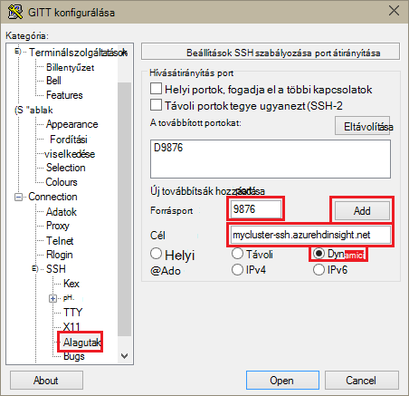
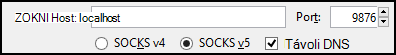
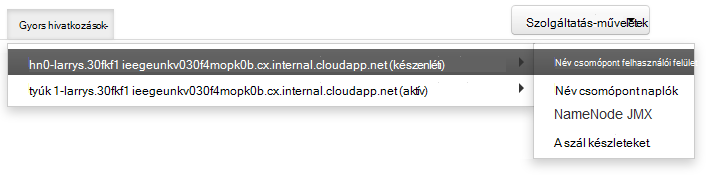

<properties
pageTitle="Használatát SSH Tunneling Ambari webes felület, erőforrás-kezelő, JobHistory, NameNode, Oozie és más webes felhasználói felület"
description="Megtudhatja, hogy miként egy SSH alagutas segítségével biztonságosan Tallózás webes erőforrások a Linux-alapú HDInsight csomópontokat is."
services="hdinsight"
documentationCenter=""
authors="Blackmist"
manager="jhubbard"
editor="cgronlun"/>

<tags
ms.service="hdinsight"
ms.devlang="na"
ms.topic="article"
ms.tgt_pltfrm="na"
ms.workload="big-data"
ms.date="10/17/2016"
ms.author="larryfr"/>

# Használhatja a SSH Tunneling Ambari webes felület, JobHistory, NameNode, Oozie és más webes felület eléréséhez

Linux-alapú HDInsight fürt Ambari webes felület hozzáférést biztosít az interneten, de néhány funkció a felhasználói felületének nem. Ha például a webes felhasználói felület más szolgáltatásokhoz, hogy vannak megjelentek Ambari keresztül. A felhasználói felület Ambari webes teljes funkcionalitását a lapok fejlécéhez fürt egy SSH alagutas kell használnia.

## Mire van szükség egy SSH alagutas?

A menük Ambari számos fog nem teljesen feltöltése egy SSH alagutas nélkül, azok a webhelyek és a többi a a fürthöz Hadoop-szolgáltatás által elérhetővé tett szolgáltatások támaszkodhat. Gyakran ezek a webhelyek nem biztonságosak, így nem biztonságos közvetlenül az interneten nézetéhez. Előfordul, hogy a szolgáltatás Zookeeper csomópont például egy másik csomóponton futtatja a webhelyen.

Az alábbiakban szolgáltatások Ambari webes felület, amelyet használ, amely egy SSH alagutas nélkül nem érhető el:

* JobHistory,
* NameNode,
* A szál készleteket,
* Oozie webes felhasználói felület
* HBase diaminta és a naplókat felhasználói felület

Parancsfájl-műveletek segítségével testre szabhatja a fürt, ha a services vagy a segédprogramok telepített jelenítik meg egy webhely felhasználói felület esetén kell egy SSH alagutas. Például egy parancsprogramot művelettel szín telepítése egy SSH alagutas a felhasználói felület szín webes eléréséhez kell használnia.

## Mi az, hogy egy SSH alagutas?

[Biztonságos rendszerhéj (SSH) tunneling](https://en.wikipedia.org/wiki/Tunneling_protocol#Secure_Shell_tunneling) , a forgalom küldött olyan portot a számítógépen helyi, SSH keresztül a HDInsight-fürt központi csomópontra, ahol a kérést, majd feloldja, mintha a központi csomópontra származik. A válasz majd továbbítás a alagutas a munkaállomásra belül hátra.

## Előfeltételek

Amikor egy SSH alagutas az internetes forgalmat, a következőket kell rendelkeznie:

* Egy SSH ügyfél. Linux és Unix terjesztését vagy Macintosh-OS X az `ssh` parancs hiányzik az operációs rendszerrel. A Windows azt javasoljuk [gitt](http://www.chiark.greenend.org.uk/~sgtatham/putty/download.html)

    > [AZURE.NOTE] Ha egy SSH ügyfél eltérő használni kívánt `ssh` vagy gitt, olvassa el a dokumentáció a használatát, hogy miként létesíthet-SSH alagutas.

* Egy webböngészőben, amely beállítható úgy, hogy egy SOCKS proxykiszolgáló használata

## Hozzon létre egy alagutas az SSH parancs használata

A következő parancsot a hozzon létre egy SSH átjáró segítségével használata a `ssh` parancsot. __Felhasználónév__ helyére egy SSH a HDInsight fürt felhasználó, és cserélje le __CLUSTERNAME__ a HDInsight fürt neve

    ssh -C2qTnNf -D 9876 USERNAME@CLUSTERNAME-ssh.azurehdinsight.net

Ezzel létrehozott egy kapcsolatot, amely a forgalom átirányítása a fürthöz helyi port 9876 SSH fölé. A beállítások a következők:

* **D 9876** – a helyi olyan portot, amely irányítja a forgalmat a alagutas keresztül.

* **C** - tömörítése adatok, mert a web forgalom főként szöveget.

* **2** – hatályba SSH próbálja ki a 2-es verziójú csak protokoll.

* **kérdések** - csendes.

* **Kétmintás T** - letiltása pszeudo-tty terhelés, akkor csak olyan portot továbbítása óta.

* **n** - megakadályozhatja, hogy olvasása STDIN, akkor csak olyan portot továbbítása óta.

* **N** - nem hajtható végre távoli parancs, akkor csak olyan portot továbbítása óta.

* **az f** - futtatása a háttérben.

Ha úgy állította be a fürt SSH kulccsal, előfordulhat, használja a `-i` paraméter, és adja meg a személyes SSH kulcs elérési útja.

A parancs befejezi, a helyi számítógép 9876 portjához küldött forgalmat át lesz irányítva Secure Sockets Layer (SSL) a fürthöz központi csomópontot, és úgy tűnik, hogy nincs származnak.

## Hozzon létre egy alagutas gitt használatával

Egy SSH alagutas gitt használatával létrehozásához kövesse az alábbi lépéseket.

1. Nyissa meg a gitt, és adja meg a kapcsolat adatait. Ha nem ismeri a gitt, [Használjon SSH a Linux-alapú Hadoop a HDInsight a Windows](hdinsight-hadoop-linux-use-ssh-windows.md) kapcsolatos információk találhatók használatához a hdinsight szolgáltatásból lehetőségre.

2. A párbeszédpanel bal oldalán a **kategória** csoportban bontsa ki a **kapcsolatot**, bontsa ki a **SSH**, és válassza a **alagutak**parancsra.

3. Adja meg a **SSH port átirányítás ellenőrzése beállítások** képernyőn az alábbi adatokat:

    * **Forrásport** - továbbítani szeretné az ügyfél portjához. Ha például **9876**.

    * **Címzett** – az SSH a HDInsight Linux-alapú fürt címét. Ha például **en_furtom nevű fürt-ssh.azurehdinsight.net**.

    * **Dinamikus** - lehetővé teszi, hogy dinamikus SOCKS-proxy útválasztás.

    

4. Kattintson a **Hozzáadás gombra** , a beállítások gombra, és kattintson a **megnyitni** egy SSH kapcsolat megnyitásához.

5. Amikor a rendszer kéri, jelentkezzen be a kiszolgáló. Ez egy SSH munkamenetet, és a alagutas engedélyezése.

## Nyissa meg a böngészőjében a alagutas használata

> [AZURE.NOTE] Ez a szakasz lépéseit a FireFox böngésző használatával az Linux rendszerhez, a Unix, a Macintosh-OS X és a Windows rendszerben olyan szabadon használható. Más modern böngészők támogatása ZOKNI proxyn keresztül is működnek.

1. A böngésző **localhost:9876** tartományként **ZOKNI v5** proxy beállítása. Az alábbiakban hogyan a Firefox beállítások néznek ki. Ha egy másik port mint 9876 használt, módosítása a port használt egy:

    

    > [AZURE.NOTE] Válassza a **Távoli DNS** megoldja a tartománynév (DNS) kérelmek a HDInsight fürt használatával. Ha nincs bejelölve, DNS helyileg oldható.

2. Győződjön meg arról, hogy forgalom van be érkezik a alagutas keresztül, például [http://www.whatismyip.com/](http://www.whatismyip.com/) vising a engedélyezett, és a Firefox tiltott proxybeállításokhoz. A beállítások engedélyezve vannak, miközben az IP-cím egy számítógépre a Microsoft Azure adatközpontban lesznek.

##Igazolja az Ambari webes felhasználói felület

Miután létrejött a fürt, kövesse az alábbi lépéseket ellenőrizze, hogy elérheti a Ambari webről szolgáltatás webes előkészíthetik:

1. A böngészőben nyissa meg a http://headnodehost:8080. A `headnodehost` küld a alagutas fölé a fürt címét, és úgy, hogy a headnode futtató Ambari. Amikor a rendszer kéri, a fürt írja be a rendszergazdai felhasználónevével (rendszergazda) és jelszavát. Kérheti egy második alkalommal, amikor a Ambari Web felhasználói felület. Ha igen, információt újra megadnia.
    
    > [AZURE.NOTE] Amikor a http://headnodehost:8080 címet a fürthöz csatlakozni, csatlakozik a alagutas Ambari fut HTTP használatával, és a SSH alagutas kommunikációs védett központi csomópont fölé viszi. Amikor csatlakozik egy alagutas használata nélkül az interneten, kommunikáció védett HTTPS használatával. Csatlakozás HTTPS interneten keresztüli, használja https://CLUSTERNAME.azurehdinsight.net, ahol a __CLUSTERNAME__ a csoport nevére.

2. A webes Ambari felület választhat a Fájlrendszerhez a listából, kattintson a lap bal szélén.

    

3. Ha a Fájlrendszerhez szolgáltatásadatok jelenik meg, és válassza a __Tartalom__. Megjelenik a fürt központi csomópontok listája. Jelöljön ki egy központi csomópontok, és válassza a __NameNode felhasználói felület__.

    

    > [AZURE.NOTE] Ha van internetes kapcsolat lassú, vagy a fő csomópont nagyon elfoglalt, jelenhetnek meg egy menü helyett várakozás mutató Ha bejelöli a __Tartalom__. Ha igen, várjon néhány percig is az adatok a kiszolgálótól kapott, majd próbálkozzon újra a listában.
    >
    > Ha egy kisebb felbontású monitor van, vagy a böngészőablakban nem teljes méretű, a __Tartalom__ menü bizonyos elemeit is kell levágni szerint a képernyő jobb oldalán. Ha igen, bontsa ki a menüt, az egérrel, majd görgessen jobbra a menüben a többi megjelenítéséhez a képernyő a JOBBRA billentyűvel.

4. Az alábbihoz hasonló lap jelenjen meg:

    

    > [AZURE.NOTE] Figyelje meg, ezen az oldalon; az URL-címe hasonló ____http://hn1-CLUSTERNAME.randomcharacters.cx.internal.cloudapp.net:8088/fürthöz kell lennie. A csomópont a belső teljes tartománynevét (FQDN) használ, és nem érhető el egy SSH alagutas használata nélkül.

## Következő lépések

Most, hogy miként hozhat létre és használhat egy SSH alagutas van megtanulta, figyelése és kezelése a fürt Ambari használatával látható információt az alábbi lépéseket:

* [HDInsight fürt kezelése Ambari használatával](hdinsight-hadoop-manage-ambari.md)

A HDInsight SSH használja a további tudnivalókért lásd: az alábbi:

* [A HDInsight Linux, Unix vagy OS X Linux-alapú Hadoop SSH használata](hdinsight-hadoop-linux-use-ssh-unix.md)

* [A Windows HDInsight Linux-alapú Hadoop SSH használata](hdinsight-hadoop-linux-use-ssh-windows.md)
