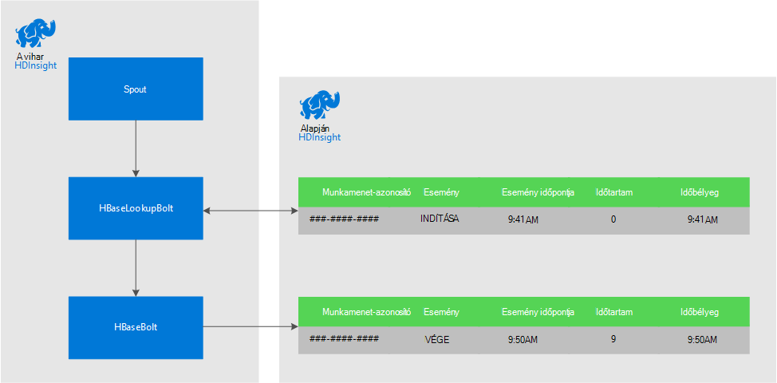
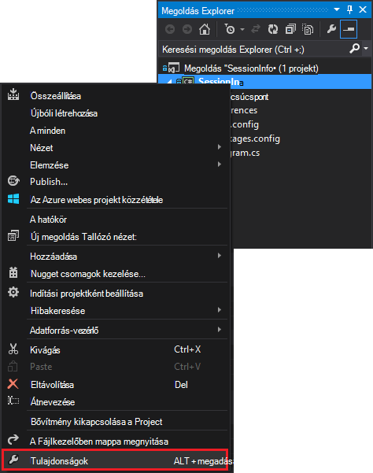
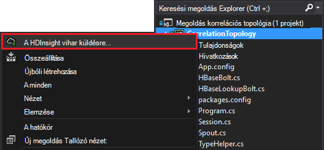

<properties
 pageTitle="Események összehangolására időbeli vihar és a HDInsight HBase"
 description="Megtudhatja, hogy miként összehangolására eseményeket, mire eljut az üzenetem különböző időpontokban HDInsight vihar és HBase használatával."
 services="hdinsight"
 documentationCenter=""
 authors="Blackmist"
 manager="jhubbard"
 editor="cgronlun"
 tags="azure-portal"/>

<tags
 ms.service="hdinsight"
 ms.devlang="dotnet"
 ms.topic="article"
 ms.tgt_pltfrm="na"
 ms.workload="big-data"
 ms.date="10/27/2016"
 ms.author="larryfr"/>

# Események összehangolására időbeli vihar és a HDInsight HBase

A Apache vihar egy állandó adattár használatával különböző időpontokban érkező adatok bejegyzések hozhatók. Bejelentkezés és kijelentkezés események számítja ki, hogy mennyi ideig tartott a a munkamenet felhasználói munkamenethez például csatolja.

A jelen dokumentum megtanulhatja, hogy miként hozhat létre egy egyszerű C# vihar topológia nyomon követi a események bejelentkezés és kijelentkezés a felhasználó folyamatokhoz, amely kiszámítja az időtartamot a munkamenet. A topológia HBase használja, mint egy állandó adattár. HBase is lehetővé teszi a korábbi adatokon további mélyebb, például hány felhasználói munkamenetek voltak lépések vagy egy adott időtartományban befejeződött konzerv köteg lekérdezésére.

## Előfeltételek

- Visual Studio és a HDInsight tools for Visual Studio: lásd: [a HDInsight tools for Visual Studio használatának első lépései](../HDInsight/hdinsight-hadoop-visual-studio-tools-get-started.md) telepítési információ.

- A HDInsight Apache vihar fürt (Windows-alapú). A program elvégzi a vihar topológiát, amely bejövő adatokat dolgoz fel, és tárolja azt, hogy HBase.

    > [AZURE.IMPORTANT] 10/28/2016 után létrehozott Linux-alapú vihar fürt SCP.NET topológiák támogatottak, miközben a .NET-csomag kezdve 10/28 és 2016-ban elérhető HBase SDK nem működik megfelelően Linux.

- A HDInsight fürthöz Apache HBase (Linux vagy Windows-alapú). Az ebben a példában az adatok áruházban.

## Architektúra

A forrás használatával történik a események igényel egy közös azonosítót. For example a felhasználói azonosító, munkamenet-azonosító, vagy egyéb olyan) egyedi és b) abban vihar küldött összes adat-adatok. Ez a példa globálisan egyedi azonosítója érték munkamenet azonosítóra ábrázolásához

Ez a példa két HDInsight fürt áll:

-   HBase: állandó adattár korábbi adatok

-   Vihar: bejövő adatok ingest használt

Az adatok véletlenszerűen generálja a vihar topológiát, és áll, az alábbiakat:

-   Munkamenet-azonosító: GUID egyedileg azonosító minden munkamenethez

-   Esemény: a KEZDŐ vagy záró eseményeket. Ebben a példában a KEZDŐ mindig akkor fordul elő, vége előtt

-   Idő: az esemény időpontját.

Az adatok feldolgozott és HBase tárolja.

### Vihar topológiája

A munkamenet indításakor **KEZDŐ** eseményt a topológia megkapta és HBase jelentkezik. **Záró** eseményt érkezik, amikor a topológia a **KEZDŐ** eseményt, és az számítja ki a két esemény között eltelt idő. Az **időtartam** érték a HBase ezt követően tárolni a és a **Záró** esemény adatait.

> [AZURE.IMPORTANT] A topológia bemutatja az egyszerű mintát, miközben egy gyártási megoldás kell vennie a tervezés, a következő esetekben:
>
> - Ki a sorrend érkező események
> - Ismétlődő esemény
> - Kihagyott események

A minta topológia az alábbi összetevőket tevődik össze:

-   Session.cs: felhasználói munkamenet: hozzon létre egy véletlen munkamenet Azonosítót, a kezdő időt, és mennyi ideig fog tartani a a munkamenet keltő szűrő megőrzi.

-   Spout.cs: 100 munkamenetek hoz létre, bocsát ki a KEZDŐ eseményeket, a véletlen időtúllépés megvárja, amíg minden munkamenetet, és majd bocsát záró eseményt. Kattintson a újrahasznosítások véget munkamenetek újak létrehozására.

-   HBaseLookupBolt.cs: használja a munkamenet-azonosító információkeresést munkamenet HBase. Záró események feldolgozása után megtalálja a megfelelő lépések esemény, és kiszámítja a munkamenet az időtartamot.

-   HBaseBolt.cs: Az adatok az HBase tárolja.

-   TypeHelper.cs: Típuskonverziós, amikor olvasása és írása HBase megkeresheti.

### HBase séma

HBase, a táblázat az alábbi beállításokkal séma/tárolja az adatokat:

-   Sor kulcs: a munkamenet-azonosító szolgál a kulcs a tábla sorainak

-   Oszlop család: a család neve "cf". A család tárolt oszlopokat a következők:

    -   esemény: ELEJÉRE vagy VÉGÉRE

    -   idő: az idő ezredmásodpercben az esemény bekövetkezett.

    -   időtartam: a KEZDŐ és záró esemény hosszúság:

-   VERZIÓ: a "cf" család értéke minden egyes sorára 5 verzióinak megőrzése

    > [AZURE.NOTE] Csak az adott sor kulcsnak tárolt korábbi értékek naplója. Alapértelmezés szerint HBase csak a legújabb verzió egy sor értékét adja eredményül. Ebben az esetben az ugyanazon sor összes eseményének (kezdete, vége.), az időbélyegző értéket minden egyes sor verziójának azonosítjuk szolgál. Ezzel a megoldással egy egyedi azonosítót naplózott események korábbi megjelenítése

## A projekt letöltése

A minta projekt letölthető [https://github.com/Azure-Samples/hdinsight-storm-dotnet-event-correlation](https://github.com/Azure-Samples/hdinsight-storm-dotnet-event-correlation).

A letöltés tartalmazza a következő C# projektek:

-   CorrelationTopology: Véletlenszerűen felhasználói munkamenetek bocsát ki a kezdő és záró események C# vihar topológia. Minden munkamenet között 1 – 5 percig tart.

-   SessionInfo: C# konzol alkalmazást tartalmazza a HBase táblázatot hoz létre, és példa lekérdezések munkamenet tárolt adatok kapcsolatos adatok visszaadására.

## A tábla létrehozása

1. Nyissa meg a **SessionInfo** projekt Visual Studio.

2. A **Megoldás Explorer**kattintson a jobb gombbal a **SessionInfo** projekt, és válassza a **Tulajdonságok parancsot**.

    

3. Válassza a **Beállítások**, majd állítsa be a következő értékeket:

    -   HBaseClusterURL: az URL-címe a HBase fürt. Ha például https://myhbasecluster.azurehdinsight.net

    -   HBaseClusterUserName: a rendszergazdai/HTTP felhasználói fiókot a fürthöz

    -   HBaseClusterPassword: a felügyeleti/HTTP felhasználói fiók jelszavának

    -   HBaseTableName: Ebben a példában használata a táblázat neve

    -   HBaseTableColumnFamily: A család oszlopnév

    

5. Futtassa a megoldást. Amikor a rendszer kéri, jelölje be a "c" kulcs a tábla létrehozása a HBase fürt.

## Építse fel és telepítse a vihar topológia

1.  A Visual Studióban, nyissa meg a **CorrelationTopology** megoldás.

2.  A **Megoldás Explorer**kattintson a jobb gombbal a **CorrelationTopology** projekt, és válassza a Tulajdonságok parancsot.

3.  A Tulajdonságok párbeszédpanelen válassza a **Beállítások** , és adja meg a következő információkat. Az első 5 kell lennie az értékeket a **SessionInfo** projekt által használt:

    -   HBaseClusterURL: az URL-címe a HBase fürt. Ha például https://myhbasecluster.azurehdinsight.net

    -   HBaseClusterUserName: a rendszergazdai/HTTP felhasználói fiókot a fürthöz

    -   HBaseClusterPassword: a felügyeleti/HTTP felhasználói fiók jelszavának

    -   HBaseTableName: Ebben a példában a használandó tábla neve. A táblázat nevével megegyező a SessionInfo projektben használt tartalmaznia kell

    -   HBaseTableColumnFamily: A család oszlopnév. Oszlop család neve megegyezik a SessionInfo projektben használt tartalmaznia kell

    > [AZURE.IMPORTANT] Ne módosítsa a HBaseTableColumnNames, mint az alapértelmezett **SessionInfo** adatok beolvasásához használt nevét.

4.  A Tulajdonságok mentse, majd hozza létre a projekt.

5.  A **Megoldás Explorer**kattintson a jobb gombbal a projekt, és válassza a **Küldés gombot a HDInsight vihar**. Ha a rendszer kéri, adja meg a hitelesítő adatok Azure-előfizetéséhez.

    

6.  **Elküldése topológia** párbeszédpanelen jelölje be a vihar fürt, a topológia fog futni.

    > [AZURE.NOTE] Az első alkalommal elküldése a topológia, néhány másodpercbe telhet beolvasni a HDInsight fürt nevét.

7.  A topológia feltölteni, és a a fürthöz elküldése után a **Vihar topológia nézet** nyissa meg, és a futó topológia megjelenítéséhez. Jelölje ki a **CorrelationTopology** , és használja a frissítés gombra a képernyő tetején a lap, a topológia adatainak frissítéséhez.

    

    Amikor a topológia megkezdi az adatok létrehozása, **Emitted** oszlopban szereplő érték növelik.

    > [AZURE.NOTE] Ha a **Vihar topológia nézet** nem nyílnak meg automatikusan, kövesse az alábbi lépéseket a megnyitásához:
    >
    > 1. A **Megoldás Explorer**bontsa ki az **Azure**, és bontsa ki a **hdinsight szolgáltatásból lehetőségre**.
    >
    > 2. Kattintson a jobb gombbal a vihar fürt futtató a topológia, és válassza a **Nézet vihar topológiák**

## Az adatok lekérdezése

Miután az adatok kibocsátott kövesse az alábbi lépéseket az adatok lekérdezéséhez.

1. **SessionInfo** projekthez való visszatéréshez. Ha nem fut, kezdje egy új példányát.

2. Amikor a rendszer kéri, válassza az **s** KEZDŐ esemény kereséséhez. Kérni fogja adja meg a kezdő és záró időpontjának megadása egy időtartományt - e két időpont között csak események visszatér.

    Használja a következő formátumot, amikor rákerül a kezdő és záró időpont: hh: mm és vagyok"vagy"du". Ha például 11:20 du.

    Mivel a topológia elkezdte, használata előtt telepítették időpontot a kezdés és a most befejezési időpontot. Ez a KEZDŐ eseményeket, amikor indult előállított a legtöbb irányítsa. A lekérdezés futtatásakor meg kell jelennie az alábbihoz hasonló tételek listája:

        Session e6992b3e-79be-4991-afcf-5cb47dd1c81c started at 6/5/2015 6:10:15 PM. Timestamp = 1433527820737

ZÁRÓ eseményeket keresése ugyanúgy működik, mint KEZDŐ eseményeket. Azonban záró eseményeket generált véletlen 1 – 5 perccel később a KEZDŐ esemény között. Úgy is próbálja meg néhány idő tartományait annak érdekében, hogy keresse meg a záró eseményeket. ZÁRÓ eseményeket is tartalmaz az időtartamot a munkamenet - esemény kezdetének és vége esemény közötti különbség. Íme egy példa az END eseményekre vonatkozó adatokat:

    Session fc9fa8e6-6892-4073-93b3-a587040d892e lasted 2 minutes, and ended at 6/5/2015 6:12:15 PM

> [AZURE.NOTE] Amíg a beírt időértékeket helyi idővé, akkor az időt, a lekérdezés által visszaadott UTC lesz.

##A topológia leállítása

Ha le szeretné állítani a topológia készen áll, a Visual Studióban **CorrelationTopology** projekthez való visszatéréshez. A **Vihar topológia nézetben**kijelölheti a topológiája és a **leállítása** gombra a topológia nézet tetején.

##A csoport törlése

[AZURE.INCLUDE [delete-cluster-warning](../../includes/hdinsight-delete-cluster-warning.md)]

##Következő lépések

További vihar Példák című témakörben talál [példát topológiák vihar a HDInsight](hdinsight-storm-example-topology.md).
 
