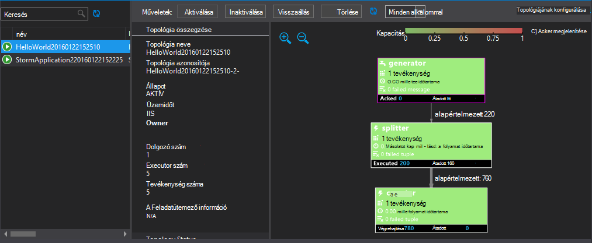

<properties
   pageTitle="Üzembe helyezéséhez és kezeléséhez, a HDInsight Apache vihar topológiák |} Microsoft Azure"
   description="Megtudhatja, hogy miként telepíthető, figyelésére és kezelheti a HDInsight vihar irányítópulttal Apache vihar topológiák. Visual Studio Hadoop eszközeivel."
   services="hdinsight"
   documentationCenter=""
   authors="Blackmist"
   manager="jhubbard"
   editor="cgronlun"
    tags="azure-portal"/>

<tags
   ms.service="hdinsight"
   ms.devlang="java"
   ms.topic="article"
   ms.tgt_pltfrm="na"
   ms.workload="big-data"
   ms.date="10/11/2016"
   ms.author="larryfr"/>

#Üzembe helyezéséhez és kezeléséhez, a Windows-alapú HDInsight Apache vihar topológiák

A vihar irányítópult lehetővé teszi, hogy telepítése és futtatása Apache vihar topológiák a HDInsight fürthöz webböngészőn keresztül. Az irányítópult figyelésére és futó topológiák kezelésére is használhatja. Ha használja a Visual Studio, a HDInsight Tools for Visual Studio adja meg a Visual Studióban hasonló funkciókat.

A vihar irányítópult és a HDInsight-eszközök a vihar szolgáltatásai támaszkodhat a vihar REST API-t, hozzon létre saját figyelése használt és megoldások kezelése.

> [AZURE.IMPORTANT] A dokumentumban a lépéseket a Windows-alapú vihar HDInsight fürt szükség. Linux-alapú fürt használatával kapcsolatos további tudnivalókért lásd [Deploy és kezelheti a Linux-alapú HDInsight Apache vihar topológiák](hdinsight-storm-deploy-monitor-topology-linux.md)

##Előfeltételek

* **A HDInsight Apache vihar** – lásd: az <a href="../hdinsight-storm-getting-started/" target="_blank">első lépések a HDInsight Apache vihar</a> fürt létrehozásának lépései

* Az **Irányítópult vihar**:, amely támogatja a HTML5-ös modern webböngészőben

* **Visual Studio** - Azure SDK 2.5.1 vagy újabb verzióját és a HDInsight Tools for Visual Studio. Lásd: <a href="../hdinsight-hadoop-visual-studio-tools-get-started/" target="_blank">HDInsight Tools for Visual Studio használatának első lépései</a> telepítse és állítsa be a HDInsight tools for Visual Studio.

    A Visual Studio következő verzióira egyikét:

    * Visual Studio 2012 a <a href="http://www.microsoft.com/download/details.aspx?id=39305" target="_blank">4-es frissítése</a>

    * Visual Studio 2013 <a href="http://www.microsoft.com/download/details.aspx?id=44921" target="_blank">frissítése a 4-es</a> vagy <a href="http://go.microsoft.com/fwlink/?LinkId=517284" target="_blank">Visual Studio 2013 Közösség</a>

    * <a href="http://visualstudio.com/downloads/visual-studio-2015-ctp-vs" target="_blank">Visual Studio 2015 CTP6</a>

    > [AZURE.NOTE] A HDInsight Tools for Visual Studio csak ismer vihar HDInsight fürt verzióját 3,2.

##Vihar irányítópult

A vihar irányítópult egy olyan érhető el a vihar fürt weblap. Az URL-cím **https://&lt;clustername >.azurehdinsight.net/**, ahol a **clustername** a vihar HDInsight fürt nevét.

A vihar irányítópult tetején kattintson a **Topológia elküldése**. Kövesse a képernyőn megjelenő utasításokat a lapon a minta topológiában futtatásához vagy tölthet fel, és egy Ön által létrehozott topológia futtatása.

![a Küldés topológia lap][storm-dashboard-submit]

###Vihar felhasználói felület

Az irányítópult lapon vihar **Vihar felhasználói felület** hivatkozásra. Ekkor megjelenik a fürt kívül minden futó topológiák információt.

![a felhasználói felület vihar][storm-dashboard-ui]

> [AZURE.NOTE] Az Internet Explorer egyes verzióiban, az azt tapasztalhatja, hogy a felhasználói felület vihar követően nem frissül először megtekintett azt. Például akkor előfordulhat, hogy ne jelenjenek meg az új topológiák Ön által küldött, illetve a topológia aktív jelenhet meg, ha korábban már inaktív. A Microsoft ismeri a problémát, és a probléma megoldásán működik.

####Fő lapja

A felhasználói felület vihar a főoldalra az alábbi információk találhatók:

* **Összefoglaló fürt**: a vihar fürt vonatkozó alapadatok.

* **Összefoglaló topológia**: topológiák futó listáját. Ebben a szakaszban a hivatkozások használatával megtekintheti az adott topológiák további információt.

* **Összefoglaló felügyelő**: a vihar felügyelő információt.

* **Nimbus konfigurációs**: a fürt Nimbus konfigurációs.

####Összefoglaló topológiája

Hivatkozás kijelölése a a **összefoglaló topológiája** csoport jeleníti meg a topológia az alábbi adatokat:

* **Összefoglaló topológia**: a topológia vonatkozó alapadatok.

* **Topológia műveletek**: adatkezelési műveletek végezhetők el a topológia.

    * **Aktiválás**: a inaktiválva topológiában önéletrajzok feldolgozása.

    * **Inaktiválás**: felfüggeszti a futó topológiában.

    * **Visszaállás**: a topológia a párhuzamos igazítása. A futó topológiák kell visszaállás, miután módosította a fürt csomópontok számának. A párhuzamos-e a fürt csomópontok nagyobb vagy csökkent számának kompenzálja topológiát lehetővé teszi.

        További információ a <a href="http://storm.apache.org/documentation/Understanding-the-parallelism-of-a-Storm-topology.html" target="_blank">egy vihar topológiájának a párhuzamos ismertetése</a>című cikk nyújt.

    * **Leállítása**: a vihar topológiában megszakítja az megadott idő után.

* **Topológia stat**: a topológia statisztikájának. Az **ablak** oszlopban a hivatkozások segítségével a lapon a többieknek határideje állít be.

* **Spouts**: a topológia által használt a spouts. Ebben a szakaszban a hivatkozások használatával megtekintheti az adott spouts további információt.

* **Bolts**: a topológia által használt a csapszegek. Ebben a szakaszban a hivatkozások használatával megtekintheti az adott csapszegek további információt.

* **Topológiájának konfigurálása**: a kijelölt topológia beállításait.

####Spout és a rögzített összegzése

A következő információkat a kijelölt elem egy spout kijelölése a **Spouts** vagy **Bolts** szakaszokat jeleníti meg:

* **Összetevő összefoglalása**: alapvető spout vagy rögzített adatokat.

* **Spout/rögzített stat**: a spout vagy rögzített statisztikájának. Az **ablak** oszlopban a hivatkozások segítségével a lapon a többieknek határideje állít be.

* **Beviteli stat** (csak szög): a bemeneti adatfolyamok a rögzített elfogyasztott információt.

* **Kimeneti stat**: a ez által kibocsátott adatfolyamok információt spout vagy szög.

* **Végrendeleti végrehajtó**: a spout vagy rögzített előfordulását információt. Jelölje ki a **Port** az egy adott executor erre az előfordulásra vonatkozóan előállított diagnosztikai adatok naplója megtekintéséhez.

* **Hiba**: bármilyen hiba adatait spout vagy szög.

##HDInsight Tools for Visual Studio

A HDInsight-eszközök a vihar fürthöz C# vagy hibrid topológiák küldhetik használható. Az alábbi lépésekkel minta alkalmazással. A saját topológiák létrehozásával HDInsight eszközeivel kapcsolatos további tudnivalókért lásd [kidolgozása C# topológiák a HDInsight Tools for Visual Studio segítségével](hdinsight-storm-develop-csharp-visual-studio-topology.md).

Kövesse az alábbi lépéseket a minta telepíteni a vihar HDInsight fürtre, majd megtekintése és kezelése a topológia.

1. Ha, még nem telepítette a HDInsight-eszközök a legújabb Visual Studio, olvassa el a <a href="../hdinsight-hadoop-visual-studio-tools-get-started/" target="_blank">HDInsight Tools for Visual Studio használatának első lépései</a>című témakört.

2. Nyissa meg a Visual Studióban, és válassza a **fájl** > **Új** > **Projekt**.

3. **Új projekt** párbeszédpanelen bontsa ki a **telepítendő** > **sablonokat**, és jelölje be a **hdinsight szolgáltatásból lehetőségre**. A sablonok listából válassza ki a **Vihar minta**. A párbeszédpanel alján írja be az alkalmazás nevét.

    

1. A **Megoldás Explorer**kattintson a jobb gombbal a projektet, és válassza a **Küldés gombot a HDInsight vihar**.

    > [AZURE.NOTE] Ha a rendszer kéri, írja be a bejelentkezési adatok Azure előfizetését. Ha egynél több előfizetése van, jelentkezzen be az adott, amely tartalmazza a vihar HDInsight fürt.

2. Jelölje ki a vihar HDInsight fürt a **Vihar fürt** legördülő listában, és válassza a **Küldés gombra**. Figyelheti-e a beküldött sikeres a **kimeneti** ablakban.

3. Ha a topológia sikeres elküldését, a fürt **Vihar topológiák** jelenjenek meg. Jelölje ki a listában a futó topológia kapcsolatos információk megtekintése a topológia.

    

    > [AZURE.NOTE] Megtekintheti a **Vihar topológiák** **Kiszolgáló** Intézőből **Azure**kibontásával > **hdinsight szolgáltatásból lehetőségre**, majd kattintson a jobb gombbal egy vihar HDInsight fürt és **Nézet vihar topológiák**kijelölése.

    Jelölje ki az alakzatot a spouts vagy csapszegek az összetevők adatainak megtekintéséhez. Új ablak megnyílik az egyes kijelölt elemek.
    
    > [AZURE.NOTE] A topológia neve: a topológia osztály nevét (ebben az esetben `HelloWord`,) a fűzött időbélyeg.

4. Jelölje ki a **Topológia összegzés** nézet **törlése** le szeretné állítani a topológia.

    > [AZURE.NOTE] Vihar topológiák továbbra is fut, amíg a rendszer leállítja futtatását, vagy a csoport törlése.

##REST API-VAL

A felhasználói felület vihar hasonló kezelési és funkciók figyelése a REST API segítségével végezhet, fölött a REST API épül. Egyéni eszközök kezelésére és figyelése vihar topológiák létrehozását a REST API-t is használhatja.

További tudnivalókért lásd: [Vihar felhasználói felület REST API -t](https://github.com/apache/storm/blob/0.9.3-branch/STORM-UI-REST-API.md). Az alábbi adatokat az Apache vihar a HDInsight a REST API-t használja.

###Alap URI

Az alap URI-HDInsight fürt a REST API-t **https://&lt;clustername >.azurehdinsight.net/stormui/api/v1/**, ahol a **clustername** a vihar HDInsight fürt nevét.

###Hitelesítés

Kérelmek a REST API-nak **Alapszintű hitelesítés**, kell használnia, hogy használni a HDInsight fürt rendszergazda nevét és jelszavát.

> [AZURE.NOTE] Alapszintű hitelesítés használatával egyszerű szöveges küldi el, mert meg kell **mindig** használata a biztonságos kommunikáció a fürthöz HTTPS.

###Visszatérési érték

Lehet, hogy a REST API-t a visszaadott információk csak a fürt vagy a virtuális gépeken futó ugyanazon a hálózaton Azure virtuális a fürt használható. A teljes tartománynevét (FQDN) esetén a visszaadott Zookeeper kiszolgálók például nem lesz elérhető legyen az internetről.

##Következő lépések

Most, hogy megtanulta üzembe topológiák figyelése vihar irányítópultja használatával, és megtudhatja, hogyan hogyan:

* [C# topológiák for Visual Studio HDInsight eszközeivel kidolgozása](hdinsight-storm-develop-csharp-visual-studio-topology.md)

* [Java-alapú topológiák maven tesztelése használatával kidolgozása](hdinsight-storm-develop-java-topology.md)

További példa topológiák listáját olvassa el a [Példa topológiák vihar a HDInsight-](hdinsight-storm-example-topology.md)című témakört.

[hdinsight-dashboard]: ./media/hdinsight-storm-deploy-monitor-topology/dashboard-link.png
[storm-dashboard-submit]: ./media/hdinsight-storm-deploy-monitor-topology/submit.png
[storm-dashboard-ui]: ./media/hdinsight-storm-deploy-monitor-topology/storm-ui-summary.png
