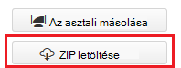
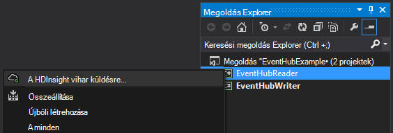
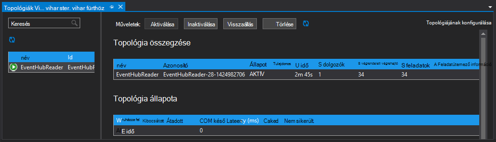

<properties
   pageTitle="A vihar HDInsight meg az esemény hubok dolgozható |} Microsoft Azure"
   description="További információ a Visual Studio for Visual Studio HDInsight eszközökkel készített C# vihar topológia esemény hubok adatfeldolgozás."
   services="hdinsight,notification hubs"
   documentationCenter=""
   authors="Blackmist"
   manager="jhubbard"
   editor="cgronlun"/>

<tags
   ms.service="hdinsight"
   ms.devlang="dotnet"
   ms.topic="article"
   ms.tgt_pltfrm="na"
   ms.workload="big-data"
   ms.date="10/27/2016"
   ms.author="larryfr"/>

# Azure esemény hubok vihar HDInsight (C#) kattintson a folyamat eseményeinek

Azure esemény hubok segítségével nagy mennyiségű webhelyek, az alkalmazások és az eszközök adatainak feldolgozása. Az esemény hubok spout teszi, hogy könnyen használható Apache vihar HDInsight a valós idejű adatok elemzése céljából. Is írhat adatok esemény hubok a vihar az esemény hubok rögzített használatával.

Ebből az oktatóanyagból megtanulhatja HDInsight Tools for Visual Studio telepítve a Visual Studio-sablonok használatáról hozhat létre két topológiák Azure esemény hubok verzióval használható.

* **EventHubWriter**: véletlenszerűen hoz létre az adatokat, és írja azt esemény hubok

* **EventHubReader**: adatokat olvas be az esemény hubok és az adatok bejelentkezik a vihar naplók

> [AZURE.NOTE] A dokumentumban a lépéseket a Windows fejlesztői környezet a Visual Studio olyan van szüksége, miközben a lefordított projekt elküldhetők Linux vagy Windows-alapú HDInsight fürthöz. Csak Linux-alapú fürt után létrehozott 10/28/2016 támogatási SCP.NET topológiák.
>
> Linux-alapú fürt C# topológia használatához frissítenie kell a Microsoft.SCP.Net.SDK NuGet csomag verzióra 0.10.0.6 a projekt által használt vagy újabb verziójában. A csomag verziójának is egyeznie kell a főverzióját vihar telepítve van a hdinsight szolgáltatásból lehetőségre. Ha például a 3.3 és 3.4 HDInsight verzióján vihar vihar verzióját használja, míg a HDInsight 3.5-ös verzióját használja vihar 0.10.x 1.0.x.
> 
> A Linux-alapú fürt topológiák C# kell .NET 4.5 használja, és egyszínű használja a HDInsight fürt futtatásához. Elérhető összetevők többsége fog működni, azonban nézze meg az esetleges kompatibilitási problémák [Egyszínű kompatibilitási](http://www.mono-project.com/docs/about-mono/compatibility/) kívánt dokumentumot.
>
> Ehhez a projekthez is működnek még a Linux- vagy Windows-alapú fürthöz, Java változata lásd: [Azure esemény hubok vihar HDInsight (Java) kattintson a folyamat eseményeit](hdinsight-storm-develop-java-event-hub-topology.md).

## Előfeltételek

* Egy [Apache vihar a HDInsight fürthöz](hdinsight-apache-storm-tutorial-get-started.md)

* Egy [központi Azure esemény](../event-hubs/event-hubs-csharp-ephcs-getstarted.md)

* Az [Azure .NET SDK](http://azure.microsoft.com/downloads/)

* A [HDInsight Tools for Visual Studio](hdinsight-hadoop-visual-studio-tools-get-started.md)

## Befejezett projekt

Letöltheti a projektet, ebben az oktatóanyagban GitHub létrehozott teljes verziója: [a hibrid vihar eventhub](https://github.com/Azure-Samples/hdinsight-dotnet-java-storm-eventhub). Azonban továbbra is szükséges konfigurációs beállítások megadását az oktatóprogram lépéseit követve.

## Esemény hubok spout és a rögzített

Az esemény hubok spout és rögzített závárzatú Java-összetevők, amelyek lehetővé teszik a Apache vihar esemény hubok egyszerű használata. Bár az alábbi összetevőket Java írt, a HDInsight Tools for Visual Studio lehetővé teszik keverjen ki C# és -összetevők Java hibrid topológiák létrehozása.

A spout és a rögzített kerülnek terjesztésre egyetlen fájlként Java archív (.jar) nevű **eventhubs-storm-spout-#.#-jar-with-dependencies.jar**, ahol #. # verziója a fájlt.

### A .jar fájl letöltése

A legújabb verzió üveg fájl szerepel a [HDInsight vihar példák](https://github.com/hdinsight/hdinsight-storm-examples) projekt, a **tár/eventhubs** mappában találja. Töltse le a fájlt, használja az alábbi lehetőségek közül.

> [AZURE.NOTE] A spout és a rögzített már elvégezték a Apache vihar projekt felvételét. További tudnivalókért lásd: [VIHAR-583: beadás vihar-esemény hubok kezdeti](https://github.com/apache/storm/pull/336/files) a GitHub.

* **ZIP-fájl letöltése**: a [HDInsight vihar példák](https://github.com/hdinsight/hdinsight-storm-examples) webhelyről válassza a **ZIP-töltse le** a jobb oldali egy projektet tartalmazó .zip fájl letöltése.

    

    A fájl letöltése után kibonthatja a archívumba, és a **tár** címtárban tekinthetők meg a fájlt.

* **A projekt adatfeliratsor**: Ha [mely számjegy](http://git-scm.com/) telepítve van, a következő paranccsal a tárházba helyileg klónozhatja, majd a **tár** címtárban keresse meg a fájlt.

        git clone https://github.com/hdinsight/hdinsight-storm-examples

## Esemény hubok konfigurálása

Esemény hubok az ebben a példában az adatforráshoz. Használja az információkat az [első lépések az esemény hubok](../event-hubs/event-hubs-csharp-ephcs-getstarted.md) dokumentum __létrehozása egy esemény hubhoz__ szakaszban.

3. Az esemény-központban létrehozását követően a EventHub lap megtekintése az Azure-portálra, és jelölje be a __megosztott hozzáférés házirendek__. A __+ Hozzáadás__ bejegyzés kövesse az alábbi házirendeket alkalmazhatja:

  	| név | Engedélyek |
  	| ----- | ----- |
  	| Ha minden | Küldés |
  	| a képernyőolvasók | Meghallgatása |

    

5. Jelölje ki a __képernyőolvasók__ és a __író__ házirendeket. Másolja a vágólapra, és menteni a mindkét házirendek, az __Elsődleges kulcs__ értékét, mert ezek később lesz.

## A EventHubWriter konfigurálása

1. Ha, még nem telepítette a HDInsight-eszközök a legújabb Visual Studio, olvassa el a [HDInsight Tools for Visual Studio használatának első lépései](hdinsight-hadoop-visual-studio-tools-get-started.md)című témakört.

2. [A hibrid vihar eventhub](https://github.com/Azure-Samples/hdinsight-dotnet-java-storm-eventhub)töltse le a megoldást. Nyissa meg azt a megoldást, és nézze át a kódot a __EventHubWriter__ projekthez való néhány percet.

4. Nyissa meg a __App.config__ fájlt a __EventHubWriter__ projekt. Használja az információkat az esemény-központban, a korábban beállított töltse ki a következő kulcsok értékét:

  	| Kulcs | Érték |
  	| ----- | ----- |
  	| EventHubPolicyName | Ha minden (Ha egy másik nevet esetében a házirend _küldése_ engedéllyel rendelkező azt használja.) |
  	| EventHubPolicyKey | A kulcs író házirend |
  	| EventHubNamespace | A névtér, amely tartalmazza az esemény központi |
  	| EventHubName | A központi esemény neve |
  	| EventHubPartitionCount | Az esemény-központban partíciók száma |

4. Mentse és zárja be a **App.config** fájlt.

## A EventHubReader konfigurálása

1. Nyissa meg a __EventHubReader__ projektet, és néhány momoents nézze át a kódot szeretne venni.

2. Nyissa meg a __App.config__ a __EventHubWriter__. Használja az információkat az esemény-központban, a korábban beállított töltse ki a következő kulcsok értékét:

  	| Kulcs | Érték |
  	| ----- | ----- |
  	| EventHubPolicyName | a képernyőolvasók (Ha egy másik nevet esetében a házirend _meghallgatása_ engedéllyel rendelkező azt használja.) |
  	| EventHubPolicyKey | A kulcs olvasó házirend |
  	| EventHubNamespace | A névtér, amely tartalmazza az esemény központi |
  	| EventHubName | A központi esemény neve |
  	| EventHubPartitionCount | Az esemény-központban partíciók száma |

3. Mentse és zárja be a **App.config** fájlt.

## Az topológiák terjesztése

1. A **Megoldás Explorer**. Kattintson a jobb gombbal a **EventHubReader** projekt, és válassza a **Küldés gombot a HDInsight vihar**.

    

2. A **Topológia elküldése** képernyőn válassza ki a **Vihar fürt**. Bontsa ki a **További beállításokat**, válassza a **Java fájl elérési út**, jelölje be a **…** , és válassza ki a korábban letöltött **eventhubs-storm-spout-0.9-jar-with-dependencies.jar** fájlt tartalmazó könyvtár. Végül kattintson a **Küldés gombra**.

    

3. Ha a topológia elküldése a **Vihar topológiák megjelenítő** jelenik meg. A bal oldali ablaktáblában a topológia vonatkozó statisztikai adatainak megtekintéséhez jelölje ki a **EventHubReader** topológiában. Jelenleg semmi sem kell nem történik, mert nincs események van írva esemény hubok még.

    

4. A **Megoldás Explorer**. Kattintson a jobb gombbal a **EventHubWriter** projekt, és válassza a **Küldés gombot a HDInsight vihar**.

2. A **Topológia elküldése** képernyőn válassza ki a **Vihar fürt**. Bontsa ki a **További beállításokat**, válassza a **Java fájl elérési út**, jelölje be a **…** , és válassza ki a korábban letöltött **eventhubs-storm-spout-0.9-jar-with-dependencies.jar** fájlt tartalmazó könyvtár. Végül kattintson a **Küldés gombra**.

5. A topológia elküldésekor frissítse a **Vihar topológiák megjelenítő** győződjön meg róla, hogy mindkét topológiák fut a fürt topológia listában.

6. **Vihar topológiák megjelenítő**jelölje ki a **EventHubReader** topológiában.

4. A diagram nézetben kattintson duplán a __LogBolt__ összetevőt. Ekkor megnyílik a a rögzített __Összetevő összefoglaló__ lapot.

3. __Végrendeleti végrehajtó__ csoportban jelölje be a __Port__ oszlop a hivatkozások egyikére. Ez a művelet megjeleníti az információkat a összetevő során. A naplózott adatok az alábbihoz hasonló:

        2016-10-20 13:26:44.186 m.s.s.b.ScpNetBolt [INFO] Processing tuple: source: com.microsoft.eventhubs.spout.EventHubSpout:7, stream: default, id: {5769732396213255808=520853934697489134}, [{"deviceId":3,"deviceValue":1379915540}]
        2016-10-20 13:26:44.234 m.s.s.b.ScpNetBolt [INFO] Processing tuple: source: com.microsoft.eventhubs.spout.EventHubSpout:7, stream: default, id: {7154038361491319965=4543766486572976404}, [{"deviceId":3,"deviceValue":459399321}]
        2016-10-20 13:26:44.335 m.s.s.b.ScpNetBolt [INFO] Processing tuple: source: com.microsoft.eventhubs.spout.EventHubSpout:6, stream: default, id: {513308780877039680=-7571211415704099042}, [{"deviceId":5,"deviceValue":845561159}]
        2016-10-20 13:26:44.445 m.s.s.b.ScpNetBolt [INFO] Processing tuple: source: com.microsoft.eventhubs.spout.EventHubSpout:7, stream: default, id: {-2409895457033895206=5479027861202203517}, [{"deviceId":8,"deviceValue":2105860655}]

## Az topológiák leállítása

Az topológiák megszüntetéséhez jelölje ki az egyes topológia **Vihar topológia megjelenítő**, majd kattintson a **törlése**gombra.

## A csoport törlése

[AZURE.INCLUDE [delete-cluster-warning](../../includes/hdinsight-delete-cluster-warning.md)]

## Jegyzetek

### Ellenőrzésipont

A EventHubSpout rendszeres pontjainak Zookeeper csomópontot, amelyek az aktuális eltolás az üzenetek mentése állapotába olvassa el a sorból. Ebben a csoportban adhatja a összetevő indítása elemre a mentett eltolás üzenetek fogadására az alábbi esetekben:

* Az összetevő-példány nem sikerült, és újra.

* A nagyobb vagy kisebb a fürt hozzáadásával és eltávolításával csomópontot.

* A topológia van levágni, és újraindul **azonos nevű**.

Is exportálása és importálása az állandó pontjainak WASB (az Azure-tároló a HDInsight fürt által használt.) A parancsfájlok ehhez a vihar HDInsight fürtre, a **c:\apps\dist\storm-0.9.3.2.2.1.0-2340\zkdatatool-1.0\bin**találhatók.

>[AZURE.NOTE] A verziószám az elérési út lehet különböző, telepített a fürt vihar verzióját a jövőben változhat.

A parancsfájlok ezt a címtárat a következők:

* **stormmeta_import.cmd**: minden vihar metaadatok a fürt alapértelmezett tároló tároló Zookeeper importálhat.

* **stormmeta_export.cmd**: minden vihar metaadatok exportálása a fürt alapértelmezett tároló tároló Zookeeper.

* **stormmeta_delete.cmd**: minden vihar metaadatok törlése Zookeeper.

Exportálás az importálási lehetővé teszi, hogy a ellenőrzés adatok továbbra is fennáll, ha a csoport törlése, de szeretné folytathatja a feldolgozás, az aktuális eltolás az központban az új fürt ismét online állapotba kell.

> [AZURE.NOTE] Az alapértelmezett tároló tárolóhoz az adatok megőrződnek, mivel az új fürthöz **kell** használni a tárhely ugyanazzal a fiókkal és a tároló az előző fürt.

## Következő lépések

A jelen dokumentum megtanulta van Java esemény hubok Spout és rögzített használatáról az Azure-esemény központban adatokkal végzett munkához C# topológiát. C# topológiák létrehozásával kapcsolatos további információért olvassa el az alábbiakat.

* [Fejleszthet olyan C# topológiák Apache vihar a Visual Studio segítségével hdinsight szolgáltatáshoz](hdinsight-storm-develop-csharp-visual-studio-topology.md)

* [SCP programozási útmutató](hdinsight-storm-scp-programming-guide.md)

* [Példa a HDInsight vihar topológiát](hdinsight-storm-example-topology.md)
 
