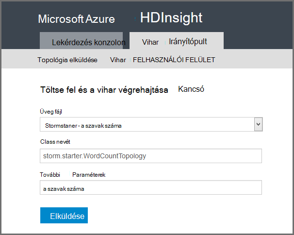

<properties
    pageTitle="A HDInsight Apache vihar – bevezetés |} Microsoft Azure"
    description="Egy ismertetés Apache vihar, és megtudhatja, hogyan használhatja vihar HDInsight a valós idejű adatok analytics-megoldások a felhőben."
    services="hdinsight"
    documentationCenter=""
    authors="Blackmist"
    manager="jhubbard"
    editor="cgronlun"
    tags="azure-portal"/>

<tags
   ms.service="hdinsight"
   ms.devlang="na"
   ms.topic="get-started-article"
   ms.tgt_pltfrm="na"
   ms.workload="big-data"
   ms.date="10/11/2016"
   ms.author="larryfr"/>

#A HDInsight Apache vihar – Bevezetés: valós idejű elemzésének Hadoop

A HDInsight Apache vihar elosztott, valós idejű analytics-megoldások létrehozása az Azure környezetben [Apache Hadoop](http://hadoop.apache.org)használatával teszi lehetővé.

##Mit nevezünk Apache vihar?

Apache vihar rendszer elosztott hibafa alternatív, Megnyitás-forrás kiszámítása, amely lehetővé teszi, hogy az adatai feldolgozása Hadoop valós időben. Vihar megoldások is biztosíthat garantált adatfeldolgozás, az azt jelenti, hogy az ismétlődő lejátszásra van állítva az első alkalommal nem sikerült feldolgozni adatokat.

##Miért érdemes használni a HDInsight vihar?

A HDInsight Apache vihar egy felügyelt fürt beépül az Azure környezetben. Azt az alábbi főbb előnyöket nyújtja:

* Az idő 99,9 %-át egy SLA felügyelt szolgáltatásként végrehajtása

* Használja a a választott nyelven: támogatást nyújt **Java**, **C#**és **Python** nyelven íródott vihar összetevők

    * Kombinálja a nyelvet támogatja: olvassa el az adatoknak Java, majd a folyamat C használatával#
    
        > [AZURE.NOTE] C# topológiák csak a Windows-alapú HDInsight fürt támogatja.

    * A **Trident** Java felület használata hozhat létre, amelyek támogatják a "pontosan után" vihar topológiák üzenetek, a "tranzakció alapú" adattárhoz adatmegőrzési és a gyakori műveletek a adatfolyam analytics halmazának feldolgozása

* Beépített skála felfelé és lefelé skála szolgáltatásai: vihar topológiák futó egy HDInsight fürthöz nincs hatása méretezése

* Integráció a többi Azure szolgáltatásaival, például esemény központi, Azure virtuális hálózati, SQL-adatbázissal, Blob-tárolóhoz és DocumentDB

    * Azure virtuális hálózati kombinálni fogja több HDInsight fürtre lehetőségeit: HDInsight, HBase vagy Hadoop fürt használó analitikus folyamatok létrehozása

A valós idejű analytics-megoldások Apache vihar használó vállalkozások, című témakör [Cégek használatával Apache vihar](https://storm.apache.org/documentation/Powered-By.html).

[A HDInsight vihar az első lépések]című vihar használatának megkezdéséhez[gettingstarted].

###Kezeléstechnikai kiépítése

Egy új vihar HDInsight fürt perc is kiépítése. Adja meg a csoport nevét, méretét, rendszergazdai fiókkal és a tárterület-fiókot. Azure a fürt, beleértve a minta topológiák és web-kezelés irányítópult hoz létre.

> [AZURE.NOTE] Akkor is kiépítése vihar fürt, az [Azure CLI](../xplat-cli-install.md) vagy [Azure PowerShell](../powershell-install-configure.md)használatával.

A kérelem elküldése 15 percen belül rendszerű új vihar fürtre lesz, és készen áll az első a valós idejű analytics csővezeték.

###Egyszerű használat érdekében

__A HDInsight fürt Linux-alapú vihar__, csatlakozhat a fürt SSH és használata a `storm` indítása és topológiák kezelése parancsot. Ezenkívül figyelheti a vihar szolgáltatás és a vihar felhasználói felületének figyelésére és kezelésére futó topológiák Ambari is használhatja.

Linux-alapú vihar fürt használata a további tudnivalókért olvassa el a [Apache vihar a Linux-alapú HDInsight – első lépések](hdinsight-apache-storm-tutorial-get-started-linux.md)című témakört.

__A Windows-alapú vihar a HDInsight fürt__, a HDInsight Tools for Visual Studio hozhatók létre C# és C# hibrid / Java topológiák, majd a vihar HDInsight fürt közzéteheti őket.  

HDInsight Tools for Visual Studio, amely lehetővé teszi, hogy figyelheti és kezelheti a fürthöz vihar topológiák felületet is tartalmaz.

Példa a HDInsight eszközeivel vihar-alkalmazás létrehozása [kialakítása C# vihar topológiák for Visual Studio HDInsight eszközökkel](hdinsight-storm-develop-csharp-visual-studio-topology.md)talál.

For Visual Studio HDInsight eszközökkel kapcsolatos további tudnivalókért olvassa el [a HDInsight Tools for Visual Studio használatának első lépései](../HDInsight/hdinsight-hadoop-visual-studio-tools-get-started.md)című témakört.

Minden egyes vihar HDInsight fürt a webes vihar irányítópult, amelyen elküldése, figyelésére és kezelése a a fürthöz vihar topológiák is tartalmaz.

A vihar irányítópult használatával kapcsolatos további tudnivalókért lásd: [Deploy és kezelheti a HDInsight Apache vihar topológiák](hdinsight-storm-deploy-monitor-topology.md).

A HDInsight vihar is tartalmaz egyszerű funkciók integrálása az Azure esemény hubok **Esemény központi Spout**keresztül. A legújabb összetevő [https://github.com/hdinsight/hdinsight-storm-examples/tree/master/lib/eventhubs](https://github.com/hdinsight/hdinsight-storm-examples/tree/master/lib/eventhubs)címen érhető el. Az összetevő használatával kapcsolatos további tudnivalókért lásd: a következő dokumentumokat.

* [A C# topológiában Azure esemény hubok használó kidolgozása](hdinsight-storm-develop-csharp-event-hub-topology.md)

* [Egy Java topológia Azure esemény hubok használó kidolgozása](hdinsight-storm-develop-java-event-hub-topology.md)

###Megbízhatósága

Apache vihar mindig garantálja, hogy minden bejövő üzenet fog teljesen dolgozható fel, akkor is, ha az adatelemzés van a csomópontok több száz elosztva.

A **Nimbus csomópont** hasonló funkciókat nyújt az Hadoop JobTracker, és a fürt **Zookeeper**keresztül más csomópontjának tevékenységek rendel. Zookeeper csomópontok a fürt összehangolása és megkönnyítése Nimbus és a **felügyelő** folyamat dolgozó csomópontok közötti kommunikáció. Ha egy feldolgozás csomópont megszakad, a Nimbus csomópont tájékoztatást kap, és a tevékenységek és a kapcsolódó adatok rendel egy másik csomópontra.

Az alapértelmezett adatokat Apache vihar, hogy csak egy Nimbus csomópontot. A HDInsight vihar futtatja a két Nimbus csomópontot. Ha nem sikerül az elsődleges csomópontot, a HDInsight fürt, miközben az elsődleges csomópontok van-e vissza váltani ezt a másodlagos csomópontot.

###Méretarány

Bár a fürt csomópontok számának létrehozása során adhatja meg, érdemes a nagyobb vagy kisebb a fürt terhelést megfelelően. Az összes HDInsight lehetővé teszi, hogy a fürt, található csomópontok számának megváltoztatása az adatok feldolgozása közben is.

> [AZURE.NOTE] Az átméretezés hozzáadni új csomópontot kihasználhatja szüksége lesz visszaállás topológiák lépések előtt a fürt mérete.

###Támogatás

A HDInsight vihar vállalati szintű 24/7 támogatási megtalálható. Vihar a HDInsight rendelkezik egy SLA 99,9 %-os is. Ez azt jelenti, hogy garantálja, hogy a fürt lesz külső connectivity az idő legalább 99,9 %.

##Valós idejű elemzéséhez közös használati eset

Az alábbiakban néhány gyakori alkalmazási területek, amelynek a használatához, így Apache vihar hdinsight szolgáltatásból lehetőségre. Valós életből esetek információkért olvassa el a [hogyan cégek vihar használja](https://storm.apache.org/documentation/Powered-By.html).

* Internetes dolgot (IoT)
* Csalás kimutatására
* Közösségi analytics
* Bontsa ki, átalakítás, terhelés (ETL)
* Hálózati figyelése
* Keresés
* Mobil tetszés szerint elmélyedhet

##Hogyan feldolgozott az adatok HDInsight vihar?

Apache vihar **topológiák** helyett a MapReduce feladatok, előfordulhat, hogy a HDInsight vagy Hadoop ismerős fut. A HDInsight fürthöz egy vihar kétféle csomópontok: **Nimbus** és dolgozó csomópontok **felügyelő**futó futó csomópontok központi.

* **Nimbus**: hasonlóan, mint a JobTracker a Hadoop, akkor a felelős a kódot a fürt egész terjesztése virtuális gépeken futó feladat kiosztása és figyelése a hiba. HDInsight nyújt két Nimbus csomópontok, így a nincs egyetlen pont vihar a HDInsight-hiba

* **Felügyelő**: A felügyelő dolgozó csomópontok a felelős a indítása és leállítása **dolgozó folyamatok** a csomópontra.

* **A munkafolyamat**: a **topológia**csak egy részhalmazát futtatja. A futó topológiában egész a fürt sok dolgozó folyamatok között van meghatározva.

* **Topológia**: **adatfolyamok** adatok feldolgozó számítási grafikonon határozza meg. Topológiák eltérően MapReduce feladatok, futtassa a őket bezárásáig.

* **Adatfolyam**: egy **kockára**kötetlen gyűjteménye. Adatfolyamok **spouts** és **bolts**készített, és azok felhasználja a program **bolts**.

* **Sor bármelyik eleme**: dinamikusan beírt értékek elnevezett listáját.

* **Spout**: adatforrásból származó adatok fogyasztása és bocsát ki egy vagy több **adatfolyam megjelenítését**.

    > [AZURE.NOTE] Sok esetben az adatok várólista, például Kafka, Azure Service Bus sorban várakozó vagy esemény hubok olvassa el. A várakozási sorban található biztosítja, hogy adatok megőrződnek, ha egy üzemszünetek.

* **Rögzített**: **adatfolyamok**fogyasztása feldolgozás végez **kockára**és **adatfolyamok**adhat. Csapszegek is adatok írása külső tárolóhoz, például egy várólista, HDInsight, HBase, blob vagy más adattár felelős.

* **Apache Thrift**: méretezhető nyelvre szolgáltatás fejlesztése szoftver keretét. Lehetővé teszi a C++, Java, Python, PHP, fonetikus, Erlang, Perl, Haskell, C#, kakaó, JavaScript, Node.js, Smalltalk és között más nyelveken használható szolgáltatások összeállítása.

    * **Nimbus** Thrift szolgáltatás, és a **topológia** Thrift definícióját, így lehetséges programnyelv számos topológiák fejlesztését.

Vihar összetevők kapcsolatos további tudnivalókért lásd: az [oktatóprogram vihar] [ apachetutorial] apache.org elemre.

##Milyen programozási nyelvek használhatók?

A HDInsight fürt vihar C#, Java és Python támogatást nyújt.

### C & #35;

A HDInsight Tools for Visual Studio .NET fejlesztők tervezése és megvalósítása a topológia C# lehetővé. Java a és C# összetevőket is elhelyez hibrid topológiák is létrehozhat.

További tudnivalókért lásd: [a Visual Studio segítségével HDInsight Apache vihar topológiát kidolgozása C#](hdinsight-storm-develop-csharp-visual-studio-topology.md).

###Java

Fel, amelyekkel a legtöbb Java Példa egyszerű Java vagy a Trident lesz. Trident alkalmazva könnyebben elvégezhetők az illesztés, csoportosítás és szűrés összesítések, például dolgot kell tennie a magas szintű absztrakció. Azonban Trident dolgozza fel kötegenként kockára, mivel a nyers Java megoldást adatfolyam egy sor bármelyik eleme feldolgozásával egyszerre.

Trident kapcsolatos további tudnivalókért lásd: a [Trident oktatóprogram](https://storm.apache.org/documentation/Trident-tutorial.html) apache.org elemre.

Java- és Trident topológiák példák a HDInsight fürt a [Példa vihar topológiák listáját](hdinsight-storm-example-topology.md) vagy a vihar-starter példák látható.

A vihar-starter példák találhatók Linux-alapú fürt __/usr/hdp/current/storm-client/contrib/storm-starter__ könyvtárában található, és a Windows-alapú fürt **%storm_home%\contrib\storm-starter** könyvtárában található.

##Mik azok a néhány gyakori fejlesztési mintázatok?

###Garantálja az üzenetek feldolgozása

Vihar garantált üzenet feldolgozási különböző mértékű lehet nyújtani. Például egy egyszerű vihar alkalmazást a legkisebb – egyszeri feldolgozás biztosítható, és Trident pontosan biztosítható-egyszer feldolgozása.

További tudnivalókért lásd: [adatfeldolgozási garanciákkal](https://storm.apache.org/about/guarantees-data-processing.html) apache.org a.

###IBasicBolt

A beviteli sor bármelyik eleme, nulla vagy több kockára, majd a beviteli sor bármelyik eleme azonnal végén található a végrehajtás módszer acking vezérlés olvasási szerkezet gyakori, és vihar ezt a minta automatizálhatja a [IBasicBolt](https://storm.apache.org/apidocs/backtype/storm/topology/IBasicBolt.html) felületet biztosít.

###Illesztés

Az adatok két adatfolyamok csatlakozás változhatnak alkalmazások között. Például a több adatfolyamok minden egyes sor bármelyik eleme illeszthető be egy új adatfolyam, vagy csak egy adott ablak kockára kötegenként illeszthető. Mindkét esetben csatlakozás lehet megvalósítani segítségével [fieldsGrouping](http://javadox.com/org.apache.storm/storm-core/0.9.1-incubating/backtype/storm/topology/InputDeclarer.html#fieldsGrouping%28java.lang.String,%20backtype.storm.tuple.Fields%29), amely kockára továbbításáról való csapszegek meghatározása lehetőséget.

A következő példában Java fieldsGrouping szolgál, amely a **MyJoiner** rögzített az "1", "2" és "3" összetevők származik kockára irányítja.

    builder.setBolt("join", new MyJoiner(), parallelism) .fieldsGrouping("1", new Fields("joinfield1", "joinfield2")) .fieldsGrouping("2", new Fields("joinfield1", "joinfield2")) .fieldsGrouping("3", new Fields("joinfield1", "joinfield2"));

###Kötegelés

Kötegelés elvégezhető többféle módon. Egy egyszerű vihar Java topológia, előfordulhat, hogy használja egyszerű számláló kockára köteg X számú előtt vezérlés őket, vagy egy belső időzítés mechanizmusa elhelyezése egy köteg X másodpercenként a "osztásjelek rekordhoz" néven.

Példa osztásjelek kockára használ olvassa el a [elemzése szenzoradatokat vihar és a HDInsight HBase](hdinsight-storm-sensor-data-analysis.md)című témakört.

Trident használatakor alapul kockára kötegenként feldolgozása.

###Gyorsítótár

A memóriában gyorsítótárazás gyakran használatos a kisalkalmazások felgyorsítása feldolgozást, mert gyakran továbbra is használt eszközök a memóriában. Mivel a topológia több csomópontot, és minden csomópont belül több folyamatok között van meghatározva, érdemes [fieldsGrouping](http://javadox.com/org.apache.storm/storm-core/0.9.1-incubating/backtype/storm/topology/InputDeclarer.html#fieldsGrouping%28java.lang.String,%20backtype.storm.tuple.Fields%29) annak érdekében, hogy a keresési gyorsítótárat használt mezőket tartalmazó kockára mindig vannak-e irányítva ugyanezt az eljárást. Ezzel elkerülhető a gyorsítótár-bejegyzések a párhuzamos folyamatok között.

###A folyamatos átvitelű legnépszerűbb vagy legnagyobb N

Ha a topológia függ, hogy "legnépszerűbb vagy legnagyobb N" érték, például a Twitteren, a felső 5 trendek számítása párhuzamosan legnépszerűbb vagy legnagyobb N értékét számítja ki, és ilyen típusú számításokat kimenetét majd egyesíti a globális érték. Ez történik [fieldsGrouping](http://javadox.com/org.apache.storm/storm-core/0.9.1-incubating/backtype/storm/topology/InputDeclarer.html#fieldsGrouping%28java.lang.String,%20backtype.storm.tuple.Fields%29) útvonalat a párhuzamos csapszegek (Ez az adatok partíciók mező érték szerinti) mező alapján, és egy vég globálisan a legnépszerűbb vagy legnagyobb N értéket meghatározó majd útvonalat használatával.

Ez a példa a [RollingTopWords](https://github.com/nathanmarz/storm-starter/blob/master/src/jvm/storm/starter/RollingTopWords.java) példa témakörben talál.

##Milyen típusú naplózás nem vihar használatát?

Vihar információk naplózása Apache Log4j használja. Alapértelmezés szerint egy nagy mennyiségű adatot be van jelentkezve, és az adatok rendezéséhez nehéz lehet. A vezérlő viselkedése naplózás vihar topológiát részeként naplózás konfigurációs fájl is felvehet.

Egy példa topológia, amely bemutatja, hogyan naplózási tekintse meg [Java-alapú WordCount](hdinsight-storm-develop-java-topology.md) példa vihar a hdinsight szolgáltatásból lehetőségre.

##Következő lépések

További információ a HDInsight Apache vihar valós idejű analytics-megoldások:

* [A HDInsight vihar – első lépések][gettingstarted]

* [Példa a HDInsight vihar topológiát](hdinsight-storm-example-topology.md)

[stormtrident]: https://storm.apache.org/documentation/Trident-API-Overview.html
[samoa]: http://yahooeng.tumblr.com/post/65453012905/introducing-samoa-an-open-source-platform-for-mining
[apachetutorial]: https://storm.apache.org/documentation/Tutorial.html
[gettingstarted]: hdinsight-apache-storm-tutorial-get-started-linux.md
