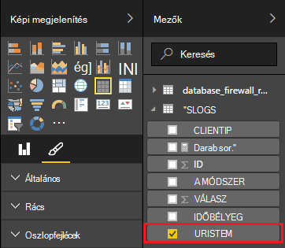

<properties
 pageTitle="Apache vihar használata a Power BI |} Microsoft Azure"
 description="A a HDInsight-Apache vihar fürthöz C# topológia adata használatos Power BI-jelentés létrehozása."
 services="hdinsight"
 documentationCenter=""
 authors="Blackmist"
 manager="jhubbard"
 editor="cgronlun"
    tags="azure-portal"/>

<tags
 ms.service="hdinsight"
 ms.devlang="dotnet"
 ms.topic="article"
 ms.tgt_pltfrm="na"
 ms.workload="big-data"
 ms.date="10/27/2016"
 ms.author="larryfr"/>

# Egy Apache vihar topológia adatainak ábrázolása a Power BI segítségével

A Power BI adatok vizuális megjelenítése jelentésként teszi lehetővé. A Visual Studio sablonok használata a HDInsight vihar esetén egyszerűen használata típusú adatokat tárolja az SQL Azure HDInsight fürt egy Apache vihar futó egy topológia, és ezután ábrázolása a Power BI segítségével adatokat.

A jelen dokumentum megtanulhatja, hogyan kell használni a Power BI-jelentés létrehozása az adatokból egy Apache vihar topológia hozza létre, és Azure SQL-adatbázisban tárolt.

> [AZURE.NOTE] A dokumentumban a lépéseket a Windows fejlesztői környezet a Visual Studio olyan van szüksége, miközben a lefordított projekt elküldhetők Linux vagy Windows-alapú HDInsight fürthöz. Csak Linux-alapú fürt után létrehozott 10/28/2016 támogatási SCP.NET topológiák.
>
> Linux-alapú fürt C# topológia használatához frissítenie kell a Microsoft.SCP.Net.SDK NuGet csomag verzióra 0.10.0.6 a projekt által használt vagy újabb verziójában. A csomag verziójának is egyeznie kell a főverzióját vihar telepítve van a hdinsight szolgáltatásból lehetőségre. Ha például a 3.3 és 3.4 HDInsight verzióján vihar vihar verzióját használja, míg a HDInsight 3.5-ös verzióját használja vihar 0.10.x 1.0.x.
> 
> A Linux-alapú fürt topológiák C# kell .NET 4.5 használja, és egyszínű használja a HDInsight fürt futtatásához. Elérhető összetevők többsége fog működni, azonban nézze meg az esetleges kompatibilitási problémák [Egyszínű kompatibilitási](http://www.mono-project.com/docs/about-mono/compatibility/) kívánt dokumentumot.
>
> Ehhez a projekthez is működnek még a Linux- vagy Windows-alapú fürthöz, Java változata lásd: [Azure esemény hubok vihar HDInsight (Java) kattintson a folyamat eseményeit](hdinsight-storm-develop-java-event-hub-topology.md).

## Előfeltételek

- Egy Azure-előfizetést. Lásd: [Ismerkedés az Azure ingyenes próbaverziót](https://azure.microsoft.com/documentation/videos/get-azure-free-trial-for-testing-hadoop-in-hdinsight/).

* Egy [Power BI](https://powerbi.com) hozzáféréssel rendelkező Azure Active Directory-felhasználó

* Visual Studio (egy, a következő verziók)

    * Visual Studio 2012 a [4-es frissítése](http://www.microsoft.com/download/details.aspx?id=39305)

    * Visual Studio 2013 [frissítése a 4-es](http://www.microsoft.com/download/details.aspx?id=44921) vagy [Visual Studio 2013 Közösség](http://go.microsoft.com/fwlink/?linkid=517284&clcid=0x409)

    * [Visual Studio 2015](https://www.visualstudio.com/downloads/download-visual-studio-vs.aspx)

* A HDInsight Tools for Visual Studio: [a HDInsight Tools for Visual Studio használatának első lépései](../HDInsight/hdinsight-hadoop-visual-studio-tools-get-started.md) a telepítési információ információk találhatók.

## Működése

Ez a példa tartalmazza a C# vihar topológiában által generált véletlen a naplóadatokat Internet Information Services (IIS). Az adatok majd íródott SQL-adatbázishoz, és onnan szolgál a jelentések készítése a Power BI szolgáltatásban.

Az alábbiakban megtalálja az ebben a példában a fő funkcionalitását használó fájlok listája.

* **SqlAzureBolt.cs**: a vihar topológiában SQL-adatbázishoz előállított adatokat ír.

* **IISLogsTable.sql**: A Transact-SQL-utasítások az adatbázist, amely az adatok található létrehozásához használt.

> [AZURE.WARNING] A HDInsight fürt a topológia indításához, létre kell hoznia a tábla SQL-adatbázisban.

## A példa letöltése

Töltse le a [Power BI HDInsight C# vihar példa](https://github.com/Azure-Samples/hdinsight-dotnet-storm-powerbi). Letöltéséhez, elágazó/adatfeliratsor, [mely számjegy](http://git-scm.com/)használatával, vagy használja a **Töltse le a** hivatkozást egy .zip az archívum letöltéséhez.

## Adatbázis létrehozása

1. Az [SQL-adatbázis oktatóprogram](../sql-database/sql-database-get-started.md) dokumentum ismertetett lépésekkel hozhatja létre egy új SQL-adatbázis létrehozása.

2. Csatlakozás az adatbázist a [Csatlakozás a Visual Studio SQL-adatbázishoz](../sql-database/sql-database-connect-query.md) dokumentumban lépéseket követve az adatbázishoz való csatlakozáshoz.

4. Az adatbázisban, az objektum Explorerben kattintson a jobb gombbal, és hozzon létre egy __Új lekérdezést__. A lekérdezés ablakba a letöltött projektben szereplő __IISLogsTable.sql__ fájl tartalmának beillesztése, és majd használja a Ctrl + Shift + E végrehajtja a lekérdezést. A command(s) sikeresen befejeződött üzenet kell kapnia.

    Ha befejeződött, új táblázat __IISLOGS__ az adatbázis lesz.

## A minta konfigurálása

1. Az [Azure portál](https://portal.azure.com)jelölje ki az SQL-adatbázis. Az SQL-adatbázis lap __Essentials__ csoportban kattintson a __adatbázis csatlakozási_karakterlánc megjelenítése__. A megjelenő listából másolja be az __ADO.NET (SQL-hitelesítés)__ adatait.

1. Nyissa meg a minta Visual Studio. A **Megoldás Explorer**a **App.config** fájlra, és keresse meg a következő bejegyzés:

        <add key="SqlAzureConnectionString" value="##TOBEFILLED##" />
    
    Az adatbázis-kapcsolati karakterláncot, az előző lépésben a vágólapra másolt lecseréli a __## TOBEFILLED ##__ értékét. Cseréje __{a\_username}__ és __{a\_jelszó}__ a felhasználónév és jelszó az adatbázishoz.

2. Mentse és zárja be a fájlokat.

## A minta terjesztése

1. A **Megoldás Explorer**. Kattintson a jobb gombbal a **StormToSQL** projekt, és válassza a **Küldés gombot a HDInsight vihar**. Jelölje ki a HDInsight fürt **Vihar fürt** legördülő párbeszédpanel.

    > [AZURE.NOTE] Eltarthat néhány másodpercig a **Vihar fürt** legördülő kiszolgálóneveket kitöltéséhez.
    >
    > Ha a rendszer kéri, írja be a bejelentkezési adatok Azure előfizetését. Ha egynél több előfizetése van, jelentkezzen be az adott, amely tartalmazza a vihar HDInsight fürt.

2. Ha a topológia sikeres elküldését, az vihar topológiák a fürt jelenjenek meg. Jelölje ki a SqlAzureWriterTopology a listában, és megtekintheti a futó topológia adatait.

    

    Ez a nézet használatával, vagy a topológia című témakörben olvashat információt, kattintson duplán a bejegyzések (például a SqlAzureBolt) lásd: a topológia összetevő-specifikus adatait.

3. Után a topológia van néhány percig, térjen vissza az adatbázis létrehozásához használt SQL-lekérdezés ablak futtatta. A meglévő kimutatások lecserélése a következőre.

        select * from iislogs;
    
    Használat Ctrl + Shift + E végrehajtani a lekérdezést, és az alábbihoz hasonló eredményt kell kapnia.
    
        1   2016-05-27 17:57:14.797 255.255.255.255 /bar    GET 200
        2   2016-05-27 17:57:14.843 127.0.0.1   /spam/eggs  POST    500
        3   2016-05-27 17:57:14.850 123.123.123.123 /eggs   DELETE  200
        4   2016-05-27 17:57:14.853 127.0.0.1   /foo    POST    404
        5   2016-05-27 17:57:14.853 10.9.8.7    /bar    GET 200
        6   2016-05-27 17:57:14.857 192.168.1.1 /spam   DELETE  200

    Az adatok az a vihar topológia írt.

## Jelentés készítése

1. Az [összekötő Azure SQL-adatbázis](https://app.powerbi.com/getdata/bigdata/azure-sql-database-with-live-connect) csatlakoztatása a Power BI.

2. Belül __adatbázisok__jelölje be az __első__.

3. Jelölje ki az __Azure SQL-adatbázissal__, és válassza a __Csatlakozás__.

4. Írja be az adatokat az Azure SQL-adatbázis csatlakoztatása. Ez az [Azure portálon](https://portal.azure.com) megtalálhatók, és válassza az SQL-adatbázis is megkeresheti.

    > [AZURE.NOTE] Is beállíthatja, hogy a frissítési időköz és egyéni szűrőket a Csatlakozás párbeszédpanel __Speciális beállítások engedélyezése__ használatával.

5. Miután felvette a, csatlakozva adatbázisként megjelenik egy ilyen nevű új adatkészletet. Jelölje ki az adatkészlet jelentés tervezése a kezdéshez.

3. __Mezők__bontsa ki a __IISLOGS__ bejegyzést. Jelölje be a __URISTEM__. Ezzel létrehoz egy új jelentést, amely felsorolja a URI szárú (/ élőlá, és sáv-, stb) az adatbázis-e jelentkezve.

    

5. Ezután húzza __módszer__ a jelentést. A jelentés a szárú és a HTTP-kérés használt megfelelő HTTP módszer listáját frissíti.

    

4. A __képi megjelenítések__ oszlopban kattintson a __mezők__ ikonra, és __értékek__ szakaszában válassza ki a __mód__ melletti lefelé mutató nyílra. A megjelenő listából válassza ki a __darab__. Ez a jelentés egy adott URI elért hány alkalommal számának felsoroló változik.

    

6. Ezután kattintson a __Halmozott oszlop típusú diagram__ az adatok megjelenítésének módosítása.

    

7. Ha befejezte a jelentés dönt, használja a __Mentés__ bejegyzést a menüben írjon be egy nevet, és menti a jelentést.

## A topológia leállítása

A topológia továbbra is mindaddig, amíg le, vagy törölje a vihar HDInsight fürt működni fog. A következő lépésekkel le szeretné állítani a topológia.

1. A Visual Studióban térjen vissza a topológia megjelenítő, és válassza ki a topológia.

2. Jelölje ki a le szeretné állítani a topológia **törlése** gombra.

    

## A csoport törlése

[AZURE.INCLUDE [delete-cluster-warning](../../includes/hdinsight-delete-cluster-warning.md)]

## Következő lépések

A dokumentumban hogyan adatok küldése a vihar topológiában SQL-adatbázishoz, majd a Power BI használata adatok ábrázolása megtanulta azt. Más Azure HDInsight vihar használata technológiákkal kapcsolatos további tudnivalókért lásd a következő:

* [Példa a HDInsight vihar topológiát](hdinsight-storm-example-topology.md)
