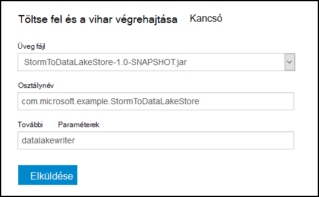
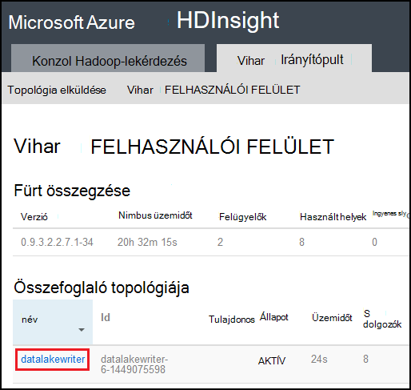

<properties
pageTitle="Használata Azure adatok tó áruházból Apache vihar a Azure hdinsight szolgáltatáshoz"
description="Megtudhatja, hogy miként írják adatok tó adattár Azure-Apache vihar topológia a hdinsight szolgáltatásból lehetőségre. Ezt a dokumentumot, és a kapcsolódó példa bemutatják, hogyan a HdfsBolt összetevő is használható tó adattár írni."
services="hdinsight"
documentationCenter="na"
authors="Blackmist"
manager="jhubbard"
editor="cgronlun"/>

<tags
ms.service="hdinsight"
ms.devlang="na"
ms.topic="article"
ms.tgt_pltfrm="na"
ms.workload="big-data"
ms.date="09/06/2016"
ms.author="larryfr"/>

#Használata Azure adatok tó áruházból Apache vihar a hdinsight szolgáltatáshoz

Azure tó adattár egy Fájlrendszerhez kompatibilis felhőalapú tárhelyszolgáltatáshoz magas átviteli, elérhetőségét, tartóssági és megbízhatóságára biztosít az adatok. A jelen dokumentum megtanulhatja a Java-alapú vihar topológiában használata adatok írásához a Azure tó adattár összetevővel [HdfsBolt](http://storm.apache.org/javadoc/apidocs/org/apache/storm/hdfs/bolt/HdfsBolt.html) , amelyről az Apache vihar részeként.

> [AZURE.IMPORTANT] A példa topológiát, a dokumentumban használt összetevők szerepelnek, amelyek a HDInsight fürt vihar mellékelt és Azure tó adattár más Apache vihar fürt együtt használva dolgozhat módosítás megkövetelheti támaszkodik.

##Előfeltételek

* [Java JDK 1.7](https://www.oracle.com/technetwork/java/javase/downloads/jdk7-downloads-1880260.html) vagy újabb
* [Maven tesztelése 3.x](https://maven.apache.org/download.cgi)
* Az Azure előfizetéssel
* A 3,2 HDInsight fürt verzión vihar. Hozzon létre egy új vihar HDInsight fürt, a [HDInsight használata tó áruházzal Azure használata](../data-lake-store/data-lake-store-hdinsight-hadoop-use-portal.md) dokumentumban lépésekkel hozhatja létre. A lépéseket a jelen dokumentum azt ismerteti, hogy egy új HDInsight fürt és Azure tó adattár létrehozásának folyamatát.  

    > [AZURE.IMPORTANT] A HDInsight fürt létrehozásakor __vihar__ fürt típusát, és __a 3,2__ verziót kell jelölnie. Az operációs rendszer lehet Windows vagy Linux rendszerhez.  

###Változók környezet beállítása

A fejlesztői számítógépen Java- és a JDK telepítésekor az alábbi környezeti változók adható meg. Jó helyen jár ellenőrizze, hogy vannak, és a rendszer a megfelelő értékeket tartalmaznak.

* A címtárhoz, amelyen telepítve van a (JRE) Java-futtatókörnyezet __JAVA_HOME__ - kell mutatnia. Például a Unix vagy Linux terjesztési, meg kell kell egy értéknek hasonló `/usr/lib/jvm/java-7-oracle`. A Windows rendszerben, azt szeretné, hogy egy hasonló értéket `c:\Program Files (x86)\Java\jre1.7`.

* __Elérési út__ - kell tartalmaznia az alábbi elérési utak:

    * __JAVA\_OTTHONI__ (vagy a megfelelő elérési út)
    
    * __JAVA\_HOME\bin__ (vagy a megfelelő elérési út)
    
    * A könyvtár, amelyen telepítve van a maven tesztelése

##Topológia végrehajtása

A példában a dokumentumban használt Java írott, és használja az alábbiakat:

* __TickSpout__: a topológia más összetevőket által használt adatok hoz létre.

* __PartialCount__: megszámolja TickSpout által létrehozott események.

* __FinalCount__: összegzések megszámolása PartialCount adatait.

* __ADLStoreBolt__: Azure tó adattár [HdfsBolt](http://storm.apache.org/javadoc/apidocs/org/apache/storm/hdfs/bolt/HdfsBolt.html) összetevővel adatot ír.

A projektet, amely tartalmazza a topológia [https://github.com/Azure-Samples/hdinsight-storm-azure-data-lake-store](https://github.com/Azure-Samples/hdinsight-storm-azure-data-lake-store)letölthető érhető el.

###ADLStoreBolt ismertetése

A ADLStoreBolt az Azure adatok tó ír, a topológia HdfsBolt példány nevét. Ez nem HdfsBolt; a Microsoft által létrehozott egy speciális változata azonban azt támaszkodhat core-webhely konfigurációs értékek, valamint az adatok tó való kommunikáció Azure hdinsight szolgáltatáshoz mellékelt Hadoop-összetevők.

Kifejezetten amikor létrehoz egy HDInsight fürthöz, társíthat azt egy Azure adatok tó áruházból. Ez a core-webhely tó adattár lehetőséget választotta, a bejegyzéseket tó áruházzal kommunikáció engedélyezése például hadoop-ügyfél és a hadoop-fájlrendszerhez összetevők által használt ír.

> [AZURE.NOTE] A Microsoft járult Apache Hadoop és vihar projektek kódot, amely lehetővé teszi az Azure tó adattár és Azure Blob-tároló való kommunikáció, de ez a funkció nem szerepelhetnek más Hadoop és vihar terjesztését alapértelmezés szerint.

A topológiában HdfsBolt konfigurációja a következőképpen:

    // 1. Create sync and rotation policies to control when data is synched
    //    (written) to the file system and when to roll over into a new file.
    SyncPolicy syncPolicy = new CountSyncPolicy(1000);
    FileRotationPolicy rotationPolicy = new FileSizeRotationPolicy(0.5f, Units.KB);
    // 2. Set the format. In this case, comma delimited
    RecordFormat recordFormat = new DelimitedRecordFormat().withFieldDelimiter(",");
    // 3. Set the directory name. In this case, '/stormdata/'
    FileNameFormat fileNameFormat = new DefaultFileNameFormat().withPath("/stormdata/");
    // 4. Create the bolt using the previously created settings,
    //    and also tell it the base URL to your Data Lake Store.
    // NOTE! Replace 'MYDATALAKE' below with the name of your data lake store.
    HdfsBolt adlsBolt = new HdfsBolt()
        .withFsUrl("adl://MYDATALAKE.azuredatalakestore.net/")
        .withRecordFormat(recordFormat)
        .withFileNameFormat(fileNameFormat)
        .withRotationPolicy(rotationPolicy)
        .withSyncPolicy(syncPolicy);
    // 4. Give it a name and wire it up to the bolt it accepts data
    //    from. NOTE: The name used here is also used as part of the
    //    file name for the files written to Data Lake Store.
    builder.setBolt("ADLStoreBolt", adlsBolt, 1)
      .globalGrouping("finalcount");
      
Ha már jól ismert HdfsBolt használatával, megfigyelheti, hogy ez a beállítás az összes meglehetősen szabványos kivételével az URL-címet. Az URL-cím elérési útját az Azure adattár tó legfelső szintű biztosít.

Mivel tó adattár írása HdfsBolt használ, és csak egy URL-cím módosítása, láthatja, bármelyik meglévő topológia, amely Fájlrendszerhez vagy HdfsBolt használatával WASB ír, és könnyen módosíthatja Azure adatok tó tároló használatára.

##Szerkesztés és a topológia csomag

1. Töltse le a példa projekt [https://github.com/Azure-Samples/hdinsight-storm-azure-data-lake-store](https://github.com/Azure-Samples/hdinsight-storm-azure-data-lake-store
) a fejlesztői környezetben.

2. Nyissa meg a `StormToDataLake\src\main\java\com\microsoft\example\StormToDataLakeStore.java` -szerkesztőben fájl, és keresse meg a vonalat tartalmazó `.withFsUrl("adl://MYDATALAKE.azuredatalakestore.net/")`. Változás __MYDATALAKE__ az Azure tó adattár használt létrehozása a HDInsight-kiszolgáló neve.

3. A parancs kérdés, terminált, vagy shell-munkamenetet, módosítása könyvtárak a letöltött projekt legfelső szintű, és futtassa az alábbi parancsokat létre, és a topológia csomag.

        mvn compile
        mvn package
    
    Ha befejeződött a Szerkesztés és csomagolása, az új nevű könyvtárában lesz `target`, nevű fájlt tartalmazó `StormToDataLakeStore-1.0-SNAPSHOT.jar`. A lefordított topológia tartalmaz.

##Üzembe helyezéséhez és Linux-alapú HDInsight futtatni

Ha létrehozott egy Linux-alapú vihar HDInsight fürt, használatával az alábbi lépésekkel telepítése és futtatása a topológia.

1. A következő paranccsal másolja a vágólapra a topológia a HDInsight fürthöz. __Felhasználói__ cserélje le a fürt létrehozásakor használt SSH felhasználó nevére. __CLUSTERNAME__ cserélje le a csoport nevére.

        scp target\StormToDataLakeStore-1.0-SNAPSHOT.jar USER@CLUSTERNAME-ssh.azurehdinsight.net:StormToDataLakeStore-1.0-SNAPSHOT.jar
    
    Amikor a rendszer kéri, adja meg a jelszót a fürt felhasználó SSH létrehozásánál használt. Jelszó helyett egy nyilvános kulcs használata esetén szüksége lehet használni a `-i` paraméterrel adja meg a megfelelő titkos kulcs elérési útja.
    
    > [AZURE.NOTE] Alkalmazás használatakor a Windows-ügyfél fejlesztése, akkor valószínűleg nincs egy `scp` parancsot. Ha igen, használható `pscp`, amely érhető el a [http://www.chiark.greenend.org.uk/~sgtatham/putty/download.html](http://www.chiark.greenend.org.uk/~sgtatham/putty/download.html).

2. Ha a feltöltés befejeződött, a következő segítségével csatlakozzon a HDInsight fürthöz SSH használatával. __Felhasználói__ cserélje le a fürt létrehozásakor használt SSH felhasználó nevére. __CLUSTERNAME__ cserélje le a csoport nevére.

        ssh USER@CLUSTERNAME-ssh.azurehdinsight.net

    Amikor a rendszer kéri, adja meg a jelszót a fürt felhasználó SSH létrehozásánál használt. Jelszó helyett egy nyilvános kulcs használata esetén szüksége lehet használni a `-i` paraméterrel adja meg a megfelelő titkos kulcs elérési útja.
    
    > [AZURE.NOTE] Alkalmazás használatakor a Windows-ügyfél fejlesztése, kövesse az információkat a [Csatlakozás és a Windows SSH Linux-alapú HDInsight](hdinsight-hadoop-linux-use-ssh-windows.md) információt a gitt ügyfelet használ a fürthöz csatlakozni.
    
3. Miután létrejött, a következő segítségével a topológia indítása:

        storm jar StormToDataLakeStore-1.0-SNAPSHOT.jar com.microsoft.example.StormToDataLakeStore datalakewriter
    
    Elindítja a egy könnyen megjegyezhető nevet a topológia `datalakewriter`.

##Üzembe helyezéséhez és a Windows-alapú HDInsight futtatása

1. Nyisson meg egy webböngészőt, és nyissa meg a HTTPS://CLUSTERNAME.azurehdinsight.net, hol __CLUSTERNAME__ -e a HDInsight fürt nevét. Amikor a rendszer kéri, adja meg a rendszergazdai felhasználónevével (`admin`) és a jelszót, amelyet a csoport létrehozásakor az ehhez a fiókhoz használja.

2. Az vihar irányítópult lapon jelölje ki __tallózással keresse meg__ a __Fájl Jar__ legördülő listában, majd jelölje ki a StormToDataLakeStore-1.0-SNAPSHOT.jar fájlból a `target` címtár. Más elemeit az űrlapon a következő értékeket használja:

    * Osztálynév: com.microsoft.example.StormToDataLakeStore
    * További paramétereket: datalakewriter
    
    

3. Válassza a __Küldés__ gombot tölthet fel, és indítsa el a topológia. Az eredmény mező alatt a __Küldés__ gomb az alábbihoz hasonló adatokat megjelenjen-e a topológia megkezdése után:

        Process exit code: 0
        Currently running topologies:
        Topology_name        Status     Num_tasks  Num_workers  Uptime_secs
        -------------------------------------------------------------------
        datalakewriter       ACTIVE     68         8            10        

##Kimeneti adatainak megtekintése

Többféle módon szeretné megjeleníteni az adatokat. Ebben a részben fogjuk kiszámolni az Azure-portálra, és a `hdfs` parancs az adatok megtekintéséhez.

> [AZURE.NOTE] Engedélyezze az topológiák futtatásához néhány percet, mielőtt a kimeneti adatai ellenőrzése, hogy az adatok szinkronizálni lett kell Azure tó adattár több fájlokat.

* __Az [Azure-portálon](https://portal.azure.com)__: a portálon válassza az Azure tó adattár, HDInsight használt.

    > [AZURE.NOTE] Az Azure portál irányítópult adattár tó nem fejeződött rögzít, __tallózással keresse meg__ a listában a bal oldali, majd __Tó adattár__alján, végül gomb kiválasztásával az üzlet megtalálhatja.
    
    Jelölje ki az adatok tó tároló a felső részén található ikonokra, __Adatok Explorer__.
    
    
    
    Ezután jelölje ki a __stormdata__ mappát. Megjelenítendő szöveget fájlok listája.
    
    
    
    Jelölje ki azt a fájlok tartalmának megtekintéséhez.

* __A fürt__: Ha a HDInsight fürthöz SSH (Linux fürthöz) kapcsolt, illetve távoli asztali (Windows fürthöz), a következő használatával megtekintheti az adatokat. __DATALAKE__ cserélje ki az adatok tó tároló neve

        hdfs dfs -cat adl://DATALAKE.azuredatalakestore.net/stormdata/*.txt

    Ez lesz ÖSSZEFŰZ a könyvtárra, és az adatok megjelenítése a következőhöz hasonló tárolt fájlok:
    
        406000000
        407000000
        408000000
        409000000
        410000000
        411000000
        412000000
        413000000
        414000000
        415000000
        
##A topológia leállítása

Vihar topológiák fog futni mindaddig, amíg a le vagy a fürt törlése. Le szeretné állítani az topológiák, használja az alábbi információkat.

__A HDInsight Linux-alapú__:

Egy SSH munkamenetből a fürthöz használja az alábbi parancsot:

    storm kill datalakewriter

__A Windows-alapú HDInsight__:

1. Az vihar irányítópult (https://CLUSTERNAME.azurehdinsight.net) jelölje be a __Vihar felhasználói felület__ hivatkozásra a lap tetején.

2. A felhasználói felület vihar betölti, miután jelölje ki a __datalakewriter__ hivatkozásra.

    

3. __Topológia műveletek__ csoportban válassza ki a __törlése__ , és válassza a megjelenő párbeszédpanelen kattintson az OK gombra.

    

## A csoport törlése

[AZURE.INCLUDE [delete-cluster-warning](../../includes/hdinsight-delete-cluster-warning.md)]

##Következő lépések

Most, hogy rendelkezik megtanulta vihar használatáról az Azure tó adattár írni, felfedezése más [HDInsight vihar példákat is tartalmaz](hdinsight-storm-example-topology.md).
