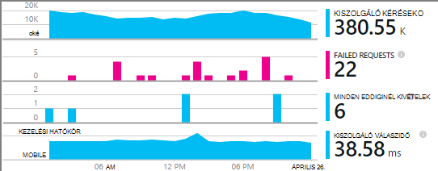

<properties
    pageTitle="Példa MyDriving Azure IoT: azt összeállítása |} Microsoft Azure"
    description="Hozzon létre egy alkalmazást, amely egy teljes szeretné, hogy miként tervezővel egy IoT rendszer Microsoft Azure Értékáram-elemzés, gépi tanulási és esemény hubok használatával."
    services=""
    documentationCenter=".net"
    suite=""
    authors="harikmenon"
    manager="douge"/>

<tags
    ms.service="multiple"
    ms.workload="tbd"
    ms.tgt_pltfrm="ibiza"
    ms.devlang="dotnet"
    ms.topic="article"
    ms.date="03/25/2016"
    ms.author="harikm"/>


# <a name="build-and-deploy-the-mydriving-solution-to-your-environment"></a>Építse fel és telepítse a MyDriving megoldás az környezetbe

MyDriving adatait gyűjti össze a autós gépi tanulási használatával dolgozza fel, és hogyan jeleníti meg a mobiltelefonjára dolog Internet (IoT) megoldást. A háttér, ahol a Microsoft Azure által biztosított szolgáltatások számos. Az ügyfelek lehet Android, az iOS és a Windows 10-telefonokat.

Létrehozott ad a saját IoT rendszer létrehozása egy jumpstart MyDriving megoldás. A [MyDriving tárházából GitHub](https://github.com/Azure-Samples/MyDriving), az erőforrás-kezelő Azure parancsfájlok bevezetését tervezi a háttéradatbázist architektúra saját Azure-fiókba elérheti. Helyről a különböző szolgáltatásokat átkonfigurálása, módosítsa a lekérdezések megfeleljen a saját adatain, és így tovább. A parancsfájlok – többek között a mobilalkalmazásban az Azure alkalmazás szolgáltatáshoz tartozó API-projektet, és – a MyDriving adattárban kóddal együtt is megkeresheti.

Ha még nem próbálkozott még az alkalmazás, tekintse meg az [első lépések útmutató](iot-solution-get-started.md).

Van egy részletes fiókot a [MyDriving útmutató](http://aka.ms/mydrivingdocs)felépítésének. Az összegzés van több darab, amely azt állíthatja be, és szeretné beállítani legfeljebb hasonló projekt létrehozása:

* Egy **ügyfél alkalmazás** Android, az iOS és a Windows 10-es telefonos fut. A Xamarin platform használjuk megosztása nagy, a kód, a GitHub a tárolt `src/MobileApp`. Az alkalmazás ténylegesen két különböző műveleteket hajtja végre:
 * A fedélzeti diagnosztika (OBD) eszközről és a saját hely szolgáltatás, a rendszer felhő vissza végére az telemetriai továbbítja azt.
 * Egy felhasználói felület, ahol felhasználók is lekérdezése a rögzített közúti utakat.
* Az útpálya-utazás adatok valós idejű ingests egy **felhőalapú szolgáltatásba** , és dolgozza fel. A fő munka létrehozásának ezt a szolgáltatást, hogy válassza, paraméterezni, vezetékes Azure szolgáltatások számos be. Az egyes részek szükség parancsfájlok szűréséhez és a folyamat a bejövő adatokat. Az erőforrás-kezelő Azure-sablon használatával állítsa be a tartani.
* Egy **mobilszolgáltatás alkalmazás** a webszolgáltatás az eszköz alkalmazás felhasználói felületén részét mögött. A fő munka az adatbázist, feldolgozott tárolt adatok lekérdezésére. A kódot be van kapcsolva a GitHub `src/MobileAppService`.
* **Visual Studio környezetben Xamarin** a fejlesztői környezet. Xamarin létezik a Visual Studio összetevője mind egy önálló integrált fejlesztői környezet (IDE), amely a platformok eszköz kód használják. Az iOS-kód készítéséhez-OS X gépen futó Xamarin egy példánya van szükség. Ha szükséges, akkor futtatható ügynökeként, a Visual Studio felügyelt.
* **Tesztelés egység** eszköz alkalmazások Xamarin próba felhőben történik.
* **GitHub** azt tárolására kódot, parancsfájlok és sablonok tárháza.
* **Visual Studio Team Services** egy felhőalapú szolgáltatásba, amely a folyamatos build és a webalkalmazások szolgáltatás és az eszköz próba kezelésére szolgál.
* Az eszköz kód verziókban terjesztése **HockeyApp** szolgál. Összeomlik és használati jelentések, a felhasználó visszajelzés is összegyűjti.
* **Visual Studio alkalmazásban az összefüggéseket** a mobil webszolgáltatás figyeli.

Így lássuk, hogyan azt be látható. Ne feledje, hogy sok lépés nem kötelező.

## <a name="sign-up-for-accounts"></a>Feliratkozás a fiókok

-   [Visual Studio fejlesztők Essentials](https://www.visualstudio.com/products/visual-studio-dev-essentials-vs.aspx). Ez az ingyenes programot számos Fejlesztőeszközök és szolgáltatásokat, például a Visual Studio, a Visual Studio Team Services és az Azure egyszerű hozzáférést biztosít. Kínál fel $25/ hónap hitelképesség Azure 12 hónapon. Előfizetések Pluralsight képzés és Xamarin egyetemi is tartalmaz. Akkor is regisztrálhat külön-külön [Azure](https://azure.com) és a [Visual Studio Team Services](https://www.visualstudio.com/products/visual-studio-team-services-vs.aspx)ingyenes rétegek, de ezek nem nyújtunk hozzá Azure jóváírások.

-   [HockeyApp](https://rink.hockeyapp.net/) (nem kötelező), mobilalkalmazások próba megoszlása kezelésére szolgáló és telemetriai gyűjteni.

-   [Xamarin](https://xamarin.com/) (kötelező), a mobile-alkalmazás létrehozása és hibakeresési futtatása és a kísérletek futó [Xamarin próba felhő](https://xamarin.com/test-cloud).

-   [GitHub](https://github.com/Azure-Samples/MyDriving/) (nem kötelező), a saját kód (személyes tárházakban kifizetett) ingyenes nyilvános tárházakban létrehozásához. Másik lehetőségként a magánjellegű tárházakban Visual Studio Team Services az alapszintű is használhatja.

-   [A Power BI](https://powerbi.microsoft.com/) (nem kötelező), az adatok széles tárházát létrehozása között a teljes rendszerben.

> [AZURE.NOTE] Egy GitHub fiókot a MyDriving kódot [a GitHub MyDriving](https://github.com/Azure-Samples/MyDriving)adattárban eléréséhez nem szükséges.

## <a name="install-development-tools"></a>Fejlesztőeszközök telepítése

A teljes megoldást fejlesztésével van a következő beállítása: egy iOS, Android és Windows 10 Mobile platformok alkalmazást, és az Azure biztonsági vége.

Alternatív megoldásként segítségével Xamarin Studio Mac vagy a Windows mobile-alkalmazások fejlesztése, ha nem dolgozik a az Azure biztonsági vége.

Van egy [hosszabb leírását, ezekkel a lépésekkel](https://msdn.microsoft.com/library/mt613162.aspx).

### <a name="windows-development-machine"></a>A Windows fejlesztési gépi

A központi Windows eszköze Visual Studióban, az Android és Windows-MyDriving alkalmazás, a project alkalmazás szolgáltatáshoz tartozó API és microservice bővítmények kezelése.

Xamarin, mely számjegy, emulátor és egyéb hasznos összetevők összes integrált Visual Studio.

Telepítés:

-   [Visual Studio 2015 Xamarin együtt](https://www.visualstudio.com/products/visual-studio-community-vs) (tetszőleges edition – közösségi a szabad).

-   [Univerzális Windows platformra SQLite](https://visualstudiogallery.msdn.microsoft.com/4913e7d5-96c9-4dde-a1a1-69820d615936). A Windows 10 Mobile kód létrehozásához szükséges.

-   [Visual Studio 2015 azure SDK csomagjában talál](https://go.microsoft.com/fwlink/?linkid=518003&clcid=0x409). Lehetővé teszi a SDK csomagjában talál az Azure-alkalmazások futó Azure kezelésére szolgáló parancssori eszközök együtt.

-   [Azure Service háló SDK csomagjában talál](http://www.microsoft.com/web/handlers/webpi.ashx?command=getinstallerredirect&appid=MicrosoftAzure-ServiceFabric). A [microservice](../service-fabric/service-fabric-get-started.md) bővítmény létrehozásához szükséges.

Győződjön meg arról, hogy rendelkezik-e a megfelelő Visual Studio bővítmények. Ellenőrizze, hogy a **eszközök**látni **Android, az iOS, Xamarin...**. Ha nem, nyissa meg a Vezérlőpultot, és válassza a **Programok és szolgáltatások** > **Microsoft** > **Visual Studio 2015** > **módosítása**. A **platformok fejlesztése**, válassza a **C\#/.Net (Xamarin)**. Címzetteket, ellenőrizze, hogy **Mely számjegy a Windows** telepítve van.

### <a name="mac-development-machine"></a>Mac fejlesztési gépi

A Mac (Yosemite vagy újabb verzió) szükség, ha az iOS kidolgozása szeretne. Bár azt Visual Studio és a Windows Xamarin kidolgozása és kezelésére használható összes kódot, Xamarin használja a össze, és jelentkezzen be az iOS-kód Mac számítógépen telepített ügynökszoftvert.


(Alternatívájaként segítségével Xamarin Studio közvetlenül a Mac számítógépen platformok alkalmazások fejlesztése.)

A Mac nem szükséges, ha azt szeretné, ha meg szeretné jeleníteni az iOS cél platformot.

Telepítés:

-   [Az iOS Xamarin Studio](https://developer.xamarin.com/guides/ios/getting_started/installation/mac/). Azt is beállíthatja a Visual Studio és a Windows virtuális gépen futó Mac Xamarin. Lásd: a [telepítés, a telepítés, és a Mac-felhasználók számára ellenőrzéseket](https://msdn.microsoft.com/library/mt488770.aspx) msdn.

-   [Azure Fejlesztőeszközök](https://azure.microsoft.com/downloads/) (nem kötelező).

A Mac távoli bejelentkezés engedélyezése Nyissa meg a **Rendszerbeállítások** > **megosztási**, és válassza a **Távoli bejelentkezés**.

A Visual Studióban, a Windows-iOS projekt megnyitásakor a beépülő modul Xamarin kérni fogja a Mac azonosítója

## <a name="fetch-the-github-repository"></a>A GitHub tárházba beolvasása

Egy helyi példányt [az GitHub MyDriving tárházba](https://github.com/Azure-Samples/MyDriving) lehívása GitHub, Visual Studio vagy egy másik mely számjegy ügyfél **ZIP-töltse le** gomb segítségével.

Bontsa ki a fájlt egy rövid elérési útját, például C: mappa\\kódot.

Azt is megteheti Ha szeretné tartsa naprakészen tartása, vagy melyekhez szól hozzá a kódot, klónozhatja a tárat az alábbi képlettel történik:

**mely számjegy adatfeliratsor https://github.com/Azure-Samples/MyDriving.git**

## <a name="get-a-bing-maps-api-key"></a>A Bing maps API kulcs beszerzése

[A Bing Maps API kulcs regisztrálni](https://msdn.microsoft.com/library/ff428642.aspx).

Ki kell cserélni ez sorában 22 `src/MobileApps/MyDriving/MyDriving.Utils/Logger.cs`.


## <a name="build-the-demo-app"></a>A bemutató alkalmazás összeállítása

Nyissa meg a következő megoldások a Visual Studio:

-   src\MobileApps\MyDriving.sln

-   src\MobileAppService\MyDrivingService.sln

-   src\Extensions\ServiceFabric\VINLookUpApplication\VINLookUpApplication.sln

Vissza a képernyőn megjelenő utasításokat:

-   Néhány esetleg megbízható projektek megbízható. Válassza a ha abbahagyja szeretne nyitni őket.

-   Fejlesztői üzemmód beállítása a Windows 10-es gépre nyitják használatakor.

-   Adja meg a Xamarin hitelesítő adatait.

-   Csatlakozás a Xamarin macre. Ha nincs telepítve a Macen, kattintson a jobb gombbal a Visual Studio iOS projekten, és válassza a **eltávolítása a project**.

A megoldás újraépítéséhez.

Ha problémákat tapasztal összeállítását, a régi, amely a korábban talált megoldásokkal próbálkozhat:

-   *Projekt VINLookupApplication nem töltődik be*: Győződjön meg arról, hogy telepítette a [Visual Studio 2015 Azure SDK csomagjában talál](https://go.microsoft.com/fwlink/?linkid=518003&clcid=0x409).

-   *Szolgáltatás háló projekt nem generál*: a felület projektek először összeállítása, és győződjön meg arról, hogy telepítette a szolgáltatás háló SDK csomagjában talál.

-   *Android-alkalmazás nem generál*:

    -   Nyissa meg a **eszközök** > **Android** > **Android SDK Manager**, és győződjön meg arról, hogy Android 6 (API 23) / SDK Platform telepítve van.

    -   Ezt a címtárat törlése, és ezután újra:<br/>
        `%LocalAppData%\Xamarin\zips`

## <a name="get-to-know-the-code"></a>Ismerkedés a kódot.

A megoldás feladatnál találja meg:

-   Azure bővítmények: szolgáltatás háló.

-   Azure hdinsight szolgáltatáshoz: Parancsfájlok utazás adatfeldolgozás Azure-ban.

-   Mobilalkalmazások: Az eszköz alkalmazásokat.

-   MobileAppsService/MyDrivingService: A webes vissza végén.

-   A Power BI: A jelentés definícióját.

-   Parancsfájlok:

    -   Erőforrás-kezelő: sablonok létrehozása az Azure erőforrásokat.

    -   A PowerShell: Parancsfájlok futtatásának az erőforrás-kezelő sablonok.

    -   Azure SQL-adatbázis: Adatbázisok hibakeresése során.

-   SQL-adatbázis: CreateTables: séma definíciók.

-   Azure Értékáram-elemzés: A bejövő adatfolyam átalakítása lekérdezések.

## <a name="run-the-apps-in-development-mode"></a>Az alkalmazások Futtatás fejlesztői módban

Az aktuális, az eszközt, amelyet használ futtatásához művelet végrehajtása:

-  Vissza vége: Set MyDrivingService indítási projekt, és nyomja le az F5 billentyűt a háttéradatbázist webszolgáltatás futtatásához. Ennek hatására megnyílik a böngésző nézetének az API nevére a partnerlistában.

-  A mobil ügyfélprogramok: A [mobilalkalmazások Xamarin fejlesztését](https://developer.xamarin.com/guides/cross-platform/deployment,_testing,_and_metrics/debugging_with_xamarin/).
 -  Android: Részletekért olvassa el [A Xamarin az Android hibakeresése során](http://developer.xamarin.com/guides/android/deployment,_testing,_and_metrics/debugging_with_xamarin_android/).

 -  iOS: részletekért olvassa el [az iOS hibakeresés](http://developer.xamarin.com/guides/ios/deployment,_testing,_and_metrics/debugging_in_xamarin_ios/).

 -  Windows Phone: A részletekért olvassa [Xamarin + Windows Phone](https://developer.xamarin.com/guides/cross-platform/windows/phone/).

## <a name="upload-the-mobile-app-to-hockeyapp"></a>Töltse fel a mobilalkalmazás HockeyApp

HockeyApp kezeli a felhasználók, tesztelje az Android, az iOS és a Windows-alkalmazás eloszlását értesítésével arról, hogy a felhasználók az új kiadásokban. Is összegyűjti hasznos összeomlik jelentések, a felhasználói visszajelzés képernyőképek és mérőszámok használatát.

[Kezdje azzal, hogy feltöltése](http://support.hockeyapp.net/kb/app-management-2/how-to-create-a-new-app) az összeállítás alkalmazást. Jelentkezzen be [HockeyApp](https://rink.hockeyapp.net) a fejlesztés számítógépről. A fejlesztői irányítópult lapon kattintson az **Új alkalmazás**, és húzza az ablakba a beépített fájlokat. (Később automatizálhatja a build szolgáltatásban ehhez.)

Most már az alkalmazás irányítópult Ön.


Ismételje meg a folyamat minden platformon futó az alkalmazás. Akkor is, tegye a következőket:

-  Az irányítópult az [alkalmazás azonosítója](http://support.hockeyapp.net/kb/app-management-2/how-to-find-the-app-id) segítségével összeomlik adatok és a visszajelzés küldése az alkalmazás. A MyDriving frissítse az azonosítók a src/MobileApps/MyDriving/MyDriving.Utils/Logger.cs.

-  [Meghívás tesztfelhasználó](http://support.hockeyapp.net/kb/app-management-2/how-to-invite-beta-testers). Kap egy hasonló tevékenykedő tesztelők webhelyről felhasználók URL-CÍMÉT. Ezentúl csapata regisztrálhat, töltse le az alkalmazást, és visszajelzést küldhet.

-  Ha több megnyitott bétaverziójával inkább, állítsa az eloszlás nyilvános. Kattintson az **alkalmazás kezelése** > **terjesztési** > **letöltése nyilvános =**. Most már bárki töltse le az alkalmazást, és visszajelzést küldhet, és azok egy értesítés jelenik meg, amikor egy új verzió könyvelés. Jelenhet meg néhány összeomlik jelentés belőlük is.

    

-  [Hivatkozás az összeomlást jelentések Visual Studio Team Services](http://support.hockeyapp.net/kb/third-party-bug-trackers-services-and-webhooks/how-to-use-hockeyapp-with-visual-studio-team-services-vsts-or-team-foundation-server-tfs). Kattintson az **alkalmazás kezelése** > **Visual Studio Team Services**. HockeyApp automatikusan létrehozhat munkatételek a Team Services összeomlik jelentések, sem a visszajelzés fogadásakor.

Tudjon meg többet a [HockeyApp webhelyet](https://hockeyapp.net).

## <a name="test-the-mobile-app-on-xamarin-test-cloud"></a>A mobilalkalmazásban Xamarin próba felhő tesztelése

[Xamarin próba felhő](https://developer.xamarin.com/guides/testcloud/introduction-to-test-cloud/) automatizálja a felhasználói felület tesztelése valós eszközökön a felhőben. Az NUnit keretrendszer használatával írhat azt vizsgálja, hogy az alkalmazás futtatásához a felhasználói felületen.

Xamarin használatához, részévé [Xamarin.UITests](https://developer.xamarin.com/guides/testcloud/uitest/intro-to-uitest/) SDK az alkalmazást, amely NuGet csomag megtalálható. Megtalálja a bemutató alkalmazásban, és azt új próba projektek létrehozásakor Xamarin sablonokat tartalmaz.


Egy példa próba projekten megtalálható az alkalmazásban a tárban tárolnak. [MyDriving](https://github.com/Azure-Samples/MyDriving/tree/master/src/MobileAppService)keresse meg a [src](https://github.com/Azure-Samples/MyDriving/tree/master/src)/MobileApps/[MyDriving](https://github.com/Azure-Samples/MyDriving/tree/master/src/MobileApps/MyDriving)/MyDriving.UITests/.

A Visual Studio Team Services build használata esetén célszerű egyszerűen Xamarin felhasználói felület egység vizsgálatok írása és mutassa meg a Szerkesztés részeként.

## <a name="deploy-azure-services"></a>Azure services telepítése

Az Azure és Team Services build szolgáltatásokat automatikus telepítésének elvégzéséhez olvassa el a **scripts/README.md**részletes ismertetését.

Microsoft Azure felhő alkalmazások készítéséhez használható különböző szolgáltatások különböző biztosít. Sok egyenként (például alkalmazás szolgáltatás/Web Apps alkalmazások) is használható, bár legyenek a legjobban, ha azokat is összekapcsolt integrált rendszer például, hogy használata MyDriving űrlapra.

Lehetséges, szeretne létrehozni, és a Azure szolgáltatások manuálisan összekapcsolására, de sokkal gyorsabban és Azure erőforrás-kezelő megbízhatóbb sablonokat. [Erőforrás-kezelő](../azure-resource-manager/resource-group-overview.md) automatizálja a központi egy megoldás erőforrások és a csatlakozás közöttük kezdeményezhet.

A sablon a MyDriving rendszer a GitHub adattárban [Parancsfájlok/ARM](https://github.com/Azure-Samples/MyDriving/tree/master/scripts/ARM)csoportban találhatók. Hogyan a architektúrában különböző szolgáltatásaiban összekapcsolt átfogó és tömör nézetének biztosít. Azt magyarázza el, mind a [MyDriving útmutató](http://aka.ms/mydrivingdocs)részletesen, de csak olvasásával keresztül a sablonba sok talál.

> [AZURE.NOTE] Leginkább Azure szolgáltatás egy társított költséget, attól függően, hogy a árak réteg van. Ha most használja először a Azure, akkor [próbálja ki az ingyenes](https://azure.microsoft.com/free/). Jó helyen jár Ha nem szeretné használni a MyDriving rendszer bizonyos összetevői, ne felejtse el eltávolíthatja őket a költség felmerülése elkerülése érdekében. A "Műveleti költségbecslés" Ez a cikk későbbi részében rész tipikus szolgáltatás kiadások összefoglalását.

### <a name="edit-the-template"></a>A sablon szerkesztése

Ha testre szeretné szabni a telepítéssel, esetleg távolítsa el a felesleges összetevőket vagy való felvételéhez, először győződjön forgatókönyv egy példányát\_complete.params.json és forgatókönyv\_complete.json, amelyben a módosításokat.

Használhatja az alkalmazási példát\_complete.params.json fájl felülbírálása különböző alapértelmezett értékek, például a szolgáltatás Termékváltozat vagy a tárhely replikációs típusát, az alábbi táblázatban ismertetett módon. Az alapértelmezett értékeket adja a legalacsonyabb költség-beállításokat.

| **Paraméter**         | **Leírás**                | **Alapérték** |
|--------|---------|-------|
| IoT központi Termékváltozat           | Réteg Azure IoT központi szolgáltatás | AZ F1                |
| Tárolási fiók típusa  | Tárterület replikációs típusa       | Szabványos LRS      |
| SQL-szolgáltatás célja | Feldolgozási tárolóhely felhasználás   | DW100             |
| Üzemeltetési terv Termékváltozat      | Alkalmazás szolgáltatás szolgáltatás megtervezése   | AZ F1                |

Helyzetben\_complete.json:

-   Keressen a "baseName", és módosítsa a kívánt nevet.

-   Keresse meg, a "Létrehozása". Ezek a szakaszok létrehoz egy erőforrás.

-   SqlServerAdminLogin és sqlServerAdminPassword meg a megfelelő értéket.

-   Töröl, amelyet létrehoz egy erőforrás egy szakaszt, mielőtt ellenőrizze, hogy meg van-e mutatása keres máshol a fájl nevére. Figyelje meg, hogy a minden szakasz szolgáltatást hoz létre, amely felsorolja a függőségét *dependsOn* szakasz tartalmazza.

Az alábbiakban a sablon állítja be. Részletek az [Útmutató](http://aka.ms/mydrivingdocs)szerepelnek.

| **Szolgáltatás**                 | **Leírás és adatainak megjelenítése**  
|---|----
| Tárterület-fiókok            | A sablon három fiók hozza létre:                                                                                                                                                                       
|| -Az SQL-adatbázis Értékáram-elemzés összesített telemetriai fogad, és a biztonsági áruházból, amely a API végpontok keresztül elérhetővé Azure alkalmazás szolgáltatás táblák szolgál.                      
|| -Blob-tárolóhoz, amelyek a korábbi adatait megjelenítő Értékáram-elemzés állást változtat, HDInsight feldolgoztatni összegzi.                                                                                         
|| -Az SQL-adatbázis használata a Power BI HDInsight által feldolgozott eredményeket kapja.                                                                                                                 
| Azure IoT központi                     | Egy kétirányú kapcsolatot létesít minden csatlakoztatott eszközt. A MyDriving megoldás a mobilalkalmazás adatok küldése a Azure IoT központi mező átjáró működik. Azure IoT központi, majd egy Értékáram-elemzés bemeneti adataiként szolgál. |
| Azure esemény hubok                   | Egy kimenet várakozási sorba, az eredmény az Azure Service háló létrehozott bővítmények Értékáram-elemzés feladathoz.                                                                                               
| Az SQL Azure-adatraktár          |                                                                                                                                                                                                            
| Adatfolyam-Analytics-feladatok | Csatlakoztassa a lekérdezés, amelyet összesíteni is múltbeli és a valós idejű adatok szolgáltatás API-hoz, Azure gépi tanulási, bővítmények és a Power BI-alapú ráfordítások és a kimeneti értékeket.                               
| Gépi tanulási munkaterület  | Kísérletek, R kódot és API-szolgáltatás tartalmazza.                                                                                                                                                              
| Azure Data Factory                | Ütemezett gépi tanulási átképzés.                                                                                                                                                                     
| Szolgáltatás háló üzemeltetési terv | A bővítmények.                                                                                                                                                                                            
| Alkalmazás szolgáltatás ("mobilalkalmazás")  | A Mobile alkalmazások API-projektet, amely a végpontok biztosít a mobilalkalmazás tárolja. A API-kódot kell üzembe helyezni alkalmazás szolgáltatás Visual Studio alkalmazásból.                                                         
| A figyelmeztetési szabályok                 | Küld a Küldés e-mailben, ha az alkalmazás válaszok hibáit jelzik.                                                                                                                                            
| Alkalmazás Hírcsatornájában        | Az alkalmazás szolgáltatásban a API-k teljesítmény figyelése. A kapcsolat konfigurálásához a Visual Studióban van.                                                                                          
| Azure kulcs tárolóból elemre                   | A web service fürt tanúsítvány mentési.                                                                                                                                                                

### <a name="run-the-template"></a>A sablon futtatása

**Scripts/README.md**vannak a sablon futtatásával kapcsolatos részletes utasításokat.

Azure fiókban minden az alábbi szolgáltatások kiépítése a parancsfájl használatával, tegye a következők valamelyikét:

-   A PowerShell használata:

    ```

    cd scripts/PowerShell;
    deploy.ps1 *location* *resourceGroupName*
    ```

 -   *helye a [Azure helyre](https://azure.microsoft.com/regions/), például:* `North Europe` vagy `West US`. Használat `Get-AzureLocation` az elérhető helyek listáját.

 -   *resourceGroupName* a nevet, amelyet szeretne adni a csoportba tartozó összes erőforrás. Ha végzett az erőforrásokat, törölheti őket együtt törli ezt a csoportot.

-   Futtassa a DeploymentScripts/Bash/deploy.sh Bash.

-   Nyissa meg, és a Visual Studio megoldás DeploymentScripts/VS/DeployARM.sln összeállítása.

Figyelje meg, hogy minden alkalommal, amikor a sablon futtatja, az azt hoz létre új erőforrások az új nevet. Az erőforrások törléséhez az portált, és törölje az erőforráscsoport.

Ha bármilyen okból sikertelen a parancsfájlt, újra futtathatja.

A parancsprogram a folyamatos integráció a Visual Studio Team Services lehetőséget ad. Ha Team Services projekt beállította is URL-címet: https://yourAccountName.visualstudio.com. Amikor a program kéri, írja be a teljes URL-CÍMÉT. Adhat neki egy új vagy meglévő Team Services projekt nevét.

## <a name="set-up-build-and-test-definitions-in-visual-studio-team-services"></a>Szerkesztés beállítása és tesztelése a definíciók a Visual Studio Team Services

Azt használhatja Team Services ehhez a projekthez főleg az összeállítás, és tesztelje a szolgáltatásokat. De kiváló együttműködési támogatását, például Kanban falak és tevékenységkezelés is tartalmaz, a kód Véleményezés integrálódik a tevékenységek és a verziókövetés és által kezdeményezett hoz létre. Azt integrálódik jól más eszközöket, például a GitHub, Xamarin, HockeyApp és természetesen Visual Studio. Visual Studio vagy a webes felületén keresztül elérhetik azt, amelyik kényelmesebb bármikor.

A Szerkesztés és megjelenés definíciók lépéseit a a Team Services [piactéren](https://marketplace.visualstudio.com/VSTS)elérhető beépülő modul szolgáltatásokat számos használja. Egyszerű segédprogramok parancssorokat, illetve fájlok másolása, kívül vannak szolgáltatásokat, amelyek meghívása buildjeiben Xamarin, Android és más gyártók, és HockeyApp csatlakozni, amely.


### <a name="build-definitions"></a>Definíciók létrehozása

A fő célok minden egyes build definíciók van. Azt is, hogy a változatok szolgáltatás és a regressziós tesztelés. Kapcsolatfelvételi biztosít, amelyek:

-   MyDriving.Services (a háttéradatbázist web app a mobilalkalmazásának)

-   MyDriving.Xamarin.Android

    -   MyDriving.Xamarin.Android-funkció

    -   MyDriving.Xamarin.Android-regressziós

-   MyDriving.Xamarin.iOS

    -   MyDriving.Xamarin.iOS-funkció

    -   MyDriving.Xamarin.iOS-regressziós

-   MyDriving.Xamarin.UWP

    -   MyDriving.Xamarin.UWP-funkció

    -   MyDriving.Xamarin.UWP-regressziós

Ha saját konfigurációt a teljes részleteinek, című 4.7 [MyDriving útmutató](http://aka.ms/mydrivingdocs)a "Szerkesztés és megjelenés konfigurációs." Az azonos általános mintát követik. A parancsprogram:

1.  Visszaállítja a NuGet csomagot. Azt nem kell megőrizni az lefordított kód a tárban tárolnak úgy, hogy az első lépések minden build visszaállítani a szükséges NuGet csomagokat.

2.  Aktiválja a licencet. A végrehajtott összeállítása a felhőben, így szükséges licenc – Ha különösen a Xamarin build szolgáltatás – azt aktiválnia kell az aktuális build gépen a licenc. Ezután azt inaktiválhatja azonnal testreszabásokat annak érdekében, hogy egy másik számítógépen használható.

3.  Hozza létre a megfelelő szolgáltatással. Visual Studio hozza létre a háttéradatbázist webszolgáltatás, és azt a mobilalkalmazások Xamarin buildjeiben használatára.

4.  Hozza létre a vizsgálatok.

5.  Vizsgálatok futtatása. A mobilalkalmazásban vizsgálatok Futtatás Xamarin próba felhőben.

6.  Az összeállítás eredmény közzé, a kézbesítési hely.

Az eseményindító a fő buildjeiben a folyamatos integrációs értékre van állítva. Az összeállítás fut ez azt jelenti, hogy minden alkalommal, amikor a kódot be van jelölve a fő ág való.


### <a name="release-definitions"></a>Engedje fel az definíciók

Megjelenés definíciók beállítása szinte ugyanúgy.

A webszolgáltatás azt beállítja az Azure web App telepítési:


És azt a Megjelenés eseményindító folyamatos példányhoz. Ez azt jelenti, hogy minden beadás követi a frissítés sikeres összeállítás eredménye a web App alkalmazásban.


Mobilalkalmazásai akkor telepítse HockeyApp:


## <a name="explore-telemetry-by-using-application-insights"></a>Telemetriai feltárása az összefüggéseket alkalmazás használatával

[Alkalmazás az összefüggéseket](../application-insights/app-insights-overview.md) a teljesítmény és a webes szolgáltatások használatát telemetriai gyűjti össze. Az alkalmazás az összefüggéseket SDK a szolgáltatásból telemetriai küld az alkalmazás az összefüggéseket erőforrás Azure-ban.

Tallózással keresse meg az alkalmazást az összefüggéseket erőforrás, amely a sablont. Itt megismerheti, diagramok, a [project alkalmazás mobilszolgáltatási](https://github.com/Azure-Samples/MyDriving/tree/master/src/MobileAppService)teljesítménye. Kiszolgáló-összehívások és a hibák, a válaszidő mutatnak, és megszámolja, kivétel. Diagramok függőség válasz hányszor – Ez azt jelenti, hogy az adatbázis és gépi tanulási például REST API-khoz hívásokat is vannak. Ha teljesítményproblémákat, is látja, a rendszer milyen darab okoz őket.



Ha beállított kézzel webszolgáltatás, használata ugyanabban a diagramok egyszerű. A web service lap, kattintson az **eszközök** > **bővítmények** > **Hozzáadás gombra**. Jelölje ki az **alkalmazást az összefüggéseket**.


A szolgáltatás működik, hogy az alkalmazás az alkalmazás az összefüggéseket SDK leírására.

Hozzáadhat egyéni telemetriai (vagy egy alkalmazást futtató valahol kívüli Azure eszköz) [Az alkalmazás az összefüggéseket SDK](../application-insights/app-insights-asp-net.md) hozzáadásával fejlesztési időben. Ez akkor hasznos függő az alkalmazást, például a felhasználói átlagos üzenetváltási hossz vagy a teljes fogyasztási napló metrikus. A Visual Studióban kattintson a jobb gombbal a projekt, és válassza az **Alkalmazás az összefüggéseket hozzáadása**gombra.


Alkalmazás Hírcsatornájában értesítés e-mailek küldi el, ha azt látja, hogy a hiba válaszok szokatlan számok. A saját értesítések a különböző mértékek, például válaszidő is beállíthatja.

Közvetlenül az, hogy meggyőződhessen róla, hogy a webszolgáltatás mindig felfelé és fut, beállíthatja [elérhetősége vizsgálatok](../application-insights/app-insights-monitor-web-app-availability.md). Ezek a vizsgálatok küldjön ping parancsot a világ különböző helyeken lévő webhelyének 15 percenként. Ismét vissza e-mailben, ha úgy tűnik, hogy probléma.

## <a name="estimate-operational-costs"></a>Műveleti Költségbecslés

Érdemes meglehetősen biztosítása nem költséges kisméretű az alábbihoz hasonló alkalmazás futtatásához. Ingyenes kezdő rétegek, a szolgáltatások számos van, hogy fejlesztés és kisüzemi művelet költség nagyon kevés. És természetesen a saját alkalmazások nem kell mutatni MyDriving az összes funkcióját használni.

Az alábbiakban a MyDriving fejlesztési konfigurációja beállítása a költségek durva becslés. Azt tartsa szem előtt, hogy megváltozott néhány alternatívája *ne* használja. Ezt az információt, a saját költségbecslés hasznos lehet.

Feltételezzük:

-   Legfeljebb öt csapata (plusz betartásával érdekeltekkel).

-   A hónapot használatának megkezdése.

-   napi négy utakat 100 felhasználók.

>[AZURE.NOTE] Ha most használja először a Azure, van egy [ingyenes fiókot](https://azure.microsoft.com/free/).

| **/ Szolgáltatáshoz**  | **Jegyzetek** | **Költség/hónap** |
|--------|--------|----------------|
| [Visual Studio 2015 közösségi](https://www.visualstudio.com/products/visual-studio-community-vs) [Xamarin](https://visualstudiogallery.msdn.microsoft.com/dcd5b7bd-48f0-4245-80b6-002d22ea6eee) <br/>Platformok fejlesztői környezet| Visual Studio közösségi. (Kell [Visual Studio Professional](https://www.visualstudio.com/vs-2015-product-editions) az [Xamarin.Forms](https://xamarin.com/forms)egyetlen kódolása a platformok tervezéséről.)  | 0 Ft   |
| [Azure IoT központi](https://azure.microsoft.com/pricing/details/iot-hub/) <br/>Az eszközök kétirányú adatkapcsolat | ingyenes 8000 üzenetek + 0,5 KB/üzenetet. | 0 Ft             |
| [Értékáram-elemzés](https://azure.microsoft.com/pricing/details/stream-analytics/)  <br/>   Nagy mennyiségű adatfolyam adatfeldolgozás                                                                                                                                                              | A folyamatos átvitelű egység / h, miközben engedélyezve van egy 0.031 $ költség. Válassza a kívánt; adatfolyam mennyiségek Ha át kívánja méretezni további. | $23            |
| [Gépi tanulási](https://azure.microsoft.com/documentation/services/machine-learning/)<br/> A válaszok adaptív                                                                                                                                                                              |  10 USD/licencszámra/hónap. <br/>                                                                                                                                                                                 + 3 órás kísérlet \* $1 / kísérletezhet óra. <br/>                                                                                                                                                           + 3.5-ös órás API Processzor \* $2 / gyártási Processzor óra. <br/>                                                                                                                                                          Bár ezt a szeretne több bemeneti adatok növekvő API Processzor idő feltételezi, hogy átképzés nap/5 perc.                   <br/>                                                                                                                                                                     + 2 min/nap pontozási 400 utakat/nap feldolgozása.  | $20            |
| [Alkalmazás szolgáltatás](https://azure.microsoft.com/pricing/details/app-service/)  <br/> A Host mobil vissza befejezési                                                                                                                                                                              | Réteg B1 – gyártási web Apps alkalmazások. | $56            |
| [Visual Studio Team Services](https://azure.microsoft.com/pricing/details/visual-studio-team-services/)  <br/> Egység tesztje, és megjelenés kezelés; összeállítása feladatkezelés | A magánjellegű ügynökök öt felhasználók.| 0 Ft             |
| [Alkalmazás Hírcsatornájában](https://azure.microsoft.com/pricing/details/application-insights/) <br/>A teljesítmény és a webes szolgáltatások és a webhelyek használatát figyelemmel kísérése| Ingyenes réteg.  | 0 Ft             |
| [HockeyApp](http://hockeyapp.net/pricing/) <br/> Eloszlás béta alkalmazások plusz visszajelzést, használatát és összeomlik adatok gyűjteménye                                                                                                                                      | Két ingyenes alkalmazás új felhasználók számára.<br/> $30/ hónap ezt követően.  | 0 Ft    |
| [Xamarin](https://store.xamarin.com/)<br/> A különféle eszközökön egységes platformon kód | Ingyenes próbaverzió. <br/>$25/ hónap ezt követően.| 0 Ft    |
| Azure alkalmazás szolgáltatás [SQL-adatbázis](https://azure.microsoft.com/pricing/details/sql-database/)| Egyszerű réteg; egyetlen adatbázismodell. | $5             |
| [Szolgáltatás háló](https://azure.microsoft.com/pricing/details/service-fabric/) (nem kötelező)  | Futtassa a helyi fürtre. | 0 Ft             |
| [A Power BI](https://powerbi.microsoft.com/pricing/)<br/> Folyamatosan és statikus adatainak vizsgálata és a sokoldalú jeleníti meg| Ingyenes réteg: 1 GB, a 10 000 sorok/óra, napi frissítés. <br/> 10 USD/felhasználó/hónap [magasabb korlátozások](https://powerbi.microsoft.com/documentation/powerbi-power-bi-pro-content-what-is-it/), további kapcsolatbeállítások, együttműködési.    | 0 Ft             |
| [Tárhely](https://azure.microsoft.com/pricing/details/storage/)   | L (helyben felesleges) &lt; 100 G $0.024/GB.  | $3             |
| [Adatok gyári](https://azure.microsoft.com/pricing/details/data-factory/)                                                                                                                       | egy tevékenység 0,60 $ \* (8-5 FOC).| $2             |
| [Hdinsight szolgáltatáshoz](https://azure.microsoft.com/pricing/details/hdinsight/) <br/>  Napi átképzés igény szerinti fürthöz   | Három A3 csomópontok $0.32/ óra naponta 1 óra esetében a * 31 napot. | $30            |
| [Esemény hubok](https://azure.microsoft.com/pricing/details/event-hubs/)  | Egyszerű $11/ hónap átviteli egység + $0.028 bejövő adatok. | $11            |
| OBD hardverkulcsának  || 12 Ft            |
| **Összesen**|    | **157 $**       |

További tudnivalókért lásd:

-   [Azure service kvóták](../azure-subscription-service-limits.md#iot-hub-limits) és korlátai

-   Azure [Számológép árak](https://azure.microsoft.com/pricing/calculator/)

## <a name="send-us-your-feedback"></a>Küldjön visszajelzést

Mivel MyDriving jumpstart segítségével létrehozott saját IoT rendszerek, bizonyára szeretnénk Örömmel vesszük észrevételeit arról, hogyan jól működik. Tudathatja velünk, ha:

-  Felmerülő problémák vagy kihívásokkal kapcsolatban.

-  Van egy bővítmény pontra, amely alkalmasabb az Ön esetében tenné.

-  Megtalálta elvégezheti az egyes igényeinek hatékonyabb lehetőséget.

-  Ha bármely más javaslatok MyDriving vagy a dokumentáció javítására.

Visszajelzés küldéséhez fájl [GitHub a probléma], illetve kilépés a lenti megjegyzést (hu-hu edition).

Megnézi előre a hallásra Öntől!

## <a name="next-steps"></a>Következő lépések

Javasoljuk, hogy a [MyDriving útmutató](http://aka.ms/mydrivingdocs), amely olyan, a rendszer és összetevői felépítésének teljes körű leírását.
