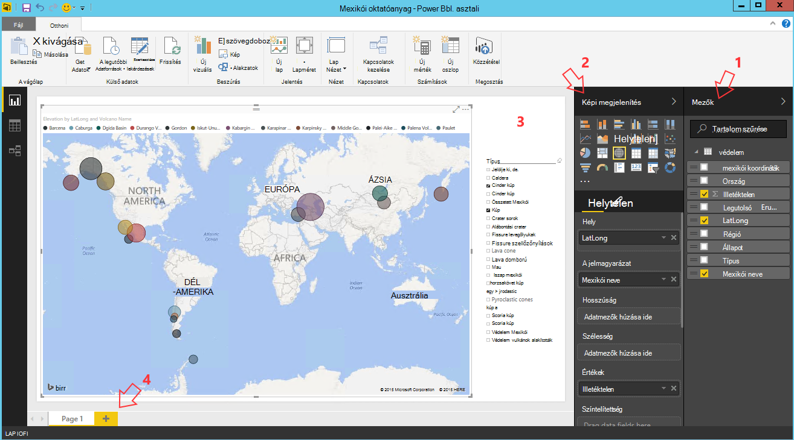

<properties
    pageTitle="Tíz dolgot is tehet az adatok tudományos virtuális gépen |} Microsoft Azure"
    description="Végezze el az adatok tudományos virtuális gép különböző adatok feltárása és modellezése tevékenység:"
    services="machine-learning"
    documentationCenter=""
    authors="bradsev"
    manager="jhubbard"
    editor="cgronlun"  />

<tags
    ms.service="machine-learning"
    ms.workload="data-services"
    ms.tgt_pltfrm="na"
    ms.devlang="na"
    ms.topic="article"
    ms.date="08/29/2016"
    ms.author="gokuma;weig;bradsev" />

# <a name="ten-things-you-can-do-on-the-data-science-virtual-machine"></a>Tíz dolgot is tehet az adatok tudományos virtuális gépen

A Microsoft adatok tudományos virtuális gép (DSVM) egy hatékony adatkezelő tudományos fejlesztői környezet, amely lehetővé teszi, hogy változatos adatok feltárása és adatmodellezési műveleteket hajthat végre. A környezet már megtalálható a beépített és számos népszerű adatok analytics eszközök, amelyek megkönnyítik az első lépések gyorsan a helyszíni-elemzés együtt csomagolva felhő és a hibrid telepítési környezetének. A DSVM szorosan működik-e sok Azure szolgáltatás, és olvassa el és feldolgozása az Azure-Azure SQL-adatraktár, az Azure adatok tó, az Azure tároló vagy DocumentDB a tárolt adatokhoz. Azt is kihasználhatja, hogy más analytics eszközöket, például a Azure gépi tanulási és Azure Data Factory.


Ebben a cikkben során végigvezetjük adatok-tudományos változatos műveleteket hajthat végre, és egyéb Azure szolgáltatás használata a DSVM használata. Íme néhány szolgáltatás, amit meg a DSVM végezheti el:

1. Adatok feltárása és a modell helyileg a kiszolgálóval Microsoft R, Python DSVM kidolgozása
2. Az adatok a Python 2, Python 3, Microsoft R használata böngészőben kísérletezés egy vállalati kész verziójában méretezhetőség és a teljesítmény készült R Jupyter Jegyzetfüzet használata
3. Beépített R és használata Python Azure gépi tanulási, ügyfélalkalmazásokban hozzáférhet a modellek egy egyszerű web services felületéről modellek üzemeltető
4. Az Azure portálon vagy a Powershell használatával Azure erőforrások felügyelete
5. A rendelkezésre álló tárterület méretének kiterjesztése és nagyméretű adatkészletek megosztása / át a teljes csapat-Azure fájltároló létrehozásával, a DSVM csatlakoztatható meghajtó kód
6. Kód megosztása a csapattal Github használ, és a hozzáférési a tárházba az előtelepített mely számjegy ügyfelek - mely számjegy Bash, mely számjegy grafikus használatával.
7. Elérni a különböző Azure adatok és az elemzést szolgáltatásokat, például Azure blob-tárolóhoz Azure adatok tó, az Azure hdinsight szolgáltatáshoz (Hadoop), az Azure DocumentDB, Azure SQL-adatraktár & adatbázisok
8. Jelentések és a előtelepítve a DSVM a Power BI Desktop használata Irányítópult összeállítása és üzembe helyezése a felhő
9. A projekt igényekhez DSVM dinamikusan méretezése
10. A virtuális gépen további eszközök telepítése   


>[AZURE.NOTE] További használati költségek készült, a jelen cikkben felsorolt további adatokat tároló és az elemzést szolgáltatások lesz érvényes. Olvassa el a részleteket az [Azure árak](https://azure.microsoft.com/pricing/) lapra.


**Előfeltételek**

- Szüksége lesz egy Azure-előfizetést. Az egy ingyenes próbaverzió [Itt](https://azure.microsoft.com/free/)iratkozzon fel.

- A [virtuális gép létrehozása](https://portal.azure.com/#create/microsoft-ads.standard-data-science-vmstandard-data-science-vm)az Azure portálon adatok tudományos virtuális gép kiépítési útmutatója érhetők el.

## <a name="1-explore-data-and-develop-models-using-microsoft-r-server-or-python"></a>1. a adatok feltárása és a Microsoft R Server vagy Python modellek kidolgozása

R és Python hasonló nyelvek is használhatja a teendő az adatok analytics közvetlenül a DSVM a.

R "R forradalom vállalati 8.0" nevű egy IDE, kattintson a start menüből vagy az asztali program is használhatja. A Microsoft további tárakat a megnyitott forrás/CRAN-R ahhoz, hogy méretezhető analitikai és az azt jelenti, hogy nagyobb, mint a párhuzamos lehetővé tevő analysis módon engedélyezett memóriaméret adatok elemzése fölött megadott. Egy R IDE, például a [RStudio](https://www.rstudio.com/products/rstudio-desktop/)lehetőség is telepítheti.

Python, amely mellett a Visual Studio (PTVS) bővítmény előtelepítve Python eszközeit Visual Studio közösségi Edition például egy IDE is használhatja. Alapértelmezés szerint egy egyszerű Python 2.7 van konfigurálva PTVS (nélkül bármely analytics tárat, például a SciKit, Pandas). Ahhoz, hogy Anaconda Python 2.7 és 3.5-ös, kell tegye a következőket:

* Hozzon létre egyéni környezetekben tartozó **eszközök**navigálással -> **Python eszközök** -> **Python környezetben** , majd válassza az "**+ egyéni**" a Visual Studio 2015 közösségi Edition
* Adjon egy leírást, majd állítja be a környezetet előtag elérési utak *c:\anaconda* az Anaconda Python 2.7 vagy *c:\anaconda\envs\py35* Anaconda Python 3.5-ös
* Kattintson az **Automatikus észlelése** , majd **az alkalmazás** menti a környezetet.

Az alábbiakban az egyéni környezeti telepítés néz ki a Visual Studióban.


Nézze meg a [PTVS dokumentáció](https://github.com/Microsoft/PTVS/wiki/Selecting-and-Installing-Python-Interpreters#hey-i-already-have-an-interpreter-on-my-machine-but-ptvs-doesnt-seem-to-know-about-it) további részletekért Python környezetek kialakításához.

Most már hozhat létre új projektet Python állíthatók be. Nyissa meg azt a **fájlt** -> **Új** -> **Project** -> **Python** és készítésekor Python alkalmazás típusának kiválasztása. Beállíthatja, hogy az aktuális projektben Python környezet a kívánt verzióra (Anaconda 2.7 vagy 3.5-ös): kattintson a jobb gombbal a **Python környezetben**, válassza a **Hozzáadás/Eltávolítás Python környezetben**, és válassza ki a kívánt környezet szeretne társítani a projekt. További információt a PTVS használata a termék [dokumentáció](https://github.com/Microsoft/PTVS/wiki) lapon talál.

## <a name="2-using-a-jupyter-notebook-to-explore-and-model-your-data-with-python-or-r"></a>2. használt feltárása adatok és modellezése a Python vagy R Jupyter jegyzetfüzetek

A Jupyter jegyzetfüzet egy hatékony környezet a böngészőalapú "IDE" biztosít az adatok feltárása és modellezése. A jegyzetfüzet Jupyter Python 2, Python 3 vagy R (Megnyitás és a Microsoft R-kiszolgáló) használhatja.

Indítsa el a jegyzetfüzet Jupyter kattintson a start menü ikonra kattintva és az asztali ikonra kattintva című **Jupyter jegyzetfüzetet**. Kattintson a DSVM is tallózhat "https://localhost:9999 /" Jupiter jegyzetfüzet eléréséhez. Kér jelszót, ha a megjelenő utasításokat a ***Jegyzetfüzet Jupyter kiszolgálói erős jelszó létrehozása*** című témakör [a Microsoft adatok tudományos virtuális gép rendelkezést](machine-learning-data-science-provision-vm.md) segítségével Jupyter jegyzetfüzet eléréséhez erős jelszó létrehozása. 

A jegyzetfüzet megnyitása után jelenik meg, amelyek a DSVM be előre csomagolt néhány példa a jegyzetfüzetek tartalmazó könyvtár. Most már van lehetősége:

- Kattintson a jegyzetfüzet a kódot.
- hajtsa végre a minden cella **A SHIFT + ENTER**billentyűkombinációval.
- a teljes jegyzetfüzetet indítása **cellától** -> **futtatása**
- Új jegyzetfüzet létrehozása a Jupyter ikonra (bal felső sarokban lévő) gombra kattintva, majd kattintson a jobb oldalon lévő **Új** gombra és a jegyzetfüzet nyelvet (más néven mag) lehetőséget, majd.   


>[AZURE.NOTE] Jelenleg támogatjuk Python 2.7, Python 3.5-ös és R. Az R kernel programozás támogatja a mind R forrás megnyitása, valamint a vállalati méretezhető Microsoft R Server.   


Be a jegyzetfüzetet, felfedezheti az adatokat, összeállítása a modellt, tesztelje a modell tetszés szerinti tárak használata.


## <a name="3-build-models-using-r-or-python-and-operationalize-them-using-azure-machine-learning"></a>3. a R vagy Python modellek összeállítása és üzemeltető őket az Azure gépi tanulási

Beépített és a modell érvényesítése után a következő lépésként általában éles üzembe. Ez ügyfélalkalmazások teszi lehetővé az a modell előrejelzések egy valós idejű akár egy köteg mód jelleggel meghívásához. Azure gépi tanulási lehetővé teszi az R vagy a Python beépített modell üzemeltető.

A modell az Azure gépi tanulási üzemeltető meg, amikor egy webszolgáltatásból megjelenő, amely lehetővé teszi az ügyfelek, a bemeneti paramétereket megfelelt és a kimeneti értékeket pedig a modellből kapja meg az előrejelzések többi hívásokat.   


>[AZURE.NOTE] Ha még nem regisztrált AzureML, ingyenes munkaterület vagy szerezhet szabványos munkaterület megtalálhatók az [AzureML Studio](https://studio.azureml.net/) kezdőlapjára, és kattintson a "Első lépések".   


### <a name="build-and-operationalize-python-models"></a>Szerkesztés és üzemeltető Python modellek

Az alábbiakban a kód hozza létre a SciKit további tár használata egyszerű modell Python Jupyter jegyzetfüzet fejlesztett kódtöredékének.

    #IRIS classification
    from sklearn import datasets
    from sklearn import svm
    clf = svm.SVC()
    iris = datasets.load_iris()
    X, y = iris.data, iris.target
    clf.fit(X, y)

A telepítéshez használni a python modellek Azure gépi tanulási használt módszer fussa a modell függvény az előrejelzési szolgáltatása, és azt, hogy a Azure gépi tanulási munkaterület Azonosítót, kulcs API és a bemeneti jelölésére, és visszatér a paraméterek a előtelepített Azure gépi tanulási python Library attribútumokkal rendelkező decorates.  

    from azureml import services
    @services.publish(workspaceid, auth_token)
    @services.types(sep_l = float, sep_w = float, pet_l=float, pet_w=float)
    @services.returns(int) #0, or 1, or 2
    def predictIris(sep_l, sep_w, pet_l, pet_w):
    inputArray = [sep_l, sep_w, pet_l, pet_w]
    return clf.predict(inputArray)

Egy ügyfél most teheti a hívások átirányítása a webszolgáltatás. Vannak olyan, amely a REST API-kérelmek Egyenletszerkesztővel kényelmesebbé csomagolást. Íme egy példa kódot a webszolgáltatás használhatnak.

    # Consume through web service URL and keys
    from azureml import services
    @services.service(url, api_key)
    @services.types(sep_l = float, sep_w = float, pet_l=float, pet_w=float)
    @services.returns(float)
    def IrisPredictor(sep_l, sep_w, pet_l, pet_w):
    pass

    IrisPredictor(3,2,3,4)


>[AZURE.NOTE] Az Azure gépi tanulási tár csak jelenleg támogatott a Python 2.7.   


### <a name="build-and-operationalize-r-models"></a>Szerkesztés és R üzemeltető modellek

Kattintson az adatok tudományos virtuális gép vagy máshol alakzatot Azure gépi tanulási beépített oly módon, amely hasonlít az, hogy miként történik az Python R modellek telepítheti. Saját lépésekből áll:

- Hozzon létre egy settings.json fájlt, az alábbi adja meg a munkaterületet azonosító és a auth jogkivonat.
- Írjon egy, az a modell előrejelzésére függvény.
- hívás ```publishWebService``` az Azure gépi tanulási tárban, a függvény csomagolópapír átadni.  

Az alábbiakban az eljárást, és a kód kódrészletek, beállítása, összeállítása, közzététele és a modell felhasználása az Azure gépi tanulási webes szolgáltatásként használható.

#### <a name="setup"></a>A telepítő

1.  Írja be a AzureML R-csomag telepítéséhez ```install.packages("AzureML")``` forradalom R vállalati 8.0 IDE vagy az R IDE.
2.  Töltse le a RTools [ide](https://cran.r-project.org/bin/windows/Rtools/). A zip-segédprogram az elérési utat (és elnevezett zip.exe) az R csomagolásán látható termékszámmal üzemeltető AzureML be van szüksége.
3.  Hozzon létre egy nevű könyvtárában settings.json fájlt ```.azureml``` az otthoni címtár csoportban, és adja meg a paraméterek az Azure Machine Learning munkaterületről:

Settings.JSON fájlszerkezet:

    {"workspace":{
    "id"                  : "ENTER YOUR AZUREML WORKSPACE ID",
    "authorization_token" : "ENTER YOUR AZUREML AUTH TOKEN"
    }}


#### <a name="build-a-model-in-r-and-publish-it-in-azure-ml"></a>Az R modell készítése és közzététele, az Azure Machine Learning

    library(AzureML)
    ws <- workspace(config="~/.azureml/settings.json")

    if(!require("lme4")) install.packages("lme4")
    library(lme4)
    set.seed(1)
    train <- sleepstudy[sample(nrow(sleepstudy), 120),]
    m <- lm(Reaction ~ Days + Subject, data = train)

    # Define a prediction function to publish based on the model:
    sleepyPredict <- function(newdata){
        predict(m, newdata=newdata)
    }

    ep <- publishWebService(ws, fun = sleepyPredict, name="sleepy lm", inputSchema = sleepstudy, data.frame=TRUE)

#### <a name="consume-the-model-deployed-in-azure-ml"></a>A modell telepítését az Azure Machine Learning felhasználása

A modell előnyeit ügyfélalkalmazás használhatnak, lépések elvégzésével keresheti meg a közzétett webes szolgáltatás neve használatával használjuk az Azure gépi tanulási tár a `services` API-hívás a végpont határozza meg. Csak hívja fel a `consume` kell elvégezni, ha az adatok keret fázisban és működik.
A következő kódot a modellt, az Azure gépi tanulási webszolgáltatás közzétett felhasználása szolgál.


    library(AzureML)
    library(lme4)
    ws <- workspace(config="~/.azureml/settings.json")

    s <-  services(ws, name = "sleepy lm")
    s <- tail(s, 1) # use the last published function, in case of duplicate function names

    ep <- endpoints(ws, s)

    # OK, try this out, and compare with raw data
    ans = consume(ep, sleepstudy)$ans

További információt az Azure gépi tanulási R tárban található [Itt](https://cran.r-project.org/web/packages/AzureML/AzureML.pdf).


## <a name="4-administer-your-azure-resources-using-azure-portal-or-powershell"></a>4. felügyelete az Azure erőforrások Azure portálon vagy a Powershell használatával

A DSVM nemcsak lehetővé teszi, hogy a analytics megoldás helyileg összeállítása a virtuális gépen, de is lehetővé teszi a Microsoft Azure cloud services elérését. Azure több számítási, tárterület, analytics adatszolgáltatások és más szolgáltatások felügyelete és elérni a DSVM biztosít.

Az Azure-előfizetéssel és a felhő erőforrások felügyelete a böngészőn keresztül, és mutasson az [Azure-portálon](https://portal.azure.com). Azure Powershell használatával felügyelheti az Azure előfizetést és a források parancsfájl keresztül.
Azure Powershell parancsikont az asztalon vagy a start menüből "A Microsoft Azure Powershell" című futtathatók. Keresse meg [a Microsoft Azure Powershell miként](../powershell-azure-resource-manager.md) , hogyan lehet felügyelni a az Azure előfizetést és a források használatával a Windows Powershell-parancsfájlokat további információt.


## <a name="5-extend-your-storage-space-with-a-shared-file-system"></a>5. kiterjesztése a tárhely egy megosztott fájlhoz rendszerrel

Adatok tudósok megoszthatja nagy adathalmazok, kódot vagy más erőforrások: a csapaton belüli. A DSVM magát körülbelül 70GB szabad lemezterület tartalmaz. Ha ki szeretné terjeszteni a tárhely, használhatja a Azure szolgáltatás, és a vagy azt a DSVM csatlakoztatása, illetve a REST API-e a hozzáférést.   


>[AZURE.NOTE] A maximális szóköz az Azure fájl szolgáltatás megosztás 5TB és egyes fájlméretkorlátot 1TB.   


Azure Powershell használatával hozzon létre egy Azure fájl szolgáltatás megosztást. Az alábbiakban a parancsfájl Azure PowerShell-Azure service fájlmegosztás létrehozása alatt fusson.

    # Authenticate to Azure.
    Login-AzureRmAccount
    # Select your subscription
    Get-AzureRmSubscription –SubscriptionName "<your subscription name>" | Select-AzureRmSubscription
    # Create a new resource group.
    New-AzureRmResourceGroup -Name <dsvmdatarg>
    # Create a new storage account. You can reuse existing storage account if you wish.
    New-AzureRmStorageAccount -Name <mydatadisk> -ResourceGroupName <dsvmdatarg> -Location "<Azure Data Center Name For eg. South Central US>" -Type "Standard_LRS"
    # Set your current working storage account
    Set-AzureRmCurrentStorageAccount –ResourceGroupName "<dsvmdatarg>" –StorageAccountName <mydatadisk>

    # Create a Azure File Service Share
    $s = New-AzureStorageShare <<teamsharename>>
    # Create a directory under the FIle share. You can give it any name
    New-AzureStorageDirectory -Share $s -Path <directory name>
    # List the share to confirm that everything worked
    Get-AzureStorageFile -Share $s


Most, hogy egy Azure fájlmegosztás hozott létre, akkor csatlakoztathat az Azure virtuális gépi. Ajánlott, hogy a virtuális késés és az adatok továbbítása költségek elkerülésére tárterület-fiókként azonos Azure adatközpont van. Az alábbiakban a parancsokat a meghajtót, amely a Azure Powershell futtatását is lehetővé teszi a DSVM csatlakoztatni.


    # Get storage key of the storage account that has the Azure file share from Azure portal. Store it securely on the VM to avoid prompted in next command.
    cmdkey /add:<<mydatadisk>>.file.core.windows.net /user:<<mydatadisk>> /pass:<storage key>

    # Mount the Azure file share as Z: drive on the VM. You can chose another drive letter if you wish
    net use z:  \\<mydatadisk>.file.core.windows.net\<<teamsharename>>


Most már hozzáférhet a meghajtó a virtuális meghajtókon létrehozott normál módon.

## <a name="6-share-code-with-your-team-using-github"></a>6. kód megosztása a csapattal Github használatával

Github tárháza kód hol találhatók példakódot és forrásokból számos különböző eszközök segítségével a fejlesztői közössége által megosztott különféle technológiák. Használja a mely számjegy technológia nyomon követése és tárolni a kód fájlok verzióit. Github akkor is platformot hol tárolja a csapat megosztott kód és a dokumentáció, végrehajtja a verziókövetés és is szabályozhatja, hogy a saját tárházba megtekintésre és szerkesztésre kód hozzáférési jogosultsággal rendelkező hozhat létre. Kérjük, látogasson el a [Github súgó lapok](https://help.github.com/) további információt a mely számjegy használatához. Használata a csoportszintű együttműködéshez, használja a Közösség által kifejlesztett és bővíthessék vissza kódot a Közösség az módokon Github.

A DSVM már megtalálható betöltött az ügyféleszközök elől mindkét parancssorban mint jól grafikus Github tárházba eléréséhez. A parancssor eszköz mely számjegy és Github mely számjegy Bash neve. Telepítve van a DSVM a Visual Studio a mely számjegy bővítmények tartalmaz. Ezeket az eszközöket, kattintson a start menü és az asztali indítási ikonok talál.

A kód töltse le a használni kívánt Github összegyűjti a ```git clone``` parancsot. Ha például az aktuális könyvtár be a Microsoft által közzétett adatok tudományos tárházba letöltéséhez futtathatja a következő parancs be ```git-bash```.

    git clone https://github.com/Azure/Azure-MachineLearning-DataScience.git

A Visual Studióban végezze el az azonos adatfeliratsor művelet. Az alábbi képernyő-ikon a Visual Studióban mely számjegy és Github eszközök elérése mutatja.


Mely számjegy használata a Github tárházba elérhető különböző forrásokból github.com használatáról további információt találhat. A [munkalap cheat](https://training.github.com/kit/downloads/github-git-cheat-sheet.pdf) hasznos hivatkozást.


## <a name="7-access-various-azure-data-and-analytics-services"></a>7. különböző Azure adatok és az elemzést szolgáltatások elérése

### <a name="azure-blob"></a>Azure Blob

Azure blob egy megbízható, gazdaságos felhőbeli tárhelyről nagy- és kis adatokhoz. Tudassa velünk nézze meg, hogy hogyan léphet adatok Azure Blob- és az Azure Blob tárolt access-adatok.

**Előfeltételek**

- **[Azure](https://portal.azure.com)portálról létrehozása az Azure Blob-tároló fiókját.**


- Ellenőrizze, hogy az előtelepített parancssori AzCopy eszköz az megtalálható ```C:\Program Files (x86)\Microsoft SDKs\Azure\AzCopy\azcopy.exe```. A azcopy.exe a PATH környezeti változó fut ez az eszköz, írja be a teljes parancs elérési elkerülése érdekében a tartalmazó könyvtár is hozzáadhat. AzCopy eszközről további információért olvassa el [AzCopy dokumentáció](../storage/storage-use-azcopy.md)

- Indítsa el az Azure tároló Explorer eszközt. A [Microsoft Azure tároló Intézőből](http://storageexplorer.com/)letölthető. 


**Adatok áthelyezése virtuális Azure Blob: AzCopy**

A helyi fájlok és blob-tárolóhoz közötti adatok áthelyezéséhez AzCopy a parancssorból vagy PowerShell is használhatja:

    AzCopy /Source:C:\myfolder /Dest:https://<mystorageaccount>.blob.core.windows.net/<mycontainer> /DestKey:<storage account key> /Pattern:abc.txt

Az elérési útját a fájlt tároló **mystorageaccount** át blob tároló fiók nevére, **mycontainer** tároló nevét, a blob-tároló hívóbetű **tároló fiókkulcs** **C:\myfolder** cseréje Az [Azure-portálon](https://portal.azure.com)talál a tárterület-fiókja hitelesítő adatait.


A PowerShell vagy a parancssorból AzCopy művelet végrehajtása Íme néhány példa használatát AzCopy parancsot:


    # Copy *.sql from local machine to a Azure Blob
    "C:\Program Files (x86)\Microsoft SDKs\Azure\AzCopy\azcopy" /Source:"c:\Aaqs\Data Science Scripts" /Dest:https://[ENTER STORAGE ACCOUNT].blob.core.windows.net/[ENTER CONTAINER] /DestKey:[ENTER STORAGE KEY] /S /Pattern:*.sql

    # Copy back all files from Azure Blob container to Local machine

    "C:\Program Files (x86)\Microsoft SDKs\Azure\AzCopy\azcopy" /Dest:"c:\Aaqs\Data Science Scripts\temp" /Source:https://[ENTER STORAGE ACCOUNT].blob.core.windows.net/[ENTER CONTAINER] /SourceKey:[ENTER STORAGE KEY] /S


Az Azure blob másolása a AzCopy parancs futtatása után megjelenik a fájl azt mutatja be az Azure tároló Explorer hamarosan.


**Adatok áthelyezése virtuális Azure Blob: Azure tároló Explorer**

A virtuális Azure tároló Intézővel is feltöltheti a helyi fájl adatait:

- A tároló feltölteni az adatokat, jelölje be a cél tároló, és kattintson a **Feltöltés** gombra.
- Kattintson a mező jobb oldalán a **fájlok** **…** , jelöljön ki egy vagy több fájlt a fájlrendszerből feltöltését, és **Töltse fel** a fájlok feltöltése a kezdéshez kattintson.


**Azure Blob adatainak beolvasása: AML olvasó modul**

Azure gépi tanulási Studio adatok beolvasása a blob- **adatok importálása modul** használhatja.


**Azure Blob adatainak beolvasása: Python ODBC**

Adatok olvasható közvetlenül egy Jupyter jegyzetfüzet vagy Python programban blob **BlobService** tár is használhatja.

Első lépésként importálása szükséges csomagok:

    import pandas as pd
    from pandas import Series, DataFrame
    import numpy as np
    import matplotlib.pyplot as plt
    from time import time
    import pyodbc
    import os
    from azure.storage.blob import BlobService
    import tables
    import time
    import zipfile
    import random

Dugja be a Azure Blob-fiókja hitelesítő adatait, majd adatainak beolvasása Blob:

    CONTAINERNAME = 'xxx'
    STORAGEACCOUNTNAME = 'xxxx'
    STORAGEACCOUNTKEY = 'xxxxxxxxxxxxxxxx'
    BLOBNAME = 'nyctaxidataset/nyctaxitrip/trip_data_1.csv'
    localfilename = 'trip_data_1.csv'
    LOCALDIRECTORY = os.getcwd()
    LOCALFILE =  os.path.join(LOCALDIRECTORY, localfilename)

    #download from blob
    t1 = time.time()
    blob_service = BlobService(account_name=STORAGEACCOUNTNAME,account_key=STORAGEACCOUNTKEY)
    blob_service.get_blob_to_path(CONTAINERNAME,BLOBNAME,LOCALFILE)
    t2 = time.time()
    print(("It takes %s seconds to download "+BLOBNAME) % (t2 - t1))

    #unzipping downloaded files if needed
    #with zipfile.ZipFile(ZIPPEDLOCALFILE, "r") as z:
    #    z.extractall(LOCALDIRECTORY)

    df1 = pd.read_csv(LOCALFILE, header=0)
    df1.columns = ['medallion','hack_license','vendor_id','rate_code','store_and_fwd_flag','pickup_datetime','dropoff_datetime','passenger_count','trip_time_in_secs','trip_distance','pickup_longitude','pickup_latitude','dropoff_longitude','dropoff_latitude']
    print 'the size of the data is: %d rows and  %d columns' % df1.shape

Az adatok olvasható az adatok keretként:


### <a name="azure-data-lake"></a>Azure adatok tó

Azure adattárolás tó hyper skála a tárháza nagy adatok analytics munkaterhelésének és a kompatibilis a Hadoop elosztott fájl rendszer (hdfs) lehetőségre. A Hadoop ökológiai és a az Azure adatok tó Analytics működik. Bemutatjuk, hogyan adatok áthelyezése az Azure adattár tó, és futtassa az Azure adatok tó Analytics használatával analytics.

**Előfeltételek**

- Az Azure adatok tó Analytics létrehozása az [Azure-portálon](https://portal.azure.com).


- A **Visual Studio** megtalálható ezt a [hivatkozást](https://www.microsoft.com/download/details.aspx?id=49504) a **Azure tó Adateszközök** már telepítve van a Visual Studio közösségi Edition amely a virtuális gépen. Visual Studio kezdési és naplózás az Azure-előfizetése, után jelenik meg a Azure adatok Analytics-fiók és a bal oldali ablaktáblában a Visual Studio tároló.


**Adatok áthelyezése virtuális adatok tó: Azure adatok tó Explorer**

**Azure adatok tó Explorer** segítségével töltse fel a helyi fájlok adatainak adatok tó tárolóhoz a virtuális gépen.


Is készíthet egy adatok folyamat, hogy az adatok mozgását, illetve a Azure adatok tó productionize az [Azure adatok Factory(ADF)](https://azure.microsoft.com/services/data-factory/)használatával. Hivatkozunk, ez a [cikk](https://azure.microsoft.com/blog/creating-big-data-pipelines-using-azure-data-lake-and-azure-data-factory/) segítséget nyújtanak az adatok folyamatok létrehozásának lépéseit.

**Az adatok tó Azure Blob olvassák: az SQL-U**

Ha a tárolt adatokhoz Azure Blob-tárolóban lévő, is közvetlenül beolvashatja az adatokat a tároló Azure blob-U – SQL-lekérdezés. A U – SQL-lekérdezés összeállítása, előtt feltétlenül blob-tároló fiókját az Azure adatok tó van csatolva. **Azure**portált, keresse meg az Azure adatok tó statisztika irányítópultján, kattintson az **Adatforrás hozzáadása**, jelölje ki a **Azure** tárolóhoz tárolási típusa és dugja be a Azure tároló fiók nevét, és a kulcs. Ezután lesz a tárterület-fiókjában tárolt adatok hivatkozni szeretne.


A Visual Studióban adatainak beolvasása blob-tárolóhoz, végezze el az egyes adatfeldolgozás, ez a funkció műszaki és az eredményül kapott adatokat az Azure adatok tó vagy Azure Blob-tárolóhoz kimeneti. Ha az adatok blob-tárolóban lévő hivatkozik, **wasb: / /**; Ha az adatokat az Azure adatok tó hivatkozik, **swbhdfs: / /**


A következő U – SQL-lekérdezések használhatja a Visual Studio:

    @a =
        EXTRACT medallion string,
                hack_license string,
                vendor_id string,
                rate_code string,
                store_and_fwd_flag string,
                pickup_datetime string,
                dropoff_datetime string,
                passenger_count int,
                trip_time_in_secs double,
                trip_distance double,
                pickup_longitude string,
                pickup_latitude string,
                dropoff_longitude string,
                dropoff_latitude string

        FROM "wasb://<Container name>@<Azure Blob Storage Account Name>.blob.core.windows.net/<Input Data File Name>"
        USING Extractors.Csv();

    @b =
        SELECT vendor_id,
        COUNT(medallion) AS cnt_medallion,
        SUM(passenger_count) AS cnt_passenger,
        AVG(trip_distance) AS avg_trip_dist,
        MIN(trip_distance) AS min_trip_dist,
        MAX(trip_distance) AS max_trip_dist,
        AVG(trip_time_in_secs) AS avg_trip_time
        FROM @a
        GROUP BY vendor_id;

    OUTPUT @b   
    TO "swebhdfs://<Azure Data Lake Storage Account Name>.azuredatalakestore.net/<Folder Name>/<Output Data File Name>"
    USING Outputters.Csv();

    OUTPUT @b   
    TO "wasb://<Container name>@<Azure Blob Storage Account Name>.blob.core.windows.net/<Output Data File Name>"
    USING Outputters.Csv();


Miután a lekérdezés elküldése a kiszolgálóra, a feladat állapotát megjelenítő diagram jelenik meg.


**A lekérdezés adatok tó adatok: az SQL-U**

Az adatkészlet az Azure adatok tó van keresztül a szervezetbe, miután [U – SQL nyelv](../data-lake-analytics/data-lake-analytics-u-sql-get-started.md) az adatok feltárása és a lekérdezés is használhatja. U – SQL nyelv hasonlóan, mint az SQL-T, de egyes funkciók, a C# egyesíti az, hogy a felhasználók írhat a személyre szabott modulokat, a felhasználó által definiált függvények és stb. Az előző lépésben a parancsfájlok is használhatja.

A lekérdezés után kiszolgálóhoz, tripdata_summary elküldése. CSV hamarosan **Azure adatok tó Explorer**található, és meg lehet tekinteni az adatok kattintson a jobb gombbal a fájlt.


A fájl információk megtekintése:


### <a name="hdinsight-hadoop-clusters"></a>HDInsight Hadoop fürt

Azure hdinsight szolgáltatáshoz olyan felügyelt Apache Hadoop, külső, HBase és vihar szolgáltatás, a felhő. Dolgozhat egyszerűen Azure hdinsight szolgáltatáshoz fürt adatok tudományos virtuális számítógépről.

**Előfeltételek**

- [Azure](https://portal.azure.com)portálról létrehozása az Azure Blob-tároló fiókját. Ehhez a fiókhoz tároló HDInsight fürtre vonatkozóan adatok tárolására szolgál.


- Azure hdinsight szolgáltatáshoz Hadoop fürt [Azure](machine-learning-data-science-customize-hadoop-cluster.md) portálról testreszabása

  - A tároló fiók létrehozásakor a HDInsight fürt létrehozott hozzá kell rendelnie. Ez a tárterület-fiók eléréséhez, amely a fürt belül feldolgozhatók használják.


  - A központi csomópontot a fürt létrehozása után engedélyezze **Távelérési** . Ne feledje, hogy a távoli hozzáférés hitelesítő adatokat, az itt megadott (eltérnek a létrehozása a fürthöz megadott): szüksége lesz rájuk az alábbi.


  - Hozzon létre egy Azure Machine Learning munkaterülethez. A gépi tanulási kísérletek kíván tárolni a Machine Learning munkaterületen. Jelölje be a kiemelt beállítások portálon az alábbi képernyőképen látható módon.


  - Írja be a paraméterek az Azure Machine Learning munkaterület


  - Töltse fel az adatoknak IPython jegyzetfüzetet. Először importálja a szükséges csomagokat, dugja be hitelesítő adatait, hozzon létre egy db tárterület-fiókját, majd HDI fürt adatok betöltése.


        #Import required Packages
        import pyodbc
        import time as time
        import json
        import os
        import urllib
        import urllib2
        import warnings
        import re
        import pandas as pd
        import matplotlib.pyplot as plt
        from azure.storage.blob import BlobService
        warnings.filterwarnings("ignore", category=UserWarning, module='urllib2')


        #Create the connection to Hive using ODBC
        SERVER_NAME='xxx.azurehdinsight.net'
        DATABASE_NAME='nyctaxidb'
        USERID='xxx'
        PASSWORD='xxxx'
        DB_DRIVER='Microsoft Hive ODBC Driver'
        driver = 'DRIVER={' + DB_DRIVER + '}'
        server = 'Host=' + SERVER_NAME + ';Port=443'
        database = 'Schema=' + DATABASE_NAME
        hiveserv = 'HiveServerType=2'
        auth = 'AuthMech=6'
        uid = 'UID=' + USERID
        pwd = 'PWD=' + PASSWORD
        CONNECTION_STRING = ';'.join([driver,server,database,hiveserv,auth,uid,pwd])
        connection = pyodbc.connect(CONNECTION_STRING, autocommit=True)
        cursor=connection.cursor()


        #Create Hive database and tables
        queryString = "create database if not exists nyctaxidb;"
        cursor.execute(queryString)

        queryString = """
                        create external table if not exists nyctaxidb.trip
                        (
                            medallion string,
                            hack_license string,
                            vendor_id string,
                            rate_code string,
                            store_and_fwd_flag string,
                            pickup_datetime string,
                            dropoff_datetime string,
                            passenger_count int,
                            trip_time_in_secs double,
                            trip_distance double,
                            pickup_longitude double,
                            pickup_latitude double,
                            dropoff_longitude double,
                            dropoff_latitude double)  
                        PARTITIONED BY (month int)
                        ROW FORMAT DELIMITED FIELDS TERMINATED BY ',' lines terminated by '\\n'
                        STORED AS TEXTFILE LOCATION 'wasb:///nyctaxidbdata/trip' TBLPROPERTIES('skip.header.line.count'='1');
                    """
        cursor.execute(queryString)

        queryString = """
                        create external table if not exists nyctaxidb.fare
                        (
                            medallion string,
                            hack_license string,
                            vendor_id string,
                            pickup_datetime string,
                            payment_type string,
                            fare_amount double,
                            surcharge double,
                            mta_tax double,
                            tip_amount double,
                            tolls_amount double,
                            total_amount double)
                        PARTITIONED BY (month int)
                        ROW FORMAT DELIMITED FIELDS TERMINATED BY ',' lines terminated by '\\n'
                        STORED AS TEXTFILE LOCATION 'wasb:///nyctaxidbdata/fare' TBLPROPERTIES('skip.header.line.count'='1');
                    """
        cursor.execute(queryString)


        #Upload data from blob storage to HDI cluster
        for i in range(1,13):
            queryString = "LOAD DATA INPATH 'wasb:///nyctaxitripraw2/trip_data_%d.csv' INTO TABLE nyctaxidb2.trip PARTITION (month=%d);"%(i,i)
            cursor.execute(queryString)
            queryString = "LOAD DATA INPATH 'wasb:///nyctaxifareraw2/trip_fare_%d.csv' INTO TABLE nyctaxidb2.fare PARTITION (month=%d);"%(i,i)  
            cursor.execute(queryString)


- Ehelyett, kövesse Ez a [forgatókönyv](machine-learning-data-science-process-hive-walkthrough.md) HDI fürt Taxi a következőt: adatok feltöltése. Fő lépés a következők:

    - AzCopy: Töltse le a tömörített CSV nyilvános blob a helyi mappába
    - AzCopy: feltöltése kicsomagolt CSV a helyi mappában lévő HDI fürthöz
    - Jelentkezzen be a Hadoop fürt központi csomópontot, és felderítő adatelemzés előkészítése

Az adatok HDI fürthöz betöltése, után ellenőrizheti az Azure tároló Explorer az adatok. És egy adatbázis nyctaxidb HDI fürt létrehozott kell.


**Adatok feltárása: Python struktúra lekérdezések**

Mivel az adatok Hadoop fürt, a pyodbc csomag struktúra használatával feltárására és műszaki funkció Hadoop fürt és a lekérdezés adatbázishoz való csatlakozáshoz is használhatja. A meglévő táblák az kapcsolatban előzetesen szükséges lépésben létrehozott tekintheti meg.

    queryString = """
        show tables in nyctaxidb2;
        """
    pd.read_sql(queryString,connection)


Tekintse meg a rekordok számát az egyes hónap és a gyakoriságának Formabontó, vagy nem a utazás táblázatban:

    queryString = """
        select month, count(*) from nyctaxidb.trip group by month;
        """
    results = pd.read_sql(queryString,connection)

    %matplotlib inline

    results.columns = ['month', 'trip_count']
    df = results.copy()
    df.index = df['month']
    df['trip_count'].plot(kind='bar')


    queryString = """
        SELECT tipped, COUNT(*) AS tip_freq
        FROM
        (
            SELECT if(tip_amount > 0, 1, 0) as tipped, tip_amount
            FROM nyctaxidb.fare
        )tc
        GROUP BY tipped;
        """
    results = pd.read_sql(queryString,connection)

    results.columns = ['tipped', 'trip_count']
    df = results.copy()
    df.index = df['tipped']
    df['trip_count'].plot(kind='bar')


Azt is kiszámítania felvételi helye és dropoff helye közötti távolságot, és hasonlítsa össze az út távolság.

    queryString = """
                    select pickup_longitude, pickup_latitude, dropoff_longitude, dropoff_latitude, trip_distance, trip_time_in_secs,
                        3959*2*2*atan((1-sqrt(1-pow(sin((dropoff_latitude-pickup_latitude)
                        *radians(180)/180/2),2)-cos(pickup_latitude*radians(180)/180)
                        *cos(dropoff_latitude*radians(180)/180)*pow(sin((dropoff_longitude-pickup_longitude)*radians(180)/180/2),2)))
                        /sqrt(pow(sin((dropoff_latitude-pickup_latitude)*radians(180)/180/2),2)
                        +cos(pickup_latitude*radians(180)/180)*cos(dropoff_latitude*radians(180)/180)*
                        pow(sin((dropoff_longitude-pickup_longitude)*radians(180)/180/2),2))) as direct_distance
                        from nyctaxidb.trip
                        where month=1
                            and pickup_longitude between -90 and -30
                            and pickup_latitude between 30 and 90
                            and dropoff_longitude between -90 and -30
                            and dropoff_latitude between 30 and 90;
                """
    results = pd.read_sql(queryString,connection)
    results.head(5)


    results.columns = ['pickup_longitude', 'pickup_latitude', 'dropoff_longitude',
                       'dropoff_latitude', 'trip_distance', 'trip_time_in_secs', 'direct_distance']
    df = results.loc[results['trip_distance']<=100] #remove outliers
    df = df.loc[df['direct_distance']<=100] #remove outliers
    plt.scatter(df['direct_distance'], df['trip_distance'])


Most vegyük lefelé mintát (1 %) adatok csoportja előkészítése modellezési. Az adatok ábrázolásakor AML olvasó modulban.


        queryString = """
        create  table if not exists nyctaxi_downsampled_dataset_testNEW (
        medallion string,
        hack_license string,
        vendor_id string,
        rate_code string,
        store_and_fwd_flag string,
        pickup_datetime string,
        dropoff_datetime string,
        pickup_hour string,
        pickup_week string,
        weekday string,
        passenger_count int,
        trip_time_in_secs double,
        trip_distance double,
        pickup_longitude double,
        pickup_latitude double,
        dropoff_longitude double,
        dropoff_latitude double,
        direct_distance double,
        payment_type string,
        fare_amount double,
        surcharge double,
        mta_tax double,
        tip_amount double,
        tolls_amount double,
        total_amount double,
        tipped string,
        tip_class string
        )
        row format delimited fields terminated by ','
        lines terminated by '\\n'
        stored as textfile;
        """
        cursor.execute(queryString)

        --- now insert contents of the join into the above internal table

        queryString = """
        insert overwrite table nyctaxi_downsampled_dataset_testNEW
        select
        t.medallion,
        t.hack_license,
        t.vendor_id,
        t.rate_code,
        t.store_and_fwd_flag,
        t.pickup_datetime,
        t.dropoff_datetime,
        hour(t.pickup_datetime) as pickup_hour,
        weekofyear(t.pickup_datetime) as pickup_week,
        from_unixtime(unix_timestamp(t.pickup_datetime, 'yyyy-MM-dd HH:mm:ss'),'u') as weekday,
        t.passenger_count,
        t.trip_time_in_secs,
        t.trip_distance,
        t.pickup_longitude,
        t.pickup_latitude,
        t.dropoff_longitude,
        t.dropoff_latitude,
        t.direct_distance,
        f.payment_type,
        f.fare_amount,
        f.surcharge,
        f.mta_tax,
        f.tip_amount,
        f.tolls_amount,
        f.total_amount,
        if(tip_amount>0,1,0) as tipped,
        if(tip_amount=0,0,
        if(tip_amount>0 and tip_amount<=5,1,
        if(tip_amount>5 and tip_amount<=10,2,
        if(tip_amount>10 and tip_amount<=20,3,4)))) as tip_class
        from
        (
        select
        medallion,
        hack_license,
        vendor_id,
        rate_code,
        store_and_fwd_flag,
        pickup_datetime,
        dropoff_datetime,
        passenger_count,
        trip_time_in_secs,
        trip_distance,
        pickup_longitude,
        pickup_latitude,
        dropoff_longitude,
        dropoff_latitude,
        3959*2*2*atan((1-sqrt(1-pow(sin((dropoff_latitude-pickup_latitude)
        radians(180)/180/2),2)-cos(pickup_latitude*radians(180)/180)
        *cos(dropoff_latitude*radians(180)/180)*pow(sin((dropoff_longitude-pickup_longitude)*radians(180)/180/2),2)))
        /sqrt(pow(sin((dropoff_latitude-pickup_latitude)*radians(180)/180/2),2)
        +cos(pickup_latitude*radians(180)/180)*cos(dropoff_latitude*radians(180)/180)*pow(sin((dropoff_longitude-pickup_longitude)*radians(180)/180/2),2))) as direct_distance,
        rand() as sample_key

        from trip
        where pickup_latitude between 30 and 90
            and pickup_longitude between -90 and -30
            and dropoff_latitude between 30 and 90
            and dropoff_longitude between -90 and -30
        )t
        join
        (
        select
        medallion,
        hack_license,
        vendor_id,
        pickup_datetime,
        payment_type,
        fare_amount,
        surcharge,
        mta_tax,
        tip_amount,
        tolls_amount,
        total_amount
        from fare
        )f
        on t.medallion=f.medallion and t.hack_license=f.hack_license and t.pickup_datetime=f.pickup_datetime
        where t.sample_key<=0.01
        """
        cursor.execute(queryString)

Egy idő után megjelenik az adatok be van töltve Hadoop fürt:

    queryString = """
        select * from nyctaxi_downsampled_dataset limit 10;
        """
    cursor.execute(queryString)
    pd.read_sql(queryString,connection)


**Adatok olvassák HDI AML használatával: olvasó modul**

Előfordulhat, hogy is használhatja az **olvasót** modul AML Studio a hozzáférést az adatbázishoz, Hadoop fürt. Dugja be a HDI fürt és Azure tároló fiók hitelesítő adatait, és gépi tanulási modellek adatbázis használata HDI fürt összeállítása lesz.


A scored adatkészlet majd jeleníthetők meg:


### <a name="azure-sql-data-warehouse--databases"></a>Azure SQL-adatraktár & adatbázisok

Azure SQL-adatraktár egy rugalmas adatraktár a vállalati szintű SQL Server élményt szolgáltatásként.

Az Azure SQL-adatraktár is kiépítése, a jelen [cikk](../sql-data-warehouse/sql-data-warehouse-get-started-provision.md)utasításait követve. Az Azure SQL-adatraktár kiépítése meg, ha ez a [forgatókönyv](machine-learning-data-science-process-sqldw-walkthrough.md) végezze el az adatok feltöltésének, feltárására és modellezése adatok használata az SQL adatraktár belül is használhatja.

#### <a name="azure-documentdb"></a>Azure DocumentDB

Azure DocumentDB egy olyan NoSQL adatbázis, a felhőben. Azt lehetővé teszi például JSON dokumentumokkal dolgozik, és lehetővé teszi, hogy tárolja, és a dokumentumokat a lekérdezés.

A következő lépések követelmények DocumentDB hozzáférhet a DSVM szüksége.

1. DocumentDB Python SDK telepítése (futtatása ```pip install pydocumentdb``` a parancssor)
1. DocumentDB fiók és a dokumentum DB-adatbázis létrehozása az [Azure portál](https://portal.azure.com)
1. "DocumentDB áttelepítési eszköz" [Itt](http://www.microsoft.com/downloads/details.aspx?FamilyID=cda7703a-2774-4c07-adcc-ad02ddc1a44d) töltse le és csomagolja ki egy tetszés szerinti könyvtár
1. Importálja a JSON (mexikói) adatokat egy [nyilvános blob](https://cahandson.blob.core.windows.net/samples/volcano.json) -on tárolt DocumentDB be a követés parancs paraméter az áttelepítési eszköz (dtui.exe a címtárból, amelyen telepítette az DocumentDB Értekezletfrissítési eszköz). Adja meg a forrást, és alulról Megcélozhat helyen a paraméterek.

    /s:JsonFile /s.Files:https://cahandson.blob.core.windows.net/samples/volcano.json /t:DocumentDBBulk /t.ConnectionString:AccountEndpoint=https://[DocDBAccountName].documents.azure.com:443/; AccountKey = [[főbb]; adatbázis mexikói /t.Collection:volcano1 =

Miután importálja az adatokat, nyissa meg a Jupyter, és nyissa meg a jegyzetfüzetet, *DocumentDBSample* DocumentDB eléréséhez, és végezze el a néhány egyszerű lekérdezés python kódot tartalmazó című. Látogasson el a szolgáltatás [dokumentációja lapon](https://azure.microsoft.com/documentation/learning-paths/documentdb/) talál további információt a DocumentDB


## <a name="8-build-reports-and-dashboard-using-the-power-bi-desktop"></a>8. összeállítása jelentések és irányítópultok a Power BI Desktop használata

Tudassa velünk ábrázolása a Power BI-ben a fenti DocumentDB példában szerezhet be az adatok vizuális háttérismeretek bekerül mexikói JSON-fájlt. A lépések részletes leírását a [témakör a Power BI](../documentdb/documentdb-powerbi-visualize.md)érhetők el. A magas szintű szereplő lépések alatt:

1. Nyissa meg a Power BI Desktopot, és végezze el a "Adatok beolvasása". Adja meg az URL-cím: https://cahandson.blob.core.windows.net/samples/volcano.json
2. Meg kell jelennie a listaként importált JSON rekordok
3. A lista átalakítása táblázattá, így PowerBI kezelnek azonos
4. Az oszlopok kibontása kattintson a kibontási ikonra (azt, amelyik a "balra és a jobbra mutató nyíl" ikonra a jobb oldali oszlop)
5. Figyelje meg, hogy helyét a "Bejegyzés" mezője. Bontsa ki a bejegyzést, és válassza a csak a koordinátákat. Koordináta lista oszlop
6. Új oszlop beszúrása vesszővel külön LatLong oszlopban szereplő a két elem a koordinálása lista mezőben a következő képlet segítségével koordinálja listaoszlop alakítani ```Text.From([coordinates]{1})&","&Text.From([coordinates]{0})```.
7. Végül konvertálja a ```Elevation``` oszlop tizedes, és válassza a **Bezárás gombra** , és **az alkalmazás**.

A fenti lépések helyett illessze be a következő kódot, hogy parancsprogramokat meg a fenti lépéseket a speciális szerkesztő PowerBI, amely lehetővé teszi az adatok átalakítások írja be a lekérdezési nyelv.


    let
        Source = Json.Document(Web.Contents("https://cahandson.blob.core.windows.net/samples/volcano.json")),
        #"Converted to Table" = Table.FromList(Source, Splitter.SplitByNothing(), null, null, ExtraValues.Error),
        #"Expanded Column1" = Table.ExpandRecordColumn(#"Converted to Table", "Column1", {"Volcano Name", "Country", "Region", "Location", "Elevation", "Type", "Status", "Last Known Eruption", "id"}, {"Volcano Name", "Country", "Region", "Location", "Elevation", "Type", "Status", "Last Known Eruption", "id"}),
        #"Expanded Location" = Table.ExpandRecordColumn(#"Expanded Column1", "Location", {"coordinates"}, {"coordinates"}),
        #"Added Custom" = Table.AddColumn(#"Expanded Location", "LatLong", each Text.From([coordinates]{1})&","&Text.From([coordinates]{0})),
        #"Changed Type" = Table.TransformColumnTypes(#"Added Custom",{{"Elevation", type number}})
    in
        #"Changed Type"


Ekkor az adatokat a Power BI adatmodellben. A Power BI desktop meg a következőképpen kell kinéznie.


Jelentések és az adatmodell megjelenítések létrehozása elindíthatja. A lépések a [Power BI cikk](../documentdb/documentdb-powerbi-visualize.md#build-the-reports) hozza létre a jelentést. A végeredmény jelentés, amely a következőhöz hasonló lesz.



## <a name="9-dynamically-scale-your-dsvm-to-meet-your-project-needs"></a>9. a projekt igényekhez DSVM dinamikusan méretezése

A projekt igényekhez DSVM mezőjében méretezheti. Ha nem kell a virtuális használja a esti vagy hétvégék után csak leállíthatja a virtuális az [Azure-portálon](https://portal.azure.com).

>[AZURE.NOTE]  Számítási díjak fog merülnek fel, ha a virtuális csak az operációs rendszer Leállítás gombra.  

Ha kell néhány nagyméretű analysis kezelni, és a szükséges virtuális Processzor magmintákat, memória beosztását, és a lemez típusok (egyszínű állam meghajtók is beleértve), a számítási és a költségvetési igényeinek megfelelő méretű széles választéka talál további Processzor és/vagy a memória és/vagy a lemez kapacitása. Az óránkénti együtt VMs teljes listáját a árak érhető el az [Azure virtuális gépeken futó árak](https://azure.microsoft.com/pricing/details/virtual-machines/) lapon számítja ki.

Hasonlóképpen ha csökkenti a virtuális feldolgozási kapacitás szüksége van (például: fő terhelési áthelyezett egy Hadoop vagy külső fürtre), méretezheti a fürt a beállításokat a virtuális példány a [Azure-portálra](https://portal.azure.com) , és a folyamatban lévő lefelé. Az alábbiakban a képernyőképet.


## <a name="10-install-additional-tools-on-your-virtual-machine"></a>10. További eszközök telepítése a virtuális gépen

Azt van csomagolása, amely azt feltételezi, hogy tudják cím analytics van szüksége a hasonló adatokat számos különböző eszközök és, hogy meg időt takaríthat meg, hogy nem kell telepítése és konfigurálása a környezetek egyesével, és mentse, csak az Ön által használt erőforrások fizet pénzt szerint.

Más szánt tartalom tartalmasabbá teszi a analytics-környezet Azure adatok és az elemzést szolgáltatások is élvezheti. Azt ismerje meg, hogy bizonyos esetekben az igényeinek megkövetelheti további eszközök, többek között az egyes saját külső eszközökkel. A virtuális gépen telepítéséhez szükséges új eszközök teljes rendszergazdai hozzáférése van. További csomagokat Python és R, amelyek nincsenek előre telepítve is telepítheti. A Python is használhatja ```conda``` vagy ```pip```. R használhatja a ```install.packages()``` az R konzol, vagy használja az IDE, és válassza a "**csomagok** -> **Csomagok telepítése**".

## <a name="summary"></a>Összefoglalás
Ezek a lehetőségek a Microsoft adatok tudományos virtuális gép csak néhány. Nincsenek számos további lehetőségek, így azok hatékony analytics-környezetben.
