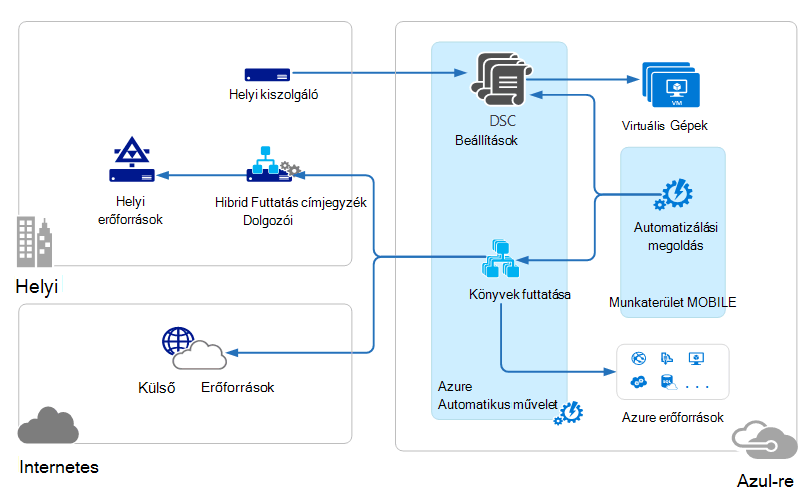

<properties 
   pageTitle="Tevékenységek kezelése csomagja (MOBILE) architektúra |} Microsoft Azure"
   description="Microsoft műveletek Management csomagja (MOBILE) használata a Microsoft felhőalapú informatikai kezelési megoldás, amelyek segítségével kezelése és védelme a helyszíni és felhőbeli infrastruktúra.  Ez a cikk a MOBILE szereplő más szolgáltatások azonosítja, és a hivatkozásokra kattintva részletes tartalmuk."
   services="operations-management-suite"
   documentationCenter=""
   authors="bwren"
   manager="jwhit"
   editor="tysonn" />
<tags 
   ms.service="operations-management-suite"
   ms.devlang="na"
   ms.topic="get-started-article"
   ms.tgt_pltfrm="na"
   ms.workload="infrastructure-services"
   ms.date="10/27/2016"
   ms.author="bwren" />

# MOBILE-architektúra

[Műveletek Management csomagja (MOBILE)](https://azure.microsoft.com/documentation/services/operations-management-suite/) gyűjteménye felhőalapú szolgáltatások kezelése a helyszíni és felhőbeli környezetben.  Ez a cikk ismerteti a különféle helyszíni és felhőbeli összetevői MOBILE és a magas szintű felhő számítógépes architektúráját.  Az egyes szolgáltatásokhoz további részleteket a dokumentáció is hivatkozhat.

## Log Analytics

Az összes, a [Naplófájl Analytics](https://azure.microsoft.com/documentation/services/log-analytics/) által gyűjtött adatokat a MOBILE tárat, amelynek üzemelteti Azure-ban vannak tárolva.  Csatlakoztatott adatforrásból készítése történő MOBILE tárházba gyűjtött adatokat.  Jelenleg támogatott csatlakoztatott adatforrásból háromféle.

- A [Windows](../log-analytics/log-analytics-windows-agents.md) vagy [Linux rendszerhez](../log-analytics/log-analytics-linux-agents.md) számítógépen telepített ügynökszoftvert közvetlenül a MOBILE csatlakozik.
- A System Center műveletek Manager (SCOM) kezelése csoport [napló Analytics csatlakozik](../log-analytics/log-analytics-om-agents.md) .  Adatkezelési kiszolgálók, amelyek események és a teljesítményadatok továbbítása a napló Analytics kommunikáció SCOM ügynökök továbbra is.
- [Azure tároló fiók](../log-analytics/log-analytics-azure-storage.md) gyűjti össze a [Azure diagnosztikai](../cloud-services/cloud-services-dotnet-diagnostics.md) adatok egy dolgozó szerepkör, webes szerepkör vagy egy virtuális gép Azure-ban.

Adatforrások napló Analytics eseménynaplók és a teljesítmény számláló például csatlakoztatott adatforrásból által gyűjtött adatok megadása  Megoldások funkciók felvétele a MOBILE, és egyszerűen felveheti a munkaterület a [MOBILE megoldástárból](../log-analytics/log-analytics-add-solutions.md).  Néhány megoldás kérhet közvetlen kapcsolatot a napló Analytics SCOM ügynökök közben másokat is telepíteni kell egy további ügynök.

Log Analytics tartalmaz a webes portál MOBILE erőforrások kezelésére, és a MOBILE megoldások, megtekintése és a MOBILE tár adatelemzés használható.

## Azure automatizálási

[Azure automatizálási runbooks](http://azure.microsoft.com/documentation/services/automation) végrehajtása az Azure felhőben, és érheti el, illetve Azure, a többi felhőalapú szolgáltatás, elérhető nyilvános internetkapcsolat a erőforrásait.  A helyi adatok központban [Hibrid Runbook dolgozó](../automation/automation-hybrid-runbook-worker.md) így runbooks helyi erőforrások is elérheti a helyszíni gépek is kijelölhet.

[DSC konfigurációk](../automation/automation-dsc-overview.md) Azure automatizálási tárolt Azure virtuális gépeken futó közvetlenül alkalmazható.  Más fizikai és virtuális gépeken futó kérhet konfigurációk az Azure automatizálási DSC ki kiszolgálóról.

Azure automatizálási egy MOBILE megoldás, amely megjeleníti a statisztikai adatokat, és indítsa el az Azure portál műveletekhez mutató hivatkozásokat tartalmaz.

## Azure biztonsági mentése

A biztonsági másolat tárolóból elemre, amely egy adott földrajzi régióban védett adatokat tartalmazó [Azure biztonsági](http://azure.microsoft.com/documentation/services/backup) vannak tárolva.  Az adatok a azonos régión belüli replikált van, és tárolóra típusától függően előfordulhat, hogy is lehet replikált vonatkozó további redundancia egy másik területére.

Azure biztonsági másolat három alapvető felhasználási helyzet tartalmaz.

- Windows Azure Backup ügynök gépet.  Ez lehetővé teszi a biztonságimásolat-fájlok és mappák az egyes Windows server vagy ügyfél közvetlenül az Azure biztonsági tárolóból elemre.  
- System Center adatok védelme Manager (DPM) vagy a Microsoft Azure biztonsági kiszolgálón. Engedélyezi, használhatja a DPM vagy a Microsoft Azure biztonsági Server biztonsági másolatot készíteni a fájlok és mappák helyi tárolóba például SQL és a SharePoint alkalmazás munkaterhelésekből mellett, és majd az Azure biztonsági tárolóra való replikáció.
- Azure virtuális gép bővítmények.  Ez lehetővé teszi, hogy készítsen biztonsági másolatot az Azure virtuális gépeken futó az Azure biztonsági tárolóból elemre kattintva.

Azure biztonsági mentése egy MOBILE megoldás, amely megjeleníti a statisztikai adatokat, és indítsa el az Azure portál műveletekhez mutató hivatkozásokat tartalmaz.

## Azure webhely helyreállítás

[Azure webhely helyreállítási](http://azure.microsoft.com/documentation/services/site-recovery) orchestrates replikációs, feladatátadási és visszaállás virtuális gépeken futó és fizikai kiszolgálók. A replikáció adatcsere a Hyper-V hosts VMware hypervisors és fizikai kiszolgálók elsődleges és másodlagos adatközpont esetén, vagy a adatközponthoz és Azure tároló között.  Webhely helyreállítási tárolja a metaadatokat tárolókban található egy adott földrajzi Azure területén. A webhely helyreállítási szolgáltatás nincs replikált adatokat tárolja.

Azure webhely helyreállítási három alapvető replikációs helyzeteket foglalja össze.

**A Hyper-V virtuális gépeken futó replikációs**
- Ha a Hyper-V virtuális gépeken futó kezelhetők a VMM felhőket, hogy bizonyos, és egy másodlagos adatközpont Azure tárolóhoz.  Azure való replikáció van biztonságos internet-kapcsolaton keresztül.  A másodlagos adatközponthoz való replikáció van, a helyi hálózaton keresztül.
- Ha a Hyper-V virtuális gépeken futó VMM nem kezeli, hogy bizonyos csak az Azure tárolóhoz.  Azure való replikáció van biztonságos internet-kapcsolaton keresztül.
 
**A VMWare virtuális gépeken futó replikációs**
- Azure tárolóhoz vagy egy másodlagos adatközponthoz VMware fut, hogy bizonyos VMware virtuális gépeken futó.  Azure való replikáció akkor fordulhat elő, a webhely VPN vagy a készült Azure ExpressRoute vagy Internet biztonságos kapcsolatot keresztül. A másodlagos adatközponthoz való replikáció csatornán a InMage Scout adatokat.
 
**A fizikai Windows és Linux kiszolgálók replikációs** 
- Fizikai kiszolgálók, hogy bizonyos, a másodlagos adatközponthoz vagy Azure tárolóhoz. Azure való replikáció akkor fordulhat elő, a webhely VPN vagy a készült Azure ExpressRoute vagy Internet biztonságos kapcsolatot keresztül. A másodlagos adatközponthoz való replikáció csatornán a InMage Scout adatokat.  Azure webhely helyreállítási rendelkezik egy MOBILE megoldás, amely megjeleníti az egyes statisztikát, de az Azure portál műveletekhez kell használnia.

## Következő lépések

- Tudjon meg többet a [napló Analytics](http://azure.microsoft.com/documentation/services/log-analytics).
- További tudnivalók: [Azure automatizálási](https://azure.microsoft.com/documentation/services/automation).
- További tudnivalók: [Azure biztonsági másolatot](http://azure.microsoft.com/documentation/services/backup).
- További tudnivalók: [Azure webhely helyreállítási](http://azure.microsoft.com/documentation/services/site-recovery).
