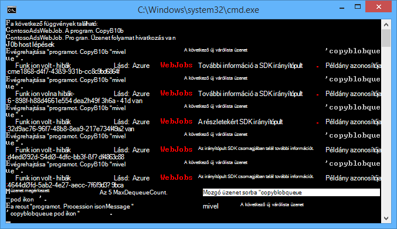
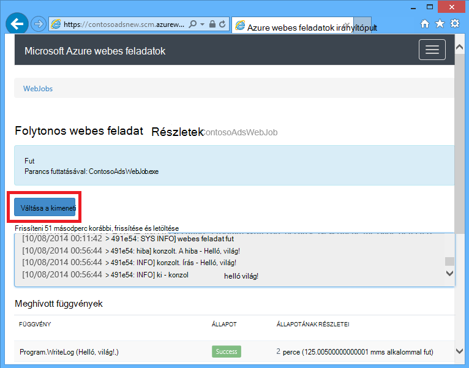
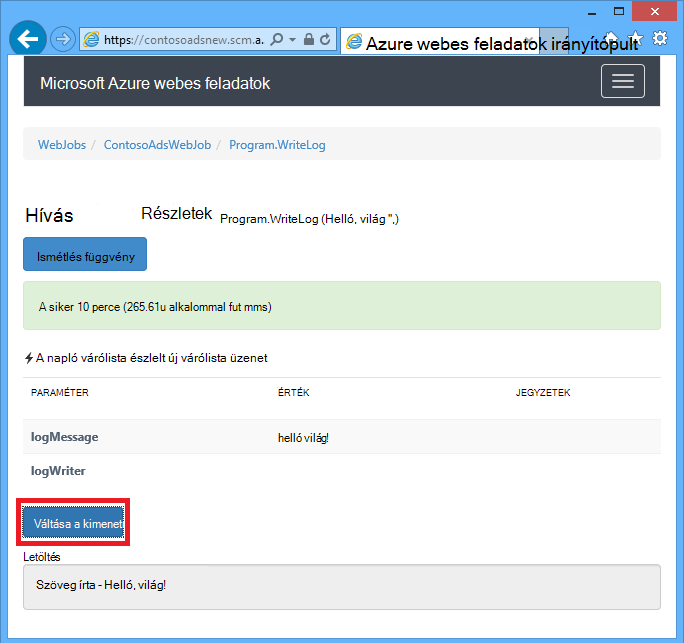
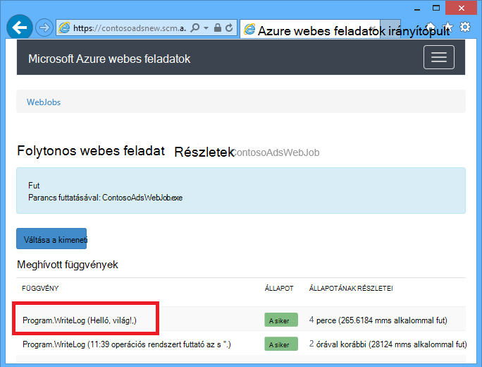
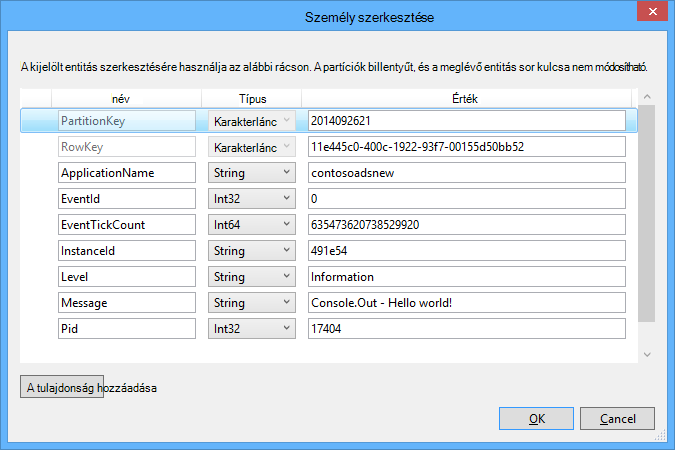
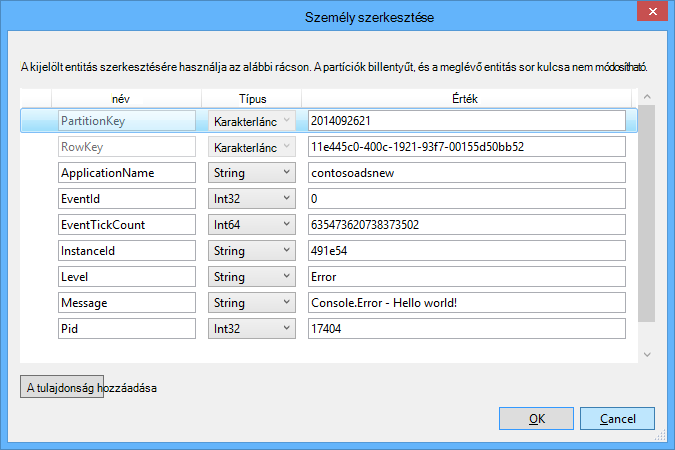

<properties
    pageTitle="Első lépések várólista tárhely és a Visual Studio csatlakoztatott szolgáltatások (WebJob projektek) |} Microsoft Azure"
    description="Hogyan kezdjek hozzá az Azure várólista-tároló WebJob projekt, miután részletesen a tárterület a Visual Studio segítségével a csatlakoztatott szolgáltatások."
    services="storage"
    documentationCenter=""
    authors="TomArcher"
    manager="douge"
    editor=""/>

<tags
    ms.service="storage"
    ms.workload="web"
    ms.tgt_pltfrm="vs-getting-started"
    ms.devlang="na"
    ms.topic="article"
    ms.date="07/18/2016"
    ms.author="tarcher"/>

# Azure várólista tárhely és a Visual Studio első lépések a csatlakoztatott szolgáltatások (WebJob projektek)

[AZURE.INCLUDE [storage-try-azure-tools-queues](../../includes/storage-try-azure-tools-queues.md)]

## – Áttekintés

Ez a cikk ismerteti, hogyan kezdjek hozzá az Azure várólista-tároló Visual Studio Azure WebJob projekt után a korábban létrehozott vagy Azure tároló fiók hivatkozott a **Csatlakoztatott szolgáltatások hozzáadása** a Visual Studio párbeszédpanel használatával. Amikor a tárterület-fiók hozzáadása WebJob projekthez a **Csatlakoztatott szolgáltatások hozzáadása** a Visual Studio párbeszédpanel segítségével, a megfelelő Azure tároló NuGet csomagok vannak telepítve, a megfelelő .NET hivatkozások bekerülnek a projekthez, és a tárterület-fiók csatlakozási karakterláncok frissülnek a App.config fájlban.  

Ebben a cikkben C# kód példák bemutatják, hogyan Azure WebJobs SDK verzióját használja, az Azure várólista tárolási szolgáltatással 1.x.

Azure várólista-tároló olyan szolgáltatás, a nagyszámú bárhol is elérhető a világ keresztül hitelesített hívások HTTP vagy HTTPS üzenetek tárolásához. Egyetlen várólista üzenet mérete legfeljebb 64 KB, és várólista üzenetek, a teljes kapacitásának által tároló fiók felfelé milliónyi is tartalmazhat. Lásd: az [első lépések az Azure várólista tárterület .NET](storage-dotnet-how-to-use-queues.md) további információt. ASP.NET kapcsolatos további tudnivalókért lásd: az [ASP.NET](http://www.asp.net).

## Hogyan indíthatja el a függvény a várakozási üzenet érkezésekor

Ha válaszolni szeretne egy függvényt, amely a WebJobs SDK meghívja várólista üzenet érkezésekor, a **QueueTrigger** attribútum használja. Az attribútum konstruktora karakterlánc paramétert a várólista lekérdezik nevét adja meg. Megtudhatja, hogy miként dinamikusan beállítása a várólista neve, ellenőrizze, [hogy miként állíthatja a beállítási lehetőségek](#how-to-set-configuration-options).

### Karakterlánc üzenetek

A következő példában a sorban a karakterlánc-üzenet tartalmaz, ezért a **QueueTrigger** alkalmazott **logMessage** , amelynek tartalma megegyezik az várólista üzenet nevű karakterlánc paraméter. A függvény [az irányítópult napló üzenet írása](#how-to-write-logs).

        public static void ProcessQueueMessage([QueueTrigger("logqueue")] string logMessage, TextWriter logger)
        {
            logger.WriteLine(logMessage);
        }

**Karakterlánc**mellett a paraméter egy bájt tömböt, egy **CloudQueueMessage** objektum vagy egy POCO, amely csak lehet.

### POCO [(egyszerű régi CLR objektum](http://en.wikipedia.org/wiki/Plain_Old_CLR_Object)) sorba, üzenetek

A következő példában a várólista tartalmazó üzenet JSON **BlobName** tulajdonságait tartalmazó **BlobInformation** objektum. A SDK automatikusan deserializes az objektumot.

        public static void WriteLogPOCO([QueueTrigger("logqueue")] BlobInformation blobInfo, TextWriter logger)
        {
            logger.WriteLine("Queue message refers to blob: " + blobInfo.BlobName);
        }

A SDK csomagjában talál a [Newtonsoft.Json NuGet csomag](http://www.nuget.org/packages/Newtonsoft.Json) szerializálni és üzenetek deszerializálni használja. A program a WebJobs SDK nem használó üzenetek hoz létre, ha például az alábbi példa létrehoz egy POCO várólista üzenetet, amely a SDK is elemezni kód is írhat.

        BlobInformation blobInfo = new BlobInformation() { BlobName = "log.txt" };
        var queueMessage = new CloudQueueMessage(JsonConvert.SerializeObject(blobInfo));
        logQueue.AddMessage(queueMessage);

### Aszinkron függvények

A következő aszinkron függvény [az irányítópult naplózási ír](#how-to-write-logs).

        public async static Task ProcessQueueMessageAsync([QueueTrigger("logqueue")] string logMessage, TextWriter logger)
        {
            await logger.WriteLineAsync(logMessage);
        }

Aszinkron függvények is igénybe vehet a [Lemondás jogkivonat](http://www.asp.net/mvc/overview/performance/using-asynchronous-methods-in-aspnet-mvc-4#CancelToken), amely blob másolja a következő példában látható módon. (A **queueTrigger** helyőrző magyarázatot című [BLOB](#how-to-read-and-write-blobs-and-tables-while-processing-a-queue-message) .)

        public async static Task ProcessQueueMessageAsyncCancellationToken(
            [QueueTrigger("blobcopyqueue")] string blobName,
            [Blob("textblobs/{queueTrigger}",FileAccess.Read)] Stream blobInput,
            [Blob("textblobs/{queueTrigger}-new",FileAccess.Write)] Stream blobOutput,
            CancellationToken token)
        {
            await blobInput.CopyToAsync(blobOutput, 4096, token);
        }

## A QueueTrigger attribútum működik-e a típusai

A következő típusú **QueueTrigger** használhatja:

* **karakterlánc**
* A JSON mint szerializálásának POCO típusú
* **byte]**
* **CloudQueueMessage**

## Lekérdezési algoritmus

A SDK végrehajtja a véletlen exponenciális vissza kikapcsolása algoritmus csökkentheti az üresjárati várólista tároló tranzakció költségekről lekérdezési hatása.  Üzenet érkezése esetén, a SDK két másodpercet vár, és majd keressen egy másik üzenetet; Ha nincs üzenet megtalálható azt vár, körülbelül négy másodperc előtt próbálkozzon újra. Későbbi sikertelen kísérletek várólista üzenet jelenik meg, miután a várakozási idő továbbra is a maximális várakozási idő, amely alapértelmezés szerint egy perc eléréséig nő. [A maximális várakozási idő az állítható be](#how-to-set-configuration-options).

## Több példányban

A web app több példánya fut, ha minden gépen fut a folyamatos WebJobs és az egyes fog megvárja, amíg eseményindítók és megkísérli futtatni a függvények. Bizonyos esetekben vezethet egyes függvényekhez kétszer feldolgozása ugyanazokat az adatokat így függvények kell idempotent (írt, hogy hívja fel őket többször ugyanarra a bemeneti adatokat tartalmazó nem eredményt adja, ismétlődő).  

## A párhuzamos végrehajtása

Ha másik sorban várakozó figyel több függvényt, a SDK visszahívja őket párhuzamosan üzenetek egyidejű érkezésekor.

Ugyanez igaz több üzenetet egyetlen várólista érkezésekor. Alapértelmezés szerint a SDK nagyobb számú 16 üzenetek kap egy időben, és végrehajtja a függvénynek megfelelően párhuzamosan dolgozza fel. [A Köteg mérete nem állítható be](#how-to-set-configuration-options). Ha a szám feldolgozása a tétel méretét a fele esetekben, a a SDK csomagjában talál kap egy másik köteget, és elindítja a feldolgozása azokat az üzeneteket. Egy függvény feldolgozása egyidejű üzenetek maximális száma ezért egy és a felét időpontokat a tétel méretét. Ezt a korlátot minden függvény egy **QueueTrigger** attribútumot tartalmazó külön-külön vonatkozik. Ha nem szeretné, hogy a párhuzamos végrehajtás egyik várakozási a Beérkezett üzenetek, a köteg méretezési 1.

## A várakozási vagy várólista üzenet metaadatok

A következő üzenet tulajdonságok úgy is megnyithatja, hogy paramétereket ad az módszer aláírás:

* **DateTimeOffset** expirationTime
* **DateTimeOffset** insertionTime
* **DateTimeOffset** nextVisibleTime
* **karakterlánc** queueTrigger (üzenet szöveget tartalmaz)
* **karakterlánc** -azonosító
* **karakterlánc** popReceipt
* **int** dequeueCount

Ha szeretne közvetlenül dolgozhat az Azure tároló API, felveheti a **CloudStorageAccount** paraméter is.

Az alábbi példa ír összes a metaadat-információ alkalmazás naplót. A példában szereplő logMessage és a queueTrigger tartalmazzák a várólista üzenet tartalmát.

        public static void WriteLog([QueueTrigger("logqueue")] string logMessage,
            DateTimeOffset expirationTime,
            DateTimeOffset insertionTime,
            DateTimeOffset nextVisibleTime,
            string id,
            string popReceipt,
            int dequeueCount,
            string queueTrigger,
            CloudStorageAccount cloudStorageAccount,
            TextWriter logger)
        {
            logger.WriteLine(
                "logMessage={0}\n" +
            "expirationTime={1}\ninsertionTime={2}\n" +
                "nextVisibleTime={3}\n" +
                "id={4}\npopReceipt={5}\ndequeueCount={6}\n" +
                "queue endpoint={7} queueTrigger={8}",
                logMessage, expirationTime,
                insertionTime,
                nextVisibleTime, id,
                popReceipt, dequeueCount,
                cloudStorageAccount.QueueEndpoint,
                queueTrigger);
        }

Az alábbiakban a példakódot által írt minta naplózási:

        logMessage=Hello world!
        expirationTime=10/14/2014 10:31:04 PM +00:00
        insertionTime=10/7/2014 10:31:04 PM +00:00
        nextVisibleTime=10/7/2014 10:41:23 PM +00:00
        id=262e49cd-26d3-4303-ae88-33baf8796d91
        popReceipt=AgAAAAMAAAAAAAAAfc9H0n/izwE=
        dequeueCount=1
        queue endpoint=https://contosoads.queue.core.windows.net/
        queueTrigger=Hello world!

## Biztonságos leállítása

A folyamatos WebJob futtató függvény elfogadhatja **CancellationToken** paraméter, amely lehetővé teszi az operációs rendszer értesíti a függvény, amikor a WebJob meg kell szüntetni. Ez az értesítés, hogy a függvény nem leállítás váratlanul oly módon, hogy az adatokat hagyja a várttól eltérően működik állapotú is használhatja.

A következő példa bemutatja az függvény a közelgő WebJob lemondási ellenőrzése.

    public static void GracefulShutdownDemo(
                [QueueTrigger("inputqueue")] string inputText,
                TextWriter logger,
                CancellationToken token)
    {
        for (int i = 0; i < 100; i++)
        {
            if (token.IsCancellationRequested)
            {
                logger.WriteLine("Function was cancelled at iteration {0}", i);
                break;
            }
            Thread.Sleep(1000);
            logger.WriteLine("Normal processing for queue message={0}", inputText);
        }
    }

**Megjegyzés:** Az irányítópult nem lehet, hogy helyesen megjelenítése, az állapot és a kimeneti azokat a funkciókat, amelyek le lett állítva.

További tudnivalókért olvassa el a [WebJobs sikeres-e leállás](http://blog.amitapple.com/post/2014/05/webjobs-graceful-shutdown/#.VCt1GXl0wpR)című témakört.   

## Hogyan hozhat létre várólista üzenet várólista üzenet feldolgozása közben

Ha válaszolni szeretne egy funkció, amely létrehoz egy új várólista üzenetet, a **várólista** attribútum használja. **QueueTrigger**, például a várólista nevében karakterláncként adja meg, vagy állíthat be [a várólista neve dinamikusan](#how-to-set-configuration-options).

### Karakterlánc üzenetek

A következő nem aszinkron kód minta üzenetet hoz létre új várólista a ugyanazt a tartalmat, a "inputqueue" nevű várakozási sorban található kapott várólista-üzenet a "outputqueue" nevű várakozási sorban található. (Aszinkron függvények használata **IAsyncCollector<T> ** később ebben a szakaszban látható módon.)

        public static void CreateQueueMessage(
            [QueueTrigger("inputqueue")] string queueMessage,
            [Queue("outputqueue")] out string outputQueueMessage )
        {
            outputQueueMessage = queueMessage;
        }

### POCO [(egyszerű régi CLR objektum](http://en.wikipedia.org/wiki/Plain_Old_CLR_Object)) sorba, üzenetek

Várólista üzenet, amely tartalmazza a karakterlánc, hanem egy POCO létrehozásához adják át kimeneti paraméterként **várólista** attribútum konstruktorának POCO típusát.

        public static void CreateQueueMessage(
            [QueueTrigger("inputqueue")] BlobInformation blobInfoInput,
            [Queue("outputqueue")] out BlobInformation blobInfoOutput )
        {
            blobInfoOutput = blobInfoInput;
        }

A SDK automatikusan serializes JSON az objektumot. A várakozási üzenet mindig létrehozni, akkor is, ha az objektum értéke null.

### Hozzon létre több üzenetet vagy az aszinkron függvények

Több üzenetet létrehozni, azt szeretné, hogy a paraméter típusa, a kimeneti várólista **ICollector<T> ** vagy **IAsyncCollector<T>**, az alábbi példában látható módon.

        public static void CreateQueueMessages(
            [QueueTrigger("inputqueue")] string queueMessage,
            [Queue("outputqueue")] ICollector<string> outputQueueMessage,
            TextWriter logger)
        {
            logger.WriteLine("Creating 2 messages in outputqueue");
            outputQueueMessage.Add(queueMessage + "1");
            outputQueueMessage.Add(queueMessage + "2");
        }

Minden várólista üzenet közvetlenül az **Add** metódussal hívásakor jön létre.

### A várakozási attribútum működik-e a adattípusa

A **várakozási** attribútum a következő paraméterek típusú is használhatja:

* **karakterlánc meg** (létrehoz várólista üzenetet, ha a paraméter értéke nem null a függvény befejeződésekor)
* **byte []** ( **karakterlánc**működése)
* **CloudQueueMessage meg** ( **karakterlánc**működése)
* **POCO meg** (a szerializálható típusú létrehoz egy üzenetet az null objektumot, ha a paraméter értéke null, a függvény befejeződésekor)
* **ICollector**
* **IAsyncCollector**
* **CloudQueue** (az üzenetek manuálisan az Azure tároló API-val közvetlenül készítéséhez)

### WebJobs SDK attribútumok törzsében, a függvény használata

Ha bizonyos munkát, a függvény egy WebJobs SDK attribútum, például **a várakozási**, **Blob**vagy **táblázat**használata előtt kell a **IBinder** felület is használhatja.

A következő példa megnyitja a bemeneti várakozási üzenetben, és létrehoz egy új üzenetet egy kimenet várólista ugyanazt a tartalmat. A kimenet várólista neve a függvénnyel törzsét kód állítja be.

        public static void CreateQueueMessage(
            [QueueTrigger("inputqueue")] string queueMessage,
            IBinder binder)
        {
            string outputQueueName = "outputqueue" + DateTime.Now.Month.ToString();
            QueueAttribute queueAttribute = new QueueAttribute(outputQueueName);
            CloudQueue outputQueue = binder.Bind<CloudQueue>(queueAttribute);
            outputQueue.AddMessage(new CloudQueueMessage(queueMessage));
        }

A **IBinder** felületen is használható a **táblázat** és **Blob** attribútumokkal rendelkező.

## Hogyan olvasása és írása BLOB és táblázatok várólista üzenet feldolgozása közben

A **Blob** és a **táblázat** attribútumok lehetővé teszi olvasása és írása BLOB és a táblázatokat. Ebben a szakaszban a minták BLOB vonatkoznak. Megtudhatja, [hogy miként használhatja a WebJobs SDK csomagjában talál az Azure blob-tárolóhoz](../app-service-web/websites-dotnet-webjobs-sdk-storage-blobs-how-to.md)mintakódok, amelyek bemutatják, hogyan indíthatja el a folyamatok BLOB vannak létrehozásakor vagy frissítésekor, és mintáknál kódot, amely olvasása és írása a táblázatok, megtudhatja, [hogy miként használhatja a WebJobs SDK csomagjában talál az Azure táblatárolóhoz](../app-service-web/websites-dotnet-webjobs-sdk-storage-tables-how-to.md).

### Karakterlánc várólista üzenetei kiváltó blob-műveletek

Várólista üzenet, amely tartalmazza a karakterlánc **queueTrigger** is használhatja, amely tartalmazza az üzenet tartalmát a **Blob** -attribútum **blobPath** paraméter helyőrző.

Az alábbi példában **adatfolyam** -objektumok olvasása és írása BLOB. A várakozási üzenetet pedig a textblobs tárolóban található blob neve. Egy példányát a blob az "– új" fűzött neve ugyanabban a tárolóban jön létre.

        public static void ProcessQueueMessage(
            [QueueTrigger("blobcopyqueue")] string blobName,
            [Blob("textblobs/{queueTrigger}",FileAccess.Read)] Stream blobInput,
            [Blob("textblobs/{queueTrigger}-new",FileAccess.Write)] Stream blobOutput)
        {
            blobInput.CopyTo(blobOutput, 4096);
        }

A **Blob** -attribútum konstruktor **blobPath** paramétert a tárolók és blob nevét adja meg. A helyőrző kapcsolatos további tudnivalókért olvassa el a [használatáról a WebJobs SDK csomagjában talál az Azure blob-tárolóhoz](../app-service-web/websites-dotnet-webjobs-sdk-storage-blobs-how-to.md)című témakört.

Ha az attribútum decorates **adatfolyam** -objektumok, egy másik konstruktor paraméterrel a **FileAccess** mód olvasható, írási és olvasási/írási.

Az alábbi példában egy **CloudBlockBlob** objektum törlése blob. A várakozási üzenetet pedig a blob neve.

        public static void DeleteBlob(
            [QueueTrigger("deleteblobqueue")] string blobName,
            [Blob("textblobs/{queueTrigger}")] CloudBlockBlob blobToDelete)
        {
            blobToDelete.Delete();
        }

### POCO [(egyszerű régi CLR objektum](http://en.wikipedia.org/wiki/Plain_Old_CLR_Object)) sorba, üzenetek

A JSON tárolja a várólista üzenetben POCO használhatja helyőrzők, hogy az objektum neve tulajdonságainak a **várólista** attribútum **blobPath** paraméter. Várólista metaadat-tulajdonságok neve helyőrzőként is használhatja. Lásd: [várólista vagy várólista üzenet metaadatok](#get-queue-or-queue-message-metadata).

A következő példa egy másik kiterjesztésű új blob blob másolja. A várólista üzenet egy **BlobName** és **BlobNameWithoutExtension** tulajdonságokat tartalmazó **BlobInformation** objektum. A tulajdonságok neve helyőrzőként az blob elérési út az **Blob** -attribútumok.

        public static void CopyBlobPOCO(
            [QueueTrigger("copyblobqueue")] BlobInformation blobInfo,
            [Blob("textblobs/{BlobName}", FileAccess.Read)] Stream blobInput,
            [Blob("textblobs/{BlobNameWithoutExtension}.txt", FileAccess.Write)] Stream blobOutput)
        {
            blobInput.CopyTo(blobOutput, 4096);
        }

A SDK csomagjában talál a [Newtonsoft.Json NuGet csomag](http://www.nuget.org/packages/Newtonsoft.Json) szerializálni és üzenetek deszerializálni használja. A program a WebJobs SDK nem használó üzenetek hoz létre, ha például az alábbi példa létrehoz egy POCO várólista üzenetet, amely a SDK is elemezni kód is írhat.

        BlobInformation blobInfo = new BlobInformation() { BlobName = "boot.log", BlobNameWithoutExtension = "boot" };
        var queueMessage = new CloudQueueMessage(JsonConvert.SerializeObject(blobInfo));
        logQueue.AddMessage(queueMessage);

Kell néhány munkavégzés a függvényben kötése blob-objektum előtt, ha az attribútum az függvénnyel törzsét használhatja, [a szervezet, a függvény használata WebJobs SDK attribútumok](#use-webjobs-sdk-attributes-in-the-body-of-a-function)látható módon.

###Használhatja a Blob attribútumot típusai

A **Blob** -attribútum kínál az alábbiak:

* **Adatfolyam** (olvasása és írása, a FileAccess konstruktor paraméterrel megadott)
* **TextReader**
* **TextWriter**
* **karakterlánc** (olvasás)
* **karakterlánc meg** (írjon; blob hoz létre, csak akkor, ha a karakterlánc paraméter esetén nem null függvény)
* POCO (olvasás)
* ki POCO (írás; mindig blob hoz létre, ha POCO paraméter értéke null, ha a függvény értéke null objektumként hoz létre)
* **CloudBlobStream** (írjon)
* **ICloudBlob** (olvasási és írási)
* **CloudBlockBlob** (olvasási és írási)
* **CloudPageBlob** (olvasási és írási)

##Elhalt üzenetek kezelése

Üzenetek, amelynek a tartalmát okoz meghiúsító függvény neve *poison üzeneteket*. Ha a függvény nem sikerül, várólista üzenet a program nem törli, és végül van felvett ismét meg kell ismételni a ciklus okoz. A SDK automatikusan megszakíthatja a ciklus iterációk száma korlátozott számú után, illetve végezheti el azt manuálisan.

### Az üzenetek automatikus poison kezelése

A SDK visszahívja függvény legfeljebb 5 megszorzása várólista üzenet feldolgozása. Ha nem sikerül az ötödik próbálja meg, az üzenet poison várólista kerül. Újrapróbálkozások maximális száma konfigurálása a [konfigurációs beállítások megadásáról](#how-to-set-configuration-options)megjelenik.

A poison várólista nevű *{originalqueuename}*-poison. A naplózás őket, vagy elküldheti a értesítést, hogy kézi figyelmet poison várólista folyamat során függvény van szükség írhat.

A következő példában a **CopyBlob** függvény sikertelen lesz, ha egy várólista üzenetet egy nem létező blob nevét tartalmazza. Ebben az esetben, amikor az üzenet kerül a copyblobqueue sorból a copyblobqueue-mérgezett sorba. A **ProcessPoisonMessage** majd naplózza a poison üzenetet.

        public static void CopyBlob(
            [QueueTrigger("copyblobqueue")] string blobName,
            [Blob("textblobs/{queueTrigger}", FileAccess.Read)] Stream blobInput,
            [Blob("textblobs/{queueTrigger}-new", FileAccess.Write)] Stream blobOutput)
        {
            blobInput.CopyTo(blobOutput, 4096);
        }

        public static void ProcessPoisonMessage(
            [QueueTrigger("copyblobqueue-poison")] string blobName, TextWriter logger)
        {
            logger.WriteLine("Failed to copy blob, name=" + blobName);
        }

Az alábbi ábrán ezeket a funkciókat konzol kimenetét poison üzenetet feldolgozása.

### Kézi elhalt üzenetek kezelése

Az **int** paraméter **dequeueCount** , a függvény neve hozzáadásával hányszor üzenet felvett feldolgozásra elérheti. Kód függvény dequeue megszámlálása, majd végezze el a saját poison üzenetkezelés ezernél több küszöbértéket, amikor a következő példában látható módon.

        public static void CopyBlob(
            [QueueTrigger("copyblobqueue")] string blobName, int dequeueCount,
            [Blob("textblobs/{queueTrigger}", FileAccess.Read)] Stream blobInput,
            [Blob("textblobs/{queueTrigger}-new", FileAccess.Write)] Stream blobOutput,
            TextWriter logger)
        {
            if (dequeueCount > 3)
            {
                logger.WriteLine("Failed to copy blob, name=" + blobName);
            }
            else
            {
            blobInput.CopyTo(blobOutput, 4096);
            }
        }

## Hogyan kell beállítani a beállítási lehetőségek

A **JobHostConfiguration** típus használatával beállítása az alábbi beállítások közül:

* Beállíthatja a SDK a csatlakozási_karakterlánc kódot.
* Állítsa be a **QueueTrigger** beállítások, mint például a maximális száma feldolgozásához.
* Konfigurációs megnyithatja várakozási sorban található neveket.

###A csatlakozási_karakterlánc SDK beállítása a kódot.

A SDK a csatlakozási_karakterlánc beállítása a kód lehetővé teszi, hogy a saját csatlakozási karakterlánc név konfigurációs fájl vagy környezeti változók, az alábbi példában látható módon.

        static void Main(string[] args)
        {
            var _storageConn = ConfigurationManager
                .ConnectionStrings["MyStorageConnection"].ConnectionString;

            var _dashboardConn = ConfigurationManager
                .ConnectionStrings["MyDashboardConnection"].ConnectionString;

            var _serviceBusConn = ConfigurationManager
                .ConnectionStrings["MyServiceBusConnection"].ConnectionString;

            JobHostConfiguration config = new JobHostConfiguration();
            config.StorageConnectionString = _storageConn;
            config.DashboardConnectionString = _dashboardConn;
            config.ServiceBusConnectionString = _serviceBusConn;
            JobHost host = new JobHost(config);
            host.RunAndBlock();
        }

### QueueTrigger beállításainak konfigurálása

Az alábbi beállításokat, a várólista üzenet feldolgozási vonatkozó adhatja meg:

- Üzenetek, a rendszer felvett egyidejű párhuzamosan végrehajtandó maximális száma (az alapértelmezett érték 16).
- Újrapróbálkozások egy poison sorba várólista üzenet elküldése előtt maximális száma (az alapértelmezett érték 5).
- A maximális várakozási időt, mielőtt lekérdezési ismét üres várólista esetén (az alapértelmezett érték 1 perc).

A következő példa bemutatja, hogyan ezeket a beállításokat:

        static void Main(string[] args)
        {
            JobHostConfiguration config = new JobHostConfiguration();
            config.Queues.BatchSize = 8;
            config.Queues.MaxDequeueCount = 4;
            config.Queues.MaxPollingInterval = TimeSpan.FromSeconds(15);
            JobHost host = new JobHost(config);
            host.RunAndBlock();
        }

### Értékek az WebJobs SDK konstruktor paramétereket állíthat a kódot.

Előfordul, hogy szeretne-e megadni, egy várólista egy blob vagy neve vagy tároló, illetve táblázat nevet a merevlemez-kód helyett a kódot. Például érdemes lehet a konfigurációs fájl vagy környezet változóban **QueueTrigger** várólista nevét adja meg.

Műveleteket hajthat végre, amely szerint **NameResolver** objektum átadása **JobHostConfiguration** írja be ide. Készültségi szint (%) jelek WebJobs SDK attribútum konstruktor paraméterek körülvett speciális helyőrzők felvehet, és a **NameResolver** kód határozza meg, a tényleges értékek helyett ezeket a helyőrzők használandó.

Tegyük fel, hogy a tesztkörnyezetben logqueuetest és a gyártási egy névvel ellátott logqueueprod nevű várólista használni kívánt. Helyett egy csomagolásukkor várólista nevet szeretne megadni egy szöveg neve szeretné, hogy a tényleges várólista nevét **appSettings** gyűjteményben. Ha a **appSettings** kulcs logqueue, a függvény ábrája a táblagéptől a következő példa.

        public static void WriteLog([QueueTrigger("%logqueue%")] string logMessage)
        {
            Console.WriteLine(logMessage);
        }

A **NameResolver** osztály sikerült majd kinyerése a várólista neve **appSettings** az alábbi példában látható módon:

        public class QueueNameResolver : INameResolver
        {
            public string Resolve(string name)
            {
                return ConfigurationManager.AppSettings[name].ToString();
            }
        }

Az osztály **NameResolver** átadni a **JobHost** objektum, az alábbi példában látható módon.

        static void Main(string[] args)
        {
            JobHostConfiguration config = new JobHostConfiguration();
            config.NameResolver = new QueueNameResolver();
            JobHost host = new JobHost(config);
            host.RunAndBlock();
        }

**Megjegyzés:** A várakozási, táblázat vagy blob név megoldódott, minden alkalommal, amikor egy függvény neve, de csak akkor, amikor az alkalmazás elindul blob-tárolóhoz nevek szünteti meg. A feladat futtatása közben blob-tárolóhoz név nem módosítható.

## Hogy miként indíthatja el kézzel függvény

Indíthatja el manuálisan a függvény, használja a **hívás** vagy **CallAsync** módszer a **JobHost** objektum és a **NoAutomaticTrigger** attribútum a függvény, az alábbi példában látható módon.

        public class Program
        {
            static void Main(string[] args)
            {
                JobHost host = new JobHost();
                host.Call(typeof(Program).GetMethod("CreateQueueMessage"), new { value = "Hello world!" });
            }

            [NoAutomaticTrigger]
            public static void CreateQueueMessage(
                TextWriter logger,
                string value,
                [Queue("outputqueue")] out string message)
            {
                message = value;
                logger.WriteLine("Creating queue message: ", message);
            }
        }

## Hogyan kell írni a naplók

Az irányítópult naplók látható két helyen: a WebJob a lapot, és az oldal egy adott WebJob meghíváshoz.

Hívja fel a függvényben vagy a **Main()** módszer konzol módszereket kimenetét megjelenik a WebJob az irányítópult lapon, és nem a lap egy meghatározott módszert meghíváshoz a. Az irányítópult oldalát, egy módszer meghíváshoz kimeneti módszer aláírásként paraméter beolvasása TextWriter objektumból jelenik meg.

Konzol kimeneti nem lehet csatolni egy adott módszer meghívását, mivel a konzol egyetlen összefűzött, miközben számos feladat függvény lehet, hogy egy időben futnak. Ezért a SDK minden függvény hívás a saját egyedi naplófájl író objektummal biztosít.

[Alkalmazás nyomkövetési naplók](web-sites-dotnet-troubleshoot-visual-studio.md#logsoverview)írása, használja a **Console.Out** (hoz létre naplókat információ jelöléssel), és **Console.Error** (hoz létre naplókat hiba jelöléssel). Alternatív környezetbe [nyomkövetési vagy TraceSource](http://blogs.msdn.com/b/mcsuksoldev/archive/2014/09/04/adding-trace-to-azure-web-sites-and-web-jobs.aspx), nemcsak a adatai, majd a hiba részletes, figyelmeztető és kritikus szintek nyújt. Alkalmazás nyomkövetési naplók jelennek meg a web app naplófájlokat Azure táblázatok, vagy Azure BLOB-az Azure webalkalmazást beállításaitól függően. Eredménye IGAZ, az összes konzol kimeneti, mint a legutóbbi 100 alkalmazás naplók is megjelennek az irányítópult lapon WebJob, nem az oldal egy függvény meghíváshoz.

Konzol kimeneti jelenik meg, az irányítópult csak akkor, ha a program fut az Azure WebJob nem, ha a program helyben fut, vagy más környezetben.

Naplózás letilthatja az irányítópult kapcsolati karakterlánc null megadásával. További információért témakö [konfigurációs beállítások megadása](#how-to-set-configuration-options).

A következő példa bemutatja a naplók írni többféle módon:

        public static void WriteLog(
            [QueueTrigger("logqueue")] string logMessage,
            TextWriter logger)
        {
            Console.WriteLine("Console.Write - " + logMessage);
            Console.Out.WriteLine("Console.Out - " + logMessage);
            Console.Error.WriteLine("Console.Error - " + logMessage);
            logger.WriteLine("TextWriter - " + logMessage);
        }

A WebJobs SDK irányítópulton a **TextWriter** objektum kimenetének jelenik meg nyissa meg a lapot egy adott függvény meghíváshoz, és válassza a **Váltás a kimenet**:

A WebJobs SDK irányítópulton a legutóbbi 100 sor konzol-kimeneti megjelenítése felfelé esetén nyissa meg a WebJob (nem a függvény a meghívási) a lapját, és válassza a **Váltás kimenet**.

Folytonos WebJob, az alkalmazás naplók jelennek/adatok/feladatok/folyamatos /*{webjobname}*/job_log.txt a web app fájlrendszerben.

        [09/26/2014 21:01:13 > 491e54: INFO] Console.Write - Hello world!
        [09/26/2014 21:01:13 > 491e54: ERR ] Console.Error - Hello world!
        [09/26/2014 21:01:13 > 491e54: INFO] Console.Out - Hello world!

Az egy Azure blob-az alkalmazás naplók így néznek ki: 2014-09-26T21:01:13,Information,contosoadsnew,491e54,635473620738373502,0,17404,17,Console.Write - Helló, világ!, 2014-09-26T21:01:13,Error,contosoadsnew,491e54,635473620738373502,0,17404,19,Console.Error - Helló, világ!, 2014-09-26T21:01:13,Information,contosoadsnew,491e54,635473620738529920,0,17404,17,Console.Out - Helló, világ!,

És az Azure-táblázat a **Console.Out** és **Console.Error** naplók néz ki:

##Következő lépések

Ez a cikk nyújtott mintakódok, amelyek bemutatják, hogyan kezelje a esetei Azure sorban várakozó használata. Azure WebJobs és a WebJobs SDK használatáról további információt az [Azure WebJobs dokumentáció forrásokban](http://go.microsoft.com/fwlink/?linkid=390226)talál.
