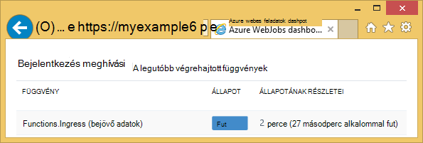
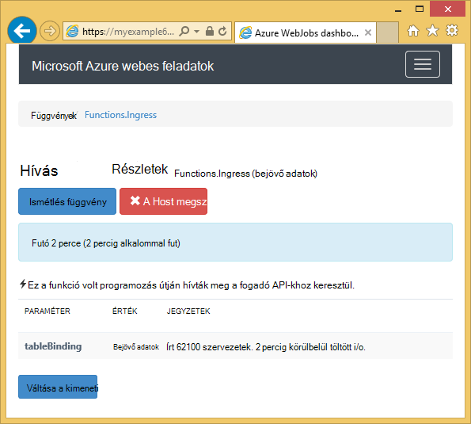
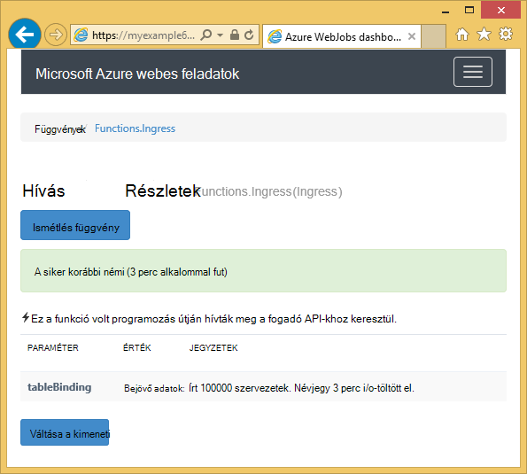

<properties
    pageTitle="Azure tárhely és a Visual Studio első lépések a csatlakoztatott szolgáltatások (WebJob projektek)"
    description="Hogyan kezdjek hozzá az Azure táblatárolóhoz Azure WebJobs projektben, a Visual Studióban, miután részletesen a tárterület a Visual Studio segítségével a csatlakoztatott szolgáltatások"
    services="storage"
    documentationCenter=""
    authors="TomArcher"
    manager="douge"
    editor=""/>

<tags
    ms.service="storage"
    ms.workload="web"
    ms.tgt_pltfrm="vs-getting-started"
    ms.devlang="na"
    ms.topic="article"
    ms.date="07/18/2016"
    ms.author="tarcher"/>

# Első lépések – Azure tároló (Azure WebJob projektek)

[AZURE.INCLUDE [storage-try-azure-tools-tables](../../includes/storage-try-azure-tools-tables.md)]

## – Áttekintés

Ebben a cikkben C# kód példák, amelyek bemutatják, hogyan Azure WebJobs SDK verziójának használatához az Azure-táblából tároló szolgáltatással 1.x. A mintakódok [WebJobs SDK](../app-service-web/websites-dotnet-webjobs-sdk.md) verziójának használatához 1.x.

Az Azure-táblából tároló szolgáltatás lehetővé teszi, hogy strukturált adatok nagy mennyiségű tárolhatja. A szolgáltatás nem egy NoSQL adattárhoz, hogy elfogadja a hitelesített hívásait belüli és kívüli Azure a felhőben. Azure táblák ideálisak strukturált, nem relációs adatok tárolására szolgáló.  Lásd: az [első lépések az Azure táblatárolóhoz .NET használatával](storage-dotnet-how-to-use-tables.md#create-a-table) további információt.

A **táblázat** attribútum, úgynevezett manuálisan, ez azt jelenti, hogy nem valamelyikével az eseményindító attribútumok függvények használt megjelenítése a kódtöredék részét.

## Személyek hozzáadása táblához

Személyek hozzáadása egy táblához, használja a **táblázat** attribútumot egy **ICollector<T> ** vagy **IAsyncCollector<T> ** paraméter, ahol **T** a szervezetek fel szeretné venni a séma Itt adhatja meg. Az attribútum konstruktora paramétert egy karakterlánc, amely megadja annak a táblának a nevére.

A következő kódot minta **személy** személyek hozzáadása a *bejövő adatok*nevű táblázat.

        [NoAutomaticTrigger]
        public static void IngressDemo(
            [Table("Ingress")] ICollector<Person> tableBinding)
        {
            for (int i = 0; i < 100000; i++)
            {
                tableBinding.Add(
                    new Person() {
                        PartitionKey = "Test",
                        RowKey = i.ToString(),
                        Name = "Name" }
                    );
            }
        }

A szokásos **ICollector** használt típusa **TableEntity** származik, illetve **ITableEntity**alkalmazza, de nem kell. A következő **személy** osztályok közül dolgozhat a fenti **bejövő adatok** módszer a kódot.

        public class Person : TableEntity
        {
            public string Name { get; set; }
        }

        public class Person
        {
            public string PartitionKey { get; set; }
            public string RowKey { get; set; }
            public string Name { get; set; }
        }

Ha szeretne közvetlenül dolgozhat az Azure tároló API, **CloudStorageAccount** paraméter hozzáadhatja a módszer aláírást.

## Valós idejű ellenőrzése

Bejövő adatok adatfüggvényei gyakran nagy mennyiségű adattal dolgozza fel, mert a WebJobs SDK irányítópult biztosít a valós idejű adatok: nyomon. A **Bejelentkezés meghívási** szakasz közli, hogy ha továbbra is működik, és a függvény.

A **Meghívási részletek** lap jelentések (írt egységek számát) a függvény előrehaladását, amíg fut, és azt megszakítása lehetőséget biztosít.

Amikor befejeződött a függvényt, a **Meghívási részletei** lapon a jelentések írt sorok számát.

## Több entitás olvasása törlése egy táblázatról

Olvassa el a táblázat, használja a **táblázat** attribútumot egy **IQueryable<T> ** paraméter adott típusú **T** **TableEntity** származik, vagy **ITableEntity**hajtja végre.

A következő kódot példa beolvassa, és minden sor naplózza a **bejövő adatok** táblából:

        public static void ReadTable(
            [Table("Ingress")] IQueryable<Person> tableBinding,
            TextWriter logger)
        {
            var query = from p in tableBinding select p;
            foreach (Person person in query)
            {
                logger.WriteLine("PK:{0}, RK:{1}, Name:{2}",
                    person.PartitionKey, person.RowKey, person.Name);
            }
        }

### Egyetlen egységet olvasása törlése egy táblázatról

Van egy **táblázat** attribútum konstruktora két további paraméterekkel, amelyekkel adja meg a partíciót billentyű és a sor kulcs, ha egy egyszerű táblázatos személyhez kötni szeretné.

A következő kódot minta partíciót billentyűt, és a sor kulcs értékek alapján várólista üzenetben érkezett **személy** entitás táblázatsor felolvassa:  

        public static void ReadTableEntity(
            [QueueTrigger("inputqueue")] Person personInQueue,
            [Table("persontable","{PartitionKey}", "{RowKey}")] Person personInTable,
            TextWriter logger)
        {
            if (personInTable == null)
            {
                logger.WriteLine("Person not found: PK:{0}, RK:{1}",
                        personInQueue.PartitionKey, personInQueue.RowKey);
            }
            else
            {
                logger.WriteLine("Person found: PK:{0}, RK:{1}, Name:{2}",
                        personInTable.PartitionKey, personInTable.RowKey, personInTable.Name);
            }
        }

Ebben a példában a **személy** osztály nincs **ITableEntity**végrehajtásához.

## Hogyan használata a .NET-tároló API-val közvetlenül egy tábla

A **táblázat** attribútum **CloudTable** objektumot tartalmazó táblázat használata rugalmasabb is használhatja.

A következő kódot minta **CloudTable** objektumot egy entitás hozzáadása a *bejövő adatok* tábla használ.

        public static void UseStorageAPI(
            [Table("Ingress")] CloudTable tableBinding,
            TextWriter logger)
        {
            var person = new Person()
                {
                    PartitionKey = "Test",
                    RowKey = "100",
                    Name = "Name"
                };
            TableOperation insertOperation = TableOperation.Insert(person);
            tableBinding.Execute(insertOperation);
        }

A **CloudTable** objektum használatával kapcsolatos további tudnivalókért olvassa el a [Azure táblatárolóhoz .NET használata – első lépések](storage-dotnet-how-to-use-tables.md)című témakört.

## A sorok ennek a cikkben említett kapcsolódó témakörök

Információ arról, hogy miként kezelje a táblázat feldolgozás indított várólista üzenet, illetve WebJobs SDK felhasználási területei nem adott feldolgozás táblát, akkor olvassa el az [Ismerkedés az Azure várólista tárhely és a Visual Studio kapcsolt szolgáltatások (WebJob projektek)](vs-storage-webjobs-getting-started-queues.md).

## Következő lépések

Ez a cikk nyújtott mintakódok, amelyek bemutatják, hogyan kezelheti a esetei Azure táblázatok használata. Azure WebJobs és a WebJobs SDK használatáról további információt az [Azure WebJobs dokumentáció forrásokban](http://go.microsoft.com/fwlink/?linkid=390226)talál.
