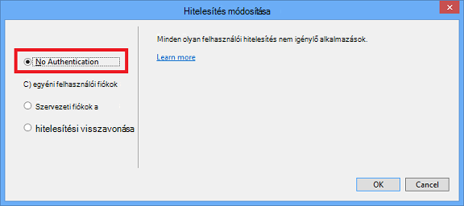

<properties
    pageTitle="Képek markdown létrehozása"
    description="Megtudhatja, hogyan hozhat létre a képeket a markdown beállítása az Azure tárházakban irányelveknek megfelelően."
    services=""
    solutions=""
    documentationCenter=""
    authors="kenhoff"
    manager="ilanas"
    editor="tysonn"/>

<tags
    ms.service="contributor-guide"
    ms.devlang=""
    ms.topic="article"
    ms.tgt_pltfrm=""
    ms.workload=""
    ms.date="06/25/2015"
    ms.author="kenhoff" />

# <a name="create-images-in-markdown"></a>Képek markdown létrehozása

## <a name="image-folder-creation-and-link-syntax"></a>Kép mappa létrehozása és hivatkozás szintaxisa

Az új hozzászólás kell hozzon létre egy mappát a következő helyen található:

    /articles/<service-directory>/media/<article-name>/

Példa:

    /articles/app-service/media/app-service-enterprise-multichannel-apps/

Miután létrehozta a mappát, és a hozzáadott képeket, a következő szintaxissal a cikk képek létrehozása:

```

```
Példa:

Lásd: [a markdown sablon](../markdown%20templates/markdown-template-for-new-articles.md) példát.  A kép mutató hivatkozások találhatók a markdown sablonban célja, hogy a sablon alján kell.

## <a name="guidelines-specific-to-azuremicrosoftcom"></a>Útmutatások azure.microsoft.com jellemző

Képernyőképek jelenleg javasolt, ha nem Reprodukálja lépéseket tartalmazza. Írja be a tartalmakat, hogy a tartalmat anélkül, hogy a számítógépen készített képernyőképeket állhatnak, ha szükséges.

Kövesse az alábbi útmutatásokat, amikor art-fájlok létrehozása és az:
- Nem art-fájlok megosztása dokumentumok között. Másolja a vágólapra a fájlt, van szükség, és vegye fel a media mappa az adott témához. Megosztás fájlok között nem javasolt, mert könnyebben Eltávolítás a tartalom és képek, így az megmarad az repó TISZTÍT kiadásában megszűnt.

- A támogatott fájlformátumok: .png fájlok - használata jobb minőségű, és a minőség karbantartása a honosítási folyamat során. Egyéb fájlformátumok nem őrzik meg azok minőségét is. A .jpeg formátum engedélyezett, de nem előnyben részesített.  Nincs animált GIF-fájlokat.

- A Paint biztosított alapértelmezett szélességének piros négyzetének használata (5 képpont) felhívhatja a figyelmet bizonyos elemek a képernyőképek.  

    Példa:

    

- Ha van ilyesmire lehetőség, nyugodtan képek körülvágása, így a felhasználói felület elemei jelenik meg teljes méretű. Győződjön meg arról, hogy a környezeti nincs bejelölve a felhasználóknak, bár.

- Kerülje a képernyőképek széleit elválasztó karakter. Ha oly módon, hogy háttérszíne fehér elhagyja a szélén képernyőkép levágásához egyetlen képpont szürke köré szegélyt a képet.  A Paint használata esetén a világosabb szürke használja az alapértelmezett színe pallete (0xC3C3C3). Néhány egyéb grafikus alkalmazást használ, az RGB-színeket esetén R195, G195, 195. Kép szegélyének szürke egyszerűen hozzáadhatja a Visio alkalmazásban – ez, jelölje ki a képet, jelölje ki a sort, és győződjön meg arról a a megfelelő színre van állítva, és módosítsa a vonalvastagságot pt 1 1/2.  Képernyőképek 1 szintű képpont szürke szegély kell tartalmaznia, hogy a képernyőképet fehér részeinek nem életlenítés a weblapba.

    Példa:

    
    
    A folyamat a szükséges szegély hozzáadása a képekhez automatizálása érdekében eszköz [AddACOMBorder eszköz - automatizálása való felvételét ACOM képeket a szürke szükséges 1 képpont szegélyt](https://github.com/Azure/Azure-CSI-Content-Tools/tree/master/Tools/AddACOMImageBorder)című témakör tartalmaz.

- Az elválasztó karakter szemléltető képek szükségtelen szürke szegély.  

    Példa:

    

- Lehetőleg ne ellenőrizze túl nagy kép.  Program képek automatikusan átméretezi túl széles hagyják. Azonban előfordul, hogy az átméretezés okoz tűrés, ezért azt javasoljuk, hogy korlátozza-e a képek 780 szélességét képpont és a kézi átméretezése képek szükség esetén elküldése előtt.

- Képernyőképek megjelenítése parancs kimeneti értékeket.  A cikk lépéseit, ahol az a felhasználó dolgozni egy rendszerhéj belül tartalmaz, akkor célszerű megjelenítése parancs a képernyőképek. Ebben az esetben a rendszerhéj szélességét korlátozása körülbelül 72 karakter általában biztosítja, hogy a kép marad a 780 képpont szélesség iránymutatást belül. Mielőtt kimeneti képernyőkép, átméretezhető az ablak érdekében, hogy csak a releváns parancs és a kimeneti (tetszés szerint az üres sor mindkét oldalon).

- A windows Ha lehetséges teljes képernyőképek készítése. Véve látható egy böngészőablakban, amikor méretezze át a böngészőablakot 780 képpont széles vagy annál kisebb, és rövid magasságát a böngésző ablakában, mint a lehető úgy, hogy az alkalmazás az ablak haladják megőrzése.

    Példa:

    

- Milyen információkkal legyen óvatos a képernyőképek ismét megjelenik.  Nem beállíthatja, hogy belső vállalati adatok és személyes információk.

- Conceptual art vagy diagramok használja a hivatalos ikonok felhő és Enterprise szimbólum és ikon megadása. Egy nyilvános set http://aka.ms/CnESymbols címen érhető el.

- Cserélje ki a képernyőképek a személyes és magánjellegű adatok csúcsos zárójelek helyőrző szöveg. Ide tartoznak a felhasználóneveket, előfizetés azonosítók és más kapcsolódó információk. Személyes neveket is kell cserélni egy [jóváhagyott többéves nevét](https://aka.ms/ficticiousnames)(csak alkalmazotthoz hivatkozás). Ne használja a Zsírkréta vagy jelölő tipp a Paintben takarják vagy a személyes és magánjellegű adatok életlenítés.

  Az alábbi képen megfelelően frissült cserélje ki a tényleges **Előfizetés azonosítója** helyőrző:

  

### <a name="contributors-guide-links"></a>Munkatársak naptárának útmutató hivatkozások

- [A cikk – áttekintés](./../README.md)
- [Index útmutatást cikkek](./contributor-guide-index.md)
