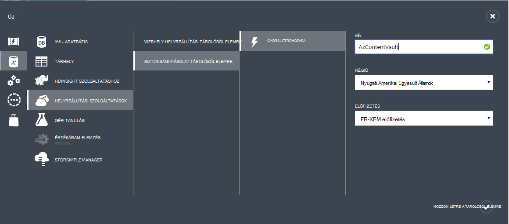
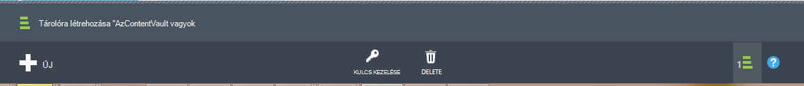

## Hozzon létre egy biztonsági tárolóból elemre
Biztonsági másolatot fájljait és adatait az adatok védelme Manager (DPM) vagy a Windows Server Azure, vagy ha előbb biztonsági másolatot készít IaaS VMs Azure, létre kell hoznia egy biztonsági tárolóból elemre, amelyhez szeretne tárolja az adatokat földrajzi régióban.

Az alábbi lépésekkel végigvezeti a tárolóra biztonsági másolatok tárolja létrehozását.

1. Jelentkezzen be az [adatkezelési portálon](https://manage.windowsazure.com/)
2. Kattintson az **Új** > **Data Services** > **Helyreállítási szolgáltatások** > **Biztonsági másolat tárolóból elemre** , és válassza a **Gyors létrehozásához**.

    

3. A **név** paraméter adja meg a biztonsági másolat tárolóra azonosítása egy rövid nevet. Ez szükséges, az egyes előfizetések egyedinek kell lennie.

4. Jelölje ki a földrajzi területhez tartozik a biztonsági másolat tárolóból elemre az a **régió** paramétert. A választási lehetőségek határozza meg, hogy a földrajzi területhez tartozik, amelyhez a biztonsági másolat adatokat küldi. Tartózkodási hely közelébe földrajzi terület kiválasztása, csökkentheti a hálózati késés, ha előbb biztonsági másolatot készít Azure.

5. Kattintson a munkafolyamat befejezése **Létrehozása tárolóból elemre** . Eltarthat egy ideig a létrehozandó a biztonsági másolat tárolóból elemre. Az állapot ellenőrzése, figyelheti a portálon alján az értesítéseket.

    

6. A biztonsági másolat tárolóra létrehozását követően megjelenő üzenet szerint a tárolóra sikeresen létre. A tárolóból elemre is szerepel a források helyreállítás szolgáltatások **aktív**.

    

### Azure biztonságimásolat - tároló redundancia beállítások

>[AZURE.IMPORTANT] A tároló redundancia beállítás azonosítása érdemes jobbra tárolóra létrehozását követően, de még mielőtt bármilyen gépek regisztrált a tárolóból elemre kattintva. Egy elem van regisztrálva a tárolóból elemre kattintva, amikor a redundancia tárolási lehetőség zárolva van, és nem módosíthatók.

Az üzleti igények meg kell állapítania a tárhely redundancia az Azure biztonsági másolat kódmentes-tárterületét. Ha egy elsődleges biztonsági másolat tárolási végpontjának Azure használja (például biztonsági az Azure a Windows Server), vegye figyelembe Geo felesleges tárolási lehetőség kiválasztása a (alapértelmezett). Ez a **beállítás** lehetőséget a biztonsági másolat tárolóból elemre a látható.

#### GEO felesleges tároló (GRS)
GRS megtartja az adatok hat másolatát. GRS az adatok van replikált háromszor a elsődleges régión belüli és is replikált háromszor egy másodlagos régiójában több száz mérföld az elsődleges régió, a legmagasabb szintű tartóssági nyújtó hagyta. Az elsődleges régió szerint adatainak tárolása GRS, a hiba esetén Azure biztonsági másolat biztosítja, hogy az adatok tartós két külön régióban.

#### Helyi meghajtóra felesleges tároló (LRS)
Helyi meghajtóra felesleges tároló (LRS) fenntartja az adatok három példányát. LRS van replikált háromszor egyetlen létesítmény egy egyetlen területén belül. A normál hardver hibák, de nem az egész Azure eszköznek meghibásodása, LRS védi az adatokat.

Használata Azure egy harmadlagos biztonsági másolat tárolási végpontjának (pl. esetén SCDPM helyi biztonsági másolatot készíteni másolása a helyszíni és Azure használja a hosszú távú adatmegőrzési szükséges), vegye figyelembe helyileg felesleges tároló kiválasztja a biztonsági másolat tárolóra **beállítása** lehetőséget. Ekkor az Azure-adattárolás közben eltarthatóság alacsonyabb szinten kezeléséről az adatok, amely elfogadható harmadlagos másolatok lehet költsége lefelé.

