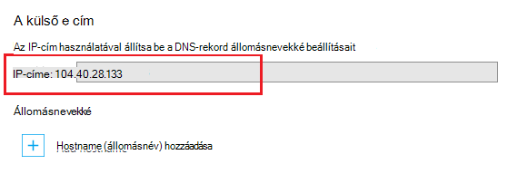

A Domain (DNS) erőforrások keresse meg az internet segítségével. Például ha egy webcímet app a böngészőben adja meg, vagy kattintson a hivatkozás weblapra, az DNS segítségével a tartomány lefordítása IP-címet. Az IP-cím használandó hasonlít a postai címét, de még nem nagyon emberi barátságos. Például érdemes jelentősen megkönnyíti, például **: contoso.com** a tartománynév emlékezni fog, mint amilyen például 192.168.1.88 vagy 2001:0:4137:1f67:24a2:3888:9cce:fea3 IP-cím ne feledje.

A DNS-rendszerben *rekordok*alapul. Rekordok társítása egy egyedi *nevet*(például **contoso.com**), vagy IP-címet, vagy egy másik tartománynév. Ha egy alkalmazást, például egy webböngészőben, egy nevet a DNS-ben keres, megtalálja a rekordot, és használja a függetlenül mutat címként. Ha az érték mutat IP-címet, a böngészőben az, hogy az értéket kell használni. Ha egy másik tartománynév mutat, majd az alkalmazás azt végezze el ismét a felbontás. Végül minden névfeloldás érjen véget az IP-címet.

Az web app alkalmazás szolgáltatásban létrehozásakor a DNS-név automatikusan a web App alkalmazásban. Ez a név formájában történik ** &lt;yourwebappname&gt;. azurewebsites.net**. Van még egy virtuális IP-cím használható létrehozásához a DNS rekordokat, amikor, mutasson a rekordokat hozhat a **. azurewebsites.net**, rámutathat az IP-cím vagy.

> [AZURE.NOTE] Az IP-címét a web app változik, ha törli, és hozza létre a web App alkalmazásban, vagy azt beállítása után **egyszerű**, a **megosztott**és a **normál** **ingyenes** alkalmazás szolgáltatás terv módjának megváltoztatása.

Szintén, többféle típusú rekordok saját függvények és a vonatkozó korlátozások, de web Apps alkalmazások azt csak érdeklő két, *és a *CNAME* * rekordot.

###Cím record (rekord)

Az A rekord rendeli hozzá a tartományt, például: **contoso.com** vagy **www.contoso.com**, *vagy egy helyettesítő tartomány* például ** \*. contoso.com**, IP-cím. Az alkalmazás szolgáltatásban webalkalmazást esetében vagy a szolgáltatás a virtuális IP-címének vagy egy adott IP cím, amikor a webalkalmazás vásárolt.

Az A rekord fölé egy CNAME rekordot a fő előnyei vannak:

* A legfelső szintű tartomány (például **contoso.com)** megfeleltetése IP-címe; sok tartományregisztrálókkal engedélyezése csak a használatával A rekordok

* Lehet, hogy egy bejegyzést, például egy helyettesítő karaktert használó ** \*. contoso.com**, amely szeretné kezelni több alárendelt tartományok, például a **mail.contoso.com**, **blogs.contoso.com**vagy **www.contso.com**kérelem.

> [AZURE.NOTE] Az A rekord van rendelve egy statikus IP-cím, mivel azt nem lehet automatikusan változtatásainak feloldása a webalkalmazás az IP-címére. A rekordok való használatra IP-cím egyéni tartománynév-beállítások a webalkalmazás; konfigurálásakor megadva Ezt az értéket változhat jó helyen jár, ha törli, és hozza létre a web app vagy a **szabad**biztonsági alkalmazás szolgáltatás terv módjának megváltoztatása.

###Alias (CNAME) rekord

A CNAME rekord **mail.contoso.com** vagy **www.contoso.com**, például egy *adott* DNS-név (kanonikus) egy másik tartománynév rendeli hozzá. Az alkalmazás szolgáltatás Web Apps alkalmazások esetében a kanonikus tartománynév van a ** &lt;yourwebappname >. azurewebsites.net** tartomány nevét a web App alkalmazásban. Amikor létrejött, a CNAME alias hoz létre a ** &lt;yourwebappname >. azurewebsites.net** tartomány nevét. A CNAME-bejegyzés fog úgy, hogy az IP-címét a ** &lt;yourwebappname >. azurewebsites.net** tartománynév automatikusan, így ha megváltoztatja a web app IP-címét, nem kell tennie semmit.

> [AZURE.NOTE] Néhány tartományregisztrálói csak teszi altartományokat feleltesse meg egy CNAME rekordot, például **www.contoso.com**, és nem legfelső szintű nevek (például **contoso.com)**használata esetén. További információt a CNAME rekordot a tartományregisztráló, <a href="http://en.wikipedia.org/wiki/CNAME_record">a CNAME rekord Wikipedia-bejegyzés</a>vagy a <a href="http://tools.ietf.org/html/rfc1035">IETF tartománynevek - végrehajtása és a specifikációja</a> dokumentum által biztosított dokumentációjában.

###Web app DNS adatai

Az A rekord a Web Apps alkalmazások használatához, hogy először hozzon létre egyet az alábbi TXT rekordot:

* **A legfelső szintű tartomány** – A DNS-TXT rekord a **@** való ** &lt;yourwebappname&gt;. azurewebsites.net**.

* **Egy adott alszint tartományhoz** – A DNS-neve ** &lt;alszint tartomány >** való ** &lt;yourwebappname&gt;. azurewebsites.net**. Ha például **blogok** **blogs.contoso.com**az A rekordot esetén.

* **A helyettesítő sub dodmains az** – A DNS-TXT-rekord az x az ** &lt;yourwebappname&gt;. azurewebsites.net**.

A TXT rekord, hogy a használni kívánt tartomány tulajdonjogának igazolása szolgál. Ez a az mutatnak a webalkalmazás virtuális IP-címét A rekord létrehozásán.

Az IP-cím talál és **. azurewebsites.net** neveket a webalkalmazás hajt végre az alábbi lépéseket:

1. A böngészőben nyissa meg az [Azure-portálon](https://portal.azure.com).

2. A **Web Apps alkalmazások** lap kattintással jelölje ki azt a web App alkalmazásban, és válassza a lap alján az **egyéni tartományok** gombra.

    

3. Az **egyéni tartományok** lap a virtuális IP-cím fogja látni. Menteni ezt az információt, mert a használandó DNS-rekordok létrehozása

    

    > [AZURE.NOTE] Egy **ingyenes** web app alkalmazással nem használható egyéni tartománynevet, és az alkalmazás szolgáltatáscsomagja frissíteni kell a **megosztott**, **egyszerű**, **normál**vagy **prémium** réteg. További információt az alkalmazás szolgáltatáscsomagja árak rétegek, például hogy miként módosíthatja a árak réteg a web App, megtudhatja, [hogy miként méretezheti web Apps alkalmazások](../articles/web-sites-scale.md).
